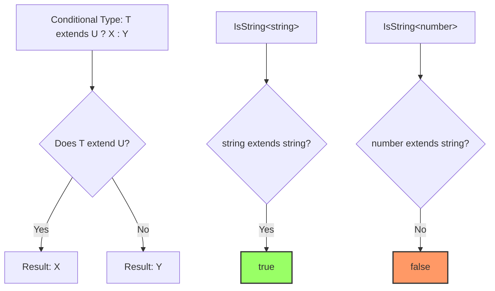
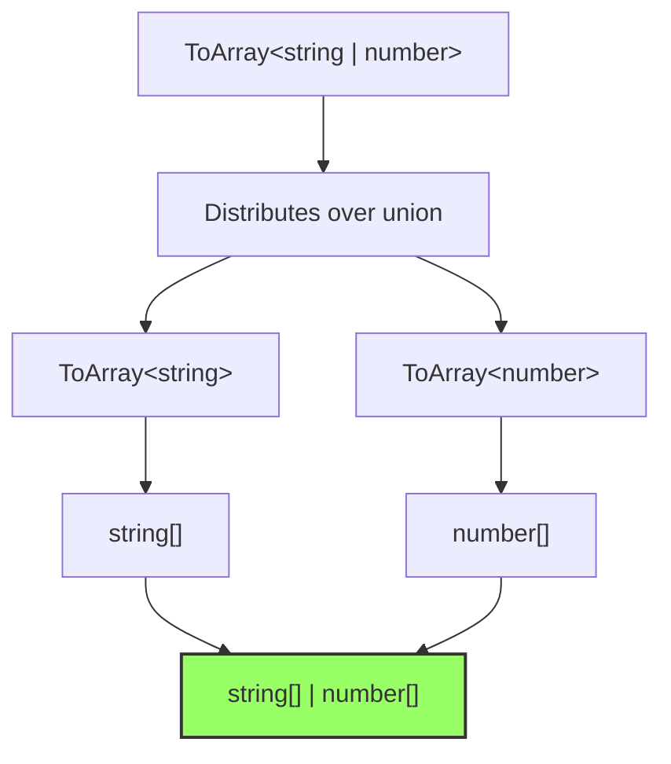
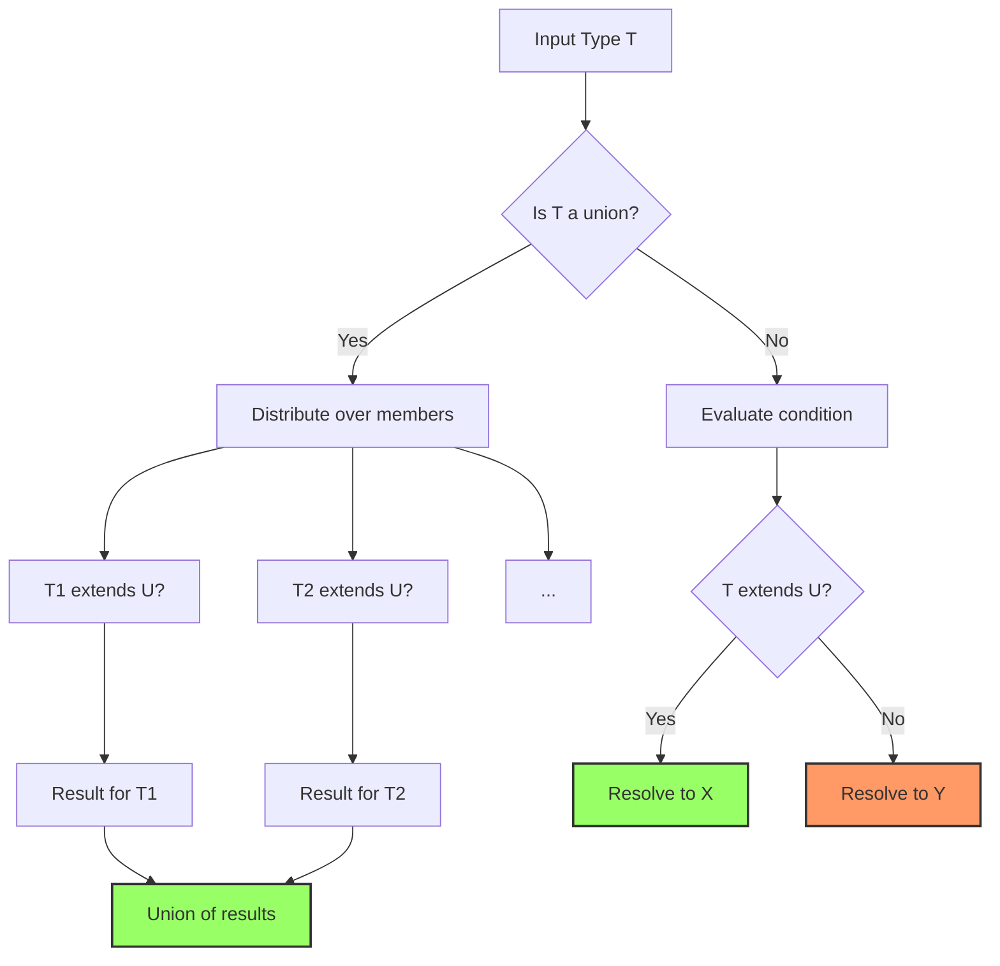

# How to Handle Conditional Types in TypeScript

Author: [nawazdhandala](https://www.github.com/nawazdhandala)

Tags: TypeScript, Types, Generics, Advanced Types, Type System

Description: Master TypeScript conditional types to create flexible and type-safe code that adapts based on input types.

---

Conditional types enable TypeScript to select different types based on conditions, similar to ternary expressions in JavaScript but operating at the type level. This guide covers practical patterns for using conditional types effectively.

## Basic Syntax

Conditional types follow the pattern `T extends U ? X : Y`:

```typescript
// Basic conditional type syntax
// If T extends U, resolve to X; otherwise resolve to Y
type IsString<T> = T extends string ? true : false;

// Usage
type A = IsString<string>;   // true
type B = IsString<number>;   // false
type C = IsString<'hello'>;  // true (string literal extends string)
```



## Built-in Conditional Types

TypeScript provides several utility types built on conditional types:

```typescript
// Extract types that match a condition
type Extract<T, U> = T extends U ? T : never;

// Exclude types that match a condition
type Exclude<T, U> = T extends U ? never : T;

// Remove null and undefined
type NonNullable<T> = T extends null | undefined ? never : T;

// Examples
type Numbers = Extract<string | number | boolean, number>;  // number
type NoStrings = Exclude<string | number | boolean, string>;  // number | boolean
type Defined = NonNullable<string | null | undefined>;  // string
```

## Inferring Types with infer

The `infer` keyword lets you extract types from within a conditional:

```typescript
// Extract the return type of a function
type ReturnType<T> = T extends (...args: any[]) => infer R ? R : never;

// Extract the element type of an array
type ElementType<T> = T extends (infer E)[] ? E : never;

// Extract promise resolution type
type Awaited<T> = T extends Promise<infer R> ? R : T;

// Examples
type Fn = (x: number) => string;
type FnReturn = ReturnType<Fn>;  // string

type Arr = number[];
type ArrElement = ElementType<Arr>;  // number

type Prom = Promise<{ data: string }>;
type PromResult = Awaited<Prom>;  // { data: string }
```

### Multiple infer Positions

You can use `infer` multiple times to extract different parts:

```typescript
// Extract both parameter and return types
type FunctionParts<T> = T extends (arg: infer P) => infer R
  ? { param: P; return: R }
  : never;

type Parts = FunctionParts<(x: number) => string>;
// { param: number; return: string }

// Extract key and value from Map
type MapTypes<T> = T extends Map<infer K, infer V>
  ? { key: K; value: V }
  : never;

type MyMap = Map<string, number>;
type MapParts = MapTypes<MyMap>;  // { key: string; value: number }
```

## Distributive Conditional Types

When a conditional type acts on a union, it distributes over each member:

```typescript
// This distributes over unions
type ToArray<T> = T extends any ? T[] : never;

// With a union input:
type Result = ToArray<string | number>;
// Distributes: ToArray<string> | ToArray<number>
// Result: string[] | number[]

// NOT: (string | number)[]
```



### Preventing Distribution

Wrap the type in a tuple to prevent distribution:

```typescript
// Distributive (default behavior)
type ToArrayDistributive<T> = T extends any ? T[] : never;

// Non-distributive (wrapped in tuple)
type ToArrayNonDistributive<T> = [T] extends [any] ? T[] : never;

// Comparison
type A = ToArrayDistributive<string | number>;     // string[] | number[]
type B = ToArrayNonDistributive<string | number>;  // (string | number)[]
```

## Practical Patterns

### Pattern 1: Type Guards

Create types that change based on runtime checks:

```typescript
// API response that varies by status
type ApiResponse<T, Success extends boolean> = Success extends true
  ? { success: true; data: T }
  : { success: false; error: string };

// Function overloads using conditional return
function fetchData<T>(url: string): Promise<ApiResponse<T, boolean>>;
function fetchData<T>(url: string): Promise<ApiResponse<T, true> | ApiResponse<T, false>> {
  // Implementation returns either success or error response
  return fetch(url)
    .then(res => res.json())
    .then(data => ({ success: true as const, data }))
    .catch(err => ({ success: false as const, error: err.message }));
}

// Usage with narrowing
async function getData() {
  const response = await fetchData<{ id: number }>('/api/data');

  if (response.success) {
    // TypeScript knows: response.data exists
    console.log(response.data.id);
  } else {
    // TypeScript knows: response.error exists
    console.log(response.error);
  }
}
```

### Pattern 2: Property Selection

Select properties based on their types:

```typescript
// Get keys where the value extends a certain type
type KeysOfType<T, V> = {
  [K in keyof T]: T[K] extends V ? K : never;
}[keyof T];

// Get keys where the value is a function
type FunctionKeys<T> = KeysOfType<T, (...args: any[]) => any>;

// Get keys where the value is not a function
type NonFunctionKeys<T> = {
  [K in keyof T]: T[K] extends (...args: any[]) => any ? never : K;
}[keyof T];

// Example
interface User {
  id: number;
  name: string;
  email: string;
  greet: () => string;
  save: () => Promise<void>;
}

type UserFunctions = FunctionKeys<User>;     // "greet" | "save"
type UserProperties = NonFunctionKeys<User>;  // "id" | "name" | "email"
```

### Pattern 3: Deep Type Transformation

Transform nested types recursively:

```typescript
// Make all properties optional recursively
type DeepPartial<T> = T extends object
  ? { [P in keyof T]?: DeepPartial<T[P]> }
  : T;

// Make all properties required recursively
type DeepRequired<T> = T extends object
  ? { [P in keyof T]-?: DeepRequired<T[P]> }
  : T;

// Make all properties readonly recursively
type DeepReadonly<T> = T extends object
  ? { readonly [P in keyof T]: DeepReadonly<T[P]> }
  : T;

// Example
interface Config {
  server: {
    host: string;
    port: number;
    ssl?: {
      cert: string;
      key: string;
    };
  };
}

type PartialConfig = DeepPartial<Config>;
// All nested properties are optional

type RequiredConfig = DeepRequired<Config>;
// All nested properties are required, including ssl
```

### Pattern 4: Conditional Return Types

Change function return types based on input:

```typescript
// Return type changes based on the 'format' parameter
type FormatResult<F extends 'json' | 'string' | 'buffer'> =
  F extends 'json' ? object :
  F extends 'string' ? string :
  F extends 'buffer' ? Buffer :
  never;

function readFile<F extends 'json' | 'string' | 'buffer'>(
  path: string,
  format: F
): FormatResult<F> {
  // Implementation would handle each format
  throw new Error('Not implemented');
}

// Type-safe usage
const json = readFile('data.json', 'json');    // object
const text = readFile('data.txt', 'string');   // string
const buf = readFile('data.bin', 'buffer');    // Buffer
```

### Pattern 5: Filtering Union Members

Create types that filter unions based on properties:

```typescript
// Event types with different payloads
type Event =
  | { type: 'click'; x: number; y: number }
  | { type: 'keypress'; key: string }
  | { type: 'scroll'; position: number };

// Extract event by type
type EventByType<T extends Event['type']> = Extract<Event, { type: T }>;

type ClickEvent = EventByType<'click'>;  // { type: 'click'; x: number; y: number }

// Handler map with correct payload types
type EventHandlers = {
  [E in Event as E['type']]: (event: E) => void;
};
// {
//   click: (event: { type: 'click'; x: number; y: number }) => void;
//   keypress: (event: { type: 'keypress'; key: string }) => void;
//   scroll: (event: { type: 'scroll'; position: number }) => void;
// }
```

## Advanced Techniques

### Recursive Conditional Types

Handle deeply nested structures:

```typescript
// Flatten nested arrays to any depth
type Flatten<T> = T extends Array<infer R>
  ? Flatten<R>
  : T;

type Nested = number[][][];
type Flat = Flatten<Nested>;  // number

// Unwrap all promise layers
type DeepAwaited<T> = T extends Promise<infer R>
  ? DeepAwaited<R>
  : T;

type NestedPromise = Promise<Promise<Promise<string>>>;
type Resolved = DeepAwaited<NestedPromise>;  // string
```

### Template Literal Conditionals

Combine conditional types with template literals:

```typescript
// Extract route parameters
type ExtractParams<T extends string> =
  T extends `${string}:${infer Param}/${infer Rest}`
    ? Param | ExtractParams<Rest>
    : T extends `${string}:${infer Param}`
      ? Param
      : never;

type Route = '/users/:userId/posts/:postId';
type Params = ExtractParams<Route>;  // "userId" | "postId"

// Create typed route handler
type RouteParams<T extends string> = {
  [K in ExtractParams<T>]: string;
};

type UserPostParams = RouteParams<Route>;
// { userId: string; postId: string }
```

### Conditional Type Constraints

Use extends in both directions:

```typescript
// Ensure T has a specific property
type HasId<T> = T extends { id: infer I } ? I : never;

type UserId = HasId<{ id: number; name: string }>;  // number
type NoId = HasId<{ name: string }>;  // never

// Constrain based on conditional result
type MustHaveId<T> = HasId<T> extends never
  ? never
  : T;

// Only accepts types with an id property
type Valid = MustHaveId<{ id: number }>;    // { id: number }
type Invalid = MustHaveId<{ name: string }>;  // never
```

## Type Resolution Flow



## Common Pitfalls

### Pitfall 1: Unexpected Distribution

```typescript
// This distributes unexpectedly
type CheckArray<T> = T extends any[] ? 'array' : 'not array';

type Result = CheckArray<string[] | number>;
// Expected: 'array' | 'not array' (distributed)
// This is correct behavior but often surprises developers

// To check the union as a whole, prevent distribution
type CheckArrayWhole<T> = [T] extends [any[]] ? 'array' : 'not array';

type Result2 = CheckArrayWhole<string[] | number>;  // 'not array'
```

### Pitfall 2: never in Conditionals

```typescript
// never distributes to nothing
type Test<T> = T extends string ? T : never;

type Result = Test<never>;  // never (empty distribution)

// Check for never explicitly
type IsNever<T> = [T] extends [never] ? true : false;

type A = IsNever<never>;  // true
type B = IsNever<string>;  // false
```

### Pitfall 3: Infer Position Matters

```typescript
// Infer in contravariant position (function parameters)
type ParamType<T> = T extends (x: infer P) => any ? P : never;

// With union of functions, parameters become intersection
type Fn1 = (x: string) => void;
type Fn2 = (x: number) => void;

type Param = ParamType<Fn1 | Fn2>;  // string & number = never
// Not string | number as you might expect
```

## Summary Table

| Pattern | Use Case | Example |
|---------|----------|---------|
| Basic conditional | Type selection | `T extends U ? X : Y` |
| infer keyword | Type extraction | `T extends Array<infer E> ? E : never` |
| Distribution | Transform union members | `T extends any ? T[] : never` |
| Non-distributive | Check whole union | `[T] extends [U] ? X : Y` |
| Recursive | Deep transformation | `T extends object ? { [K in keyof T]: Deep<T[K]> } : T` |

## Conclusion

Conditional types are one of TypeScript's most powerful features for creating flexible, type-safe code. Key takeaways:

1. Use `extends` to check type relationships
2. Use `infer` to extract nested types
3. Remember that conditional types distribute over unions by default
4. Wrap in tuples to prevent distribution when needed
5. Combine with mapped types and template literals for advanced patterns

Mastering conditional types enables you to create APIs that adapt their types based on usage, catching errors at compile time that would otherwise surface at runtime.
