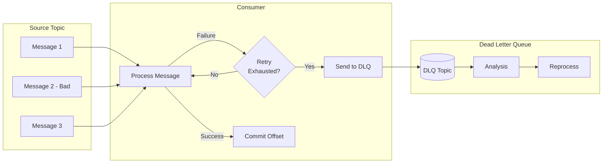
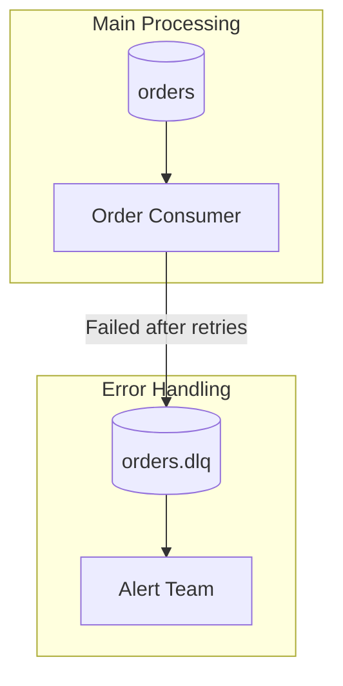
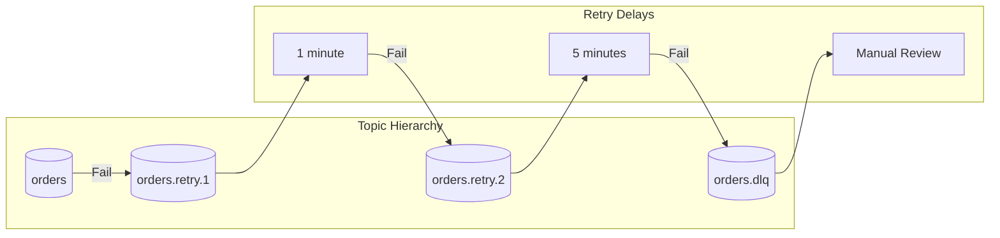
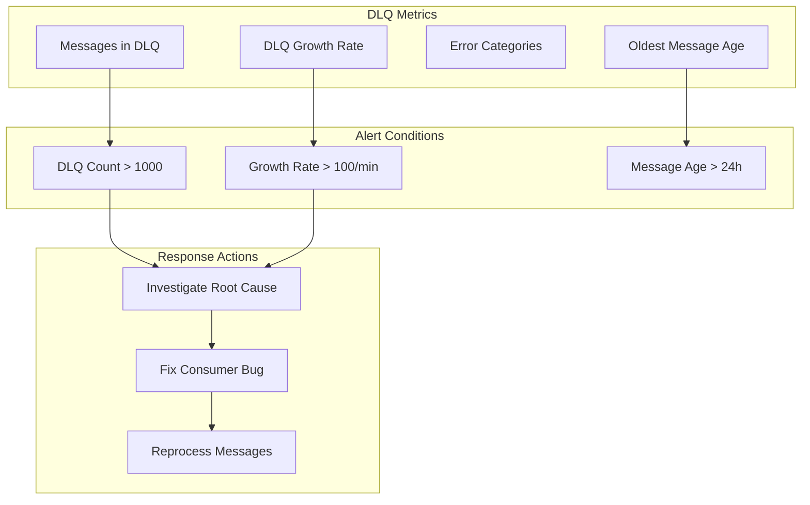

# How to Handle Dead Letter Queues in Kafka

Author: [nawazdhandala](https://www.github.com/nawazdhandala)

Tags: Kafka, Dead Letter Queue, DLQ, Error Handling, Message Processing, Fault Tolerance, Consumer

Description: A comprehensive guide to implementing Dead Letter Queues in Apache Kafka for handling failed messages, including retry strategies and monitoring.

---

Dead Letter Queues (DLQs) are essential for building resilient Kafka applications. When a consumer cannot process a message after multiple attempts, the message is routed to a DLQ for later analysis and reprocessing. This guide covers implementation patterns, retry strategies, and best practices for DLQ handling in Kafka.

## What is a Dead Letter Queue?

A Dead Letter Queue captures messages that cannot be processed successfully. Instead of blocking the consumer or losing the message, failed messages are sent to a separate topic for investigation.



## DLQ Architecture Patterns

### Pattern 1: Simple DLQ



### Pattern 2: Tiered Retry with DLQ



## Basic DLQ Implementation

### Java Implementation

```java
import org.apache.kafka.clients.consumer.*;
import org.apache.kafka.clients.producer.*;
import org.apache.kafka.common.header.internals.RecordHeader;
import java.time.Duration;
import java.util.*;

public class DLQConsumer {

    private final KafkaConsumer<String, String> consumer;
    private final KafkaProducer<String, String> dlqProducer;
    private final String sourceTopic;
    private final String dlqTopic;
    private final int maxRetries;

    public DLQConsumer(Properties consumerProps, Properties producerProps,
                       String sourceTopic, int maxRetries) {
        this.consumer = new KafkaConsumer<>(consumerProps);
        this.dlqProducer = new KafkaProducer<>(producerProps);
        this.sourceTopic = sourceTopic;
        this.dlqTopic = sourceTopic + ".dlq";
        this.maxRetries = maxRetries;

        consumer.subscribe(Collections.singletonList(sourceTopic));
    }

    /**
     * Main processing loop with DLQ support.
     */
    public void process() {
        while (true) {
            ConsumerRecords<String, String> records = consumer.poll(Duration.ofMillis(100));

            for (ConsumerRecord<String, String> record : records) {
                processWithRetry(record);
            }

            // Commit after processing batch
            consumer.commitSync();
        }
    }

    /**
     * Process a record with retry logic.
     * Failed messages are sent to DLQ after max retries.
     */
    private void processWithRetry(ConsumerRecord<String, String> record) {
        int attempt = 0;
        Exception lastException = null;

        while (attempt < maxRetries) {
            try {
                // Attempt to process the message
                processMessage(record);
                return; // Success - exit retry loop
            } catch (Exception e) {
                attempt++;
                lastException = e;
                System.err.printf("Processing failed (attempt %d/%d): %s%n",
                    attempt, maxRetries, e.getMessage());

                // Exponential backoff between retries
                if (attempt < maxRetries) {
                    sleep(Math.min(1000 * (long) Math.pow(2, attempt), 30000));
                }
            }
        }

        // All retries exhausted - send to DLQ
        sendToDLQ(record, lastException, attempt);
    }

    /**
     * Process the message (implement your business logic here).
     */
    private void processMessage(ConsumerRecord<String, String> record) throws Exception {
        // Your processing logic
        System.out.printf("Processing: key=%s, value=%s%n",
            record.key(), record.value());

        // Simulate occasional failures for demonstration
        if (record.value().contains("FAIL")) {
            throw new RuntimeException("Simulated processing failure");
        }
    }

    /**
     * Send failed message to Dead Letter Queue with error metadata.
     */
    private void sendToDLQ(ConsumerRecord<String, String> record,
                           Exception exception, int attempts) {
        try {
            // Create DLQ record with error information in headers
            List<org.apache.kafka.common.header.Header> headers = new ArrayList<>();

            // Add original topic information
            headers.add(new RecordHeader("dlq.original.topic",
                record.topic().getBytes()));
            headers.add(new RecordHeader("dlq.original.partition",
                String.valueOf(record.partition()).getBytes()));
            headers.add(new RecordHeader("dlq.original.offset",
                String.valueOf(record.offset()).getBytes()));
            headers.add(new RecordHeader("dlq.original.timestamp",
                String.valueOf(record.timestamp()).getBytes()));

            // Add error information
            headers.add(new RecordHeader("dlq.error.message",
                exception.getMessage().getBytes()));
            headers.add(new RecordHeader("dlq.error.class",
                exception.getClass().getName().getBytes()));
            headers.add(new RecordHeader("dlq.retry.count",
                String.valueOf(attempts).getBytes()));
            headers.add(new RecordHeader("dlq.timestamp",
                String.valueOf(System.currentTimeMillis()).getBytes()));

            // Copy original headers
            record.headers().forEach(h ->
                headers.add(new RecordHeader("original." + h.key(), h.value())));

            // Create and send DLQ record
            ProducerRecord<String, String> dlqRecord = new ProducerRecord<>(
                dlqTopic,
                null,
                record.key(),
                record.value(),
                headers
            );

            dlqProducer.send(dlqRecord, (metadata, error) -> {
                if (error != null) {
                    System.err.printf("Failed to send to DLQ: %s%n", error.getMessage());
                } else {
                    System.out.printf("Sent to DLQ: topic=%s, partition=%d, offset=%d%n",
                        metadata.topic(), metadata.partition(), metadata.offset());
                }
            });

        } catch (Exception e) {
            System.err.printf("Critical: Failed to send to DLQ: %s%n", e.getMessage());
            // Consider alerting or alternative error handling
        }
    }

    private void sleep(long ms) {
        try {
            Thread.sleep(ms);
        } catch (InterruptedException e) {
            Thread.currentThread().interrupt();
        }
    }

    public void close() {
        consumer.close();
        dlqProducer.close();
    }
}
```

### Python Implementation

```python
from kafka import KafkaConsumer, KafkaProducer
import json
import time
import traceback
from datetime import datetime

class DLQConsumer:
    def __init__(self, source_topic, bootstrap_servers, group_id, max_retries=3):
        self.source_topic = source_topic
        self.dlq_topic = f"{source_topic}.dlq"
        self.max_retries = max_retries

        # Create consumer
        self.consumer = KafkaConsumer(
            source_topic,
            bootstrap_servers=bootstrap_servers,
            group_id=group_id,
            # Manual commit for better control
            enable_auto_commit=False,
            # Deserialize JSON values
            value_deserializer=lambda m: json.loads(m.decode('utf-8')),
            # Start from earliest if no offset exists
            auto_offset_reset='earliest'
        )

        # Create producer for DLQ
        self.producer = KafkaProducer(
            bootstrap_servers=bootstrap_servers,
            value_serializer=lambda m: json.dumps(m).encode('utf-8'),
            # Ensure DLQ messages are durably written
            acks='all'
        )

    def process(self):
        """Main processing loop."""
        try:
            for message in self.consumer:
                self._process_with_retry(message)
                # Commit after each successful message
                self.consumer.commit()
        except KeyboardInterrupt:
            print("Shutting down consumer...")
        finally:
            self.close()

    def _process_with_retry(self, message):
        """Process message with retry logic."""
        attempt = 0
        last_error = None

        while attempt < self.max_retries:
            try:
                self._process_message(message)
                return  # Success
            except Exception as e:
                attempt += 1
                last_error = e
                print(f"Processing failed (attempt {attempt}/{self.max_retries}): {e}")

                if attempt < self.max_retries:
                    # Exponential backoff
                    sleep_time = min(2 ** attempt, 30)
                    time.sleep(sleep_time)

        # Send to DLQ after retries exhausted
        self._send_to_dlq(message, last_error, attempt)

    def _process_message(self, message):
        """Implement your business logic here."""
        value = message.value
        print(f"Processing: key={message.key}, value={value}")

        # Simulate failure for demonstration
        if value.get('status') == 'INVALID':
            raise ValueError(f"Invalid message status: {value}")

    def _send_to_dlq(self, message, error, attempts):
        """Send failed message to DLQ with metadata."""
        dlq_message = {
            'original_message': message.value,
            'error': {
                'message': str(error),
                'type': type(error).__name__,
                'traceback': traceback.format_exc()
            },
            'metadata': {
                'original_topic': message.topic,
                'original_partition': message.partition,
                'original_offset': message.offset,
                'original_timestamp': message.timestamp,
                'retry_count': attempts,
                'dlq_timestamp': datetime.utcnow().isoformat()
            }
        }

        # Send to DLQ
        future = self.producer.send(
            self.dlq_topic,
            key=message.key,
            value=dlq_message
        )

        try:
            # Wait for confirmation
            record_metadata = future.get(timeout=10)
            print(f"Sent to DLQ: topic={record_metadata.topic}, "
                  f"partition={record_metadata.partition}, "
                  f"offset={record_metadata.offset}")
        except Exception as e:
            print(f"Failed to send to DLQ: {e}")

    def close(self):
        """Clean up resources."""
        self.consumer.close()
        self.producer.close()


# Usage
if __name__ == "__main__":
    consumer = DLQConsumer(
        source_topic="orders",
        bootstrap_servers=["localhost:9092"],
        group_id="order-processor",
        max_retries=3
    )
    consumer.process()
```

## Spring Kafka DLQ Implementation

Spring Kafka provides built-in DLQ support:

```java
import org.apache.kafka.clients.consumer.ConsumerRecord;
import org.springframework.kafka.annotation.KafkaListener;
import org.springframework.kafka.core.KafkaTemplate;
import org.springframework.kafka.listener.DeadLetterPublishingRecoverer;
import org.springframework.kafka.listener.DefaultErrorHandler;
import org.springframework.kafka.support.Acknowledgment;
import org.springframework.util.backoff.FixedBackOff;
import org.springframework.context.annotation.Bean;
import org.springframework.context.annotation.Configuration;

@Configuration
public class KafkaDLQConfig {

    /**
     * Configure error handler with DLQ support.
     */
    @Bean
    public DefaultErrorHandler errorHandler(KafkaTemplate<String, String> template) {
        // Create DLQ recoverer - sends to original-topic.DLT
        DeadLetterPublishingRecoverer recoverer = new DeadLetterPublishingRecoverer(
            template,
            // Custom topic naming: original-topic -> original-topic.dlq
            (record, exception) -> new TopicPartition(
                record.topic() + ".dlq",
                record.partition()
            )
        );

        // Configure retry with fixed backoff
        // 3 retries with 1 second between attempts
        FixedBackOff backOff = new FixedBackOff(1000L, 3L);

        DefaultErrorHandler errorHandler = new DefaultErrorHandler(recoverer, backOff);

        // Configure which exceptions should not be retried
        errorHandler.addNotRetryableExceptions(
            IllegalArgumentException.class,
            NullPointerException.class
        );

        return errorHandler;
    }
}

@Service
public class OrderConsumer {

    private static final Logger log = LoggerFactory.getLogger(OrderConsumer.class);

    /**
     * Main consumer - processes orders from the orders topic.
     */
    @KafkaListener(topics = "orders", groupId = "order-processor")
    public void processOrder(ConsumerRecord<String, String> record,
                             Acknowledgment ack) {
        log.info("Processing order: key={}, value={}",
            record.key(), record.value());

        // Your business logic here
        Order order = parseOrder(record.value());
        validateOrder(order);
        saveOrder(order);

        // Acknowledge successful processing
        ack.acknowledge();
    }

    /**
     * DLQ consumer - handles failed messages.
     */
    @KafkaListener(topics = "orders.dlq", groupId = "order-dlq-processor")
    public void processDLQ(ConsumerRecord<String, String> record,
                           Acknowledgment ack) {
        log.warn("Received DLQ message: key={}, value={}",
            record.key(), record.value());

        // Log headers for debugging
        record.headers().forEach(header ->
            log.info("DLQ Header: {}={}", header.key(),
                new String(header.value())));

        // Store for manual review or alerting
        saveToDLQStore(record);

        ack.acknowledge();
    }
}
```

### Spring Boot Configuration

```yaml
# application.yml
spring:
  kafka:
    bootstrap-servers: localhost:9092
    consumer:
      group-id: order-processor
      auto-offset-reset: earliest
      enable-auto-commit: false
      key-deserializer: org.apache.kafka.common.serialization.StringDeserializer
      value-deserializer: org.apache.kafka.common.serialization.StringDeserializer
    producer:
      key-serializer: org.apache.kafka.common.serialization.StringSerializer
      value-serializer: org.apache.kafka.common.serialization.StringSerializer
      acks: all
    listener:
      ack-mode: manual
      concurrency: 3
```

## Tiered Retry Pattern

Implement multiple retry topics with increasing delays:

```java
import java.util.*;

public class TieredRetryConsumer {

    // Retry configuration: topic suffix and delay in seconds
    private static final List<RetryTier> RETRY_TIERS = Arrays.asList(
        new RetryTier("retry.1", 60),      // 1 minute
        new RetryTier("retry.2", 300),     // 5 minutes
        new RetryTier("retry.3", 1800)     // 30 minutes
    );

    private final String baseTopic;
    private final KafkaConsumer<String, String> consumer;
    private final KafkaProducer<String, String> producer;

    static class RetryTier {
        final String suffix;
        final int delaySeconds;

        RetryTier(String suffix, int delaySeconds) {
            this.suffix = suffix;
            this.delaySeconds = delaySeconds;
        }
    }

    public TieredRetryConsumer(String baseTopic, Properties consumerProps,
                                Properties producerProps) {
        this.baseTopic = baseTopic;
        this.consumer = new KafkaConsumer<>(consumerProps);
        this.producer = new KafkaProducer<>(producerProps);

        // Subscribe to main topic and all retry topics
        List<String> topics = new ArrayList<>();
        topics.add(baseTopic);
        for (RetryTier tier : RETRY_TIERS) {
            topics.add(baseTopic + "." + tier.suffix);
        }
        consumer.subscribe(topics);
    }

    /**
     * Process messages from all tiers.
     */
    public void process() {
        while (true) {
            ConsumerRecords<String, String> records = consumer.poll(Duration.ofMillis(100));

            for (ConsumerRecord<String, String> record : records) {
                // Check if message is ready for processing (delay expired)
                if (isReadyForProcessing(record)) {
                    processWithTieredRetry(record);
                }
            }

            consumer.commitSync();
        }
    }

    /**
     * Check if message delay has expired.
     */
    private boolean isReadyForProcessing(ConsumerRecord<String, String> record) {
        org.apache.kafka.common.header.Header delayHeader =
            record.headers().lastHeader("retry.process.after");

        if (delayHeader == null) {
            return true; // No delay header - process immediately
        }

        long processAfter = Long.parseLong(new String(delayHeader.value()));
        return System.currentTimeMillis() >= processAfter;
    }

    /**
     * Process with tiered retry escalation.
     */
    private void processWithTieredRetry(ConsumerRecord<String, String> record) {
        try {
            processMessage(record);
        } catch (Exception e) {
            int currentTier = getCurrentTier(record);

            if (currentTier < RETRY_TIERS.size()) {
                // Send to next retry tier
                sendToRetryTier(record, currentTier, e);
            } else {
                // All retries exhausted - send to DLQ
                sendToDLQ(record, e);
            }
        }
    }

    /**
     * Determine current retry tier from topic name.
     */
    private int getCurrentTier(ConsumerRecord<String, String> record) {
        String topic = record.topic();

        if (topic.equals(baseTopic)) {
            return 0; // First attempt
        }

        for (int i = 0; i < RETRY_TIERS.size(); i++) {
            if (topic.endsWith(RETRY_TIERS.get(i).suffix)) {
                return i + 1;
            }
        }

        return 0;
    }

    /**
     * Send message to the next retry tier.
     */
    private void sendToRetryTier(ConsumerRecord<String, String> record,
                                  int currentTier, Exception error) {
        RetryTier nextTier = RETRY_TIERS.get(currentTier);
        String retryTopic = baseTopic + "." + nextTier.suffix;

        List<org.apache.kafka.common.header.Header> headers = new ArrayList<>();
        record.headers().forEach(headers::add);

        // Add retry metadata
        long processAfter = System.currentTimeMillis() + (nextTier.delaySeconds * 1000L);
        headers.add(new RecordHeader("retry.process.after",
            String.valueOf(processAfter).getBytes()));
        headers.add(new RecordHeader("retry.tier",
            String.valueOf(currentTier + 1).getBytes()));
        headers.add(new RecordHeader("retry.error",
            error.getMessage().getBytes()));

        ProducerRecord<String, String> retryRecord = new ProducerRecord<>(
            retryTopic, null, record.key(), record.value(), headers
        );

        producer.send(retryRecord);
        System.out.printf("Sent to retry tier %d: %s%n", currentTier + 1, retryTopic);
    }

    private void processMessage(ConsumerRecord<String, String> record) throws Exception {
        // Your processing logic
    }

    private void sendToDLQ(ConsumerRecord<String, String> record, Exception error) {
        // Send to DLQ (implementation similar to basic example)
    }
}
```

## DLQ Reprocessing Service

Build a service to reprocess DLQ messages:

```java
import java.util.*;
import java.util.concurrent.*;

public class DLQReprocessor {

    private final KafkaConsumer<String, String> consumer;
    private final KafkaProducer<String, String> producer;
    private final String dlqTopic;

    public DLQReprocessor(Properties consumerProps, Properties producerProps,
                          String dlqTopic) {
        this.consumer = new KafkaConsumer<>(consumerProps);
        this.producer = new KafkaProducer<>(producerProps);
        this.dlqTopic = dlqTopic;

        consumer.subscribe(Collections.singletonList(dlqTopic));
    }

    /**
     * Reprocess all messages in DLQ back to original topic.
     */
    public ReprocessResult reprocessAll() {
        int processed = 0;
        int failed = 0;

        // Seek to beginning
        consumer.poll(Duration.ofMillis(100));
        consumer.seekToBeginning(consumer.assignment());

        while (true) {
            ConsumerRecords<String, String> records = consumer.poll(Duration.ofMillis(1000));

            if (records.isEmpty()) {
                break; // No more records
            }

            for (ConsumerRecord<String, String> record : records) {
                try {
                    reprocessMessage(record);
                    processed++;
                } catch (Exception e) {
                    System.err.printf("Failed to reprocess: %s%n", e.getMessage());
                    failed++;
                }
            }

            consumer.commitSync();
        }

        return new ReprocessResult(processed, failed);
    }

    /**
     * Reprocess specific messages by filter.
     */
    public ReprocessResult reprocessFiltered(MessageFilter filter) {
        int processed = 0;
        int skipped = 0;

        consumer.poll(Duration.ofMillis(100));
        consumer.seekToBeginning(consumer.assignment());

        while (true) {
            ConsumerRecords<String, String> records = consumer.poll(Duration.ofMillis(1000));

            if (records.isEmpty()) {
                break;
            }

            for (ConsumerRecord<String, String> record : records) {
                if (filter.matches(record)) {
                    reprocessMessage(record);
                    processed++;
                } else {
                    skipped++;
                }
            }

            consumer.commitSync();
        }

        return new ReprocessResult(processed, skipped);
    }

    /**
     * Reprocess a single message back to its original topic.
     */
    private void reprocessMessage(ConsumerRecord<String, String> record) {
        // Extract original topic from headers
        String originalTopic = getHeader(record, "dlq.original.topic");

        if (originalTopic == null) {
            throw new IllegalStateException("Missing original topic header");
        }

        // Create new record for original topic
        List<org.apache.kafka.common.header.Header> headers = new ArrayList<>();

        // Add reprocessing metadata
        headers.add(new RecordHeader("reprocessed", "true".getBytes()));
        headers.add(new RecordHeader("reprocessed.from.dlq", dlqTopic.getBytes()));
        headers.add(new RecordHeader("reprocessed.timestamp",
            String.valueOf(System.currentTimeMillis()).getBytes()));

        ProducerRecord<String, String> reprocessRecord = new ProducerRecord<>(
            originalTopic, null, record.key(), record.value(), headers
        );

        producer.send(reprocessRecord).get(); // Synchronous for reliability
    }

    private String getHeader(ConsumerRecord<String, String> record, String key) {
        org.apache.kafka.common.header.Header header = record.headers().lastHeader(key);
        return header != null ? new String(header.value()) : null;
    }

    @FunctionalInterface
    interface MessageFilter {
        boolean matches(ConsumerRecord<String, String> record);
    }

    static class ReprocessResult {
        final int processed;
        final int skipped;

        ReprocessResult(int processed, int skipped) {
            this.processed = processed;
            this.skipped = skipped;
        }
    }
}
```

## Monitoring DLQ

### Create DLQ Monitoring Dashboard

Track these key metrics:



### Prometheus Metrics for DLQ

```java
import io.micrometer.core.instrument.*;

@Service
public class DLQMetrics {

    private final Counter dlqMessagesTotal;
    private final Counter dlqReprocessedTotal;
    private final Gauge dlqCurrentSize;
    private final Timer dlqProcessingTime;

    public DLQMetrics(MeterRegistry registry) {
        // Count of messages sent to DLQ
        this.dlqMessagesTotal = Counter.builder("kafka.dlq.messages.total")
            .description("Total messages sent to DLQ")
            .tag("topic", "orders")
            .register(registry);

        // Count of reprocessed messages
        this.dlqReprocessedTotal = Counter.builder("kafka.dlq.reprocessed.total")
            .description("Total messages reprocessed from DLQ")
            .tag("topic", "orders")
            .register(registry);

        // Current DLQ size (updated periodically)
        this.dlqCurrentSize = Gauge.builder("kafka.dlq.current.size", this,
                DLQMetrics::getDLQSize)
            .description("Current number of messages in DLQ")
            .tag("topic", "orders.dlq")
            .register(registry);

        // Time to process DLQ messages
        this.dlqProcessingTime = Timer.builder("kafka.dlq.processing.time")
            .description("Time to process DLQ messages")
            .register(registry);
    }

    public void recordDLQMessage(String errorType) {
        dlqMessagesTotal.increment();
    }

    public void recordReprocessed() {
        dlqReprocessedTotal.increment();
    }

    public Timer.Sample startTimer() {
        return Timer.start();
    }

    public void stopTimer(Timer.Sample sample) {
        sample.stop(dlqProcessingTime);
    }

    private double getDLQSize() {
        // Query Kafka for current DLQ lag
        return 0; // Implement actual query
    }
}
```

### CLI Commands for DLQ Monitoring

```bash
# Check DLQ topic lag
/opt/kafka/bin/kafka-consumer-groups.sh --bootstrap-server localhost:9092 \
  --describe --group dlq-monitor

# Count messages in DLQ
/opt/kafka/bin/kafka-run-class.sh kafka.tools.GetOffsetShell \
  --broker-list localhost:9092 \
  --topic orders.dlq

# View DLQ messages
/opt/kafka/bin/kafka-console-consumer.sh \
  --bootstrap-server localhost:9092 \
  --topic orders.dlq \
  --from-beginning \
  --max-messages 10 \
  --property print.headers=true
```

## Best Practices

### 1. Include Rich Error Context

```java
// Add comprehensive error information to DLQ messages
private void enrichDLQHeaders(ProducerRecord<String, String> dlqRecord,
                               ConsumerRecord<String, String> original,
                               Exception error) {
    Headers headers = dlqRecord.headers();

    // Original message context
    headers.add("dlq.original.topic", original.topic().getBytes());
    headers.add("dlq.original.partition",
        String.valueOf(original.partition()).getBytes());
    headers.add("dlq.original.offset",
        String.valueOf(original.offset()).getBytes());
    headers.add("dlq.original.key",
        original.key() != null ? original.key().getBytes() : new byte[0]);

    // Error details
    headers.add("dlq.error.class", error.getClass().getName().getBytes());
    headers.add("dlq.error.message",
        error.getMessage() != null ? error.getMessage().getBytes() : new byte[0]);

    // Get stack trace
    StringWriter sw = new StringWriter();
    error.printStackTrace(new PrintWriter(sw));
    headers.add("dlq.error.stacktrace", sw.toString().getBytes());

    // Processing context
    headers.add("dlq.consumer.group", consumerGroupId.getBytes());
    headers.add("dlq.consumer.instance", instanceId.getBytes());
    headers.add("dlq.timestamp",
        String.valueOf(System.currentTimeMillis()).getBytes());
}
```

### 2. Implement Idempotent Reprocessing

```java
public class IdempotentDLQProcessor {

    private final Set<String> processedIds = ConcurrentHashMap.newKeySet();

    public void process(ConsumerRecord<String, String> record) {
        // Generate unique message ID
        String messageId = generateMessageId(record);

        // Check if already processed
        if (processedIds.contains(messageId)) {
            System.out.printf("Skipping duplicate: %s%n", messageId);
            return;
        }

        // Process the message
        doProcess(record);

        // Mark as processed
        processedIds.add(messageId);
    }

    private String generateMessageId(ConsumerRecord<String, String> record) {
        return String.format("%s-%d-%d",
            record.topic(), record.partition(), record.offset());
    }
}
```

### 3. Set Up Alerting

```yaml
# Prometheus alerting rules
groups:
  - name: kafka-dlq
    rules:
      - alert: DLQHighVolume
        expr: sum(rate(kafka_dlq_messages_total[5m])) > 10
        for: 5m
        labels:
          severity: warning
        annotations:
          summary: High DLQ message rate
          description: More than 10 messages/second going to DLQ

      - alert: DLQBacklog
        expr: kafka_dlq_current_size > 1000
        for: 15m
        labels:
          severity: critical
        annotations:
          summary: DLQ backlog growing
          description: DLQ has more than 1000 unprocessed messages
```

---

Dead Letter Queues are essential for building resilient Kafka applications. By implementing proper DLQ handling with retry strategies, rich error context, and monitoring, you can ensure that no messages are lost and that failures are visible for investigation. Remember to regularly review and reprocess DLQ messages to prevent backlog growth.
