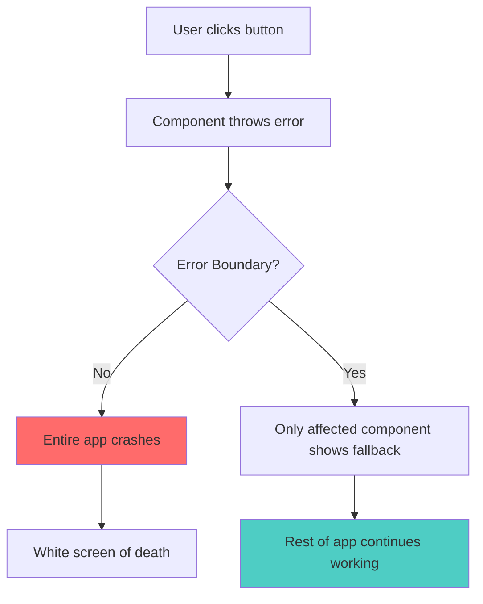
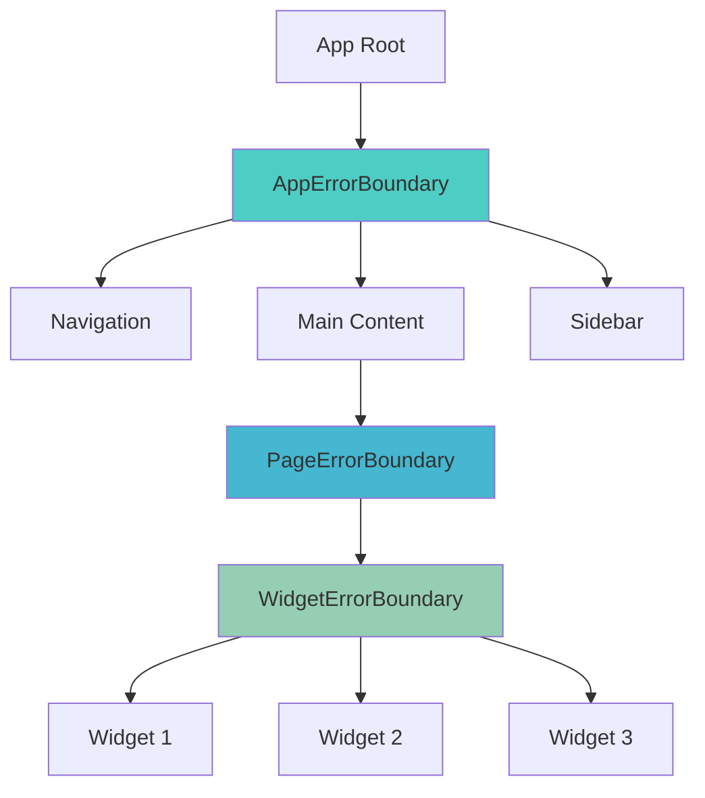
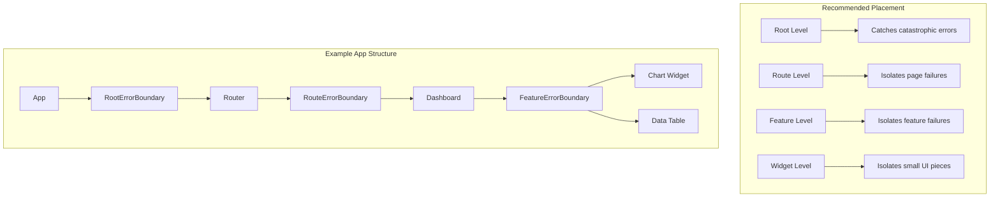

# How to Handle Error Boundaries in React

Author: [nawazdhandala](https://github.com/nawazdhandala)

Tags: React, JavaScript, Error Handling, Frontend, Reliability

Description: A comprehensive guide to implementing error boundaries in React applications for graceful error handling and improved user experience.

---

Error boundaries are React components that catch JavaScript errors anywhere in their child component tree, log those errors, and display a fallback UI instead of crashing the entire application. This guide covers everything from basic implementation to advanced patterns.

## Why Error Boundaries Matter

Without error boundaries, a JavaScript error in one component can crash your entire React application:



## Basic Error Boundary Implementation

Error boundaries must be class components because they use lifecycle methods not available in hooks:

```javascript
// ErrorBoundary.js
import React from 'react';

class ErrorBoundary extends React.Component {
  constructor(props) {
    super(props);
    this.state = {
      hasError: false,
      error: null,
      errorInfo: null
    };
  }

  // Update state so the next render shows the fallback UI
  static getDerivedStateFromError(error) {
    return { hasError: true, error };
  }

  // Log error information
  componentDidCatch(error, errorInfo) {
    this.setState({ errorInfo });

    // Log to your error reporting service
    console.error('Error caught by boundary:', error);
    console.error('Component stack:', errorInfo.componentStack);
  }

  render() {
    if (this.state.hasError) {
      // Render fallback UI
      return (
        <div className="error-boundary-fallback">
          <h2>Something went wrong</h2>
          <details>
            <summary>Error details</summary>
            <pre>{this.state.error?.toString()}</pre>
            <pre>{this.state.errorInfo?.componentStack}</pre>
          </details>
          <button onClick={() => this.setState({ hasError: false })}>
            Try again
          </button>
        </div>
      );
    }

    return this.props.children;
  }
}

export default ErrorBoundary;
```

Usage:

```javascript
// App.js
import ErrorBoundary from './ErrorBoundary';
import Dashboard from './Dashboard';

function App() {
  return (
    <ErrorBoundary>
      <Dashboard />
    </ErrorBoundary>
  );
}
```

## Advanced Error Boundary with Custom Fallback

Create a reusable error boundary that accepts a custom fallback component:

```javascript
// AdvancedErrorBoundary.js
import React from 'react';

class AdvancedErrorBoundary extends React.Component {
  constructor(props) {
    super(props);
    this.state = {
      hasError: false,
      error: null,
      errorInfo: null,
      errorCount: 0
    };
  }

  static getDerivedStateFromError(error) {
    return { hasError: true, error };
  }

  componentDidCatch(error, errorInfo) {
    const { onError, maxRetries = 3 } = this.props;

    this.setState(prevState => ({
      errorInfo,
      errorCount: prevState.errorCount + 1
    }));

    // Call optional error handler
    if (onError) {
      onError(error, errorInfo);
    }

    // Log to external service
    this.logError(error, errorInfo);
  }

  logError = (error, errorInfo) => {
    // Send to your error tracking service (Sentry, LogRocket, etc.)
    const errorReport = {
      message: error.message,
      stack: error.stack,
      componentStack: errorInfo.componentStack,
      timestamp: new Date().toISOString(),
      url: window.location.href,
      userAgent: navigator.userAgent
    };

    console.error('Error Report:', errorReport);

    // Example: Send to API
    // fetch('/api/errors', {
    //   method: 'POST',
    //   headers: { 'Content-Type': 'application/json' },
    //   body: JSON.stringify(errorReport)
    // });
  };

  handleReset = () => {
    const { onReset } = this.props;

    this.setState({
      hasError: false,
      error: null,
      errorInfo: null
    });

    if (onReset) {
      onReset();
    }
  };

  render() {
    const { hasError, error, errorInfo, errorCount } = this.state;
    const {
      children,
      fallback,
      FallbackComponent,
      maxRetries = 3
    } = this.props;

    if (hasError) {
      // Check if we have exceeded max retries
      if (errorCount >= maxRetries) {
        return (
          <div className="error-boundary-max-retries">
            <h2>This component has crashed multiple times</h2>
            <p>Please refresh the page or contact support.</p>
          </div>
        );
      }

      // Use custom fallback component if provided
      if (FallbackComponent) {
        return (
          <FallbackComponent
            error={error}
            errorInfo={errorInfo}
            resetError={this.handleReset}
            errorCount={errorCount}
          />
        );
      }

      // Use simple fallback if provided
      if (fallback) {
        return fallback;
      }

      // Default fallback
      return (
        <div className="error-boundary-default">
          <h2>Something went wrong</h2>
          <button onClick={this.handleReset}>Try again</button>
        </div>
      );
    }

    return children;
  }
}

export default AdvancedErrorBoundary;
```

## Creating Specialized Error Boundaries

Different parts of your application may need different error handling strategies:



```javascript
// Specialized error boundaries for different use cases

// 1. Widget Error Boundary - Minimal, inline recovery
const WidgetErrorBoundary = ({ children, widgetName }) => {
  return (
    <AdvancedErrorBoundary
      FallbackComponent={({ resetError }) => (
        <div className="widget-error">
          <span>Failed to load {widgetName}</span>
          <button onClick={resetError}>Reload</button>
        </div>
      )}
      onError={(error) => {
        // Track widget-specific errors
        console.log(`Widget error in ${widgetName}:`, error);
      }}
    >
      {children}
    </AdvancedErrorBoundary>
  );
};

// 2. Page Error Boundary - Full page fallback
const PageErrorBoundary = ({ children }) => {
  return (
    <AdvancedErrorBoundary
      FallbackComponent={({ error, resetError }) => (
        <div className="page-error">
          <h1>Page Error</h1>
          <p>This page encountered an error and cannot be displayed.</p>
          <div className="error-actions">
            <button onClick={resetError}>Try Again</button>
            <button onClick={() => window.location.href = '/'}>
              Go Home
            </button>
          </div>
        </div>
      )}
    >
      {children}
    </AdvancedErrorBoundary>
  );
};

// 3. API Error Boundary - Handles data fetching errors
const ApiErrorBoundary = ({ children, onRetry }) => {
  return (
    <AdvancedErrorBoundary
      FallbackComponent={({ error, resetError }) => {
        const isNetworkError = error.message.includes('fetch') ||
                               error.message.includes('network');

        return (
          <div className="api-error">
            {isNetworkError ? (
              <>
                <h2>Connection Error</h2>
                <p>Please check your internet connection.</p>
              </>
            ) : (
              <>
                <h2>Failed to Load Data</h2>
                <p>There was a problem loading this content.</p>
              </>
            )}
            <button onClick={() => {
              if (onRetry) onRetry();
              resetError();
            }}>
              Retry
            </button>
          </div>
        );
      }}
    >
      {children}
    </AdvancedErrorBoundary>
  );
};
```

## Using Error Boundaries with Hooks

While error boundaries must be class components, you can create a hook-friendly wrapper:

```javascript
// useErrorBoundary.js
import { useState, useCallback } from 'react';

export function useErrorBoundary() {
  const [error, setError] = useState(null);

  const resetError = useCallback(() => {
    setError(null);
  }, []);

  const captureError = useCallback((error) => {
    setError(error);
  }, []);

  // For async errors that error boundaries cannot catch
  const handleAsyncError = useCallback((promise) => {
    return promise.catch((error) => {
      setError(error);
      throw error; // Re-throw to trigger error boundary if nested
    });
  }, []);

  return {
    error,
    resetError,
    captureError,
    handleAsyncError
  };
}

// Usage in a component
function DataFetcher() {
  const { captureError, error, resetError } = useErrorBoundary();
  const [data, setData] = useState(null);

  const fetchData = async () => {
    try {
      const response = await fetch('/api/data');
      if (!response.ok) {
        throw new Error(`HTTP error! status: ${response.status}`);
      }
      const result = await response.json();
      setData(result);
    } catch (err) {
      captureError(err);
    }
  };

  if (error) {
    return (
      <div>
        <p>Error: {error.message}</p>
        <button onClick={resetError}>Retry</button>
      </div>
    );
  }

  return (
    <div>
      <button onClick={fetchData}>Fetch Data</button>
      {data && <pre>{JSON.stringify(data, null, 2)}</pre>}
    </div>
  );
}
```

## Error Boundary with React Query/SWR Integration

Integrate error boundaries with data fetching libraries:

```javascript
// With React Query
import { QueryErrorResetBoundary } from '@tanstack/react-query';
import { ErrorBoundary } from 'react-error-boundary';

function App() {
  return (
    <QueryErrorResetBoundary>
      {({ reset }) => (
        <ErrorBoundary
          onReset={reset}
          fallbackRender={({ error, resetErrorBoundary }) => (
            <div className="error-container">
              <h2>Data Loading Error</h2>
              <pre>{error.message}</pre>
              <button onClick={resetErrorBoundary}>Retry</button>
            </div>
          )}
        >
          <DataComponent />
        </ErrorBoundary>
      )}
    </QueryErrorResetBoundary>
  );
}

function DataComponent() {
  const { data } = useQuery({
    queryKey: ['data'],
    queryFn: fetchData,
    useErrorBoundary: true, // This throws errors to the boundary
  });

  return <div>{data}</div>;
}
```

## Testing Error Boundaries

```javascript
// ErrorBoundary.test.js
import { render, screen, fireEvent } from '@testing-library/react';
import ErrorBoundary from './ErrorBoundary';

// Component that throws an error
const BuggyComponent = ({ shouldThrow }) => {
  if (shouldThrow) {
    throw new Error('Test error');
  }
  return <div>No error</div>;
};

describe('ErrorBoundary', () => {
  // Suppress console.error for cleaner test output
  const originalError = console.error;
  beforeAll(() => {
    console.error = jest.fn();
  });
  afterAll(() => {
    console.error = originalError;
  });

  it('renders children when there is no error', () => {
    render(
      <ErrorBoundary>
        <BuggyComponent shouldThrow={false} />
      </ErrorBoundary>
    );

    expect(screen.getByText('No error')).toBeInTheDocument();
  });

  it('renders fallback UI when child throws error', () => {
    render(
      <ErrorBoundary>
        <BuggyComponent shouldThrow={true} />
      </ErrorBoundary>
    );

    expect(screen.getByText('Something went wrong')).toBeInTheDocument();
  });

  it('calls onError callback when error occurs', () => {
    const onError = jest.fn();

    render(
      <ErrorBoundary onError={onError}>
        <BuggyComponent shouldThrow={true} />
      </ErrorBoundary>
    );

    expect(onError).toHaveBeenCalled();
  });

  it('resets error state when reset button is clicked', () => {
    const { rerender } = render(
      <ErrorBoundary>
        <BuggyComponent shouldThrow={true} />
      </ErrorBoundary>
    );

    // Error should be displayed
    expect(screen.getByText('Something went wrong')).toBeInTheDocument();

    // Click retry button
    fireEvent.click(screen.getByText('Try again'));

    // Rerender with non-throwing component
    rerender(
      <ErrorBoundary>
        <BuggyComponent shouldThrow={false} />
      </ErrorBoundary>
    );

    expect(screen.getByText('No error')).toBeInTheDocument();
  });
});
```

## Production Error Boundary Pattern

A complete production-ready error boundary with logging, recovery, and monitoring:

```javascript
// ProductionErrorBoundary.js
import React from 'react';

class ProductionErrorBoundary extends React.Component {
  constructor(props) {
    super(props);
    this.state = {
      hasError: false,
      error: null,
      errorId: null
    };
  }

  static getDerivedStateFromError(error) {
    // Generate unique error ID for tracking
    const errorId = `err_${Date.now()}_${Math.random().toString(36).substr(2, 9)}`;
    return { hasError: true, error, errorId };
  }

  componentDidCatch(error, errorInfo) {
    const { errorId } = this.state;

    // Send to monitoring service
    this.reportError({
      errorId,
      error: {
        message: error.message,
        stack: error.stack,
        name: error.name
      },
      errorInfo: {
        componentStack: errorInfo.componentStack
      },
      context: {
        url: window.location.href,
        timestamp: new Date().toISOString(),
        userAgent: navigator.userAgent,
        // Add any user context from your auth system
        // userId: getCurrentUser()?.id
      }
    });
  }

  reportError = async (errorReport) => {
    try {
      // Replace with your actual error reporting endpoint
      await fetch('/api/errors', {
        method: 'POST',
        headers: { 'Content-Type': 'application/json' },
        body: JSON.stringify(errorReport)
      });
    } catch (reportingError) {
      // Fallback to console if reporting fails
      console.error('Failed to report error:', reportingError);
      console.error('Original error:', errorReport);
    }
  };

  handleReload = () => {
    window.location.reload();
  };

  handleGoHome = () => {
    window.location.href = '/';
  };

  render() {
    const { hasError, errorId } = this.state;
    const { children } = this.props;

    if (hasError) {
      return (
        <div className="production-error-boundary">
          <div className="error-content">
            <h1>Oops! Something went wrong</h1>
            <p>
              We have been notified of this issue and are working to fix it.
            </p>
            <p className="error-id">
              Error ID: <code>{errorId}</code>
            </p>
            <div className="error-actions">
              <button
                onClick={this.handleReload}
                className="primary-button"
              >
                Reload Page
              </button>
              <button
                onClick={this.handleGoHome}
                className="secondary-button"
              >
                Go to Homepage
              </button>
            </div>
          </div>
        </div>
      );
    }

    return children;
  }
}

export default ProductionErrorBoundary;
```

## Error Boundary Placement Strategy



## Summary

Error boundaries are essential for building robust React applications. Key takeaways:

1. Error boundaries must be class components using getDerivedStateFromError and componentDidCatch
2. Place error boundaries strategically at multiple levels (root, route, feature, widget)
3. Provide meaningful fallback UIs with recovery options
4. Log errors to monitoring services with contextual information
5. Use error IDs to help users report issues
6. Test your error boundaries to ensure they work correctly
7. Consider using libraries like react-error-boundary for additional features
