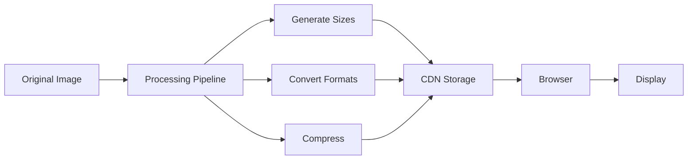

# How to Handle Image Optimization

Author: [nawazdhandala](https://www.github.com/nawazdhandala)

Tags: Performance, Images, WebP, AVIF, CDN, Frontend, Optimization

Description: A comprehensive guide to image optimization techniques including format selection, responsive images, lazy loading, and automated optimization pipelines.

---

Images typically account for 50-70% of a web page's total weight. Proper image optimization can dramatically improve page load times, reduce bandwidth costs, and improve user experience. This guide covers practical techniques for optimizing images at every stage.

## Image Optimization Flow



## Choosing the Right Format

Different image formats serve different purposes. Here is when to use each:

| Format | Best For | Browser Support |
|--------|----------|-----------------|
| WebP | Photos, general use | 97%+ |
| AVIF | High compression photos | 85%+ |
| PNG | Transparency, screenshots | 100% |
| SVG | Icons, logos, illustrations | 100% |
| JPEG | Legacy fallback | 100% |

### Format Detection and Serving

Serve the best format based on browser support using the `Accept` header.

```javascript
// Express middleware for format negotiation
function imageFormatMiddleware(req, res, next) {
    const accept = req.headers.accept || '';

    // Check browser support via Accept header
    if (accept.includes('image/avif')) {
        req.preferredFormat = 'avif';
    } else if (accept.includes('image/webp')) {
        req.preferredFormat = 'webp';
    } else {
        req.preferredFormat = 'jpeg';
    }

    next();
}

// Route handler that serves optimized images
app.get('/images/:name', imageFormatMiddleware, async (req, res) => {
    const { name } = req.params;
    const format = req.preferredFormat;

    // Try to serve the optimized format
    const optimizedPath = `./images/${name}.${format}`;
    const fallbackPath = `./images/${name}.jpeg`;

    try {
        await fs.access(optimizedPath);
        res.type(`image/${format}`);
        res.sendFile(optimizedPath);
    } catch {
        res.type('image/jpeg');
        res.sendFile(fallbackPath);
    }
});
```

## Image Processing Pipeline

Use Sharp for server-side image processing. It is fast and supports all modern formats.

```javascript
const sharp = require('sharp');
const path = require('path');

// Configuration for responsive image sizes
const sizes = [
    { width: 320, suffix: 'sm' },
    { width: 640, suffix: 'md' },
    { width: 1024, suffix: 'lg' },
    { width: 1920, suffix: 'xl' }
];

// Formats to generate
const formats = [
    { format: 'webp', options: { quality: 80 } },
    { format: 'avif', options: { quality: 65 } },
    { format: 'jpeg', options: { quality: 85, progressive: true } }
];

async function processImage(inputPath, outputDir) {
    const filename = path.basename(inputPath, path.extname(inputPath));
    const results = [];

    // Load the original image once
    const image = sharp(inputPath);
    const metadata = await image.metadata();

    for (const size of sizes) {
        // Skip sizes larger than original
        if (size.width > metadata.width) continue;

        for (const fmt of formats) {
            const outputFilename = `${filename}-${size.suffix}.${fmt.format}`;
            const outputPath = path.join(outputDir, outputFilename);

            await sharp(inputPath)
                .resize(size.width, null, {
                    withoutEnlargement: true,
                    fit: 'inside'
                })
                .toFormat(fmt.format, fmt.options)
                .toFile(outputPath);

            results.push({
                path: outputPath,
                width: size.width,
                format: fmt.format
            });
        }
    }

    return results;
}
```

## Responsive Images in HTML

Use `srcset` and `sizes` attributes to let browsers choose the best image.

```html
<!-- Modern responsive image with format fallback -->
<picture>
    <!-- AVIF for browsers that support it -->
    <source
        type="image/avif"
        srcset="
            /images/hero-sm.avif 320w,
            /images/hero-md.avif 640w,
            /images/hero-lg.avif 1024w,
            /images/hero-xl.avif 1920w
        "
        sizes="(max-width: 640px) 100vw, (max-width: 1024px) 80vw, 1200px"
    />

    <!-- WebP fallback -->
    <source
        type="image/webp"
        srcset="
            /images/hero-sm.webp 320w,
            /images/hero-md.webp 640w,
            /images/hero-lg.webp 1024w,
            /images/hero-xl.webp 1920w
        "
        sizes="(max-width: 640px) 100vw, (max-width: 1024px) 80vw, 1200px"
    />

    <!-- JPEG fallback for older browsers -->
    
</picture>
```

## Lazy Loading Implementation

Native lazy loading is supported in all modern browsers, but you may need a JavaScript fallback for older browsers.

```html
<!-- Native lazy loading (recommended) -->

```

For more control, use Intersection Observer:

```javascript
// Advanced lazy loading with placeholder
class LazyLoader {
    constructor(options = {}) {
        this.rootMargin = options.rootMargin || '100px';
        this.threshold = options.threshold || 0.1;

        this.observer = new IntersectionObserver(
            this.handleIntersection.bind(this),
            {
                rootMargin: this.rootMargin,
                threshold: this.threshold
            }
        );
    }

    observe(element) {
        this.observer.observe(element);
    }

    handleIntersection(entries) {
        entries.forEach(entry => {
            if (entry.isIntersecting) {
                this.loadImage(entry.target);
                this.observer.unobserve(entry.target);
            }
        });
    }

    loadImage(img) {
        const src = img.dataset.src;
        const srcset = img.dataset.srcset;

        // Create a new image to preload
        const tempImg = new Image();

        tempImg.onload = () => {
            // Apply loaded image
            img.src = src;
            if (srcset) img.srcset = srcset;
            img.classList.add('loaded');
            img.classList.remove('lazy');
        };

        tempImg.onerror = () => {
            img.classList.add('error');
            console.error(`Failed to load image: ${src}`);
        };

        // Start loading
        tempImg.src = src;
    }
}

// Initialize lazy loading
const lazyLoader = new LazyLoader({ rootMargin: '200px' });
document.querySelectorAll('img.lazy').forEach(img => {
    lazyLoader.observe(img);
});
```

## Low Quality Image Placeholder (LQIP)

Show a blurred placeholder while the full image loads to improve perceived performance.

```javascript
const sharp = require('sharp');

async function generateLQIP(inputPath) {
    // Generate a tiny 20px wide placeholder
    const buffer = await sharp(inputPath)
        .resize(20, null, { withoutEnlargement: true })
        .blur(1)
        .jpeg({ quality: 50 })
        .toBuffer();

    // Convert to base64 data URL
    const base64 = buffer.toString('base64');
    return `data:image/jpeg;base64,${base64}`;
}

// Usage in your build process
async function processImageWithLQIP(inputPath) {
    const lqip = await generateLQIP(inputPath);
    const variants = await processImage(inputPath, './output');

    return {
        placeholder: lqip,
        variants
    };
}
```

Use the placeholder in HTML:

```html
<div class="image-container">
    <!-- Blurred placeholder shown immediately -->
    

    <!-- Full image loaded lazily -->
    
</div>

<style>
.image-container {
    position: relative;
}

.placeholder {
    filter: blur(10px);
    transform: scale(1.1);
    width: 100%;
}

.full-image {
    position: absolute;
    top: 0;
    left: 0;
    opacity: 0;
    transition: opacity 0.3s;
}

.full-image.loaded {
    opacity: 1;
}
</style>
```

## CDN Configuration

Configure your CDN to serve optimized images automatically.


### Cloudflare Image Resizing

```javascript
// Cloudflare Worker for image optimization
addEventListener('fetch', event => {
    event.respondWith(handleRequest(event.request));
});

async function handleRequest(request) {
    const url = new URL(request.url);

    // Only process image requests
    if (!url.pathname.startsWith('/images/')) {
        return fetch(request);
    }

    // Parse requested dimensions from query params
    const width = parseInt(url.searchParams.get('w')) || 800;
    const quality = parseInt(url.searchParams.get('q')) || 80;

    // Determine best format from Accept header
    const accept = request.headers.get('Accept') || '';
    let format = 'jpeg';
    if (accept.includes('image/avif')) {
        format = 'avif';
    } else if (accept.includes('image/webp')) {
        format = 'webp';
    }

    // Build Cloudflare image resizing URL
    const imageOptions = {
        width,
        quality,
        format,
        fit: 'cover'
    };

    // Use Cloudflare's Image Resizing
    return fetch(request, {
        cf: {
            image: imageOptions
        }
    });
}
```

### AWS CloudFront with Lambda@Edge

```javascript
// Lambda@Edge function for image optimization
exports.handler = async (event) => {
    const request = event.Records[0].cf.request;
    const headers = request.headers;

    // Check Accept header for WebP support
    const accept = headers['accept'] ? headers['accept'][0].value : '';
    const supportsWebP = accept.includes('image/webp');
    const supportsAVIF = accept.includes('image/avif');

    // Modify request URI based on format support
    if (request.uri.match(/\.(jpe?g|png)$/i)) {
        if (supportsAVIF) {
            request.uri = request.uri.replace(/\.(jpe?g|png)$/i, '.avif');
        } else if (supportsWebP) {
            request.uri = request.uri.replace(/\.(jpe?g|png)$/i, '.webp');
        }
    }

    return request;
};
```

## Build-Time Optimization

Integrate image optimization into your build process.

```javascript
// vite.config.js - Image optimization plugin
import { defineConfig } from 'vite';
import imageOptimizer from 'vite-plugin-image-optimizer';

export default defineConfig({
    plugins: [
        imageOptimizer({
            // JPEG options
            jpeg: {
                quality: 80,
                progressive: true
            },
            // PNG options
            png: {
                quality: 80,
                compressionLevel: 9
            },
            // WebP options
            webp: {
                quality: 80,
                lossless: false
            },
            // AVIF options
            avif: {
                quality: 65,
                speed: 5
            },
            // Generate WebP versions automatically
            cache: true,
            cacheLocation: './node_modules/.cache/image-optimizer'
        })
    ]
});
```

## Measuring Image Performance

Track image loading metrics to ensure optimizations are working.

```javascript
// Performance observer for image loading
const imageMetrics = [];

const observer = new PerformanceObserver((list) => {
    for (const entry of list.getEntries()) {
        if (entry.initiatorType === 'img') {
            imageMetrics.push({
                url: entry.name,
                duration: entry.duration,
                transferSize: entry.transferSize,
                decodedBodySize: entry.decodedBodySize,
                startTime: entry.startTime
            });
        }
    }
});

observer.observe({ entryTypes: ['resource'] });

// Report metrics after page load
window.addEventListener('load', () => {
    setTimeout(() => {
        const totalSize = imageMetrics.reduce(
            (sum, m) => sum + m.transferSize, 0
        );
        const avgDuration = imageMetrics.reduce(
            (sum, m) => sum + m.duration, 0
        ) / imageMetrics.length;

        console.log('Image Performance Report:');
        console.log(`Total images: ${imageMetrics.length}`);
        console.log(`Total size: ${(totalSize / 1024).toFixed(2)} KB`);
        console.log(`Avg load time: ${avgDuration.toFixed(2)} ms`);

        // Send to analytics
        sendToAnalytics({
            event: 'image_performance',
            imageCount: imageMetrics.length,
            totalSizeKB: totalSize / 1024,
            avgLoadTimeMs: avgDuration
        });
    }, 1000);
});
```

## Best Practices Checklist

1. **Use modern formats** - Serve AVIF with WebP fallback, then JPEG
2. **Implement responsive images** - Use srcset and sizes for different viewports
3. **Lazy load below-the-fold images** - Use native loading="lazy" or Intersection Observer
4. **Set explicit dimensions** - Always include width and height to prevent layout shifts
5. **Use a CDN** - Serve images from edge locations close to users
6. **Automate optimization** - Integrate into build process or use on-the-fly optimization
7. **Monitor performance** - Track image loading metrics and file sizes

---

Image optimization is one of the highest-impact performance improvements you can make. Start with format conversion to WebP/AVIF, add responsive images, implement lazy loading, and measure the results. Most sites can reduce image payload by 50-70% with these techniques.
