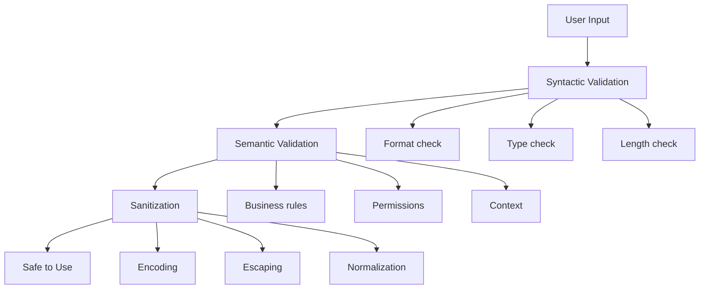
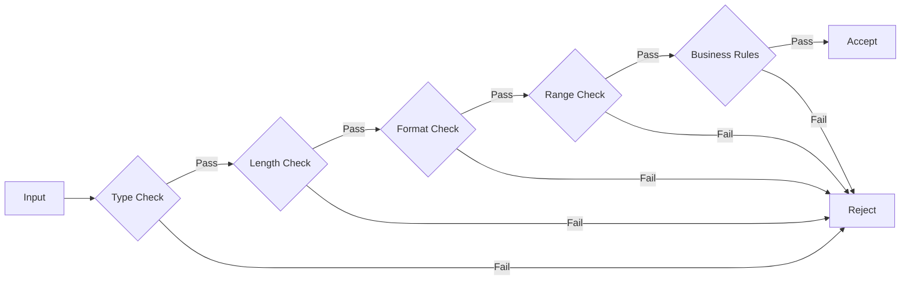

# How to Handle Input Validation

Author: [nawazdhandala](https://www.github.com/nawazdhandala)

Tags: Security, Input Validation, Sanitization, OWASP, Node.js, Python, Go, SQL Injection, XSS

Description: Learn how to properly validate and sanitize user input to prevent injection attacks, data corruption, and security vulnerabilities in your applications.

---

> Input validation is your first line of defense against attacks. Every piece of data from users, APIs, or external systems should be validated before use. This guide covers validation techniques, common pitfalls, and best practices across multiple languages.

Never trust input. Always validate. This simple rule can prevent most injection attacks and data integrity issues.

---

## Input Validation Strategy



---

## Validation Principles

1. **Validate on the server** - Client-side validation is for UX only
2. **Whitelist over blacklist** - Define what is allowed, not what is forbidden
3. **Validate early** - Check input as soon as it enters your system
4. **Fail securely** - Reject invalid input with safe error messages
5. **Context matters** - Validation depends on how data will be used

---

## JavaScript/Node.js Validation

```javascript
// validation.js
// Comprehensive input validation for Node.js

const validator = require('validator');

/**
 * Validation utilities with secure defaults
 */
class InputValidator {
    /**
     * Validate email address
     */
    static email(input) {
        if (typeof input !== 'string') {
            return { valid: false, error: 'Email must be a string' };
        }

        const trimmed = input.trim().toLowerCase();

        if (trimmed.length > 254) {
            return { valid: false, error: 'Email too long' };
        }

        if (!validator.isEmail(trimmed)) {
            return { valid: false, error: 'Invalid email format' };
        }

        return { valid: true, value: trimmed };
    }

    /**
     * Validate username with strict rules
     */
    static username(input, options = {}) {
        const {
            minLength = 3,
            maxLength = 30,
            allowedChars = /^[a-zA-Z0-9_-]+$/
        } = options;

        if (typeof input !== 'string') {
            return { valid: false, error: 'Username must be a string' };
        }

        const trimmed = input.trim();

        if (trimmed.length < minLength) {
            return { valid: false, error: `Username must be at least ${minLength} characters` };
        }

        if (trimmed.length > maxLength) {
            return { valid: false, error: `Username must be at most ${maxLength} characters` };
        }

        if (!allowedChars.test(trimmed)) {
            return { valid: false, error: 'Username contains invalid characters' };
        }

        // Check for reserved usernames
        const reserved = ['admin', 'root', 'system', 'null', 'undefined', 'api'];
        if (reserved.includes(trimmed.toLowerCase())) {
            return { valid: false, error: 'This username is reserved' };
        }

        return { valid: true, value: trimmed };
    }

    /**
     * Validate password strength
     */
    static password(input) {
        if (typeof input !== 'string') {
            return { valid: false, error: 'Password must be a string' };
        }

        const issues = [];

        if (input.length < 12) {
            issues.push('at least 12 characters');
        }

        if (input.length > 128) {
            issues.push('at most 128 characters');
        }

        if (!/[A-Z]/.test(input)) {
            issues.push('an uppercase letter');
        }

        if (!/[a-z]/.test(input)) {
            issues.push('a lowercase letter');
        }

        if (!/[0-9]/.test(input)) {
            issues.push('a number');
        }

        if (!/[^A-Za-z0-9]/.test(input)) {
            issues.push('a special character');
        }

        if (issues.length > 0) {
            return {
                valid: false,
                error: `Password must contain ${issues.join(', ')}`
            };
        }

        return { valid: true, value: input };
    }

    /**
     * Validate and sanitize URL
     */
    static url(input, options = {}) {
        const {
            protocols = ['http', 'https'],
            requireTld = true
        } = options;

        if (typeof input !== 'string') {
            return { valid: false, error: 'URL must be a string' };
        }

        const trimmed = input.trim();

        if (trimmed.length > 2048) {
            return { valid: false, error: 'URL too long' };
        }

        if (!validator.isURL(trimmed, {
            protocols,
            require_tld: requireTld,
            require_protocol: true
        })) {
            return { valid: false, error: 'Invalid URL format' };
        }

        // Check for dangerous protocols
        const url = new URL(trimmed);
        if (!protocols.includes(url.protocol.replace(':', ''))) {
            return { valid: false, error: 'Invalid URL protocol' };
        }

        return { valid: true, value: trimmed };
    }

    /**
     * Validate integer within range
     */
    static integer(input, options = {}) {
        const {
            min = Number.MIN_SAFE_INTEGER,
            max = Number.MAX_SAFE_INTEGER
        } = options;

        const num = parseInt(input, 10);

        if (isNaN(num)) {
            return { valid: false, error: 'Must be a valid integer' };
        }

        if (num < min) {
            return { valid: false, error: `Must be at least ${min}` };
        }

        if (num > max) {
            return { valid: false, error: `Must be at most ${max}` };
        }

        return { valid: true, value: num };
    }

    /**
     * Validate UUID
     */
    static uuid(input) {
        if (typeof input !== 'string') {
            return { valid: false, error: 'UUID must be a string' };
        }

        if (!validator.isUUID(input, 4)) {
            return { valid: false, error: 'Invalid UUID format' };
        }

        return { valid: true, value: input.toLowerCase() };
    }

    /**
     * Sanitize string for HTML output (prevent XSS)
     */
    static sanitizeHtml(input) {
        if (typeof input !== 'string') {
            return '';
        }

        return input
            .replace(/&/g, '&amp;')
            .replace(/</g, '&lt;')
            .replace(/>/g, '&gt;')
            .replace(/"/g, '&quot;')
            .replace(/'/g, '&#x27;')
            .replace(/\//g, '&#x2F;');
    }

    /**
     * Validate file upload
     */
    static file(file, options = {}) {
        const {
            maxSize = 5 * 1024 * 1024,  // 5MB default
            allowedMimes = ['image/jpeg', 'image/png', 'image/gif'],
            allowedExtensions = ['.jpg', '.jpeg', '.png', '.gif']
        } = options;

        if (!file) {
            return { valid: false, error: 'No file provided' };
        }

        if (file.size > maxSize) {
            return { valid: false, error: `File too large (max ${maxSize / 1024 / 1024}MB)` };
        }

        if (!allowedMimes.includes(file.mimetype)) {
            return { valid: false, error: 'File type not allowed' };
        }

        // Check extension (don't trust Content-Type alone)
        const ext = file.originalname.toLowerCase().match(/\.[^.]+$/)?.[0];
        if (!ext || !allowedExtensions.includes(ext)) {
            return { valid: false, error: 'File extension not allowed' };
        }

        return { valid: true, value: file };
    }
}

module.exports = InputValidator;
```

---

## Express Validation Middleware

```javascript
// middleware/validate.js
// Express middleware for request validation

const { validationResult, body, param, query } = require('express-validator');

/**
 * Middleware to check validation results
 */
const validate = (req, res, next) => {
    const errors = validationResult(req);

    if (!errors.isEmpty()) {
        // Return structured error response
        return res.status(400).json({
            error: 'Validation failed',
            details: errors.array().map(err => ({
                field: err.path,
                message: err.msg
            }))
        });
    }

    next();
};

/**
 * Common validation chains
 */
const validations = {
    // User registration
    register: [
        body('email')
            .trim()
            .isEmail()
            .normalizeEmail()
            .withMessage('Valid email is required'),

        body('password')
            .isLength({ min: 12, max: 128 })
            .withMessage('Password must be 12-128 characters')
            .matches(/[A-Z]/)
            .withMessage('Password must contain uppercase letter')
            .matches(/[a-z]/)
            .withMessage('Password must contain lowercase letter')
            .matches(/[0-9]/)
            .withMessage('Password must contain number')
            .matches(/[^A-Za-z0-9]/)
            .withMessage('Password must contain special character'),

        body('username')
            .trim()
            .isLength({ min: 3, max: 30 })
            .withMessage('Username must be 3-30 characters')
            .matches(/^[a-zA-Z0-9_-]+$/)
            .withMessage('Username can only contain letters, numbers, underscore, hyphen'),

        validate
    ],

    // Pagination
    pagination: [
        query('page')
            .optional()
            .isInt({ min: 1 })
            .withMessage('Page must be positive integer')
            .toInt(),

        query('limit')
            .optional()
            .isInt({ min: 1, max: 100 })
            .withMessage('Limit must be 1-100')
            .toInt(),

        validate
    ],

    // ID parameter
    idParam: [
        param('id')
            .isUUID(4)
            .withMessage('Invalid ID format'),

        validate
    ],

    // Search query
    search: [
        query('q')
            .trim()
            .isLength({ min: 1, max: 100 })
            .withMessage('Search query must be 1-100 characters')
            .escape(),  // Sanitize for safety

        validate
    ]
};

// Usage in routes
const express = require('express');
const router = express.Router();

router.post('/users', validations.register, async (req, res) => {
    // Input is validated and sanitized
    const { email, password, username } = req.body;
    // ... create user
});

router.get('/users/:id', validations.idParam, async (req, res) => {
    const { id } = req.params;  // Validated UUID
    // ... fetch user
});

router.get('/search', validations.search, async (req, res) => {
    const { q } = req.query;  // Sanitized search query
    // ... perform search
});

module.exports = { validate, validations };
```

---

## Python Validation with Pydantic

```python
# validation.py
# Input validation with Pydantic

from pydantic import BaseModel, Field, EmailStr, validator, root_validator
from typing import Optional, List
import re
from datetime import datetime

class UserRegistration(BaseModel):
    """User registration request with validation"""

    email: EmailStr = Field(..., description="User email address")

    username: str = Field(
        ...,
        min_length=3,
        max_length=30,
        description="Username (letters, numbers, underscore, hyphen)"
    )

    password: str = Field(
        ...,
        min_length=12,
        max_length=128,
        description="Strong password"
    )

    @validator('username')
    def validate_username(cls, v):
        # Only allow alphanumeric, underscore, hyphen
        if not re.match(r'^[a-zA-Z0-9_-]+$', v):
            raise ValueError('Username can only contain letters, numbers, underscore, hyphen')

        # Check reserved names
        reserved = {'admin', 'root', 'system', 'null', 'api', 'www'}
        if v.lower() in reserved:
            raise ValueError('This username is reserved')

        return v

    @validator('password')
    def validate_password(cls, v):
        errors = []

        if not re.search(r'[A-Z]', v):
            errors.append('uppercase letter')
        if not re.search(r'[a-z]', v):
            errors.append('lowercase letter')
        if not re.search(r'[0-9]', v):
            errors.append('number')
        if not re.search(r'[^A-Za-z0-9]', v):
            errors.append('special character')

        if errors:
            raise ValueError(f'Password must contain: {", ".join(errors)}')

        return v

    class Config:
        # Strip whitespace from strings
        anystr_strip_whitespace = True


class PaginationParams(BaseModel):
    """Pagination parameters with safe defaults"""

    page: int = Field(default=1, ge=1, le=10000)
    limit: int = Field(default=20, ge=1, le=100)

    @property
    def offset(self) -> int:
        return (self.page - 1) * self.limit


class SearchQuery(BaseModel):
    """Search query with sanitization"""

    q: str = Field(..., min_length=1, max_length=100)
    filters: Optional[List[str]] = Field(default=None, max_items=10)

    @validator('q')
    def sanitize_query(cls, v):
        # Remove potential SQL injection characters
        # Note: This is defense in depth - always use parameterized queries
        dangerous_chars = ['\'', '"', ';', '--', '/*', '*/', 'xp_']
        for char in dangerous_chars:
            v = v.replace(char, '')
        return v.strip()

    @validator('filters', each_item=True)
    def validate_filter(cls, v):
        # Whitelist allowed filter values
        allowed = {'active', 'inactive', 'pending', 'verified'}
        if v not in allowed:
            raise ValueError(f'Invalid filter. Allowed: {allowed}')
        return v


class DateRangeQuery(BaseModel):
    """Date range with validation"""

    start_date: datetime
    end_date: datetime

    @root_validator
    def validate_date_range(cls, values):
        start = values.get('start_date')
        end = values.get('end_date')

        if start and end:
            if start > end:
                raise ValueError('start_date must be before end_date')

            # Limit range to 1 year
            delta = end - start
            if delta.days > 365:
                raise ValueError('Date range cannot exceed 1 year')

        return values


# FastAPI usage example
from fastapi import FastAPI, HTTPException, Query
from pydantic import ValidationError

app = FastAPI()

@app.post("/users")
async def create_user(user: UserRegistration):
    # Pydantic validates automatically
    # user.email, user.username, user.password are all validated
    return {"message": "User created", "username": user.username}

@app.get("/search")
async def search(
    q: str = Query(..., min_length=1, max_length=100),
    page: int = Query(1, ge=1, le=10000),
    limit: int = Query(20, ge=1, le=100)
):
    # Query parameters validated by FastAPI
    return {"query": q, "page": page, "limit": limit}
```

---

## Go Validation

```go
// validation.go
// Input validation in Go

package validation

import (
    "errors"
    "regexp"
    "strings"
    "unicode"
)

// ValidationError holds validation error details
type ValidationError struct {
    Field   string `json:"field"`
    Message string `json:"message"`
}

func (e ValidationError) Error() string {
    return e.Message
}

// Validator provides validation methods
type Validator struct {
    errors []ValidationError
}

// NewValidator creates a new validator
func NewValidator() *Validator {
    return &Validator{
        errors: make([]ValidationError, 0),
    }
}

// HasErrors checks if there are validation errors
func (v *Validator) HasErrors() bool {
    return len(v.errors) > 0
}

// Errors returns all validation errors
func (v *Validator) Errors() []ValidationError {
    return v.errors
}

// addError adds a validation error
func (v *Validator) addError(field, message string) {
    v.errors = append(v.errors, ValidationError{
        Field:   field,
        Message: message,
    })
}

// Email validates email format
func (v *Validator) Email(field, value string) string {
    value = strings.TrimSpace(strings.ToLower(value))

    if len(value) > 254 {
        v.addError(field, "Email too long")
        return value
    }

    emailRegex := regexp.MustCompile(`^[a-zA-Z0-9._%+-]+@[a-zA-Z0-9.-]+\.[a-zA-Z]{2,}$`)
    if !emailRegex.MatchString(value) {
        v.addError(field, "Invalid email format")
    }

    return value
}

// Username validates username
func (v *Validator) Username(field, value string, minLen, maxLen int) string {
    value = strings.TrimSpace(value)

    if len(value) < minLen {
        v.addError(field, "Username too short")
        return value
    }

    if len(value) > maxLen {
        v.addError(field, "Username too long")
        return value
    }

    usernameRegex := regexp.MustCompile(`^[a-zA-Z0-9_-]+$`)
    if !usernameRegex.MatchString(value) {
        v.addError(field, "Username contains invalid characters")
    }

    // Check reserved usernames
    reserved := map[string]bool{
        "admin": true, "root": true, "system": true,
        "null": true, "api": true,
    }
    if reserved[strings.ToLower(value)] {
        v.addError(field, "Username is reserved")
    }

    return value
}

// Password validates password strength
func (v *Validator) Password(field, value string) {
    if len(value) < 12 {
        v.addError(field, "Password must be at least 12 characters")
    }

    if len(value) > 128 {
        v.addError(field, "Password must be at most 128 characters")
    }

    var hasUpper, hasLower, hasDigit, hasSpecial bool

    for _, char := range value {
        switch {
        case unicode.IsUpper(char):
            hasUpper = true
        case unicode.IsLower(char):
            hasLower = true
        case unicode.IsDigit(char):
            hasDigit = true
        case unicode.IsPunct(char) || unicode.IsSymbol(char):
            hasSpecial = true
        }
    }

    if !hasUpper {
        v.addError(field, "Password must contain uppercase letter")
    }
    if !hasLower {
        v.addError(field, "Password must contain lowercase letter")
    }
    if !hasDigit {
        v.addError(field, "Password must contain number")
    }
    if !hasSpecial {
        v.addError(field, "Password must contain special character")
    }
}

// IntRange validates integer is within range
func (v *Validator) IntRange(field string, value, min, max int) int {
    if value < min {
        v.addError(field, "Value too small")
    }
    if value > max {
        v.addError(field, "Value too large")
    }
    return value
}

// SanitizeHTML escapes HTML special characters
func SanitizeHTML(input string) string {
    replacer := strings.NewReplacer(
        "&", "&amp;",
        "<", "&lt;",
        ">", "&gt;",
        "\"", "&quot;",
        "'", "&#x27;",
    )
    return replacer.Replace(input)
}

// Usage example
type UserRequest struct {
    Email    string `json:"email"`
    Username string `json:"username"`
    Password string `json:"password"`
}

func ValidateUserRequest(req UserRequest) (UserRequest, []ValidationError) {
    v := NewValidator()

    req.Email = v.Email("email", req.Email)
    req.Username = v.Username("username", req.Username, 3, 30)
    v.Password("password", req.Password)

    return req, v.Errors()
}
```

---

## Validation Checklist



| Input Type | Validations |
|------------|-------------|
| Email | Format, length, domain |
| Password | Length, complexity, not common |
| Username | Length, characters, not reserved |
| URL | Protocol, format, no javascript: |
| Integer | Type, range, no overflow |
| File | Size, type, extension, content |
| Date | Format, range, not future/past |
| ID | Format (UUID/integer), exists |

---

## Key Takeaways

1. **Always validate server-side** - Client validation is for UX only
2. **Use whitelists** - Define what is allowed, not what is forbidden
3. **Validate type, format, and range** - Check all aspects of input
4. **Sanitize for output context** - HTML, SQL, and shell each need different handling
5. **Use validation libraries** - Do not write regex from scratch
6. **Return helpful errors** - Tell users what is wrong without leaking internals

---

*Need to monitor your application for invalid input attacks? [OneUptime](https://oneuptime.com) provides security monitoring with alerting on suspicious input patterns.*

**Related Reading:**
- [How to Fix "Security Misconfiguration" Issues](https://oneuptime.com/blog/post/2026-01-24-fix-security-misconfiguration/view)
- [How to Fix "Sensitive Data Exposure" Issues](https://oneuptime.com/blog/post/2026-01-24-fix-sensitive-data-exposure/view)
- [How to Fix "XML External Entity (XXE)" Vulnerabilities](https://oneuptime.com/blog/post/2026-01-24-fix-xxe-vulnerabilities/view)
