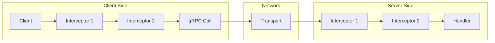
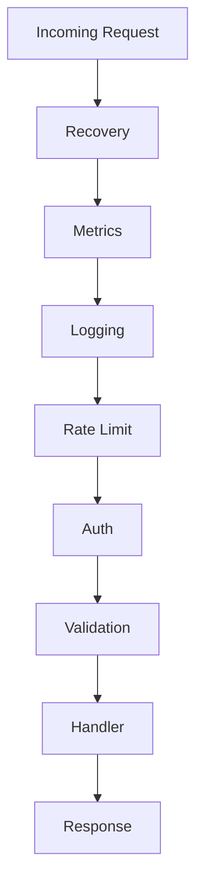
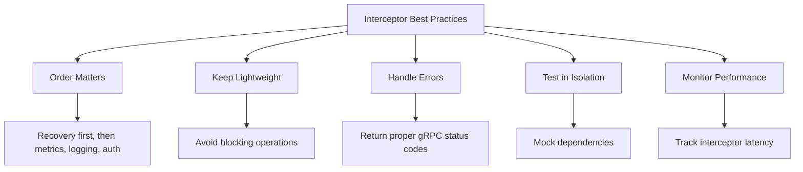

# How to Handle Interceptors in gRPC

Author: [nawazdhandala](https://www.github.com/nawazdhandala)

Tags: gRPC, Interceptors, Middleware, Authentication, Logging

Description: Learn how to implement and chain gRPC interceptors for logging, authentication, error handling, and cross-cutting concerns.

---

Interceptors are the gRPC equivalent of middleware in HTTP frameworks. They allow you to intercept and modify requests and responses, implementing cross-cutting concerns like logging, authentication, metrics, and error handling. This guide covers implementing interceptors in multiple languages with practical patterns and best practices.

## Understanding gRPC Interceptors

Interceptors can be applied to both unary and streaming RPCs on clients and servers.



## 1. Basic Interceptor Types

### Go: Unary Server Interceptor

```go
// interceptors/logging.go
package interceptors

import (
    "context"
    "log"
    "time"

    "google.golang.org/grpc"
    "google.golang.org/grpc/codes"
    "google.golang.org/grpc/status"
)

// LoggingInterceptor logs all requests and responses
func LoggingInterceptor() grpc.UnaryServerInterceptor {
    return func(
        ctx context.Context,
        req interface{},
        info *grpc.UnaryServerInfo,
        handler grpc.UnaryHandler,
    ) (interface{}, error) {
        // Log request start
        start := time.Now()
        log.Printf("Started %s", info.FullMethod)

        // Call the handler
        resp, err := handler(ctx, req)

        // Log completion
        duration := time.Since(start)
        code := codes.OK
        if err != nil {
            st, _ := status.FromError(err)
            code = st.Code()
        }
        log.Printf("Completed %s in %v with code %s", info.FullMethod, duration, code)

        return resp, err
    }
}
```

### Go: Stream Server Interceptor

```go
// interceptors/stream_logging.go
package interceptors

import (
    "log"
    "time"

    "google.golang.org/grpc"
)

// StreamLoggingInterceptor logs streaming requests
func StreamLoggingInterceptor() grpc.StreamServerInterceptor {
    return func(
        srv interface{},
        ss grpc.ServerStream,
        info *grpc.StreamServerInfo,
        handler grpc.StreamHandler,
    ) error {
        start := time.Now()
        log.Printf("Started stream %s (client_stream=%v, server_stream=%v)",
            info.FullMethod, info.IsClientStream, info.IsServerStream)

        // Wrap the stream to log messages
        wrappedStream := &loggingServerStream{
            ServerStream: ss,
            method:       info.FullMethod,
        }

        err := handler(srv, wrappedStream)

        duration := time.Since(start)
        log.Printf("Completed stream %s in %v (sent=%d, recv=%d)",
            info.FullMethod, duration, wrappedStream.sentCount, wrappedStream.recvCount)

        return err
    }
}

// loggingServerStream wraps ServerStream to track messages
type loggingServerStream struct {
    grpc.ServerStream
    method    string
    sentCount int
    recvCount int
}

func (s *loggingServerStream) SendMsg(m interface{}) error {
    s.sentCount++
    return s.ServerStream.SendMsg(m)
}

func (s *loggingServerStream) RecvMsg(m interface{}) error {
    err := s.ServerStream.RecvMsg(m)
    if err == nil {
        s.recvCount++
    }
    return err
}
```

### Go: Client Interceptors

```go
// interceptors/client.go
package interceptors

import (
    "context"
    "log"
    "time"

    "google.golang.org/grpc"
    "google.golang.org/grpc/metadata"
)

// ClientLoggingInterceptor logs client requests
func ClientLoggingInterceptor() grpc.UnaryClientInterceptor {
    return func(
        ctx context.Context,
        method string,
        req, reply interface{},
        cc *grpc.ClientConn,
        invoker grpc.UnaryInvoker,
        opts ...grpc.CallOption,
    ) error {
        start := time.Now()
        log.Printf("Client calling %s", method)

        err := invoker(ctx, method, req, reply, cc, opts...)

        log.Printf("Client call %s completed in %v", method, time.Since(start))
        return err
    }
}

// ClientMetadataInterceptor adds metadata to all requests
func ClientMetadataInterceptor(key, value string) grpc.UnaryClientInterceptor {
    return func(
        ctx context.Context,
        method string,
        req, reply interface{},
        cc *grpc.ClientConn,
        invoker grpc.UnaryInvoker,
        opts ...grpc.CallOption,
    ) error {
        // Add metadata to outgoing context
        ctx = metadata.AppendToOutgoingContext(ctx, key, value)
        return invoker(ctx, method, req, reply, cc, opts...)
    }
}

// ClientStreamLoggingInterceptor logs streaming client calls
func ClientStreamLoggingInterceptor() grpc.StreamClientInterceptor {
    return func(
        ctx context.Context,
        desc *grpc.StreamDesc,
        cc *grpc.ClientConn,
        method string,
        streamer grpc.Streamer,
        opts ...grpc.CallOption,
    ) (grpc.ClientStream, error) {
        log.Printf("Client starting stream %s", method)

        stream, err := streamer(ctx, desc, cc, method, opts...)
        if err != nil {
            return nil, err
        }

        return &loggingClientStream{
            ClientStream: stream,
            method:       method,
        }, nil
    }
}

type loggingClientStream struct {
    grpc.ClientStream
    method string
}

func (s *loggingClientStream) SendMsg(m interface{}) error {
    log.Printf("Client stream %s: sending message", s.method)
    return s.ClientStream.SendMsg(m)
}

func (s *loggingClientStream) RecvMsg(m interface{}) error {
    err := s.ClientStream.RecvMsg(m)
    if err == nil {
        log.Printf("Client stream %s: received message", s.method)
    }
    return err
}
```

## 2. Authentication Interceptor

Implement authentication for all requests.

```go
// interceptors/auth.go
package interceptors

import (
    "context"
    "strings"

    "google.golang.org/grpc"
    "google.golang.org/grpc/codes"
    "google.golang.org/grpc/metadata"
    "google.golang.org/grpc/status"
)

// Claims represents authenticated user claims
type Claims struct {
    UserID   string
    Email    string
    Roles    []string
}

// claimsKey is the context key for claims
type claimsKey struct{}

// TokenValidator validates authentication tokens
type TokenValidator interface {
    Validate(token string) (*Claims, error)
}

// AuthInterceptor creates an authentication interceptor
func AuthInterceptor(validator TokenValidator, publicMethods []string) grpc.UnaryServerInterceptor {
    publicSet := make(map[string]bool)
    for _, m := range publicMethods {
        publicSet[m] = true
    }

    return func(
        ctx context.Context,
        req interface{},
        info *grpc.UnaryServerInfo,
        handler grpc.UnaryHandler,
    ) (interface{}, error) {
        // Skip auth for public methods
        if publicSet[info.FullMethod] {
            return handler(ctx, req)
        }

        // Extract token from metadata
        md, ok := metadata.FromIncomingContext(ctx)
        if !ok {
            return nil, status.Error(codes.Unauthenticated, "missing metadata")
        }

        authHeader := md.Get("authorization")
        if len(authHeader) == 0 {
            return nil, status.Error(codes.Unauthenticated, "missing authorization header")
        }

        // Parse Bearer token
        token := strings.TrimPrefix(authHeader[0], "Bearer ")
        if token == authHeader[0] {
            return nil, status.Error(codes.Unauthenticated, "invalid authorization format")
        }

        // Validate token
        claims, err := validator.Validate(token)
        if err != nil {
            return nil, status.Error(codes.Unauthenticated, "invalid token")
        }

        // Add claims to context
        ctx = context.WithValue(ctx, claimsKey{}, claims)

        return handler(ctx, req)
    }
}

// GetClaims extracts claims from context
func GetClaims(ctx context.Context) (*Claims, bool) {
    claims, ok := ctx.Value(claimsKey{}).(*Claims)
    return claims, ok
}

// StreamAuthInterceptor creates an authentication interceptor for streams
func StreamAuthInterceptor(validator TokenValidator, publicMethods []string) grpc.StreamServerInterceptor {
    publicSet := make(map[string]bool)
    for _, m := range publicMethods {
        publicSet[m] = true
    }

    return func(
        srv interface{},
        ss grpc.ServerStream,
        info *grpc.StreamServerInfo,
        handler grpc.StreamHandler,
    ) error {
        // Skip auth for public methods
        if publicSet[info.FullMethod] {
            return handler(srv, ss)
        }

        ctx := ss.Context()

        // Extract and validate token (same as unary)
        md, ok := metadata.FromIncomingContext(ctx)
        if !ok {
            return status.Error(codes.Unauthenticated, "missing metadata")
        }

        authHeader := md.Get("authorization")
        if len(authHeader) == 0 {
            return status.Error(codes.Unauthenticated, "missing authorization header")
        }

        token := strings.TrimPrefix(authHeader[0], "Bearer ")
        claims, err := validator.Validate(token)
        if err != nil {
            return status.Error(codes.Unauthenticated, "invalid token")
        }

        // Wrap stream with authenticated context
        wrappedStream := &authenticatedServerStream{
            ServerStream: ss,
            ctx:          context.WithValue(ctx, claimsKey{}, claims),
        }

        return handler(srv, wrappedStream)
    }
}

type authenticatedServerStream struct {
    grpc.ServerStream
    ctx context.Context
}

func (s *authenticatedServerStream) Context() context.Context {
    return s.ctx
}
```

### JWT Token Validator Example

```go
// auth/jwt_validator.go
package auth

import (
    "errors"
    "time"

    "github.com/golang-jwt/jwt/v5"
    "myapp/interceptors"
)

// JWTValidator validates JWT tokens
type JWTValidator struct {
    secretKey []byte
}

// NewJWTValidator creates a new JWT validator
func NewJWTValidator(secret string) *JWTValidator {
    return &JWTValidator{secretKey: []byte(secret)}
}

// Validate validates a JWT token and returns claims
func (v *JWTValidator) Validate(tokenString string) (*interceptors.Claims, error) {
    token, err := jwt.Parse(tokenString, func(token *jwt.Token) (interface{}, error) {
        // Validate signing method
        if _, ok := token.Method.(*jwt.SigningMethodHMAC); !ok {
            return nil, errors.New("unexpected signing method")
        }
        return v.secretKey, nil
    })

    if err != nil {
        return nil, err
    }

    if !token.Valid {
        return nil, errors.New("invalid token")
    }

    mapClaims, ok := token.Claims.(jwt.MapClaims)
    if !ok {
        return nil, errors.New("invalid claims format")
    }

    // Check expiration
    if exp, ok := mapClaims["exp"].(float64); ok {
        if time.Unix(int64(exp), 0).Before(time.Now()) {
            return nil, errors.New("token expired")
        }
    }

    // Extract claims
    claims := &interceptors.Claims{}
    if userID, ok := mapClaims["sub"].(string); ok {
        claims.UserID = userID
    }
    if email, ok := mapClaims["email"].(string); ok {
        claims.Email = email
    }
    if roles, ok := mapClaims["roles"].([]interface{}); ok {
        for _, r := range roles {
            if role, ok := r.(string); ok {
                claims.Roles = append(claims.Roles, role)
            }
        }
    }

    return claims, nil
}
```

## 3. Rate Limiting Interceptor

Implement rate limiting with token bucket algorithm.

```go
// interceptors/ratelimit.go
package interceptors

import (
    "context"
    "sync"
    "time"

    "google.golang.org/grpc"
    "google.golang.org/grpc/codes"
    "google.golang.org/grpc/metadata"
    "google.golang.org/grpc/status"
)

// RateLimiter implements a token bucket rate limiter
type RateLimiter struct {
    buckets map[string]*bucket
    mu      sync.Mutex
    rate    float64        // Tokens per second
    burst   int            // Maximum burst size
    cleanup time.Duration  // How often to clean up old buckets
}

type bucket struct {
    tokens     float64
    lastUpdate time.Time
}

// NewRateLimiter creates a new rate limiter
func NewRateLimiter(rate float64, burst int) *RateLimiter {
    rl := &RateLimiter{
        buckets: make(map[string]*bucket),
        rate:    rate,
        burst:   burst,
        cleanup: 10 * time.Minute,
    }

    // Start cleanup goroutine
    go rl.cleanupLoop()

    return rl
}

// Allow checks if a request should be allowed
func (rl *RateLimiter) Allow(key string) bool {
    rl.mu.Lock()
    defer rl.mu.Unlock()

    now := time.Now()
    b, exists := rl.buckets[key]

    if !exists {
        rl.buckets[key] = &bucket{
            tokens:     float64(rl.burst) - 1,
            lastUpdate: now,
        }
        return true
    }

    // Add tokens based on time elapsed
    elapsed := now.Sub(b.lastUpdate).Seconds()
    b.tokens += elapsed * rl.rate
    if b.tokens > float64(rl.burst) {
        b.tokens = float64(rl.burst)
    }
    b.lastUpdate = now

    // Check if we have tokens
    if b.tokens >= 1 {
        b.tokens--
        return true
    }

    return false
}

func (rl *RateLimiter) cleanupLoop() {
    ticker := time.NewTicker(rl.cleanup)
    for range ticker.C {
        rl.mu.Lock()
        threshold := time.Now().Add(-rl.cleanup)
        for key, b := range rl.buckets {
            if b.lastUpdate.Before(threshold) {
                delete(rl.buckets, key)
            }
        }
        rl.mu.Unlock()
    }
}

// RateLimitInterceptor creates a rate limiting interceptor
func RateLimitInterceptor(limiter *RateLimiter, keyFunc func(context.Context) string) grpc.UnaryServerInterceptor {
    return func(
        ctx context.Context,
        req interface{},
        info *grpc.UnaryServerInfo,
        handler grpc.UnaryHandler,
    ) (interface{}, error) {
        key := keyFunc(ctx)

        if !limiter.Allow(key) {
            return nil, status.Error(codes.ResourceExhausted, "rate limit exceeded")
        }

        return handler(ctx, req)
    }
}

// KeyFromIP extracts client IP for rate limiting
func KeyFromIP(ctx context.Context) string {
    md, ok := metadata.FromIncomingContext(ctx)
    if !ok {
        return "unknown"
    }

    // Check x-forwarded-for first (if behind proxy)
    if xff := md.Get("x-forwarded-for"); len(xff) > 0 {
        return xff[0]
    }

    // Use peer address
    if peer := md.Get(":authority"); len(peer) > 0 {
        return peer[0]
    }

    return "unknown"
}

// KeyFromUser extracts user ID for rate limiting
func KeyFromUser(ctx context.Context) string {
    claims, ok := GetClaims(ctx)
    if !ok {
        return "anonymous"
    }
    return claims.UserID
}
```

## 4. Recovery Interceptor

Handle panics gracefully in interceptors.

```go
// interceptors/recovery.go
package interceptors

import (
    "context"
    "log"
    "runtime/debug"

    "google.golang.org/grpc"
    "google.golang.org/grpc/codes"
    "google.golang.org/grpc/status"
)

// RecoveryHandler is called when a panic is recovered
type RecoveryHandler func(ctx context.Context, p interface{}) error

// DefaultRecoveryHandler logs the panic and returns an internal error
func DefaultRecoveryHandler(ctx context.Context, p interface{}) error {
    log.Printf("Recovered from panic: %v\n%s", p, debug.Stack())
    return status.Error(codes.Internal, "internal server error")
}

// RecoveryInterceptor creates a panic recovery interceptor
func RecoveryInterceptor(handler RecoveryHandler) grpc.UnaryServerInterceptor {
    if handler == nil {
        handler = DefaultRecoveryHandler
    }

    return func(
        ctx context.Context,
        req interface{},
        info *grpc.UnaryServerInfo,
        grpcHandler grpc.UnaryHandler,
    ) (resp interface{}, err error) {
        defer func() {
            if r := recover(); r != nil {
                err = handler(ctx, r)
            }
        }()

        return grpcHandler(ctx, req)
    }
}

// StreamRecoveryInterceptor creates a panic recovery interceptor for streams
func StreamRecoveryInterceptor(handler RecoveryHandler) grpc.StreamServerInterceptor {
    if handler == nil {
        handler = DefaultRecoveryHandler
    }

    return func(
        srv interface{},
        ss grpc.ServerStream,
        info *grpc.StreamServerInfo,
        grpcHandler grpc.StreamHandler,
    ) (err error) {
        defer func() {
            if r := recover(); r != nil {
                err = handler(ss.Context(), r)
            }
        }()

        return grpcHandler(srv, ss)
    }
}

// RecoveryHandlerWithMetrics reports panics to metrics
func RecoveryHandlerWithMetrics(metrics MetricsReporter) RecoveryHandler {
    return func(ctx context.Context, p interface{}) error {
        // Report panic to metrics
        metrics.ReportPanic(p)

        // Log with full stack trace
        log.Printf("PANIC: %v\n%s", p, debug.Stack())

        return status.Error(codes.Internal, "internal server error")
    }
}

type MetricsReporter interface {
    ReportPanic(interface{})
}
```

## 5. Metrics Interceptor

Collect request metrics with Prometheus.

```go
// interceptors/metrics.go
package interceptors

import (
    "context"
    "time"

    "github.com/prometheus/client_golang/prometheus"
    "github.com/prometheus/client_golang/prometheus/promauto"
    "google.golang.org/grpc"
    "google.golang.org/grpc/codes"
    "google.golang.org/grpc/status"
)

var (
    requestsTotal = promauto.NewCounterVec(
        prometheus.CounterOpts{
            Name: "grpc_server_requests_total",
            Help: "Total number of gRPC requests received",
        },
        []string{"method", "code"},
    )

    requestDuration = promauto.NewHistogramVec(
        prometheus.HistogramOpts{
            Name:    "grpc_server_request_duration_seconds",
            Help:    "Duration of gRPC requests in seconds",
            Buckets: []float64{.001, .005, .01, .025, .05, .1, .25, .5, 1, 2.5, 5, 10},
        },
        []string{"method"},
    )

    requestsInFlight = promauto.NewGaugeVec(
        prometheus.GaugeOpts{
            Name: "grpc_server_requests_in_flight",
            Help: "Number of gRPC requests currently being processed",
        },
        []string{"method"},
    )

    messagesSent = promauto.NewCounterVec(
        prometheus.CounterOpts{
            Name: "grpc_server_messages_sent_total",
            Help: "Total number of gRPC messages sent",
        },
        []string{"method"},
    )

    messagesReceived = promauto.NewCounterVec(
        prometheus.CounterOpts{
            Name: "grpc_server_messages_received_total",
            Help: "Total number of gRPC messages received",
        },
        []string{"method"},
    )
)

// MetricsInterceptor creates a metrics collection interceptor
func MetricsInterceptor() grpc.UnaryServerInterceptor {
    return func(
        ctx context.Context,
        req interface{},
        info *grpc.UnaryServerInfo,
        handler grpc.UnaryHandler,
    ) (interface{}, error) {
        method := info.FullMethod

        // Track in-flight requests
        requestsInFlight.WithLabelValues(method).Inc()
        defer requestsInFlight.WithLabelValues(method).Dec()

        // Time the request
        start := time.Now()
        resp, err := handler(ctx, req)
        duration := time.Since(start)

        // Record metrics
        code := codes.OK
        if err != nil {
            st, _ := status.FromError(err)
            code = st.Code()
        }

        requestsTotal.WithLabelValues(method, code.String()).Inc()
        requestDuration.WithLabelValues(method).Observe(duration.Seconds())

        // Unary requests send/receive one message each
        messagesSent.WithLabelValues(method).Inc()
        messagesReceived.WithLabelValues(method).Inc()

        return resp, err
    }
}

// StreamMetricsInterceptor creates a metrics collection interceptor for streams
func StreamMetricsInterceptor() grpc.StreamServerInterceptor {
    return func(
        srv interface{},
        ss grpc.ServerStream,
        info *grpc.StreamServerInfo,
        handler grpc.StreamHandler,
    ) error {
        method := info.FullMethod

        requestsInFlight.WithLabelValues(method).Inc()
        defer requestsInFlight.WithLabelValues(method).Dec()

        start := time.Now()

        // Wrap stream to count messages
        wrappedStream := &metricsServerStream{
            ServerStream: ss,
            method:       method,
        }

        err := handler(srv, wrappedStream)
        duration := time.Since(start)

        code := codes.OK
        if err != nil {
            st, _ := status.FromError(err)
            code = st.Code()
        }

        requestsTotal.WithLabelValues(method, code.String()).Inc()
        requestDuration.WithLabelValues(method).Observe(duration.Seconds())

        return err
    }
}

type metricsServerStream struct {
    grpc.ServerStream
    method string
}

func (s *metricsServerStream) SendMsg(m interface{}) error {
    err := s.ServerStream.SendMsg(m)
    if err == nil {
        messagesSent.WithLabelValues(s.method).Inc()
    }
    return err
}

func (s *metricsServerStream) RecvMsg(m interface{}) error {
    err := s.ServerStream.RecvMsg(m)
    if err == nil {
        messagesReceived.WithLabelValues(s.method).Inc()
    }
    return err
}
```

## 6. Chaining Interceptors

Combine multiple interceptors in the correct order.



### Using grpc-middleware Library

```go
// server/main.go
package main

import (
    "log"
    "net"

    grpc_middleware "github.com/grpc-ecosystem/go-grpc-middleware"
    "google.golang.org/grpc"

    "myapp/auth"
    "myapp/interceptors"
    pb "myapp/proto"
)

func main() {
    // Create interceptor dependencies
    jwtValidator := auth.NewJWTValidator("your-secret-key")
    rateLimiter := interceptors.NewRateLimiter(100, 20) // 100 req/s, burst of 20

    // Define public methods (no auth required)
    publicMethods := []string{
        "/myapp.UserService/Login",
        "/myapp.UserService/Register",
        "/grpc.health.v1.Health/Check",
    }

    // Create server with chained interceptors
    // Order matters: executed from first to last on request,
    // last to first on response
    server := grpc.NewServer(
        grpc.UnaryInterceptor(grpc_middleware.ChainUnaryServer(
            // 1. Recovery - catch panics first
            interceptors.RecoveryInterceptor(nil),
            // 2. Metrics - track all requests including errors
            interceptors.MetricsInterceptor(),
            // 3. Logging - log all requests
            interceptors.LoggingInterceptor(),
            // 4. Rate limiting - before auth to protect against attacks
            interceptors.RateLimitInterceptor(rateLimiter, interceptors.KeyFromIP),
            // 5. Authentication - validate tokens
            interceptors.AuthInterceptor(jwtValidator, publicMethods),
            // 6. Add more interceptors here...
        )),
        grpc.StreamInterceptor(grpc_middleware.ChainStreamServer(
            interceptors.StreamRecoveryInterceptor(nil),
            interceptors.StreamMetricsInterceptor(),
            interceptors.StreamLoggingInterceptor(),
            interceptors.StreamAuthInterceptor(jwtValidator, publicMethods),
        )),
    )

    // Register services
    pb.RegisterUserServiceServer(server, &userServer{})

    // Start server
    listener, err := net.Listen("tcp", ":50051")
    if err != nil {
        log.Fatalf("Failed to listen: %v", err)
    }

    log.Println("Server starting on :50051")
    if err := server.Serve(listener); err != nil {
        log.Fatalf("Failed to serve: %v", err)
    }
}

type userServer struct {
    pb.UnimplementedUserServiceServer
}
```

### Manual Chaining Without Library

```go
// interceptors/chain.go
package interceptors

import (
    "context"

    "google.golang.org/grpc"
)

// ChainUnaryServerInterceptors chains multiple unary interceptors
func ChainUnaryServerInterceptors(interceptors ...grpc.UnaryServerInterceptor) grpc.UnaryServerInterceptor {
    return func(
        ctx context.Context,
        req interface{},
        info *grpc.UnaryServerInfo,
        handler grpc.UnaryHandler,
    ) (interface{}, error) {
        // Build the handler chain
        chain := handler
        for i := len(interceptors) - 1; i >= 0; i-- {
            interceptor := interceptors[i]
            next := chain
            chain = func(ctx context.Context, req interface{}) (interface{}, error) {
                return interceptor(ctx, req, info, next)
            }
        }
        return chain(ctx, req)
    }
}

// ChainStreamServerInterceptors chains multiple stream interceptors
func ChainStreamServerInterceptors(interceptors ...grpc.StreamServerInterceptor) grpc.StreamServerInterceptor {
    return func(
        srv interface{},
        ss grpc.ServerStream,
        info *grpc.StreamServerInfo,
        handler grpc.StreamHandler,
    ) error {
        chain := handler
        for i := len(interceptors) - 1; i >= 0; i-- {
            interceptor := interceptors[i]
            next := chain
            chain = func(srv interface{}, ss grpc.ServerStream) error {
                return interceptor(srv, ss, info, next)
            }
        }
        return chain(srv, ss)
    }
}
```

## 7. Python Interceptors

Implement interceptors in Python.

```python
# interceptors/logging.py
import logging
import time
from typing import Any, Callable

import grpc

logger = logging.getLogger(__name__)


class LoggingInterceptor(grpc.ServerInterceptor):
    """Logs all incoming requests."""

    def intercept_service(self, continuation, handler_call_details):
        method = handler_call_details.method
        logger.info(f"Request started: {method}")

        start_time = time.time()

        # Get the handler
        handler = continuation(handler_call_details)

        if handler is None:
            return None

        # Wrap the handler
        if handler.unary_unary:
            return self._wrap_unary_unary(handler, method, start_time)
        elif handler.unary_stream:
            return self._wrap_unary_stream(handler, method, start_time)
        elif handler.stream_unary:
            return self._wrap_stream_unary(handler, method, start_time)
        elif handler.stream_stream:
            return self._wrap_stream_stream(handler, method, start_time)

        return handler

    def _wrap_unary_unary(self, handler, method, start_time):
        def wrapper(request, context):
            try:
                response = handler.unary_unary(request, context)
                duration = time.time() - start_time
                logger.info(f"Request completed: {method} in {duration:.3f}s")
                return response
            except Exception as e:
                duration = time.time() - start_time
                logger.error(f"Request failed: {method} in {duration:.3f}s - {e}")
                raise

        return grpc.unary_unary_rpc_method_handler(
            wrapper,
            request_deserializer=handler.request_deserializer,
            response_serializer=handler.response_serializer,
        )

    def _wrap_unary_stream(self, handler, method, start_time):
        def wrapper(request, context):
            try:
                for response in handler.unary_stream(request, context):
                    yield response
                duration = time.time() - start_time
                logger.info(f"Stream completed: {method} in {duration:.3f}s")
            except Exception as e:
                duration = time.time() - start_time
                logger.error(f"Stream failed: {method} in {duration:.3f}s - {e}")
                raise

        return grpc.unary_stream_rpc_method_handler(
            wrapper,
            request_deserializer=handler.request_deserializer,
            response_serializer=handler.response_serializer,
        )

    def _wrap_stream_unary(self, handler, method, start_time):
        def wrapper(request_iterator, context):
            try:
                response = handler.stream_unary(request_iterator, context)
                duration = time.time() - start_time
                logger.info(f"Request completed: {method} in {duration:.3f}s")
                return response
            except Exception as e:
                duration = time.time() - start_time
                logger.error(f"Request failed: {method} in {duration:.3f}s - {e}")
                raise

        return grpc.stream_unary_rpc_method_handler(
            wrapper,
            request_deserializer=handler.request_deserializer,
            response_serializer=handler.response_serializer,
        )

    def _wrap_stream_stream(self, handler, method, start_time):
        def wrapper(request_iterator, context):
            try:
                for response in handler.stream_stream(request_iterator, context):
                    yield response
                duration = time.time() - start_time
                logger.info(f"Stream completed: {method} in {duration:.3f}s")
            except Exception as e:
                duration = time.time() - start_time
                logger.error(f"Stream failed: {method} in {duration:.3f}s - {e}")
                raise

        return grpc.stream_stream_rpc_method_handler(
            wrapper,
            request_deserializer=handler.request_deserializer,
            response_serializer=handler.response_serializer,
        )


class AuthInterceptor(grpc.ServerInterceptor):
    """Validates authentication tokens."""

    def __init__(self, token_validator, public_methods: list[str]):
        self.token_validator = token_validator
        self.public_methods = set(public_methods)

    def intercept_service(self, continuation, handler_call_details):
        method = handler_call_details.method

        # Skip auth for public methods
        if method in self.public_methods:
            return continuation(handler_call_details)

        # Get authorization header
        metadata = dict(handler_call_details.invocation_metadata)
        auth_header = metadata.get('authorization', '')

        if not auth_header.startswith('Bearer '):
            return self._abort_handler(grpc.StatusCode.UNAUTHENTICATED, 'Missing or invalid authorization')

        token = auth_header[7:]  # Remove 'Bearer ' prefix

        try:
            claims = self.token_validator.validate(token)
        except Exception as e:
            return self._abort_handler(grpc.StatusCode.UNAUTHENTICATED, str(e))

        # Store claims in context
        handler = continuation(handler_call_details)
        if handler is None:
            return None

        return self._wrap_with_claims(handler, claims)

    def _abort_handler(self, code, message):
        def abort(request, context):
            context.abort(code, message)

        return grpc.unary_unary_rpc_method_handler(abort)

    def _wrap_with_claims(self, handler, claims):
        # Wrap handler to inject claims
        # In practice, you would pass claims through context
        return handler


# Server setup
def create_server():
    from concurrent import futures

    server = grpc.server(
        futures.ThreadPoolExecutor(max_workers=10),
        interceptors=[
            LoggingInterceptor(),
            AuthInterceptor(
                token_validator=JWTValidator('secret'),
                public_methods=['/myapp.UserService/Login'],
            ),
        ],
    )

    return server
```

## 8. Testing Interceptors

Test interceptors in isolation.

```go
// interceptors/logging_test.go
package interceptors

import (
    "context"
    "testing"

    "google.golang.org/grpc"
    "google.golang.org/grpc/codes"
    "google.golang.org/grpc/status"
)

func TestLoggingInterceptor(t *testing.T) {
    interceptor := LoggingInterceptor()

    // Create mock handler
    mockHandler := func(ctx context.Context, req interface{}) (interface{}, error) {
        return "success", nil
    }

    // Create mock info
    info := &grpc.UnaryServerInfo{
        FullMethod: "/test.Service/Method",
    }

    // Call interceptor
    resp, err := interceptor(context.Background(), "request", info, mockHandler)

    if err != nil {
        t.Errorf("Expected no error, got %v", err)
    }

    if resp != "success" {
        t.Errorf("Expected 'success', got %v", resp)
    }
}

func TestAuthInterceptor_ValidToken(t *testing.T) {
    // Create mock validator
    mockValidator := &mockTokenValidator{
        claims: &Claims{UserID: "123", Email: "test@example.com"},
    }

    interceptor := AuthInterceptor(mockValidator, []string{})

    // Create mock handler that checks for claims
    mockHandler := func(ctx context.Context, req interface{}) (interface{}, error) {
        claims, ok := GetClaims(ctx)
        if !ok {
            return nil, status.Error(codes.Internal, "claims not found")
        }
        if claims.UserID != "123" {
            return nil, status.Error(codes.Internal, "wrong user ID")
        }
        return "success", nil
    }

    info := &grpc.UnaryServerInfo{
        FullMethod: "/test.Service/Method",
    }

    // Create context with auth metadata
    ctx := createContextWithAuth("valid-token")

    resp, err := interceptor(ctx, "request", info, mockHandler)

    if err != nil {
        t.Errorf("Expected no error, got %v", err)
    }

    if resp != "success" {
        t.Errorf("Expected 'success', got %v", resp)
    }
}

func TestAuthInterceptor_MissingToken(t *testing.T) {
    mockValidator := &mockTokenValidator{}
    interceptor := AuthInterceptor(mockValidator, []string{})

    mockHandler := func(ctx context.Context, req interface{}) (interface{}, error) {
        return "success", nil
    }

    info := &grpc.UnaryServerInfo{
        FullMethod: "/test.Service/Method",
    }

    // Context without auth metadata
    _, err := interceptor(context.Background(), "request", info, mockHandler)

    if err == nil {
        t.Error("Expected error, got nil")
    }

    st, ok := status.FromError(err)
    if !ok || st.Code() != codes.Unauthenticated {
        t.Errorf("Expected Unauthenticated error, got %v", err)
    }
}

func TestAuthInterceptor_PublicMethod(t *testing.T) {
    mockValidator := &mockTokenValidator{}
    publicMethods := []string{"/test.Service/PublicMethod"}
    interceptor := AuthInterceptor(mockValidator, publicMethods)

    mockHandler := func(ctx context.Context, req interface{}) (interface{}, error) {
        return "success", nil
    }

    info := &grpc.UnaryServerInfo{
        FullMethod: "/test.Service/PublicMethod",
    }

    // No auth required for public methods
    resp, err := interceptor(context.Background(), "request", info, mockHandler)

    if err != nil {
        t.Errorf("Expected no error, got %v", err)
    }

    if resp != "success" {
        t.Errorf("Expected 'success', got %v", resp)
    }
}

// Mock implementations
type mockTokenValidator struct {
    claims *Claims
    err    error
}

func (m *mockTokenValidator) Validate(token string) (*Claims, error) {
    if m.err != nil {
        return nil, m.err
    }
    return m.claims, nil
}

func createContextWithAuth(token string) context.Context {
    // Create context with metadata
    // Implementation depends on your testing approach
    return context.Background()
}
```

## 9. Best Practices

Follow these guidelines for effective interceptor usage.



### Configuration Recommendations

```go
// config/interceptors.go
package config

import (
    "time"
)

// InterceptorConfig holds interceptor configuration
type InterceptorConfig struct {
    // Logging configuration
    Logging LoggingConfig

    // Rate limiting configuration
    RateLimit RateLimitConfig

    // Authentication configuration
    Auth AuthConfig

    // Metrics configuration
    Metrics MetricsConfig
}

type LoggingConfig struct {
    // Log level for requests
    Level string `json:"level" default:"info"`
    // Whether to log request/response bodies
    LogBodies bool `json:"log_bodies" default:"false"`
    // Maximum body size to log
    MaxBodySize int `json:"max_body_size" default:"1024"`
}

type RateLimitConfig struct {
    // Enabled enables rate limiting
    Enabled bool `json:"enabled" default:"true"`
    // Requests per second
    Rate float64 `json:"rate" default:"100"`
    // Maximum burst
    Burst int `json:"burst" default:"20"`
}

type AuthConfig struct {
    // Enabled enables authentication
    Enabled bool `json:"enabled" default:"true"`
    // JWT secret key
    SecretKey string `json:"secret_key"`
    // Public methods that don't require auth
    PublicMethods []string `json:"public_methods"`
    // Token expiration
    TokenExpiration time.Duration `json:"token_expiration" default:"24h"`
}

type MetricsConfig struct {
    // Enabled enables metrics collection
    Enabled bool `json:"enabled" default:"true"`
    // Histogram buckets for latency
    LatencyBuckets []float64 `json:"latency_buckets"`
}
```

---

Interceptors are powerful tools for implementing cross-cutting concerns in gRPC applications. By properly ordering interceptors, keeping them lightweight, handling errors correctly, and monitoring their performance, you can build robust and observable gRPC services that are easy to maintain and debug.
