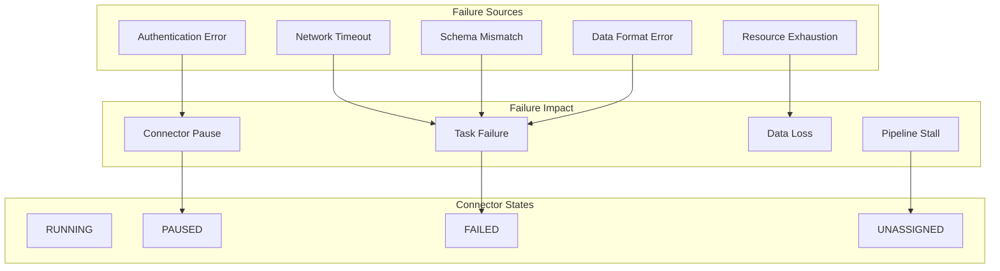
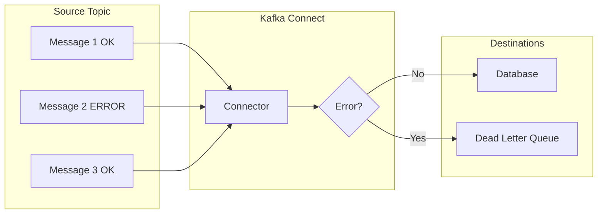
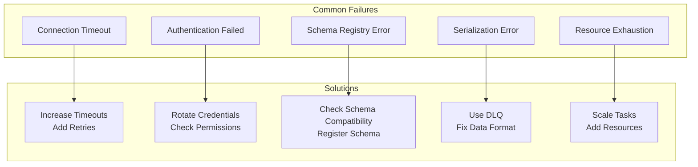

# How to Handle Kafka Connect Connector Failures

Author: [nawazdhandala](https://www.github.com/nawazdhandala)

Tags: Apache Kafka, Kafka Connect, Connectors, Data Integration, Error Handling, DevOps, Monitoring

Description: Learn strategies for handling Kafka Connect connector failures, including error tolerance, dead letter queues, monitoring, and automatic recovery.

---

Kafka Connect provides robust data integration between Kafka and external systems, but connectors can fail due to network issues, schema changes, or downstream system problems. This guide covers strategies for handling failures gracefully and building resilient data pipelines.

## Understanding Connector Failure Modes



## Connector Error Handling Configuration

### Basic Error Tolerance

Configure connectors to handle errors without failing immediately:

```json
{
  "name": "jdbc-sink-connector",
  "config": {
    "connector.class": "io.confluent.connect.jdbc.JdbcSinkConnector",
    "tasks.max": "3",
    "topics": "orders",
    "connection.url": "jdbc:postgresql://db:5432/warehouse",
    "connection.user": "connect_user",
    "connection.password": "${secrets:db-password}",

    "errors.tolerance": "all",
    "errors.log.enable": true,
    "errors.log.include.messages": true,

    "errors.deadletterqueue.topic.name": "orders-dlq",
    "errors.deadletterqueue.topic.replication.factor": 3,
    "errors.deadletterqueue.context.headers.enable": true,

    "errors.retry.timeout": 300000,
    "errors.retry.delay.max.ms": 60000
  }
}
```

### Error Tolerance Options

| Setting | Value | Description |
|---------|-------|-------------|
| `errors.tolerance` | `none` | Fail immediately on any error (default) |
| `errors.tolerance` | `all` | Skip problematic records and continue |
| `errors.log.enable` | `true` | Log error details |
| `errors.log.include.messages` | `true` | Include message content in logs |

## Implementing Dead Letter Queues

Dead letter queues (DLQs) capture failed records for later analysis and reprocessing.



### DLQ Configuration

```json
{
  "name": "elasticsearch-sink",
  "config": {
    "connector.class": "io.confluent.connect.elasticsearch.ElasticsearchSinkConnector",
    "topics": "logs",
    "connection.url": "http://elasticsearch:9200",
    "type.name": "_doc",
    "key.ignore": "true",

    "errors.tolerance": "all",

    "errors.deadletterqueue.topic.name": "logs-dlq",
    "errors.deadletterqueue.topic.replication.factor": 3,
    "errors.deadletterqueue.context.headers.enable": true
  }
}
```

### DLQ Message Headers

When `errors.deadletterqueue.context.headers.enable` is true, failed messages include diagnostic headers:

```
__connect.errors.topic: logs
__connect.errors.partition: 2
__connect.errors.offset: 12345
__connect.errors.connector.name: elasticsearch-sink
__connect.errors.task.id: 0
__connect.errors.stage: VALUE_CONVERTER
__connect.errors.class.name: org.apache.kafka.connect.errors.DataException
__connect.errors.exception.message: Failed to convert value to JSON
__connect.errors.exception.stacktrace: ...
```

### Processing DLQ Messages

Create a consumer to analyze and reprocess DLQ messages:

```java
public class DLQProcessor {
    private static final Logger log = LoggerFactory.getLogger(DLQProcessor.class);

    public static void main(String[] args) {
        Properties props = new Properties();
        props.put(ConsumerConfig.BOOTSTRAP_SERVERS_CONFIG, "localhost:9092");
        props.put(ConsumerConfig.GROUP_ID_CONFIG, "dlq-processor");
        props.put(ConsumerConfig.KEY_DESERIALIZER_CLASS_CONFIG,
            StringDeserializer.class.getName());
        props.put(ConsumerConfig.VALUE_DESERIALIZER_CLASS_CONFIG,
            ByteArrayDeserializer.class.getName());
        props.put(ConsumerConfig.AUTO_OFFSET_RESET_CONFIG, "earliest");

        try (KafkaConsumer<String, byte[]> consumer = new KafkaConsumer<>(props)) {
            consumer.subscribe(Collections.singletonList("logs-dlq"));

            while (true) {
                ConsumerRecords<String, byte[]> records =
                    consumer.poll(Duration.ofMillis(1000));

                for (ConsumerRecord<String, byte[]> record : records) {
                    processDLQRecord(record);
                }
            }
        }
    }

    private static void processDLQRecord(ConsumerRecord<String, byte[]> record) {
        // Extract error context from headers
        Headers headers = record.headers();

        String originalTopic = getHeader(headers, "__connect.errors.topic");
        String errorClass = getHeader(headers, "__connect.errors.exception.class.name");
        String errorMessage = getHeader(headers, "__connect.errors.exception.message");
        String stage = getHeader(headers, "__connect.errors.stage");

        log.info("DLQ Record - Topic: {}, Stage: {}, Error: {} - {}",
            originalTopic, stage, errorClass, errorMessage);

        // Analyze and potentially fix the record
        try {
            byte[] fixedValue = attemptFix(record.value(), errorClass);
            if (fixedValue != null) {
                // Republish to original topic for reprocessing
                republishRecord(originalTopic, record.key(), fixedValue);
            }
        } catch (Exception e) {
            log.error("Could not fix record", e);
            // Store for manual review
            storeForManualReview(record);
        }
    }

    private static String getHeader(Headers headers, String key) {
        Header header = headers.lastHeader(key);
        return header != null ? new String(header.value()) : null;
    }

    private static byte[] attemptFix(byte[] value, String errorClass) {
        // Implement fix logic based on error type
        if (errorClass.contains("JsonParseException")) {
            // Attempt to fix malformed JSON
            return fixMalformedJson(value);
        }
        return null;
    }

    private static byte[] fixMalformedJson(byte[] value) {
        // Implementation specific to your data format
        return null;
    }

    private static void republishRecord(String topic, String key, byte[] value) {
        // Publish fixed record back to original topic
    }

    private static void storeForManualReview(ConsumerRecord<String, byte[]> record) {
        // Store in database or file for manual analysis
    }
}
```

## Implementing Retry Logic

### Connector-Level Retries

```json
{
  "name": "http-sink-connector",
  "config": {
    "connector.class": "io.confluent.connect.http.HttpSinkConnector",
    "topics": "events",
    "http.api.url": "https://api.example.com/events",
    "tasks.max": "2",

    "errors.tolerance": "all",
    "errors.retry.timeout": 600000,
    "errors.retry.delay.max.ms": 60000,

    "retry.backoff.ms": 1000,
    "max.retries": 10,

    "behavior.on.error": "log",
    "reporter.error.topic.name": "http-errors",
    "reporter.error.topic.replication.factor": 3
  }
}
```

### Custom Retry Transformer

Create a Single Message Transform (SMT) for custom retry logic:

```java
public class RetryTransform<R extends ConnectRecord<R>> implements Transformation<R> {
    private static final Logger log = LoggerFactory.getLogger(RetryTransform.class);

    private static final String RETRY_COUNT_HEADER = "retry-count";
    private static final String RETRY_TIMESTAMP_HEADER = "retry-timestamp";

    private int maxRetries;
    private long retryDelayMs;

    @Override
    public void configure(Map<String, ?> configs) {
        maxRetries = (int) configs.getOrDefault("max.retries", 3);
        retryDelayMs = (long) configs.getOrDefault("retry.delay.ms", 5000L);
    }

    @Override
    public R apply(R record) {
        Headers headers = record.headers();

        // Check retry count
        Header retryHeader = headers.lastHeader(RETRY_COUNT_HEADER);
        int retryCount = retryHeader != null ?
            Integer.parseInt(new String(retryHeader.value())) : 0;

        if (retryCount >= maxRetries) {
            log.warn("Max retries exceeded for record at offset {}",
                record.kafkaOffset());
            // Return null to skip the record or throw exception
            return null;
        }

        // Add retry metadata
        headers.add(RETRY_COUNT_HEADER,
            String.valueOf(retryCount + 1).getBytes());
        headers.add(RETRY_TIMESTAMP_HEADER,
            String.valueOf(System.currentTimeMillis()).getBytes());

        return record;
    }

    @Override
    public ConfigDef config() {
        return new ConfigDef()
            .define("max.retries", ConfigDef.Type.INT, 3,
                ConfigDef.Importance.MEDIUM, "Maximum retry attempts")
            .define("retry.delay.ms", ConfigDef.Type.LONG, 5000L,
                ConfigDef.Importance.MEDIUM, "Delay between retries");
    }

    @Override
    public void close() {}
}
```

## Monitoring Connector Health

### REST API Monitoring

Create a monitoring script to check connector status:

```bash
#!/bin/bash
# monitor-connectors.sh

CONNECT_URL="${CONNECT_URL:-http://localhost:8083}"
ALERT_WEBHOOK="${ALERT_WEBHOOK:-}"

# Get list of all connectors
connectors=$(curl -s "$CONNECT_URL/connectors" | jq -r '.[]')

for connector in $connectors; do
    # Get connector status
    status=$(curl -s "$CONNECT_URL/connectors/$connector/status")

    # Extract connector state
    connector_state=$(echo "$status" | jq -r '.connector.state')

    # Check connector state
    if [ "$connector_state" != "RUNNING" ]; then
        echo "WARNING: Connector $connector is $connector_state"

        # Send alert
        if [ -n "$ALERT_WEBHOOK" ]; then
            curl -X POST "$ALERT_WEBHOOK" \
                -H "Content-Type: application/json" \
                -d "{\"connector\": \"$connector\", \"state\": \"$connector_state\"}"
        fi
    fi

    # Check task states
    task_count=$(echo "$status" | jq '.tasks | length')
    for i in $(seq 0 $((task_count - 1))); do
        task_state=$(echo "$status" | jq -r ".tasks[$i].state")
        task_id=$(echo "$status" | jq -r ".tasks[$i].id")

        if [ "$task_state" != "RUNNING" ]; then
            echo "WARNING: Task $task_id of $connector is $task_state"

            # Get error trace if failed
            if [ "$task_state" == "FAILED" ]; then
                trace=$(echo "$status" | jq -r ".tasks[$i].trace")
                echo "Error: $trace"
            fi
        fi
    done
done
```

### Prometheus Metrics

Enable JMX metrics for Prometheus monitoring:

```yaml
# docker-compose.yml
services:
  kafka-connect:
    image: confluentinc/cp-kafka-connect:7.5.0
    environment:
      KAFKA_JMX_PORT: 9999
      KAFKA_JMX_HOSTNAME: kafka-connect
      CONNECT_BOOTSTRAP_SERVERS: kafka:9092
      # ... other config
    ports:
      - "8083:8083"
      - "9999:9999"

  jmx-exporter:
    image: bitnami/jmx-exporter:latest
    command:
      - "9404"
      - /etc/jmx-exporter/config.yaml
    volumes:
      - ./jmx-exporter-config.yaml:/etc/jmx-exporter/config.yaml
    ports:
      - "9404:9404"
```

JMX exporter configuration:

```yaml
# jmx-exporter-config.yaml
hostPort: kafka-connect:9999
rules:
  # Connector metrics
  - pattern: 'kafka.connect<type=connector-metrics, connector=(.+)><>(.+): (.+)'
    name: kafka_connect_connector_$2
    labels:
      connector: $1
    value: $3
    type: GAUGE

  # Task metrics
  - pattern: 'kafka.connect<type=connector-task-metrics, connector=(.+), task=(.+)><>(.+): (.+)'
    name: kafka_connect_task_$3
    labels:
      connector: $1
      task: $2
    value: $4
    type: GAUGE

  # Error metrics
  - pattern: 'kafka.connect<type=task-error-metrics, connector=(.+), task=(.+)><>(.+): (.+)'
    name: kafka_connect_error_$3
    labels:
      connector: $1
      task: $2
    value: $4
    type: GAUGE
```

### Alerting Rules

```yaml
# prometheus-alerts.yaml
groups:
  - name: kafka-connect
    rules:
      # Alert when connector is not running
      - alert: KafkaConnectorNotRunning
        expr: kafka_connect_connector_status != 1
        for: 2m
        labels:
          severity: critical
        annotations:
          summary: "Kafka Connect connector {{ $labels.connector }} is not running"

      # Alert when task fails
      - alert: KafkaConnectTaskFailed
        expr: kafka_connect_task_status == 0
        for: 1m
        labels:
          severity: critical
        annotations:
          summary: "Task {{ $labels.task }} of connector {{ $labels.connector }} failed"

      # Alert on high error rate
      - alert: KafkaConnectHighErrorRate
        expr: rate(kafka_connect_error_total_record_errors[5m]) > 10
        for: 5m
        labels:
          severity: warning
        annotations:
          summary: "High error rate in connector {{ $labels.connector }}"

      # Alert on DLQ growth
      - alert: KafkaConnectDLQGrowing
        expr: increase(kafka_topic_partition_current_offset{topic=~".*-dlq"}[1h]) > 100
        for: 10m
        labels:
          severity: warning
        annotations:
          summary: "Dead letter queue {{ $labels.topic }} is growing"
```

## Automatic Recovery

### Connector Auto-Restart

Implement automatic connector restart on failure:

```python
#!/usr/bin/env python3
# auto-restart-connectors.py

import requests
import time
import logging

logging.basicConfig(level=logging.INFO)
logger = logging.getLogger(__name__)

CONNECT_URL = "http://localhost:8083"
CHECK_INTERVAL = 30  # seconds
MAX_RESTART_ATTEMPTS = 3

restart_attempts = {}

def get_connectors():
    """Get list of all connectors."""
    response = requests.get(f"{CONNECT_URL}/connectors")
    response.raise_for_status()
    return response.json()

def get_connector_status(connector):
    """Get status of a specific connector."""
    response = requests.get(f"{CONNECT_URL}/connectors/{connector}/status")
    response.raise_for_status()
    return response.json()

def restart_connector(connector):
    """Restart a connector."""
    logger.info(f"Restarting connector: {connector}")
    response = requests.post(f"{CONNECT_URL}/connectors/{connector}/restart")
    return response.status_code == 204

def restart_task(connector, task_id):
    """Restart a specific task."""
    logger.info(f"Restarting task {task_id} of connector {connector}")
    response = requests.post(
        f"{CONNECT_URL}/connectors/{connector}/tasks/{task_id}/restart"
    )
    return response.status_code == 204

def check_and_restart():
    """Check connector health and restart if needed."""
    connectors = get_connectors()

    for connector in connectors:
        status = get_connector_status(connector)
        connector_state = status['connector']['state']

        # Check connector state
        if connector_state == 'FAILED':
            key = f"connector:{connector}"
            attempts = restart_attempts.get(key, 0)

            if attempts < MAX_RESTART_ATTEMPTS:
                if restart_connector(connector):
                    restart_attempts[key] = attempts + 1
                    logger.info(f"Restarted connector {connector} "
                               f"(attempt {attempts + 1})")
            else:
                logger.error(f"Max restart attempts reached for {connector}")
        else:
            # Reset counter on success
            restart_attempts.pop(f"connector:{connector}", None)

        # Check task states
        for task in status['tasks']:
            task_id = task['id']
            task_state = task['state']

            if task_state == 'FAILED':
                key = f"task:{connector}:{task_id}"
                attempts = restart_attempts.get(key, 0)

                if attempts < MAX_RESTART_ATTEMPTS:
                    if restart_task(connector, task_id):
                        restart_attempts[key] = attempts + 1
                        logger.info(f"Restarted task {task_id} of {connector} "
                                   f"(attempt {attempts + 1})")
                else:
                    logger.error(f"Max restart attempts reached for "
                                f"task {task_id} of {connector}")
            else:
                restart_attempts.pop(f"task:{connector}:{task_id}", None)

def main():
    """Main loop."""
    logger.info("Starting connector monitor")

    while True:
        try:
            check_and_restart()
        except requests.exceptions.RequestException as e:
            logger.error(f"Error checking connectors: {e}")

        time.sleep(CHECK_INTERVAL)

if __name__ == "__main__":
    main()
```

### Kubernetes Operator Approach

For Kubernetes deployments, use a custom resource and operator:

```yaml
# kafka-connector.yaml
apiVersion: kafka.example.com/v1
kind: KafkaConnector
metadata:
  name: jdbc-sink
  namespace: kafka
spec:
  class: io.confluent.connect.jdbc.JdbcSinkConnector
  tasksMax: 3
  config:
    topics: orders
    connection.url: jdbc:postgresql://db:5432/warehouse
    connection.user: connect_user
    errors.tolerance: all
    errors.deadletterqueue.topic.name: orders-dlq

  # Auto-recovery settings
  autoRestart:
    enabled: true
    maxRestarts: 5
    restartDelay: 30s
    resetOnSuccess: true

  # Health check settings
  healthCheck:
    enabled: true
    interval: 30s
    failureThreshold: 3
```

## Connector Failure Patterns and Solutions



### Connection Timeout Solution

```json
{
  "name": "jdbc-source",
  "config": {
    "connector.class": "io.confluent.connect.jdbc.JdbcSourceConnector",
    "connection.url": "jdbc:postgresql://db:5432/app",

    "connection.attempts": 5,
    "connection.backoff.ms": 10000,

    "poll.interval.ms": 5000,
    "batch.max.rows": 1000,

    "query.timeout.ms": 30000,
    "transaction.isolation.mode": "read_committed"
  }
}
```

### Schema Registry Error Solution

```json
{
  "name": "avro-sink",
  "config": {
    "connector.class": "io.confluent.connect.s3.S3SinkConnector",
    "topics": "events",

    "key.converter": "io.confluent.connect.avro.AvroConverter",
    "key.converter.schema.registry.url": "http://schema-registry:8081",
    "key.converter.schema.registry.basic.auth.user.info": "user:password",

    "value.converter": "io.confluent.connect.avro.AvroConverter",
    "value.converter.schema.registry.url": "http://schema-registry:8081",
    "value.converter.schemas.enable": true,

    "schema.compatibility.level": "BACKWARD",

    "errors.tolerance": "all",
    "errors.deadletterqueue.topic.name": "events-dlq"
  }
}
```

## Best Practices

1. **Always configure error tolerance** - Use `errors.tolerance=all` with DLQ for production
2. **Implement DLQ processing** - Monitor and reprocess failed records
3. **Set appropriate timeouts** - Balance between resilience and failure detection
4. **Monitor connector metrics** - Alert on failures before they impact data
5. **Use incremental snapshots** - For source connectors, avoid full table scans
6. **Test failure scenarios** - Simulate network failures, authentication expiry
7. **Document recovery procedures** - Create runbooks for common failure modes
8. **Version your connector configs** - Track changes in source control

---

Kafka Connect provides robust built-in mechanisms for handling failures. By configuring error tolerance, implementing dead letter queues, and setting up proper monitoring, you can build resilient data pipelines that handle failures gracefully while maintaining data integrity. The key is to plan for failures from the start rather than treating them as exceptional cases.
