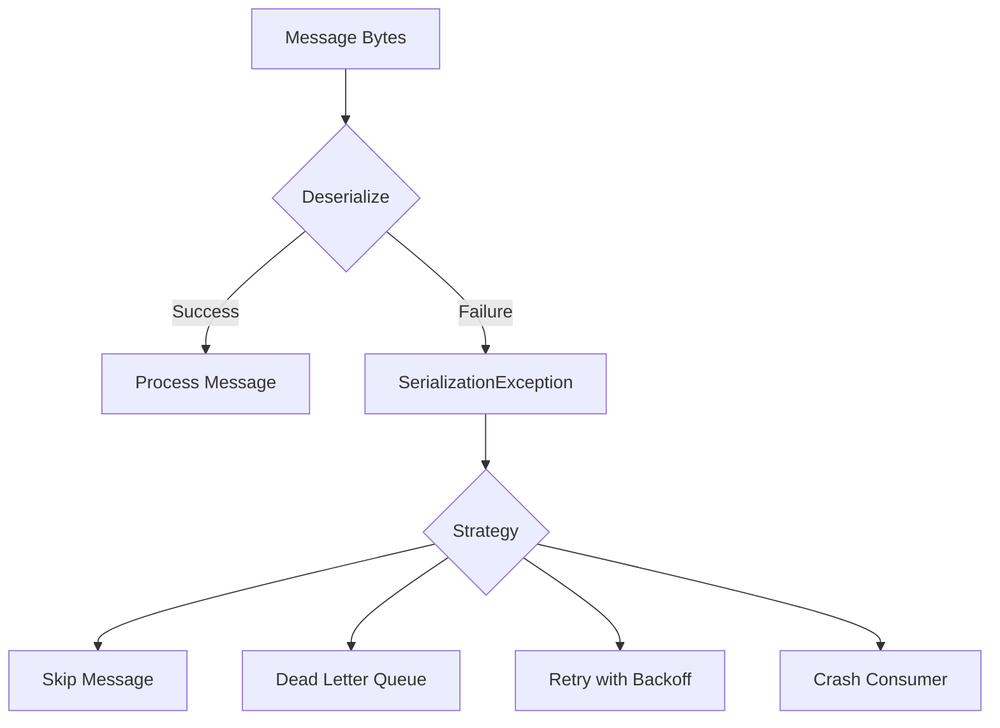
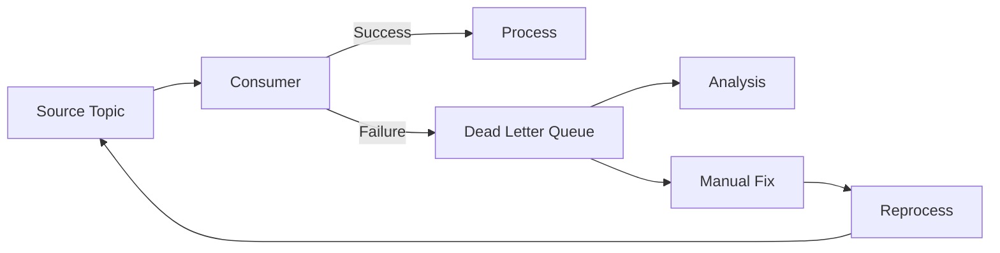
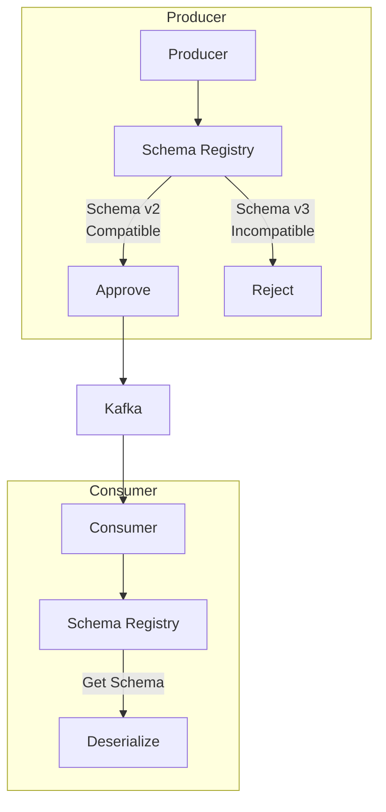
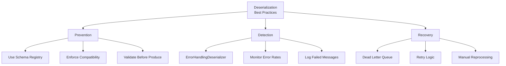

# How to Handle Kafka Consumer Deserialization Errors

Author: [nawazdhandala](https://www.github.com/nawazdhandala)

Tags: Apache Kafka, Deserialization, Error Handling, Consumer, Schema, Avro, JSON, DevOps

Description: A practical guide to handling deserialization errors in Kafka consumers, including error handling strategies, dead letter queues, and schema evolution patterns.

---

Deserialization errors are among the most common issues in Kafka consumers. A single malformed message can crash your consumer or cause infinite retry loops. This guide shows you how to handle these errors gracefully.

## Understanding Deserialization Errors

When a consumer reads a message, it must deserialize the bytes back into objects. If this fails, you get a `SerializationException`.



### Common Causes

| Cause | Example |
|-------|---------|
| Schema mismatch | Producer uses Avro v2, consumer expects v1 |
| Corrupted data | Network issues caused byte corruption |
| Wrong serializer | Producer sent JSON, consumer expects Avro |
| Encoding issues | UTF-8 vs UTF-16 mismatch |
| Null handling | Unexpected null where value expected |

## Default Behavior: Crash

By default, Kafka consumers crash on deserialization errors.

```java
// This will crash on any bad message
Properties props = new Properties();
props.put("bootstrap.servers", "localhost:9092");
props.put("group.id", "my-group");
props.put("key.deserializer", "org.apache.kafka.common.serialization.StringDeserializer");
props.put("value.deserializer", "io.confluent.kafka.serializers.KafkaAvroDeserializer");

KafkaConsumer<String, User> consumer = new KafkaConsumer<>(props);
consumer.subscribe(Collections.singletonList("users"));

// Crashes here if message cannot be deserialized
ConsumerRecords<String, User> records = consumer.poll(Duration.ofSeconds(10));
```

## Strategy 1: ErrorHandlingDeserializer (Recommended)

Kafka provides `ErrorHandlingDeserializer` that wraps your deserializer and catches errors.

```java
import org.apache.kafka.common.serialization.Deserializer;
import org.apache.kafka.common.serialization.StringDeserializer;
import org.apache.kafka.common.errors.SerializationException;
import org.springframework.kafka.support.serializer.ErrorHandlingDeserializer;

Properties props = new Properties();
props.put("bootstrap.servers", "localhost:9092");
props.put("group.id", "my-group");

// Wrap deserializers with error handling
props.put("key.deserializer", ErrorHandlingDeserializer.class.getName());
props.put("value.deserializer", ErrorHandlingDeserializer.class.getName());

// Specify the actual deserializers
props.put(ErrorHandlingDeserializer.KEY_DESERIALIZER_CLASS, StringDeserializer.class);
props.put(ErrorHandlingDeserializer.VALUE_DESERIALIZER_CLASS,
    "io.confluent.kafka.serializers.KafkaAvroDeserializer");

// Configure schema registry for Avro
props.put("schema.registry.url", "http://localhost:8081");
```

### Processing with Error Handling

```java
public class SafeConsumer {
    private final KafkaConsumer<String, User> consumer;
    private final DeadLetterProducer dlqProducer;

    public void consume() {
        while (true) {
            ConsumerRecords<String, User> records = consumer.poll(Duration.ofSeconds(10));

            for (ConsumerRecord<String, User> record : records) {
                // Check for deserialization error header
                Header errorHeader = record.headers().lastHeader(
                    ErrorHandlingDeserializer.VALUE_DESERIALIZER_EXCEPTION_HEADER);

                if (errorHeader != null) {
                    // Deserialization failed - handle the error
                    handleDeserializationError(record, errorHeader);
                    continue;
                }

                // Normal processing
                processRecord(record);
            }

            consumer.commitSync();
        }
    }

    private void handleDeserializationError(ConsumerRecord<String, User> record,
                                            Header errorHeader) {
        // Extract error details
        DeserializationException exception =
            (DeserializationException) SerializationUtils.deserialize(errorHeader.value());

        System.err.println("Deserialization error: " + exception.getMessage());
        System.err.println("Topic: " + record.topic());
        System.err.println("Partition: " + record.partition());
        System.err.println("Offset: " + record.offset());

        // Send to dead letter queue
        dlqProducer.send(record, exception);

        // Record metric
        Metrics.counter("kafka.deserialization.errors",
            "topic", record.topic()).increment();
    }
}
```

## Strategy 2: Custom Deserializer with Try-Catch

Create a custom deserializer that handles errors internally.

```java
import org.apache.kafka.common.serialization.Deserializer;
import com.fasterxml.jackson.databind.ObjectMapper;

public class SafeJsonDeserializer<T> implements Deserializer<T> {
    private final ObjectMapper objectMapper = new ObjectMapper();
    private Class<T> targetType;

    @Override
    public void configure(Map<String, ?> configs, boolean isKey) {
        // Get target type from config
        String className = (String) configs.get("json.target.type");
        try {
            this.targetType = (Class<T>) Class.forName(className);
        } catch (ClassNotFoundException e) {
            throw new RuntimeException("Cannot find class: " + className, e);
        }
    }

    @Override
    public T deserialize(String topic, byte[] data) {
        if (data == null) {
            return null;
        }

        try {
            return objectMapper.readValue(data, targetType);
        } catch (Exception e) {
            // Log error but return null instead of crashing
            System.err.println("Failed to deserialize message from topic " + topic +
                ": " + e.getMessage());
            return null;
        }
    }

    @Override
    public void close() {
        // Nothing to close
    }
}
```

### Using the Safe Deserializer

```java
Properties props = new Properties();
props.put("bootstrap.servers", "localhost:9092");
props.put("group.id", "my-group");
props.put("key.deserializer", StringDeserializer.class.getName());
props.put("value.deserializer", SafeJsonDeserializer.class.getName());
props.put("json.target.type", "com.example.User");

KafkaConsumer<String, User> consumer = new KafkaConsumer<>(props);

// Process records, checking for nulls
for (ConsumerRecord<String, User> record : records) {
    if (record.value() == null) {
        // Deserialization failed - handle appropriately
        handleFailedRecord(record);
    } else {
        processRecord(record);
    }
}
```

## Strategy 3: Dead Letter Queue (DLQ)

Send failed messages to a separate topic for later analysis and reprocessing.



### DLQ Producer

```java
public class DeadLetterProducer {
    private final KafkaProducer<byte[], byte[]> producer;
    private final String dlqTopicPrefix;

    public DeadLetterProducer(String bootstrapServers, String dlqTopicPrefix) {
        this.dlqTopicPrefix = dlqTopicPrefix;

        Properties props = new Properties();
        props.put("bootstrap.servers", bootstrapServers);
        // Use byte array serializers to preserve original message
        props.put("key.serializer",
            "org.apache.kafka.common.serialization.ByteArraySerializer");
        props.put("value.serializer",
            "org.apache.kafka.common.serialization.ByteArraySerializer");

        this.producer = new KafkaProducer<>(props);
    }

    public void send(ConsumerRecord<?, ?> failedRecord, Exception error) {
        String dlqTopic = dlqTopicPrefix + "." + failedRecord.topic();

        // Create DLQ record with original bytes
        ProducerRecord<byte[], byte[]> dlqRecord = new ProducerRecord<>(
            dlqTopic,
            null,  // partition
            failedRecord.timestamp(),
            toBytes(failedRecord.key()),
            toBytes(failedRecord.value())
        );

        // Add headers with error context
        dlqRecord.headers()
            .add("dlq.original.topic", failedRecord.topic().getBytes())
            .add("dlq.original.partition",
                String.valueOf(failedRecord.partition()).getBytes())
            .add("dlq.original.offset",
                String.valueOf(failedRecord.offset()).getBytes())
            .add("dlq.error.message", error.getMessage().getBytes())
            .add("dlq.error.class", error.getClass().getName().getBytes())
            .add("dlq.timestamp",
                String.valueOf(System.currentTimeMillis()).getBytes());

        // Copy original headers
        for (Header header : failedRecord.headers()) {
            dlqRecord.headers().add("dlq.original.header." + header.key(),
                header.value());
        }

        producer.send(dlqRecord, (metadata, exception) -> {
            if (exception != null) {
                System.err.println("Failed to send to DLQ: " + exception.getMessage());
            }
        });
    }

    private byte[] toBytes(Object obj) {
        if (obj == null) return null;
        if (obj instanceof byte[]) return (byte[]) obj;
        return obj.toString().getBytes();
    }
}
```

### DLQ Consumer for Reprocessing

```java
public class DlqReprocessor {
    private final KafkaConsumer<byte[], byte[]> consumer;
    private final KafkaProducer<byte[], byte[]> producer;

    public void reprocess() {
        ConsumerRecords<byte[], byte[]> records = consumer.poll(Duration.ofSeconds(10));

        for (ConsumerRecord<byte[], byte[]> record : records) {
            // Extract original topic from headers
            String originalTopic = new String(
                record.headers().lastHeader("dlq.original.topic").value());

            // Attempt to reprocess
            try {
                // Validate message can be deserialized now
                validateMessage(record.value());

                // Send back to original topic
                producer.send(new ProducerRecord<>(
                    originalTopic,
                    record.key(),
                    record.value()
                ));

                System.out.println("Reprocessed message to " + originalTopic);
            } catch (Exception e) {
                System.err.println("Still cannot process: " + e.getMessage());
                // Leave in DLQ for manual intervention
            }
        }

        consumer.commitSync();
    }
}
```

## Strategy 4: Schema Registry with Compatibility

Prevent deserialization errors by enforcing schema compatibility.



### Configure Schema Registry

```bash
# Set compatibility mode to BACKWARD
curl -X PUT \
  -H "Content-Type: application/vnd.schemaregistry.v1+json" \
  --data '{"compatibility": "BACKWARD"}' \
  http://localhost:8081/config/users-value
```

### Compatibility Modes

| Mode | Description | Safe For |
|------|-------------|----------|
| BACKWARD | New schema can read old data | Adding optional fields |
| FORWARD | Old schema can read new data | Removing optional fields |
| FULL | Both backward and forward | Adding/removing optional |
| NONE | No compatibility check | Breaking changes |

### Avro Schema Evolution Example

```json
// Schema v1
{
  "type": "record",
  "name": "User",
  "fields": [
    {"name": "id", "type": "string"},
    {"name": "name", "type": "string"}
  ]
}

// Schema v2 - BACKWARD compatible (new optional field with default)
{
  "type": "record",
  "name": "User",
  "fields": [
    {"name": "id", "type": "string"},
    {"name": "name", "type": "string"},
    {"name": "email", "type": ["null", "string"], "default": null}
  ]
}
```

## Strategy 5: Retry with Exponential Backoff

For transient errors, retry with increasing delays.

```java
public class RetryingConsumer {
    private final KafkaConsumer<String, String> consumer;
    private final int maxRetries = 3;
    private final long initialBackoffMs = 1000;

    public void processWithRetry(ConsumerRecord<String, String> record) {
        int attempt = 0;
        Exception lastException = null;

        while (attempt < maxRetries) {
            try {
                // Try to deserialize and process
                User user = deserialize(record.value());
                process(user);
                return;  // Success

            } catch (SerializationException e) {
                lastException = e;
                attempt++;

                if (attempt < maxRetries) {
                    long backoff = initialBackoffMs * (long) Math.pow(2, attempt - 1);
                    System.out.println("Retry " + attempt + " after " + backoff + "ms");

                    try {
                        Thread.sleep(backoff);
                    } catch (InterruptedException ie) {
                        Thread.currentThread().interrupt();
                        break;
                    }
                }
            }
        }

        // All retries failed - send to DLQ
        dlqProducer.send(record, lastException);
    }
}
```

## Spring Kafka Error Handling

If using Spring Kafka, use `SeekToCurrentErrorHandler` or `DefaultErrorHandler`.

```java
import org.springframework.kafka.listener.DefaultErrorHandler;
import org.springframework.kafka.listener.DeadLetterPublishingRecoverer;
import org.springframework.util.backoff.FixedBackOff;

@Configuration
public class KafkaConfig {

    @Bean
    public ConcurrentKafkaListenerContainerFactory<String, User> kafkaListenerContainerFactory(
            ConsumerFactory<String, User> consumerFactory,
            KafkaTemplate<byte[], byte[]> dlqTemplate) {

        ConcurrentKafkaListenerContainerFactory<String, User> factory =
            new ConcurrentKafkaListenerContainerFactory<>();
        factory.setConsumerFactory(consumerFactory);

        // Configure error handler with DLQ
        DeadLetterPublishingRecoverer recoverer = new DeadLetterPublishingRecoverer(
            dlqTemplate,
            (record, ex) -> new TopicPartition("dlq." + record.topic(), record.partition())
        );

        // Retry 3 times with 1 second backoff, then send to DLQ
        DefaultErrorHandler errorHandler = new DefaultErrorHandler(
            recoverer,
            new FixedBackOff(1000L, 3L)
        );

        // Add specific exception types that should not be retried
        errorHandler.addNotRetryableExceptions(
            SerializationException.class,
            DeserializationException.class
        );

        factory.setCommonErrorHandler(errorHandler);
        return factory;
    }
}
```

### Listener with Error Handling

```java
@Service
public class UserListener {

    @KafkaListener(topics = "users", groupId = "user-processor")
    public void listen(
            @Payload User user,
            @Header(KafkaHeaders.RECEIVED_TOPIC) String topic,
            @Header(KafkaHeaders.RECEIVED_PARTITION) int partition,
            @Header(KafkaHeaders.OFFSET) long offset) {

        // Process user - errors are handled by DefaultErrorHandler
        processUser(user);
    }

    @KafkaListener(topics = "dlq.users", groupId = "dlq-processor")
    public void listenDlq(
            @Payload byte[] payload,
            @Headers MessageHeaders headers) {

        // Handle dead letter queue messages
        String originalTopic = new String(
            (byte[]) headers.get("kafka_dlt-original-topic"));
        String exception = new String(
            (byte[]) headers.get("kafka_dlt-exception-message"));

        System.err.println("DLQ message from " + originalTopic + ": " + exception);

        // Log for analysis, alert, or attempt manual fix
    }
}
```

## Monitoring and Alerting

### Metrics to Track

```java
public class MetricsEmitter {
    private final MeterRegistry registry;

    public void recordDeserializationError(String topic, String errorType) {
        registry.counter("kafka.consumer.deserialization.errors",
            "topic", topic,
            "error_type", errorType
        ).increment();
    }

    public void recordDlqMessage(String originalTopic) {
        registry.counter("kafka.dlq.messages",
            "original_topic", originalTopic
        ).increment();
    }

    public void recordRetry(String topic, int attemptNumber) {
        registry.counter("kafka.consumer.retries",
            "topic", topic,
            "attempt", String.valueOf(attemptNumber)
        ).increment();
    }
}
```

### Prometheus Alerts

```yaml
groups:
  - name: kafka-deserialization
    rules:
      - alert: HighDeserializationErrors
        expr: rate(kafka_consumer_deserialization_errors_total[5m]) > 10
        for: 5m
        labels:
          severity: warning
        annotations:
          summary: "High Kafka deserialization error rate"
          description: "{{ $value }} errors/sec for topic {{ $labels.topic }}"

      - alert: DlqGrowing
        expr: kafka_consumer_group_lag{topic=~"dlq.*"} > 1000
        for: 15m
        labels:
          severity: warning
        annotations:
          summary: "DLQ has significant backlog"
          description: "{{ $value }} messages in DLQ"
```

## Best Practices Summary



### Checklist

- [ ] Use `ErrorHandlingDeserializer` to prevent crashes
- [ ] Implement Dead Letter Queue for failed messages
- [ ] Use Schema Registry with compatibility enforcement
- [ ] Monitor deserialization error rates
- [ ] Alert on high error rates or DLQ growth
- [ ] Document schema evolution procedures
- [ ] Test consumer against malformed data
- [ ] Have a reprocessing strategy for DLQ messages

---

Deserialization errors will happen in any long-running Kafka system. The key is to handle them gracefully without losing data. Use `ErrorHandlingDeserializer` for safety, implement a Dead Letter Queue for recovery, and enforce schema compatibility to prevent most issues before they occur.
