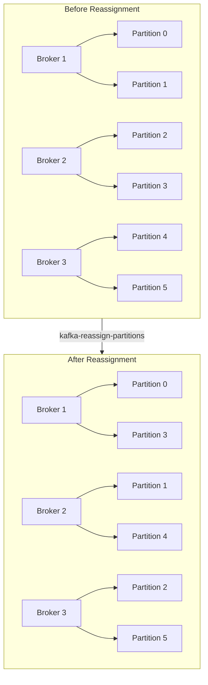
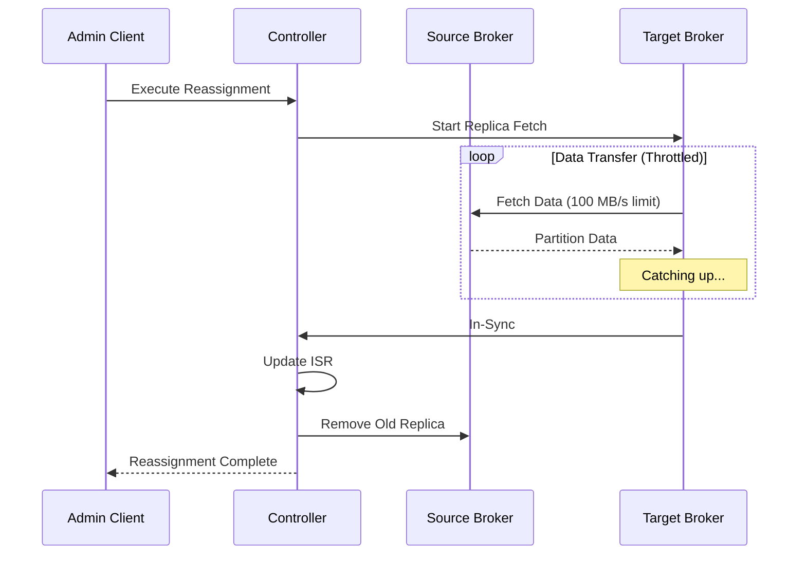
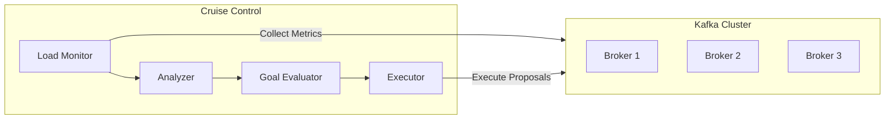

# How to Handle Kafka Partition Reassignment

Author: [nawazdhandala](https://www.github.com/nawazdhandala)

Tags: Kafka, Partition Reassignment, Rebalancing, Consumer Groups, Operations, High Availability, Scaling

Description: Learn how to safely execute Kafka partition reassignments for scaling, load balancing, and broker decommissioning while minimizing impact on consumers and maintaining data availability.

---

> Partition reassignment is essential for Kafka cluster operations - scaling brokers, balancing load, and decommissioning nodes. Done incorrectly, it can cause consumer disruption and data unavailability. This guide covers safe reassignment strategies for production environments.

Kafka partitions are the unit of parallelism and data distribution. Reassigning partitions moves data between brokers and requires careful planning to avoid impacting your consumers and producers.

---

## Understanding Partition Reassignment



### When to Reassign Partitions

- **Adding new brokers** - Distribute existing partitions to new nodes
- **Removing brokers** - Move partitions off nodes being decommissioned
- **Load balancing** - Even out disk or network usage across brokers
- **Rack awareness** - Ensure replicas are distributed across failure domains

---

## Planning the Reassignment

### Step 1: Assess Current State

```bash
# List all topics and their partition distribution
kafka-topics.sh --bootstrap-server localhost:9092 --describe

# Check broker disk usage
kafka-log-dirs.sh --bootstrap-server localhost:9092 \
  --describe --broker-list 0,1,2

# Get detailed partition info for a specific topic
kafka-topics.sh --bootstrap-server localhost:9092 \
  --describe --topic my-topic
```

### Step 2: Generate Reassignment Plan

Create a JSON file listing topics to reassign:

```json
{
  "version": 1,
  "topics": [
    {"topic": "orders"},
    {"topic": "events"},
    {"topic": "logs"}
  ]
}
```

Generate the reassignment plan:

```bash
# Generate reassignment plan for moving to brokers 0,1,2,3
kafka-reassign-partitions.sh --bootstrap-server localhost:9092 \
  --topics-to-move-json-file topics.json \
  --broker-list "0,1,2,3" \
  --generate
```

This outputs a proposed plan and the current assignment for rollback.

### Step 3: Review and Customize the Plan

The generated plan may not be optimal. Review and adjust it:

```json
{
  "version": 1,
  "partitions": [
    {
      "topic": "orders",
      "partition": 0,
      "replicas": [1, 2, 3],
      "log_dirs": ["any", "any", "any"]
    },
    {
      "topic": "orders",
      "partition": 1,
      "replicas": [2, 3, 0],
      "log_dirs": ["any", "any", "any"]
    },
    {
      "topic": "orders",
      "partition": 2,
      "replicas": [3, 0, 1],
      "log_dirs": ["any", "any", "any"]
    }
  ]
}
```

---

## Executing Reassignment Safely

### Using Throttling

Always throttle reassignment to avoid overwhelming the cluster:

```bash
# Execute reassignment with throttle (100 MB/s)
kafka-reassign-partitions.sh --bootstrap-server localhost:9092 \
  --reassignment-json-file reassignment.json \
  --execute \
  --throttle 104857600
```



### Monitoring Progress

```bash
# Check reassignment status
kafka-reassign-partitions.sh --bootstrap-server localhost:9092 \
  --reassignment-json-file reassignment.json \
  --verify

# Monitor reassignment metrics
kafka-consumer-groups.sh --bootstrap-server localhost:9092 \
  --describe --all-groups

# Check under-replicated partitions
kafka-topics.sh --bootstrap-server localhost:9092 \
  --describe --under-replicated-partitions
```

### Adjusting Throttle During Reassignment

```bash
# Increase throttle if cluster can handle more
kafka-reassign-partitions.sh --bootstrap-server localhost:9092 \
  --reassignment-json-file reassignment.json \
  --execute \
  --throttle 209715200

# Remove throttle after completion (important!)
kafka-reassign-partitions.sh --bootstrap-server localhost:9092 \
  --reassignment-json-file reassignment.json \
  --verify

# If verification shows complete, remove throttle config
kafka-configs.sh --bootstrap-server localhost:9092 \
  --alter --entity-type brokers --entity-default \
  --delete-config follower.replication.throttled.rate,leader.replication.throttled.rate
```

---

## Handling Consumer Group Rebalancing

Partition reassignment triggers consumer rebalancing. Handle it gracefully:

### Consumer Configuration for Smooth Rebalancing

```java
import org.apache.kafka.clients.consumer.*;
import java.util.*;

public class RebalanceAwareConsumer {

    public static KafkaConsumer<String, String> createConsumer(String groupId) {
        Properties props = new Properties();
        props.put(ConsumerConfig.BOOTSTRAP_SERVERS_CONFIG, "localhost:9092");
        props.put(ConsumerConfig.GROUP_ID_CONFIG, groupId);
        props.put(ConsumerConfig.KEY_DESERIALIZER_CLASS_CONFIG,
            "org.apache.kafka.common.serialization.StringDeserializer");
        props.put(ConsumerConfig.VALUE_DESERIALIZER_CLASS_CONFIG,
            "org.apache.kafka.common.serialization.StringDeserializer");

        // REBALANCE OPTIMIZATION SETTINGS

        // Use cooperative rebalancing for minimal disruption
        // Incremental rebalancing only reassigns affected partitions
        props.put(ConsumerConfig.PARTITION_ASSIGNMENT_STRATEGY_CONFIG,
            "org.apache.kafka.clients.consumer.CooperativeStickyAssignor");

        // Heartbeat and session timeout configuration
        props.put(ConsumerConfig.HEARTBEAT_INTERVAL_MS_CONFIG, 3000);
        props.put(ConsumerConfig.SESSION_TIMEOUT_MS_CONFIG, 45000);

        // Maximum time for processing before next poll
        props.put(ConsumerConfig.MAX_POLL_INTERVAL_MS_CONFIG, 300000);

        // Disable auto-commit for manual control during rebalance
        props.put(ConsumerConfig.ENABLE_AUTO_COMMIT_CONFIG, "false");

        return new KafkaConsumer<>(props);
    }
}
```

### Implementing Rebalance Listener

```java
import org.apache.kafka.clients.consumer.*;
import org.apache.kafka.common.TopicPartition;
import java.util.*;
import java.util.concurrent.ConcurrentHashMap;

public class GracefulRebalanceConsumer {
    private final KafkaConsumer<String, String> consumer;
    private final Map<TopicPartition, Long> currentOffsets = new ConcurrentHashMap<>();

    public GracefulRebalanceConsumer(String groupId, String topic) {
        consumer = RebalanceAwareConsumer.createConsumer(groupId);

        // Subscribe with rebalance listener
        consumer.subscribe(Collections.singletonList(topic), new ConsumerRebalanceListener() {

            @Override
            public void onPartitionsRevoked(Collection<TopicPartition> partitions) {
                // Called before partitions are taken away
                System.out.println("Partitions being revoked: " + partitions);

                // Commit current offsets before losing partitions
                commitCurrentOffsets();

                // Clean up any partition-specific state
                for (TopicPartition partition : partitions) {
                    cleanupPartitionState(partition);
                }
            }

            @Override
            public void onPartitionsAssigned(Collection<TopicPartition> partitions) {
                // Called after new partitions are assigned
                System.out.println("Partitions assigned: " + partitions);

                // Initialize state for new partitions
                for (TopicPartition partition : partitions) {
                    initializePartitionState(partition);
                }
            }

            @Override
            public void onPartitionsLost(Collection<TopicPartition> partitions) {
                // Called when partitions are lost unexpectedly (cooperative rebalancing)
                System.out.println("Partitions lost: " + partitions);

                // Cannot commit offsets - partitions already gone
                // Just clean up local state
                for (TopicPartition partition : partitions) {
                    cleanupPartitionState(partition);
                }
            }
        });
    }

    public void processMessages() {
        while (true) {
            ConsumerRecords<String, String> records = consumer.poll(Duration.ofMillis(100));

            for (ConsumerRecord<String, String> record : records) {
                // Process record
                processRecord(record);

                // Track offset for commit
                currentOffsets.put(
                    new TopicPartition(record.topic(), record.partition()),
                    record.offset() + 1
                );
            }

            // Periodic commit
            if (!records.isEmpty()) {
                commitCurrentOffsets();
            }
        }
    }

    private void commitCurrentOffsets() {
        if (!currentOffsets.isEmpty()) {
            Map<TopicPartition, OffsetAndMetadata> offsets = new HashMap<>();
            for (Map.Entry<TopicPartition, Long> entry : currentOffsets.entrySet()) {
                offsets.put(entry.getKey(), new OffsetAndMetadata(entry.getValue()));
            }

            try {
                consumer.commitSync(offsets);
                System.out.println("Committed offsets: " + offsets);
            } catch (CommitFailedException e) {
                System.err.println("Commit failed: " + e.getMessage());
            }
        }
    }

    private void processRecord(ConsumerRecord<String, String> record) {
        // Your processing logic
    }

    private void initializePartitionState(TopicPartition partition) {
        // Initialize any partition-specific state (e.g., local cache, counters)
        System.out.println("Initializing state for " + partition);
    }

    private void cleanupPartitionState(TopicPartition partition) {
        // Clean up partition-specific state
        currentOffsets.remove(partition);
        System.out.println("Cleaned up state for " + partition);
    }
}
```

---

## Automated Reassignment with Cruise Control

For large clusters, use Cruise Control for automated rebalancing:



### Cruise Control API Usage

```bash
# Get current cluster state
curl -X GET "http://localhost:9090/kafkacruisecontrol/state"

# Generate rebalance proposal
curl -X POST "http://localhost:9090/kafkacruisecontrol/rebalance?dryrun=true"

# Execute rebalance with throttle
curl -X POST "http://localhost:9090/kafkacruisecontrol/rebalance?throttle_added_broker=104857600"

# Check execution status
curl -X GET "http://localhost:9090/kafkacruisecontrol/user_tasks"

# Add new broker and rebalance
curl -X POST "http://localhost:9090/kafkacruisecontrol/add_broker?brokerid=3"

# Remove broker (decommission)
curl -X POST "http://localhost:9090/kafkacruisecontrol/remove_broker?brokerid=2"
```

---

## Scripted Reassignment Tool

Here is a Python script for automated reassignment with monitoring:

```python
#!/usr/bin/env python3
"""
Kafka Partition Reassignment Tool with Progress Monitoring
"""

import json
import subprocess
import time
import argparse
from typing import Dict, List, Optional

class KafkaReassignment:
    def __init__(self, bootstrap_servers: str, throttle_bytes: int = 104857600):
        self.bootstrap_servers = bootstrap_servers
        self.throttle_bytes = throttle_bytes

    def get_topic_partitions(self, topic: str) -> Dict:
        """Get current partition assignment for a topic"""
        result = subprocess.run([
            'kafka-topics.sh',
            '--bootstrap-server', self.bootstrap_servers,
            '--describe',
            '--topic', topic
        ], capture_output=True, text=True)

        # Parse output
        partitions = {}
        for line in result.stdout.strip().split('\n'):
            if 'Partition:' in line:
                parts = line.split('\t')
                partition = int(parts[1].split(':')[1].strip())
                replicas = [int(r) for r in parts[4].split(':')[1].strip().split(',')]
                partitions[partition] = replicas

        return partitions

    def generate_reassignment_plan(
        self,
        topic: str,
        target_brokers: List[int],
        replication_factor: int = 3
    ) -> Dict:
        """Generate a balanced reassignment plan"""
        current = self.get_topic_partitions(topic)
        num_partitions = len(current)
        num_brokers = len(target_brokers)

        plan = {
            "version": 1,
            "partitions": []
        }

        for partition in range(num_partitions):
            # Round-robin assignment across brokers
            replicas = []
            for r in range(replication_factor):
                broker_idx = (partition + r) % num_brokers
                replicas.append(target_brokers[broker_idx])

            plan["partitions"].append({
                "topic": topic,
                "partition": partition,
                "replicas": replicas,
                "log_dirs": ["any"] * replication_factor
            })

        return plan

    def execute_reassignment(self, plan: Dict, plan_file: str = "/tmp/reassignment.json") -> bool:
        """Execute the reassignment plan with throttling"""
        # Write plan to file
        with open(plan_file, 'w') as f:
            json.dump(plan, f, indent=2)

        print(f"Executing reassignment with throttle: {self.throttle_bytes} bytes/sec")

        result = subprocess.run([
            'kafka-reassign-partitions.sh',
            '--bootstrap-server', self.bootstrap_servers,
            '--reassignment-json-file', plan_file,
            '--execute',
            '--throttle', str(self.throttle_bytes)
        ], capture_output=True, text=True)

        print(result.stdout)

        if result.returncode != 0:
            print(f"Error: {result.stderr}")
            return False

        return True

    def verify_reassignment(self, plan_file: str = "/tmp/reassignment.json") -> Dict:
        """Check reassignment progress"""
        result = subprocess.run([
            'kafka-reassign-partitions.sh',
            '--bootstrap-server', self.bootstrap_servers,
            '--reassignment-json-file', plan_file,
            '--verify'
        ], capture_output=True, text=True)

        status = {
            "in_progress": [],
            "completed": [],
            "failed": []
        }

        for line in result.stdout.strip().split('\n'):
            if 'in progress' in line.lower():
                status["in_progress"].append(line)
            elif 'completed successfully' in line.lower():
                status["completed"].append(line)
            elif 'failed' in line.lower():
                status["failed"].append(line)

        return status

    def wait_for_completion(
        self,
        plan_file: str = "/tmp/reassignment.json",
        check_interval: int = 30,
        timeout: int = 3600
    ) -> bool:
        """Wait for reassignment to complete with progress updates"""
        start_time = time.time()

        while time.time() - start_time < timeout:
            status = self.verify_reassignment(plan_file)

            total = len(status["in_progress"]) + len(status["completed"]) + len(status["failed"])
            completed = len(status["completed"])
            in_progress = len(status["in_progress"])
            failed = len(status["failed"])

            print(f"Progress: {completed}/{total} completed, {in_progress} in progress, {failed} failed")

            if in_progress == 0:
                if failed > 0:
                    print(f"Reassignment completed with {failed} failures")
                    return False
                else:
                    print("Reassignment completed successfully")
                    self.remove_throttle()
                    return True

            time.sleep(check_interval)

        print("Timeout waiting for reassignment")
        return False

    def remove_throttle(self):
        """Remove replication throttle after completion"""
        print("Removing replication throttle...")

        subprocess.run([
            'kafka-configs.sh',
            '--bootstrap-server', self.bootstrap_servers,
            '--alter',
            '--entity-type', 'brokers',
            '--entity-default',
            '--delete-config',
            'follower.replication.throttled.rate,leader.replication.throttled.rate'
        ], capture_output=True)


def main():
    parser = argparse.ArgumentParser(description='Kafka Partition Reassignment Tool')
    parser.add_argument('--bootstrap-server', required=True, help='Kafka bootstrap servers')
    parser.add_argument('--topic', required=True, help='Topic to reassign')
    parser.add_argument('--brokers', required=True, help='Comma-separated target broker IDs')
    parser.add_argument('--throttle', type=int, default=104857600, help='Throttle in bytes/sec')
    parser.add_argument('--replication-factor', type=int, default=3, help='Replication factor')

    args = parser.parse_args()

    target_brokers = [int(b) for b in args.brokers.split(',')]

    reassigner = KafkaReassignment(args.bootstrap_server, args.throttle)

    # Generate plan
    plan = reassigner.generate_reassignment_plan(
        args.topic,
        target_brokers,
        args.replication_factor
    )

    print("Generated reassignment plan:")
    print(json.dumps(plan, indent=2))

    # Confirm before executing
    confirm = input("Execute this plan? (yes/no): ")
    if confirm.lower() != 'yes':
        print("Aborted")
        return

    # Execute
    if reassigner.execute_reassignment(plan):
        reassigner.wait_for_completion()


if __name__ == '__main__':
    main()
```

---

## Best Practices

### Before Reassignment

1. **Backup critical data** - Ensure you have backups before major changes
2. **Check cluster health** - Verify no under-replicated partitions
3. **Plan during low traffic** - Execute during maintenance windows
4. **Test in staging** - Validate the plan in a non-production environment

### During Reassignment

1. **Always use throttling** - Start conservative, increase if needed
2. **Monitor metrics** - Watch network, disk, and consumer lag
3. **Keep rollback plan** - Save the original assignment for recovery

### After Reassignment

1. **Verify completion** - Check all partitions are in-sync
2. **Remove throttle** - Critical step often forgotten
3. **Validate consumers** - Ensure all consumer groups are healthy

---

## Monitoring During Reassignment

Key metrics to watch:

```bash
# Under-replicated partitions (should eventually return to 0)
kafka-topics.sh --bootstrap-server localhost:9092 \
  --describe --under-replicated-partitions

# Consumer lag
kafka-consumer-groups.sh --bootstrap-server localhost:9092 \
  --describe --all-groups

# Broker disk usage
kafka-log-dirs.sh --bootstrap-server localhost:9092 \
  --describe --broker-list 0,1,2,3
```

---

## Summary

Safe partition reassignment requires:

1. **Careful planning** - Analyze current state and generate optimal plan
2. **Throttled execution** - Prevent overwhelming the cluster
3. **Consumer preparation** - Use cooperative rebalancing and handle events
4. **Continuous monitoring** - Track progress and cluster health
5. **Proper cleanup** - Remove throttle and verify completion

---

*Need better visibility during Kafka operations? [OneUptime](https://oneuptime.com) provides real-time monitoring of partition reassignments, consumer lag tracking, and alerting for cluster health issues.*

**Related Reading:**
- [Understanding Kafka Replication](https://oneuptime.com/blog/post/kafka-replication)
- [Kafka Cluster Scaling Best Practices](https://oneuptime.com/blog/post/kafka-scaling)
