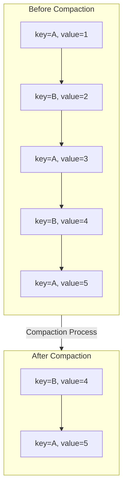
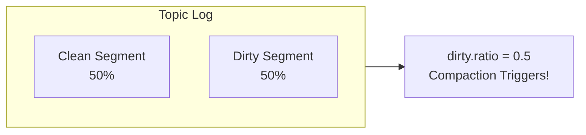
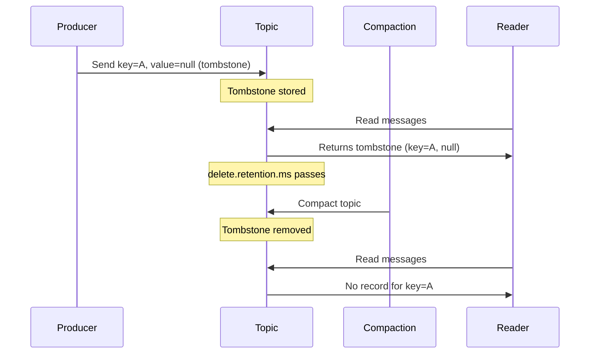
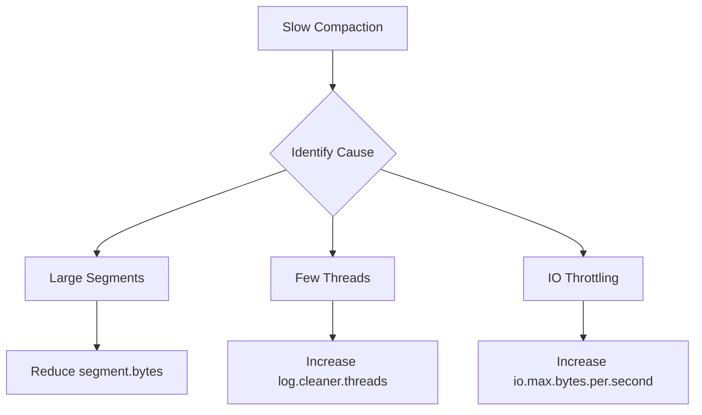
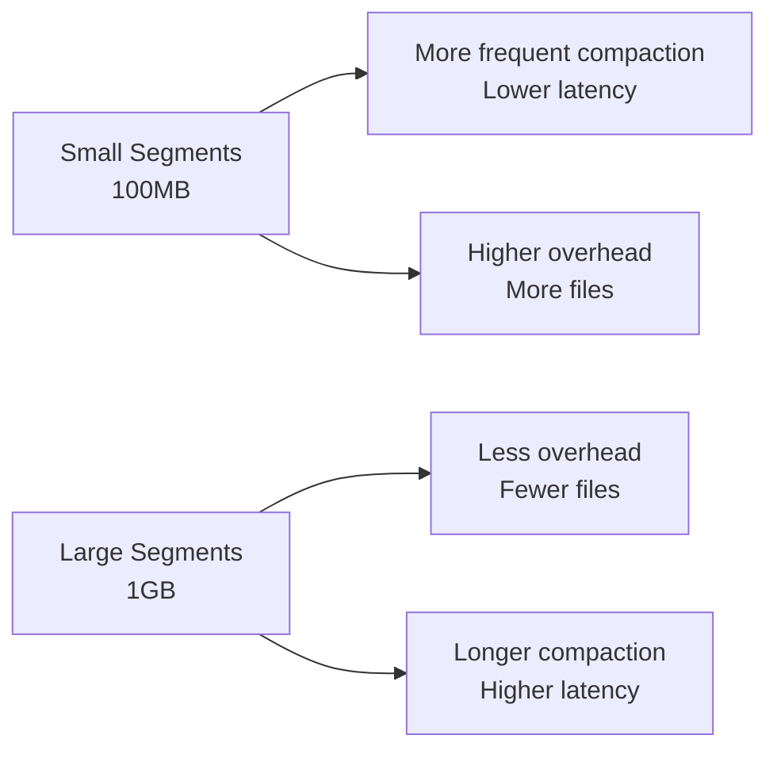

# How to Handle Kafka Topic Compaction

Author: [nawazdhandala](https://www.github.com/nawazdhandala)

Tags: Apache Kafka, Topic Compaction, Log Compaction, Data Retention, Streaming, DevOps

Description: A practical guide to configuring and managing Kafka topic compaction for efficient storage and maintaining the latest state of your data.

---

Kafka topic compaction is a powerful feature that retains only the latest value for each key in a topic. Unlike time-based or size-based retention, compaction ensures you always have the most recent state while dramatically reducing storage requirements.

## Understanding Log Compaction

Regular Kafka topics delete old segments based on time or size. Compacted topics keep the last value for every unique key, making them ideal for changelog-style data.



### When to Use Compaction

- **Database changelogs** - CDC events where you need current state
- **User profiles** - Latest user information keyed by user ID
- **Configuration data** - Current config values keyed by config name
- **Session state** - Active session data keyed by session ID
- **Inventory levels** - Current stock counts keyed by product ID

## Creating a Compacted Topic

### Using kafka-topics.sh

```bash
# Create a compacted topic with recommended settings
kafka-topics.sh --create \
  --bootstrap-server localhost:9092 \
  --topic user-profiles \
  --partitions 12 \
  --replication-factor 3 \
  --config cleanup.policy=compact \
  --config min.cleanable.dirty.ratio=0.5 \
  --config segment.ms=86400000 \
  --config delete.retention.ms=86400000
```

### Using AdminClient (Java)

```java
import org.apache.kafka.clients.admin.*;
import java.util.*;

public class CompactedTopicCreator {
    public static void main(String[] args) throws Exception {
        // Configure AdminClient properties
        Properties props = new Properties();
        props.put("bootstrap.servers", "localhost:9092");

        try (AdminClient admin = AdminClient.create(props)) {
            // Define topic configuration for compaction
            Map<String, String> configs = new HashMap<>();

            // Enable log compaction
            configs.put("cleanup.policy", "compact");

            // Minimum ratio of dirty log to total log for compaction trigger
            configs.put("min.cleanable.dirty.ratio", "0.5");

            // How long to retain delete markers (tombstones)
            configs.put("delete.retention.ms", "86400000");

            // Maximum time before rolling a new segment
            configs.put("segment.ms", "86400000");

            // Create topic specification
            NewTopic topic = new NewTopic("user-profiles", 12, (short) 3)
                .configs(configs);

            // Execute topic creation
            admin.createTopics(Collections.singleton(topic)).all().get();
            System.out.println("Compacted topic created successfully");
        }
    }
}
```

## Key Configuration Parameters

### cleanup.policy

Controls how Kafka handles old log segments.

```bash
# Compaction only - keeps latest value per key
cleanup.policy=compact

# Deletion only - removes segments based on time/size (default)
cleanup.policy=delete

# Both compaction and deletion - compacts then deletes old data
cleanup.policy=compact,delete
```

### min.cleanable.dirty.ratio

Determines when compaction triggers based on the ratio of dirty (uncompacted) to clean log.



```bash
# Lower ratio = more frequent compaction, higher CPU usage
min.cleanable.dirty.ratio=0.1

# Higher ratio = less frequent compaction, more storage usage
min.cleanable.dirty.ratio=0.9

# Balanced default
min.cleanable.dirty.ratio=0.5
```

### segment.ms and segment.bytes

Control when new segments are created. Compaction only operates on closed segments.

```bash
# Roll new segment every 24 hours
segment.ms=86400000

# Roll new segment at 1GB
segment.bytes=1073741824
```

### min.compaction.lag.ms

Minimum time a message must remain in the log before it can be compacted. Useful for ensuring consumers have time to read all messages.

```bash
# Guarantee messages are available for at least 1 hour before compaction
min.compaction.lag.ms=3600000
```

### delete.retention.ms

How long to retain tombstone (delete) markers after compaction.

```bash
# Keep tombstones for 24 hours so consumers see deletions
delete.retention.ms=86400000
```

## Working with Tombstones (Deletions)

To delete a key from a compacted topic, produce a message with that key and a null value (tombstone).

### Producing Tombstones (Java)

```java
import org.apache.kafka.clients.producer.*;
import java.util.Properties;

public class TombstoneProducer {
    public static void main(String[] args) throws Exception {
        Properties props = new Properties();
        props.put("bootstrap.servers", "localhost:9092");
        props.put("key.serializer",
            "org.apache.kafka.common.serialization.StringSerializer");
        props.put("value.serializer",
            "org.apache.kafka.common.serialization.StringSerializer");

        try (KafkaProducer<String, String> producer = new KafkaProducer<>(props)) {
            // Send tombstone - null value marks key for deletion
            ProducerRecord<String, String> tombstone =
                new ProducerRecord<>("user-profiles", "user-123", null);

            producer.send(tombstone, (metadata, exception) -> {
                if (exception == null) {
                    System.out.println("Tombstone sent for user-123");
                } else {
                    exception.printStackTrace();
                }
            });

            producer.flush();
        }
    }
}
```

### Tombstone Lifecycle



## Monitoring Compaction

### Key Metrics to Track

```bash
# Check compaction lag using kafka-consumer-groups
kafka-consumer-groups.sh --bootstrap-server localhost:9092 \
  --describe --group compaction-monitor

# View log cleaner metrics via JMX
kafka.log:type=LogCleanerManager,name=max-dirty-percent
kafka.log:type=LogCleaner,name=cleaner-recopy-percent
kafka.log:type=LogCleaner,name=max-clean-time-secs
```

### Prometheus Metrics

```yaml
# prometheus.yml - scrape Kafka JMX exporter
scrape_configs:
  - job_name: 'kafka'
    static_configs:
      - targets: ['kafka:9308']
    metrics_path: /metrics
```

Key metrics to alert on:

```promql
# High dirty ratio - compaction falling behind
kafka_log_LogCleanerManager_Value{name="max-dirty-percent"} > 80

# Compaction taking too long
kafka_log_LogCleaner_Value{name="max-clean-time-secs"} > 300
```

## Tuning Compaction Performance

### Log Cleaner Thread Configuration

```properties
# Number of background threads for compaction (broker config)
log.cleaner.threads=2

# Memory allocated to cleaner deduplication buffer
log.cleaner.dedupe.buffer.size=134217728

# Memory per cleaner thread
log.cleaner.io.buffer.size=524288

# Maximum I/O rate for cleaner
log.cleaner.io.max.bytes.per.second=1.7976931348623157E308
```

### Optimizing for Different Workloads

**High-throughput changelog:**
```properties
# Larger segments, less frequent compaction
segment.bytes=1073741824
min.cleanable.dirty.ratio=0.5
segment.ms=604800000
```

**Low-latency state store:**
```properties
# Smaller segments, more frequent compaction
segment.bytes=104857600
min.cleanable.dirty.ratio=0.1
segment.ms=3600000
```

## Common Issues and Solutions

### Issue: Compaction Not Running

**Symptoms:** Dirty ratio keeps increasing, old data not being removed.

**Diagnosis:**
```bash
# Check log cleaner status
kafka-log-dirs.sh --bootstrap-server localhost:9092 \
  --describe --topic-list user-profiles

# Check for compaction errors in logs
grep -i "cleaner" /var/log/kafka/server.log
```

**Solutions:**
```properties
# Ensure log cleaner is enabled (broker config)
log.cleaner.enable=true

# Check minimum segment age
min.compaction.lag.ms=0

# Verify cleanup.policy is set correctly on topic
kafka-configs.sh --bootstrap-server localhost:9092 \
  --entity-type topics --entity-name user-profiles --describe
```

### Issue: High Memory Usage During Compaction

**Symptoms:** Broker OOM errors, GC pauses during compaction.

**Solutions:**
```properties
# Reduce dedupe buffer size
log.cleaner.dedupe.buffer.size=67108864

# Reduce IO buffer
log.cleaner.io.buffer.size=262144

# Limit cleaner threads
log.cleaner.threads=1
```

### Issue: Slow Compaction

**Symptoms:** Large compaction lag, dirty ratio above threshold.



**Solutions:**
```properties
# Add more cleaner threads
log.cleaner.threads=4

# Increase IO throughput
log.cleaner.io.max.bytes.per.second=10485760

# More aggressive compaction trigger
min.cleanable.dirty.ratio=0.3
```

## Best Practices

### 1. Choose Keys Wisely

Keys determine compaction behavior. Use stable, unique identifiers.

```java
// Good - stable unique identifier
record.key = userId;

// Bad - timestamp changes, no compaction benefit
record.key = timestamp + userId;
```

### 2. Monitor Tombstone Ratio

Too many tombstones indicate possible issues with your data model.

```bash
# Count tombstones vs records
kafka-console-consumer.sh --bootstrap-server localhost:9092 \
  --topic user-profiles --from-beginning --max-messages 10000 \
  --property print.key=true --property print.value=true | \
  awk -F'\t' '{if($2=="null")tomb++;else rec++}END{print "Tombstones:",tomb,"Records:",rec}'
```

### 3. Size Your Segments Appropriately



### 4. Use Both Compact and Delete When Appropriate

For data with both update patterns and retention requirements:

```bash
# Compact for deduplication, delete after 30 days
kafka-topics.sh --alter \
  --bootstrap-server localhost:9092 \
  --topic user-sessions \
  --config cleanup.policy=compact,delete \
  --config retention.ms=2592000000 \
  --config min.cleanable.dirty.ratio=0.5
```

---

Topic compaction transforms Kafka from a pure event log into a queryable state store. Configure it properly based on your access patterns, monitor the compaction metrics, and your storage costs will thank you while maintaining fast access to current state.
