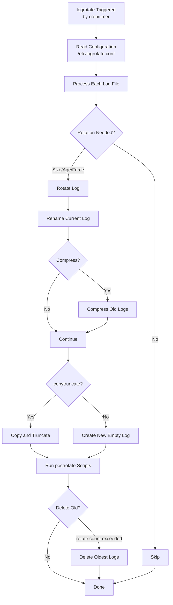
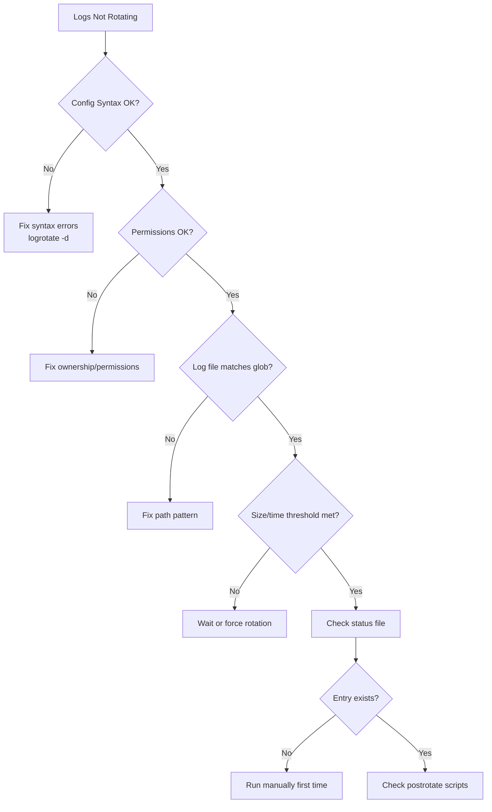
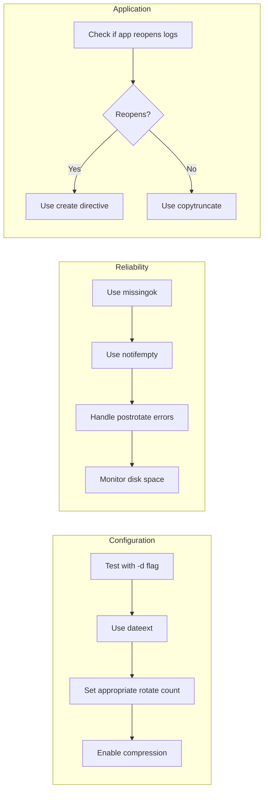

# How to Handle Log Rotation with logrotate

Author: [nawazdhandala](https://www.github.com/nawazdhandala)

Tags: Linux, Logging, System Administration, DevOps, Disk Management

Description: Learn how to configure logrotate to manage log files, prevent disk space issues, and maintain system health.

---

Without proper log rotation, log files can consume all available disk space and bring your system to its knees. Logrotate is the standard tool on Linux for automatically rotating, compressing, and removing old log files. This guide covers everything from basic configuration to advanced patterns.

## How Logrotate Works

Understanding the logrotate workflow helps you configure it effectively.



## 1. Logrotate Configuration Structure

Logrotate reads its main configuration and includes directory configurations.

```bash
# Main configuration file
cat /etc/logrotate.conf

# Application-specific configurations
ls /etc/logrotate.d/

# Check installed package log rotation configs
cat /etc/logrotate.d/apt
cat /etc/logrotate.d/nginx
cat /etc/logrotate.d/syslog
```

### Default Configuration Explained

```bash
# /etc/logrotate.conf - Main configuration file

# Rotate logs weekly by default
weekly

# Keep 4 weeks of backlogs
rotate 4

# Create new empty log files after rotation
create

# Use date as suffix for rotated files
dateext

# Compress rotated log files
compress

# Delay compression to next rotation cycle
delaycompress

# Include configurations from /etc/logrotate.d/
include /etc/logrotate.d

# Special handling for wtmp and btmp
/var/log/wtmp {
    monthly
    create 0664 root utmp
    minsize 1M
    rotate 1
}
```

## 2. Creating Custom Log Rotation Rules

Create a configuration file for your application's logs.

```bash
# /etc/logrotate.d/myapp
# Log rotation configuration for custom application

/var/log/myapp/*.log {
    # Rotate daily
    daily

    # Keep 14 days of logs
    rotate 14

    # Compress rotated logs using gzip
    compress

    # Don't compress the most recent rotated file
    # Allows apps to finish writing before compression
    delaycompress

    # Don't error if log file is missing
    missingok

    # Don't rotate if log file is empty
    notifempty

    # Create new log file with these permissions
    # mode owner group
    create 0640 myapp myapp

    # Add date to rotated filename instead of number
    dateext

    # Custom date format for rotated files
    dateformat -%Y%m%d-%s

    # Run this command after rotation
    postrotate
        # Send SIGUSR1 to reload log files
        /usr/bin/systemctl reload myapp > /dev/null 2>&1 || true
    endscript
}
```

## 3. Common Logrotate Directives

Here are the most frequently used configuration options.

```bash
# /etc/logrotate.d/example-all-options

/var/log/example.log {
    # ROTATION FREQUENCY (choose one)
    daily           # Rotate every day
    weekly          # Rotate every week
    monthly         # Rotate every month
    yearly          # Rotate every year

    # SIZE-BASED ROTATION
    size 100M       # Rotate when file reaches 100MB
    minsize 50M     # Only rotate if at least 50MB (with daily/weekly)
    maxsize 500M    # Rotate when 500MB even if not time yet

    # RETENTION
    rotate 7        # Keep 7 rotated files
    maxage 30       # Delete rotated files older than 30 days

    # COMPRESSION
    compress        # Compress rotated files
    nocompress      # Don't compress
    delaycompress   # Compress on second rotation
    compresscmd /usr/bin/xz      # Use xz instead of gzip
    compressext .xz              # Extension for compressed files
    compressoptions -9           # Compression level options

    # FILE CREATION
    create 0640 root adm         # Create new file with mode/owner/group
    nocreate                     # Don't create new file

    # HANDLING MISSING/EMPTY FILES
    missingok       # Don't error if file doesn't exist
    nomissingok     # Error if file doesn't exist (default)
    notifempty      # Don't rotate empty files
    ifempty         # Rotate even if empty (default)

    # COPY BEHAVIOR
    copytruncate    # Copy log then truncate original (for apps that can't reopen)
    copy            # Copy log, don't truncate

    # NAMING
    dateext         # Use date instead of number in filename
    dateformat -%Y%m%d           # Date format for dateext
    extension .log               # Keep this extension after date

    # SCRIPTS
    sharedscripts   # Run scripts once for all matching files
    prerotate       # Script to run before rotation
        /usr/bin/logger "Starting log rotation"
    endscript
    postrotate      # Script to run after rotation
        /usr/bin/systemctl reload myapp
    endscript
    firstaction     # Run once before processing any files
        /usr/bin/logger "Log rotation starting"
    endscript
    lastaction      # Run once after processing all files
        /usr/bin/logger "Log rotation complete"
    endscript
}
```

## 4. Application-Specific Examples

### Nginx Log Rotation

```bash
# /etc/logrotate.d/nginx
/var/log/nginx/*.log {
    daily
    rotate 14
    compress
    delaycompress
    missingok
    notifempty
    create 0640 www-data adm
    sharedscripts

    # Nginx needs to reopen log files after rotation
    postrotate
        # Test nginx config and reload if valid
        if nginx -t 2>/dev/null; then
            # Send USR1 signal to reopen log files
            [ -f /var/run/nginx.pid ] && kill -USR1 $(cat /var/run/nginx.pid)
        fi
    endscript
}
```

### Docker Container Logs

```bash
# /etc/logrotate.d/docker-containers
/var/lib/docker/containers/*/*.log {
    rotate 7
    daily
    compress
    delaycompress
    missingok
    notifempty
    copytruncate    # Docker keeps files open, must use copytruncate
    maxsize 100M    # Rotate if file exceeds 100MB regardless of time
}
```

### Application with PID File

```bash
# /etc/logrotate.d/myapp-with-pid
/var/log/myapp/application.log {
    daily
    rotate 30
    compress
    delaycompress
    missingok
    notifempty
    create 0644 appuser appgroup

    postrotate
        # Send HUP signal to process using PID file
        if [ -f /var/run/myapp.pid ]; then
            kill -HUP $(cat /var/run/myapp.pid) 2>/dev/null || true
        fi
    endscript
}
```

### High-Volume Logs with Size Limits

```bash
# /etc/logrotate.d/high-volume
/var/log/high-volume/*.log {
    # Rotate based on size, not time
    size 50M

    # Keep many rotations due to high volume
    rotate 100

    # Compress immediately for space savings
    compress

    # Use efficient compression
    compresscmd /usr/bin/zstd
    compressext .zst
    compressoptions -T0 --rm

    missingok
    notifempty
    copytruncate

    # Delete files older than 7 days
    maxage 7
}
```

## 5. Testing Logrotate Configuration

Always test before deploying configuration changes.

```bash
# Test configuration syntax (debug mode, no actual rotation)
sudo logrotate -d /etc/logrotate.d/myapp

# Force rotation to test (actually rotates files)
sudo logrotate -f /etc/logrotate.d/myapp

# Verbose output during test
sudo logrotate -v /etc/logrotate.d/myapp

# Test entire logrotate configuration
sudo logrotate -d /etc/logrotate.conf

# Check logrotate status (which files were rotated and when)
cat /var/lib/logrotate/status
# or on some systems
cat /var/lib/logrotate.status
```

## 6. Logrotate Execution Flow

Logrotate is typically run by cron or systemd timer.

```bash
# Check how logrotate is scheduled

# On systemd systems
systemctl list-timers | grep logrotate
cat /lib/systemd/system/logrotate.timer
cat /lib/systemd/system/logrotate.service

# On systems using cron
cat /etc/cron.daily/logrotate
```

### Systemd Timer Configuration

```bash
# /lib/systemd/system/logrotate.timer
[Unit]
Description=Daily rotation of log files

[Timer]
OnCalendar=daily
AccuracySec=1h
Persistent=true

[Install]
WantedBy=timers.target
```

## 7. Troubleshooting Logrotate

Common issues and how to resolve them.



### Debug Commands

```bash
# Check for configuration errors
sudo logrotate -d /etc/logrotate.conf 2>&1 | grep error

# View logrotate status file
sudo cat /var/lib/logrotate/status

# Reset status for a specific file (force rotation next run)
# Remove the line from status file
sudo sed -i '/myapp.log/d' /var/lib/logrotate/status

# Check SELinux context if rotations fail silently
ls -Z /var/log/myapp/

# Check if logrotate ran recently
journalctl -u logrotate --since "24 hours ago"

# Common error: "error: skipping because parent directory has insecure permissions"
# Fix: Ensure /var/log has correct permissions
sudo chmod 755 /var/log
sudo chown root:root /var/log
```

## 8. Handling Special Cases

### Services That Cannot Reopen Log Files

```bash
# Use copytruncate for applications that keep file handles open
/var/log/legacy-app/*.log {
    daily
    rotate 7
    compress
    delaycompress
    missingok
    notifempty

    # Copy content to rotated file, then truncate original
    # The application continues writing to the same file
    copytruncate
}
```

### Multiple Log Files with Shared Script

```bash
# Run postrotate only once for multiple files
/var/log/myapp/access.log /var/log/myapp/error.log {
    daily
    rotate 14
    compress
    delaycompress
    missingok
    notifempty

    # Only run postrotate once, not per file
    sharedscripts

    postrotate
        systemctl reload myapp
    endscript
}
```

### Conditional Rotation Based on Disk Space

```bash
# /etc/logrotate.d/conditional
/var/log/conditional/*.log {
    daily
    rotate 7
    compress
    missingok
    notifempty

    # Only rotate if disk usage is above threshold
    prerotate
        USAGE=$(df /var/log | tail -1 | awk '{print $5}' | tr -d '%')
        if [ "$USAGE" -lt 80 ]; then
            # Exit 1 prevents rotation
            exit 1
        fi
    endscript
}
```

## 9. Monitoring Log Rotation

Set up alerting for log rotation issues.

```bash
#!/bin/bash
# /usr/local/bin/check-log-rotation.sh
# Monitor log file sizes and rotation status

LOG_DIR="/var/log"
MAX_SIZE_MB=500
ALERT_EMAIL="admin@example.com"

# Find large log files
large_files=$(find "$LOG_DIR" -name "*.log" -size +${MAX_SIZE_MB}M 2>/dev/null)

if [ -n "$large_files" ]; then
    echo "Large log files detected:" | mail -s "Log Rotation Alert" "$ALERT_EMAIL" << EOF
The following log files exceed ${MAX_SIZE_MB}MB:

$large_files

Please check logrotate configuration.
EOF
fi

# Check if logrotate ran in the last 25 hours
last_run=$(stat -c %Y /var/lib/logrotate/status 2>/dev/null)
current=$(date +%s)
hours_ago=$(( (current - last_run) / 3600 ))

if [ "$hours_ago" -gt 25 ]; then
    echo "Logrotate has not run in $hours_ago hours" | \
        mail -s "Logrotate Not Running" "$ALERT_EMAIL"
fi
```

## 10. Best Practices Summary



### Configuration Checklist

```bash
# Essential checks for any logrotate configuration

# 1. Test syntax before deploying
sudo logrotate -d /etc/logrotate.d/myapp

# 2. Verify file permissions
ls -la /var/log/myapp/
ls -la /etc/logrotate.d/myapp

# 3. Check logrotate timer is active
systemctl is-active logrotate.timer

# 4. Verify postrotate commands work
# Run them manually first
systemctl reload myapp

# 5. Monitor disk space after deployment
df -h /var/log

# 6. Verify rotation happened
ls -la /var/log/myapp/
```

---

Proper log rotation is essential for system health. Configure logrotate thoughtfully, test thoroughly, and monitor regularly to ensure your logs stay manageable without losing important information.
