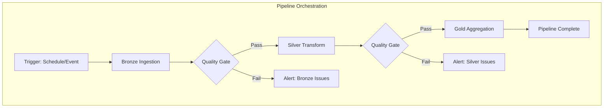

# How to Handle Medallion Architecture

Author: [nawazdhandala](https://www.github.com/nawazdhandala)

Tags: Data Engineering, Medallion Architecture, Data Lakehouse, Delta Lake, Bronze Silver Gold, ETL, Data Quality

Description: A practical guide to implementing medallion architecture with Bronze, Silver, and Gold layers for building scalable and maintainable data lakehouses.

---

Medallion architecture has become the standard pattern for organizing data in modern lakehouses. The concept is simple: data flows through Bronze (raw), Silver (cleaned), and Gold (business-ready) layers. But implementing it well requires careful thought about data quality, schema evolution, and processing patterns.

## Understanding the Three Layers

```mermaid
flowchart LR
    subgraph Sources["Data Sources"]
        S1[APIs]
        S2[Databases]
        S3[Files]
        S4[Streams]
    end

    subgraph Bronze["Bronze Layer"]
        B1[(Raw Data)]
        B2[Schema on Read]
        B3[Full History]
    end

    subgraph Silver["Silver Layer"]
        SV1[(Cleaned Data)]
        SV2[Validated Schema]
        SV3[Deduplicated]
    end

    subgraph Gold["Gold Layer"]
        G1[(Business Tables)]
        G2[Aggregated]
        G3[Optimized Queries]
    end

    Sources --> Bronze
    Bronze --> Silver
    Silver --> Gold
    Gold --> Analytics[Analytics & ML]
```



Each layer serves a specific purpose:

- **Bronze**: Landing zone for raw data exactly as received from sources
- **Silver**: Cleaned, validated, and deduplicated data with enforced schemas
- **Gold**: Business-level aggregates and feature tables ready for consumption

## Setting Up the Bronze Layer

The Bronze layer should capture everything with minimal transformation. Think of it as your data safety net.

```python
from pyspark.sql import SparkSession
from pyspark.sql.functions import current_timestamp, input_file_name, lit
from delta.tables import DeltaTable

spark = SparkSession.builder \
    .appName("MedallionBronze") \
    .config("spark.sql.extensions", "io.delta.sql.DeltaSparkSessionExtension") \
    .config("spark.sql.catalog.spark_catalog",
            "org.apache.spark.sql.delta.catalog.DeltaCatalog") \
    .getOrCreate()

def ingest_to_bronze(source_path, bronze_path, source_name):
    """
    Ingest raw data to Bronze layer with metadata
    """
    # Read raw data without enforcing schema
    raw_df = spark.read \
        .option("inferSchema", "true") \
        .option("header", "true") \
        .csv(source_path)

    # Add ingestion metadata
    bronze_df = raw_df \
        .withColumn("_ingestion_timestamp", current_timestamp()) \
        .withColumn("_source_file", input_file_name()) \
        .withColumn("_source_system", lit(source_name))

    # Append to Bronze table (never overwrite)
    bronze_df.write \
        .format("delta") \
        .mode("append") \
        .option("mergeSchema", "true") \
        .save(bronze_path)

    print(f"Ingested {bronze_df.count()} records to {bronze_path}")
    return bronze_df

# Usage
bronze_orders = ingest_to_bronze(
    source_path="/data/sources/orders/*.csv",
    bronze_path="/data/bronze/orders",
    source_name="ecommerce_api"
)
```

### Handling Schema Evolution in Bronze

```python
# Enable automatic schema evolution for Bronze tables
spark.conf.set("spark.databricks.delta.schema.autoMerge.enabled", "true")

def ingest_json_to_bronze(kafka_df, bronze_path):
    """
    Ingest streaming JSON data with flexible schema handling
    """
    # Store raw JSON as string to handle any schema changes
    bronze_df = kafka_df.selectExpr(
        "CAST(key AS STRING) as message_key",
        "CAST(value AS STRING) as raw_payload",
        "topic",
        "partition",
        "offset",
        "timestamp as kafka_timestamp",
        "current_timestamp() as _ingestion_timestamp"
    )

    query = bronze_df.writeStream \
        .format("delta") \
        .outputMode("append") \
        .option("checkpointLocation", f"{bronze_path}/_checkpoints") \
        .option("mergeSchema", "true") \
        .start(bronze_path)

    return query
```

## Building the Silver Layer

The Silver layer is where data quality happens. Apply validations, deduplication, and schema enforcement here.

```python
from pyspark.sql.functions import col, when, row_number, to_timestamp
from pyspark.sql.window import Window
from pyspark.sql.types import StructType, StructField, StringType, DoubleType, TimestampType

# Define expected schema for Silver layer
silver_orders_schema = StructType([
    StructField("order_id", StringType(), False),
    StructField("customer_id", StringType(), False),
    StructField("product_id", StringType(), False),
    StructField("quantity", DoubleType(), False),
    StructField("unit_price", DoubleType(), False),
    StructField("order_date", TimestampType(), False),
    StructField("status", StringType(), False)
])

def bronze_to_silver(bronze_path, silver_path):
    """
    Transform Bronze data to Silver with quality checks
    """
    # Read from Bronze
    bronze_df = spark.read.format("delta").load(bronze_path)

    # Parse and validate data
    parsed_df = bronze_df \
        .withColumn("order_date", to_timestamp(col("order_date"))) \
        .withColumn("quantity", col("quantity").cast("double")) \
        .withColumn("unit_price", col("unit_price").cast("double"))

    # Data quality checks
    quality_df = parsed_df \
        .withColumn("_is_valid",
            col("order_id").isNotNull() &
            col("customer_id").isNotNull() &
            (col("quantity") > 0) &
            (col("unit_price") > 0)
        )

    # Separate valid and invalid records
    valid_df = quality_df.filter(col("_is_valid") == True)
    invalid_df = quality_df.filter(col("_is_valid") == False)

    # Log invalid records for investigation
    if invalid_df.count() > 0:
        invalid_df.write \
            .format("delta") \
            .mode("append") \
            .save(f"{silver_path}/_quarantine")
        print(f"Quarantined {invalid_df.count()} invalid records")

    # Deduplicate based on order_id, keeping latest
    window_spec = Window.partitionBy("order_id").orderBy(col("_ingestion_timestamp").desc())

    deduped_df = valid_df \
        .withColumn("_row_num", row_number().over(window_spec)) \
        .filter(col("_row_num") == 1) \
        .drop("_row_num", "_is_valid")

    # Select only Silver schema columns plus metadata
    silver_df = deduped_df.select(
        "order_id",
        "customer_id",
        "product_id",
        "quantity",
        "unit_price",
        "order_date",
        "status",
        "_ingestion_timestamp",
        "_source_system"
    )

    # Merge into Silver table (upsert)
    if DeltaTable.isDeltaTable(spark, silver_path):
        delta_table = DeltaTable.forPath(spark, silver_path)

        delta_table.alias("target").merge(
            silver_df.alias("source"),
            "target.order_id = source.order_id"
        ).whenMatchedUpdateAll() \
         .whenNotMatchedInsertAll() \
         .execute()
    else:
        silver_df.write.format("delta").save(silver_path)

    print(f"Processed {silver_df.count()} records to Silver")
    return silver_df
```

### Data Quality Framework

```python
from dataclasses import dataclass
from typing import List, Callable

@dataclass
class QualityRule:
    name: str
    condition: str
    severity: str  # "error" or "warning"

def apply_quality_rules(df, rules: List[QualityRule]):
    """
    Apply data quality rules and return results
    """
    results = []

    for rule in rules:
        # Count violations
        violation_count = df.filter(f"NOT ({rule.condition})").count()
        total_count = df.count()
        pass_rate = (total_count - violation_count) / total_count * 100

        results.append({
            "rule_name": rule.name,
            "severity": rule.severity,
            "total_records": total_count,
            "violations": violation_count,
            "pass_rate": pass_rate
        })

        if rule.severity == "error" and violation_count > 0:
            print(f"QUALITY ERROR: {rule.name} - {violation_count} violations")

    return results

# Define quality rules
order_rules = [
    QualityRule("order_id_not_null", "order_id IS NOT NULL", "error"),
    QualityRule("quantity_positive", "quantity > 0", "error"),
    QualityRule("price_reasonable", "unit_price BETWEEN 0.01 AND 100000", "warning"),
    QualityRule("date_not_future", "order_date <= current_timestamp()", "warning")
]

# Apply rules
quality_results = apply_quality_rules(silver_df, order_rules)
```

## Creating the Gold Layer

The Gold layer contains business-ready tables optimized for specific use cases.

```python
def create_gold_daily_sales(silver_path, gold_path):
    """
    Create Gold layer daily sales aggregate
    """
    silver_orders = spark.read.format("delta").load(silver_path)

    # Calculate daily sales metrics
    daily_sales = silver_orders \
        .filter(col("status") == "completed") \
        .withColumn("order_total", col("quantity") * col("unit_price")) \
        .groupBy(
            col("order_date").cast("date").alias("sale_date")
        ) \
        .agg(
            {"order_id": "count",
             "order_total": "sum",
             "quantity": "sum",
             "customer_id": "approx_count_distinct"}
        ) \
        .withColumnRenamed("count(order_id)", "total_orders") \
        .withColumnRenamed("sum(order_total)", "total_revenue") \
        .withColumnRenamed("sum(quantity)", "total_units") \
        .withColumnRenamed("approx_count_distinct(customer_id)", "unique_customers")

    # Add computed metrics
    gold_df = daily_sales \
        .withColumn("avg_order_value", col("total_revenue") / col("total_orders")) \
        .withColumn("_processed_timestamp", current_timestamp())

    # Overwrite partition for idempotent updates
    gold_df.write \
        .format("delta") \
        .mode("overwrite") \
        .option("replaceWhere",
                f"sale_date >= '{gold_df.agg({'sale_date': 'min'}).collect()[0][0]}'") \
        .save(gold_path)

    return gold_df

def create_gold_customer_features(silver_orders_path, silver_customers_path, gold_path):
    """
    Create customer feature table for ML
    """
    orders = spark.read.format("delta").load(silver_orders_path)
    customers = spark.read.format("delta").load(silver_customers_path)

    # Calculate customer features
    customer_features = orders \
        .filter(col("status") == "completed") \
        .withColumn("order_total", col("quantity") * col("unit_price")) \
        .groupBy("customer_id") \
        .agg(
            {"order_id": "count",
             "order_total": "sum",
             "order_total": "avg",
             "order_date": "max",
             "order_date": "min"}
        )

    # Join with customer details
    gold_df = customer_features \
        .join(customers, "customer_id", "left") \
        .withColumn("customer_tenure_days",
                    datediff(current_date(), col("first_order_date"))) \
        .withColumn("_feature_timestamp", current_timestamp())

    # Write as Gold table
    gold_df.write \
        .format("delta") \
        .mode("overwrite") \
        .save(gold_path)

    return gold_df
```

## Orchestrating the Pipeline



```python
from datetime import datetime

class MedallionPipeline:
    def __init__(self, base_path):
        self.bronze_path = f"{base_path}/bronze"
        self.silver_path = f"{base_path}/silver"
        self.gold_path = f"{base_path}/gold"
        self.metrics = {}

    def run_full_pipeline(self, source_path, source_name):
        """
        Execute complete Bronze -> Silver -> Gold pipeline
        """
        start_time = datetime.now()

        try:
            # Bronze ingestion
            print("Starting Bronze ingestion...")
            bronze_count = self._run_bronze(source_path, source_name)
            self.metrics["bronze_records"] = bronze_count

            # Silver transformation
            print("Starting Silver transformation...")
            silver_count, quarantine_count = self._run_silver()
            self.metrics["silver_records"] = silver_count
            self.metrics["quarantined_records"] = quarantine_count

            # Quality gate check
            quarantine_rate = quarantine_count / (silver_count + quarantine_count)
            if quarantine_rate > 0.05:  # More than 5% bad data
                raise Exception(f"Quality gate failed: {quarantine_rate:.2%} quarantine rate")

            # Gold aggregation
            print("Starting Gold aggregation...")
            self._run_gold()

            self.metrics["status"] = "success"
            self.metrics["duration_seconds"] = (datetime.now() - start_time).seconds

        except Exception as e:
            self.metrics["status"] = "failed"
            self.metrics["error"] = str(e)
            raise

        return self.metrics

    def _run_bronze(self, source_path, source_name):
        # Bronze ingestion logic
        pass

    def _run_silver(self):
        # Silver transformation logic
        pass

    def _run_gold(self):
        # Gold aggregation logic
        pass

# Usage
pipeline = MedallionPipeline("/data/lakehouse")
results = pipeline.run_full_pipeline("/data/sources/orders", "ecommerce")
```

## Best Practices

1. **Never modify Bronze data** - It's your source of truth for reprocessing
2. **Use merge operations in Silver** - Enables idempotent reruns
3. **Partition Gold tables** by common query patterns (date, region)
4. **Implement quality gates** between each layer
5. **Track lineage** with metadata columns
6. **Version your schemas** and handle evolution gracefully
7. **Monitor layer health** with record counts and freshness checks

## Common Pitfalls

**Pitfall: Skipping Silver and going Bronze to Gold**
This creates unmaintainable pipelines. Always have a Silver layer even if transformations seem minimal.

**Pitfall: Too many Gold tables**
Create Gold tables based on actual consumption patterns, not anticipated needs.

**Pitfall: Tight coupling between layers**
Each layer should be independently recoverable. Don't create dependencies that prevent reprocessing.

---

Medallion architecture provides a clear mental model for data engineering. The key is maintaining strict boundaries between layers while ensuring each layer can be rebuilt from its predecessor. Start simple, add complexity only when needed, and always prioritize data quality over processing speed.
