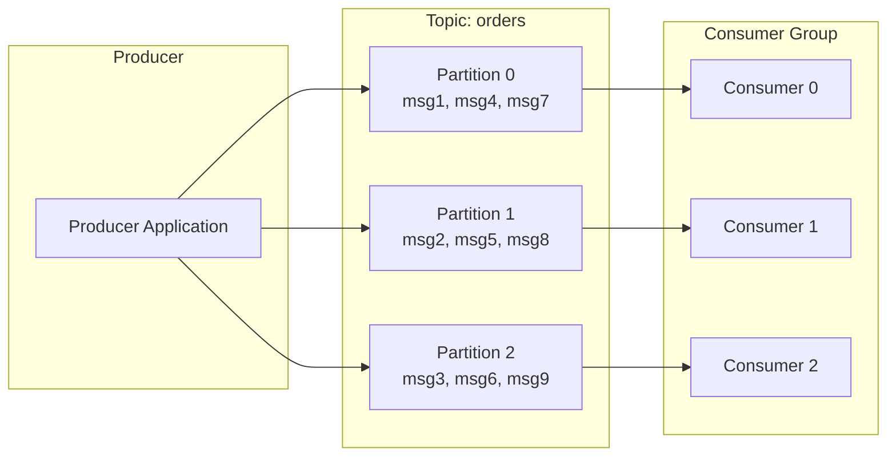
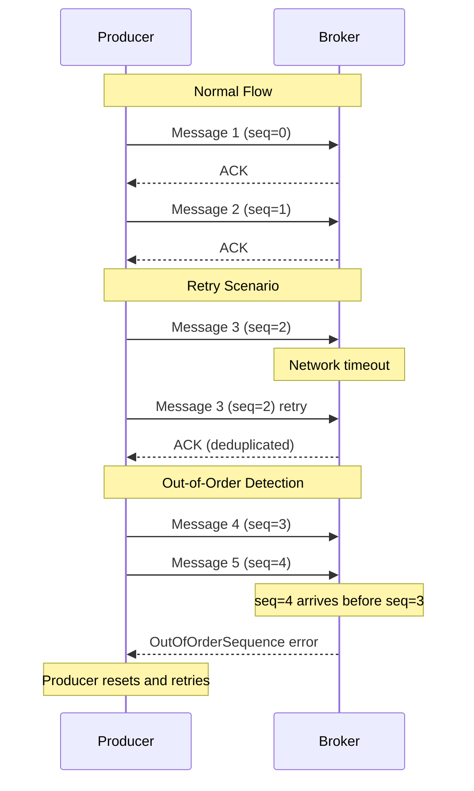
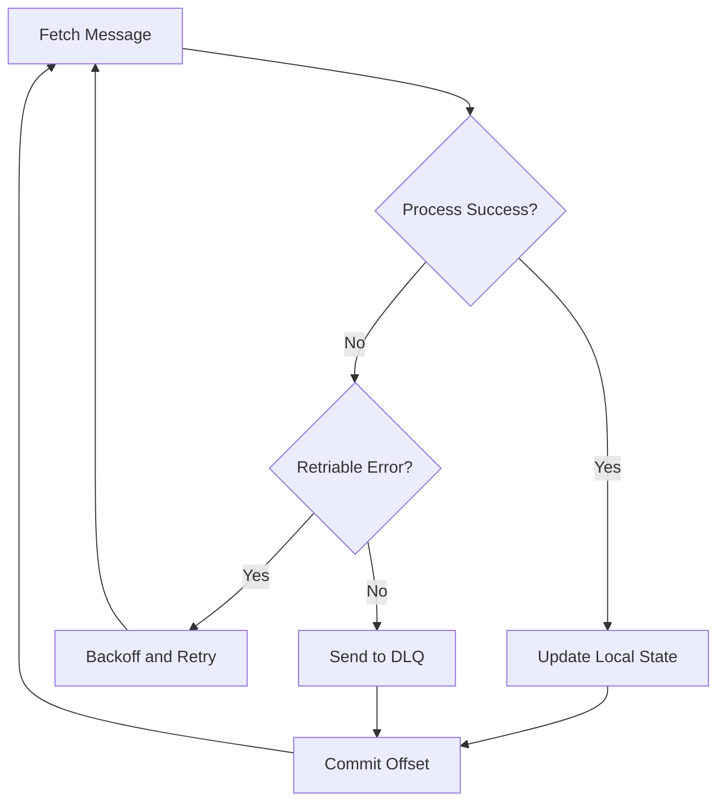

# How to Handle Message Ordering in Kafka Partitions

Author: [nawazdhandala](https://www.github.com/nawazdhandala)

Tags: Kafka, Message Ordering, Partitions, Distributed Systems, Event-Driven Architecture

Description: A practical guide to understanding and implementing message ordering guarantees in Apache Kafka partitions for reliable event processing.

---

Message ordering is one of the most critical aspects of building reliable event-driven systems with Apache Kafka. While Kafka provides strong ordering guarantees within a single partition, understanding how to leverage these guarantees across your application requires careful design. This guide covers the fundamentals of Kafka's ordering model and provides practical strategies for maintaining message order in production systems.

## Understanding Kafka's Ordering Model

Kafka guarantees message ordering only within a single partition. Messages sent to the same partition are appended in the order they arrive and consumers read them in that exact order. However, there are no ordering guarantees across different partitions.



This diagram shows how messages are distributed across partitions and consumed by different consumers in a consumer group.

## Key-Based Partitioning for Ordering

The most common approach to ensure related messages are ordered is to use consistent key-based partitioning. Messages with the same key always go to the same partition, guaranteeing their relative order.

### Implementing Key-Based Ordering in Java

```java
import org.apache.kafka.clients.producer.*;
import org.apache.kafka.common.serialization.StringSerializer;
import java.util.Properties;

public class OrderedProducer {

    private final KafkaProducer<String, String> producer;

    public OrderedProducer(String bootstrapServers) {
        Properties props = new Properties();
        props.put(ProducerConfig.BOOTSTRAP_SERVERS_CONFIG, bootstrapServers);
        props.put(ProducerConfig.KEY_SERIALIZER_CLASS_CONFIG, StringSerializer.class.getName());
        props.put(ProducerConfig.VALUE_SERIALIZER_CLASS_CONFIG, StringSerializer.class.getName());

        // Enable idempotence to prevent duplicate messages on retries
        // This is crucial for maintaining ordering during network issues
        props.put(ProducerConfig.ENABLE_IDEMPOTENCE_CONFIG, true);

        // Limit in-flight requests to ensure ordering with retries
        // With idempotence enabled, this can be up to 5
        props.put(ProducerConfig.MAX_IN_FLIGHT_REQUESTS_PER_CONNECTION, 5);

        // Configure acknowledgments for durability
        props.put(ProducerConfig.ACKS_CONFIG, "all");

        this.producer = new KafkaProducer<>(props);
    }

    /**
     * Sends an order event with the order ID as the partition key.
     * All events for the same order will be processed in order.
     */
    public void sendOrderEvent(String orderId, String eventType, String payload) {
        // The order ID serves as the partition key
        // All events for order-123 will go to the same partition
        ProducerRecord<String, String> record = new ProducerRecord<>(
            "order-events",  // topic
            orderId,         // key - determines partition
            payload          // value
        );

        // Add headers for event metadata
        record.headers().add("event-type", eventType.getBytes());
        record.headers().add("timestamp", String.valueOf(System.currentTimeMillis()).getBytes());

        producer.send(record, (metadata, exception) -> {
            if (exception != null) {
                System.err.println("Failed to send message: " + exception.getMessage());
            } else {
                System.out.printf("Sent %s for order %s to partition %d at offset %d%n",
                    eventType, orderId, metadata.partition(), metadata.offset());
            }
        });
    }

    public void close() {
        producer.close();
    }

    public static void main(String[] args) {
        OrderedProducer producer = new OrderedProducer("localhost:9092");

        // All these events for order-123 will be in the same partition
        // and processed in this exact order
        producer.sendOrderEvent("order-123", "ORDER_CREATED",
            "{\"items\": [{\"sku\": \"ABC\", \"qty\": 2}]}");
        producer.sendOrderEvent("order-123", "PAYMENT_RECEIVED",
            "{\"amount\": 99.99, \"method\": \"credit_card\"}");
        producer.sendOrderEvent("order-123", "ORDER_SHIPPED",
            "{\"tracking\": \"1Z999AA10123456784\"}");

        // Events for order-456 may go to a different partition
        // but will still be ordered relative to each other
        producer.sendOrderEvent("order-456", "ORDER_CREATED",
            "{\"items\": [{\"sku\": \"XYZ\", \"qty\": 1}]}");

        producer.close();
    }
}
```

### Implementing Ordered Consumption in Java

```java
import org.apache.kafka.clients.consumer.*;
import org.apache.kafka.common.serialization.StringDeserializer;
import java.time.Duration;
import java.util.*;

public class OrderedConsumer {

    private final KafkaConsumer<String, String> consumer;
    private volatile boolean running = true;

    public OrderedConsumer(String bootstrapServers, String groupId) {
        Properties props = new Properties();
        props.put(ConsumerConfig.BOOTSTRAP_SERVERS_CONFIG, bootstrapServers);
        props.put(ConsumerConfig.GROUP_ID_CONFIG, groupId);
        props.put(ConsumerConfig.KEY_DESERIALIZER_CLASS_CONFIG, StringDeserializer.class.getName());
        props.put(ConsumerConfig.VALUE_DESERIALIZER_CLASS_CONFIG, StringDeserializer.class.getName());

        // Disable auto-commit for explicit control over offset management
        // This prevents message loss during processing failures
        props.put(ConsumerConfig.ENABLE_AUTO_COMMIT_CONFIG, false);

        // Start from the earliest offset for new consumer groups
        props.put(ConsumerConfig.AUTO_OFFSET_RESET_CONFIG, "earliest");

        // Limit records per poll to control processing batch size
        props.put(ConsumerConfig.MAX_POLL_RECORDS_CONFIG, 100);

        this.consumer = new KafkaConsumer<>(props);
    }

    /**
     * Processes messages while maintaining partition-level ordering.
     * Messages from the same partition are processed sequentially.
     */
    public void consumeOrdered(String topic) {
        consumer.subscribe(Collections.singletonList(topic));

        while (running) {
            // Poll for new messages with a timeout
            ConsumerRecords<String, String> records = consumer.poll(Duration.ofMillis(100));

            // Group records by partition to process each partition sequentially
            Map<Integer, List<ConsumerRecord<String, String>>> partitionRecords = new HashMap<>();

            for (ConsumerRecord<String, String> record : records) {
                partitionRecords
                    .computeIfAbsent(record.partition(), k -> new ArrayList<>())
                    .add(record);
            }

            // Process each partition's records in order
            for (Map.Entry<Integer, List<ConsumerRecord<String, String>>> entry :
                    partitionRecords.entrySet()) {

                int partition = entry.getKey();
                List<ConsumerRecord<String, String>> partitionBatch = entry.getValue();

                System.out.printf("Processing %d records from partition %d%n",
                    partitionBatch.size(), partition);

                // Process records sequentially within the partition
                for (ConsumerRecord<String, String> record : partitionBatch) {
                    processRecord(record);
                }
            }

            // Commit offsets after successful processing
            // This ensures at-least-once delivery semantics
            consumer.commitSync();
        }

        consumer.close();
    }

    private void processRecord(ConsumerRecord<String, String> record) {
        String eventType = new String(
            record.headers().lastHeader("event-type").value()
        );

        System.out.printf(
            "Partition: %d, Offset: %d, Key: %s, Event: %s, Value: %s%n",
            record.partition(),
            record.offset(),
            record.key(),
            eventType,
            record.value()
        );

        // Process the event based on type
        // The order is guaranteed for messages with the same key
    }

    public void shutdown() {
        running = false;
    }

    public static void main(String[] args) {
        OrderedConsumer consumer = new OrderedConsumer("localhost:9092", "order-processor");

        // Add shutdown hook for graceful termination
        Runtime.getRuntime().addShutdownHook(new Thread(consumer::shutdown));

        consumer.consumeOrdered("order-events");
    }
}
```

## Handling Ordering with Multiple Partitions

When you need to process events that span multiple entities while maintaining order within each entity, you need to design your partitioning strategy carefully.

```mermaid
flowchart TB
    subgraph Events["Incoming Events"]
        E1[Order 123: Created]
        E2[Order 456: Created]
        E3[Order 123: Paid]
        E4[Order 456: Shipped]
        E5[Order 123: Shipped]
    end

    subgraph Partitioner["Key-Based Partitioner"]
        PL[hash(key) % partitions]
    end

    subgraph Topic["order-events Topic"]
        P0["Partition 0<br/>Order 123: Created<br/>Order 123: Paid<br/>Order 123: Shipped"]
        P1["Partition 1<br/>Order 456: Created<br/>Order 456: Shipped"]
    end

    E1 --> PL
    E2 --> PL
    E3 --> PL
    E4 --> PL
    E5 --> PL

    PL --> P0
    PL --> P1
```

### Custom Partitioner for Complex Ordering Requirements

Sometimes you need more control over partitioning logic. Here is how to implement a custom partitioner.

```java
import org.apache.kafka.clients.producer.Partitioner;
import org.apache.kafka.common.Cluster;
import org.apache.kafka.common.PartitionInfo;
import java.util.List;
import java.util.Map;

/**
 * Custom partitioner that ensures related entities go to the same partition.
 * For example, all events for orders from the same customer go to one partition.
 */
public class CustomerAwarePartitioner implements Partitioner {

    @Override
    public int partition(String topic, Object key, byte[] keyBytes,
                         Object value, byte[] valueBytes, Cluster cluster) {

        List<PartitionInfo> partitions = cluster.partitionsForTopic(topic);
        int numPartitions = partitions.size();

        if (keyBytes == null) {
            // Without a key, use round-robin (no ordering guarantee)
            return (int) (Math.random() * numPartitions);
        }

        String keyString = (String) key;

        // Extract customer ID from composite key (format: customerId:orderId)
        String customerId = extractCustomerId(keyString);

        // Use consistent hashing on customer ID
        // All orders from the same customer go to the same partition
        return Math.abs(customerId.hashCode()) % numPartitions;
    }

    private String extractCustomerId(String key) {
        // Key format: "customer-123:order-456"
        if (key.contains(":")) {
            return key.split(":")[0];
        }
        return key;
    }

    @Override
    public void close() {
        // Cleanup resources if needed
    }

    @Override
    public void configure(Map<String, ?> configs) {
        // Read configuration if needed
    }
}
```

To use the custom partitioner, configure it in your producer properties.

```java
props.put(ProducerConfig.PARTITIONER_CLASS_CONFIG,
    "com.example.CustomerAwarePartitioner");
```

## Preserving Order During Retries

Network issues and broker failures can cause message retries. Without proper configuration, retries can reorder messages.

### Idempotent Producer Configuration

```java
import org.apache.kafka.clients.producer.*;
import java.util.Properties;

public class IdempotentOrderedProducer {

    public static KafkaProducer<String, String> createProducer(String bootstrapServers) {
        Properties props = new Properties();
        props.put(ProducerConfig.BOOTSTRAP_SERVERS_CONFIG, bootstrapServers);
        props.put(ProducerConfig.KEY_SERIALIZER_CLASS_CONFIG,
            "org.apache.kafka.common.serialization.StringSerializer");
        props.put(ProducerConfig.VALUE_SERIALIZER_CLASS_CONFIG,
            "org.apache.kafka.common.serialization.StringSerializer");

        // CRITICAL: Enable idempotence for exactly-once semantics
        // This automatically sets:
        // - acks=all
        // - retries=Integer.MAX_VALUE
        // - max.in.flight.requests.per.connection=5 (safe with idempotence)
        props.put(ProducerConfig.ENABLE_IDEMPOTENCE_CONFIG, true);

        // Idempotent producers can have up to 5 in-flight requests
        // while maintaining ordering because Kafka tracks sequence numbers
        props.put(ProducerConfig.MAX_IN_FLIGHT_REQUESTS_PER_CONNECTION, 5);

        // Configure retries with reasonable backoff
        props.put(ProducerConfig.RETRIES_CONFIG, Integer.MAX_VALUE);
        props.put(ProducerConfig.RETRY_BACKOFF_MS_CONFIG, 100);

        // Set delivery timeout to handle temporary failures
        props.put(ProducerConfig.DELIVERY_TIMEOUT_MS_CONFIG, 120000);

        return new KafkaProducer<>(props);
    }
}
```

The idempotent producer uses sequence numbers to detect and eliminate duplicates. Here is how it works.



## Handling Ordering Across Consumer Restarts

When consumers restart or rebalance, you need to ensure messages are processed from the correct offset.

```java
import org.apache.kafka.clients.consumer.*;
import org.apache.kafka.common.TopicPartition;
import java.time.Duration;
import java.util.*;

public class ReliableOrderedConsumer {

    private final KafkaConsumer<String, String> consumer;
    private final Map<TopicPartition, Long> processedOffsets = new HashMap<>();

    public ReliableOrderedConsumer(String bootstrapServers, String groupId) {
        Properties props = new Properties();
        props.put(ConsumerConfig.BOOTSTRAP_SERVERS_CONFIG, bootstrapServers);
        props.put(ConsumerConfig.GROUP_ID_CONFIG, groupId);
        props.put(ConsumerConfig.KEY_DESERIALIZER_CLASS_CONFIG,
            "org.apache.kafka.common.serialization.StringDeserializer");
        props.put(ConsumerConfig.VALUE_DESERIALIZER_CLASS_CONFIG,
            "org.apache.kafka.common.serialization.StringDeserializer");

        // Manual offset management for precise control
        props.put(ConsumerConfig.ENABLE_AUTO_COMMIT_CONFIG, false);

        // Isolation level for transactional messages
        // read_committed ensures we only see committed transaction messages
        props.put(ConsumerConfig.ISOLATION_LEVEL_CONFIG, "read_committed");

        this.consumer = new KafkaConsumer<>(props);
    }

    /**
     * Consumes messages with explicit offset management.
     * Commits offsets only after successful processing to prevent data loss.
     */
    public void consumeWithCheckpointing(String topic) {
        // Subscribe with a rebalance listener to handle partition reassignment
        consumer.subscribe(Collections.singletonList(topic), new ConsumerRebalanceListener() {

            @Override
            public void onPartitionsRevoked(Collection<TopicPartition> partitions) {
                // Commit offsets before partitions are revoked
                // This ensures no messages are lost during rebalance
                System.out.println("Partitions revoked: " + partitions);
                commitProcessedOffsets();
            }

            @Override
            public void onPartitionsAssigned(Collection<TopicPartition> partitions) {
                // Load checkpoints for newly assigned partitions
                System.out.println("Partitions assigned: " + partitions);
                for (TopicPartition partition : partitions) {
                    // In production, load last processed offset from external store
                    long checkpoint = loadCheckpoint(partition);
                    if (checkpoint >= 0) {
                        consumer.seek(partition, checkpoint + 1);
                        System.out.printf("Seeking partition %s to offset %d%n",
                            partition, checkpoint + 1);
                    }
                }
            }
        });

        while (true) {
            ConsumerRecords<String, String> records = consumer.poll(Duration.ofMillis(100));

            for (ConsumerRecord<String, String> record : records) {
                // Process the record
                processRecord(record);

                // Track the processed offset
                TopicPartition tp = new TopicPartition(record.topic(), record.partition());
                processedOffsets.put(tp, record.offset());
            }

            // Periodically commit offsets
            if (!records.isEmpty()) {
                commitProcessedOffsets();
            }
        }
    }

    private void processRecord(ConsumerRecord<String, String> record) {
        System.out.printf("Processing: partition=%d, offset=%d, key=%s%n",
            record.partition(), record.offset(), record.key());
        // Add your processing logic here
    }

    private void commitProcessedOffsets() {
        Map<TopicPartition, OffsetAndMetadata> offsets = new HashMap<>();
        for (Map.Entry<TopicPartition, Long> entry : processedOffsets.entrySet()) {
            // Commit offset + 1 because committed offset is the next message to read
            offsets.put(entry.getKey(), new OffsetAndMetadata(entry.getValue() + 1));
        }

        if (!offsets.isEmpty()) {
            consumer.commitSync(offsets);
            System.out.println("Committed offsets: " + offsets);
        }
    }

    private long loadCheckpoint(TopicPartition partition) {
        // In production, load from database, Redis, or another persistent store
        // Return -1 if no checkpoint exists
        return -1;
    }
}
```

## Ordering with Concurrent Processing

You can achieve higher throughput while maintaining ordering by processing partitions concurrently but messages within each partition sequentially.

```java
import org.apache.kafka.clients.consumer.*;
import org.apache.kafka.common.TopicPartition;
import java.time.Duration;
import java.util.*;
import java.util.concurrent.*;

public class ConcurrentOrderedConsumer {

    private final KafkaConsumer<String, String> consumer;
    private final ExecutorService executorService;
    private final Map<Integer, BlockingQueue<ConsumerRecord<String, String>>> partitionQueues;
    private final Map<Integer, Future<?>> partitionWorkers;

    public ConcurrentOrderedConsumer(String bootstrapServers, String groupId, int numPartitions) {
        Properties props = new Properties();
        props.put(ConsumerConfig.BOOTSTRAP_SERVERS_CONFIG, bootstrapServers);
        props.put(ConsumerConfig.GROUP_ID_CONFIG, groupId);
        props.put(ConsumerConfig.KEY_DESERIALIZER_CLASS_CONFIG,
            "org.apache.kafka.common.serialization.StringDeserializer");
        props.put(ConsumerConfig.VALUE_DESERIALIZER_CLASS_CONFIG,
            "org.apache.kafka.common.serialization.StringDeserializer");
        props.put(ConsumerConfig.ENABLE_AUTO_COMMIT_CONFIG, false);

        this.consumer = new KafkaConsumer<>(props);

        // Create a thread pool with one thread per partition
        this.executorService = Executors.newFixedThreadPool(numPartitions);
        this.partitionQueues = new ConcurrentHashMap<>();
        this.partitionWorkers = new ConcurrentHashMap<>();
    }

    /**
     * Starts concurrent processing with per-partition ordering.
     * Each partition is processed by a dedicated thread.
     */
    public void startConcurrentProcessing(String topic) {
        consumer.subscribe(Collections.singletonList(topic));

        while (true) {
            ConsumerRecords<String, String> records = consumer.poll(Duration.ofMillis(100));

            // Distribute records to partition-specific queues
            for (ConsumerRecord<String, String> record : records) {
                int partition = record.partition();

                // Create queue and worker for new partitions
                partitionQueues.computeIfAbsent(partition, p -> {
                    BlockingQueue<ConsumerRecord<String, String>> queue =
                        new LinkedBlockingQueue<>();

                    // Start a worker thread for this partition
                    Future<?> worker = executorService.submit(() ->
                        processPartition(p, queue));
                    partitionWorkers.put(p, worker);

                    return queue;
                });

                // Add record to the partition's queue
                partitionQueues.get(partition).offer(record);
            }

            // Commit offsets for fully processed messages
            commitOffsets();
        }
    }

    /**
     * Processes messages from a single partition sequentially.
     * This maintains ordering within the partition.
     */
    private void processPartition(int partition,
            BlockingQueue<ConsumerRecord<String, String>> queue) {

        System.out.printf("Started worker for partition %d%n", partition);

        while (!Thread.currentThread().isInterrupted()) {
            try {
                // Wait for a message with timeout
                ConsumerRecord<String, String> record = queue.poll(100, TimeUnit.MILLISECONDS);

                if (record != null) {
                    // Process sequentially within this partition
                    processRecord(record);
                }
            } catch (InterruptedException e) {
                Thread.currentThread().interrupt();
                break;
            }
        }

        System.out.printf("Worker for partition %d stopped%n", partition);
    }

    private void processRecord(ConsumerRecord<String, String> record) {
        System.out.printf("[Thread-%s] Partition: %d, Offset: %d, Key: %s%n",
            Thread.currentThread().getName(),
            record.partition(),
            record.offset(),
            record.key());

        // Simulate processing time
        try {
            Thread.sleep(10);
        } catch (InterruptedException e) {
            Thread.currentThread().interrupt();
        }
    }

    private void commitOffsets() {
        // Implement offset tracking and commit logic
        consumer.commitAsync();
    }

    public void shutdown() {
        executorService.shutdown();
        try {
            executorService.awaitTermination(30, TimeUnit.SECONDS);
        } catch (InterruptedException e) {
            executorService.shutdownNow();
        }
        consumer.close();
    }
}
```

## Best Practices for Message Ordering

Here are key recommendations for maintaining message ordering in Kafka.

### 1. Choose the Right Partition Key

```java
// Good: Entity ID as key ensures all events for that entity are ordered
producer.send(new ProducerRecord<>("orders", orderId, orderEvent));

// Bad: Random or null keys provide no ordering guarantee
producer.send(new ProducerRecord<>("orders", null, orderEvent));
```

### 2. Configure Idempotent Producers

```java
// Always enable idempotence for ordered delivery with retries
props.put(ProducerConfig.ENABLE_IDEMPOTENCE_CONFIG, true);
```

### 3. Use Single Partition for Strict Global Ordering

When you need strict global ordering across all messages, use a topic with a single partition.

```java
// Create topic with single partition for global ordering
AdminClient admin = AdminClient.create(props);
NewTopic topic = new NewTopic("global-ordered-events", 1, (short) 3);
admin.createTopics(Collections.singleton(topic));
```

### 4. Handle Consumer Failures Gracefully



## Conclusion

Message ordering in Kafka requires understanding the partition-based ordering model and implementing appropriate patterns:

1. Use consistent partition keys to group related messages
2. Enable idempotent producers to handle retries without reordering
3. Process messages within partitions sequentially
4. Implement proper offset management for consumer failures
5. Consider single-partition topics when global ordering is required

By following these patterns, you can build reliable event-driven systems that maintain strict ordering guarantees where needed while still achieving high throughput through partition-level parallelism.
