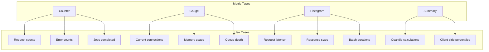
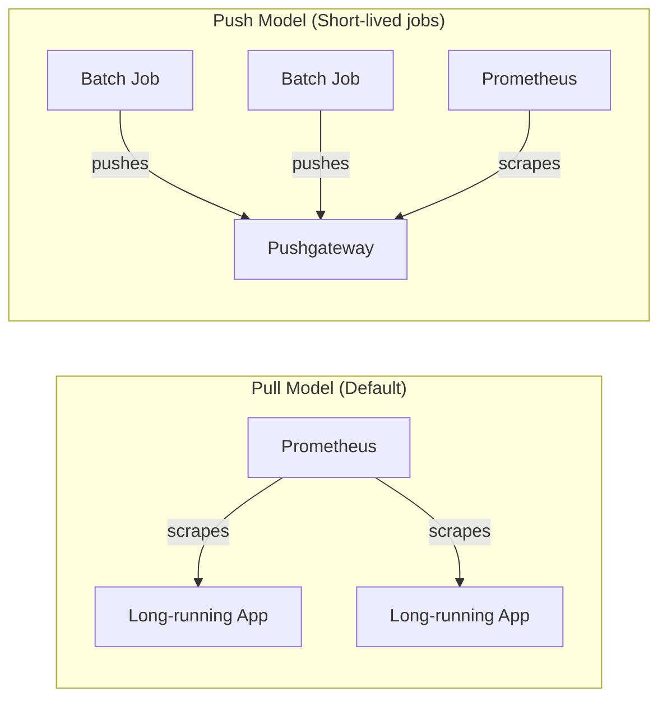

# How to Handle Metrics Collection

Author: [nawazdhandala](https://www.github.com/nawazdhandala)

Tags: Metrics, Prometheus, Monitoring, Observability, DevOps, OpenTelemetry, Grafana

Description: Learn how to implement effective metrics collection including instrumentation, Prometheus configuration, cardinality management, and alerting best practices.

---

Metrics collection is the foundation of effective monitoring. Without proper metrics, you are flying blind when production issues occur. This guide covers how to instrument your applications, configure collection infrastructure, and avoid common pitfalls that make metrics useless or overwhelming.

## Understanding Metric Types

Before diving into implementation, understand the four fundamental metric types:



## Application Instrumentation

Start by adding metrics to your application code. Here is a complete Node.js example:

```javascript
// metrics.js - Centralized metrics setup
const client = require('prom-client');

// Create a registry for all metrics
const register = new client.Registry();

// Add default metrics (CPU, memory, event loop, etc.)
client.collectDefaultMetrics({ register });

// HTTP request counter - increment for every request
const httpRequestsTotal = new client.Counter({
  name: 'http_requests_total',
  help: 'Total number of HTTP requests',
  labelNames: ['method', 'path', 'status'],
  registers: [register],
});

// Request duration histogram - measures latency distribution
const httpRequestDuration = new client.Histogram({
  name: 'http_request_duration_seconds',
  help: 'HTTP request duration in seconds',
  labelNames: ['method', 'path', 'status'],
  // Buckets cover typical web response times
  buckets: [0.01, 0.05, 0.1, 0.25, 0.5, 1, 2.5, 5, 10],
  registers: [register],
});

// Active connections gauge - current value at any point
const activeConnections = new client.Gauge({
  name: 'http_active_connections',
  help: 'Number of active HTTP connections',
  registers: [register],
});

// Business metric example
const ordersProcessed = new client.Counter({
  name: 'orders_processed_total',
  help: 'Total orders processed',
  labelNames: ['status', 'payment_method'],
  registers: [register],
});

module.exports = {
  register,
  httpRequestsTotal,
  httpRequestDuration,
  activeConnections,
  ordersProcessed,
};
```

### Middleware for Automatic HTTP Metrics

Create middleware that automatically instruments all HTTP endpoints:

```javascript
// metricsMiddleware.js
const { httpRequestsTotal, httpRequestDuration, activeConnections } = require('./metrics');

function metricsMiddleware(req, res, next) {
  // Track active connections
  activeConnections.inc();

  // Record start time for duration calculation
  const startTime = process.hrtime.bigint();

  // Normalize path to prevent high cardinality
  // /users/123 becomes /users/:id
  const normalizedPath = normalizePath(req.route?.path || req.path);

  // Hook into response finish event
  res.on('finish', () => {
    const endTime = process.hrtime.bigint();
    const durationSeconds = Number(endTime - startTime) / 1e9;

    const labels = {
      method: req.method,
      path: normalizedPath,
      status: res.statusCode,
    };

    httpRequestsTotal.inc(labels);
    httpRequestDuration.observe(labels, durationSeconds);
    activeConnections.dec();
  });

  next();
}

function normalizePath(path) {
  // Replace numeric IDs with placeholder to reduce cardinality
  return path
    .replace(/\/\d+/g, '/:id')
    .replace(/\/[a-f0-9-]{36}/g, '/:uuid');
}

module.exports = metricsMiddleware;
```

### Exposing the Metrics Endpoint

Add an endpoint that Prometheus can scrape:

```javascript
// app.js
const express = require('express');
const { register } = require('./metrics');
const metricsMiddleware = require('./metricsMiddleware');

const app = express();

// Apply metrics middleware to all routes
app.use(metricsMiddleware);

// Metrics endpoint for Prometheus scraping
app.get('/metrics', async (req, res) => {
  try {
    res.set('Content-Type', register.contentType);
    res.end(await register.metrics());
  } catch (err) {
    res.status(500).end(err);
  }
});

// Your application routes
app.get('/api/users/:id', async (req, res) => {
  // ... handler code
});

app.listen(3000);
```

## Prometheus Configuration

Configure Prometheus to scrape your application metrics:

```yaml
# prometheus.yml
global:
  scrape_interval: 15s
  evaluation_interval: 15s
  external_labels:
    cluster: 'production'

scrape_configs:
  # Scrape Prometheus itself
  - job_name: 'prometheus'
    static_configs:
      - targets: ['localhost:9090']

  # Application metrics with service discovery
  - job_name: 'applications'
    kubernetes_sd_configs:
      - role: pod
    relabel_configs:
      # Only scrape pods with prometheus annotation
      - source_labels: [__meta_kubernetes_pod_annotation_prometheus_io_scrape]
        action: keep
        regex: true

      # Use custom metrics port if specified
      - source_labels: [__address__, __meta_kubernetes_pod_annotation_prometheus_io_port]
        action: replace
        regex: ([^:]+)(?::\d+)?;(\d+)
        replacement: $1:$2
        target_label: __address__

      # Use custom metrics path if specified
      - source_labels: [__meta_kubernetes_pod_annotation_prometheus_io_path]
        action: replace
        target_label: __metrics_path__
        regex: (.+)

      # Add useful labels
      - source_labels: [__meta_kubernetes_namespace]
        action: replace
        target_label: namespace

      - source_labels: [__meta_kubernetes_pod_name]
        action: replace
        target_label: pod

      - source_labels: [__meta_kubernetes_pod_label_app]
        action: replace
        target_label: app
```

### Pod Annotations for Scraping

Add annotations to your Kubernetes pods to enable scraping:

```yaml
# deployment.yaml
apiVersion: apps/v1
kind: Deployment
metadata:
  name: my-app
spec:
  template:
    metadata:
      annotations:
        prometheus.io/scrape: "true"
        prometheus.io/port: "3000"
        prometheus.io/path: "/metrics"
    spec:
      containers:
        - name: my-app
          image: my-app:latest
          ports:
            - containerPort: 3000
```

## Cardinality Management

High cardinality is the most common metrics problem. Every unique label combination creates a new time series.

### Identifying High Cardinality

Query Prometheus to find high cardinality metrics:

```promql
# Count unique time series per metric
count by (__name__) ({__name__=~".+"})

# Find metrics with most label combinations
topk(10, count by (__name__)({__name__=~".+"}))

# Check specific metric cardinality
count(http_requests_total)
```

### Avoiding High Cardinality

Follow these rules when defining labels:

```javascript
// BAD: Unbounded labels create millions of time series
const requestDuration = new Histogram({
  name: 'http_request_duration_seconds',
  labelNames: [
    'method',
    'path',         // OK if normalized
    'user_id',      // BAD: potentially millions of values
    'request_id',   // BAD: unique per request
    'ip_address',   // BAD: many unique values
  ],
});

// GOOD: Limited, known label values
const requestDuration = new Histogram({
  name: 'http_request_duration_seconds',
  labelNames: [
    'method',       // GET, POST, PUT, DELETE, etc.
    'path',         // Normalized route patterns
    'status_class', // 2xx, 3xx, 4xx, 5xx
  ],
});

// Record with normalized values
httpRequestDuration.observe(
  {
    method: req.method,
    path: '/users/:id',           // Pattern, not actual path
    status_class: `${Math.floor(res.statusCode / 100)}xx`,
  },
  duration
);
```

### Dropping Labels in Prometheus

If high cardinality metrics already exist, drop labels during scraping:

```yaml
scrape_configs:
  - job_name: 'applications'
    metric_relabel_configs:
      # Drop the user_id label from all metrics
      - source_labels: [user_id]
        target_label: user_id
        replacement: ''

      # Or drop entire metrics that are problematic
      - source_labels: [__name__]
        regex: 'problematic_metric_.*'
        action: drop
```

## Recording Rules

Pre-compute expensive queries with recording rules:

```yaml
# rules/recording.yml
groups:
  - name: http_metrics
    interval: 30s
    rules:
      # Pre-calculate request rate per service
      - record: service:http_requests:rate5m
        expr: sum by (app) (rate(http_requests_total[5m]))

      # Pre-calculate error rate
      - record: service:http_errors:rate5m
        expr: |
          sum by (app) (rate(http_requests_total{status=~"5.."}[5m]))
          /
          sum by (app) (rate(http_requests_total[5m]))

      # Pre-calculate p95 latency
      - record: service:http_latency:p95
        expr: |
          histogram_quantile(0.95,
            sum by (app, le) (rate(http_request_duration_seconds_bucket[5m]))
          )

      # Pre-calculate p99 latency
      - record: service:http_latency:p99
        expr: |
          histogram_quantile(0.99,
            sum by (app, le) (rate(http_request_duration_seconds_bucket[5m]))
          )
```

Recording rules speed up dashboard loading and reduce query load.

## Alerting Rules

Define alerts based on your metrics:

```yaml
# rules/alerts.yml
groups:
  - name: application_alerts
    rules:
      # Alert on high error rate
      - alert: HighErrorRate
        expr: service:http_errors:rate5m > 0.05
        for: 5m
        labels:
          severity: critical
        annotations:
          summary: "High error rate on {{ $labels.app }}"
          description: "Error rate is {{ $value | humanizePercentage }} (threshold: 5%)"
          runbook_url: "https://wiki.example.com/runbooks/high-error-rate"

      # Alert on high latency
      - alert: HighLatency
        expr: service:http_latency:p95 > 1
        for: 5m
        labels:
          severity: warning
        annotations:
          summary: "High p95 latency on {{ $labels.app }}"
          description: "p95 latency is {{ $value | humanizeDuration }}"

      # Alert when targets are down
      - alert: TargetDown
        expr: up == 0
        for: 1m
        labels:
          severity: critical
        annotations:
          summary: "Scrape target {{ $labels.instance }} is down"
          description: "Prometheus cannot scrape {{ $labels.job }}/{{ $labels.instance }}"
```

## Push vs Pull Collection

Prometheus uses a pull model by default, but some scenarios need push:



### Using Pushgateway for Batch Jobs

For short-lived jobs that complete before Prometheus can scrape them:

```javascript
// Batch job metrics with Pushgateway
const client = require('prom-client');
const gateway = new client.Pushgateway('http://pushgateway:9091');

const jobDuration = new client.Gauge({
  name: 'batch_job_duration_seconds',
  help: 'Duration of batch job in seconds',
  labelNames: ['job_name'],
});

const jobSuccess = new client.Gauge({
  name: 'batch_job_last_success_timestamp',
  help: 'Timestamp of last successful job run',
  labelNames: ['job_name'],
});

async function runBatchJob() {
  const startTime = Date.now();

  try {
    await processBatch();

    // Record success metrics
    const duration = (Date.now() - startTime) / 1000;
    jobDuration.set({ job_name: 'daily_report' }, duration);
    jobSuccess.set({ job_name: 'daily_report' }, Date.now() / 1000);

    // Push to gateway
    await gateway.pushAdd({ jobName: 'daily_report' });

  } catch (error) {
    // Push failure metric
    jobDuration.set({ job_name: 'daily_report' }, -1);
    await gateway.pushAdd({ jobName: 'daily_report' });
    throw error;
  }
}
```

## Remote Write for Long-Term Storage

Prometheus local storage has limited retention. Use remote write for long-term storage:

```yaml
# prometheus.yml
remote_write:
  - url: "http://thanos-receive:19291/api/v1/receive"
    queue_config:
      capacity: 10000
      max_shards: 30
      max_samples_per_send: 5000
    write_relabel_configs:
      # Only send aggregated metrics to long-term storage
      - source_labels: [__name__]
        regex: 'service:.*'
        action: keep
```

## Dashboard Best Practices

When building Grafana dashboards, query efficiently:

```promql
# BAD: Calculates rate on every dashboard load
sum(rate(http_requests_total[5m])) by (app)

# GOOD: Use pre-computed recording rule
service:http_requests:rate5m

# BAD: Expensive histogram quantile calculation
histogram_quantile(0.95, sum(rate(http_request_duration_seconds_bucket[5m])) by (le))

# GOOD: Use pre-computed recording rule
service:http_latency:p95
```

Set appropriate time ranges and resolutions:

```
# For dashboards showing last hour, 15s resolution is fine
# For dashboards showing last week, use 5m resolution
# For dashboards showing last month, use 1h resolution
```

## Summary

Effective metrics collection requires careful instrumentation, proper Prometheus configuration, and constant attention to cardinality. Use the right metric type for each measurement. Normalize labels to prevent cardinality explosion. Create recording rules for frequently used queries. Set up meaningful alerts based on your SLOs. With these practices in place, your metrics will actually help you understand and improve your systems.
