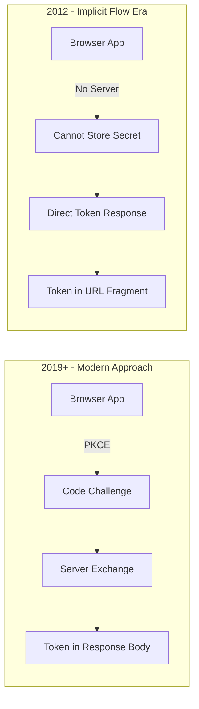
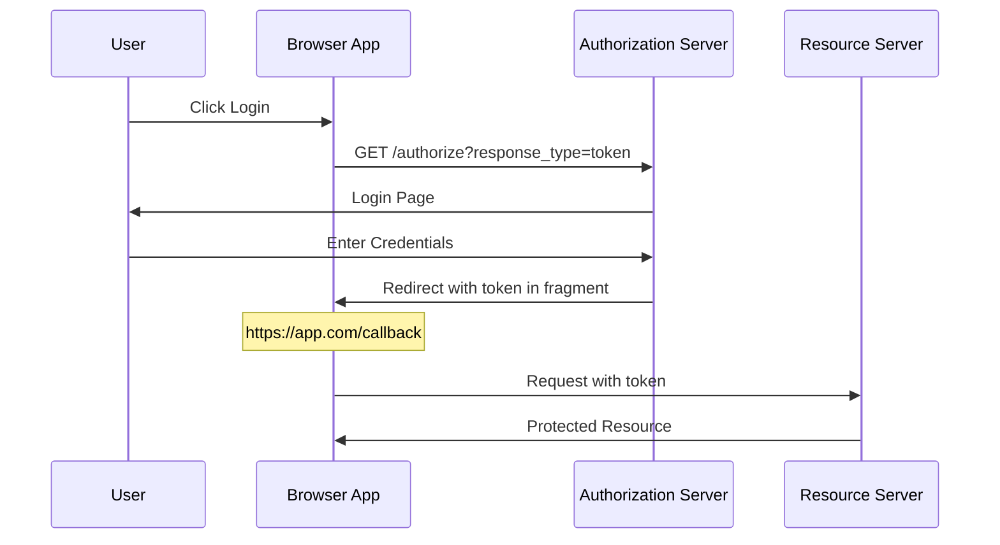
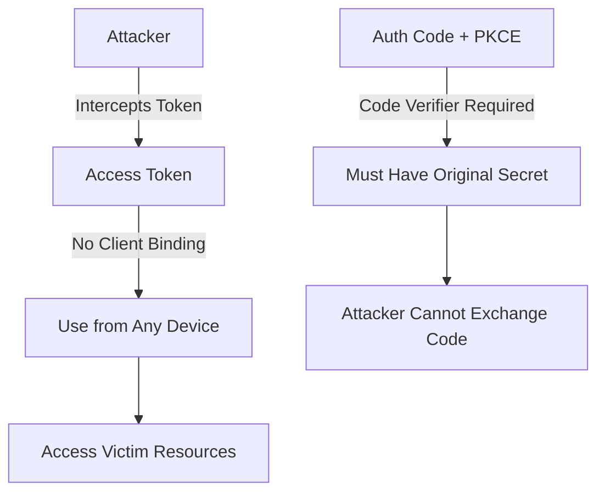
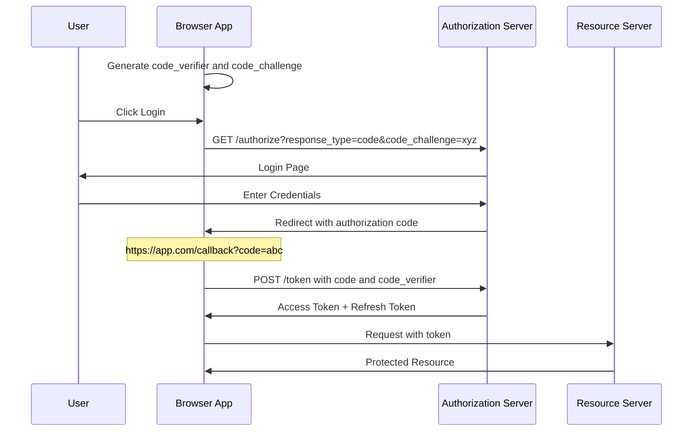

# How to Handle OAuth2 Implicit Flow (Deprecated)

Author: [nawazdhandala](https://www.github.com/nawazdhandala)

Tags: OAuth2, Authentication, Security, Implicit Flow, PKCE, Migration, Authorization Code

Description: A guide to understanding why OAuth2 Implicit Flow is deprecated, how to identify legacy implementations, and how to migrate to the more secure Authorization Code Flow with PKCE.

---

The OAuth2 Implicit Flow was designed for browser-based applications that could not securely store client secrets. However, security research has shown significant vulnerabilities in this approach. This guide explains why it is deprecated and how to migrate to safer alternatives.

## Why Implicit Flow Was Created



## How Implicit Flow Works



### Identifying Implicit Flow in Your Code

```javascript
// Implicit Flow - DEPRECATED
// Look for response_type=token in authorization requests

// Frontend code using implicit flow
function startImplicitFlow() {
    const authUrl = new URL('https://auth.example.com/authorize');
    authUrl.searchParams.set('client_id', 'your-client-id');
    authUrl.searchParams.set('redirect_uri', 'https://app.com/callback');
    authUrl.searchParams.set('response_type', 'token');  // DEPRECATED indicator
    authUrl.searchParams.set('scope', 'openid profile');
    authUrl.searchParams.set('state', generateState());

    window.location.href = authUrl.toString();
}

// Callback handler extracting token from URL fragment
function handleImplicitCallback() {
    const hash = window.location.hash.substring(1);
    const params = new URLSearchParams(hash);

    const accessToken = params.get('access_token');  // Token exposed in URL
    const tokenType = params.get('token_type');
    const expiresIn = params.get('expires_in');
    const state = params.get('state');

    // Validate state
    if (state !== sessionStorage.getItem('oauth_state')) {
        throw new Error('State mismatch');
    }

    // Store token (typically in memory for SPAs)
    return { accessToken, tokenType, expiresIn };
}
```

## Security Vulnerabilities

The Implicit Flow has several well-documented security issues.

### 1. Token Exposure in Browser History

```javascript
// After redirect, the URL looks like:
// https://app.com/callback#access_token=eyJhbGciOiJSUzI1NiIs...&token_type=Bearer

// This URL is:
// - Stored in browser history
// - Visible in developer tools
// - Potentially logged by proxies
// - Accessible to browser extensions
```

### 2. Token Leakage via Referrer Header

```javascript
// If your callback page has external links or resources:
// <a href="https://external-site.com">Link</a>
// 

// The Referer header will contain the access token:
// Referer: https://app.com/callback#access_token=eyJhbG...
```

### 3. No Token Binding



## Migration to Authorization Code Flow with PKCE

PKCE (Proof Key for Code Exchange) provides the security benefits of the Authorization Code Flow without requiring a client secret.



### PKCE Implementation

```javascript
// Cryptographic utilities for PKCE
class PKCEHelper {
    // Generate a cryptographically random code verifier
    static generateCodeVerifier() {
        const array = new Uint8Array(32);
        crypto.getRandomValues(array);
        return this.base64UrlEncode(array);
    }

    // Create SHA-256 hash and base64url encode it
    static async generateCodeChallenge(verifier) {
        const encoder = new TextEncoder();
        const data = encoder.encode(verifier);
        const digest = await crypto.subtle.digest('SHA-256', data);
        return this.base64UrlEncode(new Uint8Array(digest));
    }

    // Base64 URL encoding (no padding, URL-safe characters)
    static base64UrlEncode(array) {
        const base64 = btoa(String.fromCharCode(...array));
        return base64
            .replace(/\+/g, '-')
            .replace(/\//g, '_')
            .replace(/=+$/, '');
    }
}

// Modern OAuth2 client with PKCE
class OAuth2PKCEClient {
    constructor(config) {
        this.authorizationEndpoint = config.authorizationEndpoint;
        this.tokenEndpoint = config.tokenEndpoint;
        this.clientId = config.clientId;
        this.redirectUri = config.redirectUri;
        this.scopes = config.scopes || [];
    }

    async startAuthorizationFlow() {
        // Generate PKCE values
        const codeVerifier = PKCEHelper.generateCodeVerifier();
        const codeChallenge = await PKCEHelper.generateCodeChallenge(codeVerifier);
        const state = PKCEHelper.generateCodeVerifier(); // Reuse for random state

        // Store for later use
        sessionStorage.setItem('pkce_code_verifier', codeVerifier);
        sessionStorage.setItem('oauth_state', state);

        // Build authorization URL
        const url = new URL(this.authorizationEndpoint);
        url.searchParams.set('client_id', this.clientId);
        url.searchParams.set('redirect_uri', this.redirectUri);
        url.searchParams.set('response_type', 'code');  // Code, not token
        url.searchParams.set('scope', this.scopes.join(' '));
        url.searchParams.set('state', state);
        url.searchParams.set('code_challenge', codeChallenge);
        url.searchParams.set('code_challenge_method', 'S256');

        // Redirect to authorization server
        window.location.href = url.toString();
    }

    async handleCallback() {
        const params = new URLSearchParams(window.location.search);

        // Handle errors
        if (params.has('error')) {
            throw new Error(params.get('error_description') || params.get('error'));
        }

        // Validate state
        const state = params.get('state');
        const storedState = sessionStorage.getItem('oauth_state');
        if (!state || state !== storedState) {
            throw new Error('State mismatch - possible CSRF attack');
        }

        // Get authorization code
        const code = params.get('code');
        if (!code) {
            throw new Error('Authorization code not found');
        }

        // Get stored code verifier
        const codeVerifier = sessionStorage.getItem('pkce_code_verifier');
        if (!codeVerifier) {
            throw new Error('Code verifier not found');
        }

        // Exchange code for tokens
        const tokens = await this.exchangeCodeForTokens(code, codeVerifier);

        // Clean up
        sessionStorage.removeItem('pkce_code_verifier');
        sessionStorage.removeItem('oauth_state');

        // Clear URL
        window.history.replaceState({}, document.title, window.location.pathname);

        return tokens;
    }

    async exchangeCodeForTokens(code, codeVerifier) {
        const body = new URLSearchParams();
        body.append('grant_type', 'authorization_code');
        body.append('client_id', this.clientId);
        body.append('code', code);
        body.append('redirect_uri', this.redirectUri);
        body.append('code_verifier', codeVerifier);

        const response = await fetch(this.tokenEndpoint, {
            method: 'POST',
            headers: {
                'Content-Type': 'application/x-www-form-urlencoded',
            },
            body: body.toString(),
        });

        if (!response.ok) {
            const error = await response.json();
            throw new Error(error.error_description || error.error);
        }

        return response.json();
    }
}

// Usage
const oauth = new OAuth2PKCEClient({
    authorizationEndpoint: 'https://auth.example.com/authorize',
    tokenEndpoint: 'https://auth.example.com/oauth/token',
    clientId: 'your-spa-client-id',
    redirectUri: 'https://app.com/callback',
    scopes: ['openid', 'profile', 'email', 'offline_access'],
});

// Login button handler
document.getElementById('login').addEventListener('click', () => {
    oauth.startAuthorizationFlow();
});

// Callback page handler
if (window.location.pathname === '/callback') {
    oauth.handleCallback()
        .then(tokens => {
            console.log('Authenticated successfully');
            // Store tokens securely in memory
            tokenManager.setTokens(tokens);
        })
        .catch(error => {
            console.error('Authentication failed:', error);
        });
}
```

## Migration Checklist

Follow these steps to migrate from Implicit Flow to Authorization Code with PKCE.

### Step 1: Update Authorization Server Configuration

```yaml
# Auth0 example configuration
clients:
  - name: "My SPA"
    client_id: "your-spa-client-id"
    app_type: "spa"
    token_endpoint_auth_method: "none"  # No client secret for public clients
    grant_types:
      - authorization_code  # Enable Auth Code
      - refresh_token       # Enable refresh tokens
    # Remove: implicit
    response_types:
      - code               # Authorization code response
    # Remove: token, id_token (implicit responses)
```

### Step 2: Update Client Application

```javascript
// Before (Implicit Flow)
const oldConfig = {
    responseType: 'token id_token',
    // No code challenge
};

// After (Authorization Code with PKCE)
const newConfig = {
    responseType: 'code',
    codeChallengeMethod: 'S256',
    // code_challenge generated dynamically
};
```

### Step 3: Update Callback Handler

```javascript
// Before: Token in URL fragment
function oldCallback() {
    const hash = window.location.hash;
    // Parse token from fragment
}

// After: Code in query string
function newCallback() {
    const params = new URLSearchParams(window.location.search);
    const code = params.get('code');
    // Exchange code for tokens
}
```

## Summary

The OAuth2 Implicit Flow is deprecated due to:

1. Token exposure in browser history and URLs
2. Token leakage via Referer headers
3. No ability to bind tokens to clients
4. No refresh token support

Migrate to Authorization Code Flow with PKCE:

1. Generate code_verifier and code_challenge on the client
2. Include code_challenge in authorization request
3. Exchange authorization code with code_verifier for tokens
4. Store tokens in memory, not localStorage
5. Use refresh tokens for session continuity

All modern authorization servers support PKCE. If yours does not, prioritize upgrading it.
