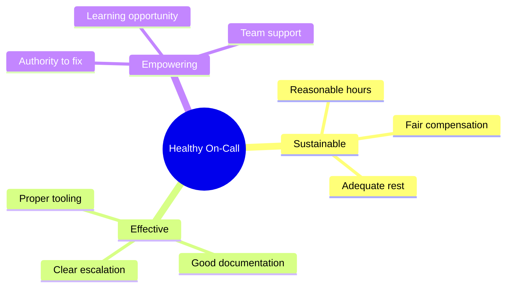
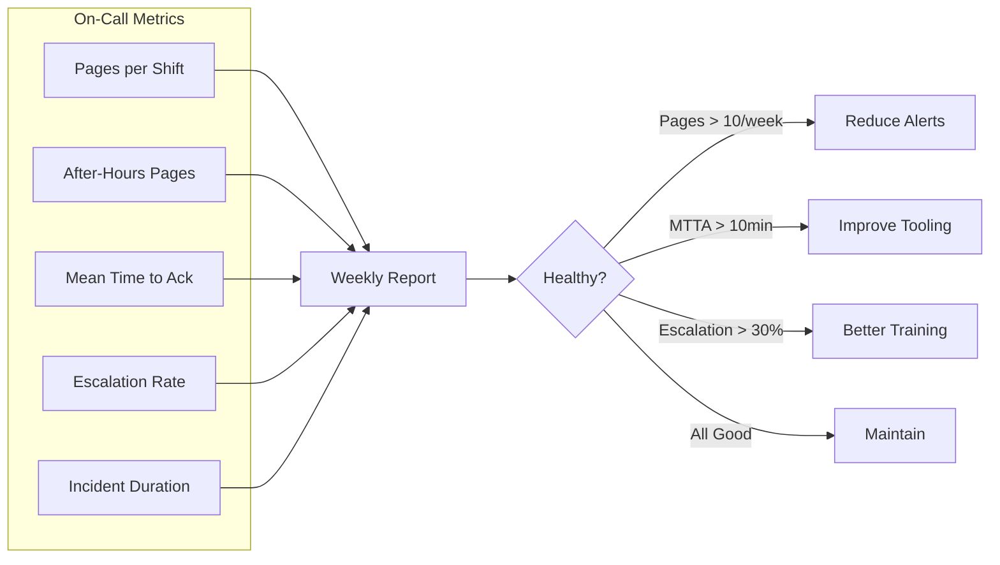

# How to Handle On-Call Practices

Author: [nawazdhandala](https://www.github.com/nawazdhandala)

Tags: On-Call, DevOps, SRE, Incident Management, Team Management, Operations, Alerting

Description: A comprehensive guide to establishing healthy on-call practices, including rotation schedules, compensation, handoffs, and preventing burnout.

---

On-call does not have to be miserable. With the right practices in place, it can be a sustainable part of engineering work that actually improves your systems. This guide covers how to set up on-call rotations that work for both your services and your team.

## On-Call Philosophy

Before diving into the mechanics, establish the right mindset:



## Design Your Rotation Schedule

A good rotation balances coverage with engineer wellbeing:

```yaml
# oncall-schedule.yaml
# Configuration for on-call rotation

rotation:
  name: "platform-oncall"
  description: "Primary on-call for platform services"

  schedule:
    # How long each shift lasts
    shift_duration: "1 week"

    # When shifts start
    handoff_time: "10:00"
    handoff_day: "Monday"
    handoff_timezone: "America/Los_Angeles"

    # Minimum people in rotation
    min_rotation_size: 5

    # Maximum consecutive shifts
    max_consecutive_shifts: 1

    # Rest period after shift
    cooldown_days: 14

  participants:
    - name: "Alice Chen"
      email: "alice@company.com"
      phone: "+1-555-0101"
      unavailable:
        - start: "2026-02-15"
          end: "2026-02-22"
          reason: "Vacation"

    - name: "Bob Smith"
      email: "bob@company.com"
      phone: "+1-555-0102"

    - name: "Carol Davis"
      email: "carol@company.com"
      phone: "+1-555-0103"

    - name: "David Lee"
      email: "david@company.com"
      phone: "+1-555-0104"

    - name: "Emma Wilson"
      email: "emma@company.com"
      phone: "+1-555-0105"

  backup:
    # Secondary on-call escalation
    enabled: true
    delay_minutes: 15

  escalation:
    - level: 1
      target: "primary-oncall"
      timeout: 15
    - level: 2
      target: "secondary-oncall"
      timeout: 15
    - level: 3
      target: "engineering-manager"
      timeout: 30
```

## Implement Proper Handoffs

Handoffs are critical. A bad handoff means the incoming engineer starts blind:

```markdown
## On-Call Handoff Template

### Handoff Date: [DATE]
### From: [OUTGOING ENGINEER]
### To: [INCOMING ENGINEER]

---

### Active Issues
| Issue | Status | Next Steps | Severity |
|-------|--------|------------|----------|
| Database slow queries | Monitoring | Check if migration completes | Medium |
| Cert renewal pending | Scheduled | Auto-renews Tuesday | Low |

### Recent Incidents
1. **[INC-1234] API Outage** (Resolved)
   - Root cause: Memory leak in auth service
   - Fix deployed Monday
   - Watch for recurrence

2. **[INC-1235] High Latency** (Monitoring)
   - Caused by traffic spike
   - Added autoscaling rules
   - May need manual scaling if spike >3x

### Deployments This Week
- Monday: Auth service v2.3.1 (memory fix)
- Wednesday: Database migration (scheduled 2am PST)
- Friday: Frontend release (low risk)

### Things to Watch
- [ ] Database migration Wednesday - monitor for 1 hour after
- [ ] New customer onboarding Thursday - expect traffic increase
- [ ] Marketing campaign starts Friday - 2x normal traffic expected

### Helpful Context
- The "flaky-test" alert fires randomly - safe to ack and ignore
- If payment-service alerts, check Stripe status first
- Alice is backup this week, David knows payment code best

### Questions for Incoming Engineer?
[OUTGOING ENGINEER TO FILL IN ANYTHING INCOMING NEEDS TO ASK]
```

Automate handoff reminders:

```python
# handoff_automation.py
# Automate on-call handoff process

from datetime import datetime, timedelta
import requests

class OnCallHandoff:
    def __init__(self, schedule_api, slack_webhook):
        self.schedule_api = schedule_api
        self.slack_webhook = slack_webhook

    def get_rotation_info(self, rotation_id):
        """Get current and next on-call engineer"""
        response = requests.get(f"{self.schedule_api}/rotations/{rotation_id}")
        return response.json()

    def send_handoff_reminder(self, rotation_id):
        """Send reminder to both outgoing and incoming engineer"""

        rotation = self.get_rotation_info(rotation_id)
        outgoing = rotation['current_oncall']
        incoming = rotation['next_oncall']
        handoff_time = rotation['next_handoff']

        message = {
            "blocks": [
                {
                    "type": "header",
                    "text": {
                        "type": "plain_text",
                        "text": "On-Call Handoff Reminder"
                    }
                },
                {
                    "type": "section",
                    "fields": [
                        {
                            "type": "mrkdwn",
                            "text": f"*Outgoing:*\n<@{outgoing['slack_id']}>"
                        },
                        {
                            "type": "mrkdwn",
                            "text": f"*Incoming:*\n<@{incoming['slack_id']}>"
                        }
                    ]
                },
                {
                    "type": "section",
                    "text": {
                        "type": "mrkdwn",
                        "text": f"Handoff scheduled for *{handoff_time}*"
                    }
                },
                {
                    "type": "section",
                    "text": {
                        "type": "mrkdwn",
                        "text": "*Handoff Checklist:*\n"
                               "- [ ] Review active incidents\n"
                               "- [ ] Discuss any ongoing issues\n"
                               "- [ ] Mention upcoming deployments\n"
                               "- [ ] Share any tribal knowledge\n"
                               "- [ ] Confirm contact info works"
                    }
                },
                {
                    "type": "actions",
                    "elements": [
                        {
                            "type": "button",
                            "text": {"type": "plain_text", "text": "View Handoff Doc"},
                            "url": f"https://docs.company.com/oncall/handoff/{rotation_id}"
                        },
                        {
                            "type": "button",
                            "text": {"type": "plain_text", "text": "Recent Incidents"},
                            "url": "https://incidents.company.com/recent"
                        }
                    ]
                }
            ]
        }

        requests.post(self.slack_webhook, json=message)

    def schedule_handoff_meeting(self, rotation_id):
        """Create calendar event for handoff"""

        rotation = self.get_rotation_info(rotation_id)

        # Create 30-minute meeting 1 hour before handoff
        meeting_time = datetime.fromisoformat(rotation['next_handoff']) - timedelta(hours=1)

        event = {
            "summary": "On-Call Handoff",
            "description": "Discuss active issues, upcoming work, and transfer context",
            "start": meeting_time.isoformat(),
            "duration_minutes": 30,
            "attendees": [
                rotation['current_oncall']['email'],
                rotation['next_oncall']['email']
            ]
        }

        # Create via calendar API
        return event
```

## Set Up On-Call Compensation

Fair compensation keeps engineers engaged:

```yaml
# oncall-compensation.yaml
# Fair compensation framework

compensation:
  # Base on-call stipend
  weekly_stipend:
    weekday: 200  # USD per weekday on-call
    weekend: 300  # USD per weekend day
    holiday: 400  # USD per holiday

  # Incident response pay
  incident_pay:
    during_hours: 0  # Covered by salary
    after_hours:
      first_hour: 100
      additional_hours: 75
      minimum: 100  # Minimum for any after-hours work

  # Time off in lieu
  time_off:
    enabled: true
    after_hours_incident: "4 hours off for every 2 hours incident work"
    weekend_shift: "1 day off after weekend on-call"

  # Quality bonuses
  bonuses:
    incident_free_week: 50
    documentation_contribution: 25
    runbook_improvement: 50

policies:
  # Maximum on-call hours
  max_weekly_hours: 168  # Full week coverage
  max_consecutive_incidents: 3  # Then mandatory escalate

  # Required rest
  post_incident_rest:
    after_3am_page: "Late start next day"
    incident_over_2_hours: "Half day off"

  # Coverage requirements
  response_time:
    critical: 5  # minutes
    high: 15
    medium: 60
```

## Create On-Call Runbook

Every on-call engineer needs a quick reference:

```markdown
# On-Call Quick Reference

## First 5 Minutes of Your Shift

1. [ ] Check #incidents channel for active issues
2. [ ] Review handoff notes from previous engineer
3. [ ] Verify your phone receives test alert
4. [ ] Check upcoming deployments calendar
5. [ ] Skim recent commits to main services

## When You Get Paged

### Step 1: Acknowledge (within 5 min)
- Acknowledge in PagerDuty
- Post in #incidents: "Investigating [ALERT_NAME]"

### Step 2: Assess (next 5 min)
- Check dashboards: https://grafana.company.com
- Check logs: https://logs.company.com
- Check recent deploys: https://deployments.company.com

### Step 3: Act
- If you know the fix: implement it
- If you need help: escalate immediately
- If it is a false alarm: resolve and note why

### Step 4: Communicate
- Update #incidents every 15 minutes during active incident
- Notify stakeholders if customer-facing
- Update status page if warranted

## Quick Links

| Resource | Link |
|----------|------|
| Dashboards | https://grafana.company.com |
| Logs | https://logs.company.com |
| Runbooks | https://runbooks.company.com |
| Deploy History | https://deploys.company.com |
| Status Page | https://status.company.com/admin |
| Escalation | https://pagerduty.company.com/escalate |

## Common Issues and Fixes

### High API Latency
```bash
# Check if it is database
kubectl logs -l app=api --tail=100 | grep -i "slow query"

# Restart if needed
kubectl rollout restart deployment/api
```

### Database Connection Pool Exhausted
```bash
# Kill idle connections
psql -c "SELECT pg_terminate_backend(pid) FROM pg_stat_activity
         WHERE state = 'idle' AND query_start < now() - interval '10 minutes';"
```

### Out of Memory Pods
```bash
# Find and restart OOMKilled pods
kubectl get pods | grep OOMKilled
kubectl delete pod [POD_NAME]
```

## When to Escalate

Escalate immediately if:
- You do not understand the issue after 15 minutes
- The issue requires access you do not have
- Multiple systems are affected
- You have been working for 2+ hours alone
- It is 3 AM and you cannot think straight

## Emergency Contacts

- Engineering Manager: [PHONE]
- Database Team: [PHONE]
- Security Team: [PHONE]
- VP Engineering: [PHONE] (severe outages only)
```

## Track On-Call Health Metrics

Monitor your on-call program to prevent burnout:



```python
# oncall_metrics.py
# Track on-call health

class OnCallMetrics:
    def __init__(self, incidents_db):
        self.db = incidents_db

    def get_shift_report(self, engineer, start_date, end_date):
        """Generate report for an on-call shift"""

        incidents = self.db.query("""
            SELECT * FROM incidents
            WHERE oncall_engineer = %s
            AND created_at BETWEEN %s AND %s
        """, (engineer, start_date, end_date))

        return {
            'engineer': engineer,
            'shift_start': start_date,
            'shift_end': end_date,
            'total_pages': len(incidents),
            'after_hours_pages': sum(1 for i in incidents if self._is_after_hours(i['created_at'])),
            'business_hours_pages': sum(1 for i in incidents if not self._is_after_hours(i['created_at'])),
            'avg_time_to_ack': self._avg([i['time_to_ack'] for i in incidents]),
            'avg_time_to_resolve': self._avg([i['time_to_resolve'] for i in incidents]),
            'escalations': sum(1 for i in incidents if i['was_escalated']),
            'false_alarms': sum(1 for i in incidents if not i['was_actionable']),
            'sleep_interruptions': self._count_sleep_interruptions(incidents),
            'longest_incident': max([i['duration_minutes'] for i in incidents], default=0)
        }

    def _is_after_hours(self, timestamp):
        """Check if timestamp is outside business hours"""
        hour = timestamp.hour
        weekday = timestamp.weekday()

        # After hours: before 9am, after 6pm, or weekend
        return hour < 9 or hour >= 18 or weekday >= 5

    def _count_sleep_interruptions(self, incidents):
        """Count pages between 10pm and 7am"""
        return sum(1 for i in incidents
                   if i['created_at'].hour >= 22 or i['created_at'].hour < 7)

    def _avg(self, values):
        return sum(values) / len(values) if values else 0

    def get_team_health(self, team_id, weeks=12):
        """Assess overall on-call health for a team"""

        stats = self.db.query("""
            SELECT
                AVG(pages_per_shift) as avg_pages,
                AVG(after_hours_pct) as avg_after_hours,
                AVG(time_to_ack) as avg_ack_time,
                AVG(escalation_rate) as avg_escalation
            FROM oncall_shift_reports
            WHERE team_id = %s
            AND shift_end > NOW() - INTERVAL '%s weeks'
        """, (team_id, weeks))

        health_score = self._calculate_health_score(stats)

        return {
            'metrics': stats,
            'health_score': health_score,
            'recommendations': self._get_recommendations(stats)
        }

    def _calculate_health_score(self, stats):
        """Score from 0-100, higher is healthier"""
        score = 100

        # Penalize high page volume
        if stats['avg_pages'] > 10:
            score -= min(30, (stats['avg_pages'] - 10) * 3)

        # Penalize after-hours pages
        if stats['avg_after_hours'] > 0.3:
            score -= min(20, (stats['avg_after_hours'] - 0.3) * 50)

        # Penalize slow acknowledgment
        if stats['avg_ack_time'] > 10:
            score -= min(20, (stats['avg_ack_time'] - 10) * 2)

        # Penalize high escalation rate
        if stats['avg_escalation'] > 0.2:
            score -= min(30, (stats['avg_escalation'] - 0.2) * 100)

        return max(0, score)
```

## Best Practices Summary

1. **Keep rotations fair** - Everyone shares the load equally
2. **Compensate appropriately** - On-call is extra work, pay for it
3. **Invest in tooling** - Good tools make on-call bearable
4. **Require handoffs** - Never start a shift blind
5. **Track metrics** - Measure and improve continuously
6. **Allow escalation** - Nobody should struggle alone
7. **Respect rest** - Tired engineers make mistakes
8. **Review regularly** - Monthly retrospectives improve the process

---

On-call works when engineers trust the system is fair, the alerts are meaningful, and support is available when needed. Build that trust through consistent practices, and on-call becomes a valuable learning experience rather than a dreaded burden.
