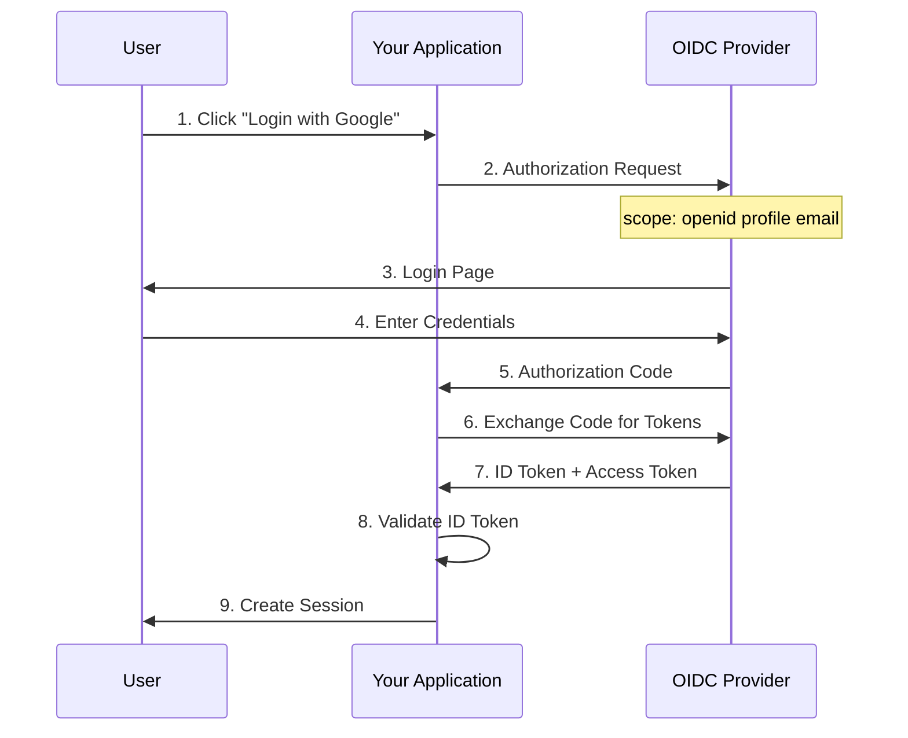
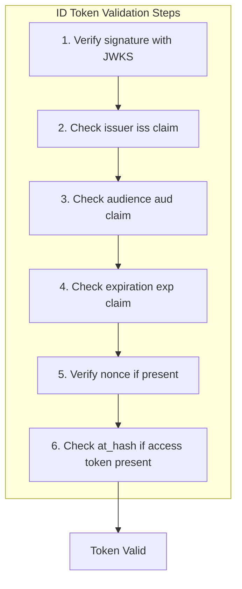
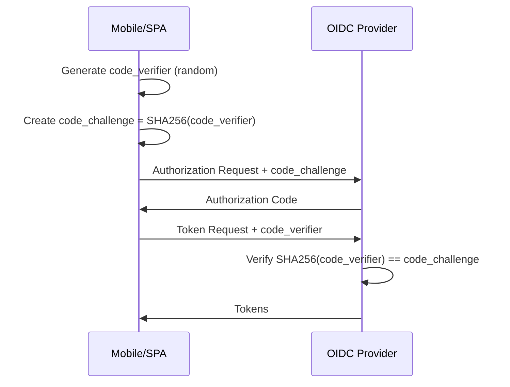
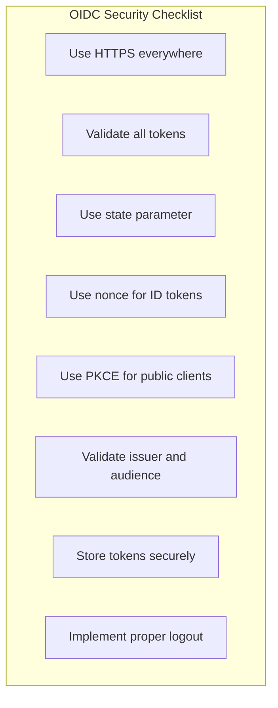

# How to Handle OpenID Connect (OIDC)

Author: [nawazdhandala](https://www.github.com/nawazdhandala)

Tags: OIDC, OpenID Connect, Authentication, OAuth2, SSO, Security, Identity

Description: A comprehensive guide to implementing OpenID Connect authentication including provider configuration, token handling, user info retrieval, and security best practices.

---

OpenID Connect (OIDC) is an identity layer built on top of OAuth 2.0. While OAuth 2.0 handles authorization (what you can access), OIDC adds authentication (who you are). This guide covers practical OIDC implementation with common providers and frameworks.

## Understanding OIDC



### OIDC vs OAuth 2.0

| Feature | OAuth 2.0 | OIDC |
|---------|-----------|------|
| Purpose | Authorization | Authentication + Authorization |
| Token | Access Token only | ID Token + Access Token |
| User Info | Requires API call | Included in ID Token |
| Standard Claims | None | sub, name, email, etc. |
| Discovery | Manual configuration | Well-known endpoint |

### OIDC Tokens

```javascript
// ID Token - Contains user identity (JWT)
{
    "iss": "https://accounts.google.com",     // Issuer
    "sub": "110169484474386276334",           // Subject (unique user ID)
    "aud": "your-client-id.apps.google.com",  // Audience (your app)
    "exp": 1706144400,                        // Expiration
    "iat": 1706140800,                        // Issued at
    "nonce": "abc123",                        // Replay protection
    "name": "John Doe",                       // User's name
    "email": "john@gmail.com",                // User's email
    "email_verified": true,                   // Email verified
    "picture": "https://..."                  // Profile picture URL
}

// Access Token - For accessing protected resources
// Usually opaque string, not JWT (provider-dependent)
"ya29.a0AfH6SMBx..."
```

## Provider Discovery

OIDC providers publish their configuration at a well-known URL.

```javascript
// Fetch provider configuration
async function discoverProvider(issuer) {
    const discoveryUrl = `${issuer}/.well-known/openid-configuration`;

    const response = await fetch(discoveryUrl);
    const config = await response.json();

    console.log('Authorization endpoint:', config.authorization_endpoint);
    console.log('Token endpoint:', config.token_endpoint);
    console.log('UserInfo endpoint:', config.userinfo_endpoint);
    console.log('JWKS URI:', config.jwks_uri);
    console.log('Supported scopes:', config.scopes_supported);

    return config;
}

// Common provider discovery URLs
const providers = {
    google: 'https://accounts.google.com',
    microsoft: 'https://login.microsoftonline.com/{tenant}/v2.0',
    okta: 'https://{domain}.okta.com',
    auth0: 'https://{tenant}.auth0.com',
    keycloak: 'https://{host}/realms/{realm}'
};

// Example: Discover Google OIDC
discoverProvider('https://accounts.google.com');
```

## Implementing OIDC Client

### Node.js with openid-client

```javascript
// Install: npm install openid-client express-session

const { Issuer, generators } = require('openid-client');
const express = require('express');
const session = require('express-session');

const app = express();

app.use(session({
    secret: process.env.SESSION_SECRET,
    resave: false,
    saveUninitialized: false,
    cookie: { secure: true }
}));

let client;

// Initialize OIDC client
async function initializeOIDC() {
    // Discover provider configuration
    const issuer = await Issuer.discover('https://accounts.google.com');

    // Create client
    client = new issuer.Client({
        client_id: process.env.GOOGLE_CLIENT_ID,
        client_secret: process.env.GOOGLE_CLIENT_SECRET,
        redirect_uris: ['https://yourapp.com/auth/callback'],
        response_types: ['code']
    });

    console.log('OIDC client initialized');
}

// Start login flow
app.get('/auth/login', (req, res) => {
    // Generate state and nonce for security
    const state = generators.state();
    const nonce = generators.nonce();

    // Store in session for verification
    req.session.oidc = { state, nonce };

    // Build authorization URL
    const authUrl = client.authorizationUrl({
        scope: 'openid profile email',
        state: state,
        nonce: nonce
    });

    res.redirect(authUrl);
});

// Handle callback
app.get('/auth/callback', async (req, res) => {
    try {
        const { state, nonce } = req.session.oidc || {};

        // Get tokens from authorization code
        const params = client.callbackParams(req);
        const tokenSet = await client.callback(
            'https://yourapp.com/auth/callback',
            params,
            { state, nonce }
        );

        console.log('ID Token claims:', tokenSet.claims());
        console.log('Access Token:', tokenSet.access_token);

        // Get user info (optional - ID token usually has enough)
        const userinfo = await client.userinfo(tokenSet.access_token);
        console.log('UserInfo:', userinfo);

        // Create session
        req.session.user = {
            id: tokenSet.claims().sub,
            email: tokenSet.claims().email,
            name: tokenSet.claims().name,
            picture: tokenSet.claims().picture
        };

        // Clear OIDC state
        delete req.session.oidc;

        res.redirect('/dashboard');
    } catch (error) {
        console.error('OIDC callback error:', error);
        res.redirect('/login?error=authentication_failed');
    }
});

// Logout
app.get('/auth/logout', (req, res) => {
    const idToken = req.session.idToken;

    req.session.destroy(() => {
        // Redirect to provider's logout endpoint if available
        if (client.issuer.end_session_endpoint) {
            const logoutUrl = client.endSessionUrl({
                id_token_hint: idToken,
                post_logout_redirect_uri: 'https://yourapp.com'
            });
            res.redirect(logoutUrl);
        } else {
            res.redirect('/');
        }
    });
});

initializeOIDC().then(() => {
    app.listen(3000);
});
```

### Python with Authlib

```python
# Install: pip install authlib httpx flask

from flask import Flask, redirect, url_for, session
from authlib.integrations.flask_client import OAuth
import os

app = Flask(__name__)
app.secret_key = os.environ.get('SECRET_KEY')

# Configure OAuth
oauth = OAuth(app)

# Register Google OIDC
oauth.register(
    name='google',
    client_id=os.environ.get('GOOGLE_CLIENT_ID'),
    client_secret=os.environ.get('GOOGLE_CLIENT_SECRET'),
    server_metadata_url='https://accounts.google.com/.well-known/openid-configuration',
    client_kwargs={
        'scope': 'openid profile email'
    }
)

@app.route('/login')
def login():
    """Initiate OIDC login."""
    redirect_uri = url_for('auth_callback', _external=True)
    return oauth.google.authorize_redirect(redirect_uri)

@app.route('/auth/callback')
def auth_callback():
    """Handle OIDC callback."""
    try:
        # Get tokens
        token = oauth.google.authorize_access_token()

        # Parse ID token
        user_info = token.get('userinfo')
        if not user_info:
            # Fallback to userinfo endpoint
            user_info = oauth.google.userinfo()

        # Create session
        session['user'] = {
            'id': user_info['sub'],
            'email': user_info['email'],
            'name': user_info.get('name'),
            'picture': user_info.get('picture')
        }

        return redirect('/dashboard')
    except Exception as e:
        print(f"Authentication error: {e}")
        return redirect('/login?error=authentication_failed')

@app.route('/logout')
def logout():
    """Logout user."""
    session.clear()
    return redirect('/')

@app.route('/dashboard')
def dashboard():
    """Protected route."""
    user = session.get('user')
    if not user:
        return redirect('/login')
    return f"Hello, {user['name']}!"

if __name__ == '__main__':
    app.run(ssl_context='adhoc')
```

## ID Token Validation

Always validate the ID token before trusting its claims.



```javascript
const jwt = require('jsonwebtoken');
const jwksClient = require('jwks-rsa');

class IDTokenValidator {
    constructor(issuer, clientId) {
        this.issuer = issuer;
        this.clientId = clientId;
        this.jwksClient = jwksClient({
            jwksUri: `${issuer}/.well-known/jwks.json`,
            cache: true,
            rateLimit: true
        });
    }

    // Get signing key from JWKS
    getKey(header, callback) {
        this.jwksClient.getSigningKey(header.kid, (err, key) => {
            if (err) {
                callback(err);
                return;
            }
            const signingKey = key.publicKey || key.rsaPublicKey;
            callback(null, signingKey);
        });
    }

    // Validate ID token
    async validate(idToken, nonce = null) {
        return new Promise((resolve, reject) => {
            const options = {
                issuer: this.issuer,
                audience: this.clientId,
                algorithms: ['RS256']
            };

            jwt.verify(idToken, this.getKey.bind(this), options, (err, decoded) => {
                if (err) {
                    reject(new Error(`Token validation failed: ${err.message}`));
                    return;
                }

                // Verify nonce if provided
                if (nonce && decoded.nonce !== nonce) {
                    reject(new Error('Nonce mismatch'));
                    return;
                }

                // Check auth_time if max_age was requested
                if (decoded.auth_time) {
                    const maxAge = 3600;  // 1 hour
                    const authAge = Math.floor(Date.now() / 1000) - decoded.auth_time;
                    if (authAge > maxAge) {
                        reject(new Error('Authentication too old'));
                        return;
                    }
                }

                resolve(decoded);
            });
        });
    }

    // Validate at_hash claim (binds ID token to access token)
    validateAtHash(idToken, accessToken) {
        const decoded = jwt.decode(idToken, { complete: true });
        const atHash = decoded.payload.at_hash;

        if (!atHash) {
            return true;  // at_hash is optional
        }

        // Calculate expected at_hash
        const crypto = require('crypto');
        const algorithm = decoded.header.alg;

        let hashAlg;
        if (algorithm === 'RS256' || algorithm === 'ES256') {
            hashAlg = 'sha256';
        } else if (algorithm === 'RS384' || algorithm === 'ES384') {
            hashAlg = 'sha384';
        } else if (algorithm === 'RS512' || algorithm === 'ES512') {
            hashAlg = 'sha512';
        }

        const hash = crypto.createHash(hashAlg).update(accessToken).digest();
        const halfHash = hash.slice(0, hash.length / 2);
        const expectedAtHash = halfHash.toString('base64url');

        return atHash === expectedAtHash;
    }
}

// Usage
const validator = new IDTokenValidator(
    'https://accounts.google.com',
    'your-client-id.apps.google.com'
);

async function handleCallback(idToken, nonce) {
    try {
        const claims = await validator.validate(idToken, nonce);
        console.log('User authenticated:', claims.sub);
        console.log('Email:', claims.email);
        return claims;
    } catch (error) {
        console.error('Validation failed:', error.message);
        throw error;
    }
}
```

## PKCE for Public Clients

For mobile apps and SPAs, use PKCE (Proof Key for Code Exchange) instead of client secrets.



```javascript
const crypto = require('crypto');

// Generate PKCE values
function generatePKCE() {
    // Generate random code verifier
    const codeVerifier = crypto.randomBytes(32)
        .toString('base64url');

    // Create code challenge (SHA256 hash of verifier)
    const codeChallenge = crypto.createHash('sha256')
        .update(codeVerifier)
        .digest('base64url');

    return { codeVerifier, codeChallenge };
}

// OIDC client with PKCE
class OIDCClientPKCE {
    constructor(config) {
        this.clientId = config.clientId;
        this.redirectUri = config.redirectUri;
        this.issuer = config.issuer;
        this.config = null;
    }

    async discover() {
        const response = await fetch(
            `${this.issuer}/.well-known/openid-configuration`
        );
        this.config = await response.json();
    }

    // Start authorization with PKCE
    startAuth(state) {
        const { codeVerifier, codeChallenge } = generatePKCE();

        // Store code verifier (in session storage for SPA)
        sessionStorage.setItem('pkce_verifier', codeVerifier);
        sessionStorage.setItem('oauth_state', state);

        const params = new URLSearchParams({
            response_type: 'code',
            client_id: this.clientId,
            redirect_uri: this.redirectUri,
            scope: 'openid profile email',
            state: state,
            code_challenge: codeChallenge,
            code_challenge_method: 'S256'
        });

        window.location.href = `${this.config.authorization_endpoint}?${params}`;
    }

    // Handle callback and exchange code for tokens
    async handleCallback() {
        const params = new URLSearchParams(window.location.search);
        const code = params.get('code');
        const state = params.get('state');

        // Verify state
        const savedState = sessionStorage.getItem('oauth_state');
        if (state !== savedState) {
            throw new Error('State mismatch');
        }

        // Get code verifier
        const codeVerifier = sessionStorage.getItem('pkce_verifier');

        // Exchange code for tokens
        const response = await fetch(this.config.token_endpoint, {
            method: 'POST',
            headers: {
                'Content-Type': 'application/x-www-form-urlencoded'
            },
            body: new URLSearchParams({
                grant_type: 'authorization_code',
                client_id: this.clientId,
                code: code,
                redirect_uri: this.redirectUri,
                code_verifier: codeVerifier
            })
        });

        if (!response.ok) {
            throw new Error('Token exchange failed');
        }

        const tokens = await response.json();

        // Clean up
        sessionStorage.removeItem('pkce_verifier');
        sessionStorage.removeItem('oauth_state');

        return tokens;
    }
}
```

## Multi-Provider Support

Support multiple OIDC providers in your application.

```javascript
// Multi-provider OIDC manager
class OIDCManager {
    constructor() {
        this.providers = new Map();
    }

    // Register a provider
    async registerProvider(name, config) {
        const { Issuer } = require('openid-client');

        const issuer = await Issuer.discover(config.issuerUrl);
        const client = new issuer.Client({
            client_id: config.clientId,
            client_secret: config.clientSecret,
            redirect_uris: [config.redirectUri],
            response_types: ['code']
        });

        this.providers.set(name, {
            client,
            issuer,
            config
        });

        console.log(`Registered OIDC provider: ${name}`);
    }

    // Get provider by name
    getProvider(name) {
        const provider = this.providers.get(name);
        if (!provider) {
            throw new Error(`Unknown provider: ${name}`);
        }
        return provider;
    }

    // Generate login URL for provider
    getLoginUrl(providerName, state, nonce) {
        const { client } = this.getProvider(providerName);

        return client.authorizationUrl({
            scope: 'openid profile email',
            state,
            nonce
        });
    }

    // Handle callback for any provider
    async handleCallback(providerName, params, checks) {
        const { client, config } = this.getProvider(providerName);

        const tokenSet = await client.callback(
            config.redirectUri,
            params,
            checks
        );

        return {
            claims: tokenSet.claims(),
            accessToken: tokenSet.access_token,
            idToken: tokenSet.id_token
        };
    }
}

// Usage
const oidcManager = new OIDCManager();

async function setupProviders() {
    await oidcManager.registerProvider('google', {
        issuerUrl: 'https://accounts.google.com',
        clientId: process.env.GOOGLE_CLIENT_ID,
        clientSecret: process.env.GOOGLE_CLIENT_SECRET,
        redirectUri: 'https://yourapp.com/auth/google/callback'
    });

    await oidcManager.registerProvider('microsoft', {
        issuerUrl: `https://login.microsoftonline.com/${process.env.AZURE_TENANT_ID}/v2.0`,
        clientId: process.env.AZURE_CLIENT_ID,
        clientSecret: process.env.AZURE_CLIENT_SECRET,
        redirectUri: 'https://yourapp.com/auth/microsoft/callback'
    });

    await oidcManager.registerProvider('okta', {
        issuerUrl: `https://${process.env.OKTA_DOMAIN}`,
        clientId: process.env.OKTA_CLIENT_ID,
        clientSecret: process.env.OKTA_CLIENT_SECRET,
        redirectUri: 'https://yourapp.com/auth/okta/callback'
    });
}

// Routes
app.get('/auth/:provider/login', (req, res) => {
    const { provider } = req.params;
    const state = generators.state();
    const nonce = generators.nonce();

    req.session.oidc = { state, nonce, provider };

    const loginUrl = oidcManager.getLoginUrl(provider, state, nonce);
    res.redirect(loginUrl);
});

app.get('/auth/:provider/callback', async (req, res) => {
    const { provider } = req.params;
    const { state, nonce } = req.session.oidc;

    const result = await oidcManager.handleCallback(
        provider,
        req.query,
        { state, nonce }
    );

    req.session.user = {
        provider,
        id: result.claims.sub,
        email: result.claims.email,
        name: result.claims.name
    };

    res.redirect('/dashboard');
});
```

## Refresh Tokens

Handle token refresh for long-lived sessions.

```javascript
// Token manager with refresh
class TokenManager {
    constructor(client) {
        this.client = client;
        this.tokenSet = null;
    }

    setTokens(tokenSet) {
        this.tokenSet = tokenSet;
    }

    // Check if access token is expired
    isExpired() {
        if (!this.tokenSet) return true;

        // Check if expired (with 60 second buffer)
        return this.tokenSet.expired();
    }

    // Get valid access token, refreshing if needed
    async getAccessToken() {
        if (!this.tokenSet) {
            throw new Error('No tokens available');
        }

        if (this.isExpired() && this.tokenSet.refresh_token) {
            await this.refresh();
        }

        return this.tokenSet.access_token;
    }

    // Refresh tokens
    async refresh() {
        if (!this.tokenSet.refresh_token) {
            throw new Error('No refresh token available');
        }

        try {
            this.tokenSet = await this.client.refresh(this.tokenSet.refresh_token);
            console.log('Tokens refreshed');
        } catch (error) {
            console.error('Token refresh failed:', error);
            this.tokenSet = null;
            throw error;
        }
    }

    // Get ID token claims
    getClaims() {
        return this.tokenSet?.claims() || null;
    }
}
```

## Security Best Practices



```javascript
// Security middleware
function oidcSecurityMiddleware(req, res, next) {
    // Ensure HTTPS
    if (req.protocol !== 'https' && process.env.NODE_ENV === 'production') {
        return res.redirect(`https://${req.headers.host}${req.url}`);
    }

    // Set security headers
    res.setHeader('X-Content-Type-Options', 'nosniff');
    res.setHeader('X-Frame-Options', 'DENY');
    res.setHeader('X-XSS-Protection', '1; mode=block');

    // Prevent token leakage via referrer
    res.setHeader('Referrer-Policy', 'no-referrer');

    next();
}

// Secure token storage (server-side)
class SecureTokenStore {
    constructor(encryptionKey) {
        this.crypto = require('crypto');
        this.algorithm = 'aes-256-gcm';
        this.key = Buffer.from(encryptionKey, 'hex');
    }

    encrypt(data) {
        const iv = this.crypto.randomBytes(16);
        const cipher = this.crypto.createCipheriv(this.algorithm, this.key, iv);

        let encrypted = cipher.update(JSON.stringify(data), 'utf8', 'hex');
        encrypted += cipher.final('hex');

        const authTag = cipher.getAuthTag();

        return {
            iv: iv.toString('hex'),
            data: encrypted,
            tag: authTag.toString('hex')
        };
    }

    decrypt(encrypted) {
        const decipher = this.crypto.createDecipheriv(
            this.algorithm,
            this.key,
            Buffer.from(encrypted.iv, 'hex')
        );

        decipher.setAuthTag(Buffer.from(encrypted.tag, 'hex'));

        let decrypted = decipher.update(encrypted.data, 'hex', 'utf8');
        decrypted += decipher.final('utf8');

        return JSON.parse(decrypted);
    }
}
```

## OIDC Implementation Checklist

- [ ] Discover provider configuration dynamically
- [ ] Implement authorization code flow
- [ ] Use PKCE for public clients (SPA, mobile)
- [ ] Validate ID token signature with JWKS
- [ ] Verify issuer, audience, and expiration
- [ ] Use state parameter to prevent CSRF
- [ ] Use nonce to prevent replay attacks
- [ ] Handle token refresh properly
- [ ] Implement secure logout
- [ ] Store tokens securely
- [ ] Support multiple providers if needed

---

OpenID Connect provides a standardized way to handle authentication across different identity providers. Always validate ID tokens, use PKCE for public clients, and implement proper session management. The discovery mechanism makes it easy to support multiple providers with consistent code.
