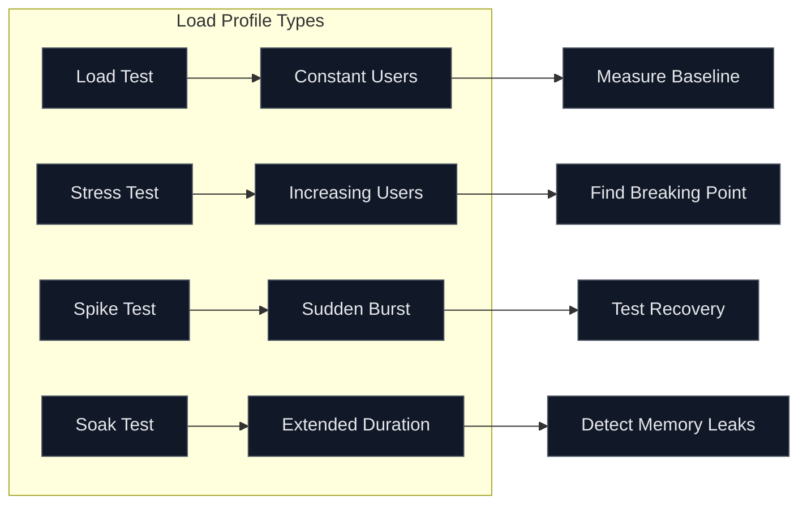
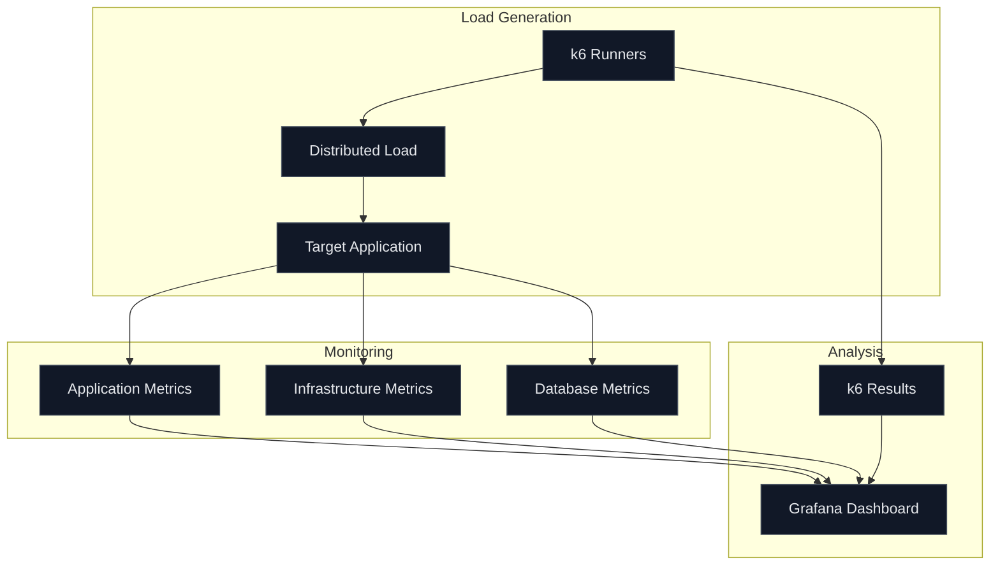

# How to Handle Performance Testing

Author: [nawazdhandala](https://www.github.com/nawazdhandala)

Tags: Performance Testing, Load Testing, Stress Testing, k6, Artillery, Monitoring, DevOps, Scalability

Description: A practical guide to implementing performance testing with tools like k6 and Artillery, including load testing patterns, metrics collection, and CI/CD integration.

---

Performance testing catches problems that functional tests miss entirely. Your application might pass every unit and integration test but still fall over when 1000 users hit it simultaneously. This guide covers practical approaches to performance testing that you can implement today.

## Types of Performance Tests

Before writing tests, understand what you're measuring:

- **Load Testing**: How does the system perform under expected load?
- **Stress Testing**: At what point does the system break?
- **Spike Testing**: How does the system handle sudden traffic bursts?
- **Soak Testing**: Does performance degrade over extended periods?
- **Scalability Testing**: How does adding resources affect performance?



## Setting Up k6

k6 is a modern load testing tool that uses JavaScript for test scripts:

```bash
# Install k6 on macOS
brew install k6

# Install on Ubuntu/Debian
sudo apt-get update
sudo apt-get install k6

# Or use Docker
docker run -i grafana/k6 run - <script.js
```

## Basic Load Test

Start with a simple load test script:

```javascript
// tests/performance/basic-load.js
import http from 'k6/http';
import { check, sleep } from 'k6';

// Test configuration
export const options = {
  // Simulate 50 users for 2 minutes
  vus: 50,           // Virtual users
  duration: '2m',    // Test duration

  // Define thresholds for pass/fail
  thresholds: {
    // 95% of requests must complete under 500ms
    http_req_duration: ['p(95)<500'],
    // Less than 1% of requests should fail
    http_req_failed: ['rate<0.01'],
  },
};

// Default function runs for each virtual user
export default function () {
  // Make HTTP request to your API
  const response = http.get('https://api.example.com/products');

  // Verify the response
  check(response, {
    'status is 200': (r) => r.status === 200,
    'response time OK': (r) => r.timings.duration < 500,
    'has products': (r) => JSON.parse(r.body).length > 0,
  });

  // Simulate user think time between requests
  sleep(1);
}
```

Run the test:

```bash
k6 run tests/performance/basic-load.js
```

## Ramping Load Test

Test how your system handles gradually increasing load:

```javascript
// tests/performance/ramp-up.js
import http from 'k6/http';
import { check, sleep } from 'k6';

export const options = {
  stages: [
    // Ramp up from 0 to 100 users over 2 minutes
    { duration: '2m', target: 100 },
    // Stay at 100 users for 5 minutes
    { duration: '5m', target: 100 },
    // Ramp up to 200 users over 2 minutes
    { duration: '2m', target: 200 },
    // Stay at 200 users for 5 minutes
    { duration: '5m', target: 200 },
    // Ramp down to 0 users over 2 minutes
    { duration: '2m', target: 0 },
  ],

  thresholds: {
    http_req_duration: ['p(95)<1000', 'p(99)<2000'],
    http_req_failed: ['rate<0.05'],
  },
};

export default function () {
  const response = http.get('https://api.example.com/products');

  check(response, {
    'status is 200': (r) => r.status === 200,
  });

  sleep(Math.random() * 3 + 1); // Random think time 1-4 seconds
}
```

## Testing User Flows

Real users don't just hit one endpoint. Test complete user journeys:

```javascript
// tests/performance/user-journey.js
import http from 'k6/http';
import { check, group, sleep } from 'k6';

export const options = {
  vus: 25,
  duration: '5m',
  thresholds: {
    'http_req_duration{name:login}': ['p(95)<1000'],
    'http_req_duration{name:browse}': ['p(95)<500'],
    'http_req_duration{name:checkout}': ['p(95)<2000'],
  },
};

const BASE_URL = 'https://api.example.com';

export default function () {
  let authToken;

  // Step 1: Login
  group('login', function () {
    const loginRes = http.post(
      `${BASE_URL}/auth/login`,
      JSON.stringify({
        email: 'loadtest@example.com',
        password: 'testpassword',
      }),
      {
        headers: { 'Content-Type': 'application/json' },
        tags: { name: 'login' },
      }
    );

    check(loginRes, {
      'login successful': (r) => r.status === 200,
      'has token': (r) => JSON.parse(r.body).token !== undefined,
    });

    authToken = JSON.parse(loginRes.body).token;
  });

  sleep(2);

  // Step 2: Browse products
  group('browse', function () {
    const headers = {
      Authorization: `Bearer ${authToken}`,
    };

    // View product list
    const listRes = http.get(`${BASE_URL}/products`, {
      headers,
      tags: { name: 'browse' },
    });

    check(listRes, {
      'products loaded': (r) => r.status === 200,
    });

    const products = JSON.parse(listRes.body);

    // View a random product detail
    if (products.length > 0) {
      const randomProduct = products[Math.floor(Math.random() * products.length)];
      const detailRes = http.get(`${BASE_URL}/products/${randomProduct.id}`, {
        headers,
        tags: { name: 'browse' },
      });

      check(detailRes, {
        'product detail loaded': (r) => r.status === 200,
      });
    }
  });

  sleep(3);

  // Step 3: Checkout (10% of users)
  if (Math.random() < 0.1) {
    group('checkout', function () {
      const checkoutRes = http.post(
        `${BASE_URL}/orders`,
        JSON.stringify({
          items: [{ productId: 1, quantity: 1 }],
        }),
        {
          headers: {
            'Content-Type': 'application/json',
            Authorization: `Bearer ${authToken}`,
          },
          tags: { name: 'checkout' },
        }
      );

      check(checkoutRes, {
        'order created': (r) => r.status === 201,
      });
    });
  }

  sleep(1);
}
```

## Stress Testing

Find your breaking point:

```javascript
// tests/performance/stress.js
import http from 'k6/http';
import { check, sleep } from 'k6';

export const options = {
  stages: [
    // Warm up
    { duration: '1m', target: 50 },
    // Push to normal load
    { duration: '2m', target: 100 },
    // Push beyond normal
    { duration: '2m', target: 200 },
    // Stress the system
    { duration: '2m', target: 300 },
    // Push to breaking point
    { duration: '2m', target: 400 },
    // Recovery
    { duration: '2m', target: 0 },
  ],

  // No thresholds - we want to observe, not fail
  thresholds: {
    http_req_duration: ['p(95)<5000'],  // Very lenient
    http_req_failed: ['rate<0.5'],       // Allow up to 50% failure to see where it breaks
  },
};

export default function () {
  const response = http.get('https://api.example.com/health');

  check(response, {
    'status is 200': (r) => r.status === 200,
  });

  sleep(0.5);
}
```

## Performance Test Architecture

A proper performance testing setup looks like this:



## Using Artillery for Load Testing

Artillery is another excellent option, especially for Node.js teams:

```yaml
# tests/performance/artillery/load-test.yml
config:
  target: "https://api.example.com"
  phases:
    - duration: 60
      arrivalRate: 5
      name: "Warm up"
    - duration: 120
      arrivalRate: 10
      rampTo: 50
      name: "Ramp up load"
    - duration: 300
      arrivalRate: 50
      name: "Sustained load"

  defaults:
    headers:
      Content-Type: "application/json"

  # Load test data from CSV
  payload:
    path: "users.csv"
    fields:
      - "email"
      - "password"

scenarios:
  - name: "User browsing flow"
    weight: 7
    flow:
      - post:
          url: "/auth/login"
          json:
            email: "{{ email }}"
            password: "{{ password }}"
          capture:
            - json: "$.token"
              as: "authToken"
      - get:
          url: "/products"
          headers:
            Authorization: "Bearer {{ authToken }}"
      - think: 3
      - get:
          url: "/products/{{ $randomNumber(1, 100) }}"
          headers:
            Authorization: "Bearer {{ authToken }}"

  - name: "User checkout flow"
    weight: 3
    flow:
      - post:
          url: "/auth/login"
          json:
            email: "{{ email }}"
            password: "{{ password }}"
          capture:
            - json: "$.token"
              as: "authToken"
      - post:
          url: "/cart/items"
          headers:
            Authorization: "Bearer {{ authToken }}"
          json:
            productId: "{{ $randomNumber(1, 100) }}"
            quantity: 1
      - think: 2
      - post:
          url: "/orders"
          headers:
            Authorization: "Bearer {{ authToken }}"
```

Run Artillery tests:

```bash
artillery run tests/performance/artillery/load-test.yml
```

## CI/CD Integration

Add performance tests to your pipeline:

```yaml
# .github/workflows/performance.yml
name: Performance Tests

on:
  schedule:
    - cron: '0 2 * * *'  # Run nightly at 2 AM
  workflow_dispatch:      # Allow manual trigger

jobs:
  load-test:
    runs-on: ubuntu-latest
    steps:
      - uses: actions/checkout@v4

      - name: Install k6
        run: |
          sudo gpg -k
          sudo gpg --no-default-keyring --keyring /usr/share/keyrings/k6-archive-keyring.gpg --keyserver hkp://keyserver.ubuntu.com:80 --recv-keys C5AD17C747E3415A3642D57D77C6C491D6AC1D69
          echo "deb [signed-by=/usr/share/keyrings/k6-archive-keyring.gpg] https://dl.k6.io/deb stable main" | sudo tee /etc/apt/sources.list.d/k6.list
          sudo apt-get update
          sudo apt-get install k6

      - name: Run load tests
        run: k6 run tests/performance/load-test.js --out json=results.json
        env:
          K6_CLOUD_TOKEN: ${{ secrets.K6_CLOUD_TOKEN }}

      - name: Upload results
        uses: actions/upload-artifact@v4
        with:
          name: k6-results
          path: results.json

      - name: Check thresholds
        run: |
          if grep -q '"thresholds":{".*":"fail"' results.json; then
            echo "Performance thresholds failed!"
            exit 1
          fi
```

## Key Metrics to Track

Monitor these metrics during performance tests:

| Metric | Description | Target |
|--------|-------------|--------|
| Response Time (p95) | 95th percentile response time | < 500ms for APIs |
| Response Time (p99) | 99th percentile response time | < 1000ms for APIs |
| Throughput | Requests per second | Based on expected load |
| Error Rate | Percentage of failed requests | < 1% |
| Concurrent Users | Active users at any time | Based on capacity |
| CPU Usage | Server CPU utilization | < 70% sustained |
| Memory Usage | Server memory utilization | < 80% sustained |
| Database Connections | Active DB connections | < pool limit |

## Best Practices

1. **Test in production-like environments** - Your staging should mirror production
2. **Start with baseline tests** - Know your current performance before optimizing
3. **Test regularly** - Performance regressions happen gradually
4. **Use realistic data volumes** - Empty databases perform differently than full ones
5. **Include think time** - Real users pause between actions
6. **Monitor everything** - Application, database, infrastructure
7. **Test your test environment** - Ensure your load generators aren't the bottleneck
8. **Document your test scenarios** - Others should understand what you're testing

## Common Mistakes

- Testing against production without coordination
- Using unrealistic request patterns
- Ignoring connection pooling limits
- Not warming up the system before measuring
- Running tests from the same network as the application
- Forgetting to reset test data between runs

Performance testing is not a one-time activity. Build it into your development process, run tests regularly, and treat performance regressions as bugs. The cost of finding performance issues in production is always higher than catching them during development.
