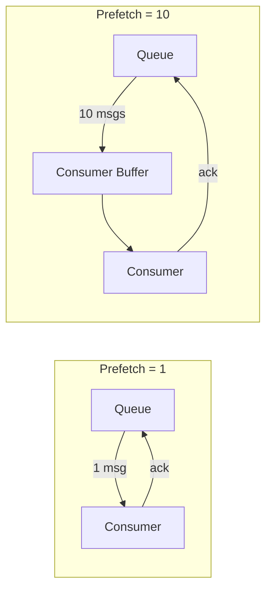
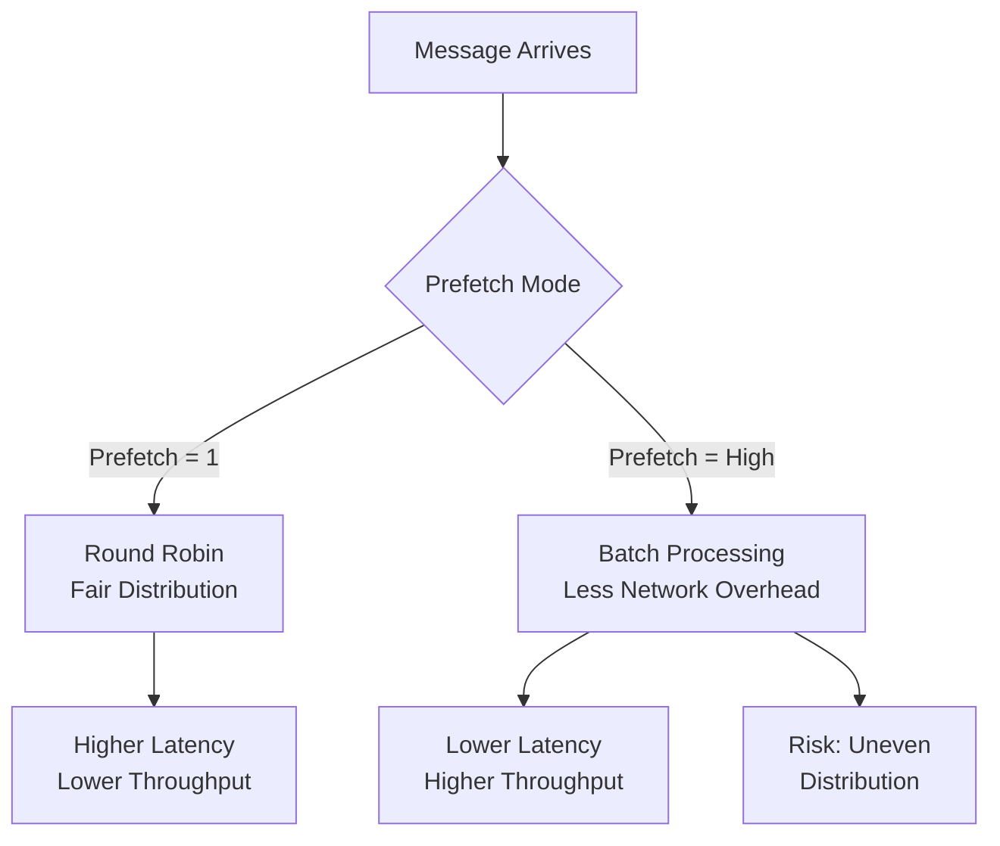
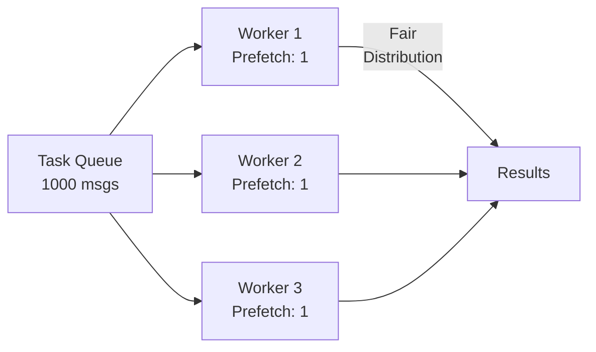

# How to Handle RabbitMQ Consumer Prefetch

Author: [nawazdhandala](https://www.github.com/nawazdhandala)

Tags: RabbitMQ, Message Queue, Performance, AMQP, Backend, Distributed Systems, Configuration

Description: Learn how to configure RabbitMQ consumer prefetch to optimize message distribution and prevent consumer overload.

---

> Consumer prefetch controls how many unacknowledged messages RabbitMQ delivers to a consumer at once. Proper prefetch configuration balances throughput and fairness, preventing fast consumers from starving slow ones while avoiding memory issues.

Prefetch is set using QoS (Quality of Service) and directly impacts your application's performance and reliability.

---

## Understanding Prefetch



---

## Basic Prefetch Configuration

### Setting Prefetch Count

```python
import pika

connection = pika.BlockingConnection(
    pika.ConnectionParameters('localhost')
)
channel = connection.channel()
channel.queue_declare(queue='tasks', durable=True)

# Set prefetch count to 1
# Consumer receives only 1 message at a time until it acknowledges
channel.basic_qos(prefetch_count=1)

def callback(ch, method, properties, body):
    print(f"Processing: {body.decode()}")
    # Simulate work
    time.sleep(1)
    # Acknowledge after processing
    ch.basic_ack(delivery_tag=method.delivery_tag)

channel.basic_consume(
    queue='tasks',
    on_message_callback=callback
)

print("Worker waiting for messages...")
channel.start_consuming()
```

### Prefetch Scope Options

```python
import pika

connection = pika.BlockingConnection(
    pika.ConnectionParameters('localhost')
)
channel = connection.channel()

# Per-consumer prefetch (default)
# Each consumer on this channel gets up to 10 unacknowledged messages
channel.basic_qos(prefetch_count=10, global_qos=False)

# Per-channel prefetch
# Total of 10 unacknowledged messages across all consumers on this channel
channel.basic_qos(prefetch_count=10, global_qos=True)
```

---

## Prefetch Impact on Performance



### Benchmarking Different Prefetch Values

```python
import pika
import time
import statistics

def benchmark_prefetch(prefetch_count, message_count=1000):
    """
    Benchmark message processing with different prefetch values.
    Returns throughput in messages per second.
    """
    connection = pika.BlockingConnection(
        pika.ConnectionParameters('localhost')
    )
    channel = connection.channel()
    channel.queue_declare(queue='benchmark_queue', durable=True)

    # Set prefetch
    channel.basic_qos(prefetch_count=prefetch_count)

    processed = 0
    start_time = None
    processing_times = []

    def callback(ch, method, properties, body):
        nonlocal processed, start_time

        if start_time is None:
            start_time = time.time()

        msg_start = time.time()

        # Simulate varying processing times
        time.sleep(0.001)  # 1ms processing

        processing_times.append(time.time() - msg_start)
        processed += 1
        ch.basic_ack(delivery_tag=method.delivery_tag)

        if processed >= message_count:
            ch.stop_consuming()

    channel.basic_consume(
        queue='benchmark_queue',
        on_message_callback=callback
    )

    channel.start_consuming()

    total_time = time.time() - start_time
    throughput = processed / total_time
    avg_latency = statistics.mean(processing_times) * 1000  # Convert to ms

    connection.close()

    return {
        'prefetch': prefetch_count,
        'throughput': round(throughput, 2),
        'avg_latency_ms': round(avg_latency, 3),
        'total_time': round(total_time, 2)
    }

# Test different prefetch values
for prefetch in [1, 10, 50, 100, 250]:
    result = benchmark_prefetch(prefetch)
    print(f"Prefetch {result['prefetch']}: "
          f"{result['throughput']} msg/s, "
          f"{result['avg_latency_ms']}ms latency")
```

---

## Choosing the Right Prefetch Value

### Low Prefetch (1-10)

Best for:
- Long-running tasks
- Fair work distribution
- Memory-constrained consumers

```python
import pika
import time

def setup_fair_worker():
    """
    Worker for long-running tasks with fair distribution.
    Prefetch of 1 ensures tasks are evenly distributed.
    """
    connection = pika.BlockingConnection(
        pika.ConnectionParameters('localhost')
    )
    channel = connection.channel()
    channel.queue_declare(queue='heavy_tasks', durable=True)

    # Prefetch 1: Only get next message after current one is done
    # Prevents a fast worker from grabbing all tasks
    channel.basic_qos(prefetch_count=1)

    def process_heavy_task(ch, method, properties, body):
        task = body.decode()
        print(f"Starting heavy task: {task}")

        # Simulate long-running work (30 seconds to 2 minutes)
        processing_time = random.randint(30, 120)
        time.sleep(processing_time)

        print(f"Completed: {task} in {processing_time}s")
        ch.basic_ack(delivery_tag=method.delivery_tag)

    channel.basic_consume(
        queue='heavy_tasks',
        on_message_callback=process_heavy_task
    )

    print("Heavy task worker ready (prefetch=1)")
    channel.start_consuming()
```

### Medium Prefetch (10-100)

Best for:
- Moderate processing times
- Balanced throughput and fairness

```python
import pika
import time

def setup_balanced_worker():
    """
    Worker for tasks with moderate processing time.
    Prefetch of 25 balances throughput with fair distribution.
    """
    connection = pika.BlockingConnection(
        pika.ConnectionParameters('localhost')
    )
    channel = connection.channel()
    channel.queue_declare(queue='moderate_tasks', durable=True)

    # Prefetch 25: Good balance for tasks taking 100ms-1s
    channel.basic_qos(prefetch_count=25)

    def process_task(ch, method, properties, body):
        # Moderate processing time
        time.sleep(0.5)
        ch.basic_ack(delivery_tag=method.delivery_tag)

    channel.basic_consume(
        queue='moderate_tasks',
        on_message_callback=process_task
    )

    print("Balanced worker ready (prefetch=25)")
    channel.start_consuming()
```

### High Prefetch (100-1000)

Best for:
- Fast, lightweight tasks
- Maximum throughput
- Single consumer scenarios

```python
import pika

def setup_high_throughput_worker():
    """
    Worker for fast, lightweight tasks.
    High prefetch maximizes throughput by reducing network round trips.
    """
    connection = pika.BlockingConnection(
        pika.ConnectionParameters('localhost')
    )
    channel = connection.channel()
    channel.queue_declare(queue='fast_tasks', durable=True)

    # High prefetch for fast processing
    # Reduces network overhead by batching message delivery
    channel.basic_qos(prefetch_count=250)

    batch = []
    batch_size = 100

    def process_fast_task(ch, method, properties, body):
        nonlocal batch

        batch.append((method.delivery_tag, body))

        # Process in batches for efficiency
        if len(batch) >= batch_size:
            # Batch process
            for tag, msg in batch:
                # Fast processing (< 1ms)
                pass

            # Acknowledge all at once
            ch.basic_ack(delivery_tag=batch[-1][0], multiple=True)
            batch = []

    channel.basic_consume(
        queue='fast_tasks',
        on_message_callback=process_fast_task
    )

    print("High throughput worker ready (prefetch=250)")
    channel.start_consuming()
```

---

## Dynamic Prefetch Adjustment

Adjust prefetch based on processing time and queue depth:

```python
import pika
import time
import threading

class AdaptivePrefetchConsumer:
    """
    Consumer that adjusts prefetch based on processing performance.
    Automatically tunes for optimal throughput.
    """

    def __init__(self, host='localhost', queue='tasks'):
        self.host = host
        self.queue = queue
        self.connection = None
        self.channel = None

        # Prefetch settings
        self.min_prefetch = 1
        self.max_prefetch = 500
        self.current_prefetch = 10

        # Performance tracking
        self.processing_times = []
        self.adjustment_interval = 30  # seconds

    def connect(self):
        """Establish connection and set initial prefetch."""
        self.connection = pika.BlockingConnection(
            pika.ConnectionParameters(self.host)
        )
        self.channel = self.connection.channel()
        self.channel.queue_declare(queue=self.queue, durable=True)
        self.channel.basic_qos(prefetch_count=self.current_prefetch)

    def adjust_prefetch(self):
        """
        Adjust prefetch based on average processing time.
        Faster processing = higher prefetch for better throughput.
        """
        if not self.processing_times:
            return

        avg_time = sum(self.processing_times) / len(self.processing_times)
        self.processing_times = []  # Reset for next interval

        # Calculate optimal prefetch based on processing time
        # Target: Keep consumer busy for ~1 second of work
        target_buffer_seconds = 1.0

        if avg_time > 0:
            optimal_prefetch = int(target_buffer_seconds / avg_time)
        else:
            optimal_prefetch = self.max_prefetch

        # Apply bounds
        new_prefetch = max(
            self.min_prefetch,
            min(optimal_prefetch, self.max_prefetch)
        )

        if new_prefetch != self.current_prefetch:
            print(f"Adjusting prefetch: {self.current_prefetch} -> {new_prefetch} "
                  f"(avg processing: {avg_time*1000:.1f}ms)")
            self.current_prefetch = new_prefetch
            self.channel.basic_qos(prefetch_count=self.current_prefetch)

    def start_adjustment_thread(self):
        """Start background thread for periodic prefetch adjustment."""
        def adjust_loop():
            while True:
                time.sleep(self.adjustment_interval)
                try:
                    self.adjust_prefetch()
                except Exception as e:
                    print(f"Adjustment error: {e}")

        thread = threading.Thread(target=adjust_loop, daemon=True)
        thread.start()

    def process_message(self, ch, method, properties, body):
        """Process message and track timing."""
        start = time.time()

        # Your processing logic here
        self.do_work(body)

        duration = time.time() - start
        self.processing_times.append(duration)

        ch.basic_ack(delivery_tag=method.delivery_tag)

    def do_work(self, body):
        """Override this method with actual processing logic."""
        time.sleep(0.1)  # Placeholder

    def run(self):
        """Start consuming with adaptive prefetch."""
        self.connect()
        self.start_adjustment_thread()

        self.channel.basic_consume(
            queue=self.queue,
            on_message_callback=self.process_message
        )

        print(f"Consumer started with adaptive prefetch "
              f"(initial: {self.current_prefetch})")
        self.channel.start_consuming()

# Usage
consumer = AdaptivePrefetchConsumer(queue='adaptive_queue')
consumer.run()
```

---

## Prefetch Patterns for Common Use Cases

### Pattern 1: Work Queue with Multiple Workers



```python
import pika
import os

def create_fair_worker(worker_id):
    """
    Create a worker that fairly shares load with other workers.
    Uses prefetch=1 for round-robin distribution.
    """
    connection = pika.BlockingConnection(
        pika.ConnectionParameters('localhost')
    )
    channel = connection.channel()
    channel.queue_declare(queue='work_queue', durable=True)

    # Prefetch 1 ensures fair distribution across workers
    # Each worker gets one task at a time
    channel.basic_qos(prefetch_count=1)

    def callback(ch, method, properties, body):
        task = body.decode()
        print(f"Worker {worker_id}: Processing {task}")

        # Variable processing time
        import random
        time.sleep(random.uniform(0.5, 2.0))

        print(f"Worker {worker_id}: Completed {task}")
        ch.basic_ack(delivery_tag=method.delivery_tag)

    channel.basic_consume(
        queue='work_queue',
        on_message_callback=callback
    )

    print(f"Worker {worker_id} ready")
    channel.start_consuming()
```

### Pattern 2: Batch Consumer

```python
import pika
import time

class BatchConsumer:
    """
    Consumer that processes messages in batches for efficiency.
    Uses high prefetch to accumulate messages before processing.
    """

    def __init__(self, batch_size=100, batch_timeout=5.0):
        self.batch_size = batch_size
        self.batch_timeout = batch_timeout
        self.batch = []
        self.batch_start = None

    def connect(self):
        self.connection = pika.BlockingConnection(
            pika.ConnectionParameters('localhost')
        )
        self.channel = self.connection.channel()
        self.channel.queue_declare(queue='batch_queue', durable=True)

        # High prefetch to accumulate batch
        self.channel.basic_qos(prefetch_count=self.batch_size * 2)

    def process_batch(self):
        """Process accumulated batch of messages."""
        if not self.batch:
            return

        print(f"Processing batch of {len(self.batch)} messages")

        # Batch processing logic
        # Example: Bulk database insert
        messages = [msg for _, msg in self.batch]
        self.bulk_insert(messages)

        # Acknowledge all messages in batch
        last_tag = self.batch[-1][0]
        self.channel.basic_ack(delivery_tag=last_tag, multiple=True)

        self.batch = []
        self.batch_start = None

    def bulk_insert(self, messages):
        """Override with actual bulk processing logic."""
        # Simulated bulk insert
        time.sleep(0.1)
        print(f"Inserted {len(messages)} records")

    def callback(self, ch, method, properties, body):
        """Accumulate messages into batch."""
        if self.batch_start is None:
            self.batch_start = time.time()

        self.batch.append((method.delivery_tag, body.decode()))

        # Process when batch is full or timeout reached
        batch_age = time.time() - self.batch_start
        if len(self.batch) >= self.batch_size or batch_age >= self.batch_timeout:
            self.process_batch()

    def run(self):
        """Start batch consumer."""
        self.connect()

        self.channel.basic_consume(
            queue='batch_queue',
            on_message_callback=self.callback
        )

        print(f"Batch consumer ready (batch_size={self.batch_size})")
        self.channel.start_consuming()

# Usage
consumer = BatchConsumer(batch_size=100, batch_timeout=5.0)
consumer.run()
```

### Pattern 3: Priority-Based Prefetch

```python
import pika

def create_priority_consumer(priority_level):
    """
    Create consumers with different prefetch based on priority.
    High priority queues get lower prefetch for faster response.
    """
    connection = pika.BlockingConnection(
        pika.ConnectionParameters('localhost')
    )
    channel = connection.channel()

    # Configure prefetch based on priority
    prefetch_config = {
        'high': 1,      # Process high priority immediately
        'medium': 10,   # Small buffer for medium priority
        'low': 100      # Large buffer for low priority batch processing
    }

    prefetch = prefetch_config.get(priority_level, 10)
    channel.basic_qos(prefetch_count=prefetch)

    queue_name = f'{priority_level}_priority_queue'
    channel.queue_declare(queue=queue_name, durable=True)

    def callback(ch, method, properties, body):
        print(f"[{priority_level.upper()}] Processing: {body.decode()}")
        # Processing logic
        ch.basic_ack(delivery_tag=method.delivery_tag)

    channel.basic_consume(
        queue=queue_name,
        on_message_callback=callback
    )

    print(f"{priority_level.capitalize()} priority consumer ready "
          f"(prefetch={prefetch})")
    channel.start_consuming()
```

---

## Monitoring Prefetch Effectiveness

```bash
# Check unacknowledged message count per consumer
rabbitmqctl list_consumers queue_name consumer_tag prefetch_count

# Check channel details including prefetch
rabbitmqctl list_channels name prefetch_count unacked_message_count

# Via Management API
curl -u guest:guest \
    http://localhost:15672/api/channels | \
    jq '.[] | {name: .name, prefetch: .prefetch_count, unacked: .messages_unacknowledged}'
```

### Prometheus Metrics

```promql
# Unacknowledged messages (should be close to prefetch * consumers)
rabbitmq_channel_messages_unacknowledged

# Consumer utilization (higher is better)
rate(rabbitmq_channel_messages_delivered_total[5m]) /
rate(rabbitmq_channel_messages_published_total[5m])

# Queue message ready (should stay low with proper prefetch)
rabbitmq_queue_messages_ready
```

---

## Common Pitfalls

### 1. Prefetch Too High Causes Memory Issues

```python
# WRONG: Unlimited prefetch with large messages
channel.basic_qos(prefetch_count=0)  # 0 = unlimited!

# Large messages can overwhelm consumer memory
# 10,000 messages * 1MB = 10GB memory usage

# CORRECT: Limit based on message size and available memory
# For 1MB messages with 1GB available: prefetch = 500 max
channel.basic_qos(prefetch_count=500)
```

### 2. Prefetch Too Low Kills Throughput

```python
# WRONG: Prefetch 1 for fast, lightweight tasks
channel.basic_qos(prefetch_count=1)

# Network round-trip per message dominates processing time
# Example: 1ms processing + 5ms network = 166 msg/s max

# CORRECT: Higher prefetch for fast tasks
channel.basic_qos(prefetch_count=100)
# 100ms of work buffered, amortizes network overhead
# Throughput: ~1000 msg/s
```

### 3. Global vs Per-Consumer Prefetch Confusion

```python
# global_qos=False (default): per-consumer limit
# Each consumer can have up to N unacked messages
channel.basic_qos(prefetch_count=10, global_qos=False)

# global_qos=True: per-channel limit
# Total of N unacked messages across ALL consumers on this channel
channel.basic_qos(prefetch_count=10, global_qos=True)

# With 5 consumers on the channel:
# global_qos=False: Each consumer gets up to 10 = 50 total possible
# global_qos=True: All consumers share 10 = 10 total max
```

---

## Best Practices

1. **Start with prefetch=1** for new queues and increase based on metrics
2. **Monitor unacknowledged counts** to verify prefetch is being used
3. **Consider message size** when setting prefetch limits
4. **Use per-consumer prefetch** unless you need global limiting
5. **Implement adaptive prefetch** for variable workloads
6. **Test under load** to find optimal prefetch for your use case

---

## Conclusion

Consumer prefetch is crucial for RabbitMQ performance tuning. Key takeaways:

- **Low prefetch (1-10)** ensures fair distribution for slow tasks
- **High prefetch (100+)** maximizes throughput for fast tasks
- **Monitor unacknowledged messages** to verify prefetch effectiveness
- **Adjust dynamically** based on processing times and queue depth
- **Consider memory impact** when setting high prefetch values

---

*Need to monitor your RabbitMQ consumer performance? [OneUptime](https://oneuptime.com) provides comprehensive monitoring for message queue systems with alerting on consumer lag and queue depth.*
