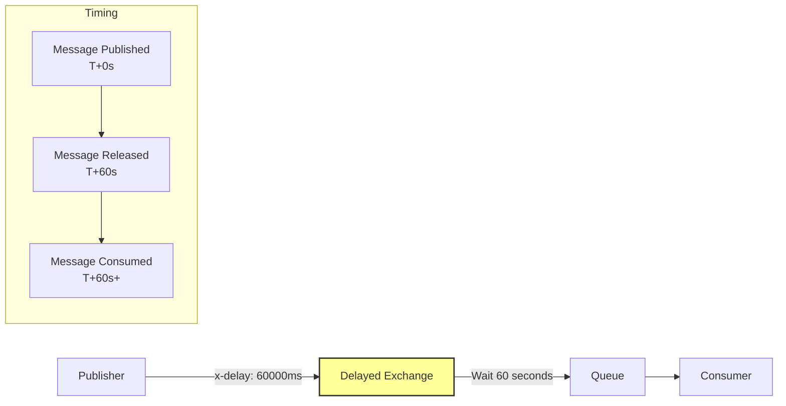
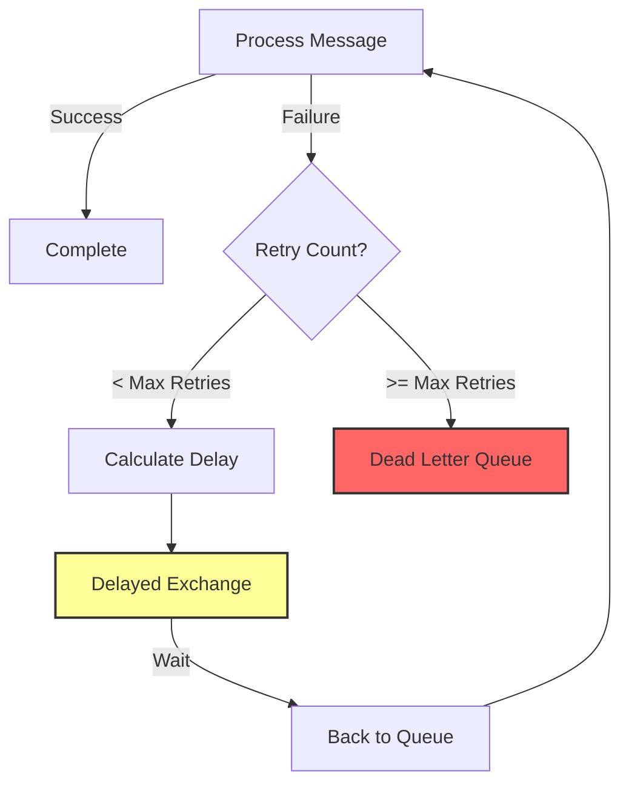
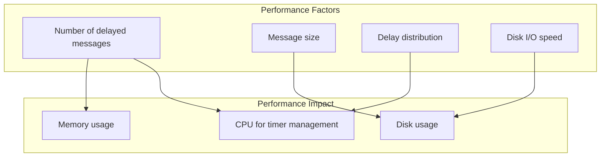

# How to Handle RabbitMQ Delayed Message Plugin

Author: [nawazdhandala](https://www.github.com/nawazdhandala)

Tags: RabbitMQ, Message Queue, Delayed Messages, Scheduling, DevOps, Messaging, Plugins

Description: Learn how to install, configure, and use the RabbitMQ Delayed Message Plugin to schedule messages for future delivery with practical examples and best practices.

---

> The RabbitMQ Delayed Message Plugin allows you to schedule messages for future delivery, enabling use cases like scheduled notifications, retry mechanisms, and time-based workflows.

Native RabbitMQ does not support delayed message delivery. The community plugin `rabbitmq_delayed_message_exchange` adds this capability by introducing a new exchange type that holds messages until their scheduled delivery time.

---

## Understanding Delayed Messages

### How It Works



### Use Cases

- **Scheduled notifications** - Send reminders at specific times
- **Retry with backoff** - Retry failed operations after delay
- **Time-based workflows** - Trigger actions at scheduled times
- **Rate limiting** - Spread out message processing
- **Deferred processing** - Process orders after a cooling-off period

---

## Installation

### Installing the Plugin

```bash
# Check current plugins
rabbitmq-plugins list

# Enable the delayed message plugin
rabbitmq-plugins enable rabbitmq_delayed_message_exchange

# Verify installation
rabbitmq-plugins list | grep delayed
# Should show: [E*] rabbitmq_delayed_message_exchange

# Restart RabbitMQ if needed (usually not required)
systemctl restart rabbitmq-server
```

### Docker Installation

```dockerfile
# Dockerfile for RabbitMQ with delayed message plugin
FROM rabbitmq:3.13-management

# Enable the delayed message exchange plugin
RUN rabbitmq-plugins enable --offline rabbitmq_delayed_message_exchange
```

```yaml
# docker-compose.yml
version: '3.8'
services:
  rabbitmq:
    build:
      context: .
      dockerfile: Dockerfile
    ports:
      - "5672:5672"
      - "15672:15672"
    environment:
      RABBITMQ_DEFAULT_USER: guest
      RABBITMQ_DEFAULT_PASS: guest
    volumes:
      - rabbitmq_data:/var/lib/rabbitmq

volumes:
  rabbitmq_data:
```

### Kubernetes Installation

```yaml
# rabbitmq-configmap.yaml
apiVersion: v1
kind: ConfigMap
metadata:
  name: rabbitmq-config
data:
  enabled_plugins: |
    [rabbitmq_management,rabbitmq_delayed_message_exchange].
```

---

## Basic Usage

### Creating a Delayed Exchange

```python
import pika

connection = pika.BlockingConnection(pika.ConnectionParameters('localhost'))
channel = connection.channel()

# Declare the delayed exchange
# The x-delayed-type specifies the underlying exchange type
channel.exchange_declare(
    exchange='delayed-exchange',
    exchange_type='x-delayed-message',  # Special type for delayed messages
    durable=True,
    arguments={
        'x-delayed-type': 'direct'  # Underlying routing behavior
    }
)

# Create and bind queue
channel.queue_declare(queue='delayed-queue', durable=True)
channel.queue_bind(
    queue='delayed-queue',
    exchange='delayed-exchange',
    routing_key='delayed'
)

print("Delayed exchange and queue created")
connection.close()
```

### Publishing Delayed Messages

```python
import pika
import time

def publish_delayed_message(message, delay_ms, routing_key='delayed'):
    """
    Publish a message with a specified delay.

    Args:
        message: The message body to send
        delay_ms: Delay in milliseconds before delivery
        routing_key: Routing key for the message
    """
    connection = pika.BlockingConnection(pika.ConnectionParameters('localhost'))
    channel = connection.channel()

    # Set the x-delay header to specify delay duration
    properties = pika.BasicProperties(
        delivery_mode=2,  # Persistent message
        headers={
            'x-delay': delay_ms  # Delay in milliseconds
        }
    )

    channel.basic_publish(
        exchange='delayed-exchange',
        routing_key=routing_key,
        body=message,
        properties=properties
    )

    print(f"Published message with {delay_ms}ms delay: {message}")
    connection.close()

# Example: Send a message to be delivered in 30 seconds
publish_delayed_message("Hello in 30 seconds!", 30000)

# Example: Send a message to be delivered in 5 minutes
publish_delayed_message("Hello in 5 minutes!", 300000)

# Example: Send a message to be delivered in 1 hour
publish_delayed_message("Hello in 1 hour!", 3600000)
```

### Consuming Delayed Messages

```python
import pika

def consume_delayed_messages():
    """
    Consume messages from the delayed queue.
    Messages arrive after their specified delay.
    """
    connection = pika.BlockingConnection(pika.ConnectionParameters('localhost'))
    channel = connection.channel()

    def callback(ch, method, properties, body):
        # Check original delay from headers
        original_delay = properties.headers.get('x-delay', 0) if properties.headers else 0

        print(f"Received message (was delayed {original_delay}ms): {body.decode()}")

        # Process the message
        process_delayed_message(body)

        # Acknowledge
        ch.basic_ack(delivery_tag=method.delivery_tag)

    def process_delayed_message(body):
        """Process the delayed message."""
        print(f"Processing: {body.decode()}")

    # Set prefetch to control concurrent processing
    channel.basic_qos(prefetch_count=10)

    channel.basic_consume(
        queue='delayed-queue',
        on_message_callback=callback
    )

    print("Waiting for delayed messages...")
    channel.start_consuming()

consume_delayed_messages()
```

---

## Advanced Patterns

### Scheduled Task System

```python
import pika
import json
from datetime import datetime, timedelta

class ScheduledTaskPublisher:
    """
    A system for scheduling tasks to run at specific times.
    """

    def __init__(self, host='localhost'):
        self.connection = pika.BlockingConnection(
            pika.ConnectionParameters(host)
        )
        self.channel = self.connection.channel()
        self._setup_exchange()

    def _setup_exchange(self):
        """Set up the delayed exchange for scheduled tasks."""
        self.channel.exchange_declare(
            exchange='scheduled-tasks',
            exchange_type='x-delayed-message',
            durable=True,
            arguments={'x-delayed-type': 'topic'}
        )

        # Create queues for different task types
        task_types = ['email', 'notification', 'report', 'cleanup']

        for task_type in task_types:
            queue_name = f'tasks.{task_type}'
            self.channel.queue_declare(queue=queue_name, durable=True)
            self.channel.queue_bind(
                queue=queue_name,
                exchange='scheduled-tasks',
                routing_key=f'task.{task_type}'
            )

    def schedule_task(self, task_type, task_data, run_at=None, delay_seconds=None):
        """
        Schedule a task to run at a specific time or after a delay.

        Args:
            task_type: Type of task (email, notification, etc.)
            task_data: Dictionary containing task parameters
            run_at: datetime when the task should run
            delay_seconds: Alternative - delay in seconds from now
        """
        # Calculate delay
        if run_at:
            delay_ms = int((run_at - datetime.utcnow()).total_seconds() * 1000)
        elif delay_seconds:
            delay_ms = delay_seconds * 1000
        else:
            delay_ms = 0

        # Ensure delay is not negative
        delay_ms = max(0, delay_ms)

        # Build message
        message = {
            'task_type': task_type,
            'data': task_data,
            'scheduled_at': datetime.utcnow().isoformat(),
            'run_at': (datetime.utcnow() + timedelta(milliseconds=delay_ms)).isoformat()
        }

        properties = pika.BasicProperties(
            delivery_mode=2,
            content_type='application/json',
            headers={'x-delay': delay_ms}
        )

        self.channel.basic_publish(
            exchange='scheduled-tasks',
            routing_key=f'task.{task_type}',
            body=json.dumps(message),
            properties=properties
        )

        print(f"Scheduled {task_type} task for {message['run_at']}")
        return message

    def close(self):
        self.connection.close()

# Usage examples
publisher = ScheduledTaskPublisher()

# Schedule an email to be sent in 1 hour
publisher.schedule_task(
    'email',
    {
        'to': 'user@example.com',
        'subject': 'Reminder',
        'body': 'This is your scheduled reminder!'
    },
    delay_seconds=3600
)

# Schedule a report to run at a specific time
run_time = datetime.utcnow() + timedelta(hours=24)
publisher.schedule_task(
    'report',
    {
        'report_type': 'daily_summary',
        'recipient': 'admin@example.com'
    },
    run_at=run_time
)

publisher.close()
```

### Retry with Exponential Backoff



```python
import pika
import json
import math

class RetryHandler:
    """
    Handle message retries with exponential backoff using delayed messages.
    """

    MAX_RETRIES = 5
    BASE_DELAY_MS = 1000  # 1 second

    def __init__(self, host='localhost'):
        self.connection = pika.BlockingConnection(
            pika.ConnectionParameters(host)
        )
        self.channel = self.connection.channel()
        self._setup_infrastructure()

    def _setup_infrastructure(self):
        """Set up exchanges and queues for retry handling."""
        # Main processing queue
        self.channel.queue_declare(queue='process-queue', durable=True)

        # Delayed exchange for retries
        self.channel.exchange_declare(
            exchange='retry-exchange',
            exchange_type='x-delayed-message',
            durable=True,
            arguments={'x-delayed-type': 'direct'}
        )

        # Bind retry exchange to processing queue
        self.channel.queue_bind(
            queue='process-queue',
            exchange='retry-exchange',
            routing_key='retry'
        )

        # Dead letter queue for permanent failures
        self.channel.queue_declare(queue='dead-letter-queue', durable=True)

    def calculate_delay(self, retry_count):
        """
        Calculate exponential backoff delay.
        Delay = BASE_DELAY * 2^retry_count
        """
        delay_ms = self.BASE_DELAY_MS * math.pow(2, retry_count)
        # Cap at 5 minutes
        return min(int(delay_ms), 300000)

    def schedule_retry(self, message_body, retry_count):
        """Schedule a message for retry with backoff."""
        if retry_count >= self.MAX_RETRIES:
            # Send to dead letter queue
            self.send_to_dlq(message_body, retry_count)
            return False

        delay_ms = self.calculate_delay(retry_count)

        # Parse original message and add retry metadata
        try:
            message = json.loads(message_body)
        except json.JSONDecodeError:
            message = {'original_body': message_body.decode()}

        message['_retry_count'] = retry_count + 1
        message['_retry_delay_ms'] = delay_ms

        properties = pika.BasicProperties(
            delivery_mode=2,
            content_type='application/json',
            headers={'x-delay': delay_ms}
        )

        self.channel.basic_publish(
            exchange='retry-exchange',
            routing_key='retry',
            body=json.dumps(message),
            properties=properties
        )

        print(f"Scheduled retry {retry_count + 1} with {delay_ms}ms delay")
        return True

    def send_to_dlq(self, message_body, retry_count):
        """Send permanently failed message to dead letter queue."""
        try:
            message = json.loads(message_body)
        except json.JSONDecodeError:
            message = {'original_body': message_body.decode()}

        message['_final_retry_count'] = retry_count
        message['_failure_reason'] = 'max_retries_exceeded'

        self.channel.basic_publish(
            exchange='',
            routing_key='dead-letter-queue',
            body=json.dumps(message),
            properties=pika.BasicProperties(delivery_mode=2)
        )

        print(f"Message sent to DLQ after {retry_count} retries")

    def process_message(self, body):
        """
        Example processing function.
        Returns True on success, False on failure.
        """
        # Simulate processing that might fail
        import random
        return random.random() > 0.7  # 30% success rate for demo

    def start_consumer(self):
        """Start consuming and processing messages."""

        def callback(ch, method, properties, body):
            # Get retry count from message
            try:
                message = json.loads(body)
                retry_count = message.get('_retry_count', 0)
            except json.JSONDecodeError:
                retry_count = 0

            print(f"Processing message (attempt {retry_count + 1})")

            if self.process_message(body):
                print("Message processed successfully")
                ch.basic_ack(delivery_tag=method.delivery_tag)
            else:
                print("Processing failed, scheduling retry")
                ch.basic_ack(delivery_tag=method.delivery_tag)
                self.schedule_retry(body, retry_count)

        self.channel.basic_qos(prefetch_count=1)
        self.channel.basic_consume(
            queue='process-queue',
            on_message_callback=callback
        )

        print("Starting consumer with retry handling...")
        self.channel.start_consuming()

# Run the retry handler
handler = RetryHandler()
handler.start_consumer()
```

---

## Topic-Based Delayed Routing

```python
import pika

def setup_topic_delayed_exchange():
    """
    Set up a delayed exchange with topic routing
    for flexible message scheduling.
    """
    connection = pika.BlockingConnection(pika.ConnectionParameters('localhost'))
    channel = connection.channel()

    # Create delayed exchange with topic routing
    channel.exchange_declare(
        exchange='events.delayed',
        exchange_type='x-delayed-message',
        durable=True,
        arguments={'x-delayed-type': 'topic'}
    )

    # Create queues for different event categories
    queues = {
        'events.user.#': 'user-events-queue',      # All user events
        'events.order.#': 'order-events-queue',    # All order events
        'events.*.critical': 'critical-queue',     # All critical events
    }

    for pattern, queue_name in queues.items():
        channel.queue_declare(queue=queue_name, durable=True)
        channel.queue_bind(
            queue=queue_name,
            exchange='events.delayed',
            routing_key=pattern
        )
        print(f"Bound {queue_name} to pattern: {pattern}")

    connection.close()

def publish_delayed_event(event_type, data, delay_ms):
    """
    Publish a delayed event with topic routing.

    Args:
        event_type: Routing key like 'events.user.created'
        data: Event data dictionary
        delay_ms: Delay before delivery
    """
    connection = pika.BlockingConnection(pika.ConnectionParameters('localhost'))
    channel = connection.channel()

    import json

    message = {
        'type': event_type,
        'data': data,
        'scheduled_delay_ms': delay_ms
    }

    channel.basic_publish(
        exchange='events.delayed',
        routing_key=event_type,
        body=json.dumps(message),
        properties=pika.BasicProperties(
            delivery_mode=2,
            content_type='application/json',
            headers={'x-delay': delay_ms}
        )
    )

    print(f"Published {event_type} with {delay_ms}ms delay")
    connection.close()

# Setup
setup_topic_delayed_exchange()

# Publish various delayed events
publish_delayed_event('events.user.welcome', {'user_id': '123'}, 60000)  # 1 min
publish_delayed_event('events.order.reminder', {'order_id': '456'}, 3600000)  # 1 hour
publish_delayed_event('events.system.critical', {'alert': 'test'}, 5000)  # 5 sec
```

---

## Monitoring Delayed Messages

### Checking Delayed Message Count

```python
import requests

def get_delayed_exchange_stats(exchange_name, host='localhost', port=15672):
    """
    Get statistics about a delayed exchange.
    Note: Delayed messages are stored differently than regular messages.
    """
    url = f'http://{host}:{port}/api/exchanges/%2F/{exchange_name}'
    response = requests.get(url, auth=('guest', 'guest'))
    data = response.json()

    print(f"Exchange: {data['name']}")
    print(f"Type: {data['type']}")
    print(f"Durable: {data['durable']}")

    # Message stats
    if 'message_stats' in data:
        stats = data['message_stats']
        print(f"Publish in: {stats.get('publish_in', 0)}")
        print(f"Publish out: {stats.get('publish_out', 0)}")

    return data

# Check delayed exchange stats
get_delayed_exchange_stats('delayed-exchange')
```

### Prometheus Metrics

```yaml
# Alert on delayed message backlog
groups:
  - name: rabbitmq_delayed
    rules:
      - alert: HighDelayedMessageCount
        expr: rabbitmq_queue_messages{queue="delayed-queue"} > 10000
        for: 5m
        labels:
          severity: warning
        annotations:
          summary: "High number of delayed messages pending"
```

---

## Limitations and Considerations

### Maximum Delay

The plugin stores delays using a 32-bit integer, limiting the maximum delay:

```python
# Maximum delay is approximately 49 days
MAX_DELAY_MS = 2**32 - 1  # 4294967295 ms = ~49.7 days

# For longer delays, use a different approach
def schedule_long_delay(message, delay_days):
    """
    For delays longer than 49 days, use a database scheduler
    or break into multiple shorter delays.
    """
    if delay_days > 49:
        # Store in database with scheduled time
        # Use a separate scheduler to publish when ready
        store_scheduled_message(message, delay_days)
    else:
        delay_ms = delay_days * 24 * 60 * 60 * 1000
        publish_delayed_message(message, delay_ms)
```

### Performance Considerations



### Best Practices

```python
# 1. Use reasonable delays - avoid very long delays
MAX_RECOMMENDED_DELAY_MS = 24 * 60 * 60 * 1000  # 24 hours

# 2. Set message TTL as backup
channel.queue_declare(
    queue='delayed-queue',
    durable=True,
    arguments={
        'x-message-ttl': 86400000  # 24 hour TTL
    }
)

# 3. Monitor delayed message counts
# High counts may indicate processing issues

# 4. Use persistent messages for important delayed tasks
properties = pika.BasicProperties(
    delivery_mode=2,  # Persistent
    headers={'x-delay': delay_ms}
)

# 5. Handle plugin unavailability gracefully
def publish_with_fallback(message, delay_ms):
    """Publish with fallback if delayed plugin unavailable."""
    try:
        # Try delayed exchange
        channel.basic_publish(
            exchange='delayed-exchange',
            routing_key='delayed',
            body=message,
            properties=pika.BasicProperties(
                headers={'x-delay': delay_ms}
            )
        )
    except Exception as e:
        # Fallback to immediate delivery
        print(f"Delayed exchange unavailable: {e}")
        channel.basic_publish(
            exchange='',
            routing_key='immediate-queue',
            body=message
        )
```

---

## Conclusion

The RabbitMQ Delayed Message Plugin enables powerful scheduling capabilities:

- **Install the plugin** before using delayed exchanges
- **Use x-delay header** to specify delay in milliseconds
- **Choose appropriate routing** type (direct, topic, fanout)
- **Implement retry patterns** with exponential backoff
- **Monitor delayed queues** to detect backlogs
- **Be aware of limitations** like maximum delay time

---

*Need to monitor your scheduled message workflows? [OneUptime](https://oneuptime.com) provides comprehensive monitoring for message queues with alerting on delayed message backlogs and processing failures.*
