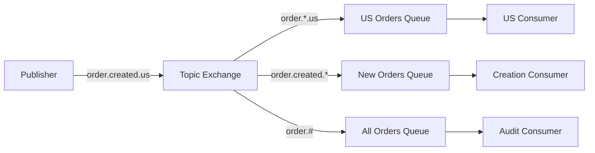
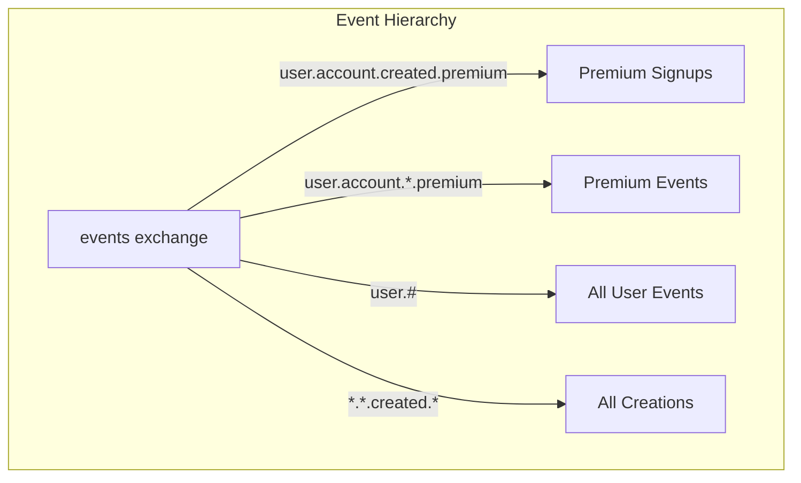
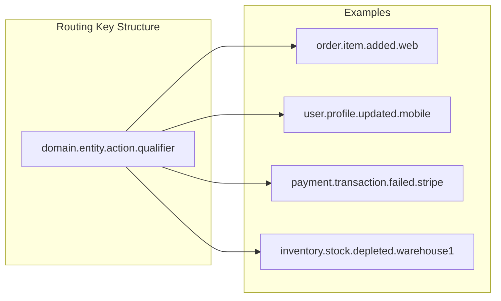

# How to Handle RabbitMQ Routing with Topic Exchanges

Author: [nawazdhandala](https://www.github.com/nawazdhandala)

Tags: RabbitMQ, Message Queue, Topic Exchange, Routing, Microservices, Event-Driven Architecture

Description: Master RabbitMQ topic exchanges to implement flexible message routing patterns using wildcards and routing keys.

---

Topic exchanges in RabbitMQ provide powerful pattern-based message routing. Unlike direct exchanges that require exact routing key matches, topic exchanges support wildcards, enabling flexible subscription patterns. This guide covers everything from basic concepts to advanced routing strategies.

## Understanding Topic Exchange Routing

Topic exchanges route messages based on routing keys that follow a dot-separated word format. Consumers bind queues to the exchange with binding patterns that can include wildcards.



### Wildcard Rules

Topic exchanges support two wildcard characters:

- `*` (star) matches exactly one word
- `#` (hash) matches zero or more words

## Setting Up a Topic Exchange

First, create the topic exchange and demonstrate basic routing patterns.

```python
# topic_exchange_setup.py
# This script demonstrates setting up a topic exchange with multiple binding patterns
# Run this to create the exchange and queues before publishing messages

import pika

# Establish connection to RabbitMQ
# For production, use connection parameters with credentials and SSL
connection = pika.BlockingConnection(pika.ConnectionParameters('localhost'))
channel = connection.channel()

# Declare a topic exchange
# Topic exchanges route based on pattern matching against routing keys
# The exchange is durable so it survives broker restarts
channel.exchange_declare(
    exchange='events',
    exchange_type='topic',
    durable=True
)

# Declare queues for different consumers
# Each queue will receive messages based on its binding pattern
channel.queue_declare(queue='us_orders', durable=True)
channel.queue_declare(queue='new_orders', durable=True)
channel.queue_declare(queue='all_orders', durable=True)

# Bind queues with different patterns
# Pattern: order.*.us - matches order.created.us, order.shipped.us, etc.
# The * wildcard matches exactly one word between dots
channel.queue_bind(
    exchange='events',
    queue='us_orders',
    routing_key='order.*.us'
)

# Pattern: order.created.* - matches order.created.us, order.created.eu, etc.
# This captures all new orders regardless of region
channel.queue_bind(
    exchange='events',
    queue='new_orders',
    routing_key='order.created.*'
)

# Pattern: order.# - matches order, order.created, order.created.us, etc.
# The # wildcard matches zero or more words, capturing all order events
channel.queue_bind(
    exchange='events',
    queue='all_orders',
    routing_key='order.#'
)

print("Topic exchange and queues configured successfully")
connection.close()
```

## Publishing Messages with Routing Keys

When publishing, use routing keys that follow your naming convention.

```python
# publisher.py
# This publisher sends messages with structured routing keys
# The routing key format is: resource.action.region

import pika
import json
from datetime import datetime

def publish_event(routing_key, message):
    """
    Publish a message to the topic exchange with a specific routing key.

    Args:
        routing_key: Dot-separated key like 'order.created.us'
        message: Dictionary containing the event payload
    """
    connection = pika.BlockingConnection(pika.ConnectionParameters('localhost'))
    channel = connection.channel()

    # Add metadata to the message
    # Timestamps help with debugging and message tracing
    message['timestamp'] = datetime.utcnow().isoformat()
    message['routing_key'] = routing_key

    # Publish to the topic exchange
    # The routing key determines which queues receive the message
    # delivery_mode=2 makes the message persistent
    channel.basic_publish(
        exchange='events',
        routing_key=routing_key,
        body=json.dumps(message),
        properties=pika.BasicProperties(
            delivery_mode=2,  # Persistent message
            content_type='application/json'
        )
    )

    print(f"Published to '{routing_key}': {message}")
    connection.close()

# Example: Publish different events
# Each event will be routed to queues based on pattern matching

# This matches: order.*.us and order.created.* and order.#
publish_event('order.created.us', {
    'order_id': '12345',
    'customer': 'john@example.com',
    'total': 99.99
})

# This matches: order.*.eu and order.created.* and order.#
publish_event('order.created.eu', {
    'order_id': '12346',
    'customer': 'marie@example.com',
    'total': 149.99
})

# This matches: order.*.us and order.#
publish_event('order.shipped.us', {
    'order_id': '12345',
    'tracking': 'TRACK123'
})
```

## Consuming Messages from Topic Queues

Create consumers that process messages from specific queues.

```python
# consumer.py
# This consumer processes messages from a specific queue
# Multiple instances can run in parallel for load balancing

import pika
import json

def create_consumer(queue_name, callback_name):
    """
    Create a consumer for a specific queue.

    Args:
        queue_name: The queue to consume from
        callback_name: A descriptive name for logging
    """
    connection = pika.BlockingConnection(pika.ConnectionParameters('localhost'))
    channel = connection.channel()

    def callback(ch, method, properties, body):
        """
        Process incoming messages.

        The callback receives the channel, delivery info, message properties,
        and the message body. Always acknowledge after successful processing.
        """
        message = json.loads(body)
        print(f"[{callback_name}] Received: {message}")

        # Process the message based on your business logic
        # In production, wrap this in try/except for error handling
        process_message(message, callback_name)

        # Acknowledge the message after successful processing
        # This removes it from the queue
        ch.basic_ack(delivery_tag=method.delivery_tag)

    # Set prefetch to 1 for fair dispatch among multiple consumers
    # This prevents one slow consumer from getting overwhelmed
    channel.basic_qos(prefetch_count=1)

    # Start consuming from the queue
    # auto_ack=False means we manually acknowledge messages
    channel.basic_consume(
        queue=queue_name,
        on_message_callback=callback,
        auto_ack=False
    )

    print(f"[{callback_name}] Waiting for messages on '{queue_name}'...")
    channel.start_consuming()

def process_message(message, consumer_name):
    """
    Business logic for processing messages.

    This is where you implement your actual message handling.
    Different consumers might have different processing logic.
    """
    routing_key = message.get('routing_key', 'unknown')
    print(f"[{consumer_name}] Processing event: {routing_key}")

# Run consumer for US orders
# This receives messages matching 'order.*.us'
if __name__ == '__main__':
    import sys
    queue = sys.argv[1] if len(sys.argv) > 1 else 'us_orders'
    create_consumer(queue, f"{queue}_consumer")
```

## Advanced Routing Patterns

### Multi-Level Hierarchical Routing

Design routing keys with multiple levels for complex event hierarchies.



```python
# hierarchical_routing.py
# Demonstrates multi-level routing key hierarchies
# Format: domain.subdomain.action.qualifier

import pika

connection = pika.BlockingConnection(pika.ConnectionParameters('localhost'))
channel = connection.channel()

# Declare exchange for hierarchical events
channel.exchange_declare(exchange='app_events', exchange_type='topic', durable=True)

# Define queue bindings for different subscriber needs
bindings = [
    # Marketing team wants all premium user signups
    ('premium_signups', 'user.account.created.premium'),

    # Analytics wants all premium user activity
    ('premium_activity', 'user.account.*.premium'),

    # Audit log captures everything related to users
    ('user_audit', 'user.#'),

    # Creation tracker monitors all creation events across domains
    ('creation_tracker', '*.*.created.*'),

    # Regional compliance needs EU-specific events
    ('eu_compliance', '*.*.*.eu'),
]

# Create queues and bindings
for queue_name, pattern in bindings:
    channel.queue_declare(queue=queue_name, durable=True)
    channel.queue_bind(exchange='app_events', queue=queue_name, routing_key=pattern)
    print(f"Bound '{queue_name}' to pattern '{pattern}'")

# Example events and which queues receive them
events = [
    # Matches: premium_signups, premium_activity, user_audit, creation_tracker
    ('user.account.created.premium', 'Premium user signup'),

    # Matches: user_audit, creation_tracker
    ('user.account.created.free', 'Free user signup'),

    # Matches: premium_activity, user_audit
    ('user.account.upgraded.premium', 'User upgraded to premium'),

    # Matches: creation_tracker, eu_compliance
    ('order.invoice.created.eu', 'EU invoice created'),
]

print("\nRouting demonstration:")
for routing_key, description in events:
    print(f"\n  Event: {description}")
    print(f"  Routing Key: {routing_key}")

connection.close()
```

### Dynamic Binding for Runtime Subscriptions

Allow consumers to modify their subscriptions at runtime.

```python
# dynamic_subscription.py
# Demonstrates adding and removing bindings without restarting consumers
# Useful for configurable event filtering

import pika

class DynamicSubscriber:
    """
    A subscriber that can modify its bindings at runtime.

    This pattern is useful for:
    - User-configurable notifications
    - A/B testing different event streams
    - Gradual rollout of new event handlers
    """

    def __init__(self, queue_name):
        self.queue_name = queue_name
        self.connection = pika.BlockingConnection(
            pika.ConnectionParameters('localhost')
        )
        self.channel = self.connection.channel()

        # Declare a durable queue for this subscriber
        self.channel.queue_declare(queue=queue_name, durable=True)
        self.bindings = set()

    def subscribe(self, exchange, pattern):
        """
        Add a new binding pattern to receive matching messages.

        Args:
            exchange: The topic exchange name
            pattern: The routing pattern (can include * and #)
        """
        self.channel.queue_bind(
            exchange=exchange,
            queue=self.queue_name,
            routing_key=pattern
        )
        self.bindings.add((exchange, pattern))
        print(f"Subscribed to '{pattern}' on '{exchange}'")

    def unsubscribe(self, exchange, pattern):
        """
        Remove a binding to stop receiving matching messages.

        Args:
            exchange: The topic exchange name
            pattern: The exact pattern used when subscribing
        """
        self.channel.queue_unbind(
            exchange=exchange,
            queue=self.queue_name,
            routing_key=pattern
        )
        self.bindings.discard((exchange, pattern))
        print(f"Unsubscribed from '{pattern}' on '{exchange}'")

    def list_subscriptions(self):
        """Return all active binding patterns."""
        return list(self.bindings)

# Example usage
subscriber = DynamicSubscriber('my_notifications')

# Start with broad subscription
subscriber.subscribe('events', 'order.#')

# Later, narrow down to only US orders
subscriber.unsubscribe('events', 'order.#')
subscriber.subscribe('events', 'order.*.us')

# Add another specific pattern
subscriber.subscribe('events', 'alert.critical.*')

print(f"\nActive subscriptions: {subscriber.list_subscriptions()}")
```

## Routing Key Design Best Practices

Design your routing keys with a consistent, hierarchical structure.



### Naming Convention Guidelines

```python
# routing_conventions.py
# Defines routing key patterns and validation
# Consistent naming makes pattern matching predictable

import re

class RoutingKeyBuilder:
    """
    Helper class to build and validate routing keys.

    Ensures consistent routing key format across your application.
    Format: {domain}.{entity}.{action}.{qualifier}
    """

    # Valid components for each position
    DOMAINS = ['order', 'user', 'payment', 'inventory', 'notification']
    ACTIONS = ['created', 'updated', 'deleted', 'failed', 'completed']

    # Regex pattern for valid routing key words
    WORD_PATTERN = re.compile(r'^[a-z][a-z0-9_]*$')

    @classmethod
    def build(cls, domain, entity, action, qualifier=None):
        """
        Build a routing key from components.

        Args:
            domain: Top-level domain (order, user, etc.)
            entity: The entity type within the domain
            action: The action performed
            qualifier: Optional qualifier (region, source, etc.)

        Returns:
            A valid routing key string
        """
        components = [domain, entity, action]
        if qualifier:
            components.append(qualifier)

        # Validate each component
        for component in components:
            if not cls.WORD_PATTERN.match(component):
                raise ValueError(f"Invalid routing key component: {component}")

        return '.'.join(components)

    @classmethod
    def build_pattern(cls, domain='*', entity='*', action='*', qualifier='*'):
        """
        Build a binding pattern with wildcards.

        Use '*' for single-word wildcard or '#' for multi-word.

        Args:
            domain: Domain or wildcard
            entity: Entity or wildcard
            action: Action or wildcard
            qualifier: Qualifier or wildcard

        Returns:
            A binding pattern string
        """
        return f"{domain}.{entity}.{action}.{qualifier}"

# Usage examples
print(RoutingKeyBuilder.build('order', 'item', 'added', 'web'))
# Output: order.item.added.web

print(RoutingKeyBuilder.build_pattern(domain='order', action='failed'))
# Output: order.*.failed.*
```

## Testing Topic Exchange Routing

Verify your routing configuration works as expected.

```python
# test_routing.py
# Test suite for verifying topic exchange routing behavior
# Run this to validate your binding patterns before deployment

import pika
import json
import time

def test_routing_patterns():
    """
    Test that messages are routed to the correct queues.

    This test publishes messages and verifies they arrive
    at the expected queues based on binding patterns.
    """
    connection = pika.BlockingConnection(pika.ConnectionParameters('localhost'))
    channel = connection.channel()

    # Setup test exchange and queues
    channel.exchange_declare(exchange='test_events', exchange_type='topic')

    test_cases = [
        {
            'queue': 'test_q1',
            'pattern': 'order.*.us',
            'should_match': ['order.created.us', 'order.shipped.us'],
            'should_not_match': ['order.created.eu', 'user.created.us']
        },
        {
            'queue': 'test_q2',
            'pattern': 'order.#',
            'should_match': ['order', 'order.created', 'order.created.us'],
            'should_not_match': ['user.created']
        },
        {
            'queue': 'test_q3',
            'pattern': '*.created.*',
            'should_match': ['order.created.us', 'user.created.eu'],
            'should_not_match': ['order.shipped.us', 'order.created']
        }
    ]

    for tc in test_cases:
        # Create exclusive queue for testing
        result = channel.queue_declare(queue='', exclusive=True)
        test_queue = result.method.queue
        channel.queue_bind(
            exchange='test_events',
            queue=test_queue,
            routing_key=tc['pattern']
        )

        print(f"\nTesting pattern: {tc['pattern']}")

        # Test messages that should match
        for routing_key in tc['should_match']:
            channel.basic_publish(
                exchange='test_events',
                routing_key=routing_key,
                body=json.dumps({'test': routing_key})
            )

        # Give messages time to route
        time.sleep(0.1)

        # Verify messages arrived
        received = 0
        while True:
            method, props, body = channel.basic_get(test_queue, auto_ack=True)
            if method is None:
                break
            received += 1

        expected = len(tc['should_match'])
        status = "PASS" if received == expected else "FAIL"
        print(f"  {status}: Expected {expected} messages, received {received}")

    # Cleanup
    channel.exchange_delete('test_events')
    connection.close()

if __name__ == '__main__':
    test_routing_patterns()
```

## Summary

Topic exchanges provide flexible message routing through pattern matching. Key points to remember include using `*` to match exactly one word and `#` to match zero or more words. Design routing keys with consistent hierarchical structures. Test your binding patterns before deploying to production. Use dynamic bindings for runtime subscription management. By following these patterns, you can build event-driven architectures that cleanly separate publishers from consumers while maintaining precise control over message delivery.
