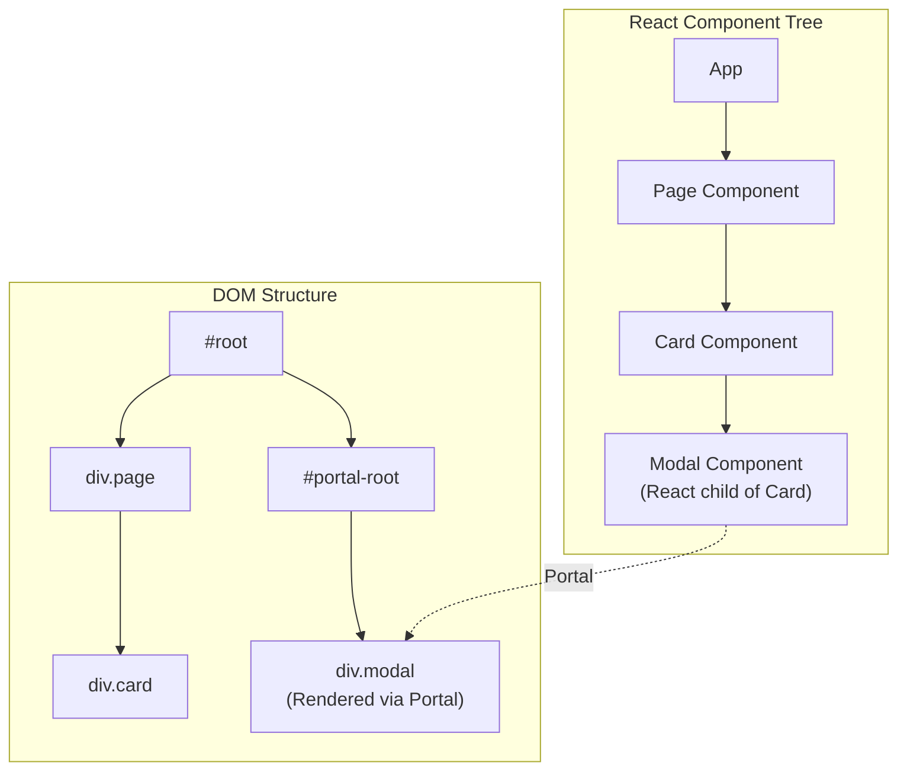
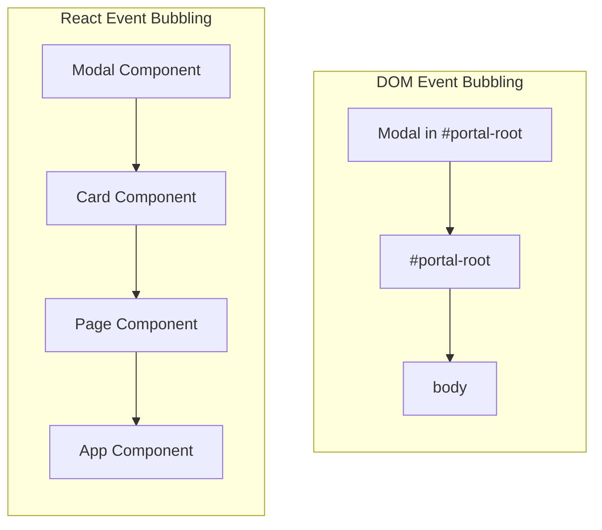

# How to Handle React Portal Usage

Author: [nawazdhandala](https://www.github.com/nawazdhandala)

Tags: React, Portal, Modal, Tooltip, DOM, JavaScript, TypeScript, UI Components

Description: Learn how to use React Portals to render components outside the DOM hierarchy while maintaining React context and event bubbling.

---

> React Portals provide a way to render children into a DOM node that exists outside the parent component's DOM hierarchy. This is essential for modals, tooltips, and overlays that need to break out of their container's styling constraints. Master portals to build better UI components.

Portals solve the z-index and overflow hidden problems that plague nested UI components.

---

## What Are React Portals



---

## Basic Portal Usage

### Creating a Simple Portal

Use `createPortal` to render content in a different DOM location:

```tsx
// src/components/Portal.tsx
import { ReactNode } from 'react';
import { createPortal } from 'react-dom';

interface PortalProps {
  children: ReactNode;
  // Target DOM element ID, defaults to 'portal-root'
  containerId?: string;
}

export function Portal({ children, containerId = 'portal-root' }: PortalProps) {
  // Find the target container in the DOM
  const container = document.getElementById(containerId);

  // If container does not exist, render nothing
  // In production, you might want to create it dynamically
  if (!container) {
    console.warn(`Portal container #${containerId} not found`);
    return null;
  }

  // createPortal renders children into the container
  // while maintaining React's component hierarchy
  return createPortal(children, container);
}
```

### Setting Up the Portal Root

Add the portal container to your HTML:

```html
<!-- public/index.html -->
<!DOCTYPE html>
<html lang="en">
<head>
  <meta charset="UTF-8" />
  <title>React App</title>
</head>
<body>
  <!-- Main React app mounts here -->
  <div id="root"></div>

  <!-- Portal content renders here -->
  <!-- Place after #root to ensure proper stacking -->
  <div id="portal-root"></div>
</body>
</html>
```

---

## Building a Modal Component

### Modal with Portal

```tsx
// src/components/Modal.tsx
import { ReactNode, useEffect, useCallback } from 'react';
import { createPortal } from 'react-dom';

interface ModalProps {
  isOpen: boolean;
  onClose: () => void;
  title?: string;
  children: ReactNode;
  // Allow closing by clicking backdrop
  closeOnBackdropClick?: boolean;
  // Allow closing with Escape key
  closeOnEscape?: boolean;
}

export function Modal({
  isOpen,
  onClose,
  title,
  children,
  closeOnBackdropClick = true,
  closeOnEscape = true,
}: ModalProps) {
  // Handle Escape key press
  const handleKeyDown = useCallback(
    (event: KeyboardEvent) => {
      if (closeOnEscape && event.key === 'Escape') {
        onClose();
      }
    },
    [closeOnEscape, onClose]
  );

  // Add and remove event listener
  useEffect(() => {
    if (isOpen) {
      document.addEventListener('keydown', handleKeyDown);
      // Prevent body scroll when modal is open
      document.body.style.overflow = 'hidden';
    }

    return () => {
      document.removeEventListener('keydown', handleKeyDown);
      document.body.style.overflow = '';
    };
  }, [isOpen, handleKeyDown]);

  // Handle backdrop click
  const handleBackdropClick = (event: React.MouseEvent) => {
    // Only close if clicking the backdrop itself, not its children
    if (closeOnBackdropClick && event.target === event.currentTarget) {
      onClose();
    }
  };

  // Do not render if not open
  if (!isOpen) {
    return null;
  }

  // Get portal container
  const portalRoot = document.getElementById('portal-root');
  if (!portalRoot) {
    return null;
  }

  // Render modal content via portal
  return createPortal(
    <div
      className="modal-backdrop"
      onClick={handleBackdropClick}
      role="dialog"
      aria-modal="true"
      aria-labelledby={title ? 'modal-title' : undefined}
    >
      <div className="modal-content">
        {title && (
          <div className="modal-header">
            <h2 id="modal-title">{title}</h2>
            <button
              className="modal-close"
              onClick={onClose}
              aria-label="Close modal"
            >
              x
            </button>
          </div>
        )}
        <div className="modal-body">{children}</div>
      </div>
    </div>,
    portalRoot
  );
}
```

### Modal Styles

```css
/* src/styles/modal.css */

.modal-backdrop {
  position: fixed;
  top: 0;
  left: 0;
  right: 0;
  bottom: 0;
  background-color: rgba(0, 0, 0, 0.5);
  display: flex;
  align-items: center;
  justify-content: center;
  z-index: 1000;
}

.modal-content {
  background: white;
  border-radius: 8px;
  max-width: 500px;
  width: 90%;
  max-height: 90vh;
  overflow-y: auto;
  box-shadow: 0 4px 20px rgba(0, 0, 0, 0.15);
}

.modal-header {
  display: flex;
  justify-content: space-between;
  align-items: center;
  padding: 16px 20px;
  border-bottom: 1px solid #e0e0e0;
}

.modal-header h2 {
  margin: 0;
  font-size: 18px;
}

.modal-close {
  background: none;
  border: none;
  font-size: 24px;
  cursor: pointer;
  padding: 0;
  color: #666;
}

.modal-body {
  padding: 20px;
}
```

### Using the Modal

```tsx
// src/components/UserProfile.tsx
import { useState } from 'react';
import { Modal } from './Modal';

export function UserProfile() {
  const [isModalOpen, setIsModalOpen] = useState(false);

  return (
    <div className="user-profile">
      <h1>User Profile</h1>

      <button onClick={() => setIsModalOpen(true)}>
        Edit Profile
      </button>

      {/* Modal renders via portal but maintains React tree position */}
      <Modal
        isOpen={isModalOpen}
        onClose={() => setIsModalOpen(false)}
        title="Edit Profile"
      >
        <form>
          <input type="text" placeholder="Name" />
          <input type="email" placeholder="Email" />
          <button type="submit">Save</button>
        </form>
      </Modal>
    </div>
  );
}
```

---

## Event Bubbling in Portals

### Events Bubble Through React Tree

Even though portals render in a different DOM location, events bubble through the React component tree:



### Demonstrating Event Bubbling

```tsx
// src/components/EventBubblingDemo.tsx
import { useState } from 'react';
import { createPortal } from 'react-dom';

export function EventBubblingDemo() {
  const [clicks, setClicks] = useState<string[]>([]);

  const addClick = (source: string) => {
    setClicks((prev) => [...prev, source]);
  };

  return (
    // Parent div catches events from both direct children and portal
    <div
      onClick={() => addClick('Parent Container')}
      style={{ padding: '20px', background: '#f0f0f0' }}
    >
      <h2>Event Bubbling Demo</h2>

      <button onClick={() => addClick('Regular Button')}>
        Regular Button
      </button>

      {/* Portal content - clicks still bubble to parent in React */}
      {createPortal(
        <div style={{ marginTop: '20px' }}>
          <button onClick={() => addClick('Portal Button')}>
            Button Inside Portal
          </button>
        </div>,
        document.getElementById('portal-root')!
      )}

      <div style={{ marginTop: '20px' }}>
        <h3>Click Log:</h3>
        <ul>
          {clicks.map((click, index) => (
            <li key={index}>{click}</li>
          ))}
        </ul>
      </div>
    </div>
  );
}

// Clicking "Portal Button" logs:
// 1. "Portal Button"
// 2. "Parent Container"
// Events bubble through React tree even though DOM structure is different
```

---

## Building a Tooltip Component

### Tooltip with Portal

```tsx
// src/components/Tooltip.tsx
import {
  useState,
  useRef,
  useEffect,
  ReactNode,
  useCallback,
} from 'react';
import { createPortal } from 'react-dom';

interface TooltipProps {
  content: ReactNode;
  children: ReactNode;
  position?: 'top' | 'bottom' | 'left' | 'right';
  delay?: number;
}

interface TooltipPosition {
  top: number;
  left: number;
}

export function Tooltip({
  content,
  children,
  position = 'top',
  delay = 200,
}: TooltipProps) {
  const [isVisible, setIsVisible] = useState(false);
  const [tooltipPosition, setTooltipPosition] = useState<TooltipPosition>({
    top: 0,
    left: 0,
  });
  const triggerRef = useRef<HTMLSpanElement>(null);
  const tooltipRef = useRef<HTMLDivElement>(null);
  const timeoutRef = useRef<NodeJS.Timeout>();

  // Calculate tooltip position based on trigger element
  const calculatePosition = useCallback(() => {
    if (!triggerRef.current || !tooltipRef.current) return;

    const triggerRect = triggerRef.current.getBoundingClientRect();
    const tooltipRect = tooltipRef.current.getBoundingClientRect();
    const scrollX = window.scrollX;
    const scrollY = window.scrollY;

    let top = 0;
    let left = 0;

    switch (position) {
      case 'top':
        top = triggerRect.top + scrollY - tooltipRect.height - 8;
        left =
          triggerRect.left +
          scrollX +
          triggerRect.width / 2 -
          tooltipRect.width / 2;
        break;
      case 'bottom':
        top = triggerRect.bottom + scrollY + 8;
        left =
          triggerRect.left +
          scrollX +
          triggerRect.width / 2 -
          tooltipRect.width / 2;
        break;
      case 'left':
        top =
          triggerRect.top +
          scrollY +
          triggerRect.height / 2 -
          tooltipRect.height / 2;
        left = triggerRect.left + scrollX - tooltipRect.width - 8;
        break;
      case 'right':
        top =
          triggerRect.top +
          scrollY +
          triggerRect.height / 2 -
          tooltipRect.height / 2;
        left = triggerRect.right + scrollX + 8;
        break;
    }

    setTooltipPosition({ top, left });
  }, [position]);

  // Recalculate position when tooltip becomes visible
  useEffect(() => {
    if (isVisible) {
      // Use requestAnimationFrame to ensure DOM has updated
      requestAnimationFrame(calculatePosition);
    }
  }, [isVisible, calculatePosition]);

  const showTooltip = () => {
    timeoutRef.current = setTimeout(() => {
      setIsVisible(true);
    }, delay);
  };

  const hideTooltip = () => {
    if (timeoutRef.current) {
      clearTimeout(timeoutRef.current);
    }
    setIsVisible(false);
  };

  // Clean up timeout on unmount
  useEffect(() => {
    return () => {
      if (timeoutRef.current) {
        clearTimeout(timeoutRef.current);
      }
    };
  }, []);

  const portalRoot = document.getElementById('portal-root');

  return (
    <>
      <span
        ref={triggerRef}
        onMouseEnter={showTooltip}
        onMouseLeave={hideTooltip}
        onFocus={showTooltip}
        onBlur={hideTooltip}
        style={{ display: 'inline-block' }}
      >
        {children}
      </span>

      {isVisible &&
        portalRoot &&
        createPortal(
          <div
            ref={tooltipRef}
            className={`tooltip tooltip-${position}`}
            style={{
              position: 'absolute',
              top: tooltipPosition.top,
              left: tooltipPosition.left,
            }}
            role="tooltip"
          >
            {content}
          </div>,
          portalRoot
        )}
    </>
  );
}
```

### Tooltip Styles

```css
/* src/styles/tooltip.css */

.tooltip {
  background-color: #333;
  color: white;
  padding: 8px 12px;
  border-radius: 4px;
  font-size: 14px;
  max-width: 250px;
  z-index: 1001;
  pointer-events: none;
  white-space: nowrap;
}

.tooltip::after {
  content: '';
  position: absolute;
  border: 6px solid transparent;
}

.tooltip-top::after {
  top: 100%;
  left: 50%;
  transform: translateX(-50%);
  border-top-color: #333;
}

.tooltip-bottom::after {
  bottom: 100%;
  left: 50%;
  transform: translateX(-50%);
  border-bottom-color: #333;
}

.tooltip-left::after {
  left: 100%;
  top: 50%;
  transform: translateY(-50%);
  border-left-color: #333;
}

.tooltip-right::after {
  right: 100%;
  top: 50%;
  transform: translateY(-50%);
  border-right-color: #333;
}
```

---

## Dropdown Menu with Portal

### Dropdown Component

```tsx
// src/components/Dropdown.tsx
import {
  useState,
  useRef,
  useEffect,
  ReactNode,
  useCallback,
} from 'react';
import { createPortal } from 'react-dom';

interface DropdownOption {
  value: string;
  label: string;
  icon?: ReactNode;
}

interface DropdownProps {
  options: DropdownOption[];
  value?: string;
  onChange: (value: string) => void;
  placeholder?: string;
}

export function Dropdown({
  options,
  value,
  onChange,
  placeholder = 'Select an option',
}: DropdownProps) {
  const [isOpen, setIsOpen] = useState(false);
  const [menuPosition, setMenuPosition] = useState({ top: 0, left: 0, width: 0 });
  const triggerRef = useRef<HTMLButtonElement>(null);
  const menuRef = useRef<HTMLDivElement>(null);

  const selectedOption = options.find((opt) => opt.value === value);

  // Calculate menu position
  const updateMenuPosition = useCallback(() => {
    if (!triggerRef.current) return;

    const rect = triggerRef.current.getBoundingClientRect();
    setMenuPosition({
      top: rect.bottom + window.scrollY + 4,
      left: rect.left + window.scrollX,
      width: rect.width,
    });
  }, []);

  // Update position when opened
  useEffect(() => {
    if (isOpen) {
      updateMenuPosition();
      window.addEventListener('scroll', updateMenuPosition);
      window.addEventListener('resize', updateMenuPosition);
    }

    return () => {
      window.removeEventListener('scroll', updateMenuPosition);
      window.removeEventListener('resize', updateMenuPosition);
    };
  }, [isOpen, updateMenuPosition]);

  // Close on outside click
  useEffect(() => {
    if (!isOpen) return;

    const handleClickOutside = (event: MouseEvent) => {
      if (
        triggerRef.current &&
        !triggerRef.current.contains(event.target as Node) &&
        menuRef.current &&
        !menuRef.current.contains(event.target as Node)
      ) {
        setIsOpen(false);
      }
    };

    document.addEventListener('mousedown', handleClickOutside);
    return () => document.removeEventListener('mousedown', handleClickOutside);
  }, [isOpen]);

  // Handle option selection
  const handleSelect = (optionValue: string) => {
    onChange(optionValue);
    setIsOpen(false);
  };

  // Handle keyboard navigation
  const handleKeyDown = (event: React.KeyboardEvent) => {
    switch (event.key) {
      case 'Enter':
      case ' ':
        event.preventDefault();
        setIsOpen((prev) => !prev);
        break;
      case 'Escape':
        setIsOpen(false);
        break;
      case 'ArrowDown':
        event.preventDefault();
        if (!isOpen) {
          setIsOpen(true);
        }
        break;
    }
  };

  const portalRoot = document.getElementById('portal-root');

  return (
    <>
      <button
        ref={triggerRef}
        type="button"
        className="dropdown-trigger"
        onClick={() => setIsOpen((prev) => !prev)}
        onKeyDown={handleKeyDown}
        aria-haspopup="listbox"
        aria-expanded={isOpen}
      >
        <span>{selectedOption?.label || placeholder}</span>
        <span className="dropdown-arrow">{isOpen ? '\u25B2' : '\u25BC'}</span>
      </button>

      {isOpen &&
        portalRoot &&
        createPortal(
          <div
            ref={menuRef}
            className="dropdown-menu"
            style={{
              position: 'absolute',
              top: menuPosition.top,
              left: menuPosition.left,
              width: menuPosition.width,
            }}
            role="listbox"
          >
            {options.map((option) => (
              <button
                key={option.value}
                type="button"
                className={`dropdown-option ${
                  option.value === value ? 'selected' : ''
                }`}
                onClick={() => handleSelect(option.value)}
                role="option"
                aria-selected={option.value === value}
              >
                {option.icon && (
                  <span className="option-icon">{option.icon}</span>
                )}
                {option.label}
              </button>
            ))}
          </div>,
          portalRoot
        )}
    </>
  );
}
```

---

## Focus Management

### Focus Trap for Modals

Trap focus inside modal to improve accessibility:

```tsx
// src/hooks/useFocusTrap.ts
import { useEffect, useRef, RefObject } from 'react';

export function useFocusTrap(isActive: boolean): RefObject<HTMLDivElement> {
  const containerRef = useRef<HTMLDivElement>(null);

  useEffect(() => {
    if (!isActive || !containerRef.current) return;

    const container = containerRef.current;

    // Find all focusable elements
    const focusableSelector = [
      'button:not([disabled])',
      'input:not([disabled])',
      'select:not([disabled])',
      'textarea:not([disabled])',
      'a[href]',
      '[tabindex]:not([tabindex="-1"])',
    ].join(', ');

    const getFocusableElements = () => {
      return container.querySelectorAll<HTMLElement>(focusableSelector);
    };

    // Focus the first focusable element
    const focusableElements = getFocusableElements();
    if (focusableElements.length > 0) {
      focusableElements[0].focus();
    }

    // Handle Tab key to trap focus
    const handleKeyDown = (event: KeyboardEvent) => {
      if (event.key !== 'Tab') return;

      const elements = getFocusableElements();
      if (elements.length === 0) return;

      const firstElement = elements[0];
      const lastElement = elements[elements.length - 1];

      // Shift+Tab on first element - move to last
      if (event.shiftKey && document.activeElement === firstElement) {
        event.preventDefault();
        lastElement.focus();
      }
      // Tab on last element - move to first
      else if (!event.shiftKey && document.activeElement === lastElement) {
        event.preventDefault();
        firstElement.focus();
      }
    };

    document.addEventListener('keydown', handleKeyDown);

    return () => {
      document.removeEventListener('keydown', handleKeyDown);
    };
  }, [isActive]);

  return containerRef;
}
```

### Using Focus Trap in Modal

```tsx
// src/components/AccessibleModal.tsx
import { ReactNode, useEffect, useRef } from 'react';
import { createPortal } from 'react-dom';
import { useFocusTrap } from '../hooks/useFocusTrap';

interface AccessibleModalProps {
  isOpen: boolean;
  onClose: () => void;
  title: string;
  children: ReactNode;
}

export function AccessibleModal({
  isOpen,
  onClose,
  title,
  children,
}: AccessibleModalProps) {
  // Store the element that triggered the modal
  const previousActiveElement = useRef<HTMLElement | null>(null);

  // Get the focus trap container ref
  const focusTrapRef = useFocusTrap(isOpen);

  // Save focus and restore on close
  useEffect(() => {
    if (isOpen) {
      // Save currently focused element
      previousActiveElement.current = document.activeElement as HTMLElement;
    } else if (previousActiveElement.current) {
      // Restore focus when modal closes
      previousActiveElement.current.focus();
    }
  }, [isOpen]);

  if (!isOpen) return null;

  const portalRoot = document.getElementById('portal-root');
  if (!portalRoot) return null;

  return createPortal(
    <div
      className="modal-backdrop"
      onClick={(e) => e.target === e.currentTarget && onClose()}
      role="dialog"
      aria-modal="true"
      aria-labelledby="modal-title"
    >
      <div ref={focusTrapRef} className="modal-content">
        <div className="modal-header">
          <h2 id="modal-title">{title}</h2>
          <button onClick={onClose} aria-label="Close modal">
            x
          </button>
        </div>
        <div className="modal-body">{children}</div>
      </div>
    </div>,
    portalRoot
  );
}
```

---

## Server-Side Rendering Considerations

### Safe Portal Component

Handle SSR where document is not available:

```tsx
// src/components/SafePortal.tsx
import { ReactNode, useState, useEffect } from 'react';
import { createPortal } from 'react-dom';

interface SafePortalProps {
  children: ReactNode;
  containerId?: string;
}

export function SafePortal({
  children,
  containerId = 'portal-root',
}: SafePortalProps) {
  const [mounted, setMounted] = useState(false);
  const [container, setContainer] = useState<HTMLElement | null>(null);

  useEffect(() => {
    // Mark as mounted (only runs on client)
    setMounted(true);

    // Find or create the container
    let portalContainer = document.getElementById(containerId);

    if (!portalContainer) {
      // Create container if it does not exist
      portalContainer = document.createElement('div');
      portalContainer.id = containerId;
      document.body.appendChild(portalContainer);
    }

    setContainer(portalContainer);

    // Cleanup: remove container if we created it
    return () => {
      // Only remove if we created it and it is empty
      if (
        portalContainer &&
        portalContainer.childNodes.length === 0 &&
        portalContainer.parentNode
      ) {
        portalContainer.parentNode.removeChild(portalContainer);
      }
    };
  }, [containerId]);

  // Do not render on server
  if (!mounted || !container) {
    return null;
  }

  return createPortal(children, container);
}
```

---

## Best Practices

1. **Use semantic HTML** - add proper ARIA attributes
2. **Manage focus** - trap focus in modals, restore on close
3. **Handle escape key** - allow users to dismiss with keyboard
4. **Prevent body scroll** - lock scroll when modal is open
5. **Position dynamically** - recalculate on scroll and resize
6. **Handle SSR** - check for document availability

---

## Conclusion

React Portals enable powerful UI patterns that would otherwise be difficult to implement. Key takeaways:

- **Portals render outside DOM hierarchy** but maintain React tree position
- **Events bubble through React tree** not DOM tree
- **Focus management is critical** for accessibility
- **Handle SSR carefully** with client-side checks

---

*Need to monitor your React application? [OneUptime](https://oneuptime.com) provides comprehensive monitoring with error tracking and performance metrics for production applications.*
