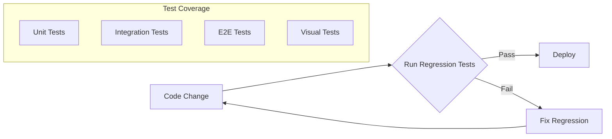
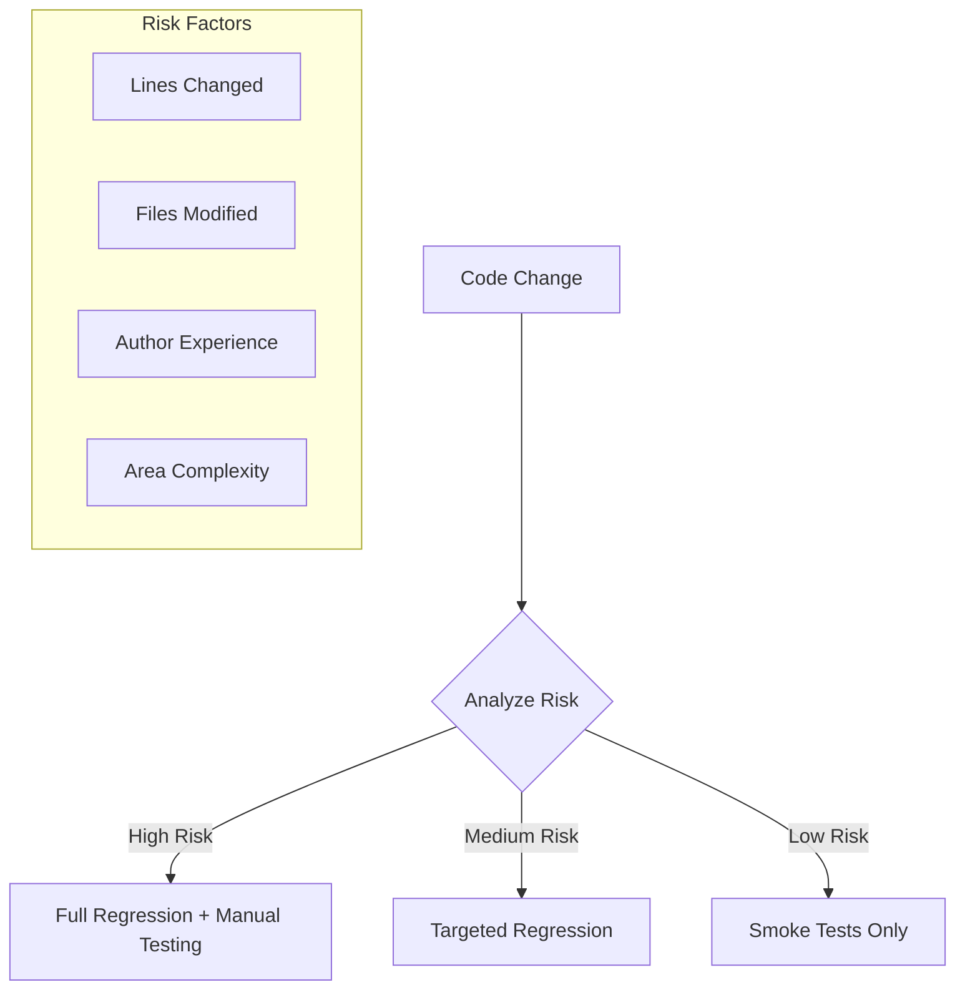

# How to Handle Regression Testing

Author: [nawazdhandala](https://www.github.com/nawazdhandala)

Tags: Regression Testing, Test Automation, QA, CI/CD, Software Testing, Test Strategy

Description: Learn how to implement effective regression testing strategies, from test selection and prioritization to automation and maintenance of your test suite.

---

Regression testing ensures that new code changes don't break existing functionality. It's the safety net that catches unintended side effects before they reach production. However, as your codebase grows, running all tests for every change becomes impractical. This guide covers strategies for efficient, effective regression testing.

## What is Regression Testing?

Regression testing verifies that previously working features still work after code changes. It answers one critical question: "Did we break anything?"



## Building a Regression Test Suite

### Identifying What to Test

Not every test belongs in your regression suite. Focus on tests that cover:

1. **Core business logic** - Features that directly impact revenue or user experience
2. **Frequently used paths** - The features your users interact with daily
3. **Previously broken areas** - Code that has had bugs before is likely to have bugs again
4. **Integration points** - Where systems connect and data flows between services

```javascript
// Example: Tagging tests for regression suite inclusion
describe('Payment Processing', () => {
  // Critical path - always include in regression
  it('should process credit card payment successfully', { tags: ['regression', 'critical'] }, async () => {
    const payment = await processPayment({
      amount: 100,
      currency: 'USD',
      method: 'credit_card'
    });

    expect(payment.status).toBe('completed');
    expect(payment.transactionId).toBeDefined();
  });

  // Edge case - include in full regression, exclude from smoke tests
  it('should handle expired card gracefully', { tags: ['regression'] }, async () => {
    const payment = await processPayment({
      amount: 100,
      card: { expired: true }
    });

    expect(payment.status).toBe('failed');
    expect(payment.error.code).toBe('CARD_EXPIRED');
  });
});
```

### Organizing Tests by Priority

Create different test suites for different contexts:

```javascript
// jest.config.js - multiple test configurations
module.exports = {
  projects: [
    {
      displayName: 'smoke',
      testMatch: ['**/*.smoke.test.js'],
      // Fast tests that run on every commit
      testTimeout: 10000
    },
    {
      displayName: 'regression',
      testMatch: ['**/*.regression.test.js'],
      // Full regression suite for nightly runs
      testTimeout: 30000
    },
    {
      displayName: 'critical',
      testMatch: ['**/*.critical.test.js'],
      // Critical path tests for deployments
      testTimeout: 20000
    }
  ]
};
```

Run specific suites:

```bash
# Run smoke tests on every commit
npm test -- --selectProjects=smoke

# Run full regression nightly
npm test -- --selectProjects=regression

# Run critical tests before deployment
npm test -- --selectProjects=critical
```

## Test Selection Strategies

Running all tests for every change doesn't scale. Smart test selection reduces feedback time while maintaining confidence.

### Change-Based Test Selection

Identify which tests are affected by code changes:

```python
# select_tests.py - select tests based on changed files
import subprocess
import json
from pathlib import Path

def get_changed_files():
    """Get list of files changed in current branch"""
    result = subprocess.run(
        ['git', 'diff', '--name-only', 'origin/main...HEAD'],
        capture_output=True,
        text=True
    )
    return result.stdout.strip().split('\n')

def load_test_mapping():
    """Load mapping of source files to test files"""
    # This mapping can be generated by analyzing imports
    # or maintained manually for critical paths
    return {
        'src/payment/processor.py': [
            'tests/test_payment.py',
            'tests/integration/test_checkout.py'
        ],
        'src/user/auth.py': [
            'tests/test_auth.py',
            'tests/test_login.py',
            'tests/integration/test_user_flow.py'
        ],
        'src/api/routes.py': [
            'tests/test_api.py',
            'tests/integration/test_api_endpoints.py'
        ]
    }

def select_tests():
    """Select tests based on changed files"""
    changed = get_changed_files()
    mapping = load_test_mapping()

    selected_tests = set()

    for changed_file in changed:
        if changed_file in mapping:
            selected_tests.update(mapping[changed_file])

        # If config files changed, run all tests
        if changed_file.endswith(('.yaml', '.json', '.env')):
            return ['tests/']  # Run everything

    # Always include smoke tests
    selected_tests.add('tests/smoke/')

    return list(selected_tests)

if __name__ == '__main__':
    tests = select_tests()
    print(' '.join(tests))
```

Use in CI:

```yaml
# .github/workflows/test.yaml
- name: Select tests
  id: select
  run: |
    TESTS=$(python scripts/select_tests.py)
    echo "tests=$TESTS" >> $GITHUB_OUTPUT

- name: Run selected tests
  run: pytest ${{ steps.select.outputs.tests }}
```

### Risk-Based Test Prioritization

Prioritize tests based on code change risk:



```python
# risk_analyzer.py - assess change risk
def calculate_risk_score(changed_files, change_stats):
    """Calculate risk score for a set of changes"""
    risk_score = 0

    # Factor 1: Number of lines changed
    total_lines = change_stats['additions'] + change_stats['deletions']
    if total_lines > 500:
        risk_score += 30
    elif total_lines > 100:
        risk_score += 15
    else:
        risk_score += 5

    # Factor 2: Critical file modifications
    critical_paths = ['payment', 'auth', 'security', 'database']
    for file in changed_files:
        if any(path in file.lower() for path in critical_paths):
            risk_score += 25

    # Factor 3: Configuration changes
    config_files = ['.env', 'config.yaml', 'settings.py']
    if any(f in changed_files for f in config_files):
        risk_score += 20

    # Factor 4: Database migrations
    if any('migration' in f for f in changed_files):
        risk_score += 30

    return min(risk_score, 100)  # Cap at 100

def get_test_strategy(risk_score):
    """Determine test strategy based on risk"""
    if risk_score >= 70:
        return 'full_regression'
    elif risk_score >= 40:
        return 'targeted_regression'
    else:
        return 'smoke_only'
```

## Automating Regression Tests

### Continuous Integration Setup

Configure CI to run appropriate tests at different stages:

```yaml
# .github/workflows/ci.yaml
name: CI Pipeline

on:
  push:
    branches: [main, develop]
  pull_request:
    branches: [main]

jobs:
  # Fast feedback on every push
  smoke-tests:
    runs-on: ubuntu-latest
    steps:
      - uses: actions/checkout@v4
      - name: Run smoke tests
        run: npm test -- --selectProjects=smoke

  # More thorough testing for PRs
  regression-tests:
    runs-on: ubuntu-latest
    if: github.event_name == 'pull_request'
    needs: smoke-tests
    steps:
      - uses: actions/checkout@v4
      - name: Run regression tests
        run: npm test -- --selectProjects=regression

  # Full suite for main branch
  full-regression:
    runs-on: ubuntu-latest
    if: github.ref == 'refs/heads/main'
    needs: smoke-tests
    steps:
      - uses: actions/checkout@v4
      - name: Run full test suite
        run: npm test
```

### Parallel Test Execution

Speed up regression testing by running tests in parallel:

```javascript
// jest.config.js - parallel execution
module.exports = {
  // Use all available CPU cores
  maxWorkers: '100%',

  // Or specify exact number
  // maxWorkers: 4,

  // Shard tests across CI runners
  // Run with: jest --shard=1/3, jest --shard=2/3, jest --shard=3/3
};
```

```yaml
# .github/workflows/parallel-tests.yaml
jobs:
  test:
    runs-on: ubuntu-latest
    strategy:
      matrix:
        shard: [1, 2, 3, 4]
    steps:
      - uses: actions/checkout@v4
      - name: Run tests (shard ${{ matrix.shard }}/4)
        run: npm test -- --shard=${{ matrix.shard }}/4
```

## Maintaining Your Test Suite

### Dealing with Flaky Tests

Flaky tests erode confidence in your regression suite. Identify and fix them:

```javascript
// jest.config.js - retry flaky tests
module.exports = {
  // Retry failed tests up to 2 times
  // Only use this temporarily while fixing flakiness
  // retryTimes: 2,

  // Log flaky tests for investigation
  reporters: [
    'default',
    ['./flaky-reporter.js', { outputFile: 'flaky-tests.json' }]
  ]
};
```

```javascript
// flaky-reporter.js - track test flakiness
class FlakyReporter {
  constructor(globalConfig, options) {
    this.outputFile = options.outputFile;
    this.results = [];
  }

  onTestCaseResult(test, testCaseResult) {
    // Track tests that passed after retry
    if (testCaseResult.numPassingAsserts > 0 &&
        testCaseResult.failureMessages.length > 0) {
      this.results.push({
        name: testCaseResult.fullName,
        file: test.path,
        retries: testCaseResult.failureMessages.length,
        timestamp: new Date().toISOString()
      });
    }
  }

  onRunComplete() {
    if (this.results.length > 0) {
      const fs = require('fs');
      fs.writeFileSync(
        this.outputFile,
        JSON.stringify(this.results, null, 2)
      );
      console.log(`Found ${this.results.length} flaky tests`);
    }
  }
}

module.exports = FlakyReporter;
```

### Quarantining Problematic Tests

Temporarily isolate flaky tests without losing coverage:

```javascript
// quarantine.test.js - isolated flaky tests
describe.skip('Quarantined Tests', () => {
  // TODO: Fix timing issue in WebSocket connection
  // Ticket: JIRA-1234
  // Quarantined: 2024-01-15
  it('should reconnect after connection drop', async () => {
    // Flaky due to timing issues
  });
});

// Create a quarantine manifest
// quarantine.json
{
  "quarantined": [
    {
      "test": "should reconnect after connection drop",
      "file": "tests/websocket.test.js",
      "reason": "Timing issues with mock server",
      "ticket": "JIRA-1234",
      "quarantinedAt": "2024-01-15",
      "reviewBy": "2024-02-15"
    }
  ]
}
```

### Regular Test Suite Audits

Schedule periodic reviews of your regression suite:

```bash
#!/bin/bash
# audit-tests.sh - analyze test suite health

echo "=== Test Suite Audit ==="

# Count total tests
echo "Total tests: $(npm test -- --listTests 2>/dev/null | wc -l)"

# Find slow tests (over 5 seconds)
echo "Slow tests (>5s):"
npm test -- --verbose 2>&1 | grep -E "^\s+\S.*\([0-9]{4,} ms\)"

# Find tests without assertions
echo "Tests without assertions:"
grep -r "it\|test" tests/ | grep -v "expect\|assert" | head -20

# Find disabled tests
echo "Disabled tests:"
grep -r "\.skip\|xit\|xdescribe" tests/ | wc -l

# Check test coverage
npm test -- --coverage --coverageReporters=text-summary
```

## Regression Testing Best Practices

1. **Keep tests independent** - Tests should not depend on execution order or shared state.

2. **Use meaningful test names** - A failing test name should tell you what broke.

3. **Test one thing per test** - Multiple assertions testing different behaviors make failures harder to diagnose.

4. **Maintain test data separately** - Use fixtures and factories, not hardcoded values.

5. **Review test failures promptly** - A test that's been failing for weeks provides no value.

6. **Balance coverage and speed** - A test suite that takes hours to run won't be run often.

```javascript
// Good: Clear, focused test
it('should return 404 when user does not exist', async () => {
  const response = await api.get('/users/nonexistent-id');
  expect(response.status).toBe(404);
  expect(response.body.error).toBe('User not found');
});

// Bad: Multiple unrelated assertions
it('should handle user API', async () => {
  const createRes = await api.post('/users', { name: 'Test' });
  expect(createRes.status).toBe(201);
  const getRes = await api.get(`/users/${createRes.body.id}`);
  expect(getRes.body.name).toBe('Test');
  const deleteRes = await api.delete(`/users/${createRes.body.id}`);
  expect(deleteRes.status).toBe(204);
});
```

---

Effective regression testing is about finding the right balance between thorough coverage and fast feedback. Start with critical paths, automate intelligently, and continuously refine your test selection strategy. The goal isn't to run every test on every change, but to catch regressions before they reach production while keeping development velocity high.
