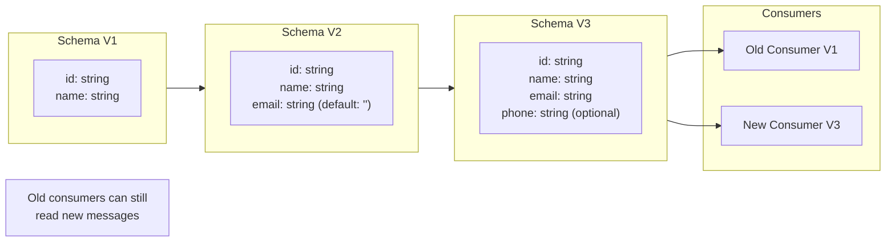
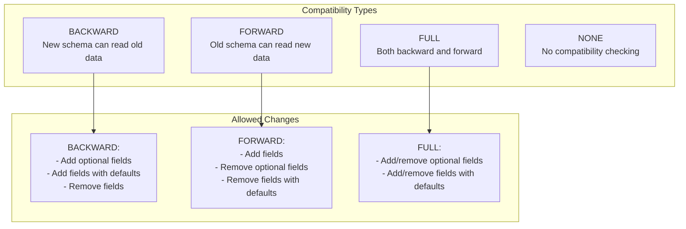

# How to Handle Schema Evolution with Kafka and Avro

Author: [nawazdhandala](https://www.github.com/nawazdhandala)

Tags: Kafka, Avro, Schema Registry, Schema Evolution, Data Serialization, Compatibility

Description: A practical guide to managing schema changes in Apache Kafka using Avro serialization and Schema Registry for safe, backward-compatible data evolution.

---

Schema evolution is one of the biggest challenges in event-driven architectures. As your application grows, you will inevitably need to add new fields, remove deprecated ones, or modify data types. Apache Avro combined with Confluent Schema Registry provides a robust solution for managing these changes safely. This guide covers schema evolution strategies, compatibility rules, and practical implementation patterns.

## Understanding Schema Evolution

Schema evolution allows producers and consumers to evolve independently while maintaining the ability to read data written with different schema versions.



## Setting Up Schema Registry

Schema Registry provides a central service for managing Avro schemas and enforcing compatibility rules.

### Docker Compose Setup

```yaml
version: '3.8'
services:
  zookeeper:
    image: confluentinc/cp-zookeeper:7.5.0
    environment:
      ZOOKEEPER_CLIENT_PORT: 2181
      ZOOKEEPER_TICK_TIME: 2000

  kafka:
    image: confluentinc/cp-kafka:7.5.0
    depends_on:
      - zookeeper
    ports:
      - "9092:9092"
    environment:
      KAFKA_BROKER_ID: 1
      KAFKA_ZOOKEEPER_CONNECT: zookeeper:2181
      KAFKA_ADVERTISED_LISTENERS: PLAINTEXT://localhost:9092
      KAFKA_OFFSETS_TOPIC_REPLICATION_FACTOR: 1

  schema-registry:
    image: confluentinc/cp-schema-registry:7.5.0
    depends_on:
      - kafka
    ports:
      - "8081:8081"
    environment:
      SCHEMA_REGISTRY_HOST_NAME: schema-registry
      SCHEMA_REGISTRY_KAFKASTORE_BOOTSTRAP_SERVERS: kafka:9092
      SCHEMA_REGISTRY_LISTENERS: http://0.0.0.0:8081
```

### Schema Registry Configuration

```properties
# schema-registry.properties

# Kafka connection
kafkastore.bootstrap.servers=kafka1:9092,kafka2:9092,kafka3:9092
kafkastore.topic=_schemas
kafkastore.topic.replication.factor=3

# Server configuration
listeners=http://0.0.0.0:8081
host.name=schema-registry

# Default compatibility level
schema.compatibility.level=BACKWARD

# Authentication (optional)
# authentication.method=BASIC
# authentication.realm=SchemaRegistry
```

## Avro Schema Basics

Avro schemas are defined in JSON format and support complex types.

### Basic Schema Definition

```json
{
  "type": "record",
  "name": "User",
  "namespace": "com.example.events",
  "doc": "Represents a user in the system",
  "fields": [
    {
      "name": "id",
      "type": "string",
      "doc": "Unique user identifier"
    },
    {
      "name": "name",
      "type": "string",
      "doc": "User's full name"
    },
    {
      "name": "email",
      "type": "string",
      "doc": "User's email address"
    },
    {
      "name": "created_at",
      "type": {
        "type": "long",
        "logicalType": "timestamp-millis"
      },
      "doc": "Account creation timestamp"
    }
  ]
}
```

### Complex Types

```json
{
  "type": "record",
  "name": "Order",
  "namespace": "com.example.events",
  "fields": [
    {
      "name": "order_id",
      "type": "string"
    },
    {
      "name": "customer",
      "type": {
        "type": "record",
        "name": "Customer",
        "fields": [
          {"name": "id", "type": "string"},
          {"name": "name", "type": "string"}
        ]
      }
    },
    {
      "name": "items",
      "type": {
        "type": "array",
        "items": {
          "type": "record",
          "name": "OrderItem",
          "fields": [
            {"name": "sku", "type": "string"},
            {"name": "quantity", "type": "int"},
            {"name": "price", "type": {"type": "bytes", "logicalType": "decimal", "precision": 10, "scale": 2}}
          ]
        }
      }
    },
    {
      "name": "status",
      "type": {
        "type": "enum",
        "name": "OrderStatus",
        "symbols": ["PENDING", "CONFIRMED", "SHIPPED", "DELIVERED", "CANCELLED"]
      }
    },
    {
      "name": "metadata",
      "type": {
        "type": "map",
        "values": "string"
      },
      "default": {}
    }
  ]
}
```

## Compatibility Types

Schema Registry supports several compatibility modes that control what schema changes are allowed.



### Setting Compatibility Level

```bash
# Set global default compatibility
curl -X PUT -H "Content-Type: application/vnd.schemaregistry.v1+json" \
    --data '{"compatibility": "BACKWARD"}' \
    http://localhost:8081/config

# Set compatibility for specific subject
curl -X PUT -H "Content-Type: application/vnd.schemaregistry.v1+json" \
    --data '{"compatibility": "FULL"}' \
    http://localhost:8081/config/user-events-value
```

## Schema Evolution Rules

### Backward Compatible Changes

Backward compatibility means new consumers can read data written by old producers.

```json
// Version 1: Original schema
{
  "type": "record",
  "name": "User",
  "namespace": "com.example",
  "fields": [
    {"name": "id", "type": "string"},
    {"name": "name", "type": "string"}
  ]
}

// Version 2: Add optional field with default (BACKWARD COMPATIBLE)
{
  "type": "record",
  "name": "User",
  "namespace": "com.example",
  "fields": [
    {"name": "id", "type": "string"},
    {"name": "name", "type": "string"},
    {"name": "email", "type": "string", "default": ""}
  ]
}

// Version 3: Add nullable field (BACKWARD COMPATIBLE)
{
  "type": "record",
  "name": "User",
  "namespace": "com.example",
  "fields": [
    {"name": "id", "type": "string"},
    {"name": "name", "type": "string"},
    {"name": "email", "type": "string", "default": ""},
    {"name": "phone", "type": ["null", "string"], "default": null}
  ]
}
```

### Forward Compatible Changes

Forward compatibility means old consumers can read data written by new producers.

```json
// Version 1: Original schema
{
  "type": "record",
  "name": "Event",
  "namespace": "com.example",
  "fields": [
    {"name": "event_id", "type": "string"},
    {"name": "event_type", "type": "string"},
    {"name": "timestamp", "type": "long"},
    {"name": "legacy_field", "type": "string", "default": ""}
  ]
}

// Version 2: Remove field with default (FORWARD COMPATIBLE)
{
  "type": "record",
  "name": "Event",
  "namespace": "com.example",
  "fields": [
    {"name": "event_id", "type": "string"},
    {"name": "event_type", "type": "string"},
    {"name": "timestamp", "type": "long"}
  ]
}
```

### Full Compatible Changes

Full compatibility requires both backward and forward compatibility.

```json
// Only changes that are both backward and forward compatible:
// - Adding fields with defaults
// - Removing fields with defaults
// - Adding/removing optional (union with null) fields

// Version 1
{
  "type": "record",
  "name": "Message",
  "fields": [
    {"name": "id", "type": "string"},
    {"name": "content", "type": "string"}
  ]
}

// Version 2: Add optional field (FULL COMPATIBLE)
{
  "type": "record",
  "name": "Message",
  "fields": [
    {"name": "id", "type": "string"},
    {"name": "content", "type": "string"},
    {"name": "metadata", "type": ["null", {"type": "map", "values": "string"}], "default": null}
  ]
}
```

## Java Implementation

### Maven Dependencies

```xml
<dependencies>
    <dependency>
        <groupId>org.apache.kafka</groupId>
        <artifactId>kafka-clients</artifactId>
        <version>3.6.0</version>
    </dependency>
    <dependency>
        <groupId>io.confluent</groupId>
        <artifactId>kafka-avro-serializer</artifactId>
        <version>7.5.0</version>
    </dependency>
    <dependency>
        <groupId>org.apache.avro</groupId>
        <artifactId>avro</artifactId>
        <version>1.11.3</version>
    </dependency>
</dependencies>

<repositories>
    <repository>
        <id>confluent</id>
        <url>https://packages.confluent.io/maven/</url>
    </repository>
</repositories>
```

### Avro Producer with Schema Registry

```java
import io.confluent.kafka.serializers.KafkaAvroSerializer;
import io.confluent.kafka.serializers.KafkaAvroSerializerConfig;
import org.apache.avro.Schema;
import org.apache.avro.generic.GenericData;
import org.apache.avro.generic.GenericRecord;
import org.apache.kafka.clients.producer.*;
import java.util.Properties;

public class AvroProducer {

    private final KafkaProducer<String, GenericRecord> producer;
    private final Schema userSchema;

    public AvroProducer(String bootstrapServers, String schemaRegistryUrl) {
        Properties props = new Properties();
        props.put(ProducerConfig.BOOTSTRAP_SERVERS_CONFIG, bootstrapServers);
        props.put(ProducerConfig.KEY_SERIALIZER_CLASS_CONFIG,
            "org.apache.kafka.common.serialization.StringSerializer");

        // Use Avro serializer for values
        props.put(ProducerConfig.VALUE_SERIALIZER_CLASS_CONFIG,
            KafkaAvroSerializer.class.getName());

        // Schema Registry configuration
        props.put(KafkaAvroSerializerConfig.SCHEMA_REGISTRY_URL_CONFIG, schemaRegistryUrl);

        // Automatically register new schemas
        props.put(KafkaAvroSerializerConfig.AUTO_REGISTER_SCHEMAS, true);

        // Use specific Avro reader (recommended for schema evolution)
        props.put(KafkaAvroSerializerConfig.USE_LATEST_VERSION, false);

        this.producer = new KafkaProducer<>(props);

        // Define the schema programmatically
        String schemaString = """
            {
              "type": "record",
              "name": "User",
              "namespace": "com.example.events",
              "fields": [
                {"name": "id", "type": "string"},
                {"name": "name", "type": "string"},
                {"name": "email", "type": "string", "default": ""},
                {"name": "phone", "type": ["null", "string"], "default": null},
                {"name": "created_at", "type": "long"}
              ]
            }
            """;
        this.userSchema = new Schema.Parser().parse(schemaString);
    }

    /**
     * Sends a user event using the Avro schema.
     * Schema Registry handles schema registration and compatibility checks.
     */
    public void sendUser(String topic, String userId, String name,
                         String email, String phone) throws Exception {

        // Create a generic record using the schema
        GenericRecord user = new GenericData.Record(userSchema);
        user.put("id", userId);
        user.put("name", name);
        user.put("email", email);
        user.put("phone", phone);  // Can be null
        user.put("created_at", System.currentTimeMillis());

        ProducerRecord<String, GenericRecord> record =
            new ProducerRecord<>(topic, userId, user);

        // Send and wait for acknowledgment
        RecordMetadata metadata = producer.send(record).get();

        System.out.printf("Sent user %s to partition %d at offset %d%n",
            userId, metadata.partition(), metadata.offset());
    }

    public void close() {
        producer.close();
    }

    public static void main(String[] args) throws Exception {
        AvroProducer producer = new AvroProducer(
            "localhost:9092",
            "http://localhost:8081"
        );

        producer.sendUser("users", "user-123", "John Doe", "john@example.com", "+1234567890");
        producer.sendUser("users", "user-456", "Jane Smith", "jane@example.com", null);

        producer.close();
    }
}
```

### Avro Consumer with Schema Evolution Support

```java
import io.confluent.kafka.serializers.KafkaAvroDeserializer;
import io.confluent.kafka.serializers.KafkaAvroDeserializerConfig;
import org.apache.avro.generic.GenericRecord;
import org.apache.kafka.clients.consumer.*;
import java.time.Duration;
import java.util.*;

public class AvroConsumer {

    private final KafkaConsumer<String, GenericRecord> consumer;

    public AvroConsumer(String bootstrapServers, String schemaRegistryUrl, String groupId) {
        Properties props = new Properties();
        props.put(ConsumerConfig.BOOTSTRAP_SERVERS_CONFIG, bootstrapServers);
        props.put(ConsumerConfig.GROUP_ID_CONFIG, groupId);
        props.put(ConsumerConfig.KEY_DESERIALIZER_CLASS_CONFIG,
            "org.apache.kafka.common.serialization.StringDeserializer");

        // Use Avro deserializer for values
        props.put(ConsumerConfig.VALUE_DESERIALIZER_CLASS_CONFIG,
            KafkaAvroDeserializer.class.getName());

        // Schema Registry configuration
        props.put(KafkaAvroDeserializerConfig.SCHEMA_REGISTRY_URL_CONFIG, schemaRegistryUrl);

        // Use specific Avro reader - important for schema evolution
        props.put(KafkaAvroDeserializerConfig.SPECIFIC_AVRO_READER_CONFIG, false);

        props.put(ConsumerConfig.AUTO_OFFSET_RESET_CONFIG, "earliest");

        this.consumer = new KafkaConsumer<>(props);
    }

    /**
     * Consumes messages and handles schema evolution gracefully.
     * New fields may be present, old fields may be missing.
     */
    public void consume(String topic) {
        consumer.subscribe(Collections.singletonList(topic));

        while (true) {
            ConsumerRecords<String, GenericRecord> records =
                consumer.poll(Duration.ofMillis(100));

            for (ConsumerRecord<String, GenericRecord> record : records) {
                GenericRecord user = record.value();

                // Safely access fields that may or may not exist
                String id = getStringField(user, "id");
                String name = getStringField(user, "name");
                String email = getStringField(user, "email");
                String phone = getStringField(user, "phone");
                Long createdAt = getLongField(user, "created_at");

                System.out.printf("Received user: id=%s, name=%s, email=%s, phone=%s, created=%d%n",
                    id, name, email, phone, createdAt);
            }

            consumer.commitSync();
        }
    }

    /**
     * Safely gets a string field, handling schema evolution.
     */
    private String getStringField(GenericRecord record, String fieldName) {
        try {
            Object value = record.get(fieldName);
            return value != null ? value.toString() : null;
        } catch (Exception e) {
            // Field doesn't exist in this schema version
            return null;
        }
    }

    /**
     * Safely gets a long field, handling schema evolution.
     */
    private Long getLongField(GenericRecord record, String fieldName) {
        try {
            Object value = record.get(fieldName);
            return value != null ? (Long) value : null;
        } catch (Exception e) {
            return null;
        }
    }

    public void close() {
        consumer.close();
    }

    public static void main(String[] args) {
        AvroConsumer consumer = new AvroConsumer(
            "localhost:9092",
            "http://localhost:8081",
            "user-consumer-group"
        );

        consumer.consume("users");
    }
}
```

### Generated Classes with Maven Plugin

For type-safe Avro classes, use the Avro Maven plugin.

```xml
<plugin>
    <groupId>org.apache.avro</groupId>
    <artifactId>avro-maven-plugin</artifactId>
    <version>1.11.3</version>
    <executions>
        <execution>
            <phase>generate-sources</phase>
            <goals>
                <goal>schema</goal>
            </goals>
            <configuration>
                <sourceDirectory>${project.basedir}/src/main/avro</sourceDirectory>
                <outputDirectory>${project.build.directory}/generated-sources/avro</outputDirectory>
            </configuration>
        </execution>
    </executions>
</plugin>
```

Place schema files in `src/main/avro/`:

```json
// src/main/avro/User.avsc
{
  "type": "record",
  "name": "User",
  "namespace": "com.example.events",
  "fields": [
    {"name": "id", "type": "string"},
    {"name": "name", "type": "string"},
    {"name": "email", "type": "string", "default": ""},
    {"name": "phone", "type": ["null", "string"], "default": null},
    {"name": "created_at", "type": "long"}
  ]
}
```

## Schema Evolution Patterns

### Pattern 1: Adding New Fields Safely

```java
public class SchemaEvolutionExample {

    // V1: Original schema
    private static final String SCHEMA_V1 = """
        {
          "type": "record",
          "name": "Event",
          "namespace": "com.example",
          "fields": [
            {"name": "event_id", "type": "string"},
            {"name": "event_type", "type": "string"},
            {"name": "timestamp", "type": "long"}
          ]
        }
        """;

    // V2: Add optional field with default
    private static final String SCHEMA_V2 = """
        {
          "type": "record",
          "name": "Event",
          "namespace": "com.example",
          "fields": [
            {"name": "event_id", "type": "string"},
            {"name": "event_type", "type": "string"},
            {"name": "timestamp", "type": "long"},
            {"name": "source", "type": "string", "default": "unknown"},
            {"name": "metadata", "type": ["null", {"type": "map", "values": "string"}], "default": null}
          ]
        }
        """;

    /**
     * Demonstrates reading V1 data with V2 schema (backward compatible).
     */
    public static void readWithEvolution() {
        Schema writerSchema = new Schema.Parser().parse(SCHEMA_V1);
        Schema readerSchema = new Schema.Parser().parse(SCHEMA_V2);

        // Create V1 record
        GenericRecord v1Record = new GenericData.Record(writerSchema);
        v1Record.put("event_id", "evt-123");
        v1Record.put("event_type", "user.created");
        v1Record.put("timestamp", System.currentTimeMillis());

        // Read with V2 schema - default values are applied
        GenericDatumReader<GenericRecord> reader =
            new GenericDatumReader<>(writerSchema, readerSchema);

        // After reading, new fields have default values
        // source = "unknown"
        // metadata = null
    }
}
```

### Pattern 2: Deprecating and Removing Fields

```java
public class FieldDeprecationExample {

    /**
     * Strategy for safely removing fields:
     * 1. Mark field as deprecated in documentation
     * 2. Stop writing to the field (write default/null)
     * 3. After all consumers updated, remove the field
     */

    // V1: Original with deprecated field
    private static final String SCHEMA_V1 = """
        {
          "type": "record",
          "name": "User",
          "fields": [
            {"name": "id", "type": "string"},
            {"name": "username", "type": "string"},
            {"name": "full_name", "type": "string"},
            {"name": "legacy_id", "type": "string", "default": "", "doc": "DEPRECATED: Use id instead"}
          ]
        }
        """;

    // V2: Field removed (requires FORWARD or FULL compatibility)
    private static final String SCHEMA_V2 = """
        {
          "type": "record",
          "name": "User",
          "fields": [
            {"name": "id", "type": "string"},
            {"name": "username", "type": "string"},
            {"name": "full_name", "type": "string"}
          ]
        }
        """;

    /**
     * Producer that writes V2 schema but is compatible with V1 consumers.
     */
    public void sendWithoutDeprecatedField(KafkaProducer<String, GenericRecord> producer,
                                           String topic) {
        Schema schema = new Schema.Parser().parse(SCHEMA_V2);
        GenericRecord record = new GenericData.Record(schema);

        record.put("id", "user-123");
        record.put("username", "johndoe");
        record.put("full_name", "John Doe");
        // legacy_id is not set - V1 consumers will see default ""

        producer.send(new ProducerRecord<>(topic, "user-123", record));
    }
}
```

### Pattern 3: Type Evolution with Unions

```java
public class TypeEvolutionExample {

    // V1: Single type field
    private static final String SCHEMA_V1 = """
        {
          "type": "record",
          "name": "Measurement",
          "fields": [
            {"name": "sensor_id", "type": "string"},
            {"name": "value", "type": "double"}
          ]
        }
        """;

    // V2: Allow multiple types using union
    private static final String SCHEMA_V2 = """
        {
          "type": "record",
          "name": "Measurement",
          "fields": [
            {"name": "sensor_id", "type": "string"},
            {"name": "value", "type": ["double", "long", "string"]}
          ]
        }
        """;

    /**
     * Handle reading values that could be different types.
     */
    public void processMeasurement(GenericRecord record) {
        Object value = record.get("value");

        double numericValue;
        if (value instanceof Double) {
            numericValue = (Double) value;
        } else if (value instanceof Long) {
            numericValue = ((Long) value).doubleValue();
        } else if (value instanceof CharSequence) {
            numericValue = Double.parseDouble(value.toString());
        } else {
            throw new IllegalArgumentException("Unexpected value type: " + value.getClass());
        }

        System.out.printf("Sensor %s: %.2f%n", record.get("sensor_id"), numericValue);
    }
}
```

## Schema Registry Operations

### Register and Retrieve Schemas

```bash
# Register a new schema
curl -X POST -H "Content-Type: application/vnd.schemaregistry.v1+json" \
    --data '{
      "schema": "{\"type\":\"record\",\"name\":\"User\",\"namespace\":\"com.example\",\"fields\":[{\"name\":\"id\",\"type\":\"string\"},{\"name\":\"name\",\"type\":\"string\"}]}"
    }' \
    http://localhost:8081/subjects/users-value/versions

# List all subjects
curl http://localhost:8081/subjects

# Get all versions for a subject
curl http://localhost:8081/subjects/users-value/versions

# Get specific version
curl http://localhost:8081/subjects/users-value/versions/1

# Get latest version
curl http://localhost:8081/subjects/users-value/versions/latest

# Check compatibility of new schema
curl -X POST -H "Content-Type: application/vnd.schemaregistry.v1+json" \
    --data '{
      "schema": "{\"type\":\"record\",\"name\":\"User\",\"namespace\":\"com.example\",\"fields\":[{\"name\":\"id\",\"type\":\"string\"},{\"name\":\"name\",\"type\":\"string\"},{\"name\":\"email\",\"type\":\"string\",\"default\":\"\"}]}"
    }' \
    http://localhost:8081/compatibility/subjects/users-value/versions/latest
```

### Schema Migration Script

```python
#!/usr/bin/env python3
"""
Schema migration tool for Confluent Schema Registry.
"""

import requests
import json
import sys

class SchemaRegistryClient:
    def __init__(self, url):
        self.url = url.rstrip('/')

    def get_subjects(self):
        """Get all subjects."""
        response = requests.get(f'{self.url}/subjects')
        response.raise_for_status()
        return response.json()

    def get_versions(self, subject):
        """Get all versions for a subject."""
        response = requests.get(f'{self.url}/subjects/{subject}/versions')
        response.raise_for_status()
        return response.json()

    def get_schema(self, subject, version='latest'):
        """Get schema for a specific version."""
        response = requests.get(f'{self.url}/subjects/{subject}/versions/{version}')
        response.raise_for_status()
        return response.json()

    def register_schema(self, subject, schema):
        """Register a new schema version."""
        headers = {'Content-Type': 'application/vnd.schemaregistry.v1+json'}
        data = {'schema': json.dumps(schema) if isinstance(schema, dict) else schema}
        response = requests.post(
            f'{self.url}/subjects/{subject}/versions',
            headers=headers,
            json=data
        )
        response.raise_for_status()
        return response.json()

    def check_compatibility(self, subject, schema, version='latest'):
        """Check if schema is compatible with existing versions."""
        headers = {'Content-Type': 'application/vnd.schemaregistry.v1+json'}
        data = {'schema': json.dumps(schema) if isinstance(schema, dict) else schema}
        response = requests.post(
            f'{self.url}/compatibility/subjects/{subject}/versions/{version}',
            headers=headers,
            json=data
        )
        response.raise_for_status()
        return response.json().get('is_compatible', False)

    def set_compatibility(self, subject, level):
        """Set compatibility level for a subject."""
        headers = {'Content-Type': 'application/vnd.schemaregistry.v1+json'}
        data = {'compatibility': level}
        response = requests.put(
            f'{self.url}/config/{subject}',
            headers=headers,
            json=data
        )
        response.raise_for_status()
        return response.json()


def migrate_schema(registry_url, subject, new_schema_file):
    """Migrate a subject to a new schema version."""
    client = SchemaRegistryClient(registry_url)

    # Load new schema
    with open(new_schema_file, 'r') as f:
        new_schema = json.load(f)

    print(f"Migrating subject: {subject}")

    # Get current schema
    try:
        current = client.get_schema(subject)
        print(f"Current version: {current['version']}")
    except requests.HTTPError as e:
        if e.response.status_code == 404:
            print("No existing schema, registering first version")
        else:
            raise

    # Check compatibility
    try:
        is_compatible = client.check_compatibility(subject, new_schema)
        if is_compatible:
            print("Schema is compatible with existing versions")
        else:
            print("WARNING: Schema is NOT compatible!")
            return False
    except requests.HTTPError:
        print("No existing schema to check compatibility against")

    # Register new version
    result = client.register_schema(subject, new_schema)
    print(f"Registered new schema version: {result['id']}")

    return True


if __name__ == '__main__':
    if len(sys.argv) != 4:
        print("Usage: python schema_migrate.py <registry_url> <subject> <schema_file>")
        sys.exit(1)

    migrate_schema(sys.argv[1], sys.argv[2], sys.argv[3])
```

## Best Practices

### 1. Always Use Default Values for New Fields

```json
{
  "name": "new_field",
  "type": "string",
  "default": ""
}
```

### 2. Use Unions for Optional Fields

```json
{
  "name": "optional_field",
  "type": ["null", "string"],
  "default": null
}
```

### 3. Document Schema Changes

```json
{
  "type": "record",
  "name": "Event",
  "doc": "Event schema v3. Added source field in v2, metadata in v3.",
  "fields": [
    {
      "name": "source",
      "type": "string",
      "default": "unknown",
      "doc": "Added in v2. Source system identifier."
    }
  ]
}
```

### 4. Test Compatibility Before Deployment

```bash
# Always test compatibility before deploying new schema
curl -X POST \
    -H "Content-Type: application/vnd.schemaregistry.v1+json" \
    --data @new-schema.json \
    http://localhost:8081/compatibility/subjects/my-topic-value/versions/latest
```

## Conclusion

Schema evolution with Kafka and Avro requires careful planning but provides powerful capabilities:

1. **Choose the right compatibility mode** based on your deployment model
2. **Always add fields with defaults** for backward compatibility
3. **Use Schema Registry** to enforce compatibility rules automatically
4. **Test schema changes** before deploying to production
5. **Document schema versions** for team coordination

By following these patterns, you can evolve your event schemas safely while maintaining compatibility between producers and consumers operating at different versions.
