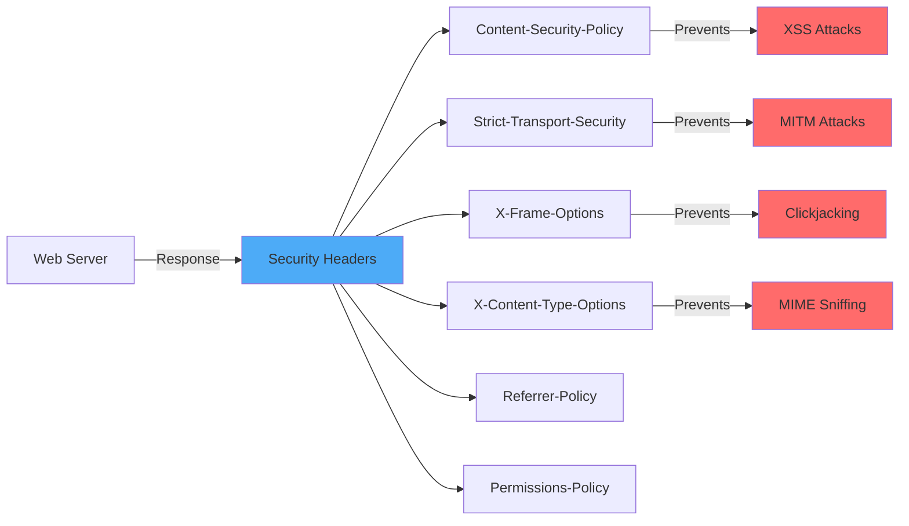

# How to Handle Security Headers

Author: [nawazdhandala](https://www.github.com/nawazdhandala)

Tags: Security, HTTP Headers, CSP, CORS, Web Security, DevOps

Description: Learn how to configure security headers to protect your web applications from XSS, clickjacking, and other common attacks.

---

Security headers are your first line of defense against many web attacks. They instruct browsers to enable built-in security features that protect users from cross-site scripting (XSS), clickjacking, MIME sniffing attacks, and more. This guide covers essential security headers and how to implement them correctly.

## Security Headers Overview



## Essential Security Headers

### 1. Content-Security-Policy (CSP)

CSP is the most powerful security header. It controls which resources can be loaded and executed.

```javascript
// Node.js/Express CSP middleware
function contentSecurityPolicy(options = {}) {
    const defaults = {
        defaultSrc: ["'self'"],
        scriptSrc: ["'self'"],
        styleSrc: ["'self'"],
        imgSrc: ["'self'", 'data:', 'https:'],
        fontSrc: ["'self'"],
        connectSrc: ["'self'"],
        frameSrc: ["'none'"],
        objectSrc: ["'none'"],
        baseUri: ["'self'"],
        formAction: ["'self'"],
        frameAncestors: ["'none'"],
        upgradeInsecureRequests: true
    };

    const config = { ...defaults, ...options };

    return (req, res, next) => {
        const directives = [];

        if (config.defaultSrc) {
            directives.push(`default-src ${config.defaultSrc.join(' ')}`);
        }
        if (config.scriptSrc) {
            directives.push(`script-src ${config.scriptSrc.join(' ')}`);
        }
        if (config.styleSrc) {
            directives.push(`style-src ${config.styleSrc.join(' ')}`);
        }
        if (config.imgSrc) {
            directives.push(`img-src ${config.imgSrc.join(' ')}`);
        }
        if (config.fontSrc) {
            directives.push(`font-src ${config.fontSrc.join(' ')}`);
        }
        if (config.connectSrc) {
            directives.push(`connect-src ${config.connectSrc.join(' ')}`);
        }
        if (config.frameSrc) {
            directives.push(`frame-src ${config.frameSrc.join(' ')}`);
        }
        if (config.objectSrc) {
            directives.push(`object-src ${config.objectSrc.join(' ')}`);
        }
        if (config.baseUri) {
            directives.push(`base-uri ${config.baseUri.join(' ')}`);
        }
        if (config.formAction) {
            directives.push(`form-action ${config.formAction.join(' ')}`);
        }
        if (config.frameAncestors) {
            directives.push(`frame-ancestors ${config.frameAncestors.join(' ')}`);
        }
        if (config.upgradeInsecureRequests) {
            directives.push('upgrade-insecure-requests');
        }

        res.setHeader('Content-Security-Policy', directives.join('; '));
        next();
    };
}

// Usage with custom configuration
app.use(contentSecurityPolicy({
    defaultSrc: ["'self'"],
    scriptSrc: ["'self'", 'https://cdn.example.com'],
    styleSrc: ["'self'", "'unsafe-inline'"],  // Required for some CSS frameworks
    imgSrc: ["'self'", 'data:', 'https://images.example.com'],
    connectSrc: ["'self'", 'https://api.example.com', 'wss://ws.example.com'],
    fontSrc: ["'self'", 'https://fonts.gstatic.com'],
    frameAncestors: ["'none'"]
}));
```

### CSP with Nonces for Inline Scripts

For applications that need inline scripts, use nonces:

```javascript
// csp-nonce.js
const crypto = require('crypto');

function cspWithNonce() {
    return (req, res, next) => {
        // Generate unique nonce for this request
        const nonce = crypto.randomBytes(16).toString('base64');
        res.locals.cspNonce = nonce;

        const csp = [
            "default-src 'self'",
            `script-src 'self' 'nonce-${nonce}'`,
            `style-src 'self' 'nonce-${nonce}'`,
            "img-src 'self' data: https:",
            "font-src 'self'",
            "connect-src 'self'",
            "frame-ancestors 'none'",
            "base-uri 'self'",
            "form-action 'self'"
        ].join('; ');

        res.setHeader('Content-Security-Policy', csp);
        next();
    };
}

// In your template (EJS example)
// <script nonce="<%= cspNonce %>">
//     // Inline script here
// </script>
```

### 2. Strict-Transport-Security (HSTS)

Forces browsers to use HTTPS for all future requests.

```javascript
function hstsHeader(options = {}) {
    const maxAge = options.maxAge || 31536000;  // 1 year
    const includeSubDomains = options.includeSubDomains !== false;
    const preload = options.preload || false;

    return (req, res, next) => {
        let header = `max-age=${maxAge}`;

        if (includeSubDomains) {
            header += '; includeSubDomains';
        }

        if (preload) {
            header += '; preload';
        }

        res.setHeader('Strict-Transport-Security', header);
        next();
    };
}

// Usage - start with shorter max-age, then increase
app.use(hstsHeader({
    maxAge: 31536000,      // 1 year
    includeSubDomains: true,
    preload: true          // Only after testing thoroughly
}));
```

### 3. X-Frame-Options and frame-ancestors

Prevents clickjacking attacks.

```javascript
function frameOptionsHeader(option = 'DENY') {
    // Options: DENY, SAMEORIGIN, or ALLOW-FROM uri
    return (req, res, next) => {
        res.setHeader('X-Frame-Options', option);
        next();
    };
}

// Note: X-Frame-Options is largely replaced by CSP frame-ancestors
// Use both for backward compatibility
```

### 4. X-Content-Type-Options

Prevents MIME type sniffing.

```javascript
function noSniffHeader() {
    return (req, res, next) => {
        res.setHeader('X-Content-Type-Options', 'nosniff');
        next();
    };
}
```

### 5. Referrer-Policy

Controls how much referrer information is sent.

```javascript
function referrerPolicy(policy = 'strict-origin-when-cross-origin') {
    // Options:
    // no-referrer
    // no-referrer-when-downgrade
    // origin
    // origin-when-cross-origin
    // same-origin
    // strict-origin
    // strict-origin-when-cross-origin
    // unsafe-url

    return (req, res, next) => {
        res.setHeader('Referrer-Policy', policy);
        next();
    };
}
```

### 6. Permissions-Policy (formerly Feature-Policy)

Controls browser features your site can use.

```javascript
function permissionsPolicy(options = {}) {
    const defaults = {
        geolocation: [],
        microphone: [],
        camera: [],
        payment: ["'self'"],
        usb: [],
        accelerometer: [],
        gyroscope: [],
        magnetometer: [],
        fullscreen: ["'self'"],
        pictureInPicture: ["'self'"]
    };

    const config = { ...defaults, ...options };

    return (req, res, next) => {
        const directives = Object.entries(config).map(([feature, allowlist]) => {
            const value = allowlist.length ? allowlist.join(' ') : '()';
            // Convert camelCase to kebab-case
            const featureName = feature.replace(/([A-Z])/g, '-$1').toLowerCase();
            return `${featureName}=${value === '()' ? value : `(${value})`}`;
        });

        res.setHeader('Permissions-Policy', directives.join(', '));
        next();
    };
}
```

## Complete Security Headers Middleware

```javascript
// security-headers.js
const crypto = require('crypto');

function securityHeaders(options = {}) {
    return (req, res, next) => {
        // Generate CSP nonce
        const nonce = crypto.randomBytes(16).toString('base64');
        res.locals.cspNonce = nonce;

        // Content-Security-Policy
        const cspDirectives = [
            `default-src 'self'`,
            `script-src 'self' 'nonce-${nonce}'${options.scriptSrc ? ' ' + options.scriptSrc.join(' ') : ''}`,
            `style-src 'self' 'nonce-${nonce}'${options.styleSrc ? ' ' + options.styleSrc.join(' ') : ''}`,
            `img-src 'self' data: https:`,
            `font-src 'self'${options.fontSrc ? ' ' + options.fontSrc.join(' ') : ''}`,
            `connect-src 'self'${options.connectSrc ? ' ' + options.connectSrc.join(' ') : ''}`,
            `frame-src 'none'`,
            `object-src 'none'`,
            `base-uri 'self'`,
            `form-action 'self'`,
            `frame-ancestors 'none'`,
            `upgrade-insecure-requests`
        ];

        res.setHeader('Content-Security-Policy', cspDirectives.join('; '));

        // HSTS - Force HTTPS
        res.setHeader('Strict-Transport-Security', 'max-age=31536000; includeSubDomains; preload');

        // Prevent clickjacking
        res.setHeader('X-Frame-Options', 'DENY');

        // Prevent MIME sniffing
        res.setHeader('X-Content-Type-Options', 'nosniff');

        // Control referrer information
        res.setHeader('Referrer-Policy', 'strict-origin-when-cross-origin');

        // Permissions Policy
        res.setHeader('Permissions-Policy',
            'geolocation=(), microphone=(), camera=(), payment=(self), usb=()');

        // Cross-Origin policies
        res.setHeader('Cross-Origin-Opener-Policy', 'same-origin');
        res.setHeader('Cross-Origin-Embedder-Policy', 'require-corp');
        res.setHeader('Cross-Origin-Resource-Policy', 'same-origin');

        // Remove server identification
        res.removeHeader('X-Powered-By');

        next();
    };
}

module.exports = securityHeaders;
```

## NGINX Security Headers Configuration

```nginx
# /etc/nginx/conf.d/security-headers.conf

# Content-Security-Policy
add_header Content-Security-Policy "default-src 'self'; script-src 'self'; style-src 'self' 'unsafe-inline'; img-src 'self' data: https:; font-src 'self'; connect-src 'self'; frame-ancestors 'none'; base-uri 'self'; form-action 'self';" always;

# HSTS - Force HTTPS for 1 year
add_header Strict-Transport-Security "max-age=31536000; includeSubDomains; preload" always;

# Prevent clickjacking
add_header X-Frame-Options "DENY" always;

# Prevent MIME sniffing
add_header X-Content-Type-Options "nosniff" always;

# Referrer Policy
add_header Referrer-Policy "strict-origin-when-cross-origin" always;

# Permissions Policy
add_header Permissions-Policy "geolocation=(), microphone=(), camera=()" always;

# Cross-Origin policies
add_header Cross-Origin-Opener-Policy "same-origin" always;
add_header Cross-Origin-Embedder-Policy "require-corp" always;
add_header Cross-Origin-Resource-Policy "same-origin" always;

# Hide server version
server_tokens off;
```

## CSP Reporting

Set up CSP violation reporting to monitor issues:

```javascript
// CSP with reporting
const cspWithReporting = [
    "default-src 'self'",
    "script-src 'self'",
    "report-uri /api/csp-report",
    "report-to csp-endpoint"
].join('; ');

// Report-To header for modern browsers
const reportTo = JSON.stringify({
    group: 'csp-endpoint',
    max_age: 86400,
    endpoints: [{ url: '/api/csp-report' }]
});

app.use((req, res, next) => {
    res.setHeader('Content-Security-Policy', cspWithReporting);
    res.setHeader('Report-To', reportTo);
    next();
});

// CSP report endpoint
app.post('/api/csp-report', express.json({ type: 'application/csp-report' }), (req, res) => {
    const report = req.body['csp-report'];
    console.log('CSP Violation:', {
        blockedUri: report['blocked-uri'],
        violatedDirective: report['violated-directive'],
        documentUri: report['document-uri'],
        sourceFile: report['source-file'],
        lineNumber: report['line-number']
    });
    res.status(204).end();
});
```

## Security Headers Testing

```javascript
// Test your security headers
async function testSecurityHeaders(url) {
    const response = await fetch(url);
    const headers = response.headers;

    const checks = {
        'Content-Security-Policy': headers.get('content-security-policy'),
        'Strict-Transport-Security': headers.get('strict-transport-security'),
        'X-Frame-Options': headers.get('x-frame-options'),
        'X-Content-Type-Options': headers.get('x-content-type-options'),
        'Referrer-Policy': headers.get('referrer-policy'),
        'Permissions-Policy': headers.get('permissions-policy')
    };

    console.log('Security Headers Check:');
    for (const [header, value] of Object.entries(checks)) {
        const status = value ? 'Present' : 'MISSING';
        console.log(`  ${header}: ${status}`);
        if (value) console.log(`    Value: ${value.substring(0, 100)}...`);
    }
}
```

## Security Headers Reference

| Header | Purpose | Recommended Value |
|--------|---------|-------------------|
| Content-Security-Policy | Prevent XSS, injection | Strict policy based on needs |
| Strict-Transport-Security | Force HTTPS | max-age=31536000; includeSubDomains |
| X-Frame-Options | Prevent clickjacking | DENY |
| X-Content-Type-Options | Prevent MIME sniffing | nosniff |
| Referrer-Policy | Control referrer data | strict-origin-when-cross-origin |
| Permissions-Policy | Limit browser features | Disable unused features |
| Cross-Origin-Opener-Policy | Isolate browsing context | same-origin |
| Cross-Origin-Embedder-Policy | Control embedding | require-corp |

## Summary

Security headers are essential for web application security. Start with a strict CSP and progressively refine it based on your application's needs. Use CSP reporting to catch violations without breaking functionality. Test your headers regularly using tools like securityheaders.com or Mozilla Observatory. Remember that security headers work together - implementing all of them provides defense in depth against various attack vectors.
