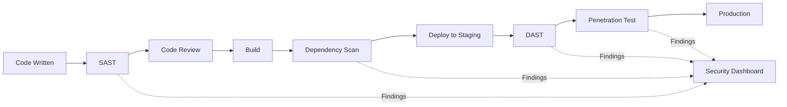

# How to Handle Security Testing

Author: [nawazdhandala](https://www.github.com/nawazdhandala)

Tags: Security, Testing, OWASP, Penetration Testing, Vulnerability Scanning, SAST, DAST, DevSecOps

Description: Learn how to implement comprehensive security testing in your development workflow, including static analysis, dynamic testing, dependency scanning, and penetration testing.

---

> Security vulnerabilities cost organizations millions in breaches. Integrating security testing into your development workflow catches issues early when they are cheapest to fix.

Security testing is not a one-time activity but a continuous process that should be embedded throughout the software development lifecycle.

---

## Security Testing Overview



---

## Static Application Security Testing (SAST)

SAST analyzes source code without executing it, finding vulnerabilities early in development.

### Setting Up Bandit for Python

```python
# Install bandit for Python security scanning
# pip install bandit

# Example vulnerable code that bandit would flag
# security_issues.py

import subprocess
import pickle
import yaml

# B602: subprocess call with shell=True (command injection risk)
def run_command(user_input):
    # VULNERABLE: shell injection
    subprocess.call(f"echo {user_input}", shell=True)


# B301: pickle usage (arbitrary code execution risk)
def load_data(filename):
    # VULNERABLE: pickle can execute arbitrary code
    with open(filename, 'rb') as f:
        return pickle.load(f)


# B506: yaml.load without SafeLoader (code execution risk)
def parse_config(config_string):
    # VULNERABLE: yaml.load can execute code
    return yaml.load(config_string)
```

Run bandit to find these issues:

```bash
# Scan single file
bandit security_issues.py

# Scan entire project
bandit -r ./src -f json -o bandit-report.json

# Exclude test files
bandit -r ./src --exclude ./src/tests

# Set severity threshold
bandit -r ./src -ll  # Only medium and high severity
```

### Fixed Version of the Code

```python
# security_fixed.py
# Secure alternatives to common vulnerabilities

import subprocess
import json
import yaml

def run_command_safe(user_input):
    # SAFE: Use list form, no shell
    # Validate input first
    allowed_commands = ['status', 'info', 'version']
    if user_input not in allowed_commands:
        raise ValueError(f"Invalid command: {user_input}")

    result = subprocess.run(
        ['myapp', user_input],
        capture_output=True,
        text=True,
        timeout=30
    )
    return result.stdout


def load_data_safe(filename):
    # SAFE: Use JSON instead of pickle
    with open(filename, 'r') as f:
        return json.load(f)


def parse_config_safe(config_string):
    # SAFE: Use SafeLoader
    return yaml.safe_load(config_string)
```

### ESLint Security Plugin for JavaScript

```javascript
// .eslintrc.js
// Security-focused ESLint configuration

module.exports = {
    plugins: ['security'],
    extends: ['plugin:security/recommended'],
    rules: {
        // Detect potential RegEx DoS
        'security/detect-unsafe-regex': 'error',

        // Detect buffer() calls (use Buffer.alloc instead)
        'security/detect-buffer-noassert': 'error',

        // Detect eval() usage
        'security/detect-eval-with-expression': 'error',

        // Detect non-literal require() calls
        'security/detect-non-literal-require': 'warn',

        // Detect SQL injection patterns
        'security/detect-possible-timing-attacks': 'warn',
    }
};
```

---

## Dynamic Application Security Testing (DAST)

DAST tests running applications by simulating attacks.

### Using OWASP ZAP for API Testing

```python
# zap_scan.py
# Automated ZAP scanning script

import requests
import time
from zapv2 import ZAPv2

# Connect to ZAP proxy
zap = ZAPv2(apikey='your-api-key', proxies={
    'http': 'http://127.0.0.1:8080',
    'https': 'http://127.0.0.1:8080'
})

def run_security_scan(target_url):
    """Run automated security scan against target."""

    print(f"Starting scan of {target_url}")

    # Spider the target to discover endpoints
    scan_id = zap.spider.scan(target_url)
    while int(zap.spider.status(scan_id)) < 100:
        print(f"Spider progress: {zap.spider.status(scan_id)}%")
        time.sleep(2)

    print("Spider complete. Starting active scan...")

    # Run active scan (actually tests for vulnerabilities)
    scan_id = zap.ascan.scan(target_url)
    while int(zap.ascan.status(scan_id)) < 100:
        print(f"Active scan progress: {zap.ascan.status(scan_id)}%")
        time.sleep(5)

    # Get results
    alerts = zap.core.alerts(baseurl=target_url)

    # Categorize by risk
    high_risk = [a for a in alerts if a['risk'] == 'High']
    medium_risk = [a for a in alerts if a['risk'] == 'Medium']
    low_risk = [a for a in alerts if a['risk'] == 'Low']

    print(f"\nScan Results:")
    print(f"  High Risk: {len(high_risk)}")
    print(f"  Medium Risk: {len(medium_risk)}")
    print(f"  Low Risk: {len(low_risk)}")

    return alerts


if __name__ == '__main__':
    alerts = run_security_scan('http://localhost:8000')

    # Fail CI if high risk issues found
    high_risk = [a for a in alerts if a['risk'] == 'High']
    if high_risk:
        print("\nHigh risk vulnerabilities found:")
        for alert in high_risk:
            print(f"  - {alert['name']}: {alert['url']}")
        exit(1)
```

---

## Dependency Vulnerability Scanning

### Python: Safety and pip-audit

```bash
# Install scanning tools
pip install safety pip-audit

# Scan with safety
safety check --json --output safety-report.json

# Scan with pip-audit (more up-to-date database)
pip-audit --format json --output pip-audit-report.json
```

### JavaScript: npm audit

```bash
# Built-in npm audit
npm audit --json > npm-audit-report.json

# Fix automatically where possible
npm audit fix

# Audit with specific severity threshold
npm audit --audit-level=high
```

### Integrating into CI/CD

```yaml
# .github/workflows/security.yml
# GitHub Actions security scanning workflow

name: Security Scan

on:
  push:
    branches: [main, develop]
  pull_request:
    branches: [main]
  schedule:
    # Run daily at midnight
    - cron: '0 0 * * *'

jobs:
  sast:
    name: Static Analysis
    runs-on: ubuntu-latest
    steps:
      - uses: actions/checkout@v4

      - name: Set up Python
        uses: actions/setup-python@v5
        with:
          python-version: '3.11'

      - name: Install dependencies
        run: |
          pip install bandit safety

      - name: Run Bandit
        run: |
          bandit -r ./src -f json -o bandit-report.json || true

      - name: Check Bandit Results
        run: |
          python -c "
          import json
          with open('bandit-report.json') as f:
              report = json.load(f)
          high_sev = [r for r in report['results'] if r['issue_severity'] == 'HIGH']
          if high_sev:
              print('High severity issues found:')
              for issue in high_sev:
                  print(f\"  {issue['filename']}:{issue['line_number']} - {issue['issue_text']}\")
              exit(1)
          "

  dependency-scan:
    name: Dependency Scan
    runs-on: ubuntu-latest
    steps:
      - uses: actions/checkout@v4

      - name: Set up Python
        uses: actions/setup-python@v5
        with:
          python-version: '3.11'

      - name: Install dependencies
        run: |
          pip install -r requirements.txt
          pip install pip-audit

      - name: Run pip-audit
        run: pip-audit --strict

  dast:
    name: Dynamic Testing
    runs-on: ubuntu-latest
    needs: [sast, dependency-scan]
    steps:
      - uses: actions/checkout@v4

      - name: Start application
        run: |
          docker-compose up -d
          sleep 30  # Wait for app to be ready

      - name: ZAP Baseline Scan
        uses: zaproxy/action-baseline@v0.10.0
        with:
          target: 'http://localhost:8000'
          rules_file_name: '.zap-rules.tsv'
```

---

## Writing Security-Focused Tests

```python
# tests/test_security.py
# Security-specific test cases

import pytest
from app import create_app
from app.models import User

class TestAuthenticationSecurity:
    """Tests for authentication security."""

    def test_password_not_stored_plaintext(self, db_session):
        """Verify passwords are hashed, not stored in plaintext."""
        user = User.create(
            email="test@example.com",
            password="secretpassword123"
        )
        db_session.commit()

        # Password should be hashed
        assert user.password_hash != "secretpassword123"
        assert len(user.password_hash) > 50  # Proper hash length

    def test_timing_safe_password_comparison(self):
        """Verify password comparison is timing-safe."""
        import time

        user = User.create(email="test@example.com", password="correct")

        # Measure time for correct password
        start = time.perf_counter()
        for _ in range(1000):
            user.check_password("correct")
        correct_time = time.perf_counter() - start

        # Measure time for wrong password (same length)
        start = time.perf_counter()
        for _ in range(1000):
            user.check_password("wronggg")
        wrong_time = time.perf_counter() - start

        # Times should be similar (within 20%)
        ratio = correct_time / wrong_time
        assert 0.8 < ratio < 1.2, "Password comparison may be vulnerable to timing attacks"

    def test_sql_injection_prevention(self, client):
        """Test that SQL injection attempts are blocked."""
        malicious_inputs = [
            "'; DROP TABLE users; --",
            "1 OR 1=1",
            "admin'--",
            "1; SELECT * FROM users",
        ]

        for payload in malicious_inputs:
            response = client.get(f"/api/users?id={payload}")
            # Should not cause server error (500)
            assert response.status_code != 500
            # Should not return all users
            assert len(response.json.get('users', [])) <= 1

    def test_xss_prevention(self, client):
        """Test that XSS payloads are escaped."""
        xss_payloads = [
            "<script>alert('xss')</script>",
            "",
            "javascript:alert('xss')",
        ]

        for payload in xss_payloads:
            response = client.post("/api/comments", json={
                "content": payload
            })

            # Payload should be escaped in response
            if response.status_code == 201:
                assert "<script>" not in response.text
                assert "onerror=" not in response.text


class TestAuthorizationSecurity:
    """Tests for authorization and access control."""

    def test_cannot_access_other_users_data(self, client, auth_headers):
        """Users cannot access other users' private data."""
        # Create two users
        user1 = create_user("user1@example.com")
        user2 = create_user("user2@example.com")

        # User1 tries to access User2's private data
        response = client.get(
            f"/api/users/{user2.id}/private",
            headers=auth_headers(user1)
        )

        assert response.status_code == 403

    def test_rate_limiting_on_login(self, client):
        """Verify rate limiting prevents brute force attacks."""
        # Attempt many failed logins
        for i in range(20):
            response = client.post("/api/login", json={
                "email": "test@example.com",
                "password": f"wrongpassword{i}"
            })

        # Should be rate limited
        assert response.status_code == 429
        assert "rate limit" in response.json.get("error", "").lower()
```

---

## Security Testing Checklist

| Category | Test |
|----------|------|
| Authentication | Password hashing, session management, MFA |
| Authorization | Access control, privilege escalation |
| Input Validation | SQL injection, XSS, command injection |
| Data Protection | Encryption at rest, encryption in transit |
| Error Handling | No sensitive data in errors |
| Dependencies | Known vulnerabilities |
| Configuration | Security headers, CORS, HTTPS |

---

## Tools Quick Reference

| Tool | Type | Language |
|------|------|----------|
| Bandit | SAST | Python |
| ESLint Security | SAST | JavaScript |
| Semgrep | SAST | Multiple |
| OWASP ZAP | DAST | Any web app |
| Burp Suite | DAST | Any web app |
| Safety/pip-audit | Dependency | Python |
| npm audit | Dependency | JavaScript |
| Trivy | Container | Docker |

---

*Need to monitor security across your infrastructure? [OneUptime](https://oneuptime.com) provides comprehensive monitoring with security alerting and incident management.*

**Related Reading:**
- [How to Fix "Browser Compatibility" Test Issues](/blog/post/2026-01-24-fix-browser-compatibility-test-issues/view)
- [How to Fix "Assertion" Failures in Tests](/blog/post/2026-01-24-fix-assertion-failures-tests/view)
