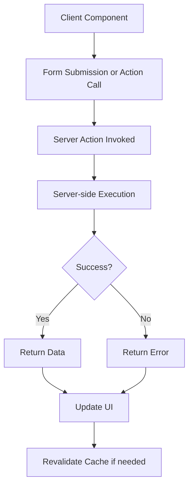
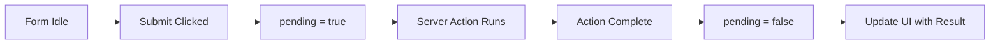
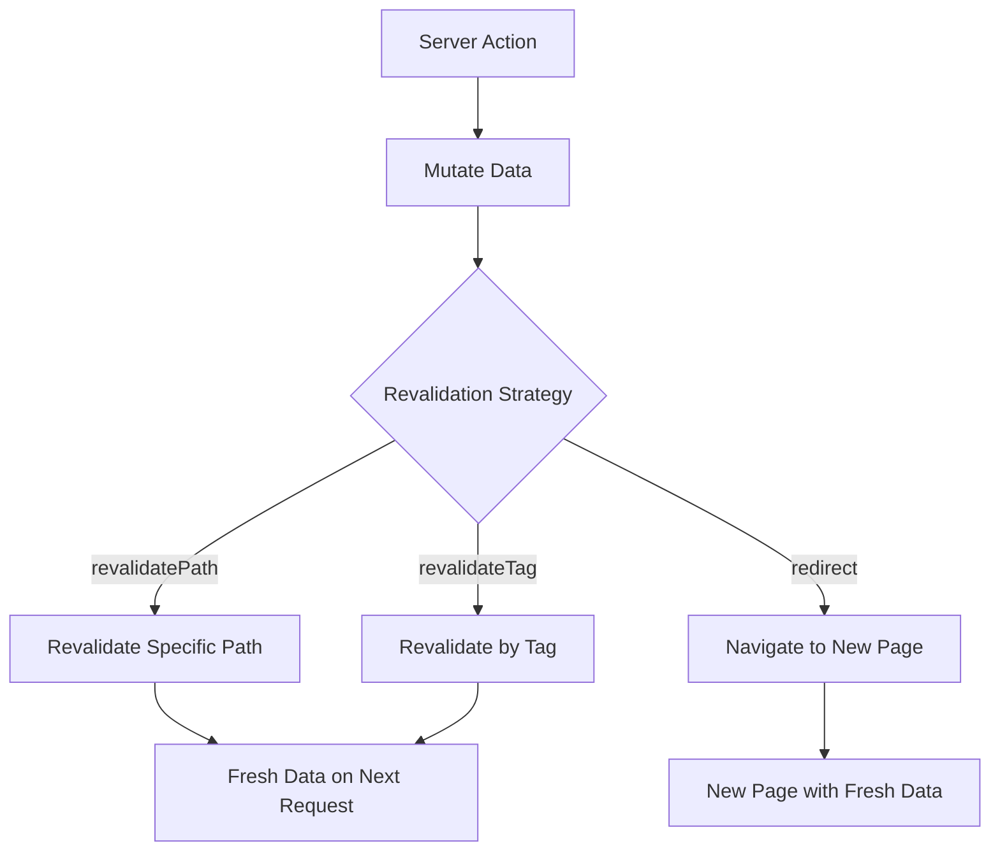

# How to Handle Server Actions in Next.js 14

Author: [nawazdhandala](https://www.github.com/nawazdhandala)

Tags: Next.js, Server Actions, React, Forms, Data Mutations, App Router, Full-stack

Description: A comprehensive guide to implementing and handling Server Actions in Next.js 14 for seamless server-side data mutations.

---

Server Actions are a powerful feature in Next.js 14 that allow you to run server-side code directly from your React components. They simplify form handling, data mutations, and eliminate the need for separate API routes in many scenarios. This guide covers everything you need to know about implementing Server Actions effectively.

## Understanding Server Actions Architecture

Server Actions create a seamless bridge between your client components and server-side logic:



## Basic Server Action Syntax

### Inline Server Actions

```javascript
// app/page.js
export default function Page() {
  // Define server action inline with 'use server' directive
  async function handleSubmit(formData) {
    'use server';

    const name = formData.get('name');
    const email = formData.get('email');

    // This runs on the server
    await saveToDatabase({ name, email });
  }

  return (
    <form action={handleSubmit}>
      <input type="text" name="name" placeholder="Name" required />
      <input type="email" name="email" placeholder="Email" required />
      <button type="submit">Submit</button>
    </form>
  );
}
```

### Separate Action Files

```javascript
// app/actions.js
'use server';

// All exports from this file are server actions
export async function createUser(formData) {
  const name = formData.get('name');
  const email = formData.get('email');

  const user = await prisma.user.create({
    data: { name, email },
  });

  return { success: true, user };
}

export async function updateUser(userId, formData) {
  const name = formData.get('name');

  const user = await prisma.user.update({
    where: { id: userId },
    data: { name },
  });

  return { success: true, user };
}

export async function deleteUser(userId) {
  await prisma.user.delete({
    where: { id: userId },
  });

  return { success: true };
}
```

```jsx
// app/users/page.js
import { createUser } from '../actions';

export default function UsersPage() {
  return (
    <form action={createUser}>
      <input type="text" name="name" required />
      <input type="email" name="email" required />
      <button type="submit">Create User</button>
    </form>
  );
}
```

## Form Handling with useFormState

The useFormState hook provides access to the form's state including errors and return values:

```javascript
// app/actions.js
'use server';

export async function signUp(prevState, formData) {
  const email = formData.get('email');
  const password = formData.get('password');

  // Validate input
  if (!email || !email.includes('@')) {
    return {
      success: false,
      error: 'Please enter a valid email address',
    };
  }

  if (!password || password.length < 8) {
    return {
      success: false,
      error: 'Password must be at least 8 characters',
    };
  }

  try {
    // Check if user exists
    const existingUser = await prisma.user.findUnique({
      where: { email },
    });

    if (existingUser) {
      return {
        success: false,
        error: 'An account with this email already exists',
      };
    }

    // Create user
    const hashedPassword = await hashPassword(password);
    await prisma.user.create({
      data: { email, password: hashedPassword },
    });

    return {
      success: true,
      message: 'Account created successfully',
    };
  } catch (error) {
    return {
      success: false,
      error: 'Something went wrong. Please try again.',
    };
  }
}
```

```jsx
// app/signup/page.js
'use client';

import { useFormState, useFormStatus } from 'react-dom';
import { signUp } from '../actions';

// Initial state for the form
const initialState = {
  success: false,
  error: null,
  message: null,
};

// Submit button component with loading state
function SubmitButton() {
  const { pending } = useFormStatus();

  return (
    <button type="submit" disabled={pending}>
      {pending ? 'Creating Account...' : 'Sign Up'}
    </button>
  );
}

export default function SignUpPage() {
  const [state, formAction] = useFormState(signUp, initialState);

  return (
    <div>
      <h1>Create Account</h1>

      <form action={formAction}>
        <div>
          <label htmlFor="email">Email</label>
          <input
            type="email"
            id="email"
            name="email"
            required
          />
        </div>

        <div>
          <label htmlFor="password">Password</label>
          <input
            type="password"
            id="password"
            name="password"
            required
            minLength={8}
          />
        </div>

        {state.error && (
          <div className="error">{state.error}</div>
        )}

        {state.success && (
          <div className="success">{state.message}</div>
        )}

        <SubmitButton />
      </form>
    </div>
  );
}
```

## Handling Loading States with useFormStatus



```jsx
// components/SubmitButton.jsx
'use client';

import { useFormStatus } from 'react-dom';

export default function SubmitButton({ children, loadingText = 'Processing...' }) {
  const { pending, data, method, action } = useFormStatus();

  return (
    <button
      type="submit"
      disabled={pending}
      className={pending ? 'loading' : ''}
    >
      {pending ? (
        <>
          <span className="spinner" />
          {loadingText}
        </>
      ) : (
        children
      )}
    </button>
  );
}
```

## Optimistic Updates with useOptimistic

```jsx
// app/messages/page.js
'use client';

import { useOptimistic, useState, useRef } from 'react';
import { sendMessage } from '../actions';

export default function MessagesPage({ messages: initialMessages }) {
  const [messages, setMessages] = useState(initialMessages);
  const formRef = useRef(null);

  // Create optimistic state
  const [optimisticMessages, addOptimisticMessage] = useOptimistic(
    messages,
    (state, newMessage) => [...state, newMessage]
  );

  async function handleSubmit(formData) {
    const content = formData.get('content');

    // Create optimistic message
    const optimisticMessage = {
      id: `temp-${Date.now()}`,
      content,
      createdAt: new Date().toISOString(),
      status: 'sending',
    };

    // Add to optimistic state immediately
    addOptimisticMessage(optimisticMessage);

    // Clear form
    formRef.current?.reset();

    // Send to server
    const result = await sendMessage(formData);

    if (result.success) {
      // Replace optimistic message with real one
      setMessages((prev) => [
        ...prev.filter((m) => m.id !== optimisticMessage.id),
        result.message,
      ]);
    } else {
      // Remove optimistic message on failure
      setMessages((prev) =>
        prev.filter((m) => m.id !== optimisticMessage.id)
      );
      alert(result.error);
    }
  }

  return (
    <div>
      <div className="messages">
        {optimisticMessages.map((message) => (
          <div
            key={message.id}
            className={`message ${message.status === 'sending' ? 'sending' : ''}`}
          >
            <p>{message.content}</p>
            {message.status === 'sending' && (
              <span className="status">Sending...</span>
            )}
          </div>
        ))}
      </div>

      <form ref={formRef} action={handleSubmit}>
        <input
          type="text"
          name="content"
          placeholder="Type a message..."
          required
        />
        <button type="submit">Send</button>
      </form>
    </div>
  );
}
```

## Server Actions with Arguments

```javascript
// app/actions.js
'use server';

import { revalidatePath } from 'next/cache';

// Action with bound arguments
export async function updateProduct(productId, formData) {
  const name = formData.get('name');
  const price = parseFloat(formData.get('price'));
  const description = formData.get('description');

  await prisma.product.update({
    where: { id: productId },
    data: { name, price, description },
  });

  revalidatePath('/products');
  return { success: true };
}

// Action to toggle status
export async function togglePublished(postId, currentStatus) {
  await prisma.post.update({
    where: { id: postId },
    data: { published: !currentStatus },
  });

  revalidatePath('/posts');
}
```

```jsx
// app/products/[id]/edit/page.js
import { updateProduct } from '../../../actions';

export default async function EditProductPage({ params }) {
  const { id } = await params;
  const product = await getProduct(id);

  // Bind the product ID to the action
  const updateProductWithId = updateProduct.bind(null, id);

  return (
    <form action={updateProductWithId}>
      <input
        type="text"
        name="name"
        defaultValue={product.name}
        required
      />
      <input
        type="number"
        name="price"
        defaultValue={product.price}
        step="0.01"
        required
      />
      <textarea
        name="description"
        defaultValue={product.description}
      />
      <button type="submit">Update Product</button>
    </form>
  );
}
```

## Error Handling and Validation

```javascript
// lib/validation.js
export function validateUserInput(formData) {
  const errors = {};

  const name = formData.get('name');
  const email = formData.get('email');
  const age = formData.get('age');

  if (!name || name.trim().length < 2) {
    errors.name = 'Name must be at least 2 characters';
  }

  if (!email || !/^[^\s@]+@[^\s@]+\.[^\s@]+$/.test(email)) {
    errors.email = 'Please enter a valid email address';
  }

  if (age && (isNaN(age) || parseInt(age) < 0 || parseInt(age) > 150)) {
    errors.age = 'Please enter a valid age';
  }

  return {
    isValid: Object.keys(errors).length === 0,
    errors,
    data: {
      name: name?.trim(),
      email: email?.toLowerCase().trim(),
      age: age ? parseInt(age) : null,
    },
  };
}
```

```javascript
// app/actions.js
'use server';

import { validateUserInput } from '../lib/validation';
import { revalidatePath } from 'next/cache';
import { redirect } from 'next/navigation';

export async function createProfile(prevState, formData) {
  // Validate input
  const validation = validateUserInput(formData);

  if (!validation.isValid) {
    return {
      success: false,
      errors: validation.errors,
    };
  }

  try {
    // Check for existing email
    const existing = await prisma.user.findUnique({
      where: { email: validation.data.email },
    });

    if (existing) {
      return {
        success: false,
        errors: { email: 'This email is already registered' },
      };
    }

    // Create profile
    const profile = await prisma.user.create({
      data: validation.data,
    });

    revalidatePath('/profiles');

    return {
      success: true,
      profile,
    };
  } catch (error) {
    console.error('Profile creation error:', error);

    return {
      success: false,
      errors: { _form: 'An unexpected error occurred' },
    };
  }
}
```

```jsx
// app/profiles/new/page.js
'use client';

import { useFormState } from 'react-dom';
import { createProfile } from '../../actions';
import SubmitButton from '../../components/SubmitButton';

const initialState = {
  success: false,
  errors: {},
};

export default function NewProfilePage() {
  const [state, formAction] = useFormState(createProfile, initialState);

  return (
    <form action={formAction}>
      <div>
        <label htmlFor="name">Name</label>
        <input type="text" id="name" name="name" />
        {state.errors?.name && (
          <span className="error">{state.errors.name}</span>
        )}
      </div>

      <div>
        <label htmlFor="email">Email</label>
        <input type="email" id="email" name="email" />
        {state.errors?.email && (
          <span className="error">{state.errors.email}</span>
        )}
      </div>

      <div>
        <label htmlFor="age">Age (optional)</label>
        <input type="number" id="age" name="age" min="0" max="150" />
        {state.errors?.age && (
          <span className="error">{state.errors.age}</span>
        )}
      </div>

      {state.errors?._form && (
        <div className="error">{state.errors._form}</div>
      )}

      {state.success && (
        <div className="success">Profile created successfully!</div>
      )}

      <SubmitButton>Create Profile</SubmitButton>
    </form>
  );
}
```

## Revalidation and Cache Management



```javascript
// app/actions.js
'use server';

import { revalidatePath, revalidateTag } from 'next/cache';
import { redirect } from 'next/navigation';

export async function createPost(formData) {
  const title = formData.get('title');
  const content = formData.get('content');
  const categoryId = formData.get('categoryId');

  const post = await prisma.post.create({
    data: { title, content, categoryId },
  });

  // Option 1: Revalidate specific path
  revalidatePath('/posts');

  // Option 2: Revalidate specific dynamic path
  revalidatePath(`/categories/${categoryId}`);

  // Option 3: Revalidate by tag (requires tagged fetch)
  revalidateTag('posts');
  revalidateTag(`category-${categoryId}`);

  // Option 4: Redirect to new post
  redirect(`/posts/${post.id}`);
}

export async function deletePost(postId) {
  const post = await prisma.post.delete({
    where: { id: postId },
    select: { categoryId: true },
  });

  // Revalidate related paths
  revalidatePath('/posts');
  revalidatePath(`/categories/${post.categoryId}`);

  // Redirect to posts list
  redirect('/posts');
}
```

## Server Actions in Client Components

```jsx
// components/LikeButton.jsx
'use client';

import { useState, useTransition } from 'react';
import { likePost, unlikePost } from '../app/actions';

export default function LikeButton({ postId, initialLiked, initialCount }) {
  const [liked, setLiked] = useState(initialLiked);
  const [count, setCount] = useState(initialCount);
  const [isPending, startTransition] = useTransition();

  async function handleClick() {
    // Optimistic update
    const wasLiked = liked;
    setLiked(!liked);
    setCount(liked ? count - 1 : count + 1);

    startTransition(async () => {
      try {
        if (wasLiked) {
          await unlikePost(postId);
        } else {
          await likePost(postId);
        }
      } catch (error) {
        // Revert on error
        setLiked(wasLiked);
        setCount(wasLiked ? count : count - 1);
        console.error('Failed to update like:', error);
      }
    });
  }

  return (
    <button
      onClick={handleClick}
      disabled={isPending}
      className={liked ? 'liked' : ''}
    >
      {liked ? 'Unlike' : 'Like'} ({count})
    </button>
  );
}
```

## File Uploads with Server Actions

```javascript
// app/actions.js
'use server';

import { writeFile, mkdir } from 'fs/promises';
import { join } from 'path';

export async function uploadFile(formData) {
  const file = formData.get('file');

  if (!file || file.size === 0) {
    return { success: false, error: 'No file provided' };
  }

  // Validate file type
  const allowedTypes = ['image/jpeg', 'image/png', 'image/gif', 'image/webp'];
  if (!allowedTypes.includes(file.type)) {
    return { success: false, error: 'Invalid file type' };
  }

  // Validate file size (5MB max)
  const maxSize = 5 * 1024 * 1024;
  if (file.size > maxSize) {
    return { success: false, error: 'File too large (max 5MB)' };
  }

  try {
    // Create upload directory if it does not exist
    const uploadDir = join(process.cwd(), 'public', 'uploads');
    await mkdir(uploadDir, { recursive: true });

    // Generate unique filename
    const timestamp = Date.now();
    const extension = file.name.split('.').pop();
    const filename = `${timestamp}-${Math.random().toString(36).substr(2, 9)}.${extension}`;

    // Write file
    const bytes = await file.arrayBuffer();
    const buffer = Buffer.from(bytes);
    const filepath = join(uploadDir, filename);
    await writeFile(filepath, buffer);

    return {
      success: true,
      url: `/uploads/${filename}`,
      filename,
    };
  } catch (error) {
    console.error('Upload error:', error);
    return { success: false, error: 'Upload failed' };
  }
}
```

```jsx
// components/FileUpload.jsx
'use client';

import { useState, useRef } from 'react';
import { useFormState, useFormStatus } from 'react-dom';
import { uploadFile } from '../app/actions';

function UploadButton() {
  const { pending } = useFormStatus();
  return (
    <button type="submit" disabled={pending}>
      {pending ? 'Uploading...' : 'Upload'}
    </button>
  );
}

export default function FileUpload() {
  const [state, formAction] = useFormState(uploadFile, {});
  const [preview, setPreview] = useState(null);
  const inputRef = useRef(null);

  function handleFileChange(e) {
    const file = e.target.files?.[0];
    if (file) {
      const reader = new FileReader();
      reader.onload = (e) => setPreview(e.target?.result);
      reader.readAsDataURL(file);
    }
  }

  return (
    <div>
      <form action={formAction}>
        <input
          ref={inputRef}
          type="file"
          name="file"
          accept="image/*"
          onChange={handleFileChange}
          required
        />

        {preview && (
          <div className="preview">
            
          </div>
        )}

        <UploadButton />
      </form>

      {state.error && <p className="error">{state.error}</p>}

      {state.success && (
        <div className="success">
          <p>Upload successful!</p>
          
        </div>
      )}
    </div>
  );
}
```

## Progressive Enhancement

Server Actions work without JavaScript, providing progressive enhancement:

```jsx
// app/newsletter/page.js
import { subscribeNewsletter } from '../actions';

// This form works with or without JavaScript
export default function NewsletterPage() {
  return (
    <form action={subscribeNewsletter}>
      <h2>Subscribe to Newsletter</h2>
      <input
        type="email"
        name="email"
        placeholder="Enter your email"
        required
      />
      <button type="submit">Subscribe</button>
    </form>
  );
}
```

```javascript
// app/actions.js
'use server';

import { redirect } from 'next/navigation';

export async function subscribeNewsletter(formData) {
  const email = formData.get('email');

  await prisma.subscriber.create({
    data: { email },
  });

  // Works with or without JS - redirect after submission
  redirect('/newsletter/success');
}
```

## Security Considerations

```javascript
// app/actions.js
'use server';

import { getServerSession } from 'next-auth';
import { authOptions } from '../lib/auth';

// Always verify authentication in server actions
export async function sensitiveAction(formData) {
  // Check authentication
  const session = await getServerSession(authOptions);

  if (!session) {
    return { success: false, error: 'Unauthorized' };
  }

  // Check authorization
  const resourceId = formData.get('resourceId');
  const resource = await prisma.resource.findUnique({
    where: { id: resourceId },
  });

  if (resource.userId !== session.user.id) {
    return { success: false, error: 'Forbidden' };
  }

  // Proceed with action
  // ...
}

// Rate limiting example
const rateLimitMap = new Map();

export async function rateLimitedAction(formData) {
  const session = await getServerSession(authOptions);
  const userId = session?.user?.id || 'anonymous';

  const now = Date.now();
  const windowMs = 60000;  // 1 minute
  const maxRequests = 10;

  const userRequests = rateLimitMap.get(userId) || [];
  const recentRequests = userRequests.filter((t) => now - t < windowMs);

  if (recentRequests.length >= maxRequests) {
    return { success: false, error: 'Too many requests' };
  }

  recentRequests.push(now);
  rateLimitMap.set(userId, recentRequests);

  // Proceed with action
  // ...
}
```

## Summary

Server Actions in Next.js 14 provide a powerful way to handle server-side mutations:

1. **Simple syntax** - Use 'use server' directive to mark functions as server actions
2. **Form handling** - Native form integration with useFormState and useFormStatus
3. **Optimistic updates** - Use useOptimistic for instant UI feedback
4. **Argument binding** - Bind arguments to actions for dynamic data
5. **Validation** - Implement proper validation and error handling
6. **Cache management** - Use revalidatePath and revalidateTag for data freshness
7. **File uploads** - Handle file uploads directly in server actions
8. **Progressive enhancement** - Forms work without JavaScript
9. **Security** - Always verify authentication and authorization

Server Actions simplify full-stack development in Next.js by eliminating the need for separate API routes in many cases while providing a secure, type-safe way to mutate data.
