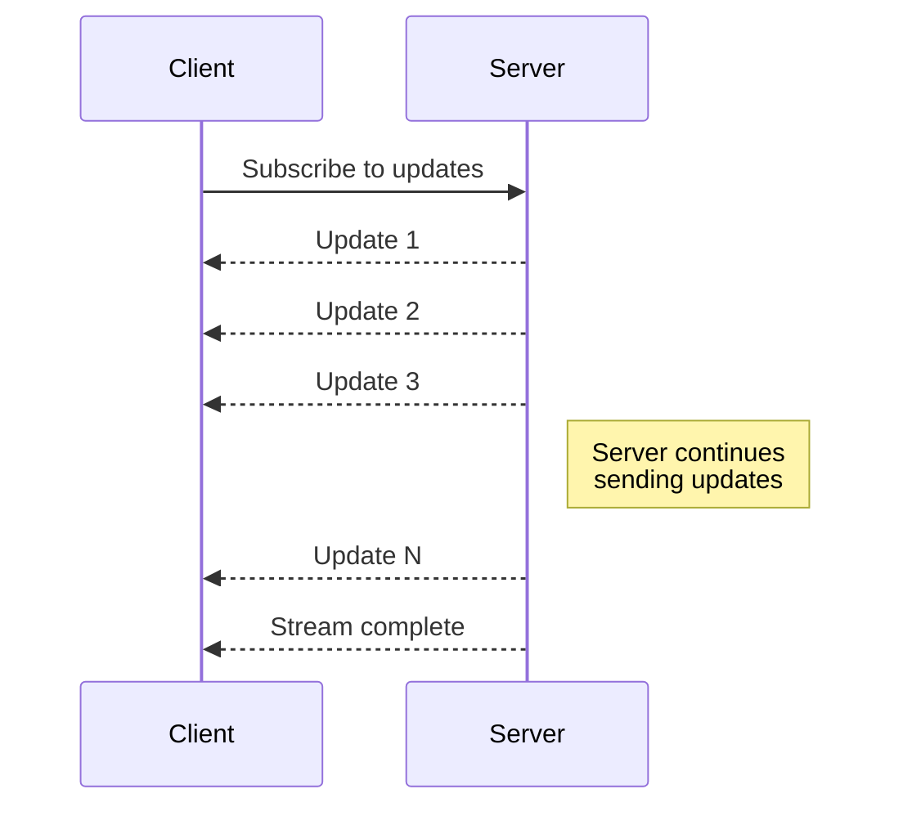
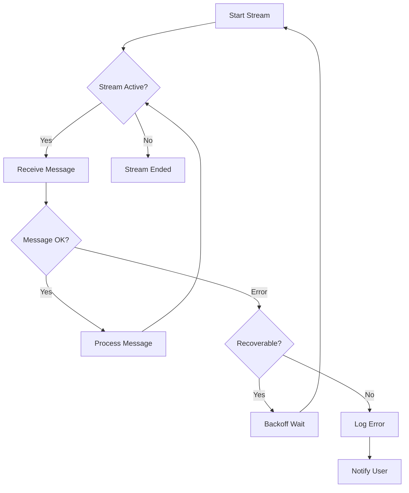

# How to Handle Server-Side Streaming in gRPC

Author: [nawazdhandala](https://www.github.com/nawazdhandala)

Tags: gRPC, Streaming, Go, Python, Real-time, Microservices

Description: Learn how to implement server-side streaming in gRPC for real-time updates, large data transfers, and event-driven architectures with practical examples in Go and Python.

---

Server-side streaming in gRPC allows a server to send multiple responses after receiving a single request. This pattern is ideal for real-time updates, large result sets, progress reporting, and event subscriptions.

## Understanding Server-Side Streaming



## When to Use Server-Side Streaming

| Use Case | Description |
|----------|-------------|
| Real-time updates | Stock prices, sports scores, notifications |
| Large data transfer | Database query results, file downloads |
| Progress reporting | Build status, file processing progress |
| Event subscriptions | Log streaming, monitoring alerts |
| Paginated results | Results sent as they become available |

## Protocol Buffer Definition

```protobuf
// stream_service.proto
syntax = "proto3";

package streamservice;

option go_package = "github.com/example/myapp/gen/streamservice";

import "google/protobuf/timestamp.proto";

// StreamService demonstrates various streaming patterns
service StreamService {
  // Subscribe to real-time updates
  rpc SubscribeToUpdates(SubscribeRequest) returns (stream Update);

  // Stream query results
  rpc StreamQueryResults(QueryRequest) returns (stream QueryResult);

  // Monitor job progress
  rpc WatchJobProgress(JobRequest) returns (stream JobProgress);

  // Stream log entries
  rpc TailLogs(LogRequest) returns (stream LogEntry);
}

message SubscribeRequest {
  repeated string topics = 1;
  string client_id = 2;
}

message Update {
  string topic = 1;
  string message = 2;
  google.protobuf.Timestamp timestamp = 3;
  map<string, string> metadata = 4;
}

message QueryRequest {
  string query = 1;
  int32 batch_size = 2;
}

message QueryResult {
  repeated Row rows = 1;
  int32 batch_number = 2;
  int32 total_batches = 3;
  bool is_last = 4;
}

message Row {
  map<string, string> columns = 1;
}

message JobRequest {
  string job_id = 1;
}

message JobProgress {
  string job_id = 1;
  int32 percentage = 2;
  string status = 3;
  string current_step = 4;
  google.protobuf.Timestamp updated_at = 5;
}

message LogRequest {
  string service_name = 1;
  string log_level = 2;
  int32 lines = 3;
  bool follow = 4;
}

message LogEntry {
  google.protobuf.Timestamp timestamp = 1;
  string level = 2;
  string message = 3;
  string service = 4;
  map<string, string> fields = 5;
}
```

## Go Server Implementation

### Basic Streaming Service

```go
// service/stream_service.go
package service

import (
    "context"
    "fmt"
    "sync"
    "time"

    "google.golang.org/grpc/codes"
    "google.golang.org/grpc/status"
    "google.golang.org/protobuf/types/known/timestamppb"

    pb "github.com/example/myapp/gen/streamservice"
)

type StreamService struct {
    pb.UnimplementedStreamServiceServer

    // Pub/sub for real-time updates
    subscribers map[string][]chan *pb.Update
    subMu       sync.RWMutex

    // Job tracking
    jobs   map[string]*jobState
    jobsMu sync.RWMutex
}

type jobState struct {
    percentage  int32
    status      string
    currentStep string
}

func NewStreamService() *StreamService {
    return &StreamService{
        subscribers: make(map[string][]chan *pb.Update),
        jobs:        make(map[string]*jobState),
    }
}

// SubscribeToUpdates handles real-time update subscriptions
func (s *StreamService) SubscribeToUpdates(
    req *pb.SubscribeRequest,
    stream pb.StreamService_SubscribeToUpdatesServer,
) error {
    ctx := stream.Context()

    // Create channel for this subscriber
    updateCh := make(chan *pb.Update, 100)

    // Register subscriber for each topic
    s.subMu.Lock()
    for _, topic := range req.Topics {
        s.subscribers[topic] = append(s.subscribers[topic], updateCh)
    }
    s.subMu.Unlock()

    // Cleanup on exit
    defer func() {
        s.subMu.Lock()
        for _, topic := range req.Topics {
            channels := s.subscribers[topic]
            for i, ch := range channels {
                if ch == updateCh {
                    s.subscribers[topic] = append(channels[:i], channels[i+1:]...)
                    break
                }
            }
        }
        s.subMu.Unlock()
        close(updateCh)
    }()

    // Stream updates to client
    for {
        select {
        case <-ctx.Done():
            return ctx.Err()
        case update := <-updateCh:
            if err := stream.Send(update); err != nil {
                return status.Errorf(codes.Internal, "failed to send update: %v", err)
            }
        }
    }
}

// PublishUpdate sends an update to all subscribers of a topic
func (s *StreamService) PublishUpdate(topic string, message string, metadata map[string]string) {
    update := &pb.Update{
        Topic:     topic,
        Message:   message,
        Timestamp: timestamppb.Now(),
        Metadata:  metadata,
    }

    s.subMu.RLock()
    defer s.subMu.RUnlock()

    for _, ch := range s.subscribers[topic] {
        select {
        case ch <- update:
        default:
            // Channel full, skip this update
        }
    }
}
```

### Streaming Query Results

```go
// StreamQueryResults streams database results in batches
func (s *StreamService) StreamQueryResults(
    req *pb.QueryRequest,
    stream pb.StreamService_StreamQueryResultsServer,
) error {
    ctx := stream.Context()

    batchSize := int(req.BatchSize)
    if batchSize <= 0 {
        batchSize = 100
    }

    // Simulate database query returning many rows
    totalRows := 10000
    totalBatches := (totalRows + batchSize - 1) / batchSize

    for batchNum := 0; batchNum < totalBatches; batchNum++ {
        // Check if client cancelled
        if err := ctx.Err(); err != nil {
            return status.Errorf(codes.Canceled, "client cancelled: %v", err)
        }

        // Generate batch of rows
        rows := make([]*pb.Row, 0, batchSize)
        start := batchNum * batchSize
        end := start + batchSize
        if end > totalRows {
            end = totalRows
        }

        for i := start; i < end; i++ {
            rows = append(rows, &pb.Row{
                Columns: map[string]string{
                    "id":    fmt.Sprintf("%d", i),
                    "name":  fmt.Sprintf("Record %d", i),
                    "value": fmt.Sprintf("%.2f", float64(i)*1.5),
                },
            })
        }

        // Send batch
        result := &pb.QueryResult{
            Rows:         rows,
            BatchNumber:  int32(batchNum + 1),
            TotalBatches: int32(totalBatches),
            IsLast:       batchNum == totalBatches-1,
        }

        if err := stream.Send(result); err != nil {
            return status.Errorf(codes.Internal, "failed to send batch: %v", err)
        }

        // Simulate processing delay
        time.Sleep(10 * time.Millisecond)
    }

    return nil
}
```

### Progress Tracking Stream

```go
// WatchJobProgress streams job progress updates
func (s *StreamService) WatchJobProgress(
    req *pb.JobRequest,
    stream pb.StreamService_WatchJobProgressServer,
) error {
    ctx := stream.Context()

    // Initialize job if not exists
    s.jobsMu.Lock()
    if _, exists := s.jobs[req.JobId]; !exists {
        s.jobs[req.JobId] = &jobState{
            percentage:  0,
            status:      "running",
            currentStep: "initializing",
        }
    }
    s.jobsMu.Unlock()

    ticker := time.NewTicker(500 * time.Millisecond)
    defer ticker.Stop()

    for {
        select {
        case <-ctx.Done():
            return ctx.Err()

        case <-ticker.C:
            s.jobsMu.RLock()
            job, exists := s.jobs[req.JobId]
            if !exists {
                s.jobsMu.RUnlock()
                return status.Error(codes.NotFound, "job not found")
            }

            progress := &pb.JobProgress{
                JobId:       req.JobId,
                Percentage:  job.percentage,
                Status:      job.status,
                CurrentStep: job.currentStep,
                UpdatedAt:   timestamppb.Now(),
            }
            s.jobsMu.RUnlock()

            if err := stream.Send(progress); err != nil {
                return status.Errorf(codes.Internal, "failed to send progress: %v", err)
            }

            // End stream when job completes
            if job.status == "completed" || job.status == "failed" {
                return nil
            }
        }
    }
}

// UpdateJobProgress updates the job state (called by job workers)
func (s *StreamService) UpdateJobProgress(jobID string, percentage int32, status, step string) {
    s.jobsMu.Lock()
    defer s.jobsMu.Unlock()

    if job, exists := s.jobs[jobID]; exists {
        job.percentage = percentage
        job.status = status
        job.currentStep = step
    }
}
```

### Log Tailing Stream

```go
// TailLogs streams log entries in real-time
func (s *StreamService) TailLogs(
    req *pb.LogRequest,
    stream pb.StreamService_TailLogsServer,
) error {
    ctx := stream.Context()

    // Validate log level
    validLevels := map[string]bool{
        "debug": true, "info": true, "warn": true, "error": true,
    }
    if req.LogLevel != "" && !validLevels[req.LogLevel] {
        return status.Error(codes.InvalidArgument, "invalid log level")
    }

    // Send historical logs first
    historicalLogs := s.getHistoricalLogs(req.ServiceName, req.LogLevel, int(req.Lines))
    for _, entry := range historicalLogs {
        if err := stream.Send(entry); err != nil {
            return status.Errorf(codes.Internal, "failed to send log: %v", err)
        }
    }

    // If not following, stop here
    if !req.Follow {
        return nil
    }

    // Subscribe to new logs
    logCh := s.subscribeToLogs(req.ServiceName, req.LogLevel)
    defer s.unsubscribeFromLogs(logCh)

    for {
        select {
        case <-ctx.Done():
            return ctx.Err()
        case entry := <-logCh:
            if err := stream.Send(entry); err != nil {
                return status.Errorf(codes.Internal, "failed to send log: %v", err)
            }
        }
    }
}
```

## Go Client Implementation

```go
// client/stream_client.go
package main

import (
    "context"
    "fmt"
    "io"
    "log"
    "time"

    "google.golang.org/grpc"
    "google.golang.org/grpc/credentials/insecure"

    pb "github.com/example/myapp/gen/streamservice"
)

func main() {
    conn, err := grpc.Dial(
        "localhost:50051",
        grpc.WithTransportCredentials(insecure.NewCredentials()),
    )
    if err != nil {
        log.Fatalf("Failed to connect: %v", err)
    }
    defer conn.Close()

    client := pb.NewStreamServiceClient(conn)

    // Example: Subscribe to real-time updates
    subscribeToUpdates(client)
}

func subscribeToUpdates(client pb.StreamServiceClient) {
    // Create context with timeout
    ctx, cancel := context.WithTimeout(context.Background(), 5*time.Minute)
    defer cancel()

    // Start subscription
    stream, err := client.SubscribeToUpdates(ctx, &pb.SubscribeRequest{
        Topics:   []string{"orders", "inventory", "alerts"},
        ClientId: "client-001",
    })
    if err != nil {
        log.Fatalf("Failed to subscribe: %v", err)
    }

    // Receive updates
    for {
        update, err := stream.Recv()
        if err == io.EOF {
            log.Println("Stream ended")
            return
        }
        if err != nil {
            log.Fatalf("Error receiving update: %v", err)
        }

        fmt.Printf("[%s] %s: %s\n",
            update.Timestamp.AsTime().Format(time.RFC3339),
            update.Topic,
            update.Message,
        )
    }
}

func streamQueryResults(client pb.StreamServiceClient) {
    ctx, cancel := context.WithCancel(context.Background())
    defer cancel()

    stream, err := client.StreamQueryResults(ctx, &pb.QueryRequest{
        Query:     "SELECT * FROM large_table",
        BatchSize: 500,
    })
    if err != nil {
        log.Fatalf("Failed to start query: %v", err)
    }

    totalRows := 0
    for {
        result, err := stream.Recv()
        if err == io.EOF {
            break
        }
        if err != nil {
            log.Fatalf("Error receiving results: %v", err)
        }

        totalRows += len(result.Rows)
        fmt.Printf("Received batch %d/%d (%d rows)\n",
            result.BatchNumber,
            result.TotalBatches,
            len(result.Rows),
        )

        // Process rows
        for _, row := range result.Rows {
            // Process each row
            _ = row.Columns
        }
    }

    fmt.Printf("Total rows received: %d\n", totalRows)
}

func watchJobProgress(client pb.StreamServiceClient, jobID string) {
    ctx, cancel := context.WithCancel(context.Background())
    defer cancel()

    stream, err := client.WatchJobProgress(ctx, &pb.JobRequest{
        JobId: jobID,
    })
    if err != nil {
        log.Fatalf("Failed to watch job: %v", err)
    }

    for {
        progress, err := stream.Recv()
        if err == io.EOF {
            log.Println("Job stream ended")
            return
        }
        if err != nil {
            log.Fatalf("Error receiving progress: %v", err)
        }

        // Display progress bar
        bar := progressBar(int(progress.Percentage))
        fmt.Printf("\r[%s] %3d%% - %s: %s",
            bar,
            progress.Percentage,
            progress.Status,
            progress.CurrentStep,
        )

        if progress.Status == "completed" || progress.Status == "failed" {
            fmt.Println()
            return
        }
    }
}

func progressBar(percent int) string {
    width := 40
    filled := width * percent / 100
    bar := make([]byte, width)
    for i := 0; i < width; i++ {
        if i < filled {
            bar[i] = '='
        } else if i == filled {
            bar[i] = '>'
        } else {
            bar[i] = ' '
        }
    }
    return string(bar)
}
```

## Python Implementation

### Python Server

```python
# server.py
import grpc
from concurrent import futures
import time
import threading
from collections import defaultdict
from google.protobuf.timestamp_pb2 import Timestamp

import stream_service_pb2
import stream_service_pb2_grpc


class StreamServiceServicer(stream_service_pb2_grpc.StreamServiceServicer):
    def __init__(self):
        self.subscribers = defaultdict(list)
        self.subscribers_lock = threading.Lock()
        self.jobs = {}
        self.jobs_lock = threading.Lock()

    def SubscribeToUpdates(self, request, context):
        """Handle real-time update subscriptions."""
        import queue
        update_queue = queue.Queue(maxsize=100)

        # Register subscriber
        with self.subscribers_lock:
            for topic in request.topics:
                self.subscribers[topic].append(update_queue)

        try:
            while context.is_active():
                try:
                    # Wait for update with timeout
                    update = update_queue.get(timeout=1.0)
                    yield update
                except queue.Empty:
                    continue
        finally:
            # Cleanup subscriber
            with self.subscribers_lock:
                for topic in request.topics:
                    if update_queue in self.subscribers[topic]:
                        self.subscribers[topic].remove(update_queue)

    def publish_update(self, topic, message, metadata=None):
        """Publish update to all topic subscribers."""
        timestamp = Timestamp()
        timestamp.GetCurrentTime()

        update = stream_service_pb2.Update(
            topic=topic,
            message=message,
            timestamp=timestamp,
            metadata=metadata or {}
        )

        with self.subscribers_lock:
            for queue in self.subscribers[topic]:
                try:
                    queue.put_nowait(update)
                except:
                    pass  # Queue full, skip

    def StreamQueryResults(self, request, context):
        """Stream query results in batches."""
        batch_size = request.batch_size if request.batch_size > 0 else 100
        total_rows = 10000
        total_batches = (total_rows + batch_size - 1) // batch_size

        for batch_num in range(total_batches):
            if not context.is_active():
                return

            # Generate batch
            start = batch_num * batch_size
            end = min(start + batch_size, total_rows)

            rows = []
            for i in range(start, end):
                row = stream_service_pb2.Row(
                    columns={
                        'id': str(i),
                        'name': f'Record {i}',
                        'value': f'{i * 1.5:.2f}'
                    }
                )
                rows.append(row)

            result = stream_service_pb2.QueryResult(
                rows=rows,
                batch_number=batch_num + 1,
                total_batches=total_batches,
                is_last=(batch_num == total_batches - 1)
            )

            yield result
            time.sleep(0.01)  # Simulate processing

    def WatchJobProgress(self, request, context):
        """Stream job progress updates."""
        job_id = request.job_id

        # Initialize job
        with self.jobs_lock:
            if job_id not in self.jobs:
                self.jobs[job_id] = {
                    'percentage': 0,
                    'status': 'running',
                    'current_step': 'initializing'
                }

        while context.is_active():
            with self.jobs_lock:
                job = self.jobs.get(job_id)
                if not job:
                    context.abort(grpc.StatusCode.NOT_FOUND, 'Job not found')
                    return

                timestamp = Timestamp()
                timestamp.GetCurrentTime()

                progress = stream_service_pb2.JobProgress(
                    job_id=job_id,
                    percentage=job['percentage'],
                    status=job['status'],
                    current_step=job['current_step'],
                    updated_at=timestamp
                )

            yield progress

            if job['status'] in ('completed', 'failed'):
                return

            time.sleep(0.5)


def serve():
    server = grpc.server(futures.ThreadPoolExecutor(max_workers=10))
    servicer = StreamServiceServicer()
    stream_service_pb2_grpc.add_StreamServiceServicer_to_server(servicer, server)

    server.add_insecure_port('[::]:50051')
    print('Server starting on port 50051')
    server.start()

    # Simulate publishing updates
    def publish_updates():
        import random
        topics = ['orders', 'inventory', 'alerts']
        while True:
            topic = random.choice(topics)
            servicer.publish_update(
                topic,
                f'Update from {topic}',
                {'source': 'system'}
            )
            time.sleep(1)

    update_thread = threading.Thread(target=publish_updates, daemon=True)
    update_thread.start()

    server.wait_for_termination()


if __name__ == '__main__':
    serve()
```

### Python Client

```python
# client.py
import grpc
import sys
from datetime import datetime

import stream_service_pb2
import stream_service_pb2_grpc


def subscribe_to_updates(stub):
    """Subscribe to real-time updates."""
    request = stream_service_pb2.SubscribeRequest(
        topics=['orders', 'inventory', 'alerts'],
        client_id='python-client-001'
    )

    print('Subscribing to updates...')
    try:
        for update in stub.SubscribeToUpdates(request):
            timestamp = update.timestamp.ToDatetime()
            print(f'[{timestamp}] {update.topic}: {update.message}')
    except grpc.RpcError as e:
        print(f'Stream error: {e.code()} - {e.details()}')


def stream_query_results(stub):
    """Receive query results as a stream."""
    request = stream_service_pb2.QueryRequest(
        query='SELECT * FROM large_table',
        batch_size=500
    )

    total_rows = 0
    try:
        for result in stub.StreamQueryResults(request):
            total_rows += len(result.rows)
            print(f'Batch {result.batch_number}/{result.total_batches}: '
                  f'{len(result.rows)} rows')

            # Process rows
            for row in result.rows:
                pass  # Process each row
    except grpc.RpcError as e:
        print(f'Stream error: {e.code()} - {e.details()}')

    print(f'Total rows received: {total_rows}')


def watch_job_progress(stub, job_id):
    """Watch job progress in real-time."""
    request = stream_service_pb2.JobRequest(job_id=job_id)

    try:
        for progress in stub.WatchJobProgress(request):
            bar = '=' * (progress.percentage // 2) + '>' + ' ' * (50 - progress.percentage // 2)
            sys.stdout.write(f'\r[{bar}] {progress.percentage}% - '
                           f'{progress.status}: {progress.current_step}')
            sys.stdout.flush()

            if progress.status in ('completed', 'failed'):
                print()
                break
    except grpc.RpcError as e:
        print(f'\nStream error: {e.code()} - {e.details()}')


def main():
    channel = grpc.insecure_channel('localhost:50051')
    stub = stream_service_pb2_grpc.StreamServiceStub(channel)

    # Run different streaming examples
    print('=== Subscribe to Updates ===')
    subscribe_to_updates(stub)


if __name__ == '__main__':
    main()
```

## Error Handling and Reconnection



### Robust Client with Reconnection

```go
// client/robust_client.go
package main

import (
    "context"
    "io"
    "log"
    "time"

    "google.golang.org/grpc"
    "google.golang.org/grpc/codes"
    "google.golang.org/grpc/status"

    pb "github.com/example/myapp/gen/streamservice"
)

type StreamClient struct {
    client       pb.StreamServiceClient
    maxRetries   int
    baseBackoff  time.Duration
    maxBackoff   time.Duration
}

func NewStreamClient(conn *grpc.ClientConn) *StreamClient {
    return &StreamClient{
        client:      pb.NewStreamServiceClient(conn),
        maxRetries:  5,
        baseBackoff: time.Second,
        maxBackoff:  30 * time.Second,
    }
}

func (c *StreamClient) SubscribeWithRetry(
    ctx context.Context,
    topics []string,
    handler func(*pb.Update) error,
) error {
    retries := 0
    backoff := c.baseBackoff

    for {
        err := c.subscribe(ctx, topics, handler)

        // Check if context was cancelled
        if ctx.Err() != nil {
            return ctx.Err()
        }

        // Check if error is retryable
        if !c.isRetryable(err) {
            return err
        }

        retries++
        if retries > c.maxRetries {
            return fmt.Errorf("max retries exceeded: %w", err)
        }

        log.Printf("Stream error (retry %d/%d): %v. Reconnecting in %v...",
            retries, c.maxRetries, err, backoff)

        select {
        case <-ctx.Done():
            return ctx.Err()
        case <-time.After(backoff):
        }

        // Exponential backoff
        backoff *= 2
        if backoff > c.maxBackoff {
            backoff = c.maxBackoff
        }
    }
}

func (c *StreamClient) subscribe(
    ctx context.Context,
    topics []string,
    handler func(*pb.Update) error,
) error {
    stream, err := c.client.SubscribeToUpdates(ctx, &pb.SubscribeRequest{
        Topics:   topics,
        ClientId: "robust-client",
    })
    if err != nil {
        return err
    }

    for {
        update, err := stream.Recv()
        if err == io.EOF {
            return nil
        }
        if err != nil {
            return err
        }

        if err := handler(update); err != nil {
            log.Printf("Handler error: %v", err)
        }
    }
}

func (c *StreamClient) isRetryable(err error) bool {
    if err == nil {
        return false
    }

    st, ok := status.FromError(err)
    if !ok {
        return true // Network errors are retryable
    }

    switch st.Code() {
    case codes.Unavailable, codes.ResourceExhausted, codes.Aborted:
        return true
    default:
        return false
    }
}
```

## Performance Considerations

### Buffering Strategies

```go
// Buffered stream sender
type BufferedSender struct {
    stream   pb.StreamService_TailLogsServer
    buffer   []*pb.LogEntry
    bufSize  int
    flushInt time.Duration
    mu       sync.Mutex
}

func NewBufferedSender(stream pb.StreamService_TailLogsServer, bufSize int) *BufferedSender {
    bs := &BufferedSender{
        stream:   stream,
        buffer:   make([]*pb.LogEntry, 0, bufSize),
        bufSize:  bufSize,
        flushInt: 100 * time.Millisecond,
    }

    // Start flush goroutine
    go bs.periodicFlush()

    return bs
}

func (bs *BufferedSender) Send(entry *pb.LogEntry) error {
    bs.mu.Lock()
    defer bs.mu.Unlock()

    bs.buffer = append(bs.buffer, entry)

    if len(bs.buffer) >= bs.bufSize {
        return bs.flush()
    }

    return nil
}

func (bs *BufferedSender) flush() error {
    if len(bs.buffer) == 0 {
        return nil
    }

    for _, entry := range bs.buffer {
        if err := bs.stream.Send(entry); err != nil {
            return err
        }
    }

    bs.buffer = bs.buffer[:0]
    return nil
}

func (bs *BufferedSender) periodicFlush() {
    ticker := time.NewTicker(bs.flushInt)
    defer ticker.Stop()

    for range ticker.C {
        bs.mu.Lock()
        bs.flush()
        bs.mu.Unlock()
    }
}
```

---

Server-side streaming in gRPC enables efficient real-time data delivery without polling overhead. Choose streaming when you need to push multiple responses from a single request, whether for live updates, large datasets, or progress tracking.
