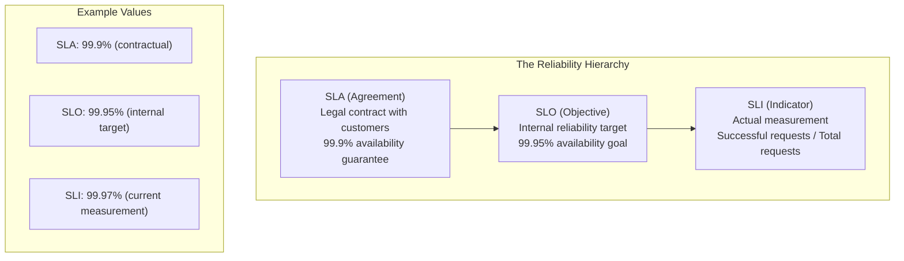
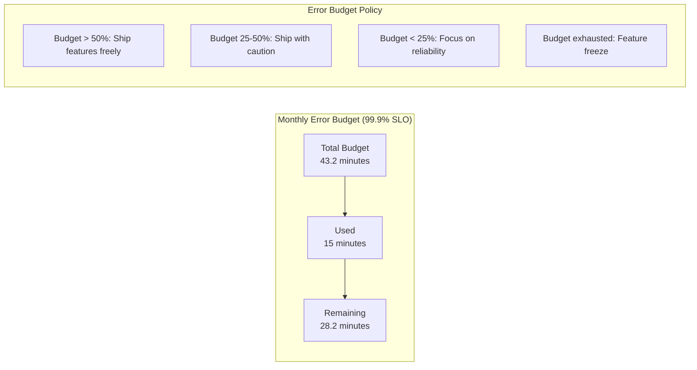

# How to Handle Service Level Objectives (SLOs)

Author: [nawazdhandala](https://www.github.com/nawazdhandala)

Tags: SRE, Observability, Monitoring, SLOs, SLIs, Error Budgets, Prometheus, Reliability

Description: Learn how to define, measure, and manage Service Level Objectives to balance reliability with feature development velocity.

---

Your service has 99.9% uptime, but users are still complaining. Why? Because uptime alone does not capture user experience. Service Level Objectives (SLOs) provide a framework for measuring what actually matters to your users and making data-driven decisions about reliability investments.

SLOs are the foundation of modern Site Reliability Engineering. They help you answer critical questions: How reliable should our service be? When should we slow down feature work to focus on reliability? When is it okay to ship fast and take risks?

## Understanding SLOs, SLIs, and SLAs



- **SLI (Service Level Indicator)**: A quantitative measure of service behavior. Examples: request latency, error rate, throughput.
- **SLO (Service Level Objective)**: A target value for an SLI. Example: 99.95% of requests complete successfully.
- **SLA (Service Level Agreement)**: A contract that includes consequences for missing targets. SLOs should be stricter than SLAs.

## Choosing the Right SLIs

Good SLIs directly measure user experience. Start with these common patterns:

### Availability SLI

```promql
# Availability: proportion of successful requests
sum(rate(http_requests_total{status!~"5.."}[5m]))
/
sum(rate(http_requests_total[5m]))
```

### Latency SLI

```promql
# Latency: proportion of requests faster than threshold
sum(rate(http_request_duration_seconds_bucket{le="0.3"}[5m]))
/
sum(rate(http_request_duration_seconds_count[5m]))
```

### Quality SLI (for data processing)

```promql
# Freshness: proportion of data updated within threshold
sum(time() - data_last_update_timestamp < 300)
/
count(data_last_update_timestamp)
```

## Implementing SLOs with Prometheus

Create a comprehensive SLO monitoring setup:

```yaml
# prometheus/rules/slo.yml
groups:
  - name: slo_rules
    rules:
      # Define the SLO target as a constant
      - record: slo:api_availability:target
        expr: 0.999  # 99.9% availability target

      - record: slo:api_latency:target
        expr: 0.99   # 99% of requests under latency threshold

      # Calculate current SLI value (5 minute window)
      - record: sli:api_availability:ratio_rate5m
        expr: |
          sum(rate(http_requests_total{job="api",status!~"5.."}[5m]))
          /
          sum(rate(http_requests_total{job="api"}[5m]))

      - record: sli:api_latency:ratio_rate5m
        expr: |
          sum(rate(http_request_duration_seconds_bucket{job="api",le="0.3"}[5m]))
          /
          sum(rate(http_request_duration_seconds_count{job="api"}[5m]))

      # Calculate error budget consumption
      - record: slo:api_availability:error_budget_remaining
        expr: |
          1 - (
            (1 - sli:api_availability:ratio_rate30d)
            /
            (1 - slo:api_availability:target)
          )

      # Multi-window alerting for SLO burn rate
      - alert: SLOAvailabilityBurnRateHigh
        expr: |
          (
            # Fast burn: 14.4x burn rate over 1 hour
            (1 - sli:api_availability:ratio_rate1h) > (14.4 * (1 - slo:api_availability:target))
            and
            (1 - sli:api_availability:ratio_rate5m) > (14.4 * (1 - slo:api_availability:target))
          )
          or
          (
            # Slow burn: 3x burn rate over 6 hours
            (1 - sli:api_availability:ratio_rate6h) > (3 * (1 - slo:api_availability:target))
            and
            (1 - sli:api_availability:ratio_rate30m) > (3 * (1 - slo:api_availability:target))
          )
        for: 2m
        labels:
          severity: critical
        annotations:
          summary: "High SLO burn rate detected"
          description: "API availability SLO is burning error budget faster than expected"
```

## Error Budget Management

Error budgets quantify how much unreliability you can tolerate:



Implement error budget tracking:

```python
# error_budget.py
from datetime import datetime, timedelta
from prometheus_api_client import PrometheusConnect

class ErrorBudgetTracker:
    def __init__(self, prometheus_url: str):
        self.prom = PrometheusConnect(url=prometheus_url)

    def calculate_error_budget(
        self,
        slo_target: float,
        window_days: int = 30
    ) -> dict:
        """Calculate error budget status for the given SLO."""

        # Query current SLI over the window
        query = f"""
            1 - (
                sum(increase(http_requests_total{{status=~"5.."}}[{window_days}d]))
                /
                sum(increase(http_requests_total[{window_days}d]))
            )
        """
        result = self.prom.custom_query(query)
        current_sli = float(result[0]['value'][1])

        # Calculate budget
        total_budget = 1 - slo_target  # e.g., 0.001 for 99.9%
        consumed_budget = max(0, slo_target - current_sli)
        remaining_budget = total_budget - consumed_budget
        budget_percentage = (remaining_budget / total_budget) * 100

        # Convert to time
        window_minutes = window_days * 24 * 60
        total_minutes = window_minutes * total_budget
        remaining_minutes = window_minutes * remaining_budget

        return {
            "slo_target": slo_target,
            "current_sli": current_sli,
            "total_budget_minutes": total_minutes,
            "remaining_budget_minutes": remaining_minutes,
            "budget_percentage": budget_percentage,
            "status": self._get_status(budget_percentage)
        }

    def _get_status(self, budget_percentage: float) -> str:
        if budget_percentage > 50:
            return "healthy"
        elif budget_percentage > 25:
            return "warning"
        elif budget_percentage > 0:
            return "critical"
        else:
            return "exhausted"


# Usage
tracker = ErrorBudgetTracker("http://prometheus:9090")
budget = tracker.calculate_error_budget(slo_target=0.999)

print(f"Error Budget Status: {budget['status']}")
print(f"Remaining: {budget['remaining_budget_minutes']:.1f} minutes")
print(f"Budget: {budget['budget_percentage']:.1f}%")
```

## Creating an SLO Dashboard

Build a Grafana dashboard for visibility:

```json
{
  "dashboard": {
    "title": "SLO Dashboard",
    "panels": [
      {
        "title": "Availability SLO",
        "type": "gauge",
        "targets": [
          {
            "expr": "sli:api_availability:ratio_rate30d * 100",
            "legendFormat": "Current"
          }
        ],
        "fieldConfig": {
          "defaults": {
            "thresholds": {
              "steps": [
                {"color": "red", "value": 0},
                {"color": "yellow", "value": 99.5},
                {"color": "green", "value": 99.9}
              ]
            },
            "min": 99,
            "max": 100,
            "unit": "percent"
          }
        }
      },
      {
        "title": "Error Budget Remaining",
        "type": "stat",
        "targets": [
          {
            "expr": "slo:api_availability:error_budget_remaining * 100",
            "legendFormat": "Budget %"
          }
        ],
        "fieldConfig": {
          "defaults": {
            "thresholds": {
              "steps": [
                {"color": "red", "value": 0},
                {"color": "yellow", "value": 25},
                {"color": "green", "value": 50}
              ]
            },
            "unit": "percent"
          }
        }
      },
      {
        "title": "SLO Burn Rate",
        "type": "timeseries",
        "targets": [
          {
            "expr": "(1 - sli:api_availability:ratio_rate1h) / (1 - slo:api_availability:target)",
            "legendFormat": "1h burn rate"
          },
          {
            "expr": "(1 - sli:api_availability:ratio_rate6h) / (1 - slo:api_availability:target)",
            "legendFormat": "6h burn rate"
          }
        ]
      }
    ]
  }
}
```

## SLO-Based Alerting Strategy

Avoid alert fatigue with multi-window, multi-burn-rate alerts:

```yaml
# alertmanager/config.yml
route:
  receiver: 'default'
  routes:
    # Page immediately for fast burn
    - match:
        alertname: SLOBurnRateCritical
      receiver: 'pagerduty'
      repeat_interval: 5m

    # Ticket for slow burn
    - match:
        alertname: SLOBurnRateWarning
      receiver: 'slack-oncall'
      repeat_interval: 1h

receivers:
  - name: 'pagerduty'
    pagerduty_configs:
      - service_key: 'YOUR_PD_KEY'
        description: '{{ .Annotations.summary }}'
        details:
          error_budget: '{{ .Annotations.error_budget }}'

  - name: 'slack-oncall'
    slack_configs:
      - channel: '#oncall'
        text: |
          *{{ .Annotations.summary }}*
          Error budget remaining: {{ .Annotations.error_budget }}
          {{ .Annotations.description }}
```

## Implementing SLOs Across Multiple Services

For microservices, create composite SLOs:

```yaml
# slo_config.yaml
services:
  api-gateway:
    slos:
      - name: availability
        target: 0.999
        sli:
          type: availability
          good_events: 'http_requests_total{status!~"5.."}'
          total_events: 'http_requests_total'

      - name: latency_p99
        target: 0.99
        sli:
          type: latency
          threshold_ms: 500
          histogram: 'http_request_duration_seconds_bucket'

  user-service:
    slos:
      - name: availability
        target: 0.9995  # Higher target for critical service
        sli:
          type: availability
          good_events: 'grpc_server_handled_total{grpc_code!="Internal"}'
          total_events: 'grpc_server_handled_total'

  # Composite SLO for user-facing journeys
  checkout-journey:
    slos:
      - name: end_to_end_success
        target: 0.995
        sli:
          type: journey
          steps:
            - service: api-gateway
              weight: 0.3
            - service: user-service
              weight: 0.2
            - service: payment-service
              weight: 0.5
```

## Running SLO Review Meetings

Establish a regular cadence for SLO reviews:

```markdown
## Weekly SLO Review Agenda

### 1. Dashboard Review (5 min)
- Current SLI values vs targets
- Error budget status for each service
- Any SLO breaches in the past week

### 2. Incident Review (10 min)
- Incidents that consumed error budget
- Root causes and remediation status
- Impact on user experience

### 3. Error Budget Decisions (10 min)
- If budget healthy: What features can we ship?
- If budget low: What reliability work do we prioritize?
- Any SLO adjustments needed?

### 4. Action Items (5 min)
- Assign owners for reliability work
- Schedule any necessary deep dives
- Update SLO documentation if needed
```

## Best Practices

1. **Start with user journeys**, not system metrics. Measure what users experience.

2. **Set achievable targets**. Start conservative and tighten over time. A 99.99% SLO you cannot meet is worse than a 99.9% SLO you consistently achieve.

3. **Include all failure modes**. Partial outages, high latency, and incorrect results all hurt users.

4. **Automate everything**. Manual SLO tracking does not scale and leads to stale data.

5. **Make SLOs visible**. Display dashboards prominently so everyone understands the current state.

6. **Enforce error budget policies**. SLOs without consequences become meaningless targets.

7. **Review and adjust regularly**. User expectations and system capabilities change over time.

---

SLOs transform reliability from a vague goal into a measurable, actionable practice. They help you make better decisions about where to invest engineering effort and when it is okay to take calculated risks. Start with one or two critical services, prove the value, then expand across your organization.
