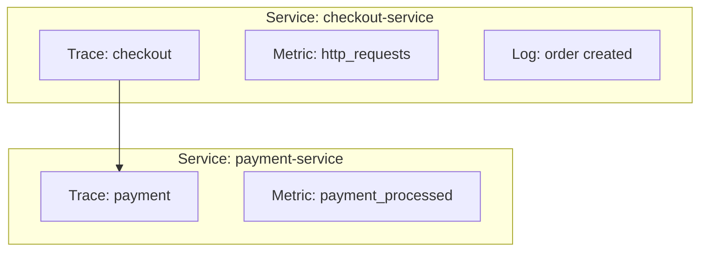

# How to Handle Service Name Configuration

Author: [nawazdhandala](https://www.github.com/nawazdhandala)

Tags: OpenTelemetry, Service Name, Configuration, Observability, Best Practices, Resource Attributes, Tracing

Description: A comprehensive guide to configuring service names in OpenTelemetry, including best practices, common pitfalls, and solutions for multi-service architectures.

---

Service name is one of the most important attributes in OpenTelemetry. It identifies your application across traces, metrics, and logs, enabling you to filter, group, and analyze telemetry data effectively. Getting service name configuration right from the start saves significant debugging time later.

---

## Why Service Name Matters

The service name is a resource attribute that:

1. **Groups telemetry data** - All traces, metrics, and logs from the same service are linked
2. **Enables service maps** - Visualize dependencies between services
3. **Powers alerting** - Set up alerts per service
4. **Supports filtering** - Query data for specific services



---

## Configuration Methods

There are multiple ways to configure the service name, listed here in order of precedence:

1. **Programmatic configuration** - Set in code
2. **Environment variable** - `OTEL_SERVICE_NAME`
3. **Resource attributes environment variable** - `OTEL_RESOURCE_ATTRIBUTES`
4. **Default value** - Usually `unknown_service`

---

## Environment Variable Configuration

```bash
# Set service name directly
export OTEL_SERVICE_NAME="checkout-service"

# Or with other resource attributes
export OTEL_RESOURCE_ATTRIBUTES="service.name=checkout-service,service.version=1.2.3"
```

---

## Programmatic Configuration

### Node.js

```javascript
const { NodeSDK } = require('@opentelemetry/sdk-node');
const { Resource } = require('@opentelemetry/resources');
const { SemanticResourceAttributes } = require('@opentelemetry/semantic-conventions');

const resource = new Resource({
  [SemanticResourceAttributes.SERVICE_NAME]: 'checkout-service',
  [SemanticResourceAttributes.SERVICE_VERSION]: '1.0.0',
  [SemanticResourceAttributes.DEPLOYMENT_ENVIRONMENT]: process.env.NODE_ENV,
});

const sdk = new NodeSDK({
  resource,
  // ... other configuration
});
```

### Python

```python
from opentelemetry.sdk.resources import Resource
from opentelemetry.semconv.resource import ResourceAttributes

resource = Resource.create({
    ResourceAttributes.SERVICE_NAME: "checkout-service",
    ResourceAttributes.SERVICE_VERSION: "1.0.0",
    ResourceAttributes.DEPLOYMENT_ENVIRONMENT: os.getenv("ENVIRONMENT"),
})
```

---

## Best Practices for Service Names

1. **Use lowercase with hyphens** - `checkout-service` not `CheckoutService`
2. **Be descriptive but concise** - `payment-processor` not `p-proc`
3. **Include the service type** - `user-api`, `order-worker`
4. **Avoid environment in name** - Use `deployment.environment` attribute instead
5. **Be consistent across the organization** - Document naming standards

### What NOT to Include in Service Name

```bash
# Bad - includes environment
OTEL_SERVICE_NAME="checkout-service-prod"

# Good - use separate attribute for environment
OTEL_SERVICE_NAME="checkout-service"
OTEL_RESOURCE_ATTRIBUTES="deployment.environment=prod"
```

---

## Troubleshooting Service Name Issues

### Issue: Service Name Shows as "unknown_service"

**Cause:** Service name not configured at any level.

**Solution:** Set `OTEL_SERVICE_NAME` or configure programmatically.

### Issue: Different Service Names in Different Signals

**Cause:** Traces, metrics, and logs configured separately.

**Solution:** Use a shared resource configuration.

---

## Related Reading

- [Traces and Spans in OpenTelemetry](https://oneuptime.com/blog/post/2025-08-27-traces-and-spans-in-opentelemetry/view)
- [How to Reduce Noise in OpenTelemetry](https://oneuptime.com/blog/post/2025-08-25-how-to-reduce-noise-in-opentelemetry/view)
