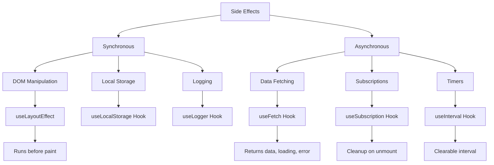
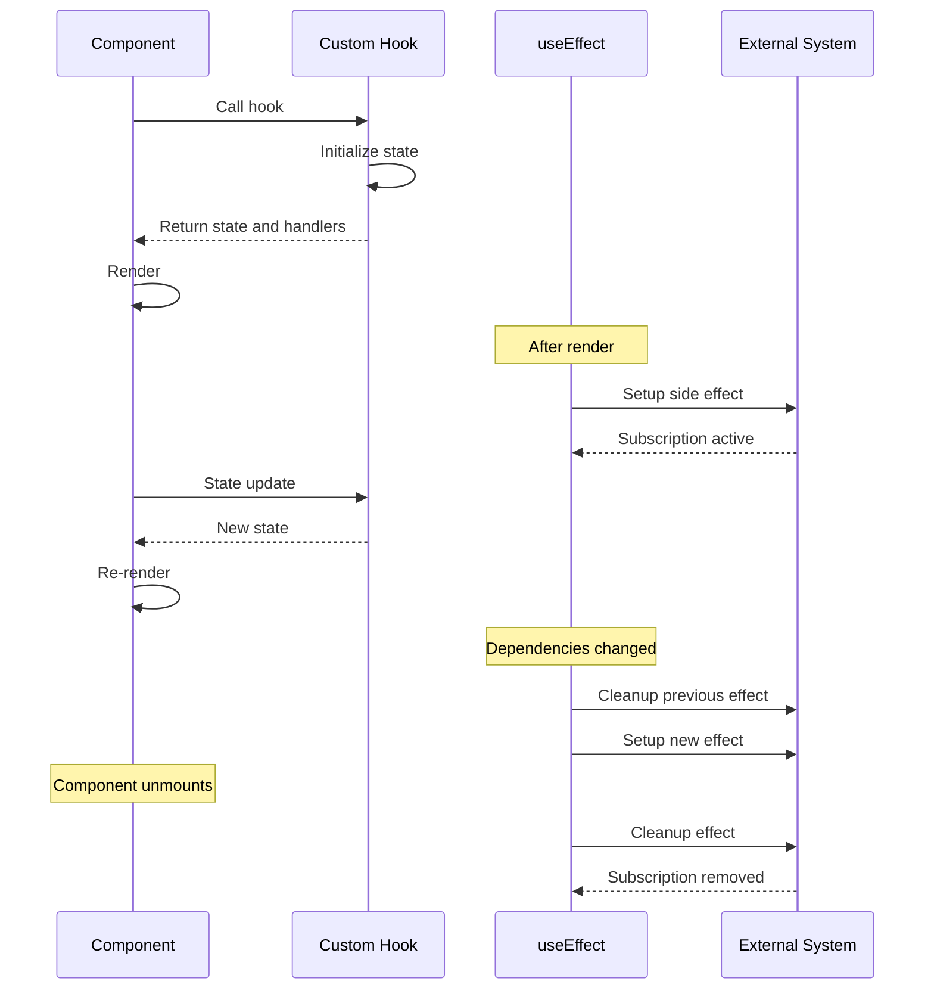

# How to Handle Side Effects with Custom Hooks

Author: [nawazdhandala](https://github.com/nawazdhandala)

Tags: React, Hooks, Custom Hooks, Side Effects, JavaScript, TypeScript, Best Practices

Description: A comprehensive guide to managing side effects in React using custom hooks, including data fetching, subscriptions, timers, and event listeners.

---

Side effects are operations that interact with the outside world: fetching data, subscribing to events, manipulating the DOM, or setting timers. Custom hooks let you encapsulate side effect logic into reusable, testable units that keep your components clean and focused on rendering.

## Understanding Side Effects in React

Side effects are anything that affects something outside the scope of the current function. In React, common side effects include:

- Data fetching from APIs
- Subscribing to data streams
- Manually changing the DOM
- Setting up timers and intervals
- Logging and analytics
- Managing browser storage

## Side Effect Categories and Patterns



## Basic Custom Hook Structure

A custom hook is a function that uses other hooks. The naming convention is to start with "use".

```typescript
import { useState, useEffect, useCallback } from 'react';

// Custom hook for fetching data
function useFetch<T>(url: string) {
  // State for the fetched data
  const [data, setData] = useState<T | null>(null);
  // State for loading indicator
  const [loading, setLoading] = useState(true);
  // State for error handling
  const [error, setError] = useState<Error | null>(null);

  useEffect(() => {
    // Flag to prevent state updates on unmounted component
    let cancelled = false;

    async function fetchData() {
      try {
        setLoading(true);
        setError(null);

        const response = await fetch(url);
        if (!response.ok) {
          throw new Error(`HTTP error: ${response.status}`);
        }

        const result = await response.json();

        // Only update state if component is still mounted
        if (!cancelled) {
          setData(result);
        }
      } catch (err) {
        if (!cancelled) {
          setError(err instanceof Error ? err : new Error('Unknown error'));
        }
      } finally {
        if (!cancelled) {
          setLoading(false);
        }
      }
    }

    fetchData();

    // Cleanup function runs when component unmounts or url changes
    return () => {
      cancelled = true;
    };
  }, [url]);

  return { data, loading, error };
}

export default useFetch;
```

## Data Fetching Hook with AbortController

A more robust data fetching hook that supports request cancellation.

```typescript
import { useState, useEffect, useCallback, useRef } from 'react';

interface FetchState<T> {
  data: T | null;
  loading: boolean;
  error: Error | null;
}

interface UseFetchOptions {
  // Initial data before fetch completes
  initialData?: unknown;
  // Whether to fetch immediately
  immediate?: boolean;
  // Request headers
  headers?: HeadersInit;
}

function useFetch<T = unknown>(
  url: string,
  options: UseFetchOptions = {}
) {
  const { initialData = null, immediate = true, headers } = options;

  const [state, setState] = useState<FetchState<T>>({
    data: initialData as T | null,
    loading: immediate,
    error: null
  });

  // Store AbortController in a ref
  const abortControllerRef = useRef<AbortController | null>(null);

  // Fetch function that can be called manually
  const fetchData = useCallback(async () => {
    // Cancel any in-flight request
    if (abortControllerRef.current) {
      abortControllerRef.current.abort();
    }

    // Create new AbortController for this request
    abortControllerRef.current = new AbortController();

    setState(prev => ({ ...prev, loading: true, error: null }));

    try {
      const response = await fetch(url, {
        headers,
        signal: abortControllerRef.current.signal
      });

      if (!response.ok) {
        throw new Error(`HTTP ${response.status}: ${response.statusText}`);
      }

      const data = await response.json();
      setState({ data, loading: false, error: null });
      return data;
    } catch (err) {
      // Ignore abort errors
      if (err instanceof Error && err.name === 'AbortError') {
        return;
      }

      const error = err instanceof Error ? err : new Error('Fetch failed');
      setState(prev => ({ ...prev, loading: false, error }));
      throw error;
    }
  }, [url, headers]);

  // Fetch on mount if immediate is true
  useEffect(() => {
    if (immediate) {
      fetchData();
    }

    // Cleanup: abort request on unmount
    return () => {
      if (abortControllerRef.current) {
        abortControllerRef.current.abort();
      }
    };
  }, [fetchData, immediate]);

  // Function to manually refetch
  const refetch = useCallback(() => {
    return fetchData();
  }, [fetchData]);

  return {
    ...state,
    refetch
  };
}

export default useFetch;
```

Usage example:

```typescript
import React from 'react';
import useFetch from './hooks/useFetch';

interface User {
  id: number;
  name: string;
  email: string;
}

function UserList() {
  const { data: users, loading, error, refetch } = useFetch<User[]>(
    '/api/users'
  );

  if (loading) {
    return <div>Loading users...</div>;
  }

  if (error) {
    return (
      <div>
        <p>Error: {error.message}</p>
        <button onClick={refetch}>Retry</button>
      </div>
    );
  }

  return (
    <div>
      <button onClick={refetch}>Refresh</button>
      <ul>
        {users?.map(user => (
          <li key={user.id}>{user.name}</li>
        ))}
      </ul>
    </div>
  );
}

export default UserList;
```

## Subscription Hook

Handle subscriptions to external data sources with proper cleanup.

```typescript
import { useState, useEffect, useRef, useCallback } from 'react';

// Generic subscription interface
interface Subscription<T> {
  subscribe: (callback: (data: T) => void) => void;
  unsubscribe: () => void;
}

function useSubscription<T>(
  createSubscription: () => Subscription<T>,
  initialValue: T
) {
  const [value, setValue] = useState<T>(initialValue);
  const [error, setError] = useState<Error | null>(null);
  const subscriptionRef = useRef<Subscription<T> | null>(null);

  useEffect(() => {
    // Create the subscription
    const subscription = createSubscription();
    subscriptionRef.current = subscription;

    try {
      // Subscribe to updates
      subscription.subscribe((data) => {
        setValue(data);
      });
    } catch (err) {
      setError(err instanceof Error ? err : new Error('Subscription failed'));
    }

    // Cleanup: unsubscribe when component unmounts
    return () => {
      if (subscriptionRef.current) {
        subscriptionRef.current.unsubscribe();
      }
    };
  }, [createSubscription]);

  return { value, error };
}

export default useSubscription;
```

Example with WebSocket subscription:

```typescript
import { useCallback, useState, useEffect, useRef } from 'react';

interface WebSocketMessage {
  type: string;
  payload: unknown;
}

function useWebSocket(url: string) {
  const [messages, setMessages] = useState<WebSocketMessage[]>([]);
  const [connectionStatus, setConnectionStatus] = useState<
    'connecting' | 'connected' | 'disconnected' | 'error'
  >('connecting');
  const wsRef = useRef<WebSocket | null>(null);

  useEffect(() => {
    // Create WebSocket connection
    const ws = new WebSocket(url);
    wsRef.current = ws;

    ws.onopen = () => {
      setConnectionStatus('connected');
    };

    ws.onmessage = (event) => {
      try {
        const message = JSON.parse(event.data) as WebSocketMessage;
        setMessages(prev => [...prev, message]);
      } catch (err) {
        console.error('Failed to parse WebSocket message:', err);
      }
    };

    ws.onerror = () => {
      setConnectionStatus('error');
    };

    ws.onclose = () => {
      setConnectionStatus('disconnected');
    };

    // Cleanup: close WebSocket on unmount
    return () => {
      ws.close();
    };
  }, [url]);

  // Function to send messages
  const sendMessage = useCallback((message: WebSocketMessage) => {
    if (wsRef.current && wsRef.current.readyState === WebSocket.OPEN) {
      wsRef.current.send(JSON.stringify(message));
    }
  }, []);

  // Function to clear message history
  const clearMessages = useCallback(() => {
    setMessages([]);
  }, []);

  return {
    messages,
    connectionStatus,
    sendMessage,
    clearMessages
  };
}

export default useWebSocket;
```

## Timer and Interval Hooks

Manage timers with automatic cleanup.

```typescript
import { useEffect, useRef, useCallback, useState } from 'react';

// Hook for setInterval with automatic cleanup
function useInterval(callback: () => void, delay: number | null) {
  const savedCallback = useRef<() => void>();

  // Remember the latest callback
  useEffect(() => {
    savedCallback.current = callback;
  }, [callback]);

  // Set up the interval
  useEffect(() => {
    // Do not schedule if delay is null
    if (delay === null) {
      return;
    }

    const tick = () => {
      savedCallback.current?.();
    };

    const id = setInterval(tick, delay);

    // Cleanup: clear interval on unmount or delay change
    return () => {
      clearInterval(id);
    };
  }, [delay]);
}

// Hook for setTimeout with automatic cleanup
function useTimeout(callback: () => void, delay: number | null) {
  const savedCallback = useRef<() => void>();

  useEffect(() => {
    savedCallback.current = callback;
  }, [callback]);

  useEffect(() => {
    if (delay === null) {
      return;
    }

    const id = setTimeout(() => {
      savedCallback.current?.();
    }, delay);

    return () => {
      clearTimeout(id);
    };
  }, [delay]);
}

// Hook for debouncing values
function useDebounce<T>(value: T, delay: number): T {
  const [debouncedValue, setDebouncedValue] = useState<T>(value);

  useEffect(() => {
    // Set up timeout to update debounced value
    const handler = setTimeout(() => {
      setDebouncedValue(value);
    }, delay);

    // Cancel timeout if value changes before delay completes
    return () => {
      clearTimeout(handler);
    };
  }, [value, delay]);

  return debouncedValue;
}

// Hook for throttling function calls
function useThrottle<T extends (...args: unknown[]) => void>(
  callback: T,
  delay: number
): T {
  const lastRan = useRef<number>(0);
  const savedCallback = useRef<T>(callback);

  useEffect(() => {
    savedCallback.current = callback;
  }, [callback]);

  const throttledCallback = useCallback(
    (...args: Parameters<T>) => {
      const now = Date.now();
      if (now - lastRan.current >= delay) {
        lastRan.current = now;
        savedCallback.current(...args);
      }
    },
    [delay]
  ) as T;

  return throttledCallback;
}

export { useInterval, useTimeout, useDebounce, useThrottle };
```

Usage examples:

```typescript
import React, { useState, useCallback } from 'react';
import { useInterval, useDebounce, useThrottle } from './hooks/useTimer';

// Polling data with interval
function DataPoller() {
  const [data, setData] = useState(null);
  const [isPolling, setIsPolling] = useState(true);

  useInterval(
    async () => {
      const response = await fetch('/api/status');
      const result = await response.json();
      setData(result);
    },
    // Pass null to stop the interval
    isPolling ? 5000 : null
  );

  return (
    <div>
      <button onClick={() => setIsPolling(!isPolling)}>
        {isPolling ? 'Stop' : 'Start'} Polling
      </button>
      <pre>{JSON.stringify(data, null, 2)}</pre>
    </div>
  );
}

// Search with debouncing
function SearchInput() {
  const [searchTerm, setSearchTerm] = useState('');
  const debouncedSearchTerm = useDebounce(searchTerm, 300);
  const [results, setResults] = useState([]);

  // Effect runs when debounced value changes
  React.useEffect(() => {
    if (debouncedSearchTerm) {
      fetch(`/api/search?q=${encodeURIComponent(debouncedSearchTerm)}`)
        .then(res => res.json())
        .then(setResults);
    }
  }, [debouncedSearchTerm]);

  return (
    <div>
      <input
        type="text"
        value={searchTerm}
        onChange={e => setSearchTerm(e.target.value)}
        placeholder="Search..."
      />
      <ul>
        {results.map((result, i) => (
          <li key={i}>{result.title}</li>
        ))}
      </ul>
    </div>
  );
}

// Scroll handler with throttling
function ScrollTracker() {
  const [scrollY, setScrollY] = useState(0);

  const handleScroll = useThrottle(() => {
    setScrollY(window.scrollY);
  }, 100);

  React.useEffect(() => {
    window.addEventListener('scroll', handleScroll);
    return () => {
      window.removeEventListener('scroll', handleScroll);
    };
  }, [handleScroll]);

  return <div>Scroll position: {scrollY}px</div>;
}

export { DataPoller, SearchInput, ScrollTracker };
```

## Event Listener Hook

Safely add and remove event listeners.

```typescript
import { useEffect, useRef } from 'react';

function useEventListener<K extends keyof WindowEventMap>(
  eventName: K,
  handler: (event: WindowEventMap[K]) => void,
  element?: undefined,
  options?: boolean | AddEventListenerOptions
): void;

function useEventListener<K extends keyof HTMLElementEventMap>(
  eventName: K,
  handler: (event: HTMLElementEventMap[K]) => void,
  element: React.RefObject<HTMLElement>,
  options?: boolean | AddEventListenerOptions
): void;

function useEventListener<K extends keyof DocumentEventMap>(
  eventName: K,
  handler: (event: DocumentEventMap[K]) => void,
  element: React.RefObject<Document>,
  options?: boolean | AddEventListenerOptions
): void;

function useEventListener(
  eventName: string,
  handler: (event: Event) => void,
  element?: React.RefObject<HTMLElement | Document> | undefined,
  options?: boolean | AddEventListenerOptions
) {
  // Store handler in ref to avoid recreating listener on handler change
  const savedHandler = useRef(handler);

  useEffect(() => {
    savedHandler.current = handler;
  }, [handler]);

  useEffect(() => {
    // Get the target element (default to window)
    const targetElement = element?.current ?? window;

    if (!targetElement?.addEventListener) {
      return;
    }

    // Create event listener that calls stored handler
    const eventListener = (event: Event) => {
      savedHandler.current(event);
    };

    targetElement.addEventListener(eventName, eventListener, options);

    // Cleanup: remove event listener
    return () => {
      targetElement.removeEventListener(eventName, eventListener, options);
    };
  }, [eventName, element, options]);
}

export default useEventListener;
```

Usage examples:

```typescript
import React, { useState, useRef, useCallback } from 'react';
import useEventListener from './hooks/useEventListener';

// Track mouse position
function MouseTracker() {
  const [position, setPosition] = useState({ x: 0, y: 0 });

  const handleMouseMove = useCallback((event: MouseEvent) => {
    setPosition({ x: event.clientX, y: event.clientY });
  }, []);

  // Listen to mousemove on window (default element)
  useEventListener('mousemove', handleMouseMove);

  return (
    <div>
      Mouse position: ({position.x}, {position.y})
    </div>
  );
}

// Handle keyboard shortcuts
function KeyboardShortcuts() {
  const [lastKey, setLastKey] = useState('');

  const handleKeyDown = useCallback((event: KeyboardEvent) => {
    // Handle Ctrl+S
    if (event.ctrlKey && event.key === 's') {
      event.preventDefault();
      console.log('Save triggered');
    }

    setLastKey(event.key);
  }, []);

  useEventListener('keydown', handleKeyDown);

  return <div>Last key pressed: {lastKey}</div>;
}

// Click outside detection
function ClickOutside() {
  const [isOpen, setIsOpen] = useState(false);
  const menuRef = useRef<HTMLDivElement>(null);

  const handleClickOutside = useCallback((event: MouseEvent) => {
    if (
      menuRef.current &&
      !menuRef.current.contains(event.target as Node)
    ) {
      setIsOpen(false);
    }
  }, []);

  useEventListener('mousedown', handleClickOutside);

  return (
    <div>
      <button onClick={() => setIsOpen(true)}>Open Menu</button>
      {isOpen && (
        <div ref={menuRef} className="menu">
          <p>Click outside to close</p>
        </div>
      )}
    </div>
  );
}

export { MouseTracker, KeyboardShortcuts, ClickOutside };
```

## Local Storage Hook

Persist state to localStorage with automatic synchronization.

```typescript
import { useState, useEffect, useCallback } from 'react';

function useLocalStorage<T>(
  key: string,
  initialValue: T
): [T, (value: T | ((prev: T) => T)) => void, () => void] {
  // Get initial value from localStorage or use provided initial value
  const [storedValue, setStoredValue] = useState<T>(() => {
    try {
      const item = window.localStorage.getItem(key);
      return item ? JSON.parse(item) : initialValue;
    } catch (error) {
      console.warn(`Error reading localStorage key "${key}":`, error);
      return initialValue;
    }
  });

  // Update localStorage when state changes
  const setValue = useCallback(
    (value: T | ((prev: T) => T)) => {
      try {
        // Allow value to be a function for same API as useState
        const valueToStore =
          value instanceof Function ? value(storedValue) : value;

        setStoredValue(valueToStore);
        window.localStorage.setItem(key, JSON.stringify(valueToStore));

        // Dispatch custom event for cross-tab synchronization
        window.dispatchEvent(
          new StorageEvent('storage', {
            key,
            newValue: JSON.stringify(valueToStore)
          })
        );
      } catch (error) {
        console.warn(`Error setting localStorage key "${key}":`, error);
      }
    },
    [key, storedValue]
  );

  // Remove value from localStorage
  const removeValue = useCallback(() => {
    try {
      window.localStorage.removeItem(key);
      setStoredValue(initialValue);
    } catch (error) {
      console.warn(`Error removing localStorage key "${key}":`, error);
    }
  }, [key, initialValue]);

  // Listen for changes from other tabs
  useEffect(() => {
    const handleStorageChange = (event: StorageEvent) => {
      if (event.key === key && event.newValue !== null) {
        try {
          setStoredValue(JSON.parse(event.newValue));
        } catch (error) {
          console.warn('Error parsing storage event:', error);
        }
      }
    };

    window.addEventListener('storage', handleStorageChange);

    return () => {
      window.removeEventListener('storage', handleStorageChange);
    };
  }, [key]);

  return [storedValue, setValue, removeValue];
}

export default useLocalStorage;
```

Usage example:

```typescript
import React from 'react';
import useLocalStorage from './hooks/useLocalStorage';

interface UserPreferences {
  theme: 'light' | 'dark';
  fontSize: number;
  notifications: boolean;
}

function SettingsPanel() {
  const [preferences, setPreferences, resetPreferences] =
    useLocalStorage<UserPreferences>('userPreferences', {
      theme: 'light',
      fontSize: 16,
      notifications: true
    });

  const updatePreference = <K extends keyof UserPreferences>(
    key: K,
    value: UserPreferences[K]
  ) => {
    setPreferences(prev => ({
      ...prev,
      [key]: value
    }));
  };

  return (
    <div>
      <h2>Settings</h2>

      <label>
        Theme:
        <select
          value={preferences.theme}
          onChange={e =>
            updatePreference('theme', e.target.value as 'light' | 'dark')
          }
        >
          <option value="light">Light</option>
          <option value="dark">Dark</option>
        </select>
      </label>

      <label>
        Font Size: {preferences.fontSize}px
        <input
          type="range"
          min="12"
          max="24"
          value={preferences.fontSize}
          onChange={e => updatePreference('fontSize', Number(e.target.value))}
        />
      </label>

      <label>
        <input
          type="checkbox"
          checked={preferences.notifications}
          onChange={e => updatePreference('notifications', e.target.checked)}
        />
        Enable Notifications
      </label>

      <button onClick={resetPreferences}>Reset to Defaults</button>
    </div>
  );
}

export default SettingsPanel;
```

## Custom Hook Lifecycle



## Testing Custom Hooks

Test your custom hooks using React Testing Library.

```typescript
// hooks/useFetch.test.ts
import { renderHook, waitFor } from '@testing-library/react';
import useFetch from './useFetch';

// Mock fetch globally
global.fetch = jest.fn();

describe('useFetch', () => {
  beforeEach(() => {
    jest.clearAllMocks();
  });

  it('should fetch data successfully', async () => {
    const mockData = { id: 1, name: 'Test' };

    (global.fetch as jest.Mock).mockResolvedValueOnce({
      ok: true,
      json: async () => mockData
    });

    const { result } = renderHook(() => useFetch('/api/test'));

    // Initially loading
    expect(result.current.loading).toBe(true);
    expect(result.current.data).toBe(null);

    // Wait for fetch to complete
    await waitFor(() => {
      expect(result.current.loading).toBe(false);
    });

    // Data should be set
    expect(result.current.data).toEqual(mockData);
    expect(result.current.error).toBe(null);
  });

  it('should handle fetch errors', async () => {
    (global.fetch as jest.Mock).mockResolvedValueOnce({
      ok: false,
      status: 404,
      statusText: 'Not Found'
    });

    const { result } = renderHook(() => useFetch('/api/notfound'));

    await waitFor(() => {
      expect(result.current.loading).toBe(false);
    });

    expect(result.current.data).toBe(null);
    expect(result.current.error).toBeInstanceOf(Error);
    expect(result.current.error?.message).toContain('404');
  });

  it('should refetch when url changes', async () => {
    const mockData1 = { id: 1 };
    const mockData2 = { id: 2 };

    (global.fetch as jest.Mock)
      .mockResolvedValueOnce({
        ok: true,
        json: async () => mockData1
      })
      .mockResolvedValueOnce({
        ok: true,
        json: async () => mockData2
      });

    const { result, rerender } = renderHook(
      ({ url }) => useFetch(url),
      { initialProps: { url: '/api/item/1' } }
    );

    await waitFor(() => {
      expect(result.current.data).toEqual(mockData1);
    });

    // Change URL
    rerender({ url: '/api/item/2' });

    await waitFor(() => {
      expect(result.current.data).toEqual(mockData2);
    });

    expect(global.fetch).toHaveBeenCalledTimes(2);
  });
});
```

## Best Practices Summary

| Practice | Description |
|----------|-------------|
| **Always cleanup** | Return cleanup function from useEffect to prevent memory leaks |
| **Use refs for mutable values** | Store mutable values in refs to avoid stale closures |
| **Handle race conditions** | Use flags or AbortController to handle component unmount during async operations |
| **Memoize callbacks** | Use useCallback for handlers passed to child components |
| **Separate concerns** | Create focused hooks that do one thing well |
| **Type your hooks** | Use TypeScript for better IDE support and error catching |
| **Test your hooks** | Use renderHook from Testing Library for unit tests |

Custom hooks are a powerful pattern for managing side effects in React. They let you extract complex logic from components, making your code more reusable, testable, and maintainable. Always remember to handle cleanup properly to prevent memory leaks and unexpected behavior when components unmount.
