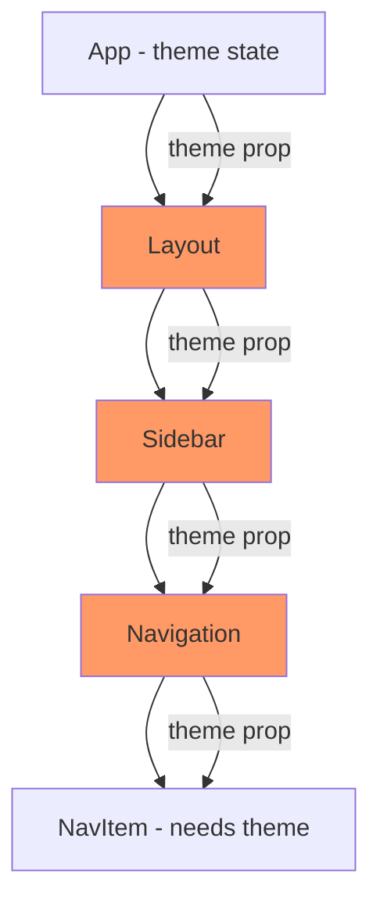
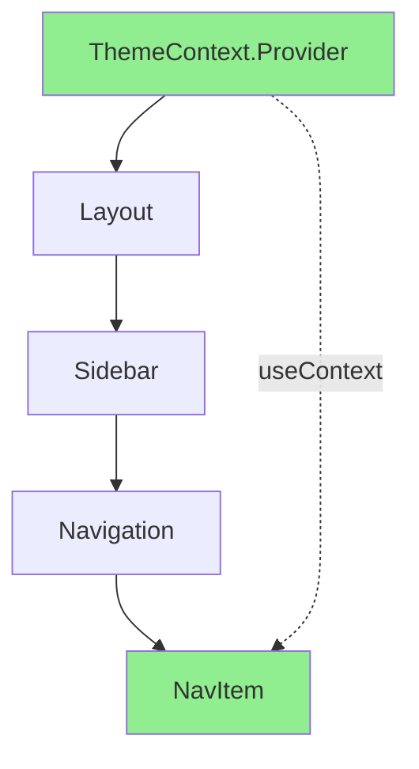
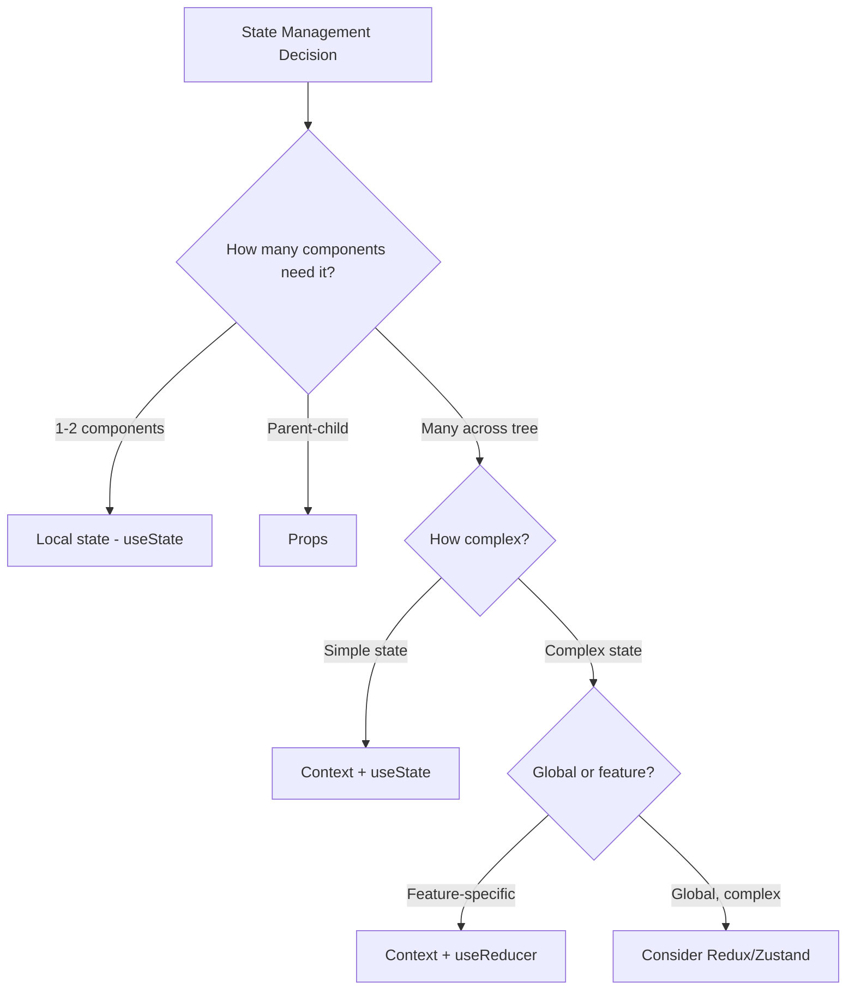

# How to Handle State Management with useContext

Author: [nawazdhandala](https://github.com/nawazdhandala)

Tags: React, JavaScript, State Management, Frontend, Hooks

Description: Learn how to effectively use React useContext for state management, avoiding prop drilling and building scalable component architectures.

---

Prop drilling is the process of passing data through multiple component layers just to reach a deeply nested child. React's Context API, accessed via useContext, provides a clean solution for sharing state across your component tree without passing props at every level.

## Understanding the Problem: Prop Drilling

Before Context, sharing state meant passing props through every intermediate component:



The orange components only exist to pass the theme prop down. This creates maintenance problems and unnecessary re-renders.

## How Context Solves This

Context lets you "teleport" data to any component that needs it:



## Creating and Using Context

### Basic Context Setup

```javascript
// ThemeContext.js
import { createContext, useContext, useState } from 'react';

// Create the context with a default value
const ThemeContext = createContext({
  theme: 'light',
  toggleTheme: () => {},
});

// Custom hook for consuming the context
export function useTheme() {
  const context = useContext(ThemeContext);
  if (context === undefined) {
    throw new Error('useTheme must be used within a ThemeProvider');
  }
  return context;
}

// Provider component that wraps the app
export function ThemeProvider({ children }) {
  const [theme, setTheme] = useState('light');

  const toggleTheme = () => {
    setTheme(prev => prev === 'light' ? 'dark' : 'light');
  };

  const value = {
    theme,
    toggleTheme,
  };

  return (
    <ThemeContext.Provider value={value}>
      {children}
    </ThemeContext.Provider>
  );
}
```

### Using the Context

```javascript
// App.js
import { ThemeProvider } from './ThemeContext';

function App() {
  return (
    <ThemeProvider>
      <Layout />
    </ThemeProvider>
  );
}

// NavItem.js - deeply nested component
import { useTheme } from './ThemeContext';

function NavItem({ label, href }) {
  // Direct access to theme, no prop drilling
  const { theme, toggleTheme } = useTheme();

  return (
    <a
      href={href}
      className={`nav-item nav-item--${theme}`}
    >
      {label}
    </a>
  );
}
```

## Managing Complex State with Context

For more complex state, combine useContext with useReducer:

```javascript
// AuthContext.js
import { createContext, useContext, useReducer, useCallback } from 'react';

// Define action types
const AUTH_ACTIONS = {
  LOGIN_START: 'LOGIN_START',
  LOGIN_SUCCESS: 'LOGIN_SUCCESS',
  LOGIN_FAILURE: 'LOGIN_FAILURE',
  LOGOUT: 'LOGOUT',
};

// Initial state
const initialState = {
  user: null,
  isLoading: false,
  error: null,
  isAuthenticated: false,
};

// Reducer function
function authReducer(state, action) {
  switch (action.type) {
    case AUTH_ACTIONS.LOGIN_START:
      return {
        ...state,
        isLoading: true,
        error: null,
      };
    case AUTH_ACTIONS.LOGIN_SUCCESS:
      return {
        ...state,
        isLoading: false,
        user: action.payload,
        isAuthenticated: true,
      };
    case AUTH_ACTIONS.LOGIN_FAILURE:
      return {
        ...state,
        isLoading: false,
        error: action.payload,
        isAuthenticated: false,
      };
    case AUTH_ACTIONS.LOGOUT:
      return initialState;
    default:
      return state;
  }
}

// Create context
const AuthContext = createContext(undefined);

// Provider component
export function AuthProvider({ children }) {
  const [state, dispatch] = useReducer(authReducer, initialState);

  // Memoize action creators to prevent unnecessary re-renders
  const login = useCallback(async (credentials) => {
    dispatch({ type: AUTH_ACTIONS.LOGIN_START });

    try {
      const response = await fetch('/api/auth/login', {
        method: 'POST',
        headers: { 'Content-Type': 'application/json' },
        body: JSON.stringify(credentials),
      });

      if (!response.ok) {
        throw new Error('Login failed');
      }

      const user = await response.json();
      dispatch({ type: AUTH_ACTIONS.LOGIN_SUCCESS, payload: user });
    } catch (error) {
      dispatch({ type: AUTH_ACTIONS.LOGIN_FAILURE, payload: error.message });
    }
  }, []);

  const logout = useCallback(() => {
    dispatch({ type: AUTH_ACTIONS.LOGOUT });
  }, []);

  const value = {
    ...state,
    login,
    logout,
  };

  return (
    <AuthContext.Provider value={value}>
      {children}
    </AuthContext.Provider>
  );
}

// Custom hook
export function useAuth() {
  const context = useContext(AuthContext);
  if (context === undefined) {
    throw new Error('useAuth must be used within an AuthProvider');
  }
  return context;
}
```

### Using the Auth Context

```javascript
// LoginForm.js
import { useAuth } from './AuthContext';

function LoginForm() {
  const { login, isLoading, error } = useAuth();
  const [email, setEmail] = useState('');
  const [password, setPassword] = useState('');

  const handleSubmit = async (e) => {
    e.preventDefault();
    await login({ email, password });
  };

  return (
    <form onSubmit={handleSubmit}>
      {error && <div className="error">{error}</div>}
      <input
        type="email"
        value={email}
        onChange={e => setEmail(e.target.value)}
        disabled={isLoading}
      />
      <input
        type="password"
        value={password}
        onChange={e => setPassword(e.target.value)}
        disabled={isLoading}
      />
      <button type="submit" disabled={isLoading}>
        {isLoading ? 'Logging in...' : 'Login'}
      </button>
    </form>
  );
}

// ProtectedRoute.js
import { useAuth } from './AuthContext';
import { Navigate } from 'react-router-dom';

function ProtectedRoute({ children }) {
  const { isAuthenticated, isLoading } = useAuth();

  if (isLoading) {
    return <LoadingSpinner />;
  }

  if (!isAuthenticated) {
    return <Navigate to="/login" />;
  }

  return children;
}
```

## Optimizing Context Performance

Context has a performance consideration: all consumers re-render when the context value changes. Here are strategies to optimize:

### Split Contexts by Update Frequency

```javascript
// BAD: Single context for everything
const AppContext = createContext({
  user: null,
  theme: 'light',
  notifications: [],
  settings: {},
});

// GOOD: Separate contexts for different concerns
const UserContext = createContext(null);
const ThemeContext = createContext('light');
const NotificationContext = createContext([]);
const SettingsContext = createContext({});

// Compose providers
function AppProviders({ children }) {
  return (
    <UserProvider>
      <ThemeProvider>
        <NotificationProvider>
          <SettingsProvider>
            {children}
          </SettingsProvider>
        </NotificationProvider>
      </ThemeProvider>
    </UserProvider>
  );
}
```

### Memoize Context Value

```javascript
// BAD: New object on every render
function ThemeProvider({ children }) {
  const [theme, setTheme] = useState('light');

  // This creates a new object every render
  return (
    <ThemeContext.Provider value={{ theme, setTheme }}>
      {children}
    </ThemeContext.Provider>
  );
}

// GOOD: Memoize the context value
function ThemeProvider({ children }) {
  const [theme, setTheme] = useState('light');

  // Only creates new object when theme changes
  const value = useMemo(() => ({
    theme,
    setTheme,
  }), [theme]);

  return (
    <ThemeContext.Provider value={value}>
      {children}
    </ThemeContext.Provider>
  );
}
```

### Separate State and Dispatch Contexts

```javascript
// For complex state, separate state from actions
const StateContext = createContext(undefined);
const DispatchContext = createContext(undefined);

function AppProvider({ children }) {
  const [state, dispatch] = useReducer(reducer, initialState);

  return (
    <StateContext.Provider value={state}>
      <DispatchContext.Provider value={dispatch}>
        {children}
      </DispatchContext.Provider>
    </StateContext.Provider>
  );
}

// Components that only dispatch actions won't re-render on state changes
function useAppDispatch() {
  const dispatch = useContext(DispatchContext);
  if (dispatch === undefined) {
    throw new Error('useAppDispatch must be used within AppProvider');
  }
  return dispatch;
}

function useAppState() {
  const state = useContext(StateContext);
  if (state === undefined) {
    throw new Error('useAppState must be used within AppProvider');
  }
  return state;
}

// AddButton only needs dispatch, won't re-render when state changes
function AddButton() {
  const dispatch = useAppDispatch();

  return (
    <button onClick={() => dispatch({ type: 'ADD' })}>
      Add Item
    </button>
  );
}
```

## Context vs Other State Management

When should you use Context vs other solutions?



| Scenario | Solution |
|----------|----------|
| Form inputs | Local useState |
| Parent-child communication | Props |
| Theme, auth, locale | Context + useState |
| Feature with complex state | Context + useReducer |
| Large app, many features | Redux, Zustand, or Jotai |
| Server state | React Query or SWR |

## Common Patterns

### Provider Composition

```javascript
// Compose multiple providers cleanly
function composeProviders(...providers) {
  return ({ children }) =>
    providers.reduceRight(
      (acc, Provider) => <Provider>{acc}</Provider>,
      children
    );
}

const AppProviders = composeProviders(
  AuthProvider,
  ThemeProvider,
  NotificationProvider,
  SettingsProvider
);

// Usage
function App() {
  return (
    <AppProviders>
      <Router />
    </AppProviders>
  );
}
```

### Context with TypeScript

```typescript
// Types for context
interface AuthState {
  user: User | null;
  isLoading: boolean;
  error: string | null;
  isAuthenticated: boolean;
}

interface AuthContextType extends AuthState {
  login: (credentials: Credentials) => Promise<void>;
  logout: () => void;
}

// Create context with undefined default
const AuthContext = createContext<AuthContextType | undefined>(undefined);

// Type-safe hook
export function useAuth(): AuthContextType {
  const context = useContext(AuthContext);
  if (context === undefined) {
    throw new Error('useAuth must be used within an AuthProvider');
  }
  return context;
}
```

## Summary

Context with useContext provides a powerful way to share state across your React application:

| Concept | Purpose |
|---------|---------|
| createContext | Create a context with default value |
| Provider | Wrap components that need access to context |
| useContext | Hook to consume context value |
| useReducer | Manage complex state with actions |
| useMemo | Optimize context value to prevent re-renders |
| Custom hooks | Encapsulate context access with error handling |

By splitting contexts by concern, memoizing values, and separating state from dispatch, you can build performant state management that scales with your application without the overhead of external libraries.
