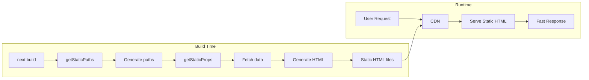
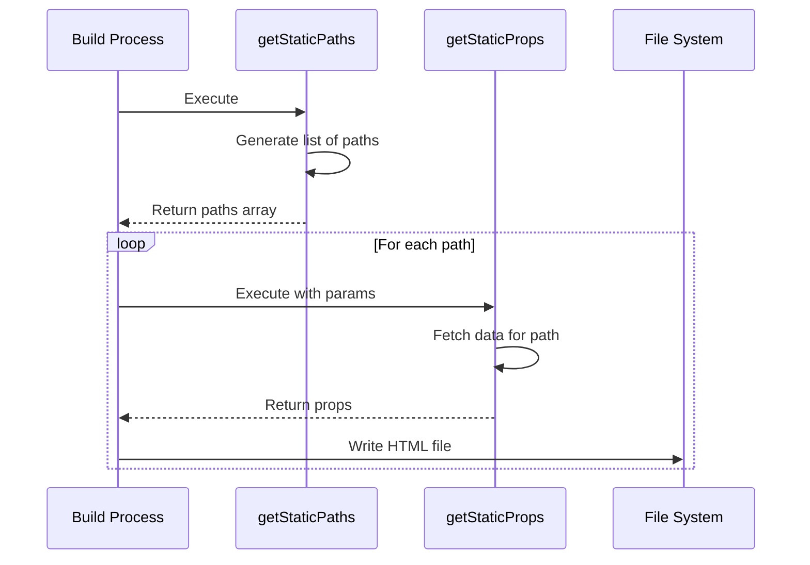
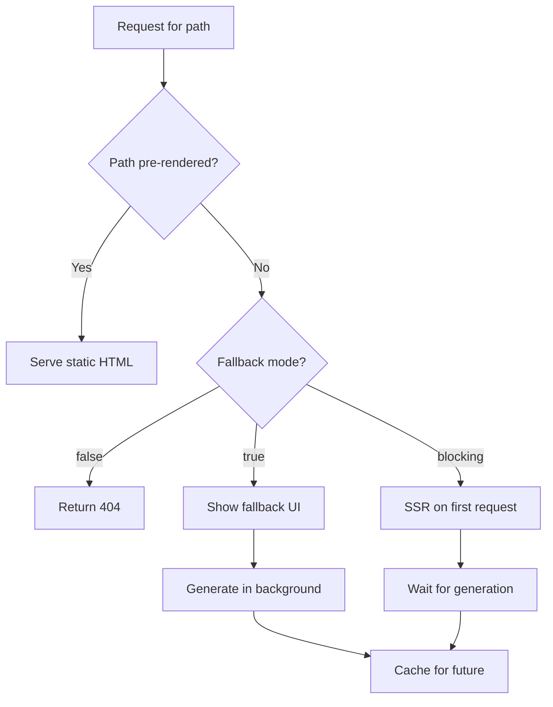
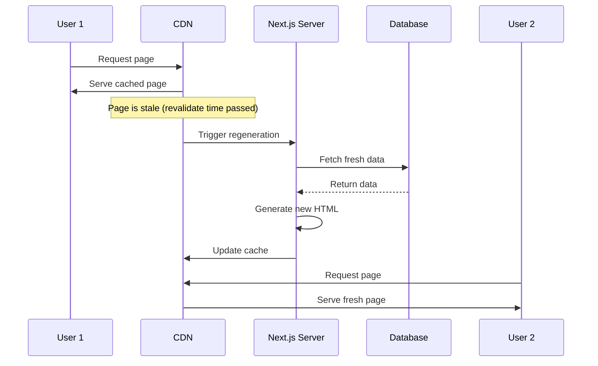
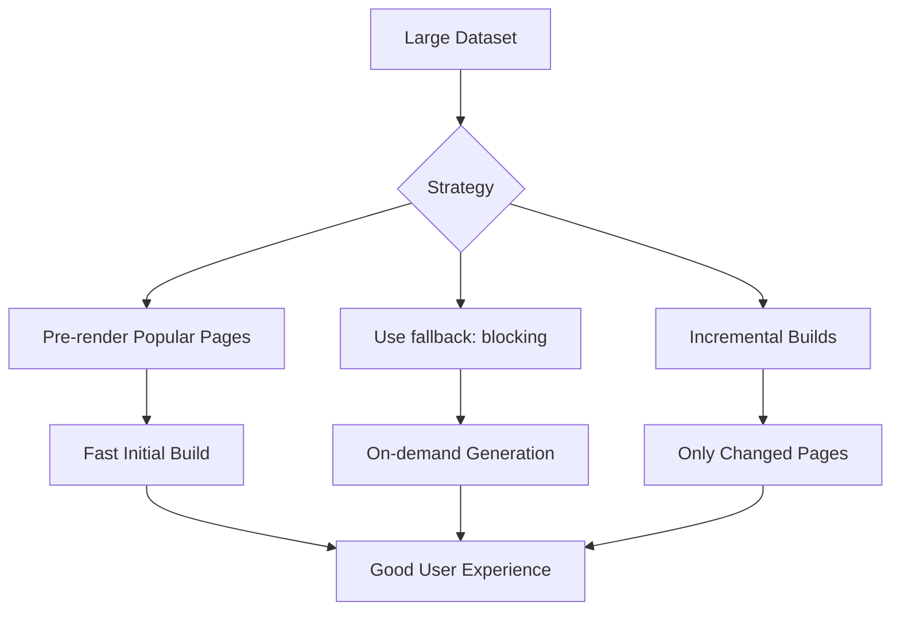

# How to Handle Static Site Generation (SSG) in Next.js

Author: [nawazdhandala](https://www.github.com/nawazdhandala)

Tags: Next.js, Static Site Generation, SSG, React, Performance, Web Development, JavaScript

Description: A practical guide to implementing Static Site Generation in Next.js for faster page loads and better SEO.

---

## Introduction

Static Site Generation (SSG) is one of Next.js's most powerful features for building high-performance websites. By pre-rendering pages at build time, SSG delivers lightning-fast page loads and excellent SEO. This guide covers everything you need to know about implementing SSG effectively.

## Understanding Static Site Generation

SSG generates HTML at build time rather than on each request. This approach offers significant performance benefits.



## Basic SSG Implementation

### Using getStaticProps

The `getStaticProps` function runs at build time and provides props to your page component.

```javascript
// pages/about.js

// This function runs at build time
export async function getStaticProps() {
  // Fetch data from an API, database, or file system
  const response = await fetch('https://api.example.com/company-info');
  const companyInfo = await response.json();

  return {
    props: {
      companyInfo,
      // This timestamp shows when the page was built
      buildTime: new Date().toISOString(),
    },
  };
}

// The page component receives props from getStaticProps
export default function AboutPage({ companyInfo, buildTime }) {
  return (
    <div>
      <h1>About {companyInfo.name}</h1>
      <p>{companyInfo.description}</p>
      <footer>
        <small>Page generated at: {buildTime}</small>
      </footer>
    </div>
  );
}
```

### Dynamic Routes with getStaticPaths

For dynamic routes, you need both `getStaticPaths` and `getStaticProps`.



```javascript
// pages/posts/[slug].js

// Generate all possible paths at build time
export async function getStaticPaths() {
  // Fetch list of all posts
  const response = await fetch('https://api.example.com/posts');
  const posts = await response.json();

  // Generate paths for each post
  const paths = posts.map((post) => ({
    params: {
      slug: post.slug,
    },
  }));

  return {
    paths,
    // fallback options: false, true, or 'blocking'
    fallback: false,
  };
}

// Fetch data for each individual post
export async function getStaticProps({ params }) {
  const { slug } = params;

  const response = await fetch(`https://api.example.com/posts/${slug}`);
  const post = await response.json();

  // Handle post not found
  if (!post) {
    return {
      notFound: true,
    };
  }

  return {
    props: {
      post,
    },
  };
}

export default function PostPage({ post }) {
  return (
    <article>
      <h1>{post.title}</h1>
      <div dangerouslySetInnerHTML={{ __html: post.content }} />
    </article>
  );
}
```

## Fallback Strategies

The `fallback` option in `getStaticPaths` determines how Next.js handles paths not generated at build time.



### Fallback: false

Use when you have a known, finite set of paths.

```javascript
export async function getStaticPaths() {
  const posts = await getAllPosts();

  return {
    paths: posts.map((post) => ({
      params: { slug: post.slug },
    })),
    // Any path not returned will result in 404
    fallback: false,
  };
}
```

### Fallback: true

Use for large datasets where you want to generate pages on-demand.

```javascript
// pages/products/[id].js

export async function getStaticPaths() {
  // Only pre-render the most popular products
  const popularProducts = await getPopularProducts(100);

  return {
    paths: popularProducts.map((product) => ({
      params: { id: product.id.toString() },
    })),
    // New paths will be generated on-demand
    fallback: true,
  };
}

export async function getStaticProps({ params }) {
  const product = await getProduct(params.id);

  if (!product) {
    return { notFound: true };
  }

  return {
    props: { product },
    // Re-validate every hour
    revalidate: 3600,
  };
}

export default function ProductPage({ product }) {
  const router = useRouter();

  // Show loading state for fallback pages
  if (router.isFallback) {
    return (
      <div>
        <h1>Loading...</h1>
        <p>Please wait while we load this product.</p>
      </div>
    );
  }

  return (
    <div>
      <h1>{product.name}</h1>
      <p>{product.description}</p>
      <p>Price: ${product.price}</p>
    </div>
  );
}
```

### Fallback: 'blocking'

Similar to `true`, but waits for generation before showing the page.

```javascript
export async function getStaticPaths() {
  const posts = await getRecentPosts(50);

  return {
    paths: posts.map((post) => ({
      params: { slug: post.slug },
    })),
    // Server-render on first request, then cache
    fallback: 'blocking',
  };
}
```

## Incremental Static Regeneration (ISR)

ISR allows you to update static pages after deployment without rebuilding the entire site.



```javascript
// pages/news/[id].js

export async function getStaticPaths() {
  const articles = await getLatestArticles(20);

  return {
    paths: articles.map((article) => ({
      params: { id: article.id.toString() },
    })),
    fallback: 'blocking',
  };
}

export async function getStaticProps({ params }) {
  const article = await getArticle(params.id);

  if (!article) {
    return { notFound: true };
  }

  return {
    props: {
      article,
      lastUpdated: new Date().toISOString(),
    },
    // Revalidate every 60 seconds
    // The page will be regenerated in the background when a request comes in
    revalidate: 60,
  };
}

export default function ArticlePage({ article, lastUpdated }) {
  return (
    <article>
      <h1>{article.title}</h1>
      <time>{article.publishedAt}</time>
      <div>{article.content}</div>
      <footer>
        <small>Last updated: {lastUpdated}</small>
      </footer>
    </article>
  );
}
```

## On-Demand Revalidation

Trigger page regeneration programmatically using API routes.

```javascript
// pages/api/revalidate.js

export default async function handler(req, res) {
  // Verify the request is authorized
  const { secret, path } = req.query;

  if (secret !== process.env.REVALIDATION_SECRET) {
    return res.status(401).json({ message: 'Invalid token' });
  }

  if (!path) {
    return res.status(400).json({ message: 'Path is required' });
  }

  try {
    // Revalidate the specified path
    await res.revalidate(path);

    return res.json({
      revalidated: true,
      path,
      timestamp: new Date().toISOString(),
    });
  } catch (error) {
    console.error('Revalidation error:', error);
    return res.status(500).json({
      message: 'Error revalidating',
      error: error.message,
    });
  }
}
```

```javascript
// Example: Webhook handler for CMS updates
// pages/api/cms-webhook.js

export default async function handler(req, res) {
  // Verify webhook signature
  const signature = req.headers['x-webhook-signature'];
  if (!verifySignature(signature, req.body)) {
    return res.status(401).json({ message: 'Invalid signature' });
  }

  const { type, data } = req.body;

  try {
    switch (type) {
      case 'post.published':
      case 'post.updated':
        // Revalidate the specific post page
        await res.revalidate(`/posts/${data.slug}`);
        // Also revalidate the posts listing page
        await res.revalidate('/posts');
        break;

      case 'post.deleted':
        // Revalidate the posts listing page
        await res.revalidate('/posts');
        break;

      default:
        console.log('Unknown webhook type:', type);
    }

    return res.json({ success: true });
  } catch (error) {
    console.error('Webhook handling error:', error);
    return res.status(500).json({ error: error.message });
  }
}
```

## Working with External Data Sources

### Fetching from APIs

```javascript
// lib/api.js

const API_BASE_URL = process.env.API_URL;

export async function fetchWithRetry(url, options = {}, retries = 3) {
  for (let i = 0; i < retries; i++) {
    try {
      const response = await fetch(url, {
        ...options,
        headers: {
          'Content-Type': 'application/json',
          ...options.headers,
        },
      });

      if (!response.ok) {
        throw new Error(`HTTP ${response.status}: ${response.statusText}`);
      }

      return response.json();
    } catch (error) {
      if (i === retries - 1) throw error;
      // Wait before retrying
      await new Promise((resolve) => setTimeout(resolve, 1000 * (i + 1)));
    }
  }
}

export async function getAllPosts() {
  return fetchWithRetry(`${API_BASE_URL}/posts`);
}

export async function getPostBySlug(slug) {
  return fetchWithRetry(`${API_BASE_URL}/posts/${slug}`);
}
```

### Reading from File System

```javascript
// lib/markdown.js
import fs from 'fs';
import path from 'path';
import matter from 'gray-matter';

const postsDirectory = path.join(process.cwd(), 'content/posts');

export function getAllPostSlugs() {
  const fileNames = fs.readdirSync(postsDirectory);

  return fileNames
    .filter((name) => name.endsWith('.md'))
    .map((name) => name.replace(/\.md$/, ''));
}

export function getPostBySlug(slug) {
  const fullPath = path.join(postsDirectory, `${slug}.md`);
  const fileContents = fs.readFileSync(fullPath, 'utf8');

  // Parse frontmatter
  const { data, content } = matter(fileContents);

  return {
    slug,
    frontmatter: data,
    content,
  };
}
```

```javascript
// pages/blog/[slug].js

import { getAllPostSlugs, getPostBySlug } from '../../lib/markdown';
import { remark } from 'remark';
import html from 'remark-html';

export async function getStaticPaths() {
  const slugs = getAllPostSlugs();

  return {
    paths: slugs.map((slug) => ({
      params: { slug },
    })),
    fallback: false,
  };
}

export async function getStaticProps({ params }) {
  const post = getPostBySlug(params.slug);

  // Convert markdown to HTML
  const processedContent = await remark()
    .use(html)
    .process(post.content);

  return {
    props: {
      post: {
        ...post,
        contentHtml: processedContent.toString(),
      },
    },
  };
}
```

## Performance Optimization

### Parallel Data Fetching

```javascript
export async function getStaticProps({ params }) {
  // Fetch multiple data sources in parallel
  const [post, author, relatedPosts, comments] = await Promise.all([
    getPost(params.slug),
    getAuthor(params.slug),
    getRelatedPosts(params.slug),
    getComments(params.slug),
  ]);

  return {
    props: {
      post,
      author,
      relatedPosts,
      comments,
    },
    revalidate: 300,
  };
}
```

### Reducing Build Times



```javascript
// Only pre-render a subset of pages at build time
export async function getStaticPaths() {
  // For a blog with 10,000 posts, only pre-render recent ones
  const recentPosts = await getRecentPosts({ limit: 100 });

  return {
    paths: recentPosts.map((post) => ({
      params: { slug: post.slug },
    })),
    // Older posts will be generated on first request
    fallback: 'blocking',
  };
}
```

## Common Patterns

### Preview Mode

Enable content editors to preview draft content.

```javascript
// pages/api/preview.js

export default async function handler(req, res) {
  const { secret, slug } = req.query;

  // Validate the secret
  if (secret !== process.env.PREVIEW_SECRET) {
    return res.status(401).json({ message: 'Invalid token' });
  }

  // Check if the post exists
  const post = await getPostBySlug(slug, { preview: true });
  if (!post) {
    return res.status(404).json({ message: 'Post not found' });
  }

  // Enable Preview Mode
  res.setPreviewData({
    slug,
    timestamp: Date.now(),
  });

  // Redirect to the post page
  res.redirect(`/posts/${slug}`);
}

// pages/api/exit-preview.js
export default function handler(req, res) {
  res.clearPreviewData();
  res.redirect('/');
}
```

```javascript
// pages/posts/[slug].js

export async function getStaticProps({ params, preview, previewData }) {
  // Fetch draft content if in preview mode
  const post = await getPostBySlug(params.slug, {
    preview: preview || false,
  });

  return {
    props: {
      post,
      preview: preview || false,
    },
  };
}

export default function PostPage({ post, preview }) {
  return (
    <div>
      {preview && (
        <div className="preview-banner">
          Preview Mode - <a href="/api/exit-preview">Exit Preview</a>
        </div>
      )}
      <article>
        <h1>{post.title}</h1>
        <div>{post.content}</div>
      </article>
    </div>
  );
}
```

### Handling Localization

```javascript
// next.config.js
module.exports = {
  i18n: {
    locales: ['en', 'es', 'fr'],
    defaultLocale: 'en',
  },
};
```

```javascript
// pages/posts/[slug].js

export async function getStaticPaths({ locales }) {
  const posts = await getAllPosts();

  // Generate paths for all locales
  const paths = posts.flatMap((post) =>
    locales.map((locale) => ({
      params: { slug: post.slug },
      locale,
    }))
  );

  return {
    paths,
    fallback: false,
  };
}

export async function getStaticProps({ params, locale }) {
  const post = await getPostBySlug(params.slug, locale);

  return {
    props: {
      post,
      locale,
    },
  };
}
```

## Summary

Static Site Generation in Next.js provides excellent performance and SEO benefits. Key takeaways:

1. Use `getStaticProps` for pages with data that can be pre-rendered at build time
2. Combine `getStaticPaths` with `getStaticProps` for dynamic routes
3. Choose the appropriate fallback strategy based on your use case
4. Implement ISR with `revalidate` to keep content fresh without full rebuilds
5. Use on-demand revalidation for instant updates when content changes
6. Optimize build times by pre-rendering only essential pages
7. Implement preview mode for content editors

By mastering these SSG techniques, you can build fast, scalable Next.js applications that deliver excellent user experiences.
