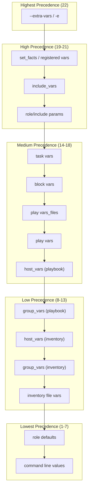
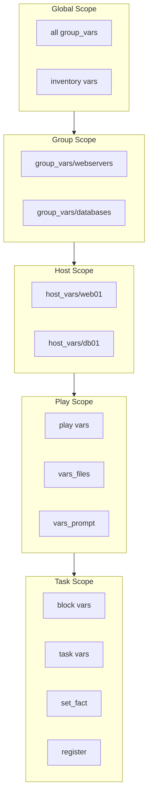
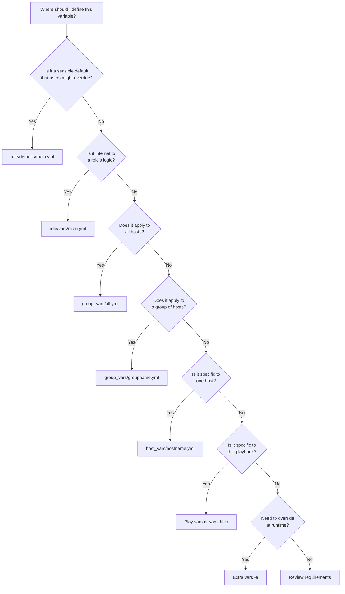

# How to Handle Variable Precedence in Ansible

Author: [nawazdhandala](https://www.github.com/nawazdhandala)

Tags: Ansible, DevOps, Automation, Variables, Configuration Management, Best Practices

Description: Master Ansible variable precedence to avoid unexpected behavior and write maintainable playbooks by understanding where and how to define variables.

---

Ansible uses variables extensively to make playbooks flexible and reusable. However, with over 20 different places where variables can be defined, understanding variable precedence is crucial for writing predictable automation. This guide explains Ansible's variable precedence hierarchy and provides best practices for managing variables effectively.

## Understanding Variable Precedence

Ansible processes variables in a specific order, with higher precedence values overriding lower ones. When the same variable is defined in multiple places, the value from the highest precedence location wins.

## Variable Precedence Hierarchy



## Complete Precedence List (Lowest to Highest)

Here is the complete list of variable precedence in Ansible, from lowest to highest:

```yaml
# Variable Precedence Order (1 = lowest, 22 = highest)
#
# 1.  command line values (e.g., -u my_user)
# 2.  role defaults (defined in role/defaults/main.yml)
# 3.  inventory file or script group vars
# 4.  inventory group_vars/all
# 5.  playbook group_vars/all
# 6.  inventory group_vars/*
# 7.  playbook group_vars/*
# 8.  inventory file or script host vars
# 9.  inventory host_vars/*
# 10. playbook host_vars/*
# 11. host facts / cached set_facts
# 12. play vars
# 13. play vars_prompt
# 14. play vars_files
# 15. role vars (defined in role/vars/main.yml)
# 16. block vars (only for tasks in block)
# 17. task vars (only for the task)
# 18. include_vars
# 19. set_facts / registered vars
# 20. role parameters
# 21. include parameters
# 22. extra vars (command line -e)
```

## Practical Examples

### Example 1: Role Defaults vs Role Vars

Understanding when to use `defaults` versus `vars` in roles is critical.

```yaml
# roles/webserver/defaults/main.yml
# Defaults have LOW precedence - easily overridable by users
# Use for values that users commonly customize

http_port: 80                    # Default port, users can override
max_connections: 100             # Conservative default
document_root: /var/www/html    # Standard location
enable_ssl: false               # SSL disabled by default
```

```yaml
# roles/webserver/vars/main.yml
# Role vars have HIGH precedence - hard to override
# Use for internal role logic that should not change

_webserver_internal_config: /etc/nginx/conf.d
_webserver_service_name: nginx
_supported_os_families:
  - Debian
  - RedHat
```

```yaml
# playbook.yml
# Demonstrating how role defaults can be overridden
---
- name: Deploy web servers
  hosts: webservers

  roles:
    # Override role defaults using role parameters
    - role: webserver
      vars:
        # These override defaults/main.yml values
        http_port: 8080
        max_connections: 500
        enable_ssl: true
```

### Example 2: Group and Host Variables

Organize variables by scope using inventory structure.

```
inventory/
  group_vars/
    all.yml           # Variables for all hosts
    webservers.yml    # Variables for webservers group
    databases.yml     # Variables for databases group
  host_vars/
    web01.yml         # Variables specific to web01
    db01.yml          # Variables specific to db01
  hosts.ini           # Inventory file
```

```yaml
# inventory/group_vars/all.yml
# Applied to ALL hosts - lowest group precedence
# Good for organization-wide defaults

ntp_servers:
  - ntp1.example.com
  - ntp2.example.com

dns_servers:
  - 8.8.8.8
  - 8.8.4.4

timezone: UTC
log_retention_days: 30
```

```yaml
# inventory/group_vars/webservers.yml
# Applied to all hosts in webservers group
# Overrides values from all.yml for this group

http_port: 80
https_port: 443
worker_processes: auto
worker_connections: 1024

# Override all.yml value for web servers
log_retention_days: 90
```

```yaml
# inventory/host_vars/web01.yml
# Applied only to web01 - highest inventory precedence
# Use for host-specific configurations

worker_processes: 4              # Override group default
ssl_certificate: /etc/ssl/web01.crt
ssl_key: /etc/ssl/web01.key

# Host-specific overrides
max_connections: 2000
```

### Example 3: Play Variables and Vars Files

Variables defined at play level and in external files.

```yaml
# vars/production.yml
# External variable file for production environment

environment: production
debug_mode: false
log_level: warn
database_pool_size: 50
cache_enabled: true
```

```yaml
# vars/development.yml
# External variable file for development environment

environment: development
debug_mode: true
log_level: debug
database_pool_size: 5
cache_enabled: false
```

```yaml
# playbook.yml
# Demonstrating vars, vars_files, and include_vars
---
- name: Configure application
  hosts: webservers

  # Play vars - precedence 12
  vars:
    app_name: myapp
    app_version: "2.0.0"

  # Vars files - precedence 14 (higher than play vars)
  vars_files:
    - vars/common.yml
    # Dynamically load environment-specific vars
    - "vars/{{ target_env | default('development') }}.yml"

  tasks:
    - name: Load additional variables dynamically
      # include_vars - precedence 18 (very high)
      ansible.builtin.include_vars:
        file: "vars/{{ ansible_os_family | lower }}.yml"

    - name: Display resolved variables
      ansible.builtin.debug:
        msg: |
          App: {{ app_name }}
          Version: {{ app_version }}
          Environment: {{ environment }}
          Debug: {{ debug_mode }}
```

## Variable Scope Diagram



### Example 4: Task and Block Variables

Variables defined at block and task level have high precedence.

```yaml
# playbook.yml
# Demonstrating block and task level variables
---
- name: Configure services
  hosts: all

  vars:
    # Play-level default
    service_state: started
    config_backup: true

  tasks:
    - name: Configure web services
      # Block vars - precedence 16
      # Apply to all tasks within this block
      vars:
        service_type: web
        config_dir: /etc/nginx
      block:
        - name: Copy configuration
          ansible.builtin.template:
            src: "{{ service_type }}.conf.j2"
            dest: "{{ config_dir }}/{{ service_type }}.conf"
          # Task vars - precedence 17 (highest in playbook)
          vars:
            template_mode: "0644"

        - name: Ensure service is running
          ansible.builtin.service:
            name: nginx
            state: "{{ service_state }}"

    - name: Configure database services
      vars:
        service_type: database
        config_dir: /etc/postgresql
      block:
        - name: Copy database configuration
          ansible.builtin.template:
            src: "{{ service_type }}.conf.j2"
            dest: "{{ config_dir }}/{{ service_type }}.conf"
```

### Example 5: Using Extra Variables

Extra variables have the highest precedence and override everything.

```bash
# Pass extra variables via command line
# These override ALL other variable definitions

# Single variable
ansible-playbook playbook.yml -e "http_port=8080"

# Multiple variables
ansible-playbook playbook.yml -e "http_port=8080 debug_mode=true"

# JSON format for complex values
ansible-playbook playbook.yml -e '{"http_port": 8080, "servers": ["web1", "web2"]}'

# Load variables from a file (highest flexibility)
ansible-playbook playbook.yml -e "@vars/override.yml"

# Combine file and inline variables
ansible-playbook playbook.yml -e "@vars/override.yml" -e "version=2.0.0"
```

```yaml
# vars/override.yml
# Extra vars file for command-line overrides
# WARNING: These override ALL other variable sources

http_port: 9090
debug_mode: true
force_deploy: true
skip_tests: false
```

### Example 6: Registered Variables and Set Facts

Dynamic variables set during playbook execution.

```yaml
# playbook.yml
# Demonstrating registered vars and set_fact
---
- name: Dynamic variable handling
  hosts: webservers

  tasks:
    - name: Get current application version
      ansible.builtin.command: cat /opt/app/VERSION
      register: version_output
      # Registered variable - precedence 19
      # Contains: stdout, stderr, rc, changed, etc.
      changed_when: false

    - name: Set version fact
      # set_fact - precedence 19
      # Creates variables available for rest of play
      ansible.builtin.set_fact:
        current_version: "{{ version_output.stdout }}"
        needs_upgrade: "{{ version_output.stdout is version('2.0.0', '<') }}"
        # Caching makes fact persistent across plays
        cacheable: true

    - name: Display version information
      ansible.builtin.debug:
        msg: |
          Current version: {{ current_version }}
          Needs upgrade: {{ needs_upgrade }}

    - name: Perform upgrade if needed
      ansible.builtin.include_tasks: upgrade.yml
      when: needs_upgrade | bool
```

## Best Practices Decision Tree



## Common Pitfalls and Solutions

### Pitfall 1: Unexpected Variable Override

```yaml
# Problem: Variable defined in multiple places
# group_vars/all.yml
http_port: 80

# group_vars/webservers.yml
http_port: 8080

# host_vars/web01.yml
http_port: 9090

# Result: web01 uses port 9090 (host_vars wins)
```

```yaml
# Solution: Use clear naming conventions and documentation
# group_vars/all.yml
# DEFAULT port - override in host_vars for custom ports
default_http_port: 80

# host_vars/web01.yml
# Override default for this specific host
# Reason: web01 runs behind reverse proxy
http_port: 9090
```

### Pitfall 2: Role Vars Being Immutable

```yaml
# Problem: Cannot override role vars easily
# roles/myapp/vars/main.yml
important_setting: "locked_value"  # Hard to override!

# Solution: Move to defaults if it should be configurable
# roles/myapp/defaults/main.yml
important_setting: "default_value"  # Users can override
```

### Pitfall 3: Debugging Variable Sources

```yaml
# playbook.yml
# Debug where a variable value comes from
---
- name: Debug variable precedence
  hosts: webservers

  tasks:
    - name: Show variable value and type
      ansible.builtin.debug:
        msg: |
          Variable: http_port
          Value: {{ http_port }}
          Type: {{ http_port | type_debug }}

    - name: Show all variables for debugging
      # WARNING: May expose sensitive data
      ansible.builtin.debug:
        var: vars
      when: debug_mode | default(false) | bool

    - name: Show hostvars for this host
      ansible.builtin.debug:
        var: hostvars[inventory_hostname]
      when: debug_mode | default(false) | bool
```

## Variable Merging Behavior

Ansible can merge dictionaries and lists using special settings.

```yaml
# ansible.cfg
[defaults]
# Enable hash (dictionary) merging instead of replacement
hash_behaviour = merge  # Default is 'replace'
```

```yaml
# Example of hash merging
# group_vars/all.yml
app_config:
  port: 80
  timeout: 30

# group_vars/webservers.yml
app_config:
  timeout: 60
  max_connections: 100

# Result with hash_behaviour=merge:
# app_config:
#   port: 80           (from all.yml)
#   timeout: 60        (overridden by webservers.yml)
#   max_connections: 100 (added by webservers.yml)

# Result with hash_behaviour=replace (default):
# app_config:
#   timeout: 60
#   max_connections: 100
# (port is lost!)
```

```yaml
# Better approach: Use combine filter explicitly
# playbook.yml
---
- name: Merge configurations explicitly
  hosts: webservers

  vars:
    base_config:
      port: 80
      timeout: 30

    override_config:
      timeout: 60
      max_connections: 100

  tasks:
    - name: Create merged configuration
      ansible.builtin.set_fact:
        # Combine filter merges dictionaries predictably
        final_config: "{{ base_config | combine(override_config) }}"

    - name: Display merged config
      ansible.builtin.debug:
        var: final_config
        # Result:
        # port: 80
        # timeout: 60
        # max_connections: 100
```

## Summary

Understanding variable precedence in Ansible is essential for writing predictable and maintainable automation. Key takeaways:

1. **Extra vars (-e) always win** - Use them for runtime overrides
2. **Role defaults are for users** - Easy to override, use for configurable values
3. **Role vars are for internals** - Hard to override, use for role logic
4. **Host vars beat group vars** - More specific scope wins
5. **Task/block vars have high precedence** - Use for task-specific overrides
6. **Document your variables** - Make it clear where and why variables are defined

By following these guidelines and using the appropriate variable location for each use case, you can avoid unexpected behavior and create maintainable Ansible automation.
