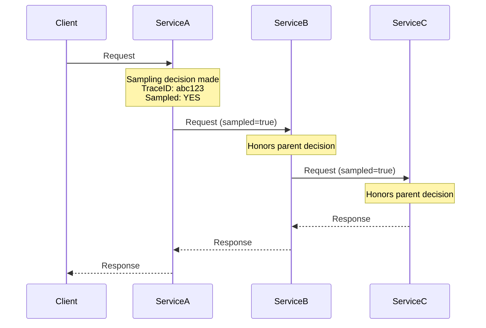
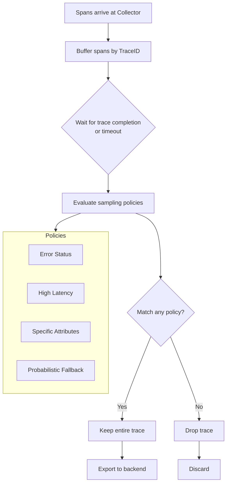
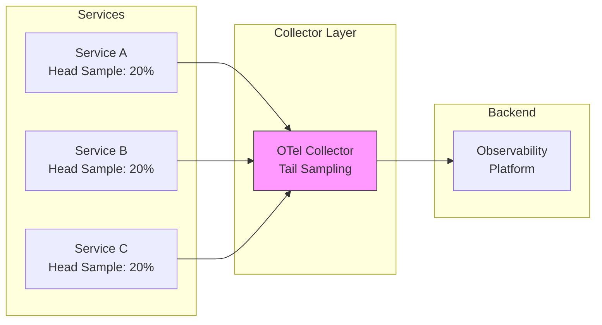
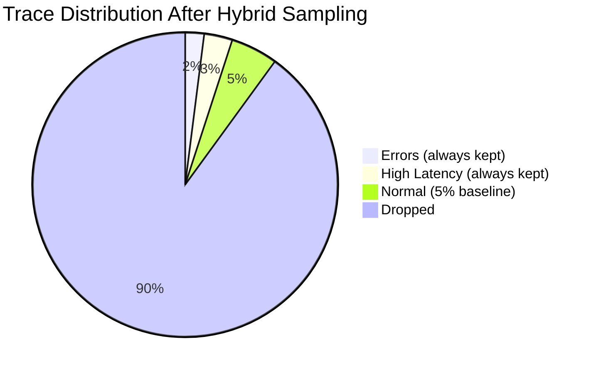

# How to Handle Head-Based vs Tail-Based Sampling

Author: [nawazdhandala](https://www.github.com/nawazdhandala)

Tags: OpenTelemetry, Sampling, Observability, Tracing, Performance, Cost Optimization, Tail Sampling, Head Sampling

Description: A practical guide to understanding and implementing head-based and tail-based sampling strategies in OpenTelemetry for optimal trace collection.

---

Sampling is one of the most critical decisions you will make when implementing distributed tracing. Collecting 100% of traces is expensive and often unnecessary. The key is choosing the right sampling strategy that balances cost, performance, and observability needs.

This guide covers the two primary sampling approaches in OpenTelemetry: head-based and tail-based sampling. You will learn when to use each, how to implement them, and how to combine them for optimal results.

---

## What is Sampling?

Sampling is the process of selecting which traces to keep and which to discard. Without sampling, high-traffic systems can generate millions of spans per minute, leading to:

- Excessive storage costs
- Network bandwidth saturation
- Slower query performance in your observability backend
- Difficulty finding relevant traces among the noise

---

## Head-Based Sampling

Head-based sampling makes the decision to sample a trace at the very beginning, when the root span is created. Once the decision is made, it propagates to all downstream services.

### How It Works



### Advantages of Head-Based Sampling

1. **Low overhead** - Decision is made once at the start
2. **Complete traces** - All spans in a sampled trace are guaranteed to be collected
3. **Simple implementation** - Built into most OpenTelemetry SDKs
4. **Predictable costs** - Easy to estimate data volume

### Disadvantages of Head-Based Sampling

1. **No hindsight** - Cannot keep traces based on outcome (errors, latency)
2. **May miss important traces** - Interesting traces might be dropped
3. **Uniform sampling** - Treats all traces equally regardless of importance

### Implementation: Probabilistic Head Sampler (Node.js)

```javascript
// tracing.js - Head-based sampling configuration
const { NodeSDK } = require('@opentelemetry/sdk-node');
const { getNodeAutoInstrumentations } = require('@opentelemetry/auto-instrumentations-node');
const { OTLPTraceExporter } = require('@opentelemetry/exporter-trace-otlp-http');
const { Resource } = require('@opentelemetry/resources');
const {
  ParentBasedSampler,
  TraceIdRatioBasedSampler
} = require('@opentelemetry/sdk-trace-base');

// Create a sampler that keeps 10% of traces
// ParentBasedSampler respects the parent span's sampling decision
const sampler = new ParentBasedSampler({
  // Root spans (no parent) use ratio-based sampling
  root: new TraceIdRatioBasedSampler(0.1), // 10% of traces
});

const sdk = new NodeSDK({
  resource: new Resource({
    'service.name': 'payment-service',
    'deployment.environment': process.env.NODE_ENV || 'development',
  }),
  traceExporter: new OTLPTraceExporter({
    url: 'https://oneuptime.com/otlp/v1/traces',
    headers: {
      'x-oneuptime-token': process.env.ONEUPTIME_TOKEN,
    },
  }),
  sampler: sampler,
  instrumentations: [getNodeAutoInstrumentations()],
});

sdk.start();

// Graceful shutdown
process.on('SIGTERM', () => {
  sdk.shutdown()
    .then(() => console.log('Tracing terminated'))
    .catch((error) => console.error('Error terminating tracing', error))
    .finally(() => process.exit(0));
});
```

### Implementation: Head Sampler (Python)

```python
# tracing.py - Head-based sampling in Python
from opentelemetry import trace
from opentelemetry.sdk.trace import TracerProvider
from opentelemetry.sdk.trace.export import BatchSpanProcessor
from opentelemetry.exporter.otlp.proto.http.trace_exporter import OTLPSpanExporter
from opentelemetry.sdk.trace.sampling import (
    ParentBasedTraceIdRatio,
    TraceIdRatioBased,
)
from opentelemetry.sdk.resources import Resource
import os

# Create a sampler that keeps 15% of root traces
# Child spans follow the parent's sampling decision
sampler = ParentBasedTraceIdRatio(0.15)

resource = Resource.create({
    "service.name": "order-service",
    "deployment.environment": os.getenv("ENVIRONMENT", "development"),
})

provider = TracerProvider(
    resource=resource,
    sampler=sampler,
)

# Configure the OTLP exporter
exporter = OTLPSpanExporter(
    endpoint="https://oneuptime.com/otlp/v1/traces",
    headers={"x-oneuptime-token": os.getenv("ONEUPTIME_TOKEN")},
)

# Use batch processor for efficient export
provider.add_span_processor(BatchSpanProcessor(exporter))

trace.set_tracer_provider(provider)
tracer = trace.get_tracer(__name__)
```

---

## Tail-Based Sampling

Tail-based sampling makes the decision after the trace is complete. This allows you to keep traces based on their actual characteristics, such as errors, high latency, or specific attributes.

### How It Works



### Advantages of Tail-Based Sampling

1. **Intelligent selection** - Keep traces based on actual behavior
2. **Always capture errors** - Never miss error traces
3. **Latency-aware** - Keep slow traces for performance analysis
4. **Attribute-based** - Sample based on customer tier, endpoint, etc.

### Disadvantages of Tail-Based Sampling

1. **Higher resource usage** - Must buffer traces until decision
2. **Memory pressure** - High-cardinality traces consume memory
3. **Complexity** - Requires centralized collector
4. **Potential data loss** - Spans might arrive after decision window

### Implementation: Tail Sampling in OpenTelemetry Collector

```yaml
# otel-collector-config.yaml
# Complete tail-based sampling configuration

receivers:
  otlp:
    protocols:
      grpc:
        endpoint: 0.0.0.0:4317
      http:
        endpoint: 0.0.0.0:4318

processors:
  # Memory limiter prevents out-of-memory crashes
  memory_limiter:
    check_interval: 5s
    limit_mib: 1024
    spike_limit_mib: 256

  # Tail sampling processor with multiple policies
  tail_sampling:
    # How long to wait for a trace to complete
    decision_wait: 30s
    # Maximum number of traces to keep in memory
    num_traces: 100000
    # Expected new traces per second (for memory allocation)
    expected_new_traces_per_sec: 1000

    policies:
      # Policy 1: Always keep error traces
      - name: keep-errors
        type: status_code
        status_code:
          status_codes:
            - ERROR

      # Policy 2: Keep traces with latency above 500ms
      - name: keep-slow-traces
        type: latency
        latency:
          threshold_ms: 500

      # Policy 3: Keep all traces for critical endpoints
      - name: keep-critical-endpoints
        type: string_attribute
        string_attribute:
          key: http.route
          values:
            - /api/v1/payments
            - /api/v1/checkout
            - /api/v1/auth/login
          enabled_regex_matching: false

      # Policy 4: Keep traces from enterprise customers
      - name: keep-enterprise-customers
        type: string_attribute
        string_attribute:
          key: customer.tier
          values:
            - enterprise
            - premium

      # Policy 5: Keep traces with specific error types
      - name: keep-specific-errors
        type: string_attribute
        string_attribute:
          key: error.type
          values:
            - TimeoutError
            - DatabaseError
            - AuthenticationError

      # Policy 6: Probabilistic sampling for everything else
      # This ensures some baseline sampling even for normal traces
      - name: probabilistic-baseline
        type: probabilistic
        probabilistic:
          sampling_percentage: 5

  # Batch processor for efficient export
  batch:
    send_batch_size: 512
    timeout: 10s

exporters:
  otlphttp:
    endpoint: https://oneuptime.com/otlp
    encoding: json
    headers:
      Content-Type: application/json
      x-oneuptime-token: ${ONEUPTIME_TOKEN}

service:
  pipelines:
    traces:
      receivers: [otlp]
      processors: [memory_limiter, tail_sampling, batch]
      exporters: [otlphttp]
```

---

## Combining Head and Tail Sampling

The most effective strategy often combines both approaches. Use head sampling as a first filter to reduce volume, then apply tail sampling for intelligent selection.

### Architecture: Hybrid Sampling



### Implementation: Hybrid Sampling Configuration

**Step 1: Configure Head Sampling in Services**

```javascript
// service-tracing.js - 20% head sampling at the service level
const { ParentBasedSampler, TraceIdRatioBasedSampler } = require('@opentelemetry/sdk-trace-base');

// First filter: Keep only 20% of traces at the source
// This reduces network traffic to the collector
const headSampler = new ParentBasedSampler({
  root: new TraceIdRatioBasedSampler(0.2), // 20% head sampling
});
```

**Step 2: Configure Tail Sampling in Collector**

```yaml
# collector-config.yaml - Tail sampling on pre-filtered traces
processors:
  tail_sampling:
    decision_wait: 30s
    num_traces: 50000
    policies:
      # From the 20% that arrive, keep all errors
      - name: errors-always
        type: status_code
        status_code:
          status_codes: [ERROR]

      # Keep high latency traces
      - name: high-latency
        type: latency
        latency:
          threshold_ms: 1000

      # Keep 25% of remaining traces (5% of original)
      - name: baseline
        type: probabilistic
        probabilistic:
          sampling_percentage: 25
```

### Effective Sampling Rate Calculation



With hybrid sampling:
- **Head sampling**: 20% of traces pass through
- **Tail sampling on errors**: ~100% of error traces kept (from the 20%)
- **Tail sampling baseline**: 25% of non-error traces kept
- **Effective rate for normal traces**: 20% x 25% = 5%
- **Effective rate for errors**: Close to 100% (assuming errors are <20% of traffic)

---

## Choosing the Right Strategy

### Decision Matrix

| Scenario | Recommended Strategy | Rationale |
|----------|---------------------|-----------|
| Low traffic (<1000 req/min) | Head sampling 50-100% | Volume is manageable |
| High traffic (>10000 req/min) | Hybrid sampling | Balance cost and insights |
| Critical production system | Tail sampling for errors | Never miss failures |
| Cost-constrained environment | Aggressive head sampling | Minimize data volume |
| Debugging specific issues | Attribute-based tail sampling | Target specific conditions |

---

## Best Practices

1. **Start with head sampling** - It is simpler and has lower overhead
2. **Add tail sampling for critical paths** - Errors, high latency, important endpoints
3. **Monitor your sampling rates** - Ensure you are not missing important traces
4. **Adjust based on incidents** - If you miss traces during outages, increase sampling
5. **Document your sampling strategy** - Team members should understand what is kept
6. **Review regularly** - Traffic patterns change; sampling should adapt

---

## Summary

| Aspect | Head-Based | Tail-Based | Hybrid |
|--------|------------|------------|--------|
| Decision Point | Start of trace | End of trace | Both |
| Resource Usage | Low | High | Medium |
| Error Capture | Random | Guaranteed | Guaranteed |
| Complexity | Simple | Complex | Medium |
| Best For | Low traffic | Critical systems | High traffic production |

The right sampling strategy depends on your specific requirements. Start simple with head-based sampling, then add tail-based sampling for critical scenarios. Monitor your sampling effectiveness and adjust as your system evolves.

---

## Related Reading

- [How to Reduce Noise in OpenTelemetry](https://oneuptime.com/blog/post/2025-08-25-how-to-reduce-noise-in-opentelemetry/view)
- [Traces and Spans in OpenTelemetry](https://oneuptime.com/blog/post/2025-08-27-traces-and-spans-in-opentelemetry/view)
- [What is OpenTelemetry Collector and Why Use One](https://oneuptime.com/blog/post/2025-09-18-what-is-opentelemetry-collector-and-why-use-one/view)
