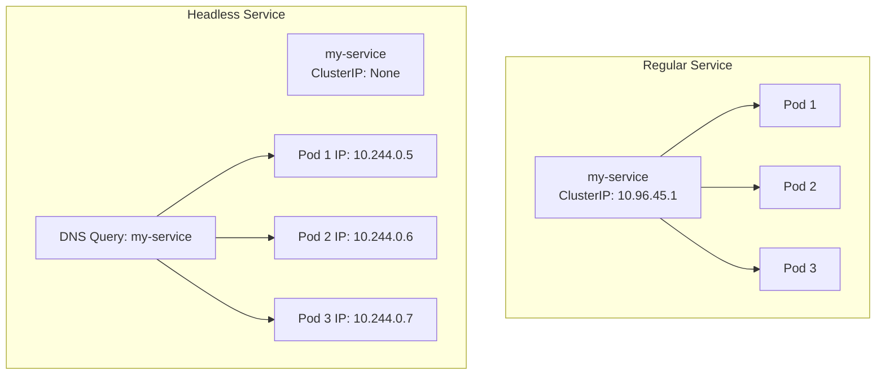

# How to Create and Use Headless Services in Kubernetes

Author: [nawazdhandala](https://www.github.com/nawazdhandala)

Tags: Kubernetes, Services, Networking, StatefulSets, DNS

Description: Learn how to create and use headless Services in Kubernetes for direct pod-to-pod communication. This guide covers DNS records, StatefulSets, and practical use cases.

---

Standard Kubernetes Services provide load balancing with a single virtual IP. But sometimes you need to reach individual pods directly, not through a load balancer. Headless Services give you DNS records for each pod, enabling direct pod-to-pod communication. This is essential for stateful applications like databases and distributed systems.

## What Makes a Service Headless?

A Service becomes headless when you set `clusterIP: None`. Instead of getting a single cluster IP that load balances across pods, DNS returns the IP addresses of all backing pods.



## Create a Headless Service

Here is a basic headless Service:

```yaml
# headless-service.yaml
apiVersion: v1
kind: Service
metadata:
  name: my-headless-svc
  labels:
    app: my-app
spec:
  clusterIP: None  # This makes it headless
  selector:
    app: my-app
  ports:
  - port: 80
    targetPort: 8080
    name: http
```

Apply it:

```bash
kubectl apply -f headless-service.yaml

# Verify it has no ClusterIP
kubectl get svc my-headless-svc
# NAME              TYPE        CLUSTER-IP   EXTERNAL-IP   PORT(S)   AGE
# my-headless-svc   ClusterIP   None         <none>        80/TCP    5s
```

## DNS Resolution with Headless Services

When you query a headless Service, DNS returns all pod IPs:

```bash
# Create a test pod to check DNS
kubectl run dns-test --rm -it --image=busybox:1.35 -- nslookup my-headless-svc

# Output shows multiple A records:
# Name:      my-headless-svc
# Address 1: 10.244.0.5
# Address 2: 10.244.0.6
# Address 3: 10.244.0.7
```

Compare with a regular Service:

```bash
# Regular service returns single ClusterIP
kubectl run dns-test --rm -it --image=busybox:1.35 -- nslookup my-regular-svc

# Output shows one address:
# Name:      my-regular-svc
# Address 1: 10.96.45.123
```

## Headless Services with StatefulSets

Headless Services shine when paired with StatefulSets. Each pod gets a stable DNS name:

```yaml
# statefulset.yaml
apiVersion: v1
kind: Service
metadata:
  name: mysql
spec:
  clusterIP: None
  selector:
    app: mysql
  ports:
  - port: 3306
    name: mysql
---
apiVersion: apps/v1
kind: StatefulSet
metadata:
  name: mysql
spec:
  serviceName: mysql  # Links to the headless Service
  replicas: 3
  selector:
    matchLabels:
      app: mysql
  template:
    metadata:
      labels:
        app: mysql
    spec:
      containers:
      - name: mysql
        image: mysql:8.0
        ports:
        - containerPort: 3306
        env:
        - name: MYSQL_ROOT_PASSWORD
          value: "secretpassword"
```

Each pod gets a predictable DNS name:

```
mysql-0.mysql.default.svc.cluster.local
mysql-1.mysql.default.svc.cluster.local
mysql-2.mysql.default.svc.cluster.local
```

Connect to a specific pod:

```bash
# Connect to the primary (mysql-0)
mysql -h mysql-0.mysql -u root -p

# Connect to a replica
mysql -h mysql-1.mysql -u root -p
```

## Use Cases for Headless Services

### Database Clusters

Databases need to know each node's address for replication:

```yaml
# MongoDB replica set
apiVersion: v1
kind: Service
metadata:
  name: mongo
spec:
  clusterIP: None
  selector:
    app: mongo
  ports:
  - port: 27017
```

MongoDB can then be configured with replica set members:

```javascript
// Inside mongo shell
rs.initiate({
  _id: "rs0",
  members: [
    { _id: 0, host: "mongo-0.mongo:27017" },
    { _id: 1, host: "mongo-1.mongo:27017" },
    { _id: 2, host: "mongo-2.mongo:27017" }
  ]
})
```

### Service Discovery for Distributed Systems

Applications that need to know all peers (Kafka, Elasticsearch, Cassandra):

```yaml
# Kafka brokers
apiVersion: v1
kind: Service
metadata:
  name: kafka-headless
spec:
  clusterIP: None
  selector:
    app: kafka
  ports:
  - port: 9092
    name: broker
```

Kafka can advertise stable hostnames:

```yaml
env:
- name: KAFKA_ADVERTISED_LISTENERS
  value: "PLAINTEXT://$(POD_NAME).kafka-headless:9092"
```

### Client-Side Load Balancing

When you want your application to handle load balancing:

```python
# Python example: Round-robin across pods
import socket
import itertools

def get_pod_ips(service_name):
    """Resolve headless service to get all pod IPs"""
    try:
        _, _, ips = socket.gethostbyname_ex(service_name)
        return ips
    except socket.gaierror:
        return []

# Get all backend IPs
backends = get_pod_ips("my-headless-svc")
# ['10.244.0.5', '10.244.0.6', '10.244.0.7']

# Create a round-robin iterator
backend_cycle = itertools.cycle(backends)

# Each request goes to the next pod
for request in requests:
    target_ip = next(backend_cycle)
    send_request(target_ip, request)
```

## Headless vs Regular Services

| Feature | Regular Service | Headless Service |
|---------|-----------------|------------------|
| ClusterIP | Assigned | None |
| DNS A record | Returns ClusterIP | Returns pod IPs |
| Load balancing | kube-proxy handles | Client handles |
| Session affinity | Supported | Not applicable |
| Use case | Stateless apps | Stateful apps, peer discovery |

## Combining with Other Selectors

Headless Services can target subsets of pods:

```yaml
# Target only pods with role=primary
apiVersion: v1
kind: Service
metadata:
  name: db-primary
spec:
  clusterIP: None
  selector:
    app: postgres
    role: primary
  ports:
  - port: 5432
---
# Target only pods with role=replica
apiVersion: v1
kind: Service
metadata:
  name: db-replicas
spec:
  clusterIP: None
  selector:
    app: postgres
    role: replica
  ports:
  - port: 5432
```

Applications can connect to `db-primary` for writes and `db-replicas` for reads.

## Headless Service Without Selectors

For external endpoints or manual endpoint management:

```yaml
# Headless service without selector
apiVersion: v1
kind: Service
metadata:
  name: external-db
spec:
  clusterIP: None
  ports:
  - port: 5432
---
# Manually define endpoints
apiVersion: v1
kind: Endpoints
metadata:
  name: external-db  # Must match Service name
subsets:
- addresses:
  - ip: 192.168.1.100
  - ip: 192.168.1.101
  ports:
  - port: 5432
```

## Verify DNS Records

Check what DNS returns for your headless Service:

```bash
# Run a DNS query pod
kubectl run dnsutils --rm -it --image=tutum/dnsutils -- bash

# Inside the pod:
# Query the service
dig my-headless-svc.default.svc.cluster.local

# Query a specific pod (if using StatefulSet)
dig mysql-0.mysql.default.svc.cluster.local

# See all SRV records
dig SRV _http._tcp.my-headless-svc.default.svc.cluster.local
```

SRV records are useful when pods expose multiple ports:

```
_http._tcp.my-headless-svc.default.svc.cluster.local. 30 IN SRV 0 50 80 10-244-0-5.my-headless-svc.default.svc.cluster.local.
```

## Summary

Headless Services (clusterIP: None) return pod IPs directly instead of load balancing through a single IP. They enable direct pod-to-pod communication, which is essential for stateful workloads like databases and distributed systems. When combined with StatefulSets, each pod gets a stable DNS name that persists across restarts. Use headless Services when you need peer discovery, client-side load balancing, or direct access to specific pods.
