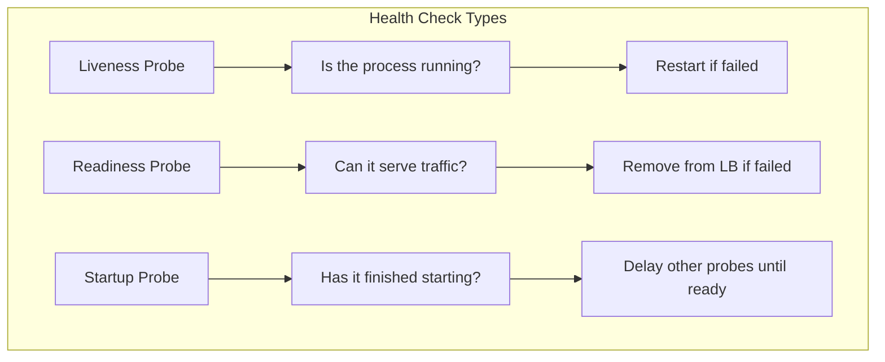
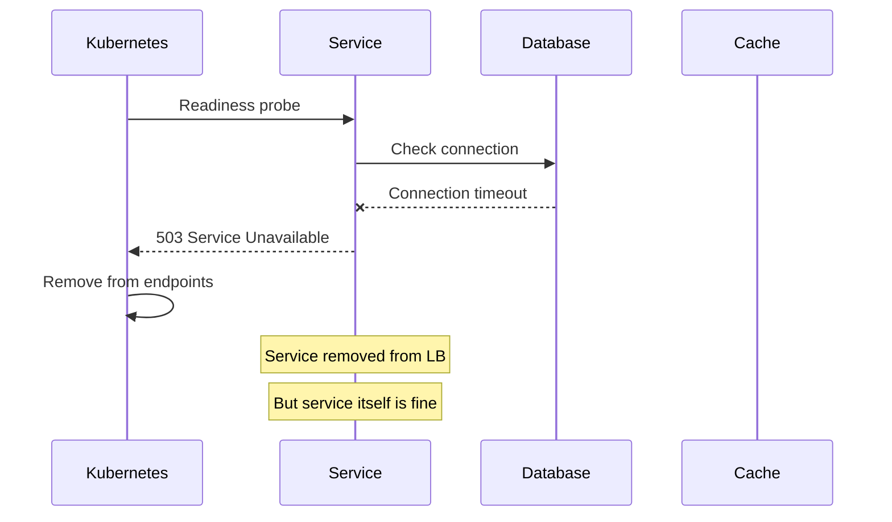
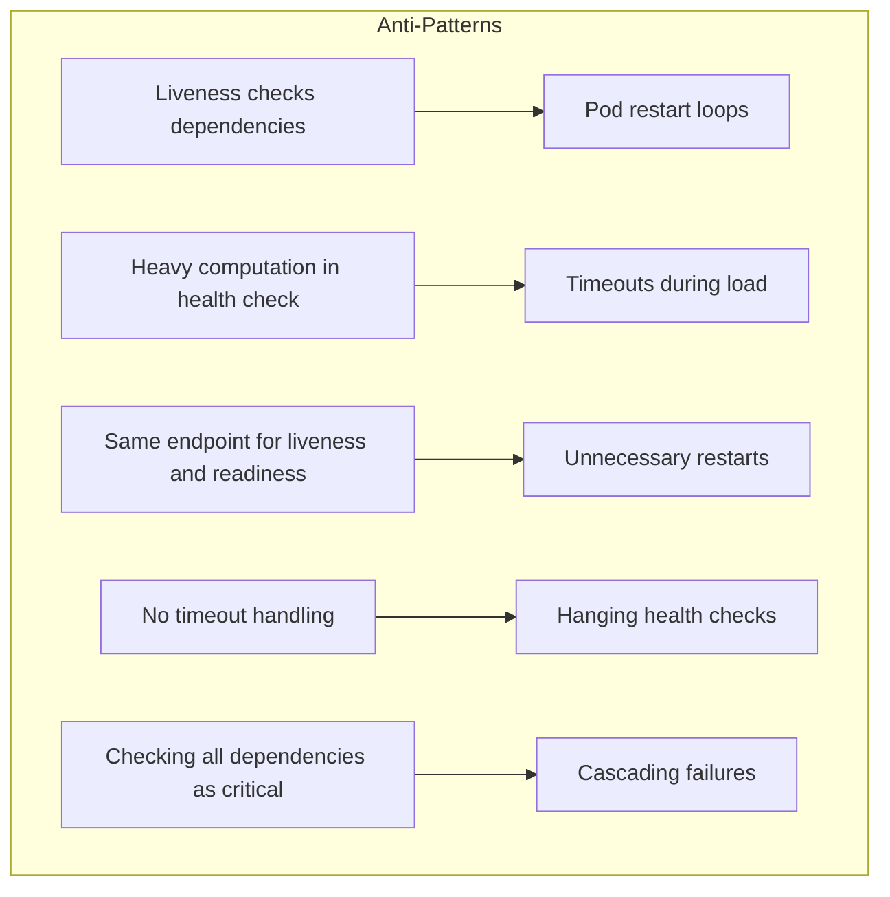

# How to Fix 'Health Check Failed' Service Errors

Author: [nawazdhandala](https://www.github.com/nawazdhandala)

Tags: Health Checks, Microservices, Kubernetes, Monitoring, Troubleshooting, Readiness, Liveness, Service Mesh

Description: Learn how to diagnose and fix health check failures in microservices, including configuring proper liveness and readiness probes, handling dependency failures, and preventing cascading outages.

---

> Health checks are the immune system of your microservices architecture. When they fail, services get removed from load balancers, pods get restarted, and users experience errors. Understanding why health checks fail is critical to maintaining system reliability.

Health check failures can indicate real problems or be false positives caused by misconfiguration. This guide helps you distinguish between the two and fix both.

---

## Types of Health Checks



---

## Common Health Check Failures

### 1. Timeout Issues

The health check takes too long to respond.

```go
// Go - Health check with proper timeout handling
package health

import (
    "context"
    "encoding/json"
    "net/http"
    "sync"
    "time"
)

// HealthChecker provides health check endpoints
type HealthChecker struct {
    checks   map[string]Check
    mu       sync.RWMutex
    timeout  time.Duration
}

// Check represents a single health check
type Check struct {
    Name     string
    Critical bool  // If critical, failing this check fails overall health
    CheckFn  func(ctx context.Context) error
}

// HealthResponse represents the health check response
type HealthResponse struct {
    Status  string                 `json:"status"`
    Checks  map[string]CheckResult `json:"checks"`
    Latency string                 `json:"latency"`
}

// CheckResult represents a single check result
type CheckResult struct {
    Status  string `json:"status"`
    Error   string `json:"error,omitempty"`
    Latency string `json:"latency"`
}

// NewHealthChecker creates a new health checker
func NewHealthChecker(timeout time.Duration) *HealthChecker {
    return &HealthChecker{
        checks:  make(map[string]Check),
        timeout: timeout,
    }
}

// AddCheck registers a health check
func (h *HealthChecker) AddCheck(check Check) {
    h.mu.Lock()
    defer h.mu.Unlock()
    h.checks[check.Name] = check
}

// LivenessHandler returns a simple liveness check
// This should be fast and not check dependencies
func (h *HealthChecker) LivenessHandler() http.HandlerFunc {
    return func(w http.ResponseWriter, r *http.Request) {
        // Liveness just confirms the process is running
        w.WriteHeader(http.StatusOK)
        w.Write([]byte("OK"))
    }
}

// ReadinessHandler returns readiness status
// This checks if the service can handle requests
func (h *HealthChecker) ReadinessHandler() http.HandlerFunc {
    return func(w http.ResponseWriter, r *http.Request) {
        start := time.Now()
        ctx, cancel := context.WithTimeout(r.Context(), h.timeout)
        defer cancel()

        h.mu.RLock()
        checks := make(map[string]Check, len(h.checks))
        for k, v := range h.checks {
            checks[k] = v
        }
        h.mu.RUnlock()

        response := HealthResponse{
            Status: "healthy",
            Checks: make(map[string]CheckResult),
        }

        // Run checks concurrently
        var wg sync.WaitGroup
        resultChan := make(chan struct {
            name   string
            result CheckResult
            critical bool
        }, len(checks))

        for name, check := range checks {
            wg.Add(1)
            go func(name string, check Check) {
                defer wg.Done()

                checkStart := time.Now()
                err := check.CheckFn(ctx)

                result := CheckResult{
                    Status:  "healthy",
                    Latency: time.Since(checkStart).String(),
                }

                if err != nil {
                    result.Status = "unhealthy"
                    result.Error = err.Error()
                }

                resultChan <- struct {
                    name     string
                    result   CheckResult
                    critical bool
                }{name, result, check.Critical}
            }(name, check)
        }

        // Wait for all checks
        go func() {
            wg.Wait()
            close(resultChan)
        }()

        // Collect results
        unhealthy := false
        for res := range resultChan {
            response.Checks[res.name] = res.result
            if res.result.Status == "unhealthy" && res.critical {
                unhealthy = true
            }
        }

        response.Latency = time.Since(start).String()

        if unhealthy {
            response.Status = "unhealthy"
            w.WriteHeader(http.StatusServiceUnavailable)
        } else {
            w.WriteHeader(http.StatusOK)
        }

        w.Header().Set("Content-Type", "application/json")
        json.NewEncoder(w).Encode(response)
    }
}
```

---

### 2. Dependency Check Failures

Health checks fail because downstream dependencies are unavailable.



### Handling Dependency Failures Gracefully

```python
# Python - Health checks with dependency classification
from dataclasses import dataclass
from enum import Enum
from typing import Callable, Dict, List, Optional
import asyncio
import time
from fastapi import FastAPI, Response
from pydantic import BaseModel

class DependencyType(Enum):
    CRITICAL = "critical"      # Service cannot function without it
    DEGRADED = "degraded"      # Service can function with reduced capability
    OPTIONAL = "optional"      # Nice to have but not required

@dataclass
class DependencyCheck:
    name: str
    check_fn: Callable[[], bool]
    dependency_type: DependencyType
    timeout_seconds: float = 5.0

class HealthStatus(BaseModel):
    status: str
    checks: Dict[str, dict]
    degraded_capabilities: List[str] = []

class HealthChecker:
    def __init__(self):
        self.dependencies: List[DependencyCheck] = []

    def add_dependency(self, dep: DependencyCheck):
        self.dependencies.append(dep)

    async def check_dependency(self, dep: DependencyCheck) -> dict:
        """Check a single dependency with timeout"""
        start = time.time()
        try:
            # Run check with timeout
            result = await asyncio.wait_for(
                asyncio.get_event_loop().run_in_executor(
                    None, dep.check_fn
                ),
                timeout=dep.timeout_seconds
            )
            return {
                "status": "healthy" if result else "unhealthy",
                "latency_ms": int((time.time() - start) * 1000),
                "type": dep.dependency_type.value
            }
        except asyncio.TimeoutError:
            return {
                "status": "unhealthy",
                "error": "timeout",
                "latency_ms": int(dep.timeout_seconds * 1000),
                "type": dep.dependency_type.value
            }
        except Exception as e:
            return {
                "status": "unhealthy",
                "error": str(e),
                "latency_ms": int((time.time() - start) * 1000),
                "type": dep.dependency_type.value
            }

    async def get_health_status(self) -> HealthStatus:
        """Get overall health status"""
        # Run all checks concurrently
        tasks = [
            self.check_dependency(dep)
            for dep in self.dependencies
        ]
        results = await asyncio.gather(*tasks)

        checks = {}
        degraded = []
        has_critical_failure = False

        for dep, result in zip(self.dependencies, results):
            checks[dep.name] = result

            if result["status"] == "unhealthy":
                if dep.dependency_type == DependencyType.CRITICAL:
                    has_critical_failure = True
                elif dep.dependency_type == DependencyType.DEGRADED:
                    degraded.append(dep.name)

        if has_critical_failure:
            status = "unhealthy"
        elif degraded:
            status = "degraded"
        else:
            status = "healthy"

        return HealthStatus(
            status=status,
            checks=checks,
            degraded_capabilities=degraded
        )

# FastAPI application with health checks
app = FastAPI()
health_checker = HealthChecker()

# Database check
def check_database() -> bool:
    from sqlalchemy import create_engine, text
    engine = create_engine("postgresql://localhost/mydb")
    try:
        with engine.connect() as conn:
            conn.execute(text("SELECT 1"))
        return True
    except Exception:
        return False

# Redis check
def check_redis() -> bool:
    import redis
    try:
        r = redis.Redis(host='localhost', port=6379)
        return r.ping()
    except Exception:
        return False

# External API check
def check_external_api() -> bool:
    import requests
    try:
        resp = requests.get("https://api.example.com/health", timeout=2)
        return resp.status_code == 200
    except Exception:
        return False

# Register dependencies
health_checker.add_dependency(DependencyCheck(
    name="database",
    check_fn=check_database,
    dependency_type=DependencyType.CRITICAL,
    timeout_seconds=5.0
))

health_checker.add_dependency(DependencyCheck(
    name="redis",
    check_fn=check_redis,
    dependency_type=DependencyType.DEGRADED,  # Can work without cache
    timeout_seconds=2.0
))

health_checker.add_dependency(DependencyCheck(
    name="external_api",
    check_fn=check_external_api,
    dependency_type=DependencyType.OPTIONAL,
    timeout_seconds=3.0
))

@app.get("/health/live")
async def liveness():
    """Liveness probe - is the process running?"""
    return {"status": "alive"}

@app.get("/health/ready")
async def readiness(response: Response):
    """Readiness probe - can we serve traffic?"""
    health = await health_checker.get_health_status()

    if health.status == "unhealthy":
        response.status_code = 503
    elif health.status == "degraded":
        # Still return 200 for degraded - service can handle traffic
        response.status_code = 200

    return health

@app.get("/health/startup")
async def startup():
    """Startup probe - has initialization completed?"""
    # Check if all required initialization is done
    return {"status": "started"}
```

---

## Kubernetes Probe Configuration

Proper probe configuration prevents false positive failures.

```yaml
# deployment.yaml - Proper health check configuration
apiVersion: apps/v1
kind: Deployment
metadata:
  name: my-service
spec:
  template:
    spec:
      containers:
      - name: app
        image: myregistry/my-service:latest
        ports:
        - containerPort: 8080

        # Startup probe - for slow-starting applications
        # Other probes are disabled until startup succeeds
        startupProbe:
          httpGet:
            path: /health/startup
            port: 8080
          # Allow up to 5 minutes for startup (30 * 10s)
          failureThreshold: 30
          periodSeconds: 10

        # Liveness probe - restart container if failing
        livenessProbe:
          httpGet:
            path: /health/live
            port: 8080
          # Start checking after startup probe succeeds
          initialDelaySeconds: 0
          # Check every 15 seconds
          periodSeconds: 15
          # Wait up to 5 seconds for response
          timeoutSeconds: 5
          # Restart after 3 consecutive failures
          failureThreshold: 3
          # Require 1 success to be considered healthy
          successThreshold: 1

        # Readiness probe - remove from load balancer if failing
        readinessProbe:
          httpGet:
            path: /health/ready
            port: 8080
          initialDelaySeconds: 0
          periodSeconds: 5
          timeoutSeconds: 3
          failureThreshold: 3
          successThreshold: 1

        resources:
          requests:
            memory: "256Mi"
            cpu: "100m"
          limits:
            memory: "512Mi"
            cpu: "500m"
```

---

## Debugging Health Check Failures

```bash
# Check pod events for health check failures
kubectl describe pod my-service-xxx | grep -A 10 Events

# Check probe configuration
kubectl get pod my-service-xxx -o jsonpath='{.spec.containers[0].readinessProbe}'

# Test health endpoint manually
kubectl exec -it my-service-xxx -- curl -v localhost:8080/health/ready

# Check logs around health check failures
kubectl logs my-service-xxx --since=10m | grep -i health

# Watch pod status in real-time
kubectl get pods -w

# Get detailed probe status
kubectl get pod my-service-xxx -o yaml | grep -A 20 containerStatuses
```

---

## Health Check Anti-Patterns



### What NOT To Do

```go
// BAD: Liveness probe that checks database
// This will cause restart loops if database is down
func badLivenessHandler(w http.ResponseWriter, r *http.Request) {
    // DO NOT check external dependencies in liveness probe
    if err := db.Ping(); err != nil {
        w.WriteHeader(http.StatusServiceUnavailable)
        return
    }
    w.WriteHeader(http.StatusOK)
}

// GOOD: Simple liveness that just confirms process is running
func goodLivenessHandler(w http.ResponseWriter, r *http.Request) {
    // Liveness should only check if the process is alive
    // Not if it can do useful work
    w.WriteHeader(http.StatusOK)
    w.Write([]byte("OK"))
}
```

---

## Graceful Degradation Pattern

```typescript
// TypeScript - Health check with circuit breaker integration
interface DependencyHealth {
    name: string;
    healthy: boolean;
    lastCheck: Date;
    consecutiveFailures: number;
    circuitOpen: boolean;
}

class ResilientHealthChecker {
    private dependencies: Map<string, DependencyHealth> = new Map();
    private circuitThreshold = 5;
    private circuitResetMs = 30000;

    registerDependency(name: string): void {
        this.dependencies.set(name, {
            name,
            healthy: true,
            lastCheck: new Date(),
            consecutiveFailures: 0,
            circuitOpen: false,
        });
    }

    async checkDependency(
        name: string,
        checkFn: () => Promise<boolean>
    ): Promise<boolean> {
        const dep = this.dependencies.get(name);
        if (!dep) {
            throw new Error(`Unknown dependency: ${name}`);
        }

        // If circuit is open, check if we should try again
        if (dep.circuitOpen) {
            const timeSinceLastCheck = Date.now() - dep.lastCheck.getTime();
            if (timeSinceLastCheck < this.circuitResetMs) {
                // Circuit still open, return cached unhealthy status
                return false;
            }
            // Try again (half-open state)
        }

        try {
            const healthy = await checkFn();
            dep.lastCheck = new Date();

            if (healthy) {
                dep.healthy = true;
                dep.consecutiveFailures = 0;
                dep.circuitOpen = false;
            } else {
                this.recordFailure(dep);
            }

            return dep.healthy;
        } catch (error) {
            this.recordFailure(dep);
            return false;
        }
    }

    private recordFailure(dep: DependencyHealth): void {
        dep.healthy = false;
        dep.consecutiveFailures++;
        dep.lastCheck = new Date();

        if (dep.consecutiveFailures >= this.circuitThreshold) {
            dep.circuitOpen = true;
            console.log(`Circuit opened for ${dep.name} after ${dep.consecutiveFailures} failures`);
        }
    }

    getOverallHealth(): { status: string; dependencies: DependencyHealth[] } {
        const deps = Array.from(this.dependencies.values());
        const allHealthy = deps.every(d => d.healthy);
        const anyCircuitOpen = deps.some(d => d.circuitOpen);

        let status = 'healthy';
        if (!allHealthy && anyCircuitOpen) {
            status = 'degraded';
        } else if (!allHealthy) {
            status = 'unhealthy';
        }

        return { status, dependencies: deps };
    }
}

// Express middleware
import express from 'express';

const app = express();
const healthChecker = new ResilientHealthChecker();

// Register dependencies
healthChecker.registerDependency('database');
healthChecker.registerDependency('redis');
healthChecker.registerDependency('external-api');

app.get('/health/ready', async (req, res) => {
    // Check all dependencies
    await Promise.all([
        healthChecker.checkDependency('database', async () => {
            // Database ping logic
            return true;
        }),
        healthChecker.checkDependency('redis', async () => {
            // Redis ping logic
            return true;
        }),
        healthChecker.checkDependency('external-api', async () => {
            // External API health check
            return true;
        }),
    ]);

    const health = healthChecker.getOverallHealth();

    const statusCode = health.status === 'unhealthy' ? 503 : 200;
    res.status(statusCode).json(health);
});

app.get('/health/live', (req, res) => {
    // Simple liveness check
    res.status(200).send('OK');
});
```

---

## Monitoring Health Check Metrics

```go
// Go - Prometheus metrics for health checks
package health

import (
    "github.com/prometheus/client_golang/prometheus"
    "github.com/prometheus/client_golang/prometheus/promauto"
)

var (
    // Health check duration
    healthCheckDuration = promauto.NewHistogramVec(
        prometheus.HistogramOpts{
            Name:    "health_check_duration_seconds",
            Help:    "Duration of health check in seconds",
            Buckets: prometheus.ExponentialBuckets(0.001, 2, 10),
        },
        []string{"check_name", "check_type"},
    )

    // Health check status
    healthCheckStatus = promauto.NewGaugeVec(
        prometheus.GaugeOpts{
            Name: "health_check_status",
            Help: "Current health check status (1=healthy, 0=unhealthy)",
        },
        []string{"check_name"},
    )

    // Health check failures
    healthCheckFailures = promauto.NewCounterVec(
        prometheus.CounterOpts{
            Name: "health_check_failures_total",
            Help: "Total number of health check failures",
        },
        []string{"check_name", "error_type"},
    )
)

// RecordHealthCheck records health check metrics
func RecordHealthCheck(checkName, checkType string, duration float64, healthy bool, errorType string) {
    healthCheckDuration.WithLabelValues(checkName, checkType).Observe(duration)

    status := 1.0
    if !healthy {
        status = 0.0
        healthCheckFailures.WithLabelValues(checkName, errorType).Inc()
    }
    healthCheckStatus.WithLabelValues(checkName).Set(status)
}
```

---

## Best Practices

1. **Separate liveness from readiness** - Liveness checks process health, readiness checks service ability
2. **Keep liveness probes simple** - Do not check external dependencies in liveness probes
3. **Use startup probes** - For applications that take time to initialize
4. **Configure appropriate timeouts** - Shorter than the probe period
5. **Classify dependencies** - Not all dependencies are critical
6. **Monitor health check metrics** - Alert on elevated failure rates
7. **Test health checks** - Include in integration tests

---

*Need to monitor your service health across environments? [OneUptime](https://oneuptime.com) provides comprehensive health monitoring with alerting and incident management.*

**Related Reading:**
- [How to Fix "Service Registration Failed" Errors](https://oneuptime.com/blog/post/2026-01-24-service-registration-failed-errors/view)
- [How to Fix "Connection Pool Exhausted" Errors](https://oneuptime.com/blog/post/2026-01-24-connection-pool-exhausted-errors/view)
