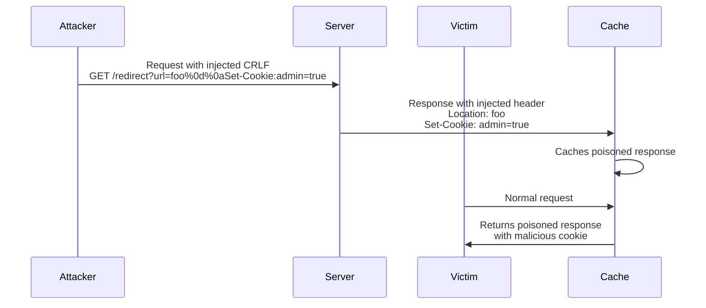

# How to Fix "HTTP Response Splitting" Vulnerabilities

Author: [nawazdhandala](https://www.github.com/nawazdhandala)

Tags: Security, HTTP, Vulnerabilities, Web Security, Headers, CRLF Injection

Description: Learn how to identify and fix HTTP response splitting vulnerabilities that allow attackers to inject malicious headers and perform cache poisoning attacks.

---

HTTP response splitting is a web security vulnerability that occurs when an attacker can inject carriage return (CR) and line feed (LF) characters into HTTP response headers. This allows them to "split" the response and inject arbitrary content, leading to cache poisoning, cross-site scripting, and session hijacking. Understanding and fixing this vulnerability is critical for web application security.

## How HTTP Response Splitting Works

HTTP headers are separated by CRLF sequences (`\r\n`). When user input is placed directly into response headers without sanitization, attackers can terminate the current header section and inject their own response.



## Understanding the Attack Vector

Here is what a vulnerable response looks like when an attacker injects CRLF characters:

```http
HTTP/1.1 302 Found
Location: http://example.com/foo
Set-Cookie: admin=true
Content-Length: 0

HTTP/1.1 200 OK
Content-Type: text/html
Content-Length: 47

<html><script>alert('XSS')</script></html>
```

The attacker injected `%0d%0a` (URL-encoded CRLF) which created a second HTTP response. Depending on how proxies and browsers interpret this, they might execute the injected content.

## Identifying Vulnerable Code

### Vulnerable Pattern 1: Direct Header Assignment

The most common vulnerability occurs when user input flows directly into response headers.

```javascript
// VULNERABLE: User input directly in Location header
// Attacker can send: /redirect?url=http://evil.com%0d%0aSet-Cookie:%20admin=true
app.get('/redirect', (req, res) => {
    const destination = req.query.url;
    // This allows CRLF injection!
    res.setHeader('Location', destination);
    res.status(302).end();
});

// VULNERABLE: Cookie value from user input
app.get('/set-preference', (req, res) => {
    const theme = req.query.theme;
    // Attacker can inject: theme=dark%0d%0aSet-Cookie:%20session=hijacked
    res.setHeader('Set-Cookie', `theme=${theme}`);
    res.send('Preference saved');
});
```

### Vulnerable Pattern 2: Custom Headers from User Input

```python
# VULNERABLE: Python Flask example
from flask import Flask, request, make_response

app = Flask(__name__)

@app.route('/api/data')
def get_data():
    # User-controlled header value
    client_id = request.args.get('client_id', '')

    response = make_response({'data': 'example'})
    # CRLF can be injected through client_id
    response.headers['X-Client-ID'] = client_id
    return response
```

### Vulnerable Pattern 3: Content-Disposition Filename

```java
// VULNERABLE: Java Servlet example
@WebServlet("/download")
public class DownloadServlet extends HttpServlet {
    protected void doGet(HttpServletRequest request, HttpServletResponse response)
            throws ServletException, IOException {

        String filename = request.getParameter("filename");

        // Attacker can inject headers through filename
        // filename=report.pdf%0d%0aContent-Length:%200%0d%0a%0d%0a<script>alert(1)</script>
        response.setHeader("Content-Disposition", "attachment; filename=\"" + filename + "\"");

        // ... serve file
    }
}
```

## Fixing HTTP Response Splitting Vulnerabilities

### Solution 1: Strip CRLF Characters

The most straightforward fix is to remove CR and LF characters from any user input before using it in headers.

```javascript
// SECURE: Sanitize header values by removing CRLF
function sanitizeHeaderValue(value) {
    if (typeof value !== 'string') {
        return '';
    }
    // Remove carriage return (\r), line feed (\n), and null bytes
    return value.replace(/[\r\n\0]/g, '');
}

app.get('/redirect', (req, res) => {
    const destination = req.query.url;

    // Sanitize before setting header
    const safeDestination = sanitizeHeaderValue(destination);

    // Additional validation: ensure it's a valid URL
    try {
        new URL(safeDestination);
        res.redirect(safeDestination);
    } catch (e) {
        res.status(400).send('Invalid URL');
    }
});
```

### Solution 2: URL Encoding for Redirect Locations

When dealing with redirect URLs, proper encoding prevents CRLF injection.

```javascript
// SECURE: Encode user input in redirect URLs
app.get('/redirect', (req, res) => {
    const destination = req.query.url;

    // Validate against allowlist of domains
    const allowedDomains = ['example.com', 'api.example.com'];

    try {
        const url = new URL(destination);

        // Check if domain is allowed
        if (!allowedDomains.includes(url.hostname)) {
            return res.status(400).json({ error: 'Domain not allowed' });
        }

        // URL constructor automatically encodes special characters
        // This prevents CRLF injection
        res.redirect(url.toString());
    } catch (e) {
        res.status(400).json({ error: 'Invalid URL format' });
    }
});
```

### Solution 3: Framework-Level Protection

Modern frameworks often provide built-in protection. Ensure you are using the latest versions.

```javascript
// Express.js 4.x+ automatically rejects headers with invalid characters
// But explicit validation is still recommended

const express = require('express');
const app = express();

// Custom middleware to validate all header inputs
function validateHeaderInputs(req, res, next) {
    // Define a pattern for valid header characters
    // ASCII 32-126 excluding CRLF
    const validHeaderPattern = /^[\x20-\x7E]*$/;

    // Check query parameters that might be used in headers
    for (const [key, value] of Object.entries(req.query)) {
        if (typeof value === 'string' && !validHeaderPattern.test(value)) {
            return res.status(400).json({
                error: 'Invalid characters in request parameters'
            });
        }
    }

    next();
}

app.use(validateHeaderInputs);
```

### Solution 4: Python Flask Protection

```python
from flask import Flask, request, make_response, abort
import re

app = Flask(__name__)

def sanitize_header_value(value):
    """Remove any characters that could enable header injection."""
    if value is None:
        return ''
    # Remove CRLF, null bytes, and other control characters
    return re.sub(r'[\r\n\x00-\x1f\x7f]', '', str(value))

def validate_header_value(value):
    """Validate that a value is safe for use in HTTP headers."""
    if value is None:
        return True
    # Check for CRLF sequences
    if re.search(r'[\r\n]', str(value)):
        return False
    return True

@app.route('/api/data')
def get_data():
    client_id = request.args.get('client_id', '')

    # Validate the input
    if not validate_header_value(client_id):
        abort(400, description='Invalid characters in client_id')

    # Additional sanitization as defense in depth
    safe_client_id = sanitize_header_value(client_id)

    response = make_response({'data': 'example'})
    response.headers['X-Client-ID'] = safe_client_id
    return response
```

### Solution 5: Java Servlet Protection

```java
import javax.servlet.*;
import javax.servlet.http.*;
import java.io.IOException;
import java.util.regex.Pattern;

@WebServlet("/download")
public class SecureDownloadServlet extends HttpServlet {

    // Pattern to detect CRLF and other dangerous characters
    private static final Pattern HEADER_INJECTION_PATTERN =
        Pattern.compile("[\\r\\n\\x00]");

    // Pattern for valid filename characters
    private static final Pattern VALID_FILENAME_PATTERN =
        Pattern.compile("^[a-zA-Z0-9._-]+$");

    private String sanitizeFilename(String filename) {
        if (filename == null) {
            return "download";
        }

        // Remove any path traversal attempts
        filename = filename.replaceAll("[/\\\\]", "");

        // Remove CRLF and control characters
        filename = HEADER_INJECTION_PATTERN.matcher(filename).replaceAll("");

        // Validate remaining characters
        if (!VALID_FILENAME_PATTERN.matcher(filename).matches()) {
            return "download";
        }

        return filename;
    }

    protected void doGet(HttpServletRequest request, HttpServletResponse response)
            throws ServletException, IOException {

        String filename = request.getParameter("filename");
        String safeFilename = sanitizeFilename(filename);

        // Use RFC 5987 encoding for non-ASCII filenames
        response.setHeader("Content-Disposition",
            "attachment; filename=\"" + safeFilename + "\"");

        // Set content type and serve file
        response.setContentType("application/octet-stream");
        // ... serve file content
    }
}
```

## Testing for HTTP Response Splitting

Create automated tests to verify your protections work.

```javascript
// Jest test for CRLF injection protection
const request = require('supertest');
const app = require('./app');

describe('HTTP Response Splitting Protection', () => {
    // Test CRLF in redirect parameter
    test('should reject CRLF in redirect URL', async () => {
        const maliciousUrl = 'http://example.com%0d%0aSet-Cookie:%20admin=true';

        const response = await request(app)
            .get('/redirect')
            .query({ url: maliciousUrl });

        // Should either reject or sanitize
        expect(response.status).toBe(400);
    });

    // Test various CRLF encodings
    test('should handle different CRLF encodings', async () => {
        const payloads = [
            'value%0d%0aInjected: header',      // URL encoded
            'value\r\nInjected: header',        // Raw CRLF
            'value%0aInjected: header',         // LF only
            'value%0dInjected: header',         // CR only
            'value%00Injected: header',         // Null byte
        ];

        for (const payload of payloads) {
            const response = await request(app)
                .get('/set-header')
                .query({ value: payload });

            // Verify no injected headers in response
            expect(response.headers['injected']).toBeUndefined();
        }
    });

    // Test Content-Disposition filename
    test('should sanitize filename in Content-Disposition', async () => {
        const maliciousFilename = 'file.pdf%0d%0a%0d%0a<script>alert(1)</script>';

        const response = await request(app)
            .get('/download')
            .query({ filename: maliciousFilename });

        const contentDisposition = response.headers['content-disposition'];

        // Should not contain CRLF or script
        expect(contentDisposition).not.toMatch(/[\r\n]/);
        expect(contentDisposition).not.toMatch(/<script>/i);
    });
});
```

## Security Headers to Mitigate Impact

Even with proper input validation, add defense-in-depth headers.

```javascript
// Add security headers to mitigate response splitting impact
app.use((req, res, next) => {
    // Prevent browsers from MIME-sniffing
    res.setHeader('X-Content-Type-Options', 'nosniff');

    // Prevent clickjacking
    res.setHeader('X-Frame-Options', 'DENY');

    // Enable XSS filter
    res.setHeader('X-XSS-Protection', '1; mode=block');

    // Strict Content Security Policy
    res.setHeader('Content-Security-Policy',
        "default-src 'self'; script-src 'self'");

    next();
});
```

## Common Bypass Attempts to Watch For

Attackers may try various encoding tricks to bypass filters:

| Encoding | Example | Description |
|----------|---------|-------------|
| URL encoding | `%0d%0a` | Standard URL encoding of CRLF |
| Double encoding | `%250d%250a` | Encoded percent signs |
| Unicode | `%u000d%u000a` | Unicode encoding |
| Mixed case | `%0D%0A` | Uppercase hex digits |
| Null byte | `%00` | Null byte injection |

```javascript
// Comprehensive sanitization function
function sanitizeForHeader(input) {
    if (typeof input !== 'string') {
        return '';
    }

    // First, decode any URL encoding
    let decoded;
    try {
        // Handle double encoding by decoding twice
        decoded = decodeURIComponent(decodeURIComponent(input));
    } catch (e) {
        // If decoding fails, use original
        decoded = input;
    }

    // Remove all forms of line breaks and control characters
    const sanitized = decoded
        .replace(/[\r\n\x00-\x1f\x7f]/g, '') // Control characters
        .replace(/[\u0000-\u001f\u007f-\u009f]/g, ''); // Unicode control

    return sanitized;
}
```

HTTP response splitting is a serious vulnerability that can lead to cache poisoning and cross-site scripting. The key to prevention is never trusting user input in HTTP headers. Always validate and sanitize any data that might end up in response headers, and use framework-level protections as an additional layer of defense.
