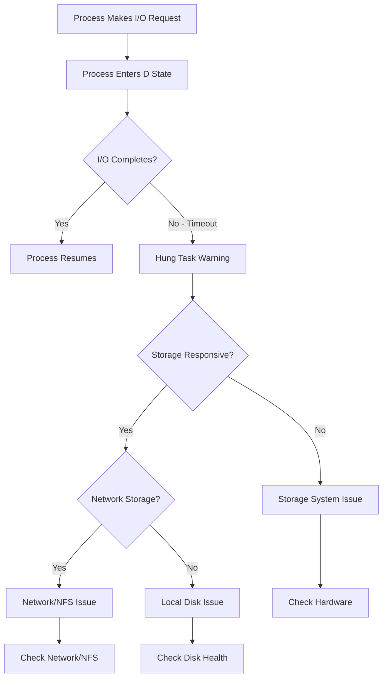
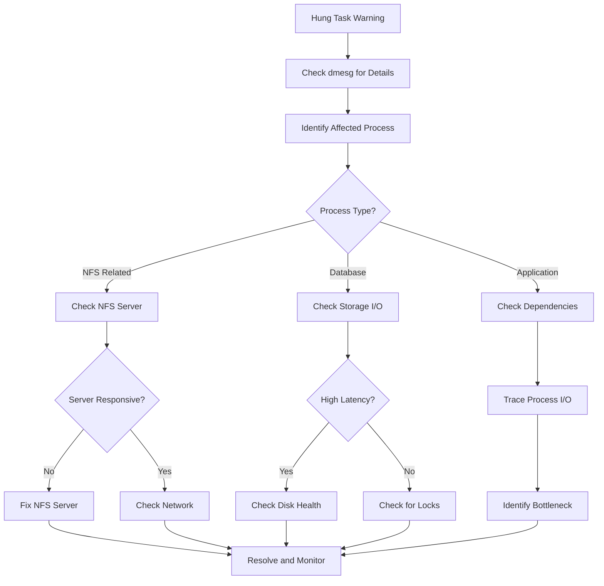

# How to Fix "Hung Task" Kernel Warnings

Author: [nawazdhandala](https://www.github.com/nawazdhandala)

Tags: Linux, Kernel, System Administration, Troubleshooting, Storage, NFS, Performance

Description: Learn how to diagnose and resolve Linux kernel "hung task" warnings caused by blocked processes waiting on I/O operations.

---

> The "INFO: task blocked for more than 120 seconds" kernel warning indicates a process stuck waiting for I/O, often pointing to storage or filesystem issues. Understanding these warnings helps identify and resolve underlying infrastructure problems.

This guide covers the causes, diagnosis, and resolution of hung task warnings, along with preventive measures to maintain system stability.

---

## Understanding Hung Task Warnings

When the kernel detects a process in the "D" (uninterruptible sleep) state for too long, it generates a hung task warning:

```
INFO: task process_name:1234 blocked for more than 120 seconds.
      Not tainted 5.15.0-generic
"echo 0 > /proc/sys/kernel/hung_task_timeout_secs" disables this message.
      task:process_name    state:D stack:0     pid:1234  ppid:1     flags:0x00000000
```



---

## Common Causes

### 1. Storage System Problems

- Failed or failing disks
- RAID array degradation
- Storage controller issues
- Full filesystems causing write blocks

### 2. Network Storage Issues

- NFS server unresponsive
- Network connectivity problems
- iSCSI target unavailable
- CIFS/SMB share issues

### 3. Kernel and Driver Issues

- Filesystem bugs
- Storage driver problems
- Memory pressure causing I/O stalls

---

## Diagnosing Hung Tasks

### Step 1: Check System Logs

```bash
# Search for hung task messages in kernel log
# The dmesg command shows recent kernel messages
dmesg | grep -i "blocked for more than"

# Check system journal for related messages
# journalctl provides persistent log access
journalctl -k --since "1 hour ago" | grep -i "blocked\|hung\|stall"

# Look for associated I/O errors
dmesg | grep -i "error\|fail\|timeout" | tail -50
```

### Step 2: Identify Blocked Processes

```bash
# Find processes in D (uninterruptible sleep) state
# These are the processes blocked on I/O
ps aux | awk '$8 ~ /D/ {print $0}'

# More detailed view with wait channel
# WCHAN shows what kernel function the process is waiting in
ps -eo pid,ppid,user,stat,wchan:32,comm | grep " D"

# Example output:
# PID   PPID USER     STAT WCHAN                            COMMAND
# 1234  1    root     D    nfs_wait_bit_killable           rsync
# 5678  1    mysql    D    blkdev_issue_flush              mysqld
```

### Step 3: Check Storage Health

```bash
# Check disk I/O statistics
# Look for high await times and low throughput
iostat -xz 2 5

# Key metrics to watch:
# await - average time for I/O requests (high = problem)
# %util - device utilization (100% = saturated)
# svctm - average service time

# Example: Check for disk errors in SMART data
smartctl -a /dev/sda | grep -i "error\|fail\|bad"

# Check for filesystem errors
dmesg | grep -i "ext4\|xfs\|filesystem"
```

### Step 4: Check NFS/Network Storage

```bash
# Check NFS mount status
# Shows current NFS mounts and their options
mount -t nfs,nfs4

# Check if NFS server is responding
# The -t flag sets timeout for unresponsive servers
showmount -e nfs-server-ip --no-headers 2>&1

# Check NFS statistics for errors
nfsstat -c | head -30

# Test NFS connectivity
# Try a simple operation with timeout
timeout 10 ls /nfs/mount/point && echo "NFS OK" || echo "NFS Problem"

# Check network connectivity to storage
ping -c 3 storage-server-ip
```

---

## Resolution Steps

### Solution 1: Address Storage Issues

```bash
# Check disk health with SMART
# Self-Monitoring, Analysis and Reporting Technology
smartctl -H /dev/sda

# If disk is failing, check for reallocated sectors
smartctl -a /dev/sda | grep -E "Reallocated|Pending|Uncorrectable"

# Check RAID array status (mdadm software RAID)
cat /proc/mdstat

# Check hardware RAID status (varies by controller)
# For Dell PERC controllers
/opt/MegaRAID/MegaCli/MegaCli64 -LDInfo -Lall -aAll

# For HP Smart Array
hpssacli ctrl all show config
```

### Solution 2: Fix NFS Issues

```bash
# Remount NFS with soft mount option (allows timeout)
# WARNING: soft mounts can cause data corruption - use carefully
umount -f /nfs/mount/point
mount -o soft,timeo=30,retrans=3 nfs-server:/export /nfs/mount/point

# Alternative: Use intr option to allow interruption
mount -o intr,timeo=30 nfs-server:/export /nfs/mount/point

# Force unmount a stuck NFS mount
# Use when normal umount hangs
umount -f -l /nfs/mount/point

# Update /etc/fstab for resilient NFS mounting
# Example entry with recommended options:
# nfs-server:/export /mnt/nfs nfs4 soft,timeo=30,retrans=3,_netdev 0 0
```

### Solution 3: Kernel Parameter Tuning

```bash
# Temporarily increase hung task timeout
# This suppresses warnings but does not fix the underlying issue
echo 300 > /proc/sys/kernel/hung_task_timeout_secs

# Disable hung task warnings (not recommended for production)
# Only use for troubleshooting specific known issues
echo 0 > /proc/sys/kernel/hung_task_timeout_secs

# Make changes permanent via sysctl.conf
# Edit /etc/sysctl.conf and add:
cat >> /etc/sysctl.d/99-hung-task.conf << 'EOF'
# Increase hung task timeout to 300 seconds
# Default is 120 seconds
kernel.hung_task_timeout_secs = 300

# Optionally panic on hung task (for debugging)
# kernel.hung_task_panic = 1
EOF

# Apply changes
sysctl -p /etc/sysctl.d/99-hung-task.conf
```

---

## Prevention and Monitoring

### Set Up Storage Monitoring

```bash
#!/bin/bash
# storage_health_monitor.sh - Monitor for storage issues

LOG_FILE="/var/log/storage_health.log"
ALERT_THRESHOLD_AWAIT=100  # milliseconds

log_msg() {
    echo "$(date '+%Y-%m-%d %H:%M:%S') - $1" >> "$LOG_FILE"
}

# Check for processes in D state
check_blocked_processes() {
    local blocked_count
    blocked_count=$(ps aux | awk '$8 ~ /D/ {count++} END {print count+0}')

    if [ "$blocked_count" -gt 0 ]; then
        log_msg "WARNING: $blocked_count processes in D state"
        ps aux | awk '$8 ~ /D/ {print $0}' >> "$LOG_FILE"
        return 1
    fi
    return 0
}

# Check disk I/O latency
check_io_latency() {
    # Get await time for all disks
    iostat -x 1 2 | tail -n +7 | while read -r line; do
        device=$(echo "$line" | awk '{print $1}')
        await=$(echo "$line" | awk '{print $10}')

        # Skip empty lines and headers
        [ -z "$device" ] && continue
        [ "$device" = "Device" ] && continue

        # Check if await exceeds threshold
        if [ -n "$await" ]; then
            await_int=${await%.*}
            if [ "$await_int" -gt "$ALERT_THRESHOLD_AWAIT" ]; then
                log_msg "WARNING: High I/O latency on $device: ${await}ms"
            fi
        fi
    done
}

# Check NFS mount responsiveness
check_nfs_mounts() {
    mount -t nfs,nfs4 | awk '{print $3}' | while read -r mountpoint; do
        if ! timeout 5 ls "$mountpoint" > /dev/null 2>&1; then
            log_msg "WARNING: NFS mount $mountpoint is unresponsive"
        fi
    done
}

# Run all checks
log_msg "Starting storage health check"
check_blocked_processes
check_io_latency
check_nfs_mounts
log_msg "Storage health check completed"
```

### Configure Kernel Dump for Analysis

```bash
# Install kdump for kernel crash analysis
# Useful when hung tasks lead to system hangs
apt-get install kdump-tools  # Debian/Ubuntu
yum install kexec-tools      # RHEL/CentOS

# Enable kdump service
systemctl enable kdump
systemctl start kdump

# Configure crash kernel memory reservation
# Add to /etc/default/grub GRUB_CMDLINE_LINUX:
# crashkernel=256M
```

---

## Hung Task Analysis Workflow



---

## Quick Reference Commands

| Command | Purpose |
|---------|---------|
| `ps aux \| awk '$8 ~ /D/'` | Find blocked processes |
| `dmesg \| grep -i "blocked"` | Find hung task warnings |
| `iostat -xz 2` | Monitor disk I/O statistics |
| `cat /proc/mdstat` | Check software RAID status |
| `smartctl -H /dev/sda` | Check disk SMART health |
| `nfsstat -c` | NFS client statistics |
| `mount -t nfs,nfs4` | List NFS mounts |
| `timeout 10 ls /mount` | Test mount responsiveness |

---

## Best Practices

1. **Use soft NFS mounts carefully**: They prevent hangs but can cause data corruption if the server is temporarily unavailable during writes

2. **Monitor I/O latency proactively**: Set up alerts for high await times before they cause hung tasks

3. **Implement redundant storage paths**: Use multipath for SAN storage to handle path failures

4. **Regular disk health checks**: Schedule SMART checks and replace disks showing early warning signs

5. **Document storage dependencies**: Keep track of which applications depend on which storage systems

6. **Test failover procedures**: Regularly verify that storage failover works as expected

---

## Conclusion

Hung task warnings are symptoms of underlying I/O problems that require systematic diagnosis. By understanding the common causes and following a structured troubleshooting approach, you can quickly identify whether the issue lies with local storage, network storage, or the kernel itself. Implementing proactive monitoring and appropriate kernel tuning helps minimize the impact of storage issues on system availability.

Remember that increasing the hung task timeout or disabling warnings is only a temporary measure. Always investigate and address the root cause to prevent system instability.
