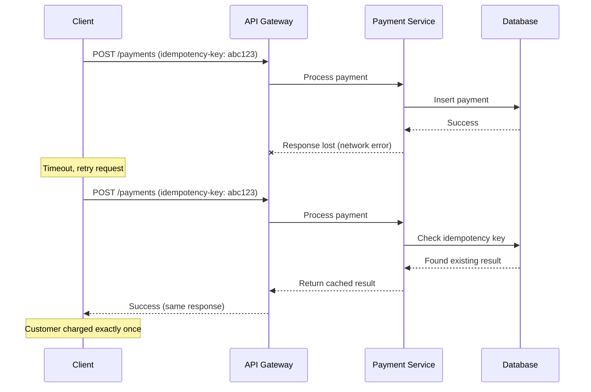
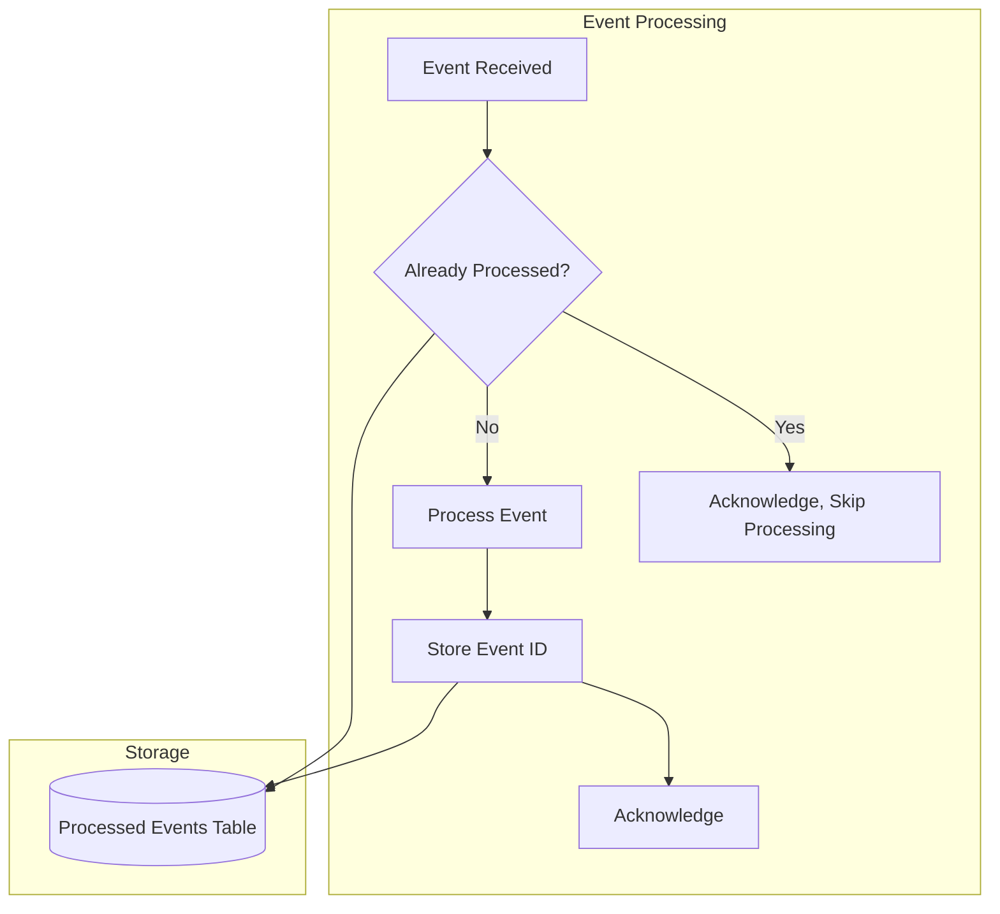
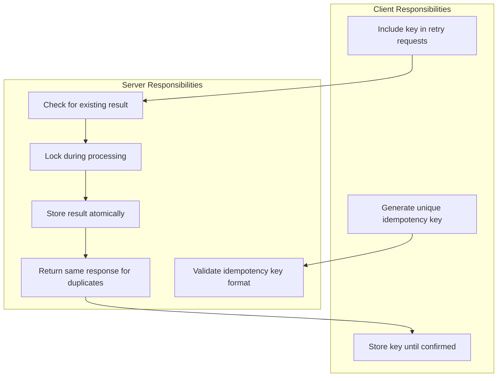

# How to Handle Idempotency in Microservices

Author: [nawazdhandala](https://www.github.com/nawazdhandala)

Tags: Idempotency, Microservices, Distributed Systems, API Design, Reliability, Retry Logic, Database, Event-Driven

Description: Learn how to implement idempotency in microservices to ensure operations can be safely retried without causing duplicate effects, including idempotency keys, database patterns, and event handling.

---

> Idempotency is the property where performing an operation multiple times has the same effect as performing it once. In distributed systems where network failures and retries are common, idempotency prevents duplicate charges, duplicate orders, and data corruption.

Without idempotency, a simple network timeout during a payment could result in the customer being charged twice when the request is retried. This guide covers patterns for implementing idempotency correctly.

---

## Why Idempotency Matters



---

## Idempotency Key Pattern

The most common approach is using client-provided idempotency keys.

```go
// Go - Idempotency middleware with Redis storage
package idempotency

import (
    "context"
    "crypto/sha256"
    "encoding/hex"
    "encoding/json"
    "errors"
    "net/http"
    "time"

    "github.com/redis/go-redis/v9"
)

var (
    ErrDuplicateRequest = errors.New("duplicate request")
    ErrRequestInProgress = errors.New("request already in progress")
)

// IdempotencyStore manages idempotency state
type IdempotencyStore struct {
    redis      *redis.Client
    keyPrefix  string
    ttl        time.Duration
    lockTTL    time.Duration
}

// StoredResponse represents a cached response
type StoredResponse struct {
    StatusCode int               `json:"status_code"`
    Headers    map[string]string `json:"headers"`
    Body       []byte            `json:"body"`
    CreatedAt  time.Time         `json:"created_at"`
}

// NewIdempotencyStore creates a new store
func NewIdempotencyStore(redis *redis.Client, keyPrefix string, ttl time.Duration) *IdempotencyStore {
    return &IdempotencyStore{
        redis:     redis,
        keyPrefix: keyPrefix,
        ttl:       ttl,
        lockTTL:   30 * time.Second,
    }
}

// GetOrLock attempts to get existing response or acquire a lock
func (s *IdempotencyStore) GetOrLock(ctx context.Context, idempotencyKey string) (*StoredResponse, bool, error) {
    resultKey := s.keyPrefix + ":result:" + idempotencyKey
    lockKey := s.keyPrefix + ":lock:" + idempotencyKey

    // Try to get existing result
    data, err := s.redis.Get(ctx, resultKey).Bytes()
    if err == nil {
        var response StoredResponse
        if err := json.Unmarshal(data, &response); err != nil {
            return nil, false, err
        }
        return &response, false, nil
    }
    if err != redis.Nil {
        return nil, false, err
    }

    // No existing result, try to acquire lock
    acquired, err := s.redis.SetNX(ctx, lockKey, "1", s.lockTTL).Result()
    if err != nil {
        return nil, false, err
    }

    if !acquired {
        // Another request is processing this key
        return nil, false, ErrRequestInProgress
    }

    return nil, true, nil
}

// StoreResponse stores the response for the idempotency key
func (s *IdempotencyStore) StoreResponse(ctx context.Context, idempotencyKey string, response *StoredResponse) error {
    resultKey := s.keyPrefix + ":result:" + idempotencyKey
    lockKey := s.keyPrefix + ":lock:" + idempotencyKey

    data, err := json.Marshal(response)
    if err != nil {
        return err
    }

    // Store result and release lock atomically
    pipe := s.redis.Pipeline()
    pipe.Set(ctx, resultKey, data, s.ttl)
    pipe.Del(ctx, lockKey)
    _, err = pipe.Exec(ctx)

    return err
}

// ReleaseLock releases the lock without storing a result (for errors)
func (s *IdempotencyStore) ReleaseLock(ctx context.Context, idempotencyKey string) error {
    lockKey := s.keyPrefix + ":lock:" + idempotencyKey
    return s.redis.Del(ctx, lockKey).Err()
}

// IdempotencyMiddleware creates HTTP middleware for idempotency
func IdempotencyMiddleware(store *IdempotencyStore) func(http.Handler) http.Handler {
    return func(next http.Handler) http.Handler {
        return http.HandlerFunc(func(w http.ResponseWriter, r *http.Request) {
            // Only apply to mutating methods
            if r.Method != http.MethodPost && r.Method != http.MethodPut && r.Method != http.MethodPatch {
                next.ServeHTTP(w, r)
                return
            }

            // Get idempotency key from header
            idempotencyKey := r.Header.Get("Idempotency-Key")
            if idempotencyKey == "" {
                // No idempotency key provided, proceed without idempotency
                next.ServeHTTP(w, r)
                return
            }

            ctx := r.Context()

            // Check for existing response or acquire lock
            existing, locked, err := store.GetOrLock(ctx, idempotencyKey)
            if err == ErrRequestInProgress {
                http.Error(w, "Request already in progress", http.StatusConflict)
                return
            }
            if err != nil {
                http.Error(w, "Internal server error", http.StatusInternalServerError)
                return
            }

            // Return cached response if exists
            if existing != nil {
                for k, v := range existing.Headers {
                    w.Header().Set(k, v)
                }
                w.Header().Set("Idempotent-Replayed", "true")
                w.WriteHeader(existing.StatusCode)
                w.Write(existing.Body)
                return
            }

            // Process request and capture response
            recorder := &responseRecorder{
                ResponseWriter: w,
                statusCode:     http.StatusOK,
                body:           []byte{},
            }

            next.ServeHTTP(recorder, r)

            // Store successful responses
            if recorder.statusCode >= 200 && recorder.statusCode < 500 {
                response := &StoredResponse{
                    StatusCode: recorder.statusCode,
                    Headers:    make(map[string]string),
                    Body:       recorder.body,
                    CreatedAt:  time.Now(),
                }

                // Capture relevant headers
                for k, v := range recorder.Header() {
                    if len(v) > 0 {
                        response.Headers[k] = v[0]
                    }
                }

                store.StoreResponse(ctx, idempotencyKey, response)
            } else {
                // Release lock for errors so request can be retried
                store.ReleaseLock(ctx, idempotencyKey)
            }
        })
    }
}

// responseRecorder captures the response for storage
type responseRecorder struct {
    http.ResponseWriter
    statusCode int
    body       []byte
}

func (r *responseRecorder) WriteHeader(statusCode int) {
    r.statusCode = statusCode
    r.ResponseWriter.WriteHeader(statusCode)
}

func (r *responseRecorder) Write(b []byte) (int, error) {
    r.body = append(r.body, b...)
    return r.ResponseWriter.Write(b)
}
```

---

## Database-Level Idempotency

Use database constraints to ensure idempotency.

```sql
-- PostgreSQL schema for idempotent operations

-- Idempotency records table
CREATE TABLE idempotency_records (
    idempotency_key VARCHAR(255) PRIMARY KEY,
    request_hash VARCHAR(64) NOT NULL,
    response_status INTEGER NOT NULL,
    response_body JSONB,
    created_at TIMESTAMP WITH TIME ZONE DEFAULT NOW(),
    expires_at TIMESTAMP WITH TIME ZONE NOT NULL
);

-- Index for cleanup
CREATE INDEX idx_idempotency_expires ON idempotency_records(expires_at);

-- Payments table with idempotency
CREATE TABLE payments (
    id UUID PRIMARY KEY DEFAULT gen_random_uuid(),
    idempotency_key VARCHAR(255) UNIQUE,
    customer_id UUID NOT NULL,
    amount_cents INTEGER NOT NULL,
    currency VARCHAR(3) NOT NULL,
    status VARCHAR(50) NOT NULL,
    created_at TIMESTAMP WITH TIME ZONE DEFAULT NOW(),
    updated_at TIMESTAMP WITH TIME ZONE DEFAULT NOW()
);

-- Ensure unique charge per idempotency key
CREATE UNIQUE INDEX idx_payments_idempotency ON payments(idempotency_key)
    WHERE idempotency_key IS NOT NULL;
```

```go
// Go - Database-level idempotency with transactions
package payments

import (
    "context"
    "database/sql"
    "errors"
    "time"

    "github.com/google/uuid"
)

var (
    ErrDuplicatePayment = errors.New("duplicate payment")
    ErrPaymentFailed    = errors.New("payment processing failed")
)

// Payment represents a payment record
type Payment struct {
    ID             uuid.UUID `json:"id"`
    IdempotencyKey string    `json:"idempotency_key,omitempty"`
    CustomerID     uuid.UUID `json:"customer_id"`
    AmountCents    int64     `json:"amount_cents"`
    Currency       string    `json:"currency"`
    Status         string    `json:"status"`
    CreatedAt      time.Time `json:"created_at"`
}

// PaymentRequest represents a payment request
type PaymentRequest struct {
    IdempotencyKey string    `json:"idempotency_key"`
    CustomerID     uuid.UUID `json:"customer_id"`
    AmountCents    int64     `json:"amount_cents"`
    Currency       string    `json:"currency"`
}

// PaymentService handles payment operations
type PaymentService struct {
    db             *sql.DB
    paymentGateway PaymentGateway
}

// CreatePayment creates a payment with idempotency guarantee
func (s *PaymentService) CreatePayment(ctx context.Context, req PaymentRequest) (*Payment, error) {
    // Start transaction
    tx, err := s.db.BeginTx(ctx, &sql.TxOptions{
        Isolation: sql.LevelSerializable,
    })
    if err != nil {
        return nil, err
    }
    defer tx.Rollback()

    // Check for existing payment with same idempotency key
    var existingPayment Payment
    err = tx.QueryRowContext(ctx, `
        SELECT id, idempotency_key, customer_id, amount_cents, currency, status, created_at
        FROM payments
        WHERE idempotency_key = $1
    `, req.IdempotencyKey).Scan(
        &existingPayment.ID,
        &existingPayment.IdempotencyKey,
        &existingPayment.CustomerID,
        &existingPayment.AmountCents,
        &existingPayment.Currency,
        &existingPayment.Status,
        &existingPayment.CreatedAt,
    )

    if err == nil {
        // Found existing payment
        // Verify request matches (optional but recommended)
        if existingPayment.CustomerID != req.CustomerID ||
            existingPayment.AmountCents != req.AmountCents ||
            existingPayment.Currency != req.Currency {
            return nil, errors.New("idempotency key reused with different parameters")
        }
        return &existingPayment, nil
    }

    if err != sql.ErrNoRows {
        return nil, err
    }

    // Create new payment
    paymentID := uuid.New()
    payment := Payment{
        ID:             paymentID,
        IdempotencyKey: req.IdempotencyKey,
        CustomerID:     req.CustomerID,
        AmountCents:    req.AmountCents,
        Currency:       req.Currency,
        Status:         "pending",
        CreatedAt:      time.Now(),
    }

    // Insert payment record
    _, err = tx.ExecContext(ctx, `
        INSERT INTO payments (id, idempotency_key, customer_id, amount_cents, currency, status, created_at)
        VALUES ($1, $2, $3, $4, $5, $6, $7)
    `, payment.ID, payment.IdempotencyKey, payment.CustomerID,
       payment.AmountCents, payment.Currency, payment.Status, payment.CreatedAt)

    if err != nil {
        // Check for unique constraint violation
        if isUniqueViolation(err) {
            return nil, ErrDuplicatePayment
        }
        return nil, err
    }

    // Commit to ensure payment record exists before charging
    if err := tx.Commit(); err != nil {
        return nil, err
    }

    // Process payment with external gateway
    // This is outside the transaction but payment is already recorded
    err = s.paymentGateway.Charge(ctx, paymentID, req.AmountCents, req.Currency)

    // Update status based on result
    status := "completed"
    if err != nil {
        status = "failed"
    }

    _, updateErr := s.db.ExecContext(ctx, `
        UPDATE payments SET status = $1, updated_at = NOW() WHERE id = $2
    `, status, paymentID)

    if updateErr != nil {
        // Log but don't fail - payment state is still consistent
        // Reconciliation process will fix status
    }

    payment.Status = status

    if err != nil {
        return &payment, ErrPaymentFailed
    }

    return &payment, nil
}

func isUniqueViolation(err error) bool {
    // Check for PostgreSQL unique violation error code
    return err != nil &&
           (err.Error() == "pq: duplicate key value violates unique constraint" ||
            err.Error() == "UNIQUE constraint failed")
}

// PaymentGateway interface for payment processing
type PaymentGateway interface {
    Charge(ctx context.Context, paymentID uuid.UUID, amountCents int64, currency string) error
}
```

---

## Idempotent Event Processing



```python
# Python - Idempotent event consumer
from dataclasses import dataclass
from datetime import datetime, timedelta
from typing import Callable, Optional
import hashlib
import json
import asyncio
from contextlib import asynccontextmanager

import asyncpg
from aiokafka import AIOKafkaConsumer

@dataclass
class Event:
    id: str
    type: str
    payload: dict
    timestamp: datetime
    source: str

class IdempotentEventProcessor:
    """Processes events exactly once using database-backed deduplication."""

    def __init__(self, db_pool: asyncpg.Pool, retention_days: int = 7):
        self.db_pool = db_pool
        self.retention_days = retention_days
        self.handlers: dict[str, Callable] = {}

    async def initialize(self):
        """Create the processed events table if it doesn't exist."""
        async with self.db_pool.acquire() as conn:
            await conn.execute("""
                CREATE TABLE IF NOT EXISTS processed_events (
                    event_id VARCHAR(255) PRIMARY KEY,
                    event_type VARCHAR(255) NOT NULL,
                    processed_at TIMESTAMP WITH TIME ZONE DEFAULT NOW(),
                    result JSONB
                );

                CREATE INDEX IF NOT EXISTS idx_processed_events_timestamp
                ON processed_events(processed_at);
            """)

    def register_handler(self, event_type: str, handler: Callable):
        """Register a handler for an event type."""
        self.handlers[event_type] = handler

    async def process_event(self, event: Event) -> Optional[dict]:
        """
        Process an event idempotently.
        Returns the result if newly processed, or cached result if duplicate.
        """
        async with self.db_pool.acquire() as conn:
            # Start transaction
            async with conn.transaction():
                # Try to insert the event ID (will fail if already exists)
                try:
                    # Check if already processed
                    existing = await conn.fetchrow("""
                        SELECT result FROM processed_events WHERE event_id = $1
                    """, event.id)

                    if existing:
                        # Already processed, return cached result
                        return existing['result']

                    # Lock the row to prevent concurrent processing
                    await conn.execute("""
                        INSERT INTO processed_events (event_id, event_type)
                        VALUES ($1, $2)
                    """, event.id, event.type)

                except asyncpg.UniqueViolationError:
                    # Concurrent insert, fetch the result
                    existing = await conn.fetchrow("""
                        SELECT result FROM processed_events WHERE event_id = $1
                    """, event.id)
                    return existing['result'] if existing else None

                # Process the event
                handler = self.handlers.get(event.type)
                if not handler:
                    raise ValueError(f"No handler for event type: {event.type}")

                try:
                    result = await handler(event)

                    # Store the result
                    await conn.execute("""
                        UPDATE processed_events
                        SET result = $1, processed_at = NOW()
                        WHERE event_id = $2
                    """, json.dumps(result), event.id)

                    return result

                except Exception as e:
                    # On error, delete the record so event can be retried
                    await conn.execute("""
                        DELETE FROM processed_events WHERE event_id = $1
                    """, event.id)
                    raise

    async def cleanup_old_events(self):
        """Remove processed events older than retention period."""
        cutoff = datetime.utcnow() - timedelta(days=self.retention_days)
        async with self.db_pool.acquire() as conn:
            deleted = await conn.execute("""
                DELETE FROM processed_events WHERE processed_at < $1
            """, cutoff)
            return deleted

# Kafka consumer with idempotent processing
class IdempotentKafkaConsumer:
    def __init__(
        self,
        bootstrap_servers: str,
        group_id: str,
        topics: list[str],
        processor: IdempotentEventProcessor
    ):
        self.consumer = AIOKafkaConsumer(
            *topics,
            bootstrap_servers=bootstrap_servers,
            group_id=group_id,
            enable_auto_commit=False,  # Manual commit for exactly-once
            auto_offset_reset='earliest'
        )
        self.processor = processor
        self.running = False

    async def start(self):
        """Start consuming events."""
        await self.consumer.start()
        self.running = True

        try:
            async for message in self.consumer:
                if not self.running:
                    break

                try:
                    # Parse event
                    event_data = json.loads(message.value.decode('utf-8'))
                    event = Event(
                        id=event_data.get('id', self._generate_event_id(message)),
                        type=event_data['type'],
                        payload=event_data['payload'],
                        timestamp=datetime.fromisoformat(event_data['timestamp']),
                        source=event_data.get('source', 'unknown')
                    )

                    # Process idempotently
                    await self.processor.process_event(event)

                    # Commit offset only after successful processing
                    await self.consumer.commit()

                except Exception as e:
                    # Log error but don't commit - message will be reprocessed
                    print(f"Error processing message: {e}")
                    # Optionally: send to dead letter queue after N retries

        finally:
            await self.consumer.stop()

    def _generate_event_id(self, message) -> str:
        """Generate deterministic event ID from message metadata."""
        unique_string = f"{message.topic}-{message.partition}-{message.offset}"
        return hashlib.sha256(unique_string.encode()).hexdigest()[:32]

    async def stop(self):
        """Stop the consumer gracefully."""
        self.running = False

# Example usage
async def main():
    # Create database pool
    db_pool = await asyncpg.create_pool(
        "postgresql://localhost/mydb",
        min_size=5,
        max_size=20
    )

    # Create processor
    processor = IdempotentEventProcessor(db_pool)
    await processor.initialize()

    # Register handlers
    async def handle_order_created(event: Event) -> dict:
        # Process order creation
        order_id = event.payload['order_id']
        # ... business logic ...
        return {"status": "processed", "order_id": order_id}

    processor.register_handler("order.created", handle_order_created)

    # Start consumer
    consumer = IdempotentKafkaConsumer(
        bootstrap_servers="localhost:9092",
        group_id="order-processor",
        topics=["orders"],
        processor=processor
    )

    await consumer.start()

if __name__ == "__main__":
    asyncio.run(main())
```

---

## Idempotency in API Design

```typescript
// TypeScript - Express API with idempotency support
import express, { Request, Response, NextFunction } from 'express';
import { v4 as uuidv4 } from 'uuid';
import Redis from 'ioredis';

interface IdempotencyConfig {
    ttlSeconds: number;
    headerName: string;
    lockTimeoutMs: number;
}

interface CachedResponse {
    statusCode: number;
    headers: Record<string, string>;
    body: any;
    completedAt: string;
}

class IdempotencyService {
    private redis: Redis;
    private config: IdempotencyConfig;

    constructor(redis: Redis, config: Partial<IdempotencyConfig> = {}) {
        this.redis = redis;
        this.config = {
            ttlSeconds: 86400, // 24 hours
            headerName: 'Idempotency-Key',
            lockTimeoutMs: 30000,
            ...config,
        };
    }

    async getOrLock(key: string): Promise<{ cached: CachedResponse | null; locked: boolean }> {
        const resultKey = `idempotency:result:${key}`;
        const lockKey = `idempotency:lock:${key}`;

        // Check for cached result
        const cached = await this.redis.get(resultKey);
        if (cached) {
            return { cached: JSON.parse(cached), locked: false };
        }

        // Try to acquire lock
        const locked = await this.redis.set(
            lockKey,
            Date.now().toString(),
            'PX',
            this.config.lockTimeoutMs,
            'NX'
        );

        return { cached: null, locked: locked === 'OK' };
    }

    async storeResult(key: string, response: CachedResponse): Promise<void> {
        const resultKey = `idempotency:result:${key}`;
        const lockKey = `idempotency:lock:${key}`;

        const pipeline = this.redis.pipeline();
        pipeline.set(resultKey, JSON.stringify(response), 'EX', this.config.ttlSeconds);
        pipeline.del(lockKey);
        await pipeline.exec();
    }

    async releaseLock(key: string): Promise<void> {
        const lockKey = `idempotency:lock:${key}`;
        await this.redis.del(lockKey);
    }

    getKeyFromRequest(req: Request): string | null {
        return req.headers[this.config.headerName.toLowerCase()] as string | null;
    }
}

// Middleware factory
function idempotencyMiddleware(service: IdempotencyService) {
    return async (req: Request, res: Response, next: NextFunction) => {
        // Only apply to mutating methods
        if (!['POST', 'PUT', 'PATCH'].includes(req.method)) {
            return next();
        }

        const idempotencyKey = service.getKeyFromRequest(req);
        if (!idempotencyKey) {
            return next();
        }

        try {
            const { cached, locked } = await service.getOrLock(idempotencyKey);

            if (cached) {
                // Return cached response
                res.set('Idempotent-Replayed', 'true');
                Object.entries(cached.headers).forEach(([key, value]) => {
                    res.set(key, value);
                });
                return res.status(cached.statusCode).json(cached.body);
            }

            if (!locked) {
                // Another request is processing this key
                return res.status(409).json({
                    error: 'Conflict',
                    message: 'A request with this idempotency key is already being processed',
                });
            }

            // Intercept response to cache it
            const originalJson = res.json.bind(res);
            res.json = (body: any) => {
                // Store successful responses
                if (res.statusCode >= 200 && res.statusCode < 500) {
                    const headers: Record<string, string> = {};
                    ['content-type', 'x-request-id'].forEach(header => {
                        const value = res.get(header);
                        if (value) headers[header] = value;
                    });

                    service.storeResult(idempotencyKey, {
                        statusCode: res.statusCode,
                        headers,
                        body,
                        completedAt: new Date().toISOString(),
                    }).catch(err => console.error('Failed to store idempotency result:', err));
                } else {
                    // Release lock for errors
                    service.releaseLock(idempotencyKey)
                        .catch(err => console.error('Failed to release lock:', err));
                }

                return originalJson(body);
            };

            // Handle errors
            res.on('close', () => {
                if (!res.writableEnded) {
                    service.releaseLock(idempotencyKey)
                        .catch(err => console.error('Failed to release lock on close:', err));
                }
            });

            next();
        } catch (error) {
            console.error('Idempotency middleware error:', error);
            next();
        }
    };
}

// Example API
const app = express();
const redis = new Redis();
const idempotencyService = new IdempotencyService(redis);

app.use(express.json());
app.use(idempotencyMiddleware(idempotencyService));

// Payment endpoint with idempotency
app.post('/api/payments', async (req: Request, res: Response) => {
    const { amount, currency, customerId } = req.body;

    // Validate request
    if (!amount || !currency || !customerId) {
        return res.status(400).json({ error: 'Missing required fields' });
    }

    try {
        // Process payment
        const paymentId = uuidv4();
        // ... payment processing logic ...

        res.status(201).json({
            id: paymentId,
            amount,
            currency,
            customerId,
            status: 'completed',
            createdAt: new Date().toISOString(),
        });
    } catch (error: any) {
        res.status(500).json({ error: error.message });
    }
});

app.listen(3000, () => {
    console.log('Server running on port 3000');
});
```

---

## Best Practices



### Key Guidelines

1. **Use UUIDs for idempotency keys** - Clients should generate unique keys
2. **Validate request parameters match** - Same key should have same parameters
3. **Set appropriate TTL** - Balance between memory and retry windows
4. **Lock during processing** - Prevent concurrent duplicate processing
5. **Store results atomically** - Use transactions for consistency
6. **Return identical responses** - Same key should return same response
7. **Handle errors carefully** - Release locks so retries can proceed

---

*Need to monitor your payment processing for duplicates? [OneUptime](https://oneuptime.com) provides transaction monitoring with duplicate detection alerts.*

**Related Reading:**
- [How to Handle Rate Limiting Across Services](https://oneuptime.com/blog/post/2026-01-24-rate-limiting-across-services/view)
- [How to Fix "Connection Pool Exhausted" Errors](https://oneuptime.com/blog/post/2026-01-24-connection-pool-exhausted-errors/view)
