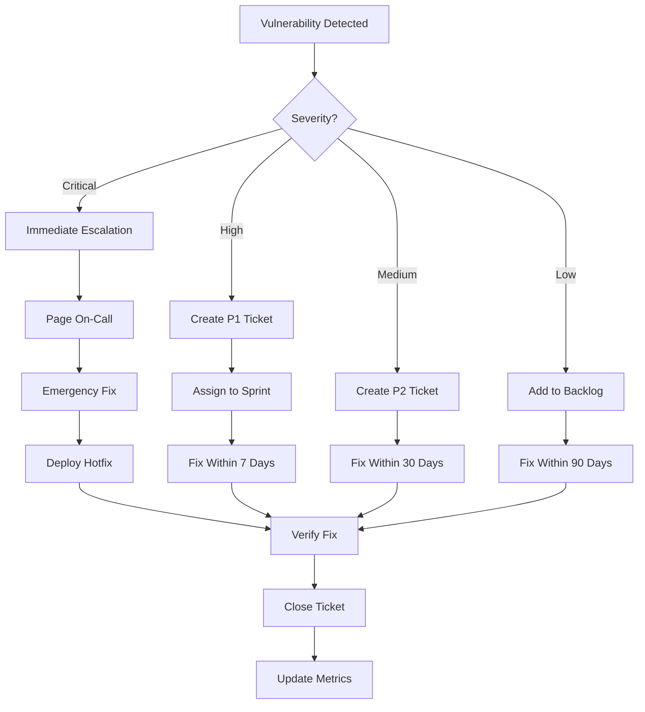

# How to Implement DevSecOps Practices

Author: [nawazdhandala](https://www.github.com/nawazdhandala)

Tags: DevSecOps, Security, DevOps, CI/CD, Shift Left, Vulnerability Management, SAST, DAST, Container Security

Description: A hands-on guide to integrating security into your development pipeline without slowing down delivery velocity.

---

## Why DevSecOps Implementation Fails

Most DevSecOps initiatives fail for the same reason: security becomes a gate that blocks deployments rather than a guardrail that enables safe velocity. Engineers start ignoring security warnings because they cry wolf too often. Security teams get frustrated because their tools keep finding the same issues.

This guide focuses on implementing DevSecOps in a way that engineers will actually adopt. The key is making security checks fast, relevant, and actionable.

## Start with the Pipeline

DevSecOps lives in your CI/CD pipeline. If security checks are not automated and integrated, they will be skipped when deadlines get tight.

Here is a GitLab CI pipeline that demonstrates the core DevSecOps stages:

```yaml
# .gitlab-ci.yml
# DevSecOps pipeline with security at every stage

stages:
  - build
  - security-scan
  - test
  - deploy-staging
  - security-test
  - deploy-production

variables:
  # Fail the pipeline on high/critical vulnerabilities
  SECURITY_FAIL_THRESHOLD: "high"

# Stage 1: Build and initial security checks
build:
  stage: build
  script:
    - docker build -t $CI_REGISTRY_IMAGE:$CI_COMMIT_SHA .
    - docker push $CI_REGISTRY_IMAGE:$CI_COMMIT_SHA
  artifacts:
    reports:
      # Export SBOM for later analysis
      cyclonedx: sbom.json

# Stage 2: Static analysis and dependency scanning
sast:
  stage: security-scan
  image: semgrep/semgrep:latest
  script:
    # Run SAST with rules relevant to your stack
    - semgrep scan --config auto --json --output sast-results.json .
    # Check for blocking issues
    - |
      HIGH_COUNT=$(jq '[.results[] | select(.extra.severity == "ERROR")] | length' sast-results.json)
      if [ "$HIGH_COUNT" -gt 0 ]; then
        echo "Found $HIGH_COUNT high severity issues"
        jq '.results[] | select(.extra.severity == "ERROR") | {file: .path, line: .start.line, message: .extra.message}' sast-results.json
        exit 1
      fi
  artifacts:
    reports:
      sast: sast-results.json
  allow_failure: false

dependency_scan:
  stage: security-scan
  image: aquasec/trivy:latest
  script:
    # Scan dependencies for known vulnerabilities
    - trivy fs --format json --output dep-scan.json .
    # Check against threshold
    - |
      CRITICAL=$(jq '[.Results[].Vulnerabilities[] | select(.Severity == "CRITICAL")] | length' dep-scan.json)
      if [ "$CRITICAL" -gt 0 ]; then
        echo "Found $CRITICAL critical vulnerabilities in dependencies"
        exit 1
      fi
  artifacts:
    reports:
      dependency_scanning: dep-scan.json

container_scan:
  stage: security-scan
  image: aquasec/trivy:latest
  script:
    # Scan the container image
    - trivy image --format json --output container-scan.json $CI_REGISTRY_IMAGE:$CI_COMMIT_SHA
    - |
      CRITICAL=$(jq '[.Results[].Vulnerabilities[] | select(.Severity == "CRITICAL")] | length' container-scan.json)
      HIGH=$(jq '[.Results[].Vulnerabilities[] | select(.Severity == "HIGH")] | length' container-scan.json)
      echo "Found $CRITICAL critical and $HIGH high vulnerabilities"
      if [ "$CRITICAL" -gt 0 ]; then
        exit 1
      fi
  artifacts:
    reports:
      container_scanning: container-scan.json

secrets_detection:
  stage: security-scan
  image: trufflesecurity/trufflehog:latest
  script:
    # Scan for leaked secrets
    - trufflehog git file://. --json > secrets-scan.json 2>&1 || true
    - |
      if [ -s secrets-scan.json ]; then
        echo "Potential secrets detected!"
        cat secrets-scan.json
        exit 1
      fi

# Stage 3: Run tests
test:
  stage: test
  script:
    - npm test
  needs:
    - sast
    - dependency_scan

# Stage 4: Deploy to staging
deploy_staging:
  stage: deploy-staging
  script:
    - kubectl apply -f k8s/staging/
  environment:
    name: staging

# Stage 5: Dynamic security testing against staging
dast:
  stage: security-test
  image: owasp/zap2docker-stable
  script:
    # Run OWASP ZAP against staging environment
    - zap-baseline.py -t https://staging.example.com -J dast-results.json
  artifacts:
    reports:
      dast: dast-results.json
  needs:
    - deploy_staging

# Stage 6: Production deployment with final checks
deploy_production:
  stage: deploy-production
  script:
    - kubectl apply -f k8s/production/
  environment:
    name: production
  needs:
    - dast
  rules:
    - if: $CI_COMMIT_BRANCH == "main"
      when: manual
```

## Implementing Shift-Left Security

Shift-left means catching security issues as early as possible. The cheapest time to fix a vulnerability is before the code is committed.

Set up pre-commit hooks that run fast security checks locally:

```yaml
# .pre-commit-config.yaml
# Security checks that run before every commit

repos:
  # Detect secrets before they get committed
  - repo: https://github.com/Yelp/detect-secrets
    rev: v1.4.0
    hooks:
      - id: detect-secrets
        args: ['--baseline', '.secrets.baseline']

  # Fast static analysis
  - repo: https://github.com/returntocorp/semgrep
    rev: v1.50.0
    hooks:
      - id: semgrep
        args: ['--config', 'p/security-audit', '--error']

  # Check for vulnerable dependencies
  - repo: local
    hooks:
      - id: safety-check
        name: Check Python dependencies
        entry: safety check --full-report
        language: python
        files: requirements.*\.txt$
        pass_filenames: false
```

Engineers install this once, and every commit gets a quick security check. The key is keeping these checks fast, under 30 seconds, so they do not disrupt the development flow.

## Building a Vulnerability Management Workflow

Finding vulnerabilities is easy. Managing them is hard. You need a workflow that triages, prioritizes, and tracks remediation.



Here is a script that integrates scanner results with your ticketing system:

```python
# vulnerability_workflow.py
# Automated vulnerability triage and ticket creation

import json
import requests
from datetime import datetime, timedelta
from typing import List, Dict

class VulnerabilityManager:
    def __init__(self, jira_url: str, jira_token: str, project_key: str):
        self.jira_url = jira_url
        self.jira_auth = ('', jira_token)
        self.project = project_key

        # SLA definitions by severity
        self.sla_days = {
            'CRITICAL': 1,
            'HIGH': 7,
            'MEDIUM': 30,
            'LOW': 90
        }

    def process_scan_results(self, scan_file: str, scanner_type: str):
        """Process scanner output and create tickets for new findings."""
        with open(scan_file) as f:
            results = json.load(f)

        findings = self._parse_findings(results, scanner_type)

        for finding in findings:
            if not self._is_duplicate(finding):
                self._create_ticket(finding)

    def _parse_findings(self, results: dict, scanner_type: str) -> List[Dict]:
        """Parse findings from different scanner formats."""
        findings = []

        if scanner_type == 'trivy':
            for result in results.get('Results', []):
                for vuln in result.get('Vulnerabilities', []):
                    findings.append({
                        'id': vuln['VulnerabilityID'],
                        'severity': vuln['Severity'],
                        'package': vuln['PkgName'],
                        'version': vuln['InstalledVersion'],
                        'fixed_version': vuln.get('FixedVersion', 'No fix available'),
                        'description': vuln.get('Description', ''),
                        'source': result.get('Target', 'unknown')
                    })

        elif scanner_type == 'semgrep':
            for result in results.get('results', []):
                severity_map = {'ERROR': 'HIGH', 'WARNING': 'MEDIUM', 'INFO': 'LOW'}
                findings.append({
                    'id': result['check_id'],
                    'severity': severity_map.get(result['extra']['severity'], 'MEDIUM'),
                    'file': result['path'],
                    'line': result['start']['line'],
                    'description': result['extra']['message'],
                    'source': 'SAST'
                })

        return findings

    def _is_duplicate(self, finding: Dict) -> bool:
        """Check if a ticket already exists for this finding."""
        jql = f'project = {self.project} AND labels = "security" AND summary ~ "{finding["id"]}"'

        response = requests.get(
            f'{self.jira_url}/rest/api/2/search',
            auth=self.jira_auth,
            params={'jql': jql, 'maxResults': 1}
        )

        return response.json().get('total', 0) > 0

    def _create_ticket(self, finding: Dict):
        """Create a Jira ticket for the finding."""
        severity = finding['severity']
        due_date = datetime.now() + timedelta(days=self.sla_days.get(severity, 30))

        # Map severity to Jira priority
        priority_map = {
            'CRITICAL': 'Highest',
            'HIGH': 'High',
            'MEDIUM': 'Medium',
            'LOW': 'Low'
        }

        ticket_data = {
            'fields': {
                'project': {'key': self.project},
                'summary': f"[{severity}] {finding['id']}",
                'description': self._format_description(finding),
                'issuetype': {'name': 'Bug'},
                'priority': {'name': priority_map.get(severity, 'Medium')},
                'labels': ['security', f'severity-{severity.lower()}'],
                'duedate': due_date.strftime('%Y-%m-%d')
            }
        }

        response = requests.post(
            f'{self.jira_url}/rest/api/2/issue',
            auth=self.jira_auth,
            json=ticket_data
        )

        if response.status_code == 201:
            issue_key = response.json()['key']
            print(f"Created ticket {issue_key} for {finding['id']}")
        else:
            print(f"Failed to create ticket: {response.text}")

    def _format_description(self, finding: Dict) -> str:
        """Format finding details for ticket description."""
        return f"""
h2. Vulnerability Details

* *ID:* {finding['id']}
* *Severity:* {finding['severity']}
* *Source:* {finding.get('source', 'Unknown')}

h3. Description
{finding.get('description', 'No description available')}

h3. Affected Component
{finding.get('package', finding.get('file', 'Unknown'))}

h3. Remediation
{finding.get('fixed_version', 'See vendor advisory')}

h3. References
* [CVE Details|https://nvd.nist.gov/vuln/detail/{finding['id']}]
"""


# Example usage in CI pipeline
if __name__ == '__main__':
    import sys

    manager = VulnerabilityManager(
        jira_url='https://yourcompany.atlassian.net',
        jira_token=os.environ['JIRA_TOKEN'],
        project_key='SEC'
    )

    manager.process_scan_results(sys.argv[1], sys.argv[2])
```

## Securing the Supply Chain

Modern applications rely heavily on third-party dependencies. A single compromised package can affect thousands of applications.

Implement Software Bill of Materials (SBOM) tracking:

```yaml
# sbom-generation.yaml
# Generate and verify SBOMs in CI

generate_sbom:
  stage: build
  script:
    # Generate SBOM using Syft
    - syft $CI_REGISTRY_IMAGE:$CI_COMMIT_SHA -o cyclonedx-json=sbom.json

    # Sign the SBOM for integrity
    - cosign sign-blob --key cosign.key sbom.json --output-signature sbom.json.sig

    # Store in artifact registry
    - cosign attach sbom --sbom sbom.json $CI_REGISTRY_IMAGE:$CI_COMMIT_SHA
  artifacts:
    paths:
      - sbom.json
      - sbom.json.sig

verify_sbom:
  stage: security-scan
  script:
    # Verify SBOM signature
    - cosign verify-blob --key cosign.pub --signature sbom.json.sig sbom.json

    # Check SBOM against known vulnerable packages
    - grype sbom:sbom.json --fail-on critical
```

## Runtime Security Monitoring

Static scanning catches issues before deployment. Runtime monitoring catches what gets through.

Set up alerts for suspicious container behavior:

```yaml
# falco-rules.yaml
# Runtime security rules using Falco

- rule: Unexpected Shell in Container
  desc: Detect shell execution in containers that shouldn't have shells
  condition: >
    spawned_process and
    container and
    shell_procs and
    not container.image.repository in (allowed_shell_images)
  output: >
    Shell executed in container (user=%user.name command=%proc.cmdline
    container=%container.name image=%container.image.repository)
  priority: WARNING
  tags: [container, shell]

- rule: Sensitive File Access
  desc: Detect access to sensitive files
  condition: >
    open_read and
    container and
    fd.name in (/etc/shadow, /etc/passwd, /root/.ssh/*)
  output: >
    Sensitive file accessed (user=%user.name command=%proc.cmdline
    file=%fd.name container=%container.name)
  priority: CRITICAL
  tags: [filesystem, sensitive]

- rule: Crypto Mining Activity
  desc: Detect potential crypto mining processes
  condition: >
    spawned_process and
    container and
    (proc.name in (xmrig, minerd, cpuminer) or
     proc.cmdline contains "stratum+tcp")
  output: >
    Potential crypto mining detected (user=%user.name command=%proc.cmdline
    container=%container.name)
  priority: CRITICAL
  tags: [crypto, mining]
```

## Measuring DevSecOps Success

Track metrics that show whether your DevSecOps implementation is working:

- **Mean Time to Remediation (MTTR)**: How long from vulnerability discovery to fix
- **Escape Rate**: Vulnerabilities found in production vs. caught in pipeline
- **False Positive Rate**: Percentage of findings that are not actual issues
- **Developer Friction Score**: Survey developers about security tool impact on productivity

```sql
-- Example queries for DevSecOps metrics dashboard

-- MTTR by severity
SELECT
    severity,
    AVG(EXTRACT(EPOCH FROM (resolved_at - discovered_at)) / 86400) as avg_days_to_fix
FROM vulnerabilities
WHERE resolved_at IS NOT NULL
GROUP BY severity;

-- Escape rate trend
SELECT
    DATE_TRUNC('week', discovered_at) as week,
    COUNT(*) FILTER (WHERE discovered_in = 'production') as production_finds,
    COUNT(*) FILTER (WHERE discovered_in = 'pipeline') as pipeline_finds,
    ROUND(
        100.0 * COUNT(*) FILTER (WHERE discovered_in = 'production') / COUNT(*),
        2
    ) as escape_rate_percent
FROM vulnerabilities
GROUP BY week
ORDER BY week;
```

## Getting Started

You do not need to implement everything at once. Start with these steps:

1. Add dependency scanning to your pipeline. This catches the most common vulnerabilities with minimal effort.
2. Set up secrets detection in pre-commit hooks. Leaked credentials are one of the most damaging security failures.
3. Create a simple triage process for findings. Even a shared spreadsheet is better than ignoring scanner output.
4. Establish SLAs for different severity levels. Without deadlines, vulnerabilities languish forever.

Once these basics are working, expand to SAST, container scanning, and runtime monitoring. The goal is continuous improvement, not perfection on day one.
