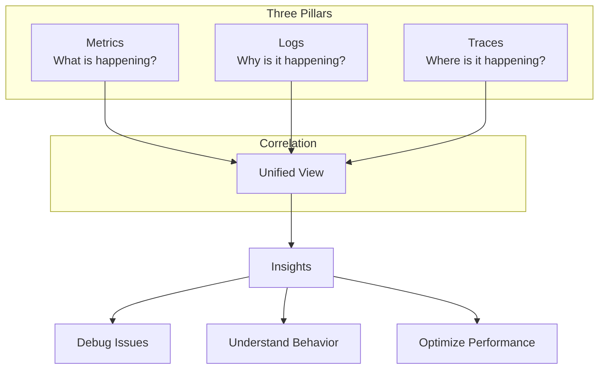
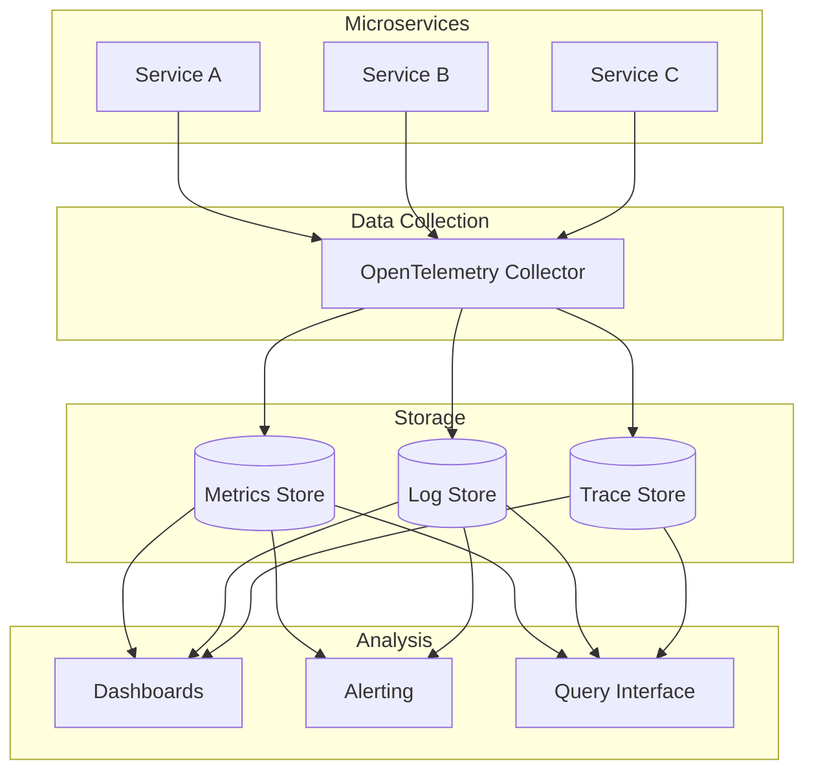

# How to Implement Observability in Microservices

Author: [nawazdhandala](https://www.github.com/nawazdhandala)

Tags: Observability, Microservices, OpenTelemetry, Metrics, Logging, Tracing, Monitoring, SRE, DevOps

Description: A comprehensive guide to implementing the three pillars of observability - metrics, logs, and traces - in microservices architectures with practical examples and best practices.

---

> Observability is the ability to understand a system's internal state by examining its outputs. In microservices, this means correlating metrics, logs, and traces to debug issues and understand behavior across distributed systems.

Unlike traditional monitoring that focuses on known failure modes, observability helps you answer questions you did not know to ask.

---

## The Three Pillars of Observability



- **Metrics**: Numeric measurements aggregated over time
- **Logs**: Discrete events with contextual information
- **Traces**: Request flow across service boundaries

---

## Setting Up OpenTelemetry

OpenTelemetry provides unified instrumentation for all three pillars:

```python
# otel_setup.py
import os
from opentelemetry import trace, metrics
from opentelemetry.sdk.trace import TracerProvider
from opentelemetry.sdk.trace.export import BatchSpanProcessor
from opentelemetry.sdk.metrics import MeterProvider
from opentelemetry.sdk.metrics.export import PeriodicExportingMetricReader
from opentelemetry.exporter.otlp.proto.http.trace_exporter import OTLPSpanExporter
from opentelemetry.exporter.otlp.proto.http.metric_exporter import OTLPMetricExporter
from opentelemetry.sdk.resources import Resource, SERVICE_NAME, SERVICE_VERSION
from opentelemetry.instrumentation.requests import RequestsInstrumentor
from opentelemetry.instrumentation.fastapi import FastAPIInstrumentor
import logging

def setup_observability(service_name: str, service_version: str = "1.0.0"):
    """
    Initialize OpenTelemetry for traces, metrics, and log correlation
    """

    # Resource attributes identify this service
    resource = Resource.create({
        SERVICE_NAME: service_name,
        SERVICE_VERSION: service_version,
        "deployment.environment": os.getenv("ENVIRONMENT", "development"),
        "host.name": os.getenv("HOSTNAME", "unknown")
    })

    # OTLP endpoint configuration
    otlp_endpoint = os.getenv("OTLP_ENDPOINT", "https://oneuptime.com/otlp")
    otlp_headers = {"x-oneuptime-token": os.getenv("ONEUPTIME_TOKEN", "")}

    # Setup Tracing
    trace_provider = TracerProvider(resource=resource)
    trace_exporter = OTLPSpanExporter(
        endpoint=f"{otlp_endpoint}/v1/traces",
        headers=otlp_headers
    )
    trace_provider.add_span_processor(BatchSpanProcessor(trace_exporter))
    trace.set_tracer_provider(trace_provider)

    # Setup Metrics
    metric_exporter = OTLPMetricExporter(
        endpoint=f"{otlp_endpoint}/v1/metrics",
        headers=otlp_headers
    )
    metric_reader = PeriodicExportingMetricReader(
        metric_exporter,
        export_interval_millis=60000  # Export every 60 seconds
    )
    meter_provider = MeterProvider(resource=resource, metric_readers=[metric_reader])
    metrics.set_meter_provider(meter_provider)

    # Auto-instrument common libraries
    RequestsInstrumentor().instrument()

    # Configure logging to include trace context
    setup_logging_with_trace_context(service_name)

    return trace.get_tracer(service_name), metrics.get_meter(service_name)


def setup_logging_with_trace_context(service_name: str):
    """Configure structured logging with trace correlation"""

    class TraceContextFilter(logging.Filter):
        """Add trace context to log records"""

        def filter(self, record):
            span = trace.get_current_span()
            if span and span.get_span_context().is_valid:
                ctx = span.get_span_context()
                record.trace_id = format(ctx.trace_id, '032x')
                record.span_id = format(ctx.span_id, '016x')
            else:
                record.trace_id = "00000000000000000000000000000000"
                record.span_id = "0000000000000000"
            record.service = service_name
            return True

    # Configure root logger
    handler = logging.StreamHandler()
    handler.addFilter(TraceContextFilter())

    # JSON format for structured logging
    formatter = logging.Formatter(
        '{"timestamp": "%(asctime)s", "level": "%(levelname)s", '
        '"service": "%(service)s", "trace_id": "%(trace_id)s", '
        '"span_id": "%(span_id)s", "message": "%(message)s"}'
    )
    handler.setFormatter(formatter)

    logging.root.handlers = [handler]
    logging.root.setLevel(logging.INFO)
```

---

## Implementing Metrics

### Custom Business Metrics

```python
# business_metrics.py
from opentelemetry import metrics
from opentelemetry.metrics import Counter, Histogram, UpDownCounter
from typing import Dict, Any
import functools
import time

# Get meter for this module
meter = metrics.get_meter(__name__)

# Define metrics
orders_created = meter.create_counter(
    name="orders.created",
    description="Number of orders created",
    unit="1"
)

orders_value = meter.create_histogram(
    name="orders.value",
    description="Value of orders in dollars",
    unit="$"
)

active_sessions = meter.create_up_down_counter(
    name="sessions.active",
    description="Number of active user sessions",
    unit="1"
)

request_duration = meter.create_histogram(
    name="http.request.duration",
    description="HTTP request duration",
    unit="ms"
)


class MetricsCollector:
    """Collect and record application metrics"""

    def __init__(self, meter_name: str):
        self.meter = metrics.get_meter(meter_name)
        self._counters: Dict[str, Counter] = {}
        self._histograms: Dict[str, Histogram] = {}
        self._gauges: Dict[str, UpDownCounter] = {}

    def counter(self, name: str, description: str = "", unit: str = "1") -> Counter:
        """Get or create a counter"""
        if name not in self._counters:
            self._counters[name] = self.meter.create_counter(
                name=name,
                description=description,
                unit=unit
            )
        return self._counters[name]

    def histogram(self, name: str, description: str = "", unit: str = "1") -> Histogram:
        """Get or create a histogram"""
        if name not in self._histograms:
            self._histograms[name] = self.meter.create_histogram(
                name=name,
                description=description,
                unit=unit
            )
        return self._histograms[name]

    def gauge(self, name: str, description: str = "", unit: str = "1") -> UpDownCounter:
        """Get or create a gauge (up-down counter)"""
        if name not in self._gauges:
            self._gauges[name] = self.meter.create_up_down_counter(
                name=name,
                description=description,
                unit=unit
            )
        return self._gauges[name]


# Usage in business logic
collector = MetricsCollector("order-service")

async def create_order(order_data: dict) -> dict:
    """Create order with metrics collection"""

    start_time = time.time()

    try:
        order = await process_order(order_data)

        # Record success metrics
        collector.counter("orders.created").add(1, {
            "status": "success",
            "payment_method": order_data.get("payment_method", "unknown")
        })

        collector.histogram("orders.value").record(
            order["total"],
            {"currency": order.get("currency", "USD")}
        )

        return order

    except Exception as e:
        # Record failure metrics
        collector.counter("orders.created").add(1, {
            "status": "failed",
            "error_type": type(e).__name__
        })
        raise

    finally:
        # Record duration
        duration_ms = (time.time() - start_time) * 1000
        collector.histogram("orders.processing_time").record(duration_ms)


# Decorator for automatic metrics
def track_metrics(metric_name: str):
    """Decorator to automatically track function metrics"""

    def decorator(func):
        counter = collector.counter(f"{metric_name}.calls")
        duration = collector.histogram(f"{metric_name}.duration")

        @functools.wraps(func)
        async def wrapper(*args, **kwargs):
            start = time.time()
            status = "success"

            try:
                result = await func(*args, **kwargs)
                return result
            except Exception as e:
                status = "error"
                raise
            finally:
                counter.add(1, {"status": status})
                duration.record((time.time() - start) * 1000)

        return wrapper
    return decorator


# Usage
@track_metrics("payment.process")
async def process_payment(payment_data: dict):
    # Processing logic
    pass
```

### RED Metrics (Rate, Errors, Duration)

```python
# red_metrics.py
from opentelemetry import metrics, trace
from fastapi import FastAPI, Request
from starlette.middleware.base import BaseHTTPMiddleware
import time

meter = metrics.get_meter(__name__)
tracer = trace.get_tracer(__name__)

# RED metrics
http_requests_total = meter.create_counter(
    name="http_requests_total",
    description="Total HTTP requests",
    unit="1"
)

http_request_errors_total = meter.create_counter(
    name="http_request_errors_total",
    description="Total HTTP request errors",
    unit="1"
)

http_request_duration_seconds = meter.create_histogram(
    name="http_request_duration_seconds",
    description="HTTP request duration in seconds",
    unit="s"
)


class REDMetricsMiddleware(BaseHTTPMiddleware):
    """Middleware to collect RED metrics for all HTTP requests"""

    async def dispatch(self, request: Request, call_next):
        start_time = time.time()

        # Common attributes
        attributes = {
            "http.method": request.method,
            "http.route": request.url.path,
            "http.scheme": request.url.scheme
        }

        try:
            response = await call_next(request)

            # Record rate
            http_requests_total.add(1, {
                **attributes,
                "http.status_code": str(response.status_code)
            })

            # Record errors (4xx and 5xx)
            if response.status_code >= 400:
                http_request_errors_total.add(1, {
                    **attributes,
                    "http.status_code": str(response.status_code)
                })

            return response

        except Exception as e:
            # Record error
            http_request_errors_total.add(1, {
                **attributes,
                "error.type": type(e).__name__
            })
            raise

        finally:
            # Record duration
            duration = time.time() - start_time
            http_request_duration_seconds.record(duration, attributes)


# Apply to FastAPI
app = FastAPI()
app.add_middleware(REDMetricsMiddleware)
```

---

## Implementing Structured Logging

### Log Aggregation with Context

```python
# structured_logging.py
import logging
import json
from datetime import datetime
from typing import Any, Dict, Optional
from opentelemetry import trace
from contextvars import ContextVar

# Context variable for request-scoped data
request_context: ContextVar[Dict[str, Any]] = ContextVar('request_context', default={})

class StructuredLogger:
    """Structured logger with trace correlation"""

    def __init__(self, name: str):
        self.name = name
        self.logger = logging.getLogger(name)

    def _get_trace_context(self) -> Dict[str, str]:
        """Extract trace context from current span"""
        span = trace.get_current_span()
        if span and span.get_span_context().is_valid:
            ctx = span.get_span_context()
            return {
                "trace_id": format(ctx.trace_id, '032x'),
                "span_id": format(ctx.span_id, '016x')
            }
        return {"trace_id": "", "span_id": ""}

    def _build_log_entry(
        self,
        level: str,
        message: str,
        extra: Dict[str, Any] = None
    ) -> Dict[str, Any]:
        """Build structured log entry"""

        entry = {
            "timestamp": datetime.utcnow().isoformat() + "Z",
            "level": level,
            "logger": self.name,
            "message": message,
            **self._get_trace_context(),
            **request_context.get()
        }

        if extra:
            entry["data"] = extra

        return entry

    def _log(self, level: int, message: str, **kwargs):
        """Internal log method"""
        entry = self._build_log_entry(
            logging.getLevelName(level),
            message,
            kwargs.get("extra")
        )
        self.logger.log(level, json.dumps(entry))

    def info(self, message: str, **kwargs):
        """Log info message"""
        self._log(logging.INFO, message, **kwargs)

    def warning(self, message: str, **kwargs):
        """Log warning message"""
        self._log(logging.WARNING, message, **kwargs)

    def error(self, message: str, exc_info: bool = False, **kwargs):
        """Log error message"""
        if exc_info:
            import traceback
            kwargs.setdefault("extra", {})["stacktrace"] = traceback.format_exc()
        self._log(logging.ERROR, message, **kwargs)

    def debug(self, message: str, **kwargs):
        """Log debug message"""
        self._log(logging.DEBUG, message, **kwargs)


# Context manager for request-scoped logging
class LogContext:
    """Add context to all logs within a scope"""

    def __init__(self, **context):
        self.context = context
        self.token = None

    def __enter__(self):
        current = request_context.get().copy()
        current.update(self.context)
        self.token = request_context.set(current)
        return self

    def __exit__(self, *args):
        request_context.reset(self.token)


# Usage
logger = StructuredLogger("order-service")

async def process_order(order_id: str, user_id: str):
    """Process order with structured logging"""

    with LogContext(order_id=order_id, user_id=user_id):
        logger.info("Starting order processing")

        try:
            # Validate
            logger.debug("Validating order", extra={"step": "validation"})
            await validate_order(order_id)

            # Process payment
            logger.info("Processing payment", extra={"step": "payment"})
            payment_result = await process_payment(order_id)

            logger.info(
                "Order processed successfully",
                extra={
                    "payment_id": payment_result["id"],
                    "amount": payment_result["amount"]
                }
            )

            return {"status": "success"}

        except PaymentError as e:
            logger.error(
                "Payment processing failed",
                exc_info=True,
                extra={"error_code": e.code}
            )
            raise
```

### Log Correlation with Traces

```python
# log_trace_correlation.py
from fastapi import FastAPI, Request
from starlette.middleware.base import BaseHTTPMiddleware
from opentelemetry import trace
import uuid

app = FastAPI()

class LogCorrelationMiddleware(BaseHTTPMiddleware):
    """Add correlation IDs to all requests for log aggregation"""

    async def dispatch(self, request: Request, call_next):
        # Get or generate correlation ID
        correlation_id = request.headers.get(
            "X-Correlation-ID",
            str(uuid.uuid4())
        )

        # Get trace context
        span = trace.get_current_span()
        trace_id = ""
        if span and span.get_span_context().is_valid:
            trace_id = format(span.get_span_context().trace_id, '032x')

        # Set in request context for logging
        with LogContext(
            correlation_id=correlation_id,
            trace_id=trace_id,
            request_id=str(uuid.uuid4()),
            path=request.url.path,
            method=request.method
        ):
            response = await call_next(request)

            # Add correlation headers to response
            response.headers["X-Correlation-ID"] = correlation_id
            response.headers["X-Trace-ID"] = trace_id

            return response


app.add_middleware(LogCorrelationMiddleware)
```

---

## Implementing Distributed Tracing

### Custom Spans for Business Logic

```python
# custom_tracing.py
from opentelemetry import trace
from opentelemetry.trace import SpanKind, Status, StatusCode
from functools import wraps
from typing import Optional, Dict, Any

tracer = trace.get_tracer(__name__)

def traced(
    span_name: Optional[str] = None,
    kind: SpanKind = SpanKind.INTERNAL,
    attributes: Dict[str, Any] = None
):
    """Decorator to add tracing to functions"""

    def decorator(func):
        @wraps(func)
        async def async_wrapper(*args, **kwargs):
            name = span_name or func.__name__

            with tracer.start_as_current_span(
                name,
                kind=kind,
                attributes=attributes or {}
            ) as span:
                # Add function arguments as attributes
                if args:
                    span.set_attribute("args.count", len(args))
                if kwargs:
                    for key, value in kwargs.items():
                        if isinstance(value, (str, int, float, bool)):
                            span.set_attribute(f"arg.{key}", value)

                try:
                    result = await func(*args, **kwargs)
                    span.set_status(Status(StatusCode.OK))
                    return result
                except Exception as e:
                    span.set_status(Status(StatusCode.ERROR, str(e)))
                    span.record_exception(e)
                    raise

        @wraps(func)
        def sync_wrapper(*args, **kwargs):
            name = span_name or func.__name__

            with tracer.start_as_current_span(
                name,
                kind=kind,
                attributes=attributes or {}
            ) as span:
                try:
                    result = func(*args, **kwargs)
                    span.set_status(Status(StatusCode.OK))
                    return result
                except Exception as e:
                    span.set_status(Status(StatusCode.ERROR, str(e)))
                    span.record_exception(e)
                    raise

        if asyncio.iscoroutinefunction(func):
            return async_wrapper
        return sync_wrapper

    return decorator


# Usage
@traced(span_name="order.validate", attributes={"component": "validation"})
async def validate_order(order_data: dict):
    """Validate order with automatic tracing"""

    span = trace.get_current_span()

    # Add business context
    span.set_attribute("order.items_count", len(order_data.get("items", [])))
    span.set_attribute("order.total", order_data.get("total", 0))

    # Validation logic
    if not order_data.get("customer_id"):
        span.add_event("validation_failed", {"reason": "missing_customer_id"})
        raise ValueError("Customer ID is required")

    span.add_event("validation_passed")
    return True


@traced(span_name="order.process", kind=SpanKind.INTERNAL)
async def process_order(order_id: str, order_data: dict):
    """Process order with detailed tracing"""

    span = trace.get_current_span()
    span.set_attribute("order.id", order_id)

    # Create child spans for each step
    with tracer.start_as_current_span("inventory.check") as inv_span:
        inv_span.set_attribute("items.count", len(order_data["items"]))
        available = await check_inventory(order_data["items"])
        inv_span.set_attribute("inventory.available", available)

    with tracer.start_as_current_span("payment.process") as pay_span:
        pay_span.set_attribute("amount", order_data["total"])
        payment = await charge_payment(order_data)
        pay_span.set_attribute("payment.id", payment["id"])

    with tracer.start_as_current_span("fulfillment.create") as ful_span:
        fulfillment = await create_fulfillment(order_id)
        ful_span.set_attribute("fulfillment.id", fulfillment["id"])

    return {"order_id": order_id, "status": "completed"}
```

### Cross-Service Trace Propagation

```python
# trace_propagation.py
import httpx
from opentelemetry import trace
from opentelemetry.propagate import inject, extract
from opentelemetry.trace import SpanKind

tracer = trace.get_tracer(__name__)

class TracedHTTPClient:
    """HTTP client with automatic trace propagation"""

    def __init__(self, base_url: str, service_name: str):
        self.base_url = base_url
        self.service_name = service_name
        self.client = httpx.AsyncClient()

    async def request(
        self,
        method: str,
        path: str,
        **kwargs
    ) -> httpx.Response:
        """Make traced HTTP request"""

        url = f"{self.base_url}{path}"

        with tracer.start_as_current_span(
            f"HTTP {method} {self.service_name}",
            kind=SpanKind.CLIENT
        ) as span:
            # Set HTTP attributes
            span.set_attribute("http.method", method)
            span.set_attribute("http.url", url)
            span.set_attribute("peer.service", self.service_name)

            # Inject trace context into headers
            headers = kwargs.pop("headers", {})
            inject(headers)

            try:
                response = await self.client.request(
                    method,
                    url,
                    headers=headers,
                    **kwargs
                )

                span.set_attribute("http.status_code", response.status_code)

                if response.status_code >= 400:
                    span.set_status(Status(
                        StatusCode.ERROR,
                        f"HTTP {response.status_code}"
                    ))

                return response

            except Exception as e:
                span.record_exception(e)
                span.set_status(Status(StatusCode.ERROR, str(e)))
                raise

    async def get(self, path: str, **kwargs):
        return await self.request("GET", path, **kwargs)

    async def post(self, path: str, **kwargs):
        return await self.request("POST", path, **kwargs)


# Service clients
user_service = TracedHTTPClient("http://user-service:8001", "user-service")
order_service = TracedHTTPClient("http://order-service:8002", "order-service")
payment_service = TracedHTTPClient("http://payment-service:8003", "payment-service")
```

---

## Building Observability Dashboards

### Key Metrics Dashboard

```python
# dashboard_queries.py
"""
Prometheus/PromQL queries for observability dashboards
"""

DASHBOARD_QUERIES = {
    # Service Health
    "request_rate": '''
        sum(rate(http_requests_total{service="$service"}[5m]))
    ''',

    "error_rate": '''
        sum(rate(http_requests_total{service="$service",status=~"5.."}[5m]))
        /
        sum(rate(http_requests_total{service="$service"}[5m]))
    ''',

    "latency_p50": '''
        histogram_quantile(0.50,
            sum(rate(http_request_duration_seconds_bucket{service="$service"}[5m]))
            by (le)
        )
    ''',

    "latency_p95": '''
        histogram_quantile(0.95,
            sum(rate(http_request_duration_seconds_bucket{service="$service"}[5m]))
            by (le)
        )
    ''',

    "latency_p99": '''
        histogram_quantile(0.99,
            sum(rate(http_request_duration_seconds_bucket{service="$service"}[5m]))
            by (le)
        )
    ''',

    # Business Metrics
    "orders_per_minute": '''
        sum(rate(orders_created_total[1m])) * 60
    ''',

    "order_success_rate": '''
        sum(rate(orders_created_total{status="success"}[5m]))
        /
        sum(rate(orders_created_total[5m]))
    ''',

    "revenue_per_hour": '''
        sum(increase(orders_value_sum[1h]))
    ''',

    # Infrastructure
    "active_connections": '''
        sum(db_connections_active{service="$service"})
    ''',

    "memory_usage": '''
        container_memory_usage_bytes{service="$service"}
        /
        container_spec_memory_limit_bytes{service="$service"}
    ''',

    "cpu_usage": '''
        rate(container_cpu_usage_seconds_total{service="$service"}[5m])
    '''
}


class DashboardBuilder:
    """Build observability dashboard configurations"""

    @staticmethod
    def service_overview_dashboard(service_name: str) -> dict:
        """Generate service overview dashboard"""

        return {
            "title": f"{service_name} Service Overview",
            "panels": [
                {
                    "title": "Request Rate",
                    "type": "graph",
                    "query": DASHBOARD_QUERIES["request_rate"].replace("$service", service_name)
                },
                {
                    "title": "Error Rate",
                    "type": "gauge",
                    "query": DASHBOARD_QUERIES["error_rate"].replace("$service", service_name),
                    "thresholds": [
                        {"value": 0, "color": "green"},
                        {"value": 0.01, "color": "yellow"},
                        {"value": 0.05, "color": "red"}
                    ]
                },
                {
                    "title": "Latency Percentiles",
                    "type": "graph",
                    "queries": [
                        {"label": "p50", "query": DASHBOARD_QUERIES["latency_p50"].replace("$service", service_name)},
                        {"label": "p95", "query": DASHBOARD_QUERIES["latency_p95"].replace("$service", service_name)},
                        {"label": "p99", "query": DASHBOARD_QUERIES["latency_p99"].replace("$service", service_name)}
                    ]
                }
            ]
        }
```

---

## Alerting on Observability Data

### Alert Rules

```python
# alerting.py
from dataclasses import dataclass
from typing import List, Optional
from enum import Enum

class AlertSeverity(Enum):
    INFO = "info"
    WARNING = "warning"
    CRITICAL = "critical"


@dataclass
class AlertRule:
    """Definition of an alert rule"""
    name: str
    description: str
    query: str
    threshold: float
    comparison: str  # gt, lt, eq
    duration: str  # e.g., "5m"
    severity: AlertSeverity
    labels: dict = None
    annotations: dict = None


# Common alert rules for microservices
ALERT_RULES = [
    AlertRule(
        name="HighErrorRate",
        description="Service error rate is above threshold",
        query='sum(rate(http_requests_total{status=~"5.."}[5m])) / sum(rate(http_requests_total[5m]))',
        threshold=0.05,
        comparison="gt",
        duration="5m",
        severity=AlertSeverity.CRITICAL,
        annotations={
            "summary": "High error rate detected",
            "description": "Error rate is {{ $value | humanizePercentage }} for {{ $labels.service }}"
        }
    ),

    AlertRule(
        name="HighLatency",
        description="Service latency p99 is above threshold",
        query='histogram_quantile(0.99, sum(rate(http_request_duration_seconds_bucket[5m])) by (le, service))',
        threshold=2.0,
        comparison="gt",
        duration="5m",
        severity=AlertSeverity.WARNING,
        annotations={
            "summary": "High latency detected",
            "description": "P99 latency is {{ $value }}s for {{ $labels.service }}"
        }
    ),

    AlertRule(
        name="ServiceDown",
        description="Service health check is failing",
        query='up{job="services"}',
        threshold=1,
        comparison="lt",
        duration="1m",
        severity=AlertSeverity.CRITICAL,
        annotations={
            "summary": "Service is down",
            "description": "{{ $labels.service }} has been down for more than 1 minute"
        }
    ),

    AlertRule(
        name="HighMemoryUsage",
        description="Service memory usage is above 80%",
        query='container_memory_usage_bytes / container_spec_memory_limit_bytes',
        threshold=0.8,
        comparison="gt",
        duration="10m",
        severity=AlertSeverity.WARNING
    ),

    AlertRule(
        name="DatabaseConnectionExhaustion",
        description="Database connection pool is nearly exhausted",
        query='db_connections_active / db_connections_max',
        threshold=0.9,
        comparison="gt",
        duration="5m",
        severity=AlertSeverity.CRITICAL
    )
]


class AlertManager:
    """Manage and evaluate alert rules"""

    def __init__(self, metrics_client):
        self.metrics = metrics_client
        self.rules: List[AlertRule] = []

    def add_rule(self, rule: AlertRule):
        """Add an alert rule"""
        self.rules.append(rule)

    async def evaluate_rules(self) -> List[dict]:
        """Evaluate all alert rules"""

        firing_alerts = []

        for rule in self.rules:
            value = await self.metrics.query(rule.query)

            is_firing = self._check_threshold(
                value,
                rule.threshold,
                rule.comparison
            )

            if is_firing:
                firing_alerts.append({
                    "rule": rule.name,
                    "severity": rule.severity.value,
                    "value": value,
                    "threshold": rule.threshold,
                    "description": rule.description
                })

        return firing_alerts

    def _check_threshold(self, value: float, threshold: float, comparison: str) -> bool:
        """Check if value crosses threshold"""
        if comparison == "gt":
            return value > threshold
        elif comparison == "lt":
            return value < threshold
        elif comparison == "eq":
            return value == threshold
        return False
```

---

## Service Level Objectives (SLOs)

### Defining and Monitoring SLOs

```python
# slo_monitoring.py
from dataclasses import dataclass
from typing import List
from datetime import datetime, timedelta

@dataclass
class SLO:
    """Service Level Objective definition"""
    name: str
    description: str
    target: float  # e.g., 0.999 for 99.9%
    sli_query: str  # Query to calculate SLI
    window: str  # e.g., "30d" for 30 day rolling window


class SLOMonitor:
    """Monitor Service Level Objectives"""

    def __init__(self, metrics_client):
        self.metrics = metrics_client
        self.slos: List[SLO] = []

    def define_slo(self, slo: SLO):
        """Define a new SLO"""
        self.slos.append(slo)

    async def get_slo_status(self, slo: SLO) -> dict:
        """Get current SLO status"""

        # Calculate SLI
        sli = await self.metrics.query(slo.sli_query)

        # Calculate error budget
        error_budget_total = 1 - slo.target
        error_budget_used = max(0, 1 - sli) if sli < 1 else 0
        error_budget_remaining = error_budget_total - error_budget_used

        return {
            "name": slo.name,
            "target": slo.target,
            "current_sli": sli,
            "meeting_slo": sli >= slo.target,
            "error_budget": {
                "total": error_budget_total,
                "used": error_budget_used,
                "remaining": error_budget_remaining,
                "remaining_percentage": (error_budget_remaining / error_budget_total) * 100 if error_budget_total > 0 else 100
            }
        }

    async def get_all_slo_statuses(self) -> List[dict]:
        """Get status of all SLOs"""
        return [await self.get_slo_status(slo) for slo in self.slos]


# Define SLOs
slo_monitor = SLOMonitor(metrics_client)

slo_monitor.define_slo(SLO(
    name="API Availability",
    description="API should be available 99.9% of the time",
    target=0.999,
    sli_query='''
        sum(rate(http_requests_total{status!~"5.."}[30d]))
        /
        sum(rate(http_requests_total[30d]))
    ''',
    window="30d"
))

slo_monitor.define_slo(SLO(
    name="API Latency",
    description="95% of requests should complete within 500ms",
    target=0.95,
    sli_query='''
        sum(rate(http_request_duration_seconds_bucket{le="0.5"}[30d]))
        /
        sum(rate(http_request_duration_seconds_count[30d]))
    ''',
    window="30d"
))
```

---

## Best Practices

### 1. Correlate All Signals

```python
# correlation.py
"""Always include trace context in logs and metrics"""

# In logs
logger.info("Processing order", extra={
    "trace_id": trace_id,
    "order_id": order_id
})

# In metrics
orders_processed.add(1, {
    "trace_id": trace_id,  # Enables metric-to-trace drill-down
    "status": "success"
})

# In traces
span.set_attribute("log.message", "Processing order")
span.set_attribute("metric.orders_processed", 1)
```

### 2. Use Semantic Conventions

```python
# semantic_conventions.py
"""Use OpenTelemetry semantic conventions for consistency"""

# HTTP
span.set_attribute("http.method", "POST")
span.set_attribute("http.url", "https://api.example.com/orders")
span.set_attribute("http.status_code", 200)

# Database
span.set_attribute("db.system", "postgresql")
span.set_attribute("db.name", "orders")
span.set_attribute("db.operation", "INSERT")
span.set_attribute("db.statement", "INSERT INTO orders ...")

# Messaging
span.set_attribute("messaging.system", "kafka")
span.set_attribute("messaging.destination", "orders-topic")
span.set_attribute("messaging.operation", "publish")
```

### 3. Add Business Context

```python
# business_context.py
"""Add business-relevant attributes to traces and logs"""

span.set_attribute("order.id", order_id)
span.set_attribute("order.value", order_value)
span.set_attribute("customer.tier", customer_tier)
span.set_attribute("payment.method", payment_method)

logger.info("Order completed", extra={
    "order_id": order_id,
    "customer_id": customer_id,
    "total": order_total,
    "items_count": len(items)
})
```

---

## Observability Architecture



---

## Conclusion

Effective observability in microservices requires:

- **Unified instrumentation** with OpenTelemetry for all three pillars
- **Correlation** between metrics, logs, and traces
- **Business context** in all signals for meaningful insights
- **SLO monitoring** to track service reliability
- **Alerting** on both technical and business metrics

With proper observability, you can understand system behavior, debug issues quickly, and make data-driven decisions.

---

*Ready to implement observability in your microservices? [OneUptime](https://oneuptime.com) provides unified monitoring, distributed tracing, and log management with automatic correlation and intelligent alerting.*

**Related Reading:**
- [How to Handle Chaos Engineering in Microservices](https://oneuptime.com/blog/post/2026-01-24-chaos-engineering-microservices/view)
- [How to Implement Distributed Tracing in Python Microservices](https://oneuptime.com/blog/post/2025-01-06-python-distributed-tracing-microservices/view)
