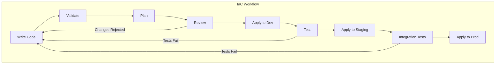

# How to Handle Infrastructure as Code Best Practices

Author: [nawazdhandala](https://www.github.com/nawazdhandala)

Tags: Infrastructure as Code, Terraform, IaC, DevOps, Cloud Infrastructure, Best Practices, AWS

Description: Learn essential Infrastructure as Code best practices including state management, modular design, testing, and security patterns for reliable infrastructure.

---

Infrastructure as Code (IaC) has become the standard for managing cloud resources, but writing maintainable and secure infrastructure code requires following established patterns. Poor IaC practices lead to configuration drift, security vulnerabilities, and deployment failures that are hard to debug.

## IaC Workflow Overview

A well-designed IaC workflow ensures changes are reviewed, tested, and applied consistently across environments.



## State Management Best Practices

State management is the most critical aspect of IaC. Corrupted or lost state can make infrastructure unmanageable.

### Remote State with Locking

Never store state locally. Use remote backends with locking to prevent concurrent modifications:

```hcl
# backend.tf - Remote state configuration with S3 and DynamoDB locking
terraform {
  required_version = ">= 1.5.0"

  backend "s3" {
    bucket         = "mycompany-terraform-state"
    key            = "production/networking/terraform.tfstate"
    region         = "us-east-1"

    # Enable encryption at rest
    encrypt        = true

    # DynamoDB table for state locking - prevents concurrent modifications
    dynamodb_table = "terraform-state-locks"

    # Use AWS SSO or IAM roles instead of hardcoded credentials
    # The role must have s3:GetObject, s3:PutObject, dynamodb:GetItem, dynamodb:PutItem
  }
}

# Create the locking table (run this once, separately)
resource "aws_dynamodb_table" "terraform_locks" {
  name         = "terraform-state-locks"
  billing_mode = "PAY_PER_REQUEST"
  hash_key     = "LockID"

  attribute {
    name = "LockID"
    type = "S"
  }

  tags = {
    Purpose = "Terraform state locking"
  }
}
```

### State File Organization

Organize state files by environment and component to limit blast radius:

```
terraform-state-bucket/
    production/
        networking/terraform.tfstate    # VPC, subnets, security groups
        compute/terraform.tfstate       # EC2, ECS, Lambda
        database/terraform.tfstate      # RDS, ElastiCache
        monitoring/terraform.tfstate    # CloudWatch, alerts
    staging/
        networking/terraform.tfstate
        compute/terraform.tfstate
        ...
    shared/
        iam/terraform.tfstate           # IAM roles and policies
        dns/terraform.tfstate           # Route53 hosted zones
```

## Modular Design Patterns

Well-structured modules improve reusability and reduce duplication across projects.

### Module Structure

Create self-contained modules with clear inputs and outputs:

```hcl
# modules/vpc/main.tf
# A reusable VPC module with sensible defaults

variable "name" {
  description = "Name prefix for all resources"
  type        = string
}

variable "cidr_block" {
  description = "CIDR block for the VPC"
  type        = string
  default     = "10.0.0.0/16"
}

variable "availability_zones" {
  description = "List of availability zones"
  type        = list(string)
}

variable "enable_nat_gateway" {
  description = "Enable NAT gateway for private subnets"
  type        = bool
  default     = true
}

variable "tags" {
  description = "Tags to apply to all resources"
  type        = map(string)
  default     = {}
}

locals {
  # Calculate subnet CIDRs automatically
  public_subnet_cidrs  = [for i, az in var.availability_zones : cidrsubnet(var.cidr_block, 8, i)]
  private_subnet_cidrs = [for i, az in var.availability_zones : cidrsubnet(var.cidr_block, 8, i + 100)]

  common_tags = merge(var.tags, {
    ManagedBy = "terraform"
    Module    = "vpc"
  })
}

resource "aws_vpc" "main" {
  cidr_block           = var.cidr_block
  enable_dns_hostnames = true
  enable_dns_support   = true

  tags = merge(local.common_tags, {
    Name = "${var.name}-vpc"
  })
}

resource "aws_subnet" "public" {
  count = length(var.availability_zones)

  vpc_id                  = aws_vpc.main.id
  cidr_block              = local.public_subnet_cidrs[count.index]
  availability_zone       = var.availability_zones[count.index]
  map_public_ip_on_launch = true

  tags = merge(local.common_tags, {
    Name = "${var.name}-public-${var.availability_zones[count.index]}"
    Tier = "public"
  })
}

resource "aws_subnet" "private" {
  count = length(var.availability_zones)

  vpc_id            = aws_vpc.main.id
  cidr_block        = local.private_subnet_cidrs[count.index]
  availability_zone = var.availability_zones[count.index]

  tags = merge(local.common_tags, {
    Name = "${var.name}-private-${var.availability_zones[count.index]}"
    Tier = "private"
  })
}

# Outputs for use by other modules
output "vpc_id" {
  description = "ID of the created VPC"
  value       = aws_vpc.main.id
}

output "public_subnet_ids" {
  description = "IDs of public subnets"
  value       = aws_subnet.public[*].id
}

output "private_subnet_ids" {
  description = "IDs of private subnets"
  value       = aws_subnet.private[*].id
}
```

### Using Modules with Environment-Specific Values

Reference modules with environment-specific configurations:

```hcl
# environments/production/main.tf
module "vpc" {
  source = "../../modules/vpc"

  name               = "prod"
  cidr_block         = "10.0.0.0/16"
  availability_zones = ["us-east-1a", "us-east-1b", "us-east-1c"]
  enable_nat_gateway = true

  tags = {
    Environment = "production"
    CostCenter  = "engineering"
  }
}

module "eks_cluster" {
  source = "../../modules/eks"

  cluster_name   = "prod-cluster"
  vpc_id         = module.vpc.vpc_id
  subnet_ids     = module.vpc.private_subnet_ids

  node_groups = {
    general = {
      instance_types = ["m5.large"]
      min_size       = 3
      max_size       = 10
      desired_size   = 5
    }
  }

  tags = {
    Environment = "production"
  }
}
```

## Security Best Practices

Security should be built into your IaC from the start, not added as an afterthought.

### Secrets Management

Never store secrets in Terraform code or state. Use secret management services:

```hcl
# Reference secrets from AWS Secrets Manager
data "aws_secretsmanager_secret_version" "db_credentials" {
  secret_id = "production/database/credentials"
}

locals {
  db_credentials = jsondecode(data.aws_secretsmanager_secret_version.db_credentials.secret_string)
}

resource "aws_db_instance" "main" {
  identifier     = "production-db"
  engine         = "postgres"
  engine_version = "15.4"
  instance_class = "db.r5.large"

  # Reference secrets - not stored in state as plaintext
  username = local.db_credentials["username"]
  password = local.db_credentials["password"]

  # Security configurations
  storage_encrypted   = true
  deletion_protection = true

  vpc_security_group_ids = [aws_security_group.database.id]
  db_subnet_group_name   = aws_db_subnet_group.main.name
}
```

### Security Group Rules

Define security groups with explicit, minimal permissions:

```hcl
# modules/security-groups/web.tf
resource "aws_security_group" "web" {
  name        = "${var.name}-web-sg"
  description = "Security group for web servers"
  vpc_id      = var.vpc_id

  # Explicit ingress rules - no 0.0.0.0/0 for sensitive ports
  ingress {
    description = "HTTPS from load balancer"
    from_port   = 443
    to_port     = 443
    protocol    = "tcp"
    # Only allow traffic from the load balancer security group
    security_groups = [aws_security_group.alb.id]
  }

  ingress {
    description = "HTTP from load balancer (redirect only)"
    from_port   = 80
    to_port     = 80
    protocol    = "tcp"
    security_groups = [aws_security_group.alb.id]
  }

  # Explicit egress rules - avoid allow-all
  egress {
    description = "HTTPS to internet (API calls, package downloads)"
    from_port   = 443
    to_port     = 443
    protocol    = "tcp"
    cidr_blocks = ["0.0.0.0/0"]
  }

  egress {
    description = "Database access"
    from_port   = 5432
    to_port     = 5432
    protocol    = "tcp"
    security_groups = [aws_security_group.database.id]
  }

  tags = var.tags
}
```

## Testing Infrastructure Code

Test your IaC before applying to production. Catching errors early prevents outages.

### Static Analysis with tflint

Run linting on every pull request:

```yaml
# .github/workflows/terraform.yml
name: Terraform Validation

on:
  pull_request:
    paths:
      - 'terraform/**'

jobs:
  validate:
    runs-on: ubuntu-latest
    steps:
      - uses: actions/checkout@v4

      - name: Setup Terraform
        uses: hashicorp/setup-terraform@v3
        with:
          terraform_version: 1.6.0

      - name: Setup TFLint
        uses: terraform-linters/setup-tflint@v4

      - name: Terraform Format Check
        run: terraform fmt -check -recursive terraform/

      - name: Terraform Init
        run: terraform init -backend=false
        working-directory: terraform/

      - name: Terraform Validate
        run: terraform validate
        working-directory: terraform/

      - name: TFLint
        run: |
          tflint --init
          tflint --recursive
        working-directory: terraform/
```

### Security Scanning

Scan for security misconfigurations:

```yaml
# Add to the workflow above
      - name: Run Checkov
        uses: bridgecrewio/checkov-action@v12
        with:
          directory: terraform/
          framework: terraform
          output_format: sarif
          # Skip specific checks if needed (document why)
          skip_check: CKV_AWS_144  # S3 cross-region replication not needed
```

### Plan Review Automation

Automatically comment Terraform plans on pull requests:

```yaml
  plan:
    runs-on: ubuntu-latest
    needs: validate
    steps:
      - uses: actions/checkout@v4

      - name: Setup Terraform
        uses: hashicorp/setup-terraform@v3

      - name: Terraform Init
        run: terraform init
        working-directory: terraform/environments/staging

      - name: Terraform Plan
        id: plan
        run: terraform plan -no-color -out=tfplan
        working-directory: terraform/environments/staging
        continue-on-error: true

      - name: Comment Plan on PR
        uses: actions/github-script@v7
        with:
          script: |
            const output = `#### Terraform Plan
            \`\`\`
            ${{ steps.plan.outputs.stdout }}
            \`\`\`
            `;
            github.rest.issues.createComment({
              issue_number: context.issue.number,
              owner: context.repo.owner,
              repo: context.repo.repo,
              body: output
            })
```

## Version Pinning and Upgrades

Pin versions to prevent unexpected changes, but have a process for updates.

```hcl
# versions.tf
terraform {
  required_version = "~> 1.6.0"  # Allow patch updates only

  required_providers {
    aws = {
      source  = "hashicorp/aws"
      version = "~> 5.30.0"  # Pin to minor version
    }
    kubernetes = {
      source  = "hashicorp/kubernetes"
      version = "~> 2.24.0"
    }
  }
}

# Use .terraform.lock.hcl for exact versions
# Commit this file to version control
```

## Documentation and Naming Conventions

Consistent naming makes infrastructure easier to understand and manage:

```hcl
# variables.tf with documentation
variable "environment" {
  description = "Environment name (dev, staging, production)"
  type        = string

  validation {
    condition     = contains(["dev", "staging", "production"], var.environment)
    error_message = "Environment must be dev, staging, or production."
  }
}

# Naming convention: {project}-{environment}-{component}-{resource}
locals {
  name_prefix = "${var.project}-${var.environment}"

  # Standard tags for all resources
  default_tags = {
    Project     = var.project
    Environment = var.environment
    ManagedBy   = "terraform"
    Repository  = "github.com/mycompany/infrastructure"
  }
}

resource "aws_s3_bucket" "logs" {
  bucket = "${local.name_prefix}-application-logs"
  tags   = local.default_tags
}
```

## Summary

Following IaC best practices ensures your infrastructure remains maintainable, secure, and reliable as it grows. Key takeaways:

1. Always use remote state with locking to prevent corruption
2. Organize state by environment and component to limit blast radius
3. Build reusable modules with clear interfaces
4. Never store secrets in code - use secret management services
5. Test infrastructure changes with linting, security scans, and plan reviews
6. Pin versions and document your naming conventions

Infrastructure as Code is only as good as the practices around it. Invest time in setting up proper workflows and your future self will thank you.
