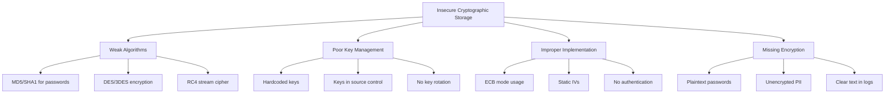

# How to Fix 'Insecure Cryptographic Storage'

Author: [nawazdhandala](https://www.github.com/nawazdhandala)

Tags: Security, Cryptography, Encryption, Data Protection, OWASP, Key Management

Description: Learn how to identify and fix insecure cryptographic storage vulnerabilities to properly protect sensitive data at rest.

---

Insecure cryptographic storage occurs when applications fail to properly encrypt sensitive data or use weak cryptographic practices. This vulnerability can expose passwords, credit card numbers, personal information, and other sensitive data to attackers. This guide covers common cryptographic mistakes and how to fix them with modern, secure implementations.

## Understanding Cryptographic Storage Vulnerabilities

Cryptographic storage problems fall into several categories:



## Common Vulnerabilities and Fixes

### Vulnerability 1: Weak Password Hashing

Using fast hashing algorithms like MD5 or SHA-1 for passwords allows attackers to crack them quickly using rainbow tables or brute force.

```javascript
// VULNERABLE: MD5 is fast and broken for password storage
const crypto = require('crypto');

function hashPasswordInsecure(password) {
    // MD5 can be cracked at billions of hashes per second
    return crypto.createHash('md5').update(password).digest('hex');
}

// VULNERABLE: SHA-256 without salt is still weak
function hashPasswordStillInsecure(password) {
    // Fast hash + no salt = vulnerable to rainbow tables
    return crypto.createHash('sha256').update(password).digest('hex');
}
```

**Secure Fix: Use bcrypt, scrypt, or Argon2**

```javascript
// SECURE: Using bcrypt with appropriate cost factor
const bcrypt = require('bcrypt');

// Cost factor of 12 takes about 250ms per hash
// This makes brute force attacks impractical
const BCRYPT_COST = 12;

async function hashPassword(password) {
    // bcrypt automatically generates a unique salt for each password
    // The salt is stored as part of the hash output
    const hash = await bcrypt.hash(password, BCRYPT_COST);
    return hash;
}

async function verifyPassword(password, storedHash) {
    // bcrypt.compare is timing-safe, preventing timing attacks
    const isValid = await bcrypt.compare(password, storedHash);
    return isValid;
}

// Alternative: Argon2 (winner of Password Hashing Competition)
const argon2 = require('argon2');

async function hashPasswordArgon2(password) {
    // Argon2id is recommended for password hashing
    // It provides resistance against both GPU and side-channel attacks
    const hash = await argon2.hash(password, {
        type: argon2.argon2id,
        memoryCost: 65536,    // 64 MB memory usage
        timeCost: 3,          // 3 iterations
        parallelism: 4        // 4 parallel threads
    });
    return hash;
}
```

### Vulnerability 2: Using ECB Mode for Encryption

Electronic Codebook (ECB) mode encrypts identical plaintext blocks to identical ciphertext blocks, revealing patterns in the data.

```python
# VULNERABLE: ECB mode reveals patterns in encrypted data
from Crypto.Cipher import AES
import os

def encrypt_ecb_insecure(key, plaintext):
    # ECB mode is a security risk
    # Identical plaintext blocks produce identical ciphertext blocks
    cipher = AES.new(key, AES.MODE_ECB)

    # Pad to block size
    padded = plaintext + b'\x00' * (16 - len(plaintext) % 16)

    return cipher.encrypt(padded)
```

**Secure Fix: Use GCM or CBC with HMAC**

```python
# SECURE: Using AES-GCM (Authenticated Encryption)
from Crypto.Cipher import AES
from Crypto.Random import get_random_bytes
import base64
import json

def encrypt_aes_gcm(key, plaintext):
    """
    Encrypt data using AES-256-GCM.
    GCM provides both confidentiality and integrity.
    """
    # Generate a unique nonce for each encryption
    # Never reuse a nonce with the same key
    nonce = get_random_bytes(12)

    # Create cipher with GCM mode
    cipher = AES.new(key, AES.MODE_GCM, nonce=nonce)

    # Encrypt and get authentication tag
    ciphertext, tag = cipher.encrypt_and_digest(plaintext.encode('utf-8'))

    # Return all components needed for decryption
    return {
        'ciphertext': base64.b64encode(ciphertext).decode('utf-8'),
        'nonce': base64.b64encode(nonce).decode('utf-8'),
        'tag': base64.b64encode(tag).decode('utf-8')
    }

def decrypt_aes_gcm(key, encrypted_data):
    """
    Decrypt data encrypted with AES-256-GCM.
    Verifies integrity before returning plaintext.
    """
    # Decode components
    ciphertext = base64.b64decode(encrypted_data['ciphertext'])
    nonce = base64.b64decode(encrypted_data['nonce'])
    tag = base64.b64decode(encrypted_data['tag'])

    # Create cipher for decryption
    cipher = AES.new(key, AES.MODE_GCM, nonce=nonce)

    # Decrypt and verify authenticity
    # This will raise an exception if the data was tampered with
    plaintext = cipher.decrypt_and_verify(ciphertext, tag)

    return plaintext.decode('utf-8')

# Example usage
if __name__ == '__main__':
    # Key must be exactly 32 bytes for AES-256
    key = get_random_bytes(32)

    sensitive_data = "Credit Card: 4111-1111-1111-1111"

    encrypted = encrypt_aes_gcm(key, sensitive_data)
    print(f"Encrypted: {json.dumps(encrypted, indent=2)}")

    decrypted = decrypt_aes_gcm(key, encrypted)
    print(f"Decrypted: {decrypted}")
```

### Vulnerability 3: Hardcoded Encryption Keys

Keys stored in source code can be extracted from compiled binaries, version control history, or client-side JavaScript.

```java
// VULNERABLE: Hardcoded encryption key
public class InsecureEncryption {
    // This key will be visible in:
    // - Source control history (forever)
    // - Compiled bytecode (easily extracted)
    // - Memory dumps
    private static final String SECRET_KEY = "MySecretKey12345";

    public byte[] encrypt(String data) {
        SecretKeySpec key = new SecretKeySpec(SECRET_KEY.getBytes(), "AES");
        // ... encryption logic
    }
}
```

**Secure Fix: Use Environment Variables or Key Management Service**

```java
// SECURE: Key loaded from environment or KMS
import software.amazon.awssdk.services.kms.KmsClient;
import software.amazon.awssdk.services.kms.model.*;
import javax.crypto.Cipher;
import javax.crypto.spec.GCMParameterSpec;
import javax.crypto.spec.SecretKeySpec;
import java.security.SecureRandom;
import java.util.Base64;

public class SecureEncryption {

    private final KmsClient kmsClient;
    private final String kmsKeyId;

    public SecureEncryption() {
        // Initialize KMS client
        this.kmsClient = KmsClient.create();

        // Key ID from environment variable
        this.kmsKeyId = System.getenv("KMS_KEY_ID");

        if (kmsKeyId == null || kmsKeyId.isEmpty()) {
            throw new IllegalStateException("KMS_KEY_ID environment variable not set");
        }
    }

    /**
     * Generate a data encryption key from KMS.
     * Uses envelope encryption for efficiency.
     */
    public DataKey generateDataKey() {
        GenerateDataKeyRequest request = GenerateDataKeyRequest.builder()
            .keyId(kmsKeyId)
            .keySpec(DataKeySpec.AES_256)
            .build();

        GenerateDataKeyResponse response = kmsClient.generateDataKey(request);

        return new DataKey(
            response.plaintext().asByteArray(),      // Use for encryption
            response.ciphertextBlob().asByteArray()  // Store alongside encrypted data
        );
    }

    /**
     * Encrypt data using envelope encryption.
     * The data key is encrypted by KMS and stored with the ciphertext.
     */
    public EncryptedData encrypt(byte[] plaintext) throws Exception {
        // Generate a new data key for this encryption
        DataKey dataKey = generateDataKey();

        // Generate random IV
        byte[] iv = new byte[12];
        new SecureRandom().nextBytes(iv);

        // Encrypt with the plaintext data key
        Cipher cipher = Cipher.getInstance("AES/GCM/NoPadding");
        SecretKeySpec keySpec = new SecretKeySpec(dataKey.getPlaintextKey(), "AES");
        GCMParameterSpec gcmSpec = new GCMParameterSpec(128, iv);

        cipher.init(Cipher.ENCRYPT_MODE, keySpec, gcmSpec);
        byte[] ciphertext = cipher.doFinal(plaintext);

        // Clear the plaintext key from memory
        dataKey.clearPlaintextKey();

        return new EncryptedData(
            ciphertext,
            iv,
            dataKey.getEncryptedKey()  // Store encrypted key with data
        );
    }

    /**
     * Decrypt data using envelope encryption.
     * First decrypts the data key via KMS, then decrypts the data.
     */
    public byte[] decrypt(EncryptedData encryptedData) throws Exception {
        // Decrypt the data key using KMS
        DecryptRequest request = DecryptRequest.builder()
            .keyId(kmsKeyId)
            .ciphertextBlob(software.amazon.awssdk.core.SdkBytes
                .fromByteArray(encryptedData.getEncryptedKey()))
            .build();

        DecryptResponse response = kmsClient.decrypt(request);
        byte[] plaintextKey = response.plaintext().asByteArray();

        // Decrypt the data
        Cipher cipher = Cipher.getInstance("AES/GCM/NoPadding");
        SecretKeySpec keySpec = new SecretKeySpec(plaintextKey, "AES");
        GCMParameterSpec gcmSpec = new GCMParameterSpec(128, encryptedData.getIv());

        cipher.init(Cipher.DECRYPT_MODE, keySpec, gcmSpec);
        byte[] plaintext = cipher.doFinal(encryptedData.getCiphertext());

        // Clear the key from memory
        java.util.Arrays.fill(plaintextKey, (byte) 0);

        return plaintext;
    }
}
```

### Vulnerability 4: Sensitive Data in Logs

Logging sensitive data exposes it to anyone with log access.

```javascript
// VULNERABLE: Logging sensitive information
function processPayment(cardNumber, cvv, amount) {
    // These logs will contain credit card data
    console.log(`Processing payment: card=${cardNumber}, cvv=${cvv}, amount=${amount}`);

    // Credit card data in error logs
    try {
        chargeCard(cardNumber, cvv, amount);
    } catch (error) {
        console.error(`Payment failed for card ${cardNumber}: ${error.message}`);
    }
}
```

**Secure Fix: Implement Data Masking**

```javascript
// SECURE: Mask sensitive data before logging
const sensitivePatterns = {
    creditCard: /\b\d{13,19}\b/g,
    ssn: /\b\d{3}-?\d{2}-?\d{4}\b/g,
    email: /\b[A-Za-z0-9._%+-]+@[A-Za-z0-9.-]+\.[A-Z|a-z]{2,}\b/g,
    phone: /\b\d{3}[-.]?\d{3}[-.]?\d{4}\b/g
};

function maskSensitiveData(data) {
    if (typeof data !== 'string') {
        data = JSON.stringify(data);
    }

    let masked = data;

    // Mask credit card numbers, keeping last 4 digits
    masked = masked.replace(sensitivePatterns.creditCard, (match) => {
        const lastFour = match.slice(-4);
        return '*'.repeat(match.length - 4) + lastFour;
    });

    // Mask SSNs completely
    masked = masked.replace(sensitivePatterns.ssn, '***-**-****');

    // Mask email addresses, keeping first character and domain
    masked = masked.replace(sensitivePatterns.email, (match) => {
        const [local, domain] = match.split('@');
        return local[0] + '*'.repeat(local.length - 1) + '@' + domain;
    });

    return masked;
}

// Create a secure logger wrapper
class SecureLogger {
    constructor(logger) {
        this.logger = logger;
    }

    log(level, message, metadata = {}) {
        const maskedMessage = maskSensitiveData(message);
        const maskedMetadata = JSON.parse(maskSensitiveData(JSON.stringify(metadata)));

        this.logger[level](maskedMessage, maskedMetadata);
    }

    info(message, metadata) { this.log('info', message, metadata); }
    warn(message, metadata) { this.log('warn', message, metadata); }
    error(message, metadata) { this.log('error', message, metadata); }
}

// Usage
const winston = require('winston');
const baseLogger = winston.createLogger({ /* config */ });
const logger = new SecureLogger(baseLogger);

function processPayment(cardNumber, cvv, amount) {
    // Logs will show: Processing payment for card ************1234
    logger.info(`Processing payment for card ${cardNumber}`, { amount });

    try {
        chargeCard(cardNumber, cvv, amount);
    } catch (error) {
        // Sensitive data is automatically masked
        logger.error(`Payment failed`, { cardNumber, error: error.message });
    }
}
```

## Key Rotation Strategy

Implement automated key rotation to limit the impact of key compromise.

```python
# key_rotation.py
# Automated encryption key rotation system

from datetime import datetime, timedelta
from dataclasses import dataclass
from typing import Optional
import json
import boto3

@dataclass
class EncryptionKey:
    key_id: str
    version: int
    created_at: datetime
    expires_at: datetime
    status: str  # 'active', 'rotating', 'retired'

class KeyRotationManager:
    def __init__(self, kms_client, key_alias: str, rotation_days: int = 90):
        self.kms = kms_client
        self.key_alias = key_alias
        self.rotation_days = rotation_days

    def should_rotate(self) -> bool:
        """Check if the current key needs rotation."""
        key_metadata = self.kms.describe_key(KeyId=self.key_alias)
        creation_date = key_metadata['KeyMetadata']['CreationDate']

        age_days = (datetime.now(creation_date.tzinfo) - creation_date).days
        return age_days >= self.rotation_days

    def rotate_key(self) -> dict:
        """
        Perform key rotation.
        KMS handles this automatically, but we track it for auditing.
        """
        # Enable automatic rotation if not already enabled
        self.kms.enable_key_rotation(KeyId=self.key_alias)

        # Get current key info for logging
        key_info = self.kms.describe_key(KeyId=self.key_alias)

        rotation_record = {
            'key_id': key_info['KeyMetadata']['KeyId'],
            'rotated_at': datetime.now().isoformat(),
            'rotation_triggered_by': 'scheduled',
            'next_rotation': (datetime.now() + timedelta(days=self.rotation_days)).isoformat()
        }

        # Log rotation event for audit
        print(f"Key rotation completed: {json.dumps(rotation_record)}")

        return rotation_record

    def re_encrypt_data(self, encrypted_data: bytes) -> bytes:
        """
        Re-encrypt data with the current key version.
        Use during key rotation to update old ciphertexts.
        """
        # KMS can re-encrypt without exposing plaintext
        response = self.kms.re_encrypt(
            CiphertextBlob=encrypted_data,
            DestinationKeyId=self.key_alias
        )

        return response['CiphertextBlob']

# Scheduled rotation job
def rotation_job():
    """Run this as a scheduled task (cron, CloudWatch Events, etc.)"""
    kms = boto3.client('kms')
    manager = KeyRotationManager(kms, 'alias/my-encryption-key')

    if manager.should_rotate():
        manager.rotate_key()
```

## Cryptographic Best Practices Summary

| Use Case | Recommended Algorithm | Key Size | Notes |
|----------|----------------------|----------|-------|
| Password hashing | Argon2id, bcrypt, scrypt | N/A | Use high work factors |
| Symmetric encryption | AES-GCM | 256-bit | Always use unique IVs |
| Asymmetric encryption | RSA-OAEP | 2048+ bit | 4096-bit for long-term |
| Digital signatures | Ed25519, ECDSA | 256-bit | Ed25519 preferred |
| Key derivation | HKDF, PBKDF2 | 256-bit | High iteration count |
| Random generation | CSPRNG | N/A | Never use Math.random() |

Insecure cryptographic storage is a critical vulnerability that requires attention at multiple levels: algorithm selection, key management, and implementation details. Use established cryptographic libraries rather than implementing algorithms yourself, and always have security experts review your cryptographic code.
