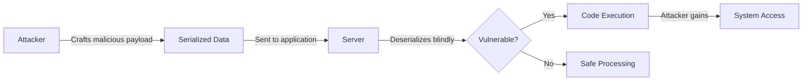
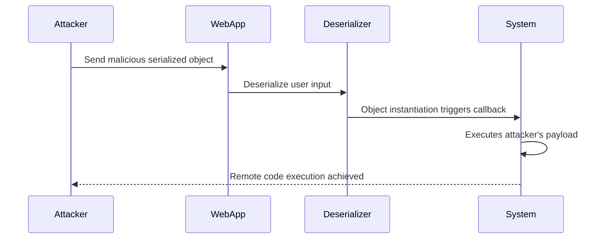
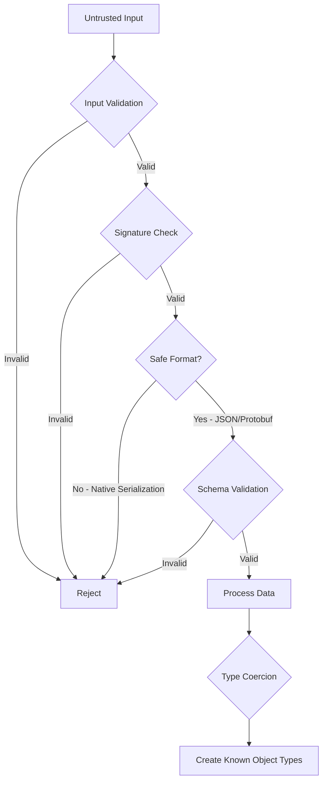

# How to Fix "Insecure Deserialization" Vulnerabilities

Author: [nawazdhandala](https://github.com/nawazdhandala)

Tags: Security, Vulnerabilities, OWASP, DevOps, Backend

Description: Learn how to identify and fix insecure deserialization vulnerabilities in your applications with practical examples across multiple languages.

---

Insecure deserialization is one of the OWASP Top 10 vulnerabilities that can lead to remote code execution, injection attacks, and privilege escalation. This guide explains how deserialization attacks work and provides concrete fixes for multiple programming languages.

## Understanding Deserialization Vulnerabilities

Serialization converts objects into a format for storage or transmission. Deserialization reverses this process. The vulnerability occurs when an application deserializes untrusted data without proper validation, allowing attackers to manipulate the serialized data to execute malicious code.



## The Attack Vector

When an application deserializes data, it reconstructs objects in memory. If the serialized data contains instructions to instantiate dangerous classes or execute callbacks, the application will blindly execute them.



## Vulnerable Code Examples

### Python - Pickle Vulnerability

Python's `pickle` module is notoriously dangerous when used with untrusted data.

```python
import pickle
import base64

# VULNERABLE: Never unpickle untrusted data!
# An attacker can craft a payload that executes arbitrary code

def vulnerable_load_session(session_cookie):
    # Decodes and unpickles user-controlled data
    data = base64.b64decode(session_cookie)
    return pickle.loads(data)  # DANGER: Remote code execution possible!

# How an attacker creates a malicious payload
class MaliciousPayload:
    def __reduce__(self):
        import os
        # This code will execute when unpickled
        return (os.system, ('rm -rf / --no-preserve-root',))

# Attacker generates the payload
malicious_data = base64.b64encode(pickle.dumps(MaliciousPayload()))
# When the server unpickles this, it executes the command
```

### JavaScript - Prototype Pollution via JSON

While JSON.parse is generally safe, libraries that extend JSON handling can be vulnerable.

```javascript
// VULNERABLE: Using eval or Function to deserialize
// Never use eval() to parse data!

function vulnerableDeserialize(data) {
  // DANGER: Executes any JavaScript in the data string
  return eval('(' + data + ')');
}

// Attacker sends:
const maliciousInput = `{
  "name": "test",
  "toString": function() {
    require('child_process').exec('cat /etc/passwd');
    return "hacked";
  }
}`;

// The eval() will execute the malicious function
```

### Java - ObjectInputStream Vulnerability

Java's native serialization is a common attack vector in enterprise applications.

```java
// VULNERABLE: Deserializing untrusted ObjectInputStream
import java.io.*;

public class VulnerableService {
    // DANGER: Deserializes any object from untrusted source
    public Object deserialize(byte[] data) throws Exception {
        ByteArrayInputStream bis = new ByteArrayInputStream(data);
        ObjectInputStream ois = new ObjectInputStream(bis);

        // This will instantiate ANY serializable class
        // Attackers use "gadget chains" to achieve code execution
        return ois.readObject();  // VULNERABLE!
    }
}
```

### PHP - unserialize Vulnerability

PHP's unserialize function with untrusted data can trigger magic methods.

```php
// VULNERABLE: unserialize with user input
class User {
    public $name;
    public $isAdmin = false;

    // Magic method called during deserialization
    public function __wakeup() {
        // Attacker can manipulate object state
        if ($this->isAdmin) {
            $this->grantAdminAccess();
        }
    }
}

// Attacker crafts serialized data with isAdmin = true
$malicious = 'O:4:"User":2:{s:4:"name";s:7:"attacker";s:7:"isAdmin";b:1;}';

// DANGER: Deserializes with admin privileges
$user = unserialize($_COOKIE['user']);  // VULNERABLE!
```

## Secure Solutions

### Python - Use JSON Instead of Pickle

```python
import json
import hmac
import hashlib
from dataclasses import dataclass, asdict

# Define data structures explicitly
@dataclass
class UserSession:
    user_id: int
    username: str
    roles: list
    created_at: str

# SECURE: Use JSON with HMAC signature verification
SECRET_KEY = b'your-secret-key-from-env'

def secure_serialize(session: UserSession) -> str:
    """Serialize session data with HMAC signature"""
    # Convert to JSON (safe format, no code execution)
    data = json.dumps(asdict(session))

    # Create HMAC signature to detect tampering
    signature = hmac.new(
        SECRET_KEY,
        data.encode(),
        hashlib.sha256
    ).hexdigest()

    # Return data with signature
    return f"{data}.{signature}"

def secure_deserialize(signed_data: str) -> UserSession:
    """Deserialize session data with signature verification"""
    try:
        # Split data and signature
        data, provided_signature = signed_data.rsplit('.', 1)

        # Verify HMAC signature (timing-safe comparison)
        expected_signature = hmac.new(
            SECRET_KEY,
            data.encode(),
            hashlib.sha256
        ).hexdigest()

        if not hmac.compare_digest(provided_signature, expected_signature):
            raise ValueError("Invalid signature - data may be tampered")

        # Parse JSON (safe - no code execution)
        parsed = json.loads(data)

        # Validate structure and types explicitly
        return UserSession(
            user_id=int(parsed['user_id']),
            username=str(parsed['username']),
            roles=list(parsed['roles']),
            created_at=str(parsed['created_at'])
        )
    except (KeyError, ValueError, TypeError) as e:
        raise ValueError(f"Invalid session data: {e}")
```

### JavaScript - Safe JSON Handling

```javascript
// SECURE: Use JSON.parse with validation

// Define a schema for expected data
const Joi = require('joi');

// Schema defines exactly what structure we expect
const userSchema = Joi.object({
  id: Joi.number().integer().required(),
  username: Joi.string().alphanum().min(3).max(30).required(),
  email: Joi.string().email().required(),
  roles: Joi.array().items(Joi.string()).default([]),
  createdAt: Joi.date().iso()
});

function safeDeserialize(jsonString) {
  // Step 1: Parse JSON (safe - no code execution)
  let parsed;
  try {
    parsed = JSON.parse(jsonString);
  } catch (e) {
    throw new Error('Invalid JSON format');
  }

  // Step 2: Validate against schema
  const { error, value } = userSchema.validate(parsed, {
    stripUnknown: true,  // Remove unexpected fields
    convert: true        // Convert types where safe
  });

  if (error) {
    throw new Error(`Validation failed: ${error.message}`);
  }

  // Step 3: Return validated, sanitized object
  return value;
}

// For signed data (like JWTs or cookies)
const crypto = require('crypto');

function signData(data, secret) {
  const json = JSON.stringify(data);
  const signature = crypto
    .createHmac('sha256', secret)
    .update(json)
    .digest('hex');

  return `${Buffer.from(json).toString('base64')}.${signature}`;
}

function verifyAndParse(signedData, secret) {
  const [encodedData, signature] = signedData.split('.');

  const json = Buffer.from(encodedData, 'base64').toString();

  // Verify signature with timing-safe comparison
  const expectedSignature = crypto
    .createHmac('sha256', secret)
    .update(json)
    .digest('hex');

  if (!crypto.timingSafeEqual(
    Buffer.from(signature),
    Buffer.from(expectedSignature)
  )) {
    throw new Error('Invalid signature');
  }

  return JSON.parse(json);
}
```

### Java - Use Safe Serialization Libraries

```java
// SECURE: Use Jackson with type validation

import com.fasterxml.jackson.databind.ObjectMapper;
import com.fasterxml.jackson.databind.jsontype.BasicPolymorphicTypeValidator;

public class SecureDeserializer {
    private final ObjectMapper mapper;

    public SecureDeserializer() {
        this.mapper = new ObjectMapper();

        // Configure allowed types for polymorphic deserialization
        BasicPolymorphicTypeValidator validator = BasicPolymorphicTypeValidator.builder()
            .allowIfBaseType(UserData.class)  // Only allow specific base types
            .allowIfSubType("com.myapp.models")  // Only from trusted packages
            .build();

        mapper.activateDefaultTyping(validator);

        // Disable dangerous features
        mapper.configure(
            com.fasterxml.jackson.databind.DeserializationFeature.FAIL_ON_UNKNOWN_PROPERTIES,
            true
        );
    }

    // Deserialize to a specific, expected type
    public <T> T deserialize(String json, Class<T> expectedType) throws Exception {
        // Validates JSON structure matches expected class
        return mapper.readValue(json, expectedType);
    }
}

// Define your data classes explicitly
public class UserData {
    private Long id;
    private String username;
    private List<String> roles;

    // Getters and setters with validation
    public void setId(Long id) {
        if (id == null || id < 0) {
            throw new IllegalArgumentException("Invalid user ID");
        }
        this.id = id;
    }

    public void setUsername(String username) {
        if (username == null || !username.matches("^[a-zA-Z0-9_]{3,30}$")) {
            throw new IllegalArgumentException("Invalid username format");
        }
        this.username = username;
    }
}
```

### PHP - Safe Serialization Alternatives

```php
<?php
// SECURE: Use JSON instead of serialize/unserialize

class SecureSessionHandler {
    private string $secretKey;

    public function __construct(string $secretKey) {
        $this->secretKey = $secretKey;
    }

    // Serialize data as signed JSON
    public function encode(array $data): string {
        // Use JSON encoding (safe, no object instantiation)
        $json = json_encode($data, JSON_THROW_ON_ERROR);

        // Create HMAC signature
        $signature = hash_hmac('sha256', $json, $this->secretKey);

        // Return base64 encoded data with signature
        return base64_encode($json) . '.' . $signature;
    }

    // Deserialize with signature verification
    public function decode(string $signedData): array {
        // Split data and signature
        $parts = explode('.', $signedData);
        if (count($parts) !== 2) {
            throw new InvalidArgumentException('Invalid data format');
        }

        [$encodedData, $providedSignature] = $parts;

        // Decode the data
        $json = base64_decode($encodedData, true);
        if ($json === false) {
            throw new InvalidArgumentException('Invalid base64 encoding');
        }

        // Verify signature (timing-safe comparison)
        $expectedSignature = hash_hmac('sha256', $json, $this->secretKey);
        if (!hash_equals($expectedSignature, $providedSignature)) {
            throw new SecurityException('Invalid signature - data may be tampered');
        }

        // Parse JSON
        $data = json_decode($json, true, 512, JSON_THROW_ON_ERROR);

        // Validate expected structure
        return $this->validateStructure($data);
    }

    private function validateStructure(array $data): array {
        // Define and validate expected fields
        $validated = [];

        if (!isset($data['user_id']) || !is_int($data['user_id'])) {
            throw new InvalidArgumentException('Invalid user_id');
        }
        $validated['user_id'] = $data['user_id'];

        if (!isset($data['username']) || !preg_match('/^[a-zA-Z0-9_]{3,30}$/', $data['username'])) {
            throw new InvalidArgumentException('Invalid username');
        }
        $validated['username'] = $data['username'];

        // Only return validated fields, ignore extras
        return $validated;
    }
}

// Usage
$handler = new SecureSessionHandler($_ENV['SESSION_SECRET']);
$session = $handler->encode(['user_id' => 123, 'username' => 'john_doe']);
$data = $handler->decode($session);
```

## Defense in Depth Strategies



## Additional Security Measures

### 1. Input Validation Layer

```javascript
// Validate before any processing
function validateInput(data) {
  // Check content type
  if (typeof data !== 'string') {
    throw new Error('Expected string input');
  }

  // Check maximum size to prevent DoS
  if (data.length > 1024 * 1024) {  // 1MB limit
    throw new Error('Input too large');
  }

  // Check for suspicious patterns
  const suspiciousPatterns = [
    /\x00/,                          // Null bytes
    /__proto__/i,                    // Prototype pollution
    /constructor/i,                  // Constructor access
    /\beval\b/i,                     // eval attempts
    /\bFunction\b/i,                 // Function constructor
  ];

  for (const pattern of suspiciousPatterns) {
    if (pattern.test(data)) {
      throw new Error('Suspicious input detected');
    }
  }

  return data;
}
```

### 2. Use Protocol Buffers for Type Safety

```javascript
// Protocol Buffers enforce strict typing
// schema.proto
/*
message User {
  int64 id = 1;
  string username = 2;
  repeated string roles = 3;
}
*/

const protobuf = require('protobufjs');

async function setupProtobuf() {
  const root = await protobuf.load('schema.proto');
  const User = root.lookupType('User');

  return {
    encode: (data) => {
      // Verify data matches schema before encoding
      const error = User.verify(data);
      if (error) throw new Error(error);

      const message = User.create(data);
      return User.encode(message).finish();
    },

    decode: (buffer) => {
      // Decode with strict type checking
      const message = User.decode(buffer);
      return User.toObject(message);
    }
  };
}
```

### 3. Content Security Monitoring

```javascript
// Log and monitor deserialization attempts
const logger = require('./logger');

function monitoredDeserialize(data, source) {
  const startTime = Date.now();

  try {
    const result = safeDeserialize(data);

    logger.info('Deserialization success', {
      source,
      size: data.length,
      duration: Date.now() - startTime
    });

    return result;
  } catch (error) {
    logger.warn('Deserialization failed', {
      source,
      error: error.message,
      size: data.length,
      // Don't log the actual data - could be malicious
      dataHash: crypto.createHash('sha256').update(data).digest('hex')
    });

    throw error;
  }
}
```

## Security Checklist

| Action | Description | Priority |
|--------|-------------|----------|
| Avoid native serialization | Never use pickle, ObjectInputStream, unserialize with untrusted data | Critical |
| Use JSON or Protobuf | Safe formats without code execution | Critical |
| Validate signatures | HMAC sign all serialized data | Critical |
| Schema validation | Enforce strict structure and types | High |
| Input size limits | Prevent DoS via large payloads | High |
| Type coercion | Convert to known, safe types | High |
| Allowlist classes | If using polymorphic types, explicitly allow only safe classes | High |
| Monitor failures | Log and alert on deserialization errors | Medium |

Insecure deserialization vulnerabilities can be devastating, but they are preventable. By using safe serialization formats, validating input structure, and signing sensitive data, you can protect your applications from these attacks.
