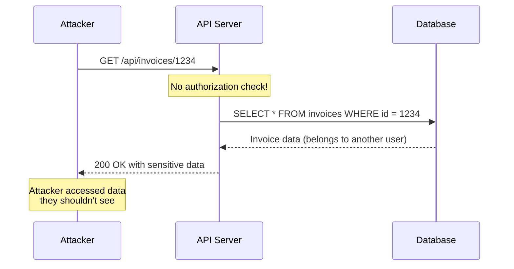

# How to Fix 'Insecure Direct Object References'

Author: [nawazdhandala](https://www.github.com/nawazdhandala)

Tags: Security, IDOR, OWASP, API Security, Web Security, Authorization

Description: Learn how to identify and fix Insecure Direct Object References (IDOR) vulnerabilities that allow attackers to access unauthorized data.

---

Insecure Direct Object References (IDOR) is one of the most common and dangerous web vulnerabilities. It occurs when an application exposes internal object references (like database IDs) without proper authorization checks. An attacker can manipulate these references to access other users' data.

## Understanding IDOR Vulnerabilities

IDOR happens when your application trusts user input to identify resources without verifying the user has permission to access them.



### Common IDOR Patterns

- Sequential IDs: `/api/users/1`, `/api/users/2`, `/api/users/3`
- Predictable filenames: `/uploads/invoice_12345.pdf`
- Query parameters: `/api/orders?user_id=123`
- Hidden form fields: `<input type="hidden" name="account_id" value="456">`

## Vulnerable Code Examples

### Node.js/Express Vulnerable Example

```javascript
// VULNERABLE: No authorization check
app.get('/api/invoices/:id', async (req, res) => {
  const invoiceId = req.params.id;

  // Directly fetches invoice without checking ownership
  const invoice = await Invoice.findById(invoiceId);

  if (!invoice) {
    return res.status(404).json({ error: 'Invoice not found' });
  }

  // Anyone can access any invoice by changing the ID!
  res.json(invoice);
});
```

### Python/Flask Vulnerable Example

```python
# VULNERABLE: No authorization check
@app.route('/api/documents/<int:doc_id>')
def get_document(doc_id):
    # Directly fetches document without checking ownership
    document = Document.query.get(doc_id)

    if not document:
        return jsonify({'error': 'Document not found'}), 404

    # Any authenticated user can access any document!
    return jsonify(document.to_dict())
```

## How to Fix IDOR Vulnerabilities

### Solution 1: Always Verify Resource Ownership

```javascript
// SECURE: Check ownership before returning data
app.get('/api/invoices/:id', authenticate, async (req, res) => {
  const invoiceId = req.params.id;
  const userId = req.user.id;  // From authentication middleware

  const invoice = await Invoice.findById(invoiceId);

  if (!invoice) {
    return res.status(404).json({ error: 'Invoice not found' });
  }

  // Verify the invoice belongs to the requesting user
  if (invoice.userId !== userId) {
    // Return 404 to avoid revealing that the resource exists
    return res.status(404).json({ error: 'Invoice not found' });
  }

  res.json(invoice);
});
```

### Solution 2: Filter Queries by User Context

```javascript
// SECURE: Include user context in the query itself
app.get('/api/invoices/:id', authenticate, async (req, res) => {
  const invoiceId = req.params.id;
  const userId = req.user.id;

  // Query includes user constraint - can never return other users' data
  const invoice = await Invoice.findOne({
    _id: invoiceId,
    userId: userId  // Only returns if user owns this invoice
  });

  if (!invoice) {
    return res.status(404).json({ error: 'Invoice not found' });
  }

  res.json(invoice);
});
```

### Solution 3: Use UUIDs Instead of Sequential IDs

```javascript
const { v4: uuidv4 } = require('uuid');

// Generate UUID when creating resources
const invoice = new Invoice({
  id: uuidv4(),  // e.g., '550e8400-e29b-41d4-a716-446655440000'
  userId: req.user.id,
  amount: req.body.amount
});

// UUIDs are not guessable, but still require authorization checks!
// This is defense in depth, not a replacement for authorization
```

### Solution 4: Implement a Proper Authorization Layer

```javascript
// authorization.js - Reusable authorization middleware
const authorize = (resourceType) => {
  return async (req, res, next) => {
    const resourceId = req.params.id;
    const userId = req.user.id;
    const userRole = req.user.role;

    // Check permissions based on resource type
    const hasAccess = await checkAccess(resourceType, resourceId, userId, userRole);

    if (!hasAccess) {
      return res.status(404).json({ error: 'Resource not found' });
    }

    next();
  };
};

async function checkAccess(resourceType, resourceId, userId, userRole) {
  // Admins can access everything
  if (userRole === 'admin') {
    return true;
  }

  switch (resourceType) {
    case 'invoice':
      const invoice = await Invoice.findById(resourceId);
      return invoice && invoice.userId === userId;

    case 'document':
      const doc = await Document.findById(resourceId);
      // Check ownership or shared access
      return doc && (doc.ownerId === userId || doc.sharedWith.includes(userId));

    case 'order':
      const order = await Order.findById(resourceId);
      return order && order.customerId === userId;

    default:
      return false;
  }
}

// Usage in routes
app.get('/api/invoices/:id', authenticate, authorize('invoice'), getInvoice);
app.get('/api/documents/:id', authenticate, authorize('document'), getDocument);
app.get('/api/orders/:id', authenticate, authorize('order'), getOrder);
```

## Python/Flask Secure Implementation

```python
from functools import wraps
from flask import g, jsonify

def authorize_resource(resource_model, owner_field='user_id'):
    """Decorator to verify resource ownership."""
    def decorator(f):
        @wraps(f)
        def decorated_function(*args, **kwargs):
            resource_id = kwargs.get('id') or kwargs.get('resource_id')

            # Query with ownership constraint
            resource = resource_model.query.filter_by(
                id=resource_id,
                **{owner_field: g.current_user.id}
            ).first()

            if not resource:
                return jsonify({'error': 'Resource not found'}), 404

            # Attach resource to request context
            g.resource = resource
            return f(*args, **kwargs)
        return decorated_function
    return decorator

# Usage
@app.route('/api/invoices/<int:id>')
@require_auth
@authorize_resource(Invoice, owner_field='user_id')
def get_invoice(id):
    # g.resource is already verified to belong to current user
    return jsonify(g.resource.to_dict())

@app.route('/api/invoices/<int:id>', methods=['PUT'])
@require_auth
@authorize_resource(Invoice, owner_field='user_id')
def update_invoice(id):
    invoice = g.resource
    invoice.amount = request.json.get('amount', invoice.amount)
    db.session.commit()
    return jsonify(invoice.to_dict())
```

## Handling Complex Authorization

For resources with shared access or hierarchical permissions:

```javascript
// Complex authorization for shared resources
class DocumentAuthorizer {
  static async canAccess(documentId, userId, action = 'read') {
    const document = await Document.findById(documentId)
      .populate('permissions');

    if (!document) {
      return { allowed: false, reason: 'not_found' };
    }

    // Check if user is owner
    if (document.ownerId.equals(userId)) {
      return { allowed: true };
    }

    // Check explicit permissions
    const permission = document.permissions.find(
      p => p.userId.equals(userId)
    );

    if (!permission) {
      return { allowed: false, reason: 'no_permission' };
    }

    // Check action-specific permissions
    const actionAllowed =
      (action === 'read' && permission.canRead) ||
      (action === 'write' && permission.canWrite) ||
      (action === 'delete' && permission.canDelete);

    return { allowed: actionAllowed, reason: actionAllowed ? null : 'insufficient_permission' };
  }
}

// Usage in route
app.put('/api/documents/:id', authenticate, async (req, res) => {
  const { allowed, reason } = await DocumentAuthorizer.canAccess(
    req.params.id,
    req.user.id,
    'write'
  );

  if (!allowed) {
    return res.status(reason === 'not_found' ? 404 : 403)
      .json({ error: 'Access denied' });
  }

  // Proceed with update
  const document = await Document.findByIdAndUpdate(
    req.params.id,
    req.body,
    { new: true }
  );

  res.json(document);
});
```

## Testing for IDOR Vulnerabilities

### Automated Testing

```javascript
// Jest test for IDOR vulnerability
describe('Invoice API IDOR Protection', () => {
  let user1Token, user2Token, user1Invoice;

  beforeAll(async () => {
    // Create two users
    const user1 = await createUser({ email: 'user1@test.com' });
    const user2 = await createUser({ email: 'user2@test.com' });

    user1Token = generateToken(user1);
    user2Token = generateToken(user2);

    // Create invoice for user1
    user1Invoice = await Invoice.create({
      userId: user1.id,
      amount: 100
    });
  });

  test('user cannot access another users invoice', async () => {
    // User2 tries to access User1's invoice
    const response = await request(app)
      .get(`/api/invoices/${user1Invoice.id}`)
      .set('Authorization', `Bearer ${user2Token}`);

    // Should return 404, not the invoice data
    expect(response.status).toBe(404);
    expect(response.body).not.toHaveProperty('amount');
  });

  test('user can access their own invoice', async () => {
    const response = await request(app)
      .get(`/api/invoices/${user1Invoice.id}`)
      .set('Authorization', `Bearer ${user1Token}`);

    expect(response.status).toBe(200);
    expect(response.body.amount).toBe(100);
  });
});
```

### Manual Testing Checklist

1. Log in as User A and note resource IDs
2. Log in as User B in a different browser
3. Try accessing User A's resources using User B's session
4. Test all CRUD operations (GET, POST, PUT, DELETE)
5. Check API documentation for hidden endpoints
6. Test bulk operations and export features

## Common Mistakes to Avoid

```javascript
// MISTAKE 1: Checking authorization after fetching sensitive data
app.get('/api/invoices/:id', async (req, res) => {
  const invoice = await Invoice.findById(req.params.id);

  // Data already fetched and could be logged or leaked
  if (invoice.userId !== req.user.id) {
    return res.status(403).json({ error: 'Forbidden' });
  }
  // ...
});

// MISTAKE 2: Trusting client-side data
app.put('/api/invoices/:id', async (req, res) => {
  // Attacker can modify userId in request body
  await Invoice.findByIdAndUpdate(req.params.id, {
    amount: req.body.amount,
    userId: req.body.userId  // Never trust this!
  });
});

// MISTAKE 3: Information disclosure through error messages
if (invoice.userId !== req.user.id) {
  // Reveals that the invoice exists
  return res.status(403).json({ error: 'You do not own this invoice' });
}
```

## Security Best Practices Summary

1. **Always verify authorization** - Check resource ownership on every request
2. **Filter at the query level** - Include user context in database queries
3. **Use 404 for unauthorized access** - Do not reveal resource existence
4. **Implement defense in depth** - Use UUIDs plus authorization checks
5. **Centralize authorization logic** - Create reusable middleware
6. **Test explicitly for IDOR** - Include authorization tests in your suite
7. **Audit sensitive endpoints** - Review all endpoints that return user data

---

IDOR vulnerabilities are straightforward to fix but easy to miss during development. Make authorization checks a habit, test for IDOR explicitly, and never trust user input to determine what data to return. Your users' privacy depends on it.
