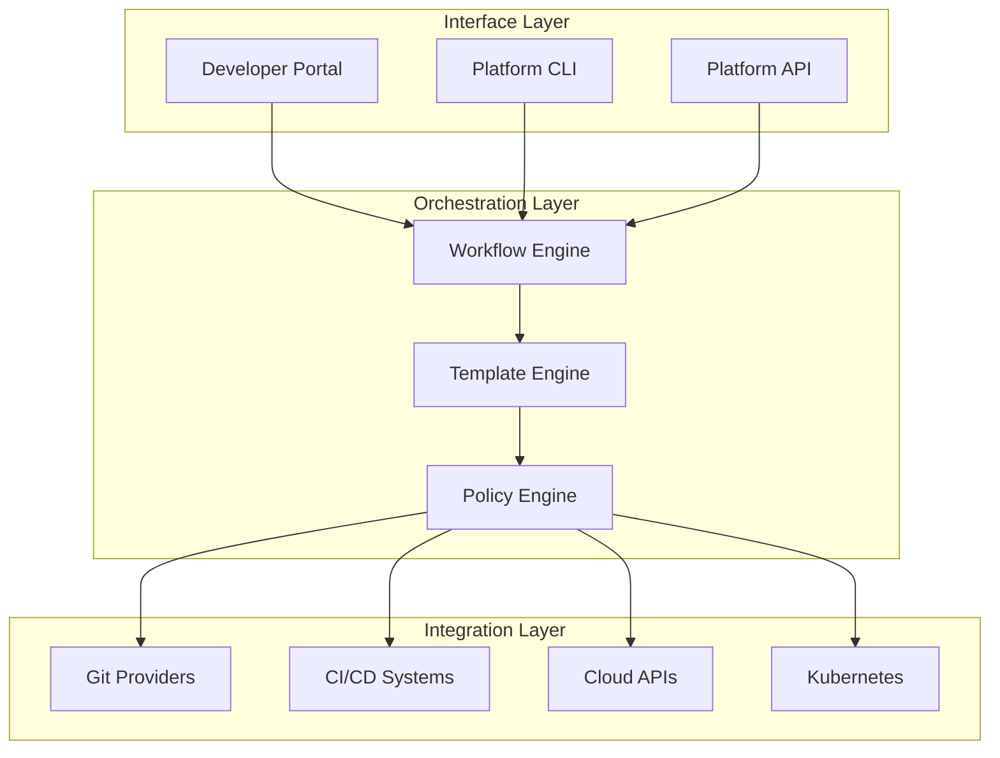

# How to Configure Internal Developer Platforms

Author: [nawazdhandala](https://www.github.com/nawazdhandala)

Tags: Internal Developer Platform, IDP, Platform Engineering, DevOps, Self-Service, Backstage

Description: Step-by-step guide to configuring an internal developer platform that provides self-service capabilities for your engineering teams.

---

An internal developer platform (IDP) is a self-service layer on top of your infrastructure. Instead of filing tickets and waiting for operations, developers use the platform to provision resources, deploy services, and access everything they need to ship software.

## IDP Architecture Overview

A well-designed IDP has distinct layers that separate concerns and enable flexibility.



## Setting Up Backstage as Your IDP Foundation

Backstage is an open-source developer portal created by Spotify. It provides a solid foundation for building an IDP.

### Initial Backstage Configuration

Start by creating a Backstage app and configuring the basic settings.

```yaml
# app-config.yaml
# Core Backstage configuration

app:
  title: Acme Developer Platform
  baseUrl: http://localhost:3000

organization:
  name: Acme Corp

backend:
  baseUrl: http://localhost:7007
  listen:
    port: 7007
  database:
    client: pg
    connection:
      host: ${POSTGRES_HOST}
      port: ${POSTGRES_PORT}
      user: ${POSTGRES_USER}
      password: ${POSTGRES_PASSWORD}

# Authentication configuration
auth:
  environment: production
  providers:
    github:
      production:
        clientId: ${GITHUB_CLIENT_ID}
        clientSecret: ${GITHUB_CLIENT_SECRET}

# Catalog configuration for service discovery
catalog:
  import:
    entityFilename: catalog-info.yaml
  locations:
    # Load all catalog files from your repositories
    - type: url
      target: https://github.com/acme-corp/*/blob/main/catalog-info.yaml

    # Load team definitions
    - type: file
      target: ./catalog/teams.yaml

# Kubernetes integration
kubernetes:
  serviceLocatorMethod:
    type: multiTenant
  clusterLocatorMethods:
    - type: config
      clusters:
        - url: ${K8S_CLUSTER_URL}
          name: production
          authProvider: serviceAccount
          serviceAccountToken: ${K8S_TOKEN}
```

### Defining Your Software Catalog

The software catalog is the source of truth for all services, teams, and infrastructure. Define catalog entities in YAML files stored alongside your code.

```yaml
# catalog-info.yaml
# Place this in the root of each service repository

apiVersion: backstage.io/v1alpha1
kind: Component
metadata:
  name: payment-service
  description: Processes all payment transactions
  annotations:
    github.com/project-slug: acme-corp/payment-service
    backstage.io/techdocs-ref: dir:.
    prometheus.io/scrape: "true"
  tags:
    - python
    - payments
    - critical
  links:
    - url: https://grafana.acme.com/d/payments
      title: Grafana Dashboard
    - url: https://runbook.acme.com/payments
      title: Runbook
spec:
  type: service
  lifecycle: production
  owner: payments-team
  system: billing-system

  # Define service dependencies
  dependsOn:
    - resource:default/payments-database
    - component:default/notification-service

  # Define APIs this service provides
  providesApis:
    - payments-api

---
apiVersion: backstage.io/v1alpha1
kind: API
metadata:
  name: payments-api
  description: REST API for payment operations
spec:
  type: openapi
  lifecycle: production
  owner: payments-team
  definition:
    $text: ./openapi.yaml
```

### Configuring Team Ownership

Clear ownership is essential. Define teams in your catalog so every service has a responsible owner.

```yaml
# catalog/teams.yaml
# Team definitions for the organization

apiVersion: backstage.io/v1alpha1
kind: Group
metadata:
  name: payments-team
  description: Team responsible for payment processing
spec:
  type: team
  profile:
    displayName: Payments Team
    email: payments-team@acme.com
    picture: https://avatars.acme.com/payments-team.png
  children: []
  members:
    - alice.smith
    - bob.jones
    - charlie.brown

---
apiVersion: backstage.io/v1alpha1
kind: User
metadata:
  name: alice.smith
spec:
  profile:
    displayName: Alice Smith
    email: alice@acme.com
  memberOf:
    - payments-team
```

## Configuring Self-Service Templates

Templates enable developers to create new services, infrastructure, and configurations through a self-service workflow.

### Service Creation Template

This template creates a new microservice with all the standard configurations.

```yaml
# templates/create-service/template.yaml
apiVersion: scaffolder.backstage.io/v1beta3
kind: Template
metadata:
  name: create-microservice
  title: Create Microservice
  description: Create a new microservice with CI/CD, monitoring, and deployment config
  tags:
    - recommended
    - microservice
spec:
  owner: platform-team
  type: service

  # Input parameters collected from developers
  parameters:
    - title: Service Information
      required:
        - name
        - description
        - owner
      properties:
        name:
          title: Service Name
          type: string
          description: Unique name for your service (lowercase, no spaces)
          pattern: '^[a-z0-9-]+$'
        description:
          title: Description
          type: string
          description: Brief description of what this service does
        owner:
          title: Owner
          type: string
          description: Team that owns this service
          ui:field: OwnerPicker
          ui:options:
            catalogFilter:
              kind: Group

    - title: Technical Choices
      properties:
        language:
          title: Language
          type: string
          enum:
            - python
            - nodejs
            - go
          default: python
        database:
          title: Database
          type: string
          enum:
            - none
            - postgres
            - mongodb
          default: none
        deployEnvironments:
          title: Deploy Environments
          type: array
          items:
            type: string
            enum:
              - development
              - staging
              - production
          default:
            - development
            - staging

  # Actions to execute when template is used
  steps:
    # Generate service files from skeleton
    - id: fetch-skeleton
      name: Fetch Service Skeleton
      action: fetch:template
      input:
        url: ./skeleton/${{ parameters.language }}
        values:
          name: ${{ parameters.name }}
          description: ${{ parameters.description }}
          owner: ${{ parameters.owner }}
          database: ${{ parameters.database }}

    # Create the GitHub repository
    - id: create-repo
      name: Create Repository
      action: publish:github
      input:
        repoUrl: github.com?owner=acme-corp&repo=${{ parameters.name }}
        description: ${{ parameters.description }}
        defaultBranch: main
        repoVisibility: internal

    # Register in the catalog
    - id: register-catalog
      name: Register in Catalog
      action: catalog:register
      input:
        repoContentsUrl: ${{ steps['create-repo'].output.repoContentsUrl }}
        catalogInfoPath: /catalog-info.yaml

    # Create Kubernetes namespace and resources
    - id: create-k8s-resources
      name: Create Kubernetes Resources
      action: kubernetes:apply
      input:
        manifestPath: ./kubernetes-manifests
        namespace: ${{ parameters.name }}

  # Output shown to developer after completion
  output:
    links:
      - title: Repository
        url: ${{ steps['create-repo'].output.remoteUrl }}
      - title: Open in Catalog
        icon: catalog
        entityRef: ${{ steps['register-catalog'].output.entityRef }}
```

### Database Provisioning Template

Allow developers to provision databases without infrastructure tickets.

```yaml
# templates/provision-database/template.yaml
apiVersion: scaffolder.backstage.io/v1beta3
kind: Template
metadata:
  name: provision-postgres
  title: Provision PostgreSQL Database
  description: Create a new PostgreSQL database for your service
spec:
  owner: platform-team
  type: resource

  parameters:
    - title: Database Configuration
      required:
        - serviceName
        - environment
        - size
      properties:
        serviceName:
          title: Service Name
          type: string
          description: Name of the service that will use this database
          ui:field: EntityPicker
          ui:options:
            catalogFilter:
              kind: Component
        environment:
          title: Environment
          type: string
          enum:
            - development
            - staging
            - production
        size:
          title: Size
          type: string
          enum:
            - small
            - medium
            - large
          enumNames:
            - Small (2 CPU, 4GB RAM, 20GB storage)
            - Medium (4 CPU, 8GB RAM, 50GB storage)
            - Large (8 CPU, 16GB RAM, 100GB storage)
          default: small

  steps:
    # Generate Terraform configuration
    - id: generate-terraform
      name: Generate Terraform Config
      action: fetch:template
      input:
        url: ./terraform-template
        targetPath: terraform
        values:
          serviceName: ${{ parameters.serviceName }}
          environment: ${{ parameters.environment }}
          size: ${{ parameters.size }}

    # Create PR with database configuration
    - id: create-pr
      name: Create Infrastructure PR
      action: publish:github:pull-request
      input:
        repoUrl: github.com?owner=acme-corp&repo=infrastructure
        branchName: provision-db-${{ parameters.serviceName }}-${{ parameters.environment }}
        title: "Provision database for ${{ parameters.serviceName }} (${{ parameters.environment }})"
        description: |
          This PR provisions a PostgreSQL database:
          - Service: ${{ parameters.serviceName }}
          - Environment: ${{ parameters.environment }}
          - Size: ${{ parameters.size }}

  output:
    links:
      - title: Review PR
        url: ${{ steps['create-pr'].output.remoteUrl }}
```

## Integrating with Kubernetes

Your IDP needs tight integration with Kubernetes to show developers what is running and enable self-service operations.

### Kubernetes Plugin Configuration

```yaml
# app-config.yaml additions for Kubernetes

kubernetes:
  serviceLocatorMethod:
    type: multiTenant
  clusterLocatorMethods:
    - type: config
      clusters:
        - url: https://k8s-prod.acme.internal
          name: production
          authProvider: serviceAccount
          serviceAccountToken: ${K8S_PROD_TOKEN}
          dashboardUrl: https://k8s-dashboard.acme.internal
          dashboardApp: standard
        - url: https://k8s-staging.acme.internal
          name: staging
          authProvider: serviceAccount
          serviceAccountToken: ${K8S_STAGING_TOKEN}

  # Custom resource types to display
  customResources:
    - group: 'argoproj.io'
      apiVersion: 'v1alpha1'
      plural: 'applications'
    - group: 'monitoring.coreos.com'
      apiVersion: 'v1'
      plural: 'servicemonitors'
```

### Adding Kubernetes Annotations to Services

Add annotations to your catalog entities to link them with Kubernetes resources.

```yaml
# catalog-info.yaml additions
metadata:
  annotations:
    # Link to Kubernetes deployments
    backstage.io/kubernetes-id: payment-service
    backstage.io/kubernetes-namespace: payments
    backstage.io/kubernetes-label-selector: app=payment-service
```

## Configuring CI/CD Integration

Show build and deployment status directly in your developer portal.

```yaml
# app-config.yaml additions for CI/CD

integrations:
  github:
    - host: github.com
      token: ${GITHUB_TOKEN}

proxy:
  '/argocd/api':
    target: https://argocd.acme.internal/api/v1
    headers:
      Authorization: Bearer ${ARGOCD_TOKEN}

# GitHub Actions integration
githubActions:
  host: https://github.com
```

### Linking Services to CI/CD Pipelines

```yaml
# catalog-info.yaml additions for CI/CD
metadata:
  annotations:
    # GitHub Actions workflows
    github.com/project-slug: acme-corp/payment-service

    # ArgoCD application
    argocd/app-name: payment-service-prod

    # Jenkins pipeline (if using Jenkins)
    jenkins.io/job-full-name: acme-corp/payment-service/main
```

## Implementing Policy Guardrails

Your IDP should enforce organizational policies automatically, not through manual review.

### Open Policy Agent Integration

```yaml
# policies/service-requirements.rego
# Policies that all services must follow

package backstage.service

# All services must have an owner
deny[msg] {
    input.spec.owner == ""
    msg := "Service must have an owner specified"
}

# Production services must have runbook links
deny[msg] {
    input.spec.lifecycle == "production"
    not has_runbook_link
    msg := "Production services must have a runbook link"
}

has_runbook_link {
    some link
    input.metadata.links[link].title == "Runbook"
}

# Critical services must have on-call configured
deny[msg] {
    input.metadata.tags[_] == "critical"
    not input.metadata.annotations["pagerduty.com/service-id"]
    msg := "Critical services must have PagerDuty configured"
}
```

## Monitoring Your IDP

Track adoption and identify bottlenecks in your platform.

```yaml
# monitoring/idp-dashboard.yaml
# Grafana dashboard for IDP metrics

panels:
  - title: Template Usage
    type: stat
    query: |
      sum(increase(scaffolder_task_count_total[30d])) by (template_name)

  - title: Average Provisioning Time
    type: timeseries
    query: |
      histogram_quantile(0.95,
        rate(scaffolder_task_duration_seconds_bucket[1h])
      )

  - title: Catalog Entity Count
    type: gauge
    query: |
      count(catalog_entities_total) by (kind)

  - title: Failed Template Runs
    type: stat
    query: |
      sum(increase(scaffolder_task_count_total{status="failed"}[7d]))
```

---

A well-configured IDP transforms how your organization builds software. Developers get self-service access to everything they need, while platform teams maintain control through templates and policies. Start with a service catalog, add templates for your most common workflows, and iterate based on what your developers actually use. The goal is to make the right thing the easy thing.
