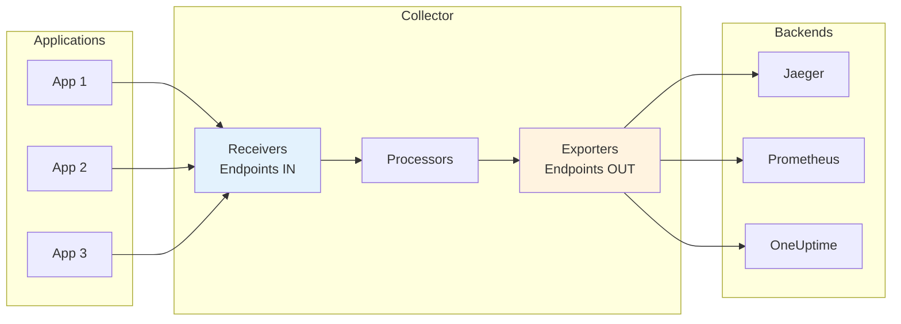
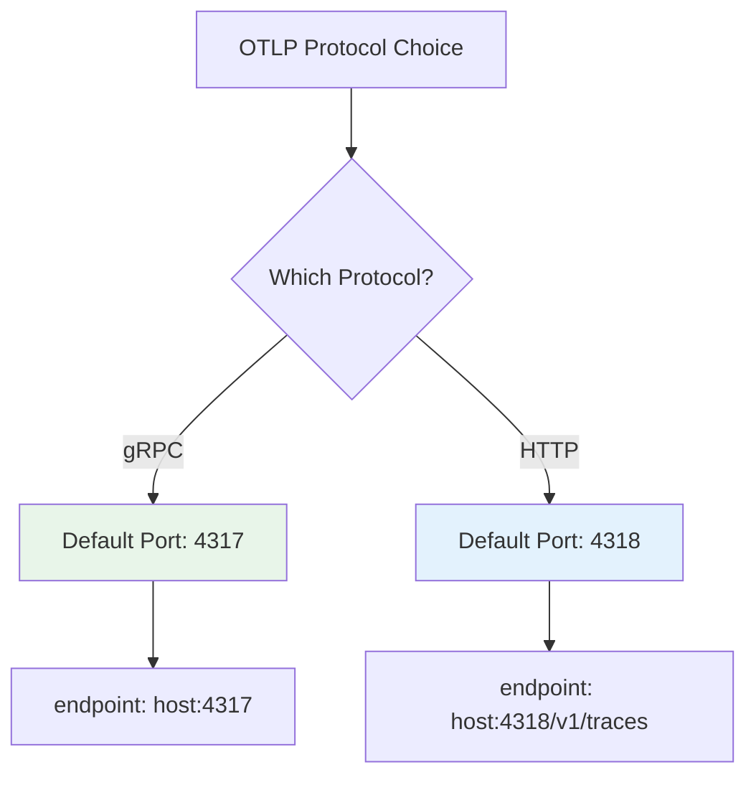
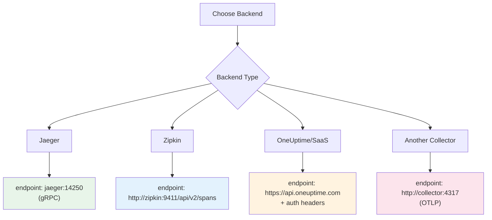
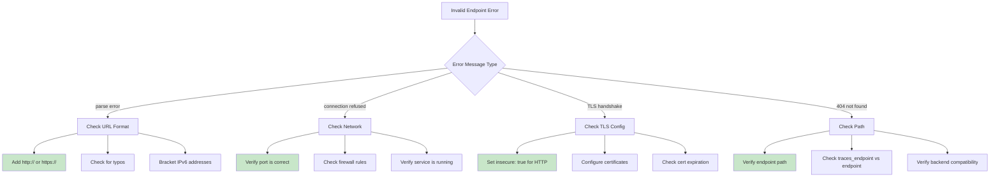

# How to Fix 'Invalid Endpoint' Collector Errors

Author: [nawazdhandala](https://www.github.com/nawazdhandala)

Tags: OpenTelemetry, Collector, Debugging, OTLP, Configuration, Observability

Description: A practical guide to diagnosing and fixing 'invalid endpoint' errors in OpenTelemetry Collector configurations, covering common mistakes and solutions.

---

The OpenTelemetry Collector is a crucial component in most observability pipelines, but misconfigured endpoints can lead to frustrating "invalid endpoint" errors. This guide will help you understand the common causes of these errors and how to fix them systematically.

## Understanding Collector Endpoints

The OpenTelemetry Collector uses endpoints in two main contexts: receivers (where data comes in) and exporters (where data goes out). Each has its own configuration requirements.



## Common "Invalid Endpoint" Errors

### Error Type 1: Malformed URL in Exporters

```yaml
# WRONG: Missing protocol scheme
exporters:
  otlp:
    endpoint: collector.example.com:4317  # Error: invalid endpoint

# CORRECT: Include the scheme for gRPC
exporters:
  otlp:
    endpoint: http://collector.example.com:4317
    tls:
      insecure: true  # Required for plain HTTP

# CORRECT: For HTTPS/TLS
exporters:
  otlp:
    endpoint: https://collector.example.com:4317
```

### Error Type 2: Port Mismatch Between Protocols

OTLP supports two protocols with different default ports:



```yaml
# WRONG: Using HTTP port with gRPC exporter
exporters:
  otlp:
    endpoint: http://collector:4318  # Wrong port for gRPC!

# CORRECT: gRPC uses port 4317
exporters:
  otlp:
    endpoint: http://collector:4317
    tls:
      insecure: true

# CORRECT: HTTP exporter uses port 4318
exporters:
  otlphttp:
    endpoint: http://collector:4318
```

### Error Type 3: Missing Path for HTTP Endpoints

```yaml
# WRONG: HTTP exporter without proper path
exporters:
  otlphttp:
    endpoint: http://collector:4318  # May work but better to be explicit

# CORRECT: Specify the signal-specific path
exporters:
  otlphttp:
    traces_endpoint: http://collector:4318/v1/traces
    metrics_endpoint: http://collector:4318/v1/metrics
    logs_endpoint: http://collector:4318/v1/logs
```

### Error Type 4: IPv6 Address Format

```yaml
# WRONG: Unbracketed IPv6 address
exporters:
  otlp:
    endpoint: http://::1:4317  # Invalid!

# CORRECT: IPv6 addresses must be in brackets
exporters:
  otlp:
    endpoint: http://[::1]:4317
    tls:
      insecure: true

# CORRECT: IPv6 with full address
exporters:
  otlp:
    endpoint: http://[2001:db8::1]:4317
    tls:
      insecure: true
```

## Receiver Endpoint Configuration

Receivers have different configuration patterns than exporters.

```yaml
# Receiver configuration examples
receivers:
  # OTLP receiver - listens for incoming telemetry
  otlp:
    protocols:
      grpc:
        # CORRECT: Just host:port for receivers
        endpoint: 0.0.0.0:4317
      http:
        # CORRECT: HTTP protocol endpoint
        endpoint: 0.0.0.0:4318

  # WRONG: Including scheme in receiver endpoint
  # otlp:
  #   protocols:
  #     grpc:
  #       endpoint: http://0.0.0.0:4317  # Invalid for receiver!

  # Prometheus receiver - scrapes metrics
  prometheus:
    config:
      scrape_configs:
        - job_name: 'my-service'
          # CORRECT: Full URL for scrape targets
          static_configs:
            - targets: ['localhost:8080']
          # WRONG: Including scheme in targets
          # static_configs:
          #   - targets: ['http://localhost:8080']  # Invalid!
```

## Complete Configuration Example

Here is a complete, working collector configuration with properly configured endpoints:

```yaml
# otel-collector-config.yaml

# Receivers: Where telemetry data enters the collector
receivers:
  # OTLP receiver accepts data from instrumented applications
  otlp:
    protocols:
      # gRPC endpoint for high-performance streaming
      grpc:
        endpoint: 0.0.0.0:4317
        # Optional: Configure maximum message size
        max_recv_msg_size_mib: 4
      # HTTP endpoint for environments where gRPC is not available
      http:
        endpoint: 0.0.0.0:4318
        # Optional: Enable CORS for browser-based applications
        cors:
          allowed_origins:
            - "http://localhost:3000"
          allowed_headers:
            - "Content-Type"

  # Jaeger receiver for legacy Jaeger instrumentation
  jaeger:
    protocols:
      grpc:
        endpoint: 0.0.0.0:14250
      thrift_http:
        endpoint: 0.0.0.0:14268

  # Zipkin receiver for Zipkin-instrumented applications
  zipkin:
    endpoint: 0.0.0.0:9411

# Processors: Transform and filter telemetry data
processors:
  # Batch processor groups data for efficient export
  batch:
    timeout: 5s
    send_batch_size: 1000
    send_batch_max_size: 1500

  # Memory limiter prevents out-of-memory situations
  memory_limiter:
    check_interval: 1s
    limit_mib: 512
    spike_limit_mib: 128

# Exporters: Where telemetry data is sent
exporters:
  # OTLP gRPC exporter to another collector or backend
  otlp:
    endpoint: http://upstream-collector:4317
    tls:
      insecure: true
    # Retry configuration for reliability
    retry_on_failure:
      enabled: true
      initial_interval: 5s
      max_interval: 30s
      max_elapsed_time: 300s

  # OTLP HTTP exporter (useful when gRPC is blocked)
  otlphttp:
    endpoint: https://api.oneuptime.com
    headers:
      # Authentication header for the backend
      x-oneuptime-token: "${ONEUPTIME_TOKEN}"
    # Compression reduces bandwidth usage
    compression: gzip

  # Jaeger exporter for Jaeger backend
  jaeger:
    endpoint: http://jaeger:14250
    tls:
      insecure: true

  # Prometheus exporter exposes metrics for scraping
  prometheus:
    endpoint: 0.0.0.0:8889
    namespace: otel
    # Resource attributes to include as labels
    resource_to_telemetry_conversion:
      enabled: true

  # Debug exporter for troubleshooting
  debug:
    verbosity: detailed
    sampling_initial: 5
    sampling_thereafter: 200

# Extensions: Additional collector capabilities
extensions:
  # Health check endpoint
  health_check:
    endpoint: 0.0.0.0:13133
    path: "/health"

  # Performance profiler endpoint
  pprof:
    endpoint: 0.0.0.0:1777

  # zPages for debugging
  zpages:
    endpoint: 0.0.0.0:55679

# Service: Ties everything together
service:
  extensions: [health_check, pprof, zpages]

  pipelines:
    # Traces pipeline
    traces:
      receivers: [otlp, jaeger, zipkin]
      processors: [memory_limiter, batch]
      exporters: [otlp, otlphttp, jaeger]

    # Metrics pipeline
    metrics:
      receivers: [otlp]
      processors: [memory_limiter, batch]
      exporters: [otlphttp, prometheus]

    # Logs pipeline
    logs:
      receivers: [otlp]
      processors: [memory_limiter, batch]
      exporters: [otlphttp]

  # Telemetry configuration for the collector itself
  telemetry:
    logs:
      level: info
    metrics:
      address: 0.0.0.0:8888
```

## Debugging Invalid Endpoint Errors

### Step 1: Enable Debug Logging

```yaml
service:
  telemetry:
    logs:
      level: debug  # Increase log verbosity
      # Output format options: json or console
      encoding: console
```

### Step 2: Use the Debug Exporter

```yaml
exporters:
  debug:
    verbosity: detailed

service:
  pipelines:
    traces:
      receivers: [otlp]
      processors: [batch]
      exporters: [debug]  # Add debug exporter to see what's being processed
```

### Step 3: Validate Configuration

```bash
# Validate collector configuration before starting
otelcol validate --config=/path/to/config.yaml

# Check configuration with verbose output
otelcol validate --config=/path/to/config.yaml 2>&1 | grep -i endpoint
```

### Step 4: Test Network Connectivity

```bash
# Test gRPC endpoint connectivity
grpcurl -plaintext collector:4317 list

# Test HTTP endpoint
curl -v http://collector:4318/v1/traces \
  -H "Content-Type: application/json" \
  -d '{}'

# Check if port is open
nc -zv collector 4317

# DNS resolution check
nslookup collector
dig collector
```

## Endpoint Configuration by Backend

Different backends require specific endpoint configurations:



```yaml
# Backend-specific configurations

# Jaeger
exporters:
  jaeger:
    endpoint: jaeger-collector:14250
    tls:
      insecure: true

# Zipkin
exporters:
  zipkin:
    endpoint: http://zipkin:9411/api/v2/spans
    format: proto  # or json

# Generic OTLP backend (OneUptime, Grafana, etc.)
exporters:
  otlphttp:
    endpoint: https://api.oneuptime.com
    headers:
      Authorization: "Bearer ${API_TOKEN}"

# Another OpenTelemetry Collector
exporters:
  otlp:
    endpoint: http://upstream-collector:4317
    tls:
      insecure: true
```

## Environment Variable Substitution

Use environment variables to manage endpoints across environments:

```yaml
# Using environment variables for flexible configuration
receivers:
  otlp:
    protocols:
      grpc:
        # Use env var with default value
        endpoint: ${OTLP_GRPC_ENDPOINT:-0.0.0.0:4317}
      http:
        endpoint: ${OTLP_HTTP_ENDPOINT:-0.0.0.0:4318}

exporters:
  otlphttp:
    # Required env var (will fail if not set)
    endpoint: ${BACKEND_ENDPOINT}
    headers:
      Authorization: "Bearer ${API_TOKEN}"
```

```bash
# Set environment variables before starting collector
export BACKEND_ENDPOINT="https://api.oneuptime.com"
export API_TOKEN="your-api-token-here"
export OTLP_GRPC_ENDPOINT="0.0.0.0:4317"

# Start the collector
otelcol --config=/path/to/config.yaml
```

## Troubleshooting Flowchart



## Summary

Invalid endpoint errors in the OpenTelemetry Collector typically stem from a few common issues: missing URL schemes, incorrect ports for the protocol type, improperly formatted IPv6 addresses, or misconfigured TLS settings. By understanding the differences between receiver and exporter endpoint configurations, using proper URL formats, and leveraging the collector's validation and debugging tools, you can quickly identify and fix these configuration issues. Always validate your configuration before deployment and use environment variables to manage endpoint differences across environments.

**Related Reading:**

- [How to Configure OpenTelemetry Processors](https://oneuptime.com/blog/post/2026-01-24-configure-opentelemetry-processors/view)
- [How to Fix "Memory Limit Exceeded" Collector Errors](https://oneuptime.com/blog/post/2026-01-24-memory-limit-exceeded-collector/view)
- [How to Fix "Span Not Exported" Issues](https://oneuptime.com/blog/post/2026-01-24-span-not-exported-issues/view)
