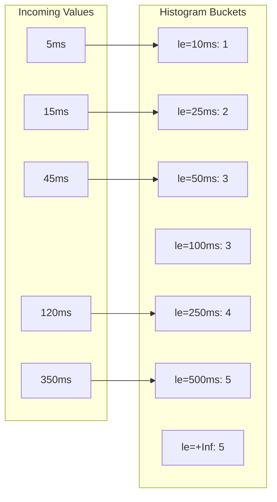
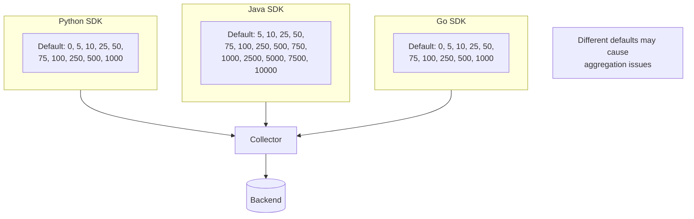
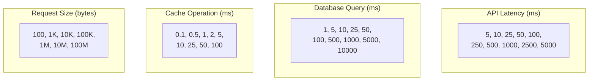

# How to Fix "Invalid Histogram Bucket" Errors

Author: [nawazdhandala](https://www.github.com/nawazdhandala)

Tags: OpenTelemetry, Metrics, Histogram, Debugging, Observability, Prometheus

Description: Learn how to diagnose and fix invalid histogram bucket errors in OpenTelemetry metrics collection.

---

Invalid histogram bucket errors occur when histogram metrics have misconfigured bucket boundaries, leading to data loss or incorrect aggregations. This guide explains how to identify and fix these issues.

## Understanding Histogram Buckets

Histograms in OpenTelemetry use buckets to categorize observations. Each bucket counts how many observations fall at or below its boundary.



## Common Invalid Histogram Bucket Errors

### Error 1: Non-Monotonic Bucket Boundaries

Bucket boundaries must be strictly increasing.

```python
# Incorrect: Boundaries not in ascending order
from opentelemetry import metrics
from opentelemetry.sdk.metrics import MeterProvider
from opentelemetry.sdk.metrics.view import View, ExplicitBucketHistogramAggregation

# This will cause an error
bad_boundaries = [100, 50, 200, 25]  # Not sorted!

view = View(
    instrument_name="http_request_duration",
    aggregation=ExplicitBucketHistogramAggregation(
        boundaries=bad_boundaries  # Error: boundaries must be sorted
    )
)
```

```python
# Correct: Boundaries in ascending order
good_boundaries = [25, 50, 100, 200]  # Properly sorted

view = View(
    instrument_name="http_request_duration",
    aggregation=ExplicitBucketHistogramAggregation(
        boundaries=good_boundaries
    )
)
```

### Error 2: Duplicate Bucket Boundaries

Each boundary must be unique.

```python
# Incorrect: Duplicate boundaries
bad_boundaries = [10, 25, 25, 50, 100]  # 25 appears twice

# Correct: Unique boundaries
good_boundaries = [10, 25, 50, 100]
```

### Error 3: Negative or NaN Boundaries

Bucket boundaries must be valid positive numbers.

```python
import math

# Incorrect: Invalid boundary values
bad_boundaries = [-10, 25, math.nan, 100, math.inf]

# Correct: Valid positive boundaries
# Note: +Inf is automatically added as the final bucket
good_boundaries = [10, 25, 50, 100]
```

### Error 4: Empty Boundaries Array

At least one explicit boundary is required for explicit bucket histograms.

```python
# Incorrect: Empty boundaries
bad_boundaries = []

# Correct: At least one boundary
# For request latencies, use appropriate boundaries
good_boundaries = [5, 10, 25, 50, 100, 250, 500, 1000]
```

## Diagnosing Histogram Bucket Errors

### Step 1: Enable Debug Logging

```python
import logging

logging.basicConfig(level=logging.DEBUG)
logging.getLogger("opentelemetry").setLevel(logging.DEBUG)
```

### Step 2: Check Collector Logs

Look for errors in the OpenTelemetry Collector logs.

```bash
# View collector logs
docker logs otel-collector 2>&1 | grep -i "histogram\|bucket\|invalid"
```

Common error messages:

```
Error: histogram bucket bounds must be in strictly increasing order
Error: histogram bucket count does not match boundary count
Error: invalid histogram: negative bucket count
```

### Step 3: Inspect Exported Metrics

Use a console exporter to see the raw metrics.

```python
from opentelemetry import metrics
from opentelemetry.sdk.metrics import MeterProvider
from opentelemetry.sdk.metrics.export import (
    ConsoleMetricExporter,
    PeriodicExportingMetricReader
)

# Set up console exporter for debugging
exporter = ConsoleMetricExporter()
reader = PeriodicExportingMetricReader(exporter, export_interval_millis=5000)
provider = MeterProvider(metric_readers=[reader])
metrics.set_meter_provider(provider)

# Create and use histogram
meter = metrics.get_meter(__name__)
histogram = meter.create_histogram(
    name="test_histogram",
    description="Test histogram for debugging",
    unit="ms"
)

# Record some values
histogram.record(50)
histogram.record(150)
histogram.record(350)
```

## Fixing Invalid Histogram Bucket Errors

### Solution 1: Define Proper Bucket Boundaries

Choose boundaries that match your data distribution.

```python
from opentelemetry import metrics
from opentelemetry.sdk.metrics import MeterProvider
from opentelemetry.sdk.metrics.view import View, ExplicitBucketHistogramAggregation
from opentelemetry.sdk.metrics.export import PeriodicExportingMetricReader
from opentelemetry.exporter.otlp.proto.grpc.metric_exporter import OTLPMetricExporter

# Define meaningful boundaries for HTTP latencies (in milliseconds)
http_latency_boundaries = [
    5,      # Very fast responses
    10,     # Fast responses
    25,     # Normal responses
    50,     # Slightly slow
    100,    # Slow
    250,    # Very slow
    500,    # Timeout warning
    1000,   # Near timeout
    2500,   # Critical
    5000,   # Severely degraded
    10000   # Extreme latency
]

# Create a view with explicit boundaries
http_latency_view = View(
    instrument_name="http.server.duration",
    aggregation=ExplicitBucketHistogramAggregation(
        boundaries=http_latency_boundaries
    )
)

# Set up the meter provider with the view
exporter = OTLPMetricExporter(endpoint="localhost:4317")
reader = PeriodicExportingMetricReader(exporter)
provider = MeterProvider(
    metric_readers=[reader],
    views=[http_latency_view]
)
metrics.set_meter_provider(provider)
```

### Solution 2: Validate Boundaries Programmatically

Create a helper function to validate boundaries before use.

```python
def validate_histogram_boundaries(boundaries):
    """
    Validate histogram bucket boundaries.

    Args:
        boundaries: List of bucket boundaries

    Returns:
        Tuple of (is_valid, error_message)
    """
    import math

    if not boundaries:
        return False, "Boundaries list cannot be empty"

    if not isinstance(boundaries, (list, tuple)):
        return False, "Boundaries must be a list or tuple"

    for i, boundary in enumerate(boundaries):
        # Check for valid number
        if not isinstance(boundary, (int, float)):
            return False, f"Boundary at index {i} is not a number: {boundary}"

        # Check for NaN
        if math.isnan(boundary):
            return False, f"Boundary at index {i} is NaN"

        # Check for negative values
        if boundary < 0:
            return False, f"Boundary at index {i} is negative: {boundary}"

        # Check for infinity (should be auto-added)
        if math.isinf(boundary):
            return False, f"Boundary at index {i} is infinity (auto-added, do not include)"

    # Check for duplicates
    if len(boundaries) != len(set(boundaries)):
        return False, "Boundaries contain duplicate values"

    # Check for monotonic increase
    sorted_boundaries = sorted(boundaries)
    if boundaries != sorted_boundaries:
        return False, f"Boundaries not in ascending order. Should be: {sorted_boundaries}"

    return True, "Boundaries are valid"

# Usage
boundaries = [10, 25, 50, 100, 250]
is_valid, message = validate_histogram_boundaries(boundaries)

if is_valid:
    print("Boundaries are valid, creating histogram view")
    view = View(
        instrument_name="my_histogram",
        aggregation=ExplicitBucketHistogramAggregation(boundaries=boundaries)
    )
else:
    print(f"Invalid boundaries: {message}")
```

### Solution 3: Use Exponential Bucket Histograms

OpenTelemetry supports exponential histograms that automatically determine boundaries.

```python
from opentelemetry import metrics
from opentelemetry.sdk.metrics import MeterProvider
from opentelemetry.sdk.metrics.view import View
from opentelemetry.sdk.metrics.view import ExponentialBucketHistogramAggregation
from opentelemetry.sdk.metrics.export import PeriodicExportingMetricReader
from opentelemetry.exporter.otlp.proto.grpc.metric_exporter import OTLPMetricExporter

# Use exponential histogram for automatic bucket boundaries
exponential_view = View(
    instrument_name="http.server.duration",
    aggregation=ExponentialBucketHistogramAggregation(
        max_size=160,  # Maximum number of buckets
        max_scale=20   # Maximum scale factor
    )
)

exporter = OTLPMetricExporter(endpoint="localhost:4317")
reader = PeriodicExportingMetricReader(exporter)
provider = MeterProvider(
    metric_readers=[reader],
    views=[exponential_view]
)
metrics.set_meter_provider(provider)

# Create histogram - buckets will be automatically determined
meter = metrics.get_meter(__name__)
histogram = meter.create_histogram(
    name="http.server.duration",
    description="HTTP request duration",
    unit="ms"
)
```

### Solution 4: Fix Collector View Configuration

If the error occurs in the Collector, check your views configuration.

```yaml
# otel-collector-config.yaml
receivers:
  otlp:
    protocols:
      grpc:
        endpoint: 0.0.0.0:4317

processors:
  # Transform processor to fix histogram boundaries
  transform:
    metric_statements:
      - context: datapoint
        statements:
          # Filter out invalid histogram data points
          - keep() where IsMatch(metric.name, ".*") == true

exporters:
  otlp:
    endpoint: "backend:4317"

connectors:
  # Use connector to re-aggregate histograms with proper boundaries
  routing:
    default_pipelines: [metrics/output]

service:
  pipelines:
    metrics:
      receivers: [otlp]
      processors: [transform]
      exporters: [otlp]
```

## Common Scenarios and Fixes

### Scenario 1: Different SDKs with Different Defaults

Different language SDKs may have different default bucket boundaries.



**Fix: Standardize boundaries across all services.**

```python
# shared_metrics_config.py
# Use this configuration across all services

STANDARD_LATENCY_BOUNDARIES = [
    5, 10, 25, 50, 75, 100, 250, 500, 750, 1000, 2500, 5000, 10000
]

STANDARD_SIZE_BOUNDARIES = [
    100, 500, 1000, 5000, 10000, 50000, 100000, 500000, 1000000
]
```

### Scenario 2: Prometheus Compatibility Issues

Prometheus has specific requirements for histogram format.

```python
from opentelemetry import metrics
from opentelemetry.sdk.metrics import MeterProvider
from opentelemetry.sdk.metrics.view import View, ExplicitBucketHistogramAggregation
from opentelemetry.exporter.prometheus import PrometheusMetricReader

# Prometheus-compatible boundaries (must be strictly increasing)
prometheus_boundaries = [
    0.005, 0.01, 0.025, 0.05, 0.075, 0.1, 0.25, 0.5, 0.75, 1.0, 2.5, 5.0, 7.5, 10.0
]

prometheus_view = View(
    instrument_name="http_request_duration_seconds",
    aggregation=ExplicitBucketHistogramAggregation(
        boundaries=prometheus_boundaries
    )
)

# Set up Prometheus exporter
prometheus_reader = PrometheusMetricReader()
provider = MeterProvider(
    metric_readers=[prometheus_reader],
    views=[prometheus_view]
)
metrics.set_meter_provider(provider)
```

### Scenario 3: Dynamic Boundary Configuration

Load boundaries from configuration to avoid code changes.

```python
import yaml
from opentelemetry import metrics
from opentelemetry.sdk.metrics import MeterProvider
from opentelemetry.sdk.metrics.view import View, ExplicitBucketHistogramAggregation
from opentelemetry.sdk.metrics.export import PeriodicExportingMetricReader
from opentelemetry.exporter.otlp.proto.grpc.metric_exporter import OTLPMetricExporter

def load_histogram_config(config_path):
    """Load histogram configuration from YAML file."""
    with open(config_path, "r") as f:
        config = yaml.safe_load(f)
    return config

def create_views_from_config(config):
    """Create metric views from configuration."""
    views = []

    for histogram_config in config.get("histograms", []):
        name = histogram_config["name"]
        boundaries = histogram_config["boundaries"]

        # Validate boundaries
        is_valid, error = validate_histogram_boundaries(boundaries)
        if not is_valid:
            print(f"Warning: Invalid boundaries for {name}: {error}")
            continue

        view = View(
            instrument_name=name,
            aggregation=ExplicitBucketHistogramAggregation(
                boundaries=boundaries
            )
        )
        views.append(view)

    return views

# Configuration file (histogram_config.yaml)
"""
histograms:
  - name: http.server.duration
    boundaries: [5, 10, 25, 50, 100, 250, 500, 1000]
  - name: db.query.duration
    boundaries: [1, 5, 10, 25, 50, 100, 500, 1000, 5000]
  - name: cache.operation.duration
    boundaries: [0.1, 0.5, 1, 5, 10, 25, 50, 100]
"""

# Load and apply configuration
config = load_histogram_config("histogram_config.yaml")
views = create_views_from_config(config)

exporter = OTLPMetricExporter(endpoint="localhost:4317")
reader = PeriodicExportingMetricReader(exporter)
provider = MeterProvider(
    metric_readers=[reader],
    views=views
)
metrics.set_meter_provider(provider)
```

## Boundary Selection Guidelines

Choose bucket boundaries based on your use case.



### Use Case: HTTP Request Latencies

```python
# For typical web API latencies
# Focus on the 0-500ms range with more granularity
HTTP_LATENCY_BOUNDARIES = [
    5,      # Excellent (cache hit)
    10,     # Very good
    25,     # Good
    50,     # Acceptable
    100,    # Slow
    250,    # Very slow
    500,    # Poor
    1000,   # Bad
    2500,   # Critical
    5000,   # Failing
    10000   # Timeout
]
```

### Use Case: Database Queries

```python
# For database operations
# Wider range to capture slow queries
DB_QUERY_BOUNDARIES = [
    1,      # In-memory/cached
    5,      # Simple query
    10,     # Index lookup
    25,     # Small result set
    50,     # Medium query
    100,    # Complex query
    500,    # Large result set
    1000,   # Full table scan warning
    5000,   # Very slow query
    10000,  # Query timeout risk
    30000   # Critical
]
```

### Use Case: Message Processing

```python
# For message queue processing
# Balance between fast and slow consumers
MESSAGE_PROCESSING_BOUNDARIES = [
    1,      # Trivial processing
    5,      # Fast processing
    10,     # Normal processing
    50,     # Moderate processing
    100,    # Slow processing
    500,    # Very slow
    1000,   # Concerning
    5000,   # Consumer lag risk
    10000,  # Major issue
    60000   # Timeout
]
```

## Monitoring Histogram Health

Create alerts to detect histogram issues early.

```yaml
# prometheus-alerts.yaml
groups:
  - name: histogram-health
    rules:
      - alert: HistogramBucketCountMismatch
        expr: |
          count(histogram_bucket) by (le, job)
          !=
          count(histogram_bucket offset 5m) by (le, job)
        for: 5m
        labels:
          severity: warning
        annotations:
          summary: "Histogram bucket count changed"
          description: "Bucket count for {{ $labels.job }} changed unexpectedly"

      - alert: HistogramNoData
        expr: |
          sum(rate(histogram_bucket{le="+Inf"}[5m])) by (job) == 0
        for: 10m
        labels:
          severity: warning
        annotations:
          summary: "Histogram receiving no data"
          description: "{{ $labels.job }} histogram has no new data"
```

## Best Practices

1. **Choose boundaries based on expected data distribution** rather than arbitrary values.

2. **Use consistent boundaries across services** to enable meaningful aggregation.

3. **Validate boundaries programmatically** before creating views.

4. **Consider using exponential histograms** when you are not sure about data distribution.

5. **Document your boundary choices** so team members understand the reasoning.

6. **Monitor histogram health** with alerts for unexpected changes.

7. **Test with realistic data** to ensure boundaries capture the important ranges.

## Conclusion

Invalid histogram bucket errors can be avoided by understanding the requirements for bucket boundaries: they must be unique, positive, finite numbers in strictly ascending order. By validating boundaries, choosing appropriate values for your use case, and considering exponential histograms for automatic boundary determination, you can ensure your histogram metrics provide accurate insights into your system's behavior.
