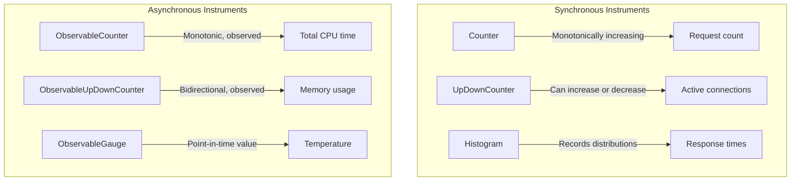
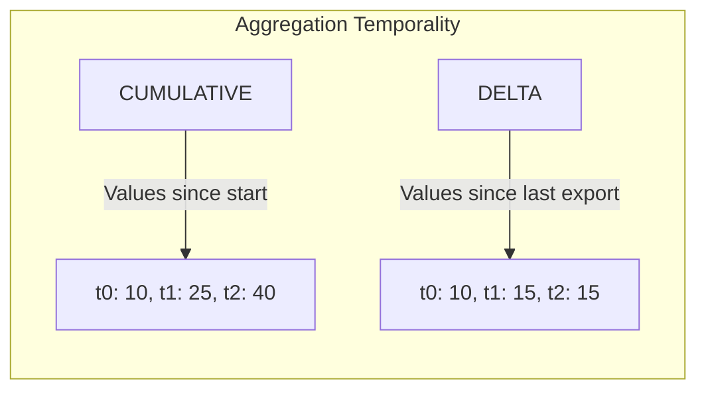
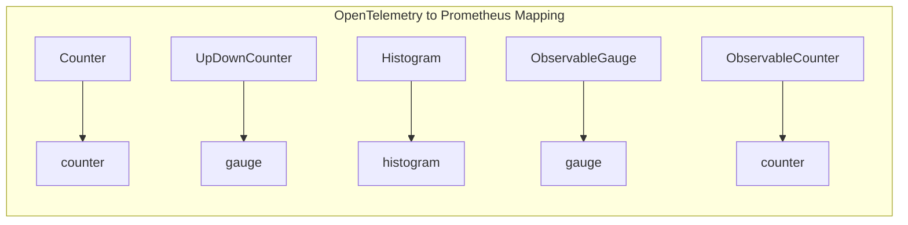
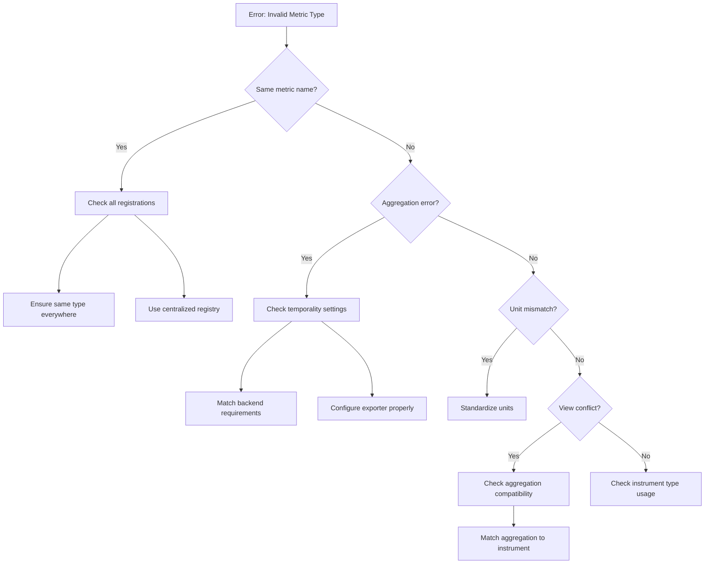

# How to Fix 'Invalid Metric Type' Errors

Author: [nawazdhandala](https://www.github.com/nawazdhandala)

Tags: OpenTelemetry, Metrics, Debugging, Observability, Error Handling, Prometheus, OTLP

Description: Learn how to diagnose and fix 'Invalid Metric Type' errors in OpenTelemetry, including common causes like type mismatches, aggregation conflicts, and backend compatibility issues.

---

"Invalid Metric Type" errors are among the most frustrating issues when working with OpenTelemetry metrics. These errors occur when there is a mismatch between how a metric is defined, how it is being recorded, or how the receiving backend expects to handle it. This guide walks through the common causes and provides practical solutions for each scenario.

## Understanding Metric Types

OpenTelemetry supports several metric instrument types, each designed for specific use cases:



## Common Error Scenarios

### 1. Type Mismatch During Registration

The most common cause of "Invalid Metric Type" errors is attempting to register a metric with a different type than previously registered.

**Error Message:**
```
Error: A metric with name 'http.request.count' already exists with a different type
```

**Cause:** Multiple parts of your code create the same metric with different instrument types.

```typescript
// File A: Creates a counter
const meter = metrics.getMeter('my-service');
const requestCount = meter.createCounter('http.request.count');

// File B: Attempts to create the same metric as a histogram
const meter = metrics.getMeter('my-service');
const requestLatency = meter.createHistogram('http.request.count');  // ERROR!
```

**Solution:** Ensure consistent metric definitions across your codebase. Create a centralized metrics registry:

```typescript
// metrics-registry.ts
// Centralized metric definitions to prevent type conflicts
import { metrics, Counter, Histogram, UpDownCounter } from '@opentelemetry/api';

// Create a single meter instance for the service
const meter = metrics.getMeter('my-service', '1.0.0');

// Define all metrics in one place with clear naming conventions
export const httpMetrics = {
  // Counter for total requests (monotonically increasing)
  requestCount: meter.createCounter('http.server.request.count', {
    description: 'Total number of HTTP requests',
    unit: '1',
  }),

  // Histogram for request duration distribution
  requestDuration: meter.createHistogram('http.server.request.duration', {
    description: 'HTTP request duration in milliseconds',
    unit: 'ms',
  }),

  // UpDownCounter for active requests (can go up and down)
  activeRequests: meter.createUpDownCounter('http.server.active_requests', {
    description: 'Number of active HTTP requests',
    unit: '1',
  }),
};

// Usage in other files
// import { httpMetrics } from './metrics-registry';
// httpMetrics.requestCount.add(1, { method: 'GET', route: '/api/users' });
```

### 2. Aggregation Temporality Conflicts

Different backends expect different aggregation temporalities. Prometheus expects cumulative, while some OTLP backends prefer delta.

**Error Message:**
```
Error: Invalid aggregation temporality for metric type Counter: expected CUMULATIVE, got DELTA
```

**Cause:** Your exporter is configured with an aggregation temporality that does not match what the backend expects.



**Solution:** Configure the correct aggregation temporality for your backend:

```typescript
// For Prometheus (requires CUMULATIVE)
import { PrometheusExporter } from '@opentelemetry/exporter-prometheus';

const exporter = new PrometheusExporter({
  port: 9464,
  // Prometheus always uses cumulative temporality
});
```

```typescript
// For OTLP with delta temporality preference
import { OTLPMetricExporter } from '@opentelemetry/exporter-metrics-otlp-http';
import {
  PeriodicExportingMetricReader,
  AggregationTemporality
} from '@opentelemetry/sdk-metrics';

const exporter = new OTLPMetricExporter({
  url: 'http://localhost:4318/v1/metrics',
  temporalityPreference: AggregationTemporality.DELTA,
});

const reader = new PeriodicExportingMetricReader({
  exporter,
  exportIntervalMillis: 15000,
});
```

```typescript
// For backends that require cumulative
import {
  PeriodicExportingMetricReader,
  AggregationTemporality
} from '@opentelemetry/sdk-metrics';

const reader = new PeriodicExportingMetricReader({
  exporter: new OTLPMetricExporter({
    url: 'http://localhost:4318/v1/metrics',
    temporalityPreference: AggregationTemporality.CUMULATIVE,
  }),
  exportIntervalMillis: 15000,
});
```

### 3. Histogram Boundary Mismatches

When using custom histogram boundaries, mismatches between definition and backend expectations can cause errors.

**Error Message:**
```
Error: Histogram boundaries must be monotonically increasing
```

**Cause:** Histogram bucket boundaries are not properly ordered or contain duplicates.

```typescript
// WRONG: Boundaries are not in ascending order
const histogram = meter.createHistogram('request.duration', {
  boundaries: [100, 50, 200, 25],  // ERROR!
});

// WRONG: Contains duplicates
const histogram = meter.createHistogram('request.duration', {
  boundaries: [25, 50, 50, 100],  // ERROR!
});
```

**Solution:** Define boundaries in strictly ascending order:

```typescript
// CORRECT: Properly ordered histogram boundaries
const histogram = meter.createHistogram('http.server.request.duration', {
  description: 'HTTP request duration',
  unit: 'ms',
  // Boundaries must be strictly ascending with no duplicates
  // These boundaries create buckets: [0-25), [25-50), [50-100), [100-250), [250-500), [500-1000), [1000+)
  advice: {
    explicitBucketBoundaries: [25, 50, 100, 250, 500, 1000],
  },
});
```

### 4. Unit Mismatch

Different definitions of the same metric with different units cause conflicts.

**Error Message:**
```
Error: Metric 'request.duration' already registered with unit 'ms', cannot register with unit 's'
```

**Solution:** Standardize units across your codebase:

```typescript
// metrics-config.ts
// Define standard units for consistency

export const METRIC_UNITS = {
  DURATION_MS: 'ms',
  DURATION_S: 's',
  BYTES: 'By',
  COUNT: '1',
  PERCENT: '%',
} as const;

// Always use the same unit for a given metric
const requestDuration = meter.createHistogram('http.request.duration', {
  unit: METRIC_UNITS.DURATION_MS,  // Consistently use milliseconds
});
```

### 5. View Configuration Conflicts

Views can transform metrics, but incorrect configuration leads to type errors.

**Error Message:**
```
Error: Cannot apply Sum aggregation to Histogram instrument
```

**Cause:** A view is configured with an incompatible aggregation for the instrument type.

```typescript
// WRONG: Applying Sum aggregation to a Histogram
import { View, Aggregation } from '@opentelemetry/sdk-metrics';

const invalidView = new View({
  instrumentName: 'http.request.duration',  // This is a Histogram
  aggregation: Aggregation.Sum(),  // Sum is incompatible with Histogram!
});
```

**Solution:** Use compatible aggregations for each instrument type:

```typescript
import {
  MeterProvider,
  View,
  Aggregation,
  InstrumentType
} from '@opentelemetry/sdk-metrics';

// Create views with compatible aggregations
const views = [
  // Histogram instrument - use Histogram or ExplicitBucketHistogram aggregation
  new View({
    instrumentName: 'http.request.duration',
    instrumentType: InstrumentType.HISTOGRAM,
    aggregation: Aggregation.ExplicitBucketHistogram({
      boundaries: [10, 25, 50, 100, 250, 500, 1000],
    }),
  }),

  // Counter instrument - use Sum aggregation
  new View({
    instrumentName: 'http.request.count',
    instrumentType: InstrumentType.COUNTER,
    aggregation: Aggregation.Sum(),
  }),

  // Drop a metric you don't need
  new View({
    instrumentName: 'internal.debug.*',
    aggregation: Aggregation.Drop(),
  }),
];

const meterProvider = new MeterProvider({
  views,
  readers: [metricReader],
});
```

### 6. Prometheus Type Mapping Issues

Prometheus has specific metric type requirements that differ from OpenTelemetry.



**Error Message:**
```
Error: Prometheus does not support negative values for Counter type
```

**Cause:** Using a Counter (which maps to Prometheus counter) with negative values.

**Solution:** Use the correct instrument type:

```typescript
// WRONG: Counter cannot have negative values
const connections = meter.createCounter('active.connections');
connections.add(-1);  // ERROR! Counters cannot decrease

// CORRECT: Use UpDownCounter for values that can decrease
const activeConnections = meter.createUpDownCounter('active.connections', {
  description: 'Number of active connections',
  unit: '1',
});

activeConnections.add(1);   // Connection opened
activeConnections.add(-1);  // Connection closed
```

## Debugging Workflow

When encountering "Invalid Metric Type" errors, follow this debugging workflow:



## Diagnostic Logging

Enable diagnostic logging to identify metric type issues:

```typescript
// Enable OpenTelemetry diagnostic logging
import { diag, DiagConsoleLogger, DiagLogLevel } from '@opentelemetry/api';

// Set logging level to DEBUG to see metric registration details
diag.setLogger(new DiagConsoleLogger(), DiagLogLevel.DEBUG);

// Now you'll see logs like:
// OpenTelemetry: Creating Counter 'http.request.count'
// OpenTelemetry: Metric 'http.request.count' already exists, returning existing instance
```

## Validation Helper

Create a validation helper to catch issues early:

```typescript
// metric-validator.ts
import { metrics, ValueType } from '@opentelemetry/api';

interface MetricDefinition {
  name: string;
  type: 'counter' | 'upDownCounter' | 'histogram' | 'gauge';
  unit: string;
  description: string;
}

// Track registered metrics to detect conflicts
const registeredMetrics = new Map<string, MetricDefinition>();

export function validateMetricDefinition(definition: MetricDefinition): void {
  const existing = registeredMetrics.get(definition.name);

  if (existing) {
    // Check for type mismatch
    if (existing.type !== definition.type) {
      throw new Error(
        `Metric type conflict: '${definition.name}' was registered as '${existing.type}' ` +
          `but is now being registered as '${definition.type}'`
      );
    }

    // Check for unit mismatch
    if (existing.unit !== definition.unit) {
      throw new Error(
        `Metric unit conflict: '${definition.name}' was registered with unit '${existing.unit}' ` +
          `but is now being registered with unit '${definition.unit}'`
      );
    }

    // Metric already registered with same type and unit, safe to reuse
    return;
  }

  // Register new metric definition
  registeredMetrics.set(definition.name, definition);
}

// Usage example
export function createValidatedCounter(
  name: string,
  unit: string,
  description: string
) {
  validateMetricDefinition({ name, type: 'counter', unit, description });

  const meter = metrics.getMeter('my-service');
  return meter.createCounter(name, { unit, description });
}
```

## Backend-Specific Considerations

### OneUptime

OneUptime accepts OTLP metrics with both delta and cumulative temporality:

```typescript
import { OTLPMetricExporter } from '@opentelemetry/exporter-metrics-otlp-http';

const exporter = new OTLPMetricExporter({
  url: 'https://oneuptime.com/otlp/v1/metrics',
  headers: {
    'x-oneuptime-token': process.env.ONEUPTIME_TOKEN,
    'Content-Type': 'application/json',
  },
});
```

### Prometheus

Prometheus requires cumulative temporality and has specific naming conventions:

```typescript
// Prometheus naming conventions:
// - Use snake_case
// - Suffix counters with _total
// - Suffix histograms with _bucket, _sum, _count
// - Use base units (seconds not milliseconds)

const meter = metrics.getMeter('my-service');

// Will be exported as http_requests_total
const httpRequests = meter.createCounter('http.requests', {
  unit: '1',
});

// Will be exported as http_request_duration_seconds_bucket, etc.
const httpDuration = meter.createHistogram('http.request.duration', {
  unit: 's',  // Use seconds for Prometheus
});
```

## Summary

To avoid "Invalid Metric Type" errors:

1. **Use a centralized metric registry** to prevent duplicate definitions with different types
2. **Configure the correct aggregation temporality** for your backend (cumulative for Prometheus, delta or cumulative for OTLP)
3. **Define histogram boundaries** in strictly ascending order without duplicates
4. **Standardize units** across your codebase
5. **Match aggregations to instrument types** when using Views
6. **Use the correct instrument type** for your data (Counter for monotonic, UpDownCounter for bidirectional)
7. **Enable diagnostic logging** during development to catch issues early

By following these practices, you can avoid the most common causes of metric type errors and ensure your telemetry data flows smoothly to your observability backend.
